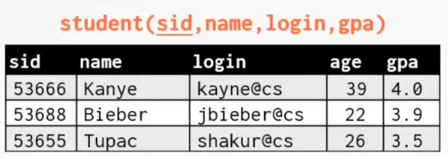
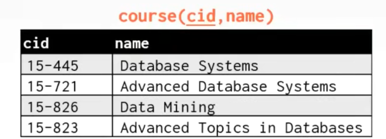
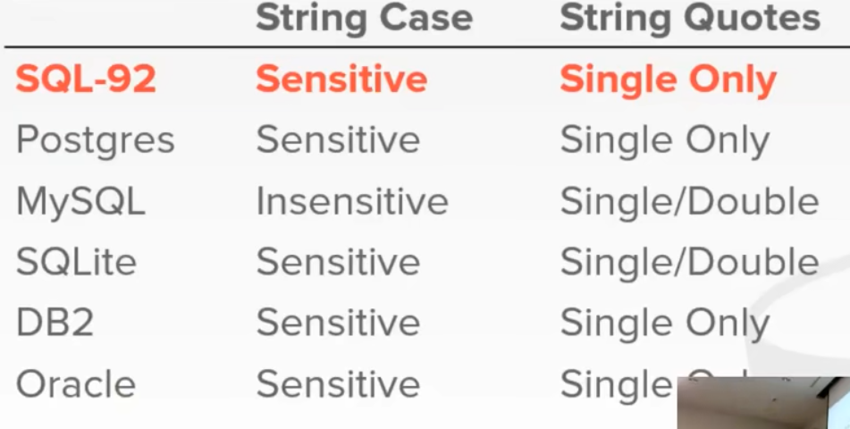
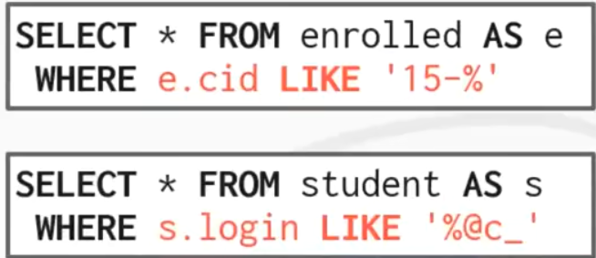
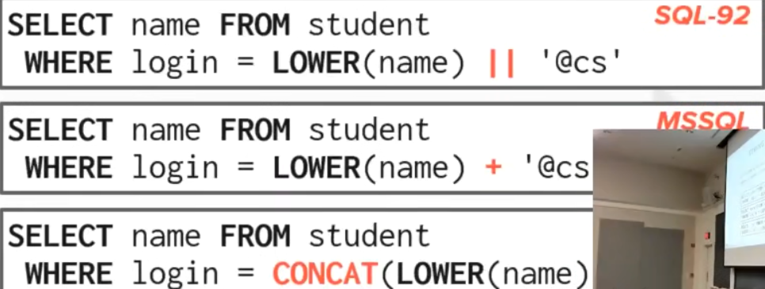
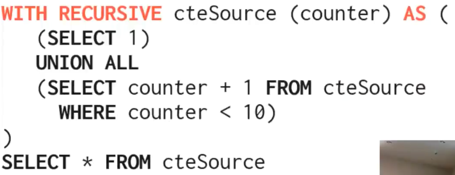
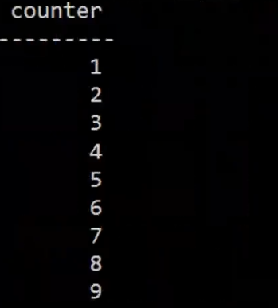
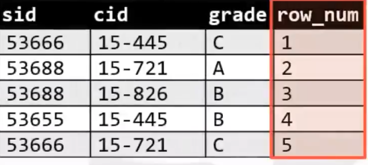
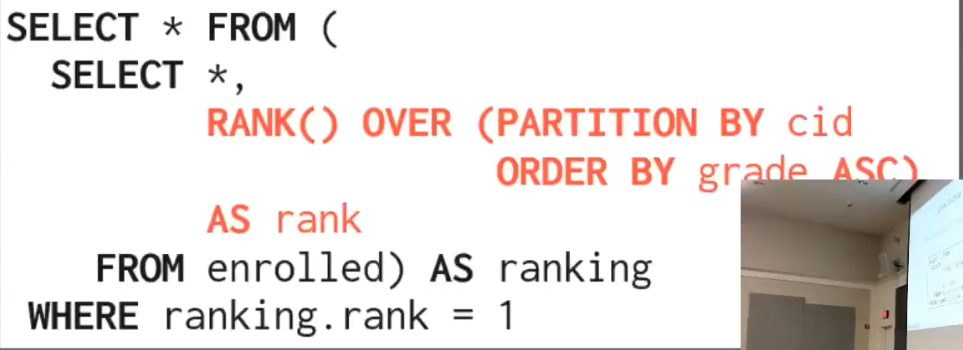

# Advanced Sql


大多数RDBMS**至少支持SQL-92**，同时也是最低要求。

Database Example:





## Aggregations and Group By

聚合函数：
* AVG(col) - 返回列col的平均值。
* MIN(col) - 返回列col的最小值。
* MAX(col) - 返回列col的最大值。
* SUM(col) - 返回列col的总和。
* COUNT(col) - 返回列col的数量。


聚合函数只能在SELECT输出列表中使用，**并且输出中不能有其他非聚合函数的字段，聚合函数之外的其他列的输出是未定义的**。

`DISTINCT`关键字可以过滤col中相同的元素，COUNT,SUM,AVG支持DISTINCT。


`GROUP BY`将tuple通过某个属性分类，然后再进行聚合，此时输出中才能有非聚合函数的列，但非聚合函数的列必须在`GROUP BY`中。


使用`HAVING`对聚合的结果进行过滤，类似`GROUP BY`的`WHERE`。


## String / Date / Time Operations

各数据库处理字符串的方式（大小写敏感和单双引号）：


_NOTE:Mysql不区分大小写。_

使用`LIKE`进行字符串匹配：
* `%`匹配任何字符串（包含空字符串）。
* `_`匹配任何一个字符。



其他String函数：


SQL-92标准可以使用`||`拼接字符串，大多数DBMS遵循这一点，但有部分不一样。

MSSQL使用`+`，Mysql使用函数`CONCAT`。



但Mysql字符串中间不放任何东西也会触发拼接。

```sql
SELECT 'A' 'B' 'C';
```
将输出字符串"ABC"。


时间类型切换粒度很容易，但是当你对时间类型进行操作和从它们中提取信息时，结果就会很不可靠，对于不同DBMS来说语法千差万别。

SQL标准定义了`NOW`函数，但在sqlite需要使用`CURRENT_TIMESTAMP`关键字。

PostgreSql和Mysql有`CURRENT_TIMESTAMP`关键字，并且Mysql也有`CURRENT_TIMESTAMP`函数。

PostgreSql计算时间差值可以直接使用`-`操作符，Mysql需要使用`DATADIFF`函数。

Sqlite中需要通过转换达到这一点，转换成公历。


## Output Control and Redirection

可以使用`INTO`语句对`SELECT`的输出进行重定向，table必须未被定义，但是存储过程中，`INTO`指向的变量必须已经声明。


但在Mysql中必须使用`CREATE TABLE`。


也可以将输出数据放在一张已经存在的表中，使用`INSERT INTO`来做到这一点。


一些系统检查到插入的数据违反原来表的约束会立即报错，没有tuple被写入。

某些系统会继续往下走，并忽略掉错误的那个tuple，或者直接崩溃了留下一张脏表。

可以通过`ORDER BY <col*> [AES,DES]`进行排序。


也可以同时排序多个列并选择不同的排序方向。


可以通过`LIMIT <count> OFFSET`限制输出的数，,offset从0开始。


## Nested Queries

嵌套查询允许你将一个查询的输出结果作为另一个查询的输入条件。


用于嵌套查询的判断关键字：
* ALL - 对于输出的全部tuple都满足条件。
* ANY - 对于输出的任意一个tuple满足条件。
* IN - 相当于`= ANY()`。
* EXISTS - 嵌套查询至少输出了一个tuple。

## Common Table Expressions


CTE允许你给嵌套查询定义一个别名。

`WITH`会在你执行查询之前执行。

CTE还允许你通过`RECURSIVE`关键字做递归操作。





**但你有可能遇上无限循环**。

## Window Functions

通过`OVER`来使用window functions：


function name必须是一个聚合函数或者其他window函数。

`OVER`定义了如何切割数据。

特殊window functions：
* ROW_NUMBER() - tuple在组中行的行号。
* RANK() - tuple在组中排序的位置。




还可以使用`PARTITION BY`指定分组：


同时可以使用`ORDER BY`来排序整个组中的tuple：




如果没有排序`RANK`的输出将一直是1。