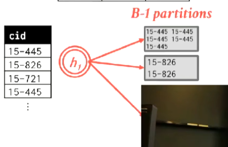
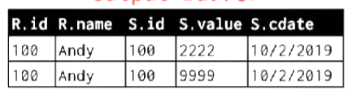
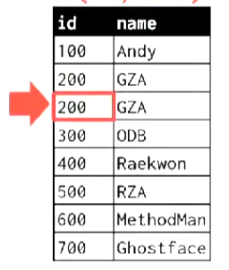
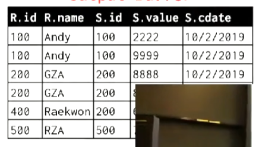

# Algorithm

Disk-oriented DBMS的table、index通常无法放在memory中。

同时operator产生的中间结果也可能无法放入memory中。

我们需要特殊设计的算法对数据进行操作。

我们会使用Buffer Pool Manager处理数据溢出到磁盘的情况。

我们的算法需要最大化循序I/O，让I/O操作的开销最小化。

## External Merge Sort

为什么我们需要排序：
* 在关系模型中，table中的tuple是无序的。
* 计算Aggregation（聚合）`GROUP BY`需要排序。
* 去除重复`DISTINCT`需要排序。

External Merge Sort由以下步骤组成：
1. Spliting（将每次要排序的数据拆分成几个runs）。
2. Sorting（排序每一个runs）。
3. Merging（进行多路归并排序将N个runs合并到一个输出中）。
4. Repeating（重复上述操作，直到所有数据完成排序）。

*NOTE:N为可使用的最大page数-1（有一个page需要存输出）。*

*NOTE:DBMS通常在配置文件中设置有working memory来表示每一个请求的中间操作，能够使用多少内存。*

要使排序可用，working memory至少要能够进行2-WAY External Merge Sort。

## 2-WAY External Merge Sort

当External Merge Sort的N为2时，它是一个2-WAY External Merge Sort。

运行这样的排序，至少需要3个page。


`N`为需要排序的数据的总页数。

它总共要进行的循环次数（`pass`）为：<code>1 + [log<sub>2</sub>N]</code>。

其中<code>[log<sub>2</sub>N]</code>向上取整。

I/O代价为：`2N * pass`。

## Double Buffering Optimization

通过perfetching对算法进行优化。

在排序时，获取下一个page，减少阻塞的发生。

在排序两个page时，先加载一个page。


在排序page 1时，后台获取page 2。


当page 1排序完成时，page 2立即可用。


## Gernal External Merge Sort

Gernal External Merge Sort是2-WAY External Merge Sort的推广。

它尽可能地利用working memory，进行K-WAY Merge，以尽可能减少I/O代价。


`N`为需要排序的总页数。

`B`为可用的内存总页数。

它总共要进行的循环次数（`pass`）为：<code>1 + [log<sub>B-1</sub>(N/B)]</code>。

其中<code>[log<sub>B-1</sub>(N/B)]</code>向上取整。

I/O代价为：`2N * pass`。

每一个pass的伪代码为：

```cpp

std::future<page_t> futures[B-1];

for(std::size_t i = 0;i != B-1;++i)
{
    request_read(futures[i],page_ids[i]);
}

for(std::size_t i = 0;i != B-1;++i)
{
    page_t page = get_from(futures[i]);
    sort_page(page);
    write_output(page);
}

```

## Using B+Trees For Sorting

当我们在需要排序的column上拥有一个Clustered B+Tree Index时。

我们就不需要执行External Merge Sort。

可用直接利用这个B+Tree完成输出。

因为Clustered Index与物理布局匹配，我们只进行循序I/O。


而Non-Clustered Index则需要做大量随机I/O，不能在sort中使用（除非我们有`where`条件否则不考虑使用非clustered的index）。

为了将随机I/O转化为循序I/O，我们需要对获取到的record id进行排序。

把page id小的放在前面，然后使用这些id进行循序扫描。

将扫描到的数据进行排序。


## Aggregations

有两种方式可以实现Aggregations：
* Sorting。
* Hashing。

无论磁盘有多快，通常hashing的方式会更好。

## Sort Aggregation

当tuple排序好时，排序的key相同的tuple总是相邻。

利用这个特性，就可以进行聚合操作。

```sql
SELECT DISTINCT cid
 FROM enrolled
WHERE grade IN ('B','C')
ORDER BY cid;
```


## External Hash Aggregation

当我们执行Aggregation时，我们利用working memory构建一个bucket hash table来帮我们完成操作。

External Hash Aggregation由以下几个步骤组成：
1. Partition - 逐页读入数据将tuple放入不同的partition中，相同key的tuple会被放在同一个partition中，每个partition由若个个page组成，当page满时，将page写出。 


2. ReHash - 对于每个partition，我们构建一个in-memory hash table来计算Aggregation。

`B`为可用的内存总页数。

`N`为数据总页数。

那么我们最大可有`B-1`个partition。

hash table的最大大小大为`B * (B - 1)`。

大概需要<code>$\sqrt{N}$</code>个buffer。

假设使用fudge factor（模糊因子）`f` > 1。

hash table的大小大约是<code>B * $\sqrt{f * N}$</code>。

```sql
SELECT DISTINCT cid
 FROM enrolled
WHERE grade IN ('B','C');
```

进行Partition，将tuple分布在不同的Partition中。



顺序处理每一个partition，并产生最终结果。


*NOTE:最终结果可能无法放入内存。*


## Join

始终将小的table作为join的左表，大的table作为join的右表。

```sql
SELECT R.id,S.cdata
 FROM R JOIN S
   ON R.id = S.id
WHERE S.value > 100;
```

有`M`个page在表`R`中，`m`个tuple在关系`R`中。

有`N`个page在表`S`中，`n`个tuple在关系`S`中。

## Nested Loop Join

Nested Loop Join（嵌套循环连接），是最简单的join算法。

并且，cross product只能使用Nested Loop Join求值。

## Simple Nested Loop Join

| | |
|-|-|
|||

Simple Nested Loop Join相当于嵌套执行两个foreach。


从两个关系中每次获取一个tuple，执行join操作。

I/O代价：`M + (m * N)`。

假设`R:M = 1000,m = 100,000`。

`S:N = 500,n = 40,000`。

那么I/O代价是：`M + (m * N) = 1000 + (100,000 * 500) = 50,001,000 IOs`。

假设每次I/O花费`0.1 ms`，那么总共需要使用`1.3 hours`完成I/O。


如果使用更小的table `S`作为outter table。

那么I/O代价是：`N + (n * M) = 500 + (40,000 * 1000) = 40,000,500 IOs`。

那么总共需要使用`1.1 hours`完成I/O。

## Block Nested Loop Join

Block Nested Loop Join是对Simple Nested Loop Join的优化。

| | |
|-|-|
|||

它每次获取一个block而不是一个tuple来减少I/O代价。


I/O代价：`M + (M * N)`。

假设`R:M = 1000,m = 100,000`。

`S:N = 500,n = 40,000`。

那么I/O代价是：`M + (M * N) = 1000 + (1000 * 500) = 501,000 IOs`。

假设每次I/O花费`0.1 ms`，那么总共需要使用`50 seconds`完成I/O。

## Block Nested Loop Join Optimization

假设我们最大使用`B`个page。

| | |
|-|-|
|||

如果我们尽可能地把outter table放在memory中，用`B - 2`个page保存它（一个page需要放置inner table，一个page放置output）。


I/O代价：<code>M +  ($\frac{M}{B-2}$ * N)</code>。

其中<code>$\frac{M}{B-2}$</code>向上取整。

假设`R:M = 1000,m = 100,000`。

`S:N = 500,n = 40,000`。

并且`B > M + 2`，即`B >= 1002`。

那么I/O代价是：<code>M +  ($\frac{M}{B-2}$ * N) = 1000 + 500 = 1500 IOs</code>。

假设每次I/O花费`0.1 ms`，那么总共需要使用`0.15 seconds`完成I/O。

## Index Nested Loop Join


| | |
|-|-|
|||

如果我们在join的column上有index。


那么还可以采取另一种方式。


假设`C`为在index中探测每个tuple的成本。

那么I/O代价为：`M + (m * C)`。

## Sort-Merge Join

Sort-Merge Join是Nested Loop Join的替代品，有更好的性能。

Sort-Merge Join由以下步骤组成：
1. Sort - 将join的两张表按照join key进行排序（通常使用external merge sort）。
2. Merge - 使用游标在两张table中扫描，执行join操作（有可能回溯游标）。

比较两个curors，如果`outter > inner`,那么`inner + 1`。

如果`outter < inner`,那么`outter + 1`，`inner`进行回溯。

如果`outter == inner`，那么`emit tuple`。


| | |
|-|-|
|||

| R(id,name) | S(id,value,cdata) | Output Buffer|
|-|-|-|
||||
||||
||||
||||
||||

我们需要在inner table维护一些metadata。

记录上次遇到的tuple以及它的连续个数（类似记录`<last key,count>`），这样我们就可以回溯inner cursor。

但我们绝不回溯outter cursor。

| R(id,name) | S(id,value,cdata) | Output Buffer|
|-|-|-|
||||
||||
||||
||||
||||
||||

Sort Cost(`R`)：<code>2M *  $\frac{\log M}{\log B}$</code>。

Sort Cost(`S`)：<code>2N *  $\frac{\log N}{\log B}$</code>。

Merge Cost：`M + N`（平均）,当inner和outter完全相同时，它是`M * N`。

I/O代价：Sort Cost + Merge Cost。

假设`R:M = 1000,m = 100,000`。

`S:N = 500,n = 40,000`。

使用 `B = 100` page。

那么Sort Cost(`R`)是：<code>2M *  $\frac{\log M}{\log B}$ = 2000 * $\frac{\log 1000}{\log 100}$ = 3000 IOs</code>。

那么Sort Cost(`S`)是：<code>2N *  $\frac{\log N}{\log B}$ = 2000 * $\frac{\log 500}{\log 100}$ = 1350 IOs</code>。

那么Merge Cost是：`1000 + 500 = 1500 IOs`。

那么I/O代价是：`3000 + 1350 + 1500 = 5850 IOs`。

假设每次I/O花费`0.1 ms`，那么总共需要使用`0.59 seconds`完成I/O。

*NOTE:如果要求排序，那么使用Sort-Merge Join会更好。*

## Hash Join

最重要的join算法，进行join的首选算法。

| | |
|-|-|
|||

Hash Join由以下步骤组成：
1. Build - 循序扫描outter table，构建bucket hash table。


2. Probe - 循序扫描inner table，对每一个tuple进行hash，找到对应的bucket，查看是否匹配，如果匹配就产生输出。


Hash Table中存储的Value：
* Full Tuple - 将tuple存在hash table中不需要再查table heap，对行存储更好。
* Record Id - 存储record id，使hash table更小，对列存储更好。

*NOTE:如果outter table能放入内存中，那么这种方式就非常快*。

## Probe Phase Optimization

在构建hash table时，我们可以为hash table构建一个bloom filter。

这样不需要查看hash table，就可以知道某个key在不在hash table中。

查询hash table之前先询问bloom filter。


如果key在bloom filter中存在，再查询hash table。


## Grace Hash Join

Grace Hash Join是针对无法放入内存的outter table的Hash Join优化算法。

它使用`N`个bucket hash table执行hash join。

其中`N`是需要进行join的table数量。

每个hash table有`B`个partition，其中`B`是能够使用的最大page数量。

每个partition由几个page组成。

| | |
|-|-|
|||

首先构建2个hash table。


循序扫描每一个partition。


遍历两个hash table中的相同位置的partition，如果发现匹配的tuple，则产生输出。


当某个hash table的某个partition的page数量很大时，进行再次hash。


另外一个table仅在key落到被再hash的partition时，进行再次hash。


假设我们拥有足够的buffer。

那么I/O代价是：`3(M + N)`。

*NOTE:`3(M + N)`来自构建2个hash table（`2(M + N)`） + probe(`M + N`)。*

假设`R:M = 1000,m = 100,000`。

`S:N = 500,n = 40,000`。

那么I/O代价是：`3(M + N) = 3(1000 + 500) = 4500 IOs`。

假设每次I/O花费`0.1 ms`，那么总共需要使用`0.45 seconds`完成I/O。

## Join Costs

| Algorithm | I/O Cost | Example |
|-|-|-|
| Simple Nested Loop Join | `M + (m * N)` | `1.3 hours` |
| Block Nested Loop Join | <code>M +  ($\frac{M}{B-2}$ * N)</code> | `50 seconds` |
| Index Nested Loop Join | `M + (m * C)` | `Variable` |
| Sort-Merge Join | `M + N + (Sort Cost)` | `0.59 seconds` |
| Hash Join | `3(M + N)` | `0.49 seconds` |

*NOTE:除非我们排好序（或请求要求排序）那么我们进行Sort-Merge Join，否则进行Hash Join。*