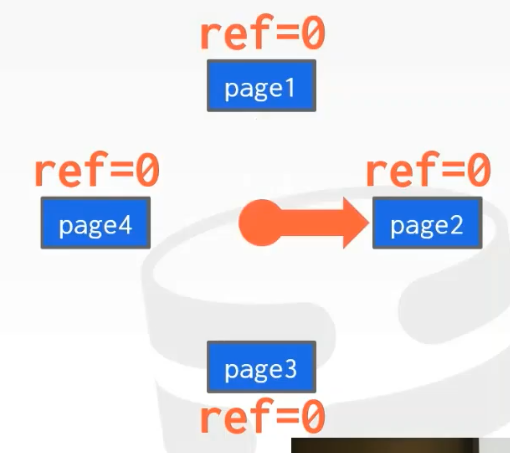

# Buffer Pools

Buffer Pools的目标是最小化读取磁盘的开销。

其他系统可能叫Buffer Cache、Page Cahce，它们都是一个东西。

## Buffer Pool Manager

Manager会分配一块很大的内存（通常是几页），然后把它们分成固定大小的几块，每一块称为一个frame。

当DBMS请求一页数据时，如果该页没有在bufer pool中，manager将它从disk拷贝到buffer pool（不进行任何序列化/反序列化操作）。

## Page Table

Page Table是一个hash table，负责跟踪我们在buffer pool中留存的page。

它是一个间接层（indirect layout），记录了page在哪个frame中，并维护每个page的元数据。

元数据包括：
* 引用计数/Pin计数（正在查询该page的thread的数量）。
* Dirty flag（被修改了设置为true）。

**Page Table不需要持久化，但Page Directory需要。**

## Lock vs Latch

### Locks:
* 从其他事务中保护数据库的逻辑内容。
* 在事务持续期间持有。
* 需要有回滚变更的能力。

### Latchs：
* 从其他线程中保护数据库内部数据结构的临界区。
* 在操作期间持有。
* 不需要有回滚变更的能力。

## Replacement Policy

### LRU（最近最少使用）

跟踪每个page最后被访问的时间戳，查看哪个时间戳最老，然后移除它。

优化方式：
维护一个queue，按时间戳排序，每次访问一个page，就把它从队列中移除，然后放到队尾。

### Clock

一种LRU近似算法，不去跟踪每个page的时间戳，而是跟踪一个标志位。

这个标志告诉你上次检查之后，是否有人访问了这个page，如果标志未变化就可以移除。

所以你需要把你的buffer组织成一个环形，就像时钟一样。

每次访问，将标志设置位1。

如果当前指针指向的page标志为1，将它设置为0，并移动到下一个page。

循环往复，直到遇到标志为0的page，然后用新page代替它。

*NOTE:LRU和LRU近似算法都容易受到sequential flooding影响，多个循序扫描，最好执行移除最近访问的页的算法。*

### LRU-K

将最近使用一次的判断标志改为最近使用k次，当访问记录达到k次后，将page从历史队列移动到缓存队列，也就是说，访问到k次之后才会被缓存，否则将被移除buffer pool。

### Localization

每个查询维护一个小的buffer pool避免对全局buffer pool的污染。

### Priority Hints

对buffer pool进行提示，告诉它某些page是重要的，不要移除出buffer pool。

### Dirty Pages

移除dirty page很慢（进行disk I/O），但是移除not dirty page很快（直接丢弃）。

当buffer pool需要移除page时，应该尽量移除not dirty page。

### Blackground Writing

为了避免必须将drity page移除的情况，DBMS可以设置后台线程，对buffer pool中的dirty page写入disk。

当在dirty page写入log之前，不应该将dirty page写出。

## Buffer Pool Optimizations

**全局策略：**
* 为所有活跃的事务执行决策，并且尝试让整个工作负载受益。

**局部策略：**
* 针对某个查询或某个事务进行决策，尝试让某个单个查询执行得最快。
* 依旧需要支持共享页。

大多数系统会尝试进行两种优化。

## Multiple Buffer Pool

DBMS通常拥有多个Buffer Pool，并在每个buffer pool上进行局部策略，同时减少锁争抢的概率。

有两种方式找到你需要的page在哪个buffer pool上：
* 第一种方式是buffer pool manager将对象的record id维护起来，放到一个列表中，通过这个表找到对应的object在哪个pool中。
    
* 第二种方式，计算`hash(record id)%n`

## Pre-Fetching

DBMS基于某个查询计划进行预取：
* 循序扫描。

    
    
* 索引扫描。
    

## Scan Sharing

利用彼此的查询结果，使查询变得更快。

与结果缓存（result caching）不同，结果缓存指我运行完全相同的查询，并且查询的条件没有改变时，缓存结果，下次遇到就直接返回结果。

商用数据库支持Scan Sharing。

||||
|-|-|-|
||⇨| |

依附（attch）到已有游标上，然后读取完，再新建一个游标读取未读取的部分。

## Buffer Pool Bypass

分配一小块内存给查询，当某个page不在buffer pool中时，从disk获取但不放入buffer pool中，而是放入本地内存。

只有当中间结果和扫描的量不大时，才能执行这种优化。

## Other Memory Pools

一些buffer pool，用于存放中间的结果。

* Sorting + Join buffers
* Query Caches
* Maintenance Buffers
* Log Buffers
* Dictionary Caches