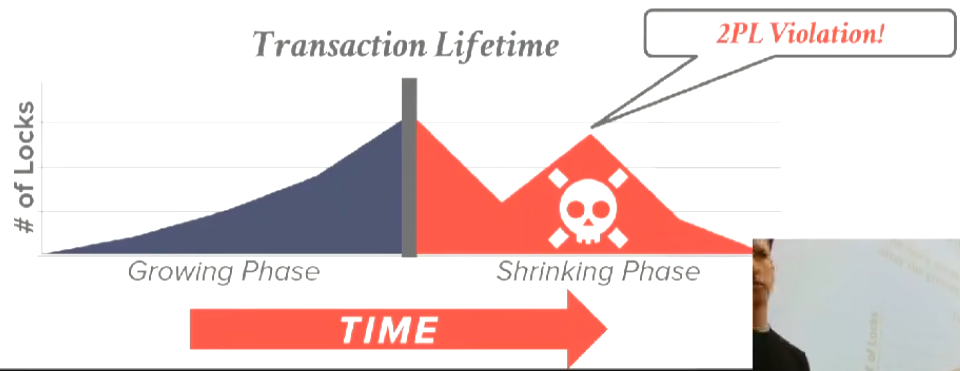
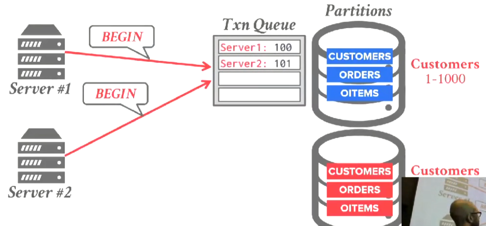
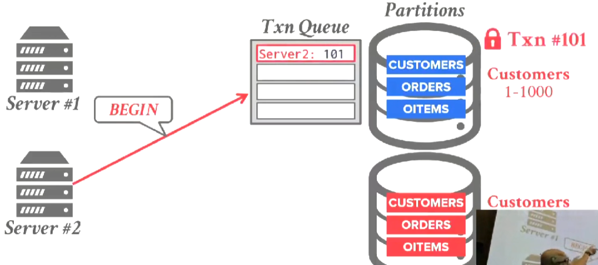

# Concurrency Control

database（数据库）是由具名数据对象组成集合。


transaction（事务）是一个或多个操作的执行序列，事务具有原子性要么操作都完成，要么都不完成，不会出现部分完成的情况。


Concurrency Control是一种机制，该机制保证多个事务能同时执行，同时交错执行它们的操作，通过这种方法最大化并行性（parallelism），但仍然提供事务的安全保证，以及数据库的正确性保证。

## Transaction In SQL

可以使用`BEGIN`显示开启一个transaction。

使用`COMMIT`来提交事务。

使用`ABORT`放弃事务（某些系统使用`ROLLBACK`而不是`ABORT`，某些系统两者都支持）。

当使用`COMMIT`时，如果能提交事务，DBMS将执行所有操作并返回一个成功的消息。

如果不能提交，DBMS将撤销所有更改，并返回一个出错的消息。

为什么需要向用户提供`ABORT`，给予用户更多的能力，这样能实现一些特殊的业务逻辑。

## ACID

事务的ACID特性：

* Atomicity（原子性） - 事务中的所有操作，要么都执行要么不执行。
* Consistency（一致性） - 分为Database Consistency和Transacion Consistency。
* Isolation（隔离性） - 多个同时执行的事务是隔离的，它们看不见对方进行的操作。
* Durability（持久性） - 如果事务被提交，那么事务所有的操作都被持久化。

实现Atomicity、Consistency和Durability的方式：

* Logging（Write Ahead Logging） - 在修改之前，将旧的值写入undo record，当事务abort时，通过undo record恢复它的旧值（同时将随机I/O转换成对log的循序I/O，速度较快）。
* Shadow Paging - 在修改之前，制作一份page的副本，在副本上修改，完成后将page的指针指向副本，回收之前的page（速度较慢，因为每次都要复制）。

*NOTE:MultiVersion Concurrency Control（多版本并发控制）需要使用一种特殊的shadow paging，不复制整个page，而是制作tuple的副本。*

Database Consistency：

如果事务`A`读取了一个tuple，并且该tuple在之前被事务`B`所改变，在`A`和`B`之间没有其他被提交的事务修改了该tuple，那么`A`将读到`B`写入的值（在single node DBMS很容易实现，但是在分布式DBMS中实现会付出可用性代价）。

Transacion Consistency：

如果数据库的初始状态的一致的，事务的操作也是一致的，那么事务提交或撤销后，数据库的状态仍然是一致的（无法在DBMS中实现，DBMS只能提供最基础的保证，例如：`Unique`、`NOT NULL`，完整的约束需要在应用中实现）。

Concurrency Control分为两种：

* Pessimistic（悲观） - 假设事务执行时会产生冲突，因此在执行操作前先获取lock，阻止其他事务改变data object的状态（lock->compution->write）。
* Optimistic（乐观） - 假设事务的冲突很少出现，先执行事务，在commit时检查data object的状态是否被改变（compution->lock->check->write）。

Isolation Levels:
* Serializable（可串行化） - 多个事务执行的结果与串行执行它们相同（不出现任何问题）。
* Snapshot Isolation（快照隔离） - 又称可重复读（Repeatable Read），事务如同运行在一个一致性快照上（可能出现写倾斜）。
* Read Commited（读已提交） - 事务只会读到以及提交了的值（可能出现幻读，读倾斜，写倾斜）。

*NOTE:脏读（dirty write）：指读取到了其他事务未提交的值。*


*NOTE:幻读（phantom read）：指在同一个事务中，两次读取同一个对象返回不同的值。*


*NOTE:脏写（dirty write）：指事务覆盖了另一个事务未提交的值。*


*NOTE:读倾斜（read skew）：读取事务`A`先于写入事务`B`，但是`A`仍能读到`B`写入的值。*

*NOTE:写倾斜（write skew）：两个并行事务都基于自己读到的数据集去覆盖另一部分数据集，但是都成功提交。*

## Schedules


有三种冲突类型：
* Read Write Confilcts（读写冲突）。
* Write Read Confilcts（写读冲突）。
* Write Write Confilcts（写写冲突）。

如果两个调度（schedules）涉及到相同的事务和事务操作（transaction action，指事务的一部分），并且每个冲突的事务操作在两个调度中是相同的，那么这两个调度是冲突等价（Confilcts Equivalent）的。

如果调度S是Confilct Serializable（可冲突串行化），那么S与串行调度是冲突等价的。

如果交换调度S的非冲突操作，最终能得到一个与串行化相同的调度，那么S是可冲突串行化的。

Confilct Serializable调度与Serializable产生相同的效果。

|Confilct Serializable|Non-Confilct Serializable|
|-|-|
|||
|||
|||
|||
||-|
||-|
||-|
||-|

Dependency Graphs（依赖图）：
* 每一个transaction都是图中的一个node。
* 如果一个事务与另一个事务有冲突，那么两个node之间存在一个edge。
* 


如果依赖图中没有环，那么这个调度是可冲突串行化的。


如果两个调度（<code>S<sub>1</sub></code>、<code>S<sub>2</sub></code>），满足以下条件：
* 如果<code>T<sub>1</sub></code>在<code>S<sub>1</sub></code>中读取`A`的初始值，并且在<code>S<sub>2</sub></code>中也读取`A`的初始值。
* 如果<code>T<sub>1</sub></code>在<code>S<sub>1</sub></code>中读取被<code>T<sub>2</sub></code>写入的`A`的值，并且在<code>S<sub>2</sub></code>也读取被<code>T<sub>2</sub></code>写入的`A`的值。
* 如果<code>T<sub>1</sub></code>在<code>S<sub>1</sub></code>中写入`A`的最终值，并且在<code>S<sub>2</sub></code>也写入`A`的最终值。

那么这两个调度是视图等价（View Equivalent）的。

如果调度S是View Serializable（视图可串行化），那么S与串行调度是视图等价的。

*NOTE:View Serializable目前处于理论阶段，它要求DBMS深度了解应用的事务操作。*


虽然不是可冲突串行化调度，但仍与串行调度产生了相同的效果。

| | |
|-|-|
|||

## Executing With Locks

设置一个全局的lock manager，lock manager维护着谁拥有锁，对每一个tuple执行相应的操作之前必须先获取相应的lock。


如果事务没有获取到相应的lock，它唯一能做的就是等待，直到其他事务释放锁。


## Lock Types


两种基本的lock types：
* `S-Lock` - 读操作的共享锁。
* `X-Lock` - 写操作的独占锁。


### Hierarchical Locking（层级锁）


为了减少事务需要获得lock的数量，lock被设计成不同的粒度：
* Table Lock - 锁住整张table。
* Page Lock - 锁住一个page。
* Tuple Lock - 锁住一个tuple。

同时引进了Intention Locks：
* Intention Shared Lock（IS，意图共享锁） - 表示你需要在该层次下面使用shared lock锁住一个object（例如读取表中的某个tuple，在表上加IS）。
* Intention Exclusive Lock（IX,意图独占锁） - 表示你需要在该层次下面使用exclusive lock锁住一个object（例如写表中的某个tuple，在表上加IX）。
* Shared Intention Exclusive Lock（SIX，共享意图独占锁） - 表示在该层次有一个shared lock，但是你需要在该层次下面使用一个exclusive lock（例如读取整张表，但是需要更新其中一个tuple，就需要在表上加SIX）。


为了得到一个shared lock，必须在其父节点上得到一个S lock或IS lock，同时为了得到一个exclusive lock必须在其父节点上得到一个X lock、SIX lock或者IX lock。

|Read a tuple|Write a tuple|
|-|-|
|||

|Scan table and update few tuples|Read a tuple|Scan table|
|-|-|-|
||||

同时SQL也允许你显示使用table lock，但它们不是标准的一部分。


DB2、Postgresql、Oracle：

```sql
LOCK TABLE <TABLE NAME> IN <MODE> MODE;
```

SQL Server：

```sql
SELECT 1 FROM <TABLE> WITH (TABLOCK,<MODE>);
```

Mysql：

```sql
LOCK TABLE <TABLE> <MODE>;
```

同时在执行scan table and update时，也可以给DBMS一个提示。

```sql
SELECT * 
FROM <TABLE>
WHERE <FILTER>
FOR UPDATE; 
```

## Two Phase Locking（2PL）


2PL分为两个阶段：
* Growing - 事务获得它需要的锁。
* Shrinking - 当它获得完它需要的所有的锁之后，进入释放阶段，这时不能再获得更多的锁。

违反该协议可能导致不可重复读。

|可冲突串行化|不可冲突串行化|
|-|-|
|||
|||

2PL的问题：
* Cascading Aborts - 级联中止。
 


*NOTE：因为T1终止，而T2读到了T1写入的值所以T2也终止，如果不终止则产生脏读。*

* Deadlock - 由锁定顺序不一致产生的死锁。

*NOTE：同时为了支持2PL，lock manager必须支持锁升级（从S lock升级到X lock）。*

## Strong Strict Two Phase Locking（Rigorous Two Phase Locking）

为了处理Cascading Aborts的问题，我们延长Shrinking阶段，直到事务结束再释放锁。


*NOTE:术语strict在并发控制领域中的意思是，直到你提交事务，你所做的变更才会被其他事务可见。*


|No 2PL|2PL|Strong Strict 2PL|
|-|-|-|
||||
||||

*NOTE:Strong Strict 2PL在实践中常见，因为系统无法判断出是否可以立刻释放lock。*

## Deadlock Detection And Prevetion


deadlock是事务间彼此成环，等待对方释放自己所需要的锁。

有两种方式解决死锁：
* Detection - 死锁检测。
* Prevetion - 死锁预防。

### Deadlock Detection

DBMS构建一个等待图（wait-for graph），每一个事务就是图中的点，事务间的依赖则是图中的边，DBMS周期性地检查图中是否存在环，如果存在则杀死一个环中的事务

*NOTE:等待图的检查周期通常是DBMS能容忍的最长的陷入死锁的等待时间。*

受害者选择方式：
* By age - 通过事务的时间戳决定。
* By progress - 通过事务已执行的查询数量决定。
* By count of locks - 通过事务占有的锁决定。
* By count of rollback transactions - 通过终止后需要进行Cascading Aborts的事务数量决定。

同时必须处理饥饿的情况，不能让同一个事务一直被回滚。

### Deadlock Prevetion

较老的事务有更高的优先级，总是杀死较低优先级的事务。

有两种方式：
* Wait-Die - 老事务要求新事务的锁则等待新事务，新事务要求老事务的锁则自杀。
* Wound-Wait - 老事务要求新事务的锁则杀死新事务，新事务要求老事务的锁则等待。

| | |
|-|-|
|||

*NOTE:本质是保证按一定顺序获得锁。*

当事务被杀死重启后，它使用原来的时间戳而不是获取一个新的，这样能防止饥饿问题产生。

### Phantom Problem Of Insert Tuple（幻读问题）


2PL和SS2PL不能解决这个问题（不使用层级锁的情况下），需要使用index locking在某个column上加锁。

## Timestamp Ordering Concurrency Control

悲观并发控制（如2PL）是假设数据库事务存在大量的争用的保守方案。

而乐观并发控制（OCC）则允许事务在读写tuple时不需要获取锁，这在少量争用的情况下有更好的性能。

Timestamp Ordering（T/O） Concurrency Control是一种OCC。

DBMS通过某种方式为每一个事务分配唯一的时间戳，以此来预定义这些事务的提交顺序。

函数`TS()`返回事务的时间戳，当<code>TS(T<sub>i</sub>) < TS(T<sub>j</sub>)</code>时，DBMS必须保证事务<code>T<sub>i</sub></code>提交在事务<code>T<sub>j</sub></code>之前。

时间戳分配策略：
* System Clock - 询问CPU当前的时间又称墙上时钟（wall clock），难以保证唯一性，在分布式场景下存在时钟错误，时钟可能会回调。
* Logical Counter - 使用递增的逻辑计数器，超过最大值将产生回绕。
* Hybrid - 混合两种方案，大多数系统使用这种方法。

可以在事务执行期间的任意时间点给事务分配时间戳。

## Basic Timestamp Ordering Protocol

为了在不使用lock读取tuple时保证正确性，需要往数据库系统中的每一个tuple都加入2个时间戳：
* Read Timestamp - 最晚读取该tuple的事务的时间戳。
* Write Timestamp - 最晚写入该tuple的事务的时间戳。

*NOTE:使用这种方式必须在事务进入系统时分配timestamp。*

对于一个读操作，需要确保该事务的时间戳大于tuple的write timestamp：
* 如果不满足这个条件则事务因这个读操作终止，并在稍后以一个新的时间戳重启（事务不能读取到未来写入的值）。
* 如果满足这个条件则更新tuple的read timestamp为`MAX(R-TS(tuple),TS(T))`，并且一旦读取成功，则立刻拷贝tuple到private space中（为了保证可重复读）。

对于一个写操作，需要确保该事务的时间戳大于tuple的read timestamp和write timestamp：
* 如果不满足这个条件则事务因这个写操作终止，并在稍后以一个新的时间戳重启（事务不能破坏其他事务的读操作并且不能覆盖掉未来的写）。
* 如果满足这个条件则更新tuple的write timestamp为`TS(T)`并写入tuple，一旦写入成功，则立刻拷贝tuple到private space中（为了保证可重复读）。

|All transactions commited|T1 aborts|
|-|-|
|||
|||
|||
|||
|||
||-|
||-|
||-|

### Thomas Write Rule（托马斯写入规则）

对于一个写操作，需要确保该事务的时间戳大于tuple的read timestamp：
* 如果事务的时间戳小于tuple的read timestamp终止事务。
* 如果时间戳小于tuple的write timestamp，在private space中保留副本，但是忽略该写操作（Thomas Write Rule）。
* 如果满足这个条件则更新tuple的write timestamp为`TS(T)`并写入tuple，一旦写入成功，则立刻拷贝tuple到private space中（为了保证可重复读）。

|T1 aborts（No Thomas Write Rule）|All transaction commited（Thomas Write Rule）|
|-|-|
|||
|||
|||
|||
|||

*NOTE：只要不使用Thomas Write Rule规则就可以产生可冲突序列化调度。*

这种协议有饥饿的问题，并且该协议是不可恢复（Not Recoverable）的（因为不能保证时间戳小的事务在时间戳大的事务之前提交），一旦产生abort很可能无法恢复。

|Not Recoverable|
|-|
||
||
||
||

## Optimistic Concurrency Control


OCC的写入由多个阶段组成：
* Read Phase - 跟踪每一个事务的读取和写入，并把写入存储在private space中。
* Validation Phase - 事务提交时，验证是否与其他事务冲突。
* Write Phase - 如果验证成功，将更改应用到数据库中，否则重启事务。

*NOTE：这种方式不必在事务进入系统时分配时间戳，事务提交时（验证阶段）才会分配时间戳，所以任何操作都会导致private space中的tuple的timestamp被修改为无穷大。*

|Schedule|
|-|
||
||
||
||
||
||
||
||
||

*NOTE:最简单的实现方式是在开始事务和验证事务时获取同一个latch。*

Validation Phase负责检测事务之间的读写冲突和写写冲突。

Validation的方法有两种：
* Backward Validation - 当事务提交时，查看所有已经提交（验证）的老事务，确保不会与他产生冲突（`WriteSet(old) ∩ ReadSet(new) = empty set`）。
  

* Forward Validation - 当事务提交时，查看所有未提交（验证）的新事务，确保不会与他产生冲突（`WriteSet(old) ∩ ReadSet(new) = empty set`）。
  
*NOTE：这种方式实际上不需要read timestamp。*


|All transactions commited|T1 Aborts|All transactions commited（Reorder）|
|-|-|-|
||||

|Schedule|
|-|
||
||
||
||

*NOTE:Validation Phase和Write Phase必须是一步不可分割的原子操作。*

研究显示在冲突很多的workload中，2PL和OCC通常来讲都不可行，它们的效果几乎是一样的。

|吞吐量|提交率|时延|
|-|-|-|
||||

## Partition-based Timestamp Ordering Protocol

对数据库进行水平分区，这样只涉及单个分区的事务既不需要lock也不需要latch（如果每个分区只由一个线程操作）。


可以把客户信息、对应的订单信息和对应的商品信息都放在一个分区中，这样就能避免跨分区操作。

| | | |
|-|-|-|
||⇨||

在实践中每一个分区由单个lock保护：
* 每一个事务会被加入到它所需要操作的数据的分区的队列中（按时间戳排序）。
* 当事务在每一个队列的对头时，它获得这个分区的锁。
* 当事务获得它所需要所有分区的锁时，它开始执行。
* 当事务尝试获取一个lock时，它终止并重启（通常意味着DBMS猜测失败，需要将事务重新加入到队列中）。

|Schedule|
|-|
||
||
||
||

在存储过程式事务中，且事务只访问一个分区，这种方式就非常快速，但是存在热点问题。

## Multi-Version Concurrency Control