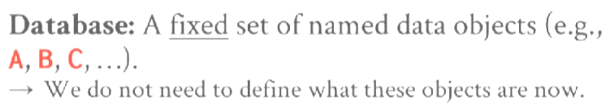

# Concurrency Control

database（数据库）是由具名数据对象组成集合。

transaction（事务）是一个或多个操作的执行序列，事务具有原子性要么操作都完成，要么都不完成，不会出现部分完成的情况。

Concurrency Control是一种机制，该机制保证多个事务能同时执行，同时交错执行它们的操作，通过这种方法最大化并行性（parallelism），但仍然提供事务的安全保证，以及数据库的正确性保证。

## Transaction In SQL

可以使用`BEGIN`显示开启一个transaction。

使用`COMMIT`来提交事务。

使用`ABORT`放弃事务（某些系统使用`ROLLBACK`而不是`ABORT`，某些系统两者都支持）。

当使用`COMMIT`时，如果能提交事务，DBMS将执行所有操作并返回一个成功的消息。

如果不能提交，DBMS将撤销所有更改，并返回一个出错的消息。

为什么需要向用户提供`ABORT`，给予用户更多的能力，这样能实现一些特殊的业务逻辑。

## ACID

事务的ACID特性：

* Atomicity（原子性） - 事务中的所有操作，要么都执行要么不执行。
* Consistency（一致性） - 分为Database Consistency和Transacion Consistency。
* Isolation（隔离性） - 多个同时执行的事务是隔离的，它们看不见对方进行的操作。
* Durability（持久性） - 如果事务被提交，那么事务所有的操作都被持久化。

实现Atomicity、Consistency和Durability的方式：

* Logging（Write Ahead Logging） - 在修改之前，将旧的值写入undo record，当事务abort时，通过undo record恢复它的旧值（同时将随机I/O转换成对log的循序I/O，速度较快）。
* Shadow Paging - 在修改之前，制作一份page的副本，在副本上修改，完成后将page的指针指向副本，回收之前的page（速度较慢，因为每次都要复制）。

*NOTE:MultiVersion Concurrency Control（多版本并发控制）需要使用一种特殊的shadow paging，不复制整个page，而是制作tuple的副本。*

Database Consistency：

如果事务`A`读取了一个tuple，并且该tuple在之前被事务`B`所改变，在`A`和`B`之间没有其他被提交的事务修改了该tuple，那么`A`将读到`B`写入的值（在single node DBMS很容易实现，但是在分布式DBMS中实现会付出可用性代价）。

Transacion Consistency：

如果数据库的初始状态的一致的，事务的操作也是一致的，那么事务提交或撤销后，数据库的状态仍然是一致的（无法在DBMS中实现，DBMS只能提供最基础的保证，例如：`Unique`、`NOT NULL`，完整的约束需要在应用中实现）。

Concurrency Control分为两种：

* Pessimistic（悲观） - 假设事务执行时会产生冲突，因此在执行操作前先获取lock，阻止其他事务改变data object的状态（lock->compution->write）。
* Optimistic（乐观） - 假设事务的冲突很少出现，先执行事务，在commit时检查data object的状态是否被改变（compution->lock->check->write）。

Isolation Levels:
* Serializable（可串行化） - 多个事务执行的结果与串行执行它们相同（不出现任何问题）。
* Snapshot Isolation（快照隔离） - 又称可重复读（Repeatable Read），事务如同运行在一个一致性快照上（可能出现写倾斜）。
* Read Commited（读已提交） - 事务只会读到以及提交了的值（可能出现幻读，读倾斜，写倾斜）。

*NOTE:脏读（dirty write）：指读取到了其他事务未提交的值。*

*NOTE:幻读（phantom read）：指在同一个事务中，两次读取同一个对象返回不同的值。*

*NOTE:脏写（dirty write）：指事务覆盖了另一个事务未提交的值。*

*NOTE:读倾斜（read skew）：读取事务`A`先于写入事务`B`，但是`A`仍能读到`B`写入的值。*

*NOTE:写倾斜（write skew）：两个并行事务都基于自己读到的数据集去覆盖另一部分数据集，但是都成功提交。*

## Schedules

有三种冲突类型：
* Read Write Confilcts（读写冲突）。
* Write Read Confilcts（写读冲突）。
* Write Write Confilcts（写写冲突）。

如果两个调度（schedules）涉及到相同的事务和事务操作（transaction action，指事务的一部分），并且每个冲突的事务操作在两个调度中是相同的，那么这两个调度是冲突等价（Confilcts Equivalent）的。

如果调度S是Confilct Serializable（可冲突串行化），那么S与串行调度是冲突等价的。

如果交换调度S的非冲突操作，最终能得到一个与串行化相同的调度，那么S是可冲突串行化的。

Confilct Serializable调度与Serializable产生相同的效果。

|Confilct Serializable|Non-Confilct Serializable|
|-|-|
|||
|||
|||
|||
||-|
||-|
||-|
||-|

Dependency Graphs（依赖图）：
* 每一个transaction都是图中的一个node。
* 如果一个事务与另一个事务有冲突，那么两个node之间存在一个edge。
* 

如果依赖图中没有环，那么这个调度是可冲突串行化的。

如果两个调度（<code>S1</code>、<code>S2</code>），满足以下条件：
* 如果<code>T1</code>在<code>S1</code>中读取`A`的初始值，并且在<code>S2</code>中也读取`A`的初始值。
* 如果<code>T1</code>在<code>S1</code>中读取被<code>T2</code>写入的`A`的值，并且在<code>S2</code>也读取被<code>T2</code>写入的`A`的值。
* 如果<code>T1</code>在<code>S1</code>中写入`A`的最终值，并且在<code>S2</code>也写入`A`的最终值。

那么这两个调度是视图等价（View Equivalent）的。

如果调度S是View Serializable（视图可串行化），那么S与串行调度是视图等价的。

*NOTE:View Serializable目前处于理论阶段，它要求DBMS深度了解应用的事务操作。*

虽然不是可冲突串行化调度，但仍与串行调度产生了相同的效果。

| | |
|-|-|
|||

## Two Phase Locking