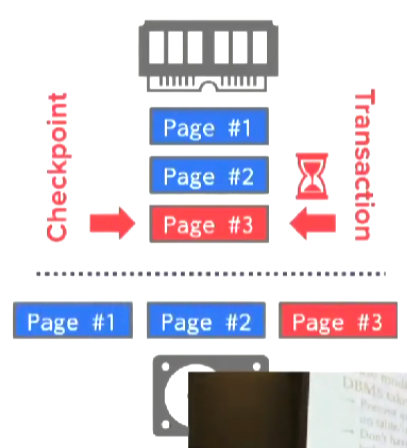
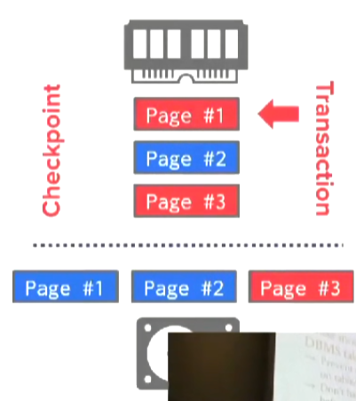

# Database Recovery

当我们遇上崩溃时，需要持久化对数据库的操作。


在我们commit之前，必须持久化对数据库的更改，否则我们将失去这个更改（断电会导致buffer pool中的内容被清空）。

## Crash Recovery

恢复算法由两个部分组成：
* 在运行时收集事务信息以保证数据库能从崩溃中恢复。
* 利用事务的信息将数据库恢复到一个一致的状态（并且保证事务的A、C、D特性）。

总共有三种故障：
* Transaction Failures - 分为Logical Errors（由于内部逻辑错误错误导致事务无法完成，例如事务违反完整性约束）和Internal State Errors（由于错误条件导致事务必须被中止，例如deadlock）两种。
* System Failures - 分为Software Failures（DBMS自身的实现出了问题，例如segfault）和Hardware Failures（运行DBMS的机器发生了故障或崩溃）两种。
* Storage Media Failures - 存储媒介硬件故障（磁盘损坏，机器着火等），无法处理。

DBMS必须遵守以下规则：
* 当DBMS承诺某个事务已经被提交时，该事务对数据库所做的修改必须被持久化。
* 当事务终止时，不会有出现事务的一部分被持久化的情况。

Undo vs Redo：
* Undo - 将不完整的或终止的事务对数据库产生的影响的过程。
* Redo - 为了持久化，重新安装已提交的事务对数据库产生的影响的过程。

使用undo和redo的方法取决于我们如何管理buffer pool中的dirty page。

|Schedule|
|-|
||
||
||
||
||

我们需要考虑3个问题：
|是否强制已提交的事务写入的数据落盘|未提交的事务写入的数据是否允许落盘|当已提交的事务与终止的事务修改了同一页时，如何回滚|
|-|-|-|
||||

是否强制已提交的事务写入的数据落盘：
* Yes - Force Policy。
* No - No Force Policy。


未提交的事务写入的数据是否允许落盘：
* Yes - Steal Policy。
* No - No Steal Policy。


## No-Steal Force Policy

含义：
* 强制已提交的事务写入的数据落盘。
* 未提交的事务写入的数据不允许落盘。

|No-Steal Force|
|-|
||
||
||

在提交时，如果页中有其他未提交事务的数据，必须拷贝page然后再把副本写入到磁盘，以保证能够在T1终止时正确地回滚。


优点：
* 实现非常简单。
* 不需要undo。
* 如果硬件支持原子write，那么也不需要redo。

缺点：
* 无法支持write set超出可用内存量的事务（因为每一次write都需要copy）。
* 多个事务可能需要将同一个page反复写入磁盘。
* 不使用于SSD介质。

## Shadow Paging

Policy：No-Steal Force。

为每一个page维护两个版本：
* Master - 只包含已提交的事务产生的变更的版本。
* Shadow - 包含未提交事务产生的变更的临时版本。

事务只更新shadow版本，当事务提交时将shadow更新为master版本。

DBMS会在内存中维护两张page table。

一张是master page table，一张shadow page table（两张table都进行持久化）。

同时维护一个database root指针（也需要持久化），该指针指向master page table。


当事务写入page时，执行COW，在磁盘中分配一个临时的page，然后修改shadow page table的指针。


当写入完成时，修改database root，交换两个page table的角色。


执行多个事务的方法：
* 一次只执行一个事务（SQLite在2010年之前使用了这种方案）。
* 批量提交（batch commit，等到所有的事务结束再提交，就像ext3文件系统）。

*NOTE：目前大多数系统不会采用shadow paging的方式。*

同时，这种方案也存在碎片问题，page id并不聚集。


缺点：
* 拷贝整个page table过于昂贵，即使你使用树结构的page table。
* 必须将修改的每一个page、page table、database root都落盘。
* 存在大量碎片问题。
* 需要垃圾回收（被更新之后的page被废弃了）。
* 一段时间只支持提交一个batch或一个事务。

## Write Ahead Logging

Policy：Steal No-Force。

在磁盘上维护一份log file，当事务修改数据库时，在日志文件的条目中记录这些修改。

当事务提交时，只需要保证对log的修改已经落盘，必须确保被写入的对象在落盘之前，该对象涉及到的日志条目已经落盘。

每一个日志条目（log entry）需要包含以下信息：
* Transaction Id - 事务的id。
* Object Id - 修改的对象的id。
* Before Value（Undo） - 被修改之前的值。
* After Value（Redo） - 修改之后的值。

事务启动时，向WAL Buffer添加一个Begin record。


当修改一个对象时，必须先写入WAL Buffer再修改buffer pool。

|First|Next|
|-|-|
|||

当事务commit时，将commit record加入到WAL Buffer中，然后在某个时间点，WAL Buffer将会落盘。


*NOTE：也可以在commit时调用`fsync()`让WAL Buffer落盘。*

当WAL Buffer落盘之后，事务就可以返回了。


落盘WAL Buffer的方案：
* 在事务commit时，调用`fsync()` - 较慢。
* 使用Group Commit，将多个事务的WAL Buffer合并在一起落盘 - 几乎所有DBMS都选择这种方案。

## Group Commit

允许多个事务并发填写WAL Buffer。


WAL Buffer满时将其推入后台进行落盘。


或者等待一段时候后，都没有新的log entry产生时将其推入后台进行落盘（类似nagle算法）。

*NOTE：这段时间通常是后台执行`fsync()`所需要的时间，因为这样设置能够最大化性能。*

## Performance

|Runtime|Recovery|
|-|-|
|||

*NOTE：runtime指执行事务的性能。*

*NOTE：几乎所有DBMS都采用Steal No-Force策略。*

shadow paging有最快的recovery速度，write ahead logging有最好的runtime性能。

## Logging Schemes

有3种logging方式：
* Physical Logging - 记录数据库某个特定位置的字节层面上的修改。
* Logical Logging - 记录事务对数据库做的高层次的操作（例如事务执行的`UPDATE`、`DELETE`、`INSERT`查询）。
* Physiological Logging - 记录数据库object层面的更改（例如记录修改了某个tuple），大多数DBMS使用的方案。

Logical Logging：
* 优点：允许使用更少的记录表达更多的修改。
* 缺点：难以弄清除在DBMS崩溃之前，哪些数据被写入了磁盘（难以执行undo）。

Physical Logging：
* 优点：容易执行恢复。
* 缺点：大量的修改需要大量的记录。

对于查询：
```sql
UPDATE foo SET val = XYZ WHERE id = 1;
```

|Physical Logging|Logical Logging|Physiological Logging|
|-|-|-|
||||

## Checkpoints

log file的长度会不断增长，如果log file太长，恢复起来会需要非常长的时间。

checkpoints是一种截断log file的方式：
* 停止所有事务。
* 将所有的dirty page从buffer pool中落盘。
* 然后写入一个`<CHECKPOINT> entry`到log file中。
* 让事务重新开始。

这种方式叫blocking checkpoint或者consistency checkpoint。

*NOTE：大多数DBMS会采用优化的方案。*


在checkpoint之前commit的事务被忽略。


如果事务在checkpoint之前未提交，则看它在崩溃前是否提交：
* 如果已提交则重做操作。
* 如果未提交则撤销操作。

记录checkpoints的频率：
* 每过一段时间记录一次checkpoint。
* 当log积攒到一定数量时记录一次checkpoint - 更好。

## Recovery With ARIES


ARIES由三个main ideas组成：
* Write-Ahead Logging - 使用Steal No-Force策略的预写日志。
* Repeating History During Redo - 当数据库重启后，首先重放日志中的entry来还原崩溃前的状态。
* Logging Changes During Undo - 在运行时和恢复时进行undo的时候，也会为undo操作记录日志。


*NOTE:保证在恢复阶段崩溃时，重启之后能恢复过来。*

## Log Sequence Number（LSN）

*NOTE：通常通过修改buffer pool的方式实现。*

当增加log的时候，为每一个log entry分配唯一且单调递增的log number。

*NOTE：LSN不需要是连续的。*

系统会将一些LSN保存起来。

|Name|Where|Definition|
|-|-|-|
|flushedLSN|Memory|磁盘中最大的LSN|
|pageLSN|page<sub>x</sub>|对页x的最新的一次更新的LSN。|
|recLSN|page<sub>x</sub>|自上一次flush以来，对页x最老的一次更新的LSN|
|lastLSN|transaction<sub>i</sub>|事务i最后一次操作的LSN。|
|MasterRecord|Disk|checkpoint中最大的LSN|

*NOTE：pageLSN和recLSN不需要存到disk中，但是通常会将它们存入到disk中。*


|flushedLSN|pageLSN|recLSN|MasterRecord|
|-|-|-|-|
|||||

在page<sub>x</sub>被写入到disk之前，我们必须满足<code>pageLSN<sub>x</sub> <= flushedLSN</code>。

在page落盘之后，recLSN和pageLSN都被清除。

|Safe|Unsafe|
|-|-|
|||

## Normal Commit & Abort Operations


当事务提交时：
* 添加一个COMMIT entry到log中，只有当这个entry被持久化之后才能告诉user事务提交完成。
* 当事务成功提交后，添加一个TX END entry到log中。

*NOTE：在恢复时一旦我们看到TX END，我们将再也看不到关于该事务的任何信息（不需要调用`fsync()`将TX END落盘），它主要在abort时起作用。*


每一个log entry可以拥有一个prevLSN（不是必须的，但如果可用那么恢复时处理中止会更快），prevLSN构造了一个linked list，记录了该事务写入的上一个entry的LSN。

补偿日志记录（Compensation Log Record，CLR）是撤销事务执行时所写入的更新的日志记录，它会存放一个`before value`和`after value`，同时存在一个`undoNext`指针，存放下一个需要被undo的LSN。


一个CLR entry跟一个操作entry对应。

|before value & after value|undoNext|
|-|-|
|||

|Normal Commit|Abort|
|-|-|
|||
|||
|||
|||
|||

*NOTE：TX END和ABORT entry把abort变成一个二阶段的异步操作，提高了abort的性能（可以立刻向user返回abort而不是等待撤销完成）。*

终止算法：
1. 写入ABORT entry到log。
2. 反向遍历该事务的每一个操作entry，对于每一个entry先写入一个CLR到log中，将撤销它的变更。
3. 写入TX END entry到log。

*NOTE：CLR永远不需要被undo。*

## Fuzzy Checkpoints

对于一个non-fuzzy checkpoint来说，它需要暂停所有事务才能制作checkpoint，制作完成之后再让事务继续运行。

|Stop Transactions|Make Checkpoint|Continue|
|-|-|-|
||||

为了支持fuzzy checkpoints，我们需要将以下数据保存到checkpoint中：
* Active Transaction Table（ATT）。
* Dirty Page Table（DPT）。

当我们开始制作checkpoints时，需要拷贝ATT和DPT。

在制作完成后，把它们与checkpoint end一同写出。

ATT记录每一个事务的以下信息：
* txnId - 事务的唯一id。
* status - 事务的状态（R、C、U）。
* lastLSN - 最后一次操作的LSN。。


当一个事务结束（写出TX-END），它将会被移除出ATT。

dirty page table跟踪buffer pool中的所有脏页。


fuzzy checkpoints使用两张新的log entry来记录checkpoint的边界：
* CHECKPOINT-BEGIN - 表明checkpoint制作开始。
* CHECKPOINT-END - 包含ATT和DPT表示checkpoint制作完成（即成功将所有的dirty page落盘）。

|CHECKPOINT-BEGIN|CHECKPOINT-END
|-|-|
|||

当我们制作checkpoint完成，就修改MasterRecord指向最新的CHECKPOINT-BEGIN（帮助我们在恢复的时候快速找到checkpoint）。

## Three Phase Recovery Protocol

Recovery分为三个阶段：
* Analysis - 读取WAL的最后一个checkpoint（通过MasterRecord可以很容易做到），恢复崩溃时的DPT和ATT，并扫描到WAL的尾部。
* Redo - 从一个特定的位置（DPT中recLSN的最小值）开始，重放WAL直到WAL末尾（即使是终止的事务也被重放）。
* Undo - 从WAL的末尾开始以相反的顺序undo所有终止和未提交的事务，直到ATT中所有的事务都被undo。

|Recovery|
|-|
||
||
||
||
||

在Analysis发现事务的TX-END entry或COMMIT entry，就把事务从ATT中移除。

对于任何一个update entry，我们需要查看它update的page是否在DPT中，如果不是，则添加到DPT中，设置page的recLSN为当前LSN。

|Analysis|
|-|
||
||
||
||
||
||

redo将从DPT中recLSN的最小值处开始redo所有操作直到遇到WAL的末尾。

对于redo操作：
* 重放log entry。
* 将修改的page的pageLSN（和recLSN）设置为log entry的LSN（与transaction执行时所作的操作一致）。
* 不需要写入新的log entry到WAL，也不需要强制page落盘。

遇到TX-END entry之后，将transaction从ATT中移除（并可以将该事务修改的dirty page落盘）。

在redo阶段的之后，为所有C状态的事务，写入一个TX-END entry到WAL中。

undo所有仍在ATT中的事务（这些事务的状态一定是U），从WAL的末尾（实际上是ATT中最大的lastLSN）开始直到ATT中所有的事务都被undo。

我们将通过事务的lastLSN进行跳转（每次都跳到最大的lastLSN），每进行一次undo就要在WAL中写入一条CLR entry（利用CLR entry，如果在undo阶段崩溃，恢复之后的redo会重做我们已经做的undo）。

*NOTE：在undo阶段，我们可以通过CLR的undoNext进行跳转（仅当没有其他lastLSN比它更大的时候），因此CLR entry被undo阶段特殊对待，它将被忽略（因为redo已经重做了撤销）。*

当完全undo一个事务时，向WAL中写入一条TX-END entry，并将WAL和dirty page都落盘。

|Undo|
|-|
||
||
||
||
||
||
||
||
||