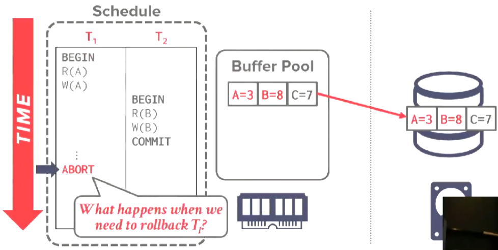
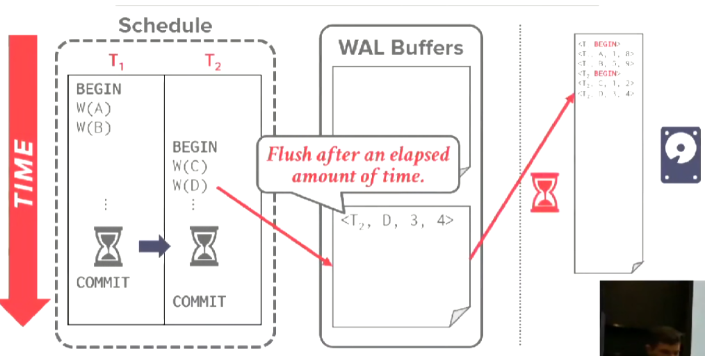
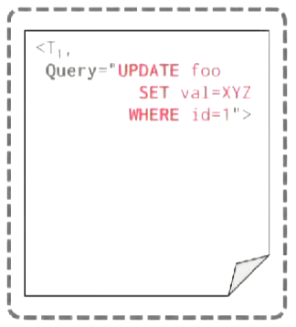

# Database Recovery

当我们遇上崩溃时，需要持久化对数据库的操作。


在我们commit之前，必须持久化对数据库的更改，否则我们将失去这个更改（断电会导致buffer pool中的内容被清空）。

## Crash Recovery

恢复算法由两个部分组成：
* 在运行时收集事务信息以保证数据库能从崩溃中恢复。
* 利用事务的信息将数据库恢复到一个一致的状态（并且保证事务的A、C、D特性）。

总共有三种故障：
* Transaction Failures - 分为Logical Errors（由于内部逻辑错误错误导致事务无法完成，例如事务违反完整性约束）和Internal State Errors（由于错误条件导致事务必须被中止，例如deadlock）两种。
* System Failures - 分为Software Failures（DBMS自身的实现出了问题，例如segfault）和Hardware Failures（运行DBMS的机器发生了故障或崩溃）两种。
* Storage Media Failures - 存储媒介硬件故障（磁盘损坏，机器着火等），无法处理。

DBMS必须遵守以下规则：
* 当DBMS承诺某个事务已经被提交时，该事务对数据库所做的修改必须被持久化。
* 当事务终止时，不会有出现事务的一部分被持久化的情况。

Undo vs Redo：
* Undo - 将不完整的或终止的事务对数据库产生的影响的过程。
* Redo - 为了持久化，重新安装已提交的事务对数据库产生的影响的过程。

使用undo和redo的方法取决于我们如何管理buffer pool中的dirty page。

|Schedule|
|-|
||
||
||
||
||

我们需要考虑3个问题：
|是否强制已提交的事务写入的数据落盘|未提交的事务写入的数据是否允许落盘|当已提交的事务与终止的事务修改了同一页时，如何回滚|
|-|-|-|
||||

是否强制已提交的事务写入的数据落盘：
* Yes - Force Policy。
* No - No Force Policy。


未提交的事务写入的数据是否允许落盘：
* Yes - Steal Policy。
* No - No Steal Policy。


## No-Steal Force Policy

含义：
* 强制已提交的事务写入的数据落盘。
* 未提交的事务写入的数据不允许落盘。

|No-Steal Force|
|-|
||
||
||

在提交时，如果页中有其他未提交事务的数据，必须拷贝page然后再把副本写入到磁盘，以保证能够在T1终止时正确地回滚。


优点：
* 实现非常简单。
* 不需要undo。
* 如果硬件支持原子write，那么也不需要redo。

缺点：
* 无法支持write set超出可用内存量的事务（因为每一次write都需要copy）。
* 多个事务可能需要将同一个page反复写入磁盘。
* 不使用于SSD介质。

## Shadow Paging

Policy：No-Steal Force。

为每一个page维护两个版本：
* Master - 只包含已提交的事务产生的变更的版本。
* Shadow - 包含未提交事务产生的变更的临时版本。

事务只更新shadow版本，当事务提交时将shadow更新为master版本。

DBMS会在内存中维护两张page table。

一张是master page table，一张shadow page table（两张table都进行持久化）。

同时维护一个database root指针（也需要持久化），该指针指向master page table。


当事务写入page时，执行COW，在磁盘中分配一个临时的page，然后修改shadow page table的指针。


当写入完成时，修改database root，交换两个page table的角色。


执行多个事务的方法：
* 一次只执行一个事务（SQLite在2010年之前使用了这种方案）。
* 批量提交（batch commit，等到所有的事务结束再提交，就像ext3文件系统）。

*NOTE：目前大多数系统不会采用shadow paging的方式。*

同时，这种方案也存在碎片问题，page id并不聚集。


缺点：
* 拷贝整个page table过于昂贵，即使你使用树结构的page table。
* 必须将修改的每一个page、page table、database root都落盘。
* 存在大量碎片问题。
* 需要垃圾回收（被更新之后的page被废弃了）。
* 一段时间只支持提交一个batch或一个事务。

## Write Ahead Logging

Policy：Steal No-Force。

在磁盘上维护一份log file，当事务修改数据库时，在日志文件的条目中记录这些修改。

当事务提交时，只需要保证对log的修改已经落盘，必须确保被写入的对象在落盘之前，该对象涉及到的日志条目已经落盘。

每一个日志条目（log entry）需要包含以下信息：
* Transaction Id - 事务的id。
* Object Id - 修改的对象的id。
* Before Value（Undo） - 被修改之前的值。
* After Value（Redo） - 修改之后的值。

事务启动时，向WAL Buffer添加一个Begin record。


当修改一个对象时，必须先写入WAL Buffer再修改buffer pool。

|First|Next|
|-|-|
|||

当事务commit时，将commit record加入到WAL Buffer中，然后在某个时间点，WAL Buffer将会落盘。


*NOTE：也可以在commit时调用`fsync()`让WAL Buffer落盘。*

当WAL Buffer落盘之后，事务就可以返回了。


落盘WAL Buffer的方案：
* 在事务commit时，调用`fsync()` - 较慢。
* 使用Group Commit，将多个事务的WAL Buffer合并在一起落盘 - 几乎所有DBMS都选择这种方案。

## Group Commit

允许多个事务并发填写WAL Buffer。


WAL Buffer满时将其推入后台进行落盘。



或者等待一段时候后，都没有新的log entry产生时将其推入后台进行落盘（类似nagle算法）。

*NOTE：这段时间通常是后台执行`fsync()`所需要的时间，因为这样设置能够最大化性能。*

## Performance

|Runtime|Recovery|
|-|-|
|||

*NOTE：runtime指执行事务的性能。*

*NOTE：几乎所有DBMS都采用Steal No-Force策略。*

shadow paging有最快的recovery速度，write ahead logging有最好的runtime性能。

## Logging Schemes

有3种logging方式：
* Physical Logging - 记录数据库某个特定位置的字节层面上的修改。
* Logical Logging - 记录事务对数据库做的高层次的操作（例如事务执行的`UPDATE`、`DELETE`、`INSERT`查询）。
* Physiological Logging - 记录数据库object层面的更改（例如记录修改了某个tuple），大多数DBMS使用的方案。

Logical Logging：
* 优点：允许使用更少的记录表达更多的修改。
* 缺点：难以弄清除在DBMS崩溃之前，哪些数据被写入了磁盘（难以执行undo）。

Physical Logging：
* 优点：容易执行恢复。
* 缺点：大量的修改需要大量的记录。

对于查询：
```sql
UPDATE foo SET val = XYZ WHERE id = 1;
```

|Physical Logging|Logical Logging|Physiological Logging|
|-|-|-|
||||

## Checkpoints

log file的长度会不断增长，如果log file太长，恢复起来会需要非常长的时间。

checkpoints是一种截断log file的方式：
* 停止所有事务。
* 将所有的dirty page从buffer pool中落盘。
* 然后写入一个`<CHECKPOINT> entry`到log file中。
* 让事务重新开始。

这种方式叫blocking checkpoint或者consistency checkpoint。

*NOTE：大多数DBMS会采用优化的方案。*


在checkpoint之前commit的事务被忽略。


如果事务在checkpoint之前未提交，则看它在崩溃前是否提交：
* 如果已提交则重做操作。
* 如果未提交则撤销操作。

记录checkpoints的频率：
* 每过一段时间记录一次checkpoint。
* 当log积攒到一定数量时记录一次checkpoint - 更好。

