# Database Storage

存储层次结构图

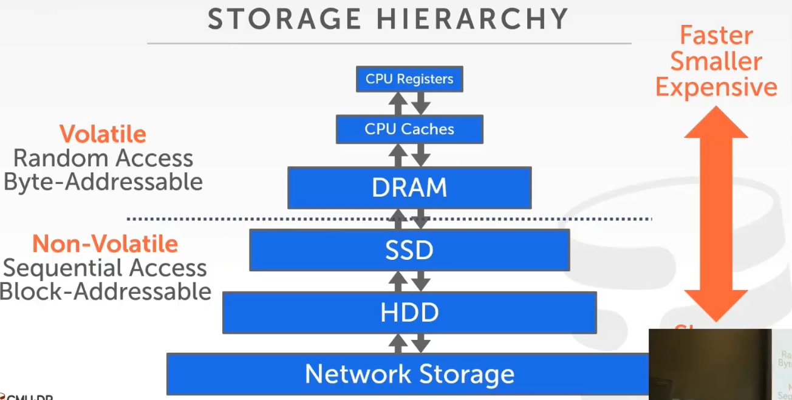

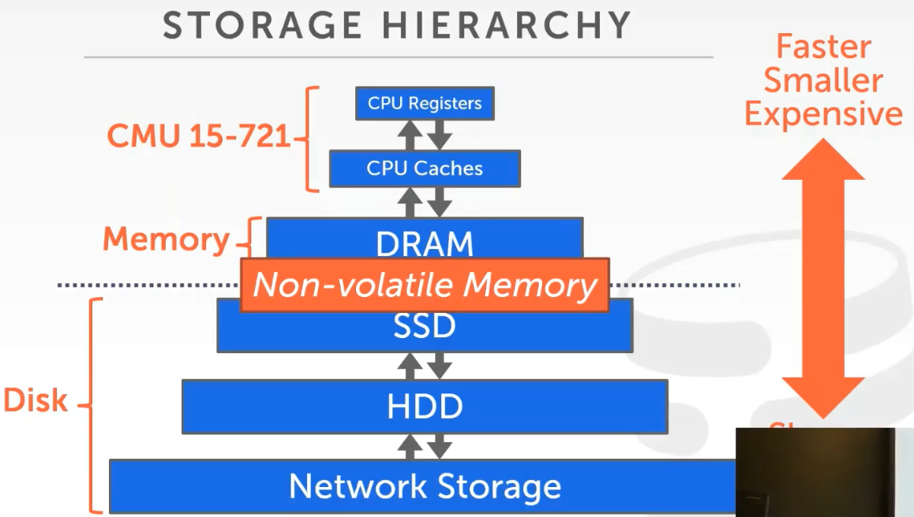

读取64bit的访问时间表:

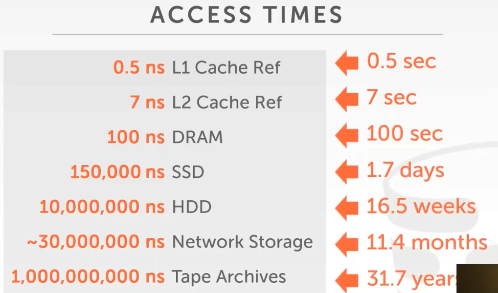

磁盘数据库的设计目标：
* 允许DMBS去管理超出内存容量的数据。
* 最小化从磁盘读写和运行查询对性能造成的影响。

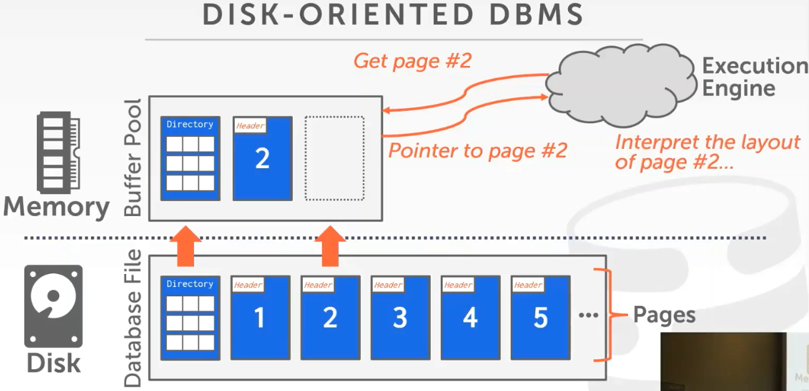

## Page Directory

页目录负责管理磁盘文件的页，并提供page id -> page的一对一映射。

为什么不使用OS的mmap来管理内存：
* 失去对内存写回磁盘的时机的控制，OS可能会把dirty page写入磁盘而我们一无所知。
* DBMS有更多的信息，能管理得比OS更好。
* Page faults造成的线程阻塞不可控。
* DBMS无法进行perfetching。

## File Storage

DBMS将数据存储在一个或多个文件中。

大多数数据库都会选择将数据存储在多个文件中，少部分（如sqlite）将数据存储在单个文件中。

分散在多个文件的原因：数据库可能非常大（多大几PB），这种情况下错误修复会非常麻烦。

某些高端数据库会定制自己的文件系统（例如Oracle，SQL server，DB2）。

现代数据库通常不会这么做，因为花费时间定制文件系统不值得（至多获得10%的性能提升）。

Storage Manager负责维护磁盘文件，跟踪页中数据的读写和页中的可用空间。

Self-Contained Page：如何解释page内容的元数据保存在page中，方便磁盘出现故障后通过16进制工具恢复（存储开销巨大，确保你确实需要这么做）。

对磁盘进行write/flush操作时，存储设备只保证4KB的写入是原子的。

大多数数据库使用Heap File组织数据。

Heap File是一个无序的page集合。

有两种表示Heap File的方式:
* Linked List
* Page Directory

Linked List Heap File不推荐使用。

Page Directory Heap File会在文件的头部放置Page Directory和一些元数据。
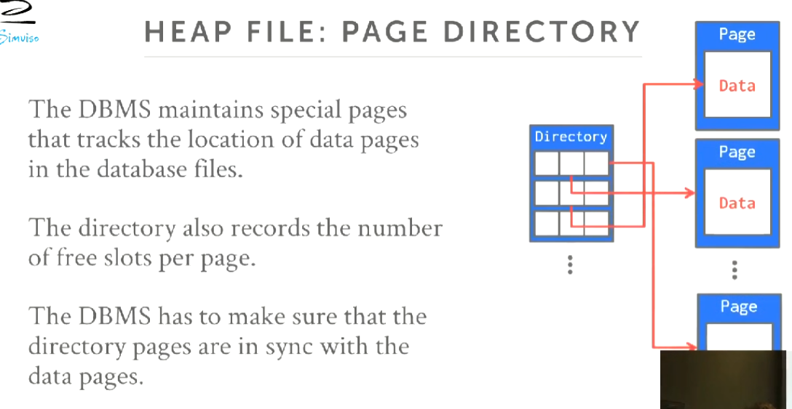

写入之后还需要更新Page DIrectory。

## Page Layout

Page的头部通常存在一些元数据:
* 页大小
* 校验和
* DBMS版本
* 事务可见性
* 压缩信息
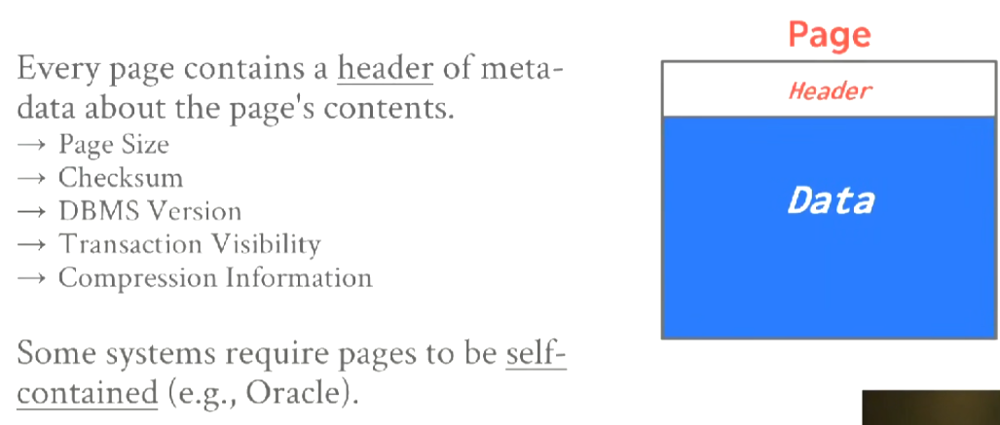

主要有两种表达数据的方式：
1. 面向Tuple的page
2. 日志结构的page

### Tuple Orient Page(面向Tuple的page)

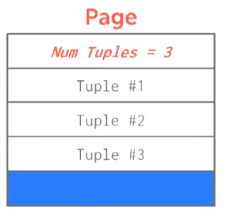

连续存放是一个bad idea，因为会产生大量碎片，或者强制移动所有tuple。

### Slotted Page

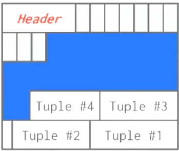

每个tuple在一个slot中，通过slot array把slot映射到tuple上。

slot从低地址开始增长，tuple从高地址开始增长。

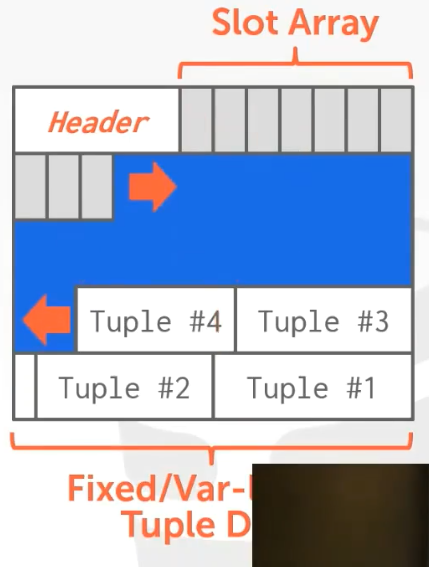

slotted page移动快速，因为只需要移动slot在array的位置即可。

当page满了之后还可以尝试压缩，来回收碎片化的空间（通常在后台进行，或者在插入时发现没有空间再运行）。

### Logstructed Page(日志结构的page)

不在page中存储tuples，而是存储修改tuple的信息（包括创建，更新，删除）。

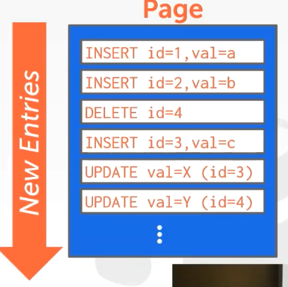

顺序的append非常快，通常用在分布式系统中（例如：HDFS,S3）。

但是read非常慢，因此log增长到一定长度要进行压缩（compact）。

| | | |
|-|-|-|
||⇨|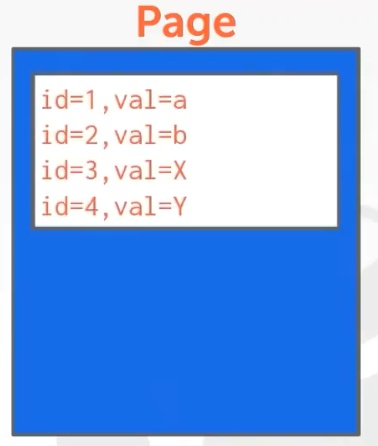|

## Tuple Layout

每个tuple都有一个tuple header，tuple header包含一些元数据：
* tuple的可见性，用于并发控制。
* Null值bitmap，用于标识tuple哪一个部分为Null。

## Data Representation

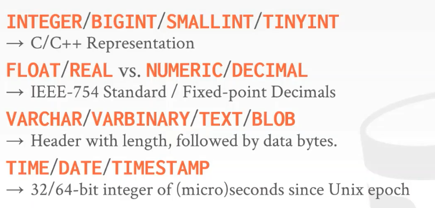

Fixed-point Decimals通常需要DBMS自己实现。

VARCHAR/VARBINARY/TEXT/BLOB通常有个header保存自己的长度。

Float-point的执行速度很快，但是会有舍入误差，而且也不符合交换律和结合律。

Fixed-point的执行速度很慢，但它是精确的。

Fixed-point的典型实现（PostgreSql）：

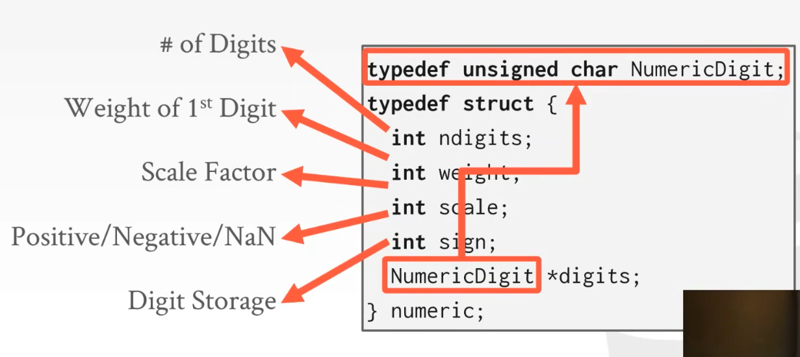

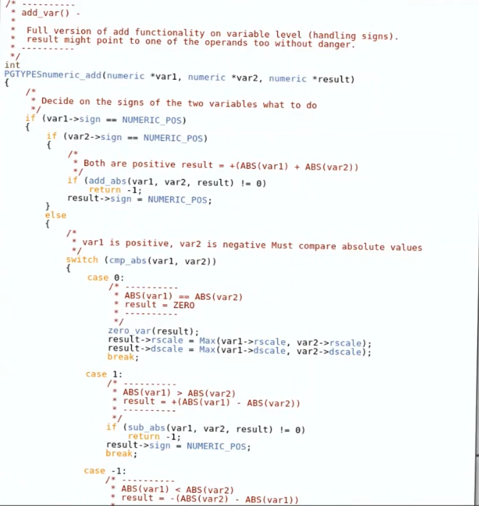

### Large Value

Large Value指那些无法在单个page中放置的tuple。

存储方法：
* Overflow Page
* External Value Storge

### Overflow Page

假设属性c非常大：

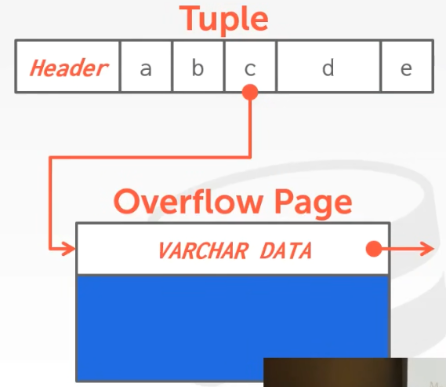

如果单个overflow page不能放置，还可以使用间接的overflow page（即使用overflow page存指针）。

### External Value Storage

同样假设c非常大：

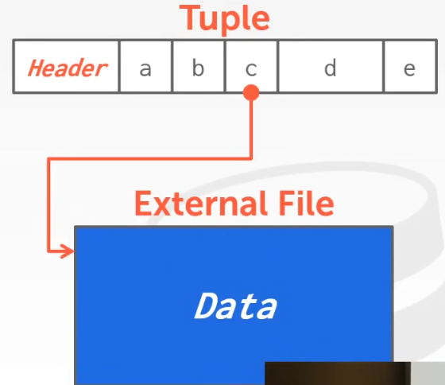

外部存储可以是一个指针，一个路径或者某个外部设备。

## System Catalogs

DBMS在其内部目录中存储有关数据库的元数据（例如保存在一张特别的表中，通过这张表找查其他的表）：
* Tables,Columns,Views,Indexs
* Users,Permissons
* Internal Statistics（内部统计资料）

几乎所有DBMS都将数据库的System Catalogs存储在自己的内部.

大部分DBMS会用STANDARD INFORMATION_SCHMES API把Catalogs暴露出来。

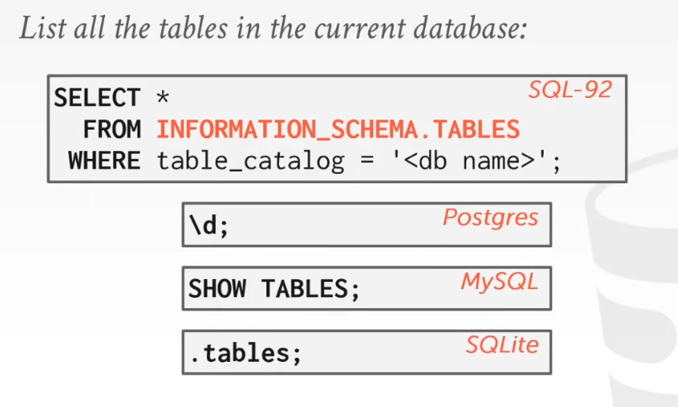

## Storage Models

Workloads:
* OLTP（大量简单事务，进行涉及少量tuple查询或更新）
* OLAP（少量复杂事务，进行涉及大量tuple查询，不会更新tuple）
* HTAP（试图同时做上面的事情）

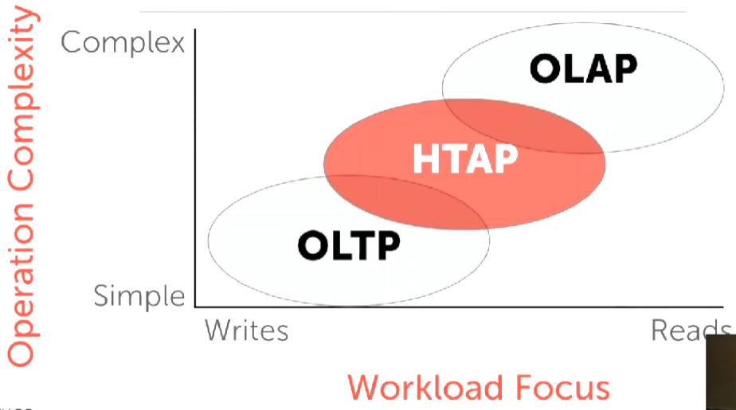

### N-Array Storage Model(Row Model)

将整个tuple像数组一样放在一起，适合OLTP Workload。

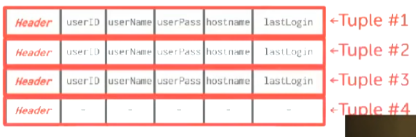

查询：

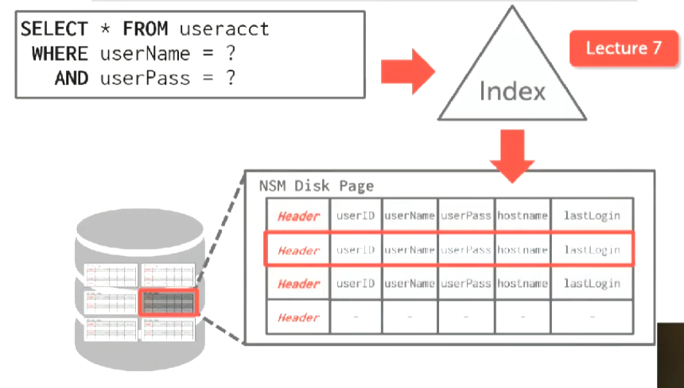

插入：

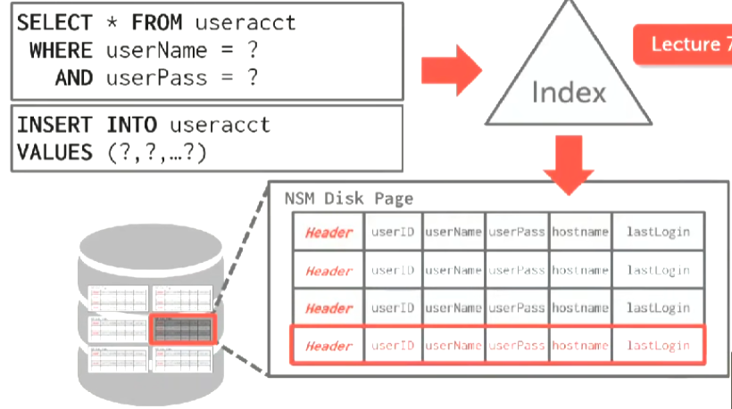

优点：
* 更快的插入，更新，删除。
* 对需要整个tuple的查询有益

缺点：
* 不适合扫描large table。
* 不适合只需tuple的部分属性的查询。

### Decomposition Storage Model(Column Model)

将tuple的各个属性分开存储，适合OLAP Workload。

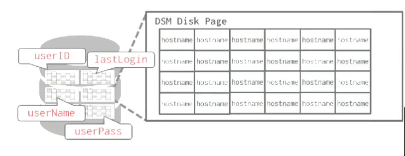

查询：

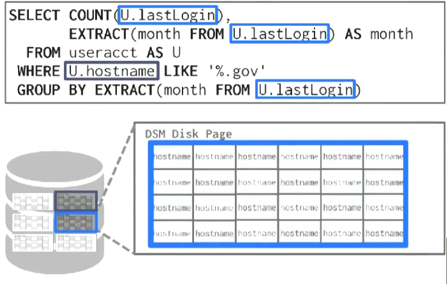

识别tuple：
* Fixed-length Offsets（每个colmns下的值都是定长的，这样就可以通过offset识别tuple）
* Embedded Tuple Ids（每个colmns内嵌一个tuple id）

|Fixed-length Offsets|Embedded Tuple Ids|
|-|-|
|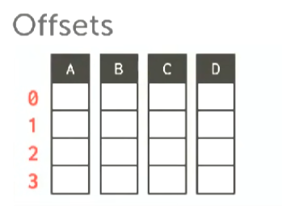|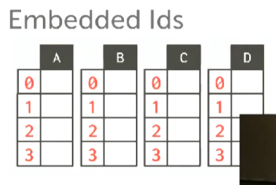|

优点：
* 减少I/O浪费。
* 对查询处理和数据压缩有益。

缺点：
* 点查（point queries）很慢。
* 插入，更新，删除很慢，因为拆分了tuple。

## ETL（提取、转换、加载）

ETL 从前端OLTP数据孤岛中提取数据，进行数据清洗然后传入后端的OLAP数据仓库，运行分析，然后传回前端OLTP数据库。

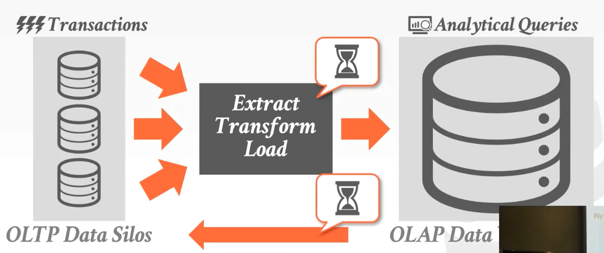

数据孤岛是多个互相分离的数据库，无论是不是一个节点，并且不会相互交流。

HLTP通常也部署为数据孤岛，并做一些平常只在OLAP数据库做的操作，但我们依旧需要大型数据仓库（因为我们需要看到所有数据放在一起的情况），但在前端做一些分析仍然是一种优势。

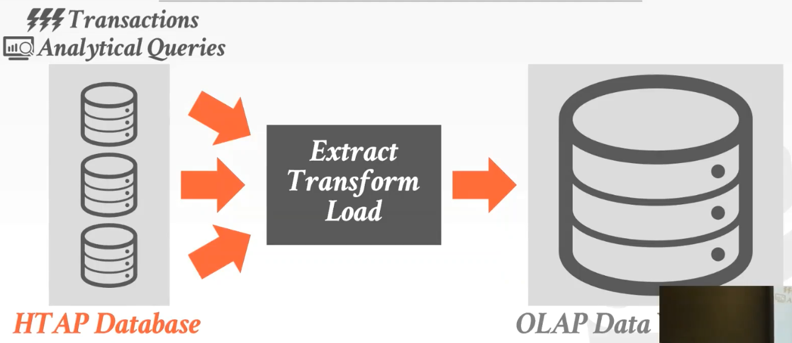

