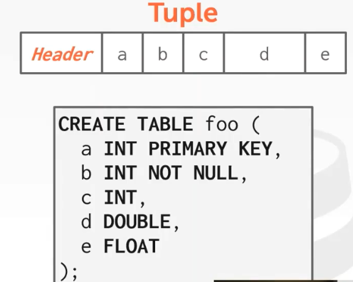

# Database Storage

存储层次结构图

读取64bit的访问时间表:

磁盘数据库的设计目标：
* 允许DMBS去管理超出内存容量的数据。
* 最小化从磁盘读写和运行查询对性能造成的影响。

## Page Directory

页目录负责管理磁盘文件的页，并提供page id -> page的一对一映射。

为什么不使用OS的mmap来管理内存：
* 失去对内存写回磁盘的时机的控制，OS可能会把dirty page写入磁盘而我们一无所知。
* DBMS有更多的信息，能管理得比OS更好。
* Page faults造成的线程阻塞不可控。
* DBMS无法进行perfetching。

## File Storage

DBMS将数据存储在一个或多个文件中。

大多数数据库都会选择将数据存储在多个文件中，少部分（如sqlite）将数据存储在单个文件中。

分散在多个文件的原因：数据库可能非常大（多大几PB），这种情况下错误修复会非常麻烦。

某些高端数据库会定制自己的文件系统（例如Oracle，SQL server，DB2）。

现代数据库通常不会这么做，因为花费时间定制文件系统不值得（至多获得10%的性能提升）。

Storage Manager负责维护磁盘文件，跟踪页中数据的读写和页中的可用空间。

Self-Contained Page：如何解释page内容的元数据保存在page中，方便磁盘出现故障后通过16进制工具恢复（存储开销巨大，确保你确实需要这么做）。

对磁盘进行write/flush操作时，存储设备只保证4KB的写入是原子的。

大多数数据库使用Heap File组织数据。

Heap File是一个无序的page集合。

有两种表示Heap File的方式:
* Linked List
* Page Directory

Linked List Heap File不推荐使用。

Page Directory Heap File会在文件的头部放置Page Directory和一些元数据。

写入之后还需要更新Page DIrectory。

## Page Layout

Page的头部通常存在一些元数据:
* 页大小
* 校验和
* DBMS版本
* 事务可见性
* 压缩信息

主要有两种表达数据的方式：
1. 面向Tuple的page
2. 日志结构的page

### 面向Tuple的page

连续存放是一个bad idea，因为会产生大量碎片，或者强制移动所有tuple。

### Slotted Page

每个tuple在一个slot中，通过slot array把slot映射到tuple上。

slot从低地址开始增长，tuple从高地址开始增长。

slotted page移动快速，因为只需要移动slot在array的位置即可。

当page满了之后还可以尝试压缩，来回收碎片化的空间（通常在后台进行，或者在插入时发现没有空间再运行）。

## Tuple Layout

每个tuple都有一个tuple header，tuple header包含一些元数据：
* tuple的可见性，用于并发控制。
* Null值bitmap，用于标识tuple哪一个部分为Null。

