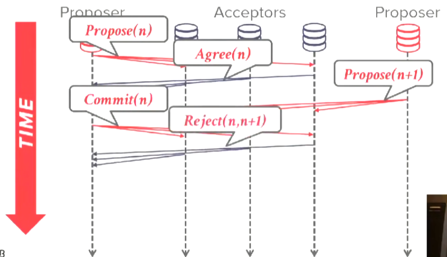

# Distributed Database

## System Architechures

系统架构：
* Shared Everything - 共享一切，常见于单机。
* Shared Memory - 共享内容和磁盘，常见于高性能并行系统（科学计算系统）。
* Shared Disk - 共享磁盘，常见于云原生系统、云数据库（disk通常指分布式存储）。
* Shared Nothing - 无共享，常见于分布式系统。

|Shared Everything|Shared Memory|Shared Disk|Shared Nothing|
|-|-|-|-|
|||||

Shared Disk系统通常只需要添加一个无状态的worker node就能完成系统扩展。

|Orignal|Extend|
|-|-|
|||

但在update时，将产生一致性问题，更新者必须通知其他worker node。

|Update Procedure|
|-|
||
||

Shared Nothing是分布式DBMS最常用的架构。

|Read A Key|Read Multi-Keys|
|-|-|
|||

扩展时需要进行数据迁移。

|Orignal|Extend|
|-|-|
|||

## Design Issues

Homogenous Node vs Heterogenous Node：
* Homogenous Node - 集群中的每一个节点都能执行相同的任务，进行故障转移和预防很容易。
* Heterogenous Node - 集群中的节点不是平等的，特定节点执行特定任务，允许物理节点（机器）运行多个虚拟节点。

data transparency（数据透明性）指应用程序不知道分布式数据库如何切分table和复制table。

## Partitioning Schemes

database partitioning（数据库分区）的方案：
* Naive Table Partitioning - 让每个节点保存一张table。
* Horizonal Partitioning - 大部分DBMS使用这种方案，每个节点保存table的不相交的子集（通过partition key决定tuple属于哪个partition），通常有hash partitioning和range partitioning两种。

shared nothing系统进行physical partitioning，shared disk系统进行logically partition。

|Naive Table Partitioning|Horizonal Hash Partitioning|
|-|-|
|||

*NOTE:hash partitioning不支持range query，并且迁移比较困难（除非使用consistent hashing）。*

|Logically Partition|Physical Partitioning|
|-|-|
|||
|||
|||

## Consistent Hashing

查询时，执行hash之后按顺时针找到最近的node。

*NOTE：key space指前一个分区到下一个分区之间的空间。*

添加新节点时，只需要迁移后一个节点的数据到新节点。

删除节点时，需要把被删除节点的数据迁移到后一个节点。

可以在consistent hashing中复制：
|Replica|Hashing|
|-|-|
|||

*NOTE：replica factor（复制因子）指副本的个数。*

## Distributed Concurrency Control

Distributed Transaction（分布式事务）指那些访问多个partition的transaction。

分布式事务通常需要coordinate（协调），有两张方式：
* Centralized - 使用全局协调器，每一个分布式事务都需要通过这个协调器进行，通常使用带middleware的方案。
* Decentralized - 参与事务的节点自己判断是否能够进行该事务，通常在参与者节点中选出一个主节点充当协调者。

|Centralized|Centralized（Middleware）|Decentralized|
|-|-|-|
||||
||||
||||
||||
||-|-|

*NOTE：这里都使用2PC的方式提交。*

## Distributed OLTP Database

*NOTE：我们假设运行数据库的节点是可信的、友好的、非恶意的。*

*NOTE：如果节点可能出现任意的恶意行为（即出现了拜占庭错误），则称它为拜占庭节点，能容忍拜占庭错误的容错技术称为拜占庭容错（BFT）。*

## Atomic Commit Protocol

当跨越多个节点的事务完成，DBMS需要询问事务的参与者是否能够安全地提交事务。

有以下几种方式：
* Two-Phase Commit（2PC） - 二阶段提交。
* Three-Phase Commit（3PC） - 三阶段提交，已不再使用。
* Paxos - Paxos共识算法。
* Raft - Raft共识算法。
* ZAB（Apache Zookeeper） - ZAB共识算法。
* Viewstamped Replications - VSR共识算法。

*NOTE：通常使用共识算法管理复制，使用2PC进行跨分区的分布式事务。*

2PC分为两个阶段：
* Prepare - 事务的协调者将事务发送给每一个参与者，参与者将查看是否可以提交事务，如果可以提交则参与者做出承诺，绝不在承诺之后拒绝事务（这意味着参与者必须将事务记录到日志中，以在崩溃之后进行恢复）。
* Commit - 事务的协调者必须收集到所有参与者对事务的承诺（否则终止事务）然后记录在自己的log中（保证恢复之后能够commit事务），然后发送提交消息给所有参与者。

|2PC（Success）|2PC（Abort）|
|-|-|
|||
|||
|||
|||
|||
|||

可以对2PC进行两种优化：
* Early Prepare Voting - 如果发送给协调者的查询是事务要执行的最后一个查询，那么可以省略commit request，让协调者直接进入2PC的Prepare阶段（省去一个网络消息）。
* Early Acknowledgement After Prepare - 如果协调者收集到了所有节点的承诺，那么先告诉外部事务已提交再进入commit phase（异步进行提交）。

|Early Acknowledgement After Prepare|
|-|
||
||
||
||
||
||

Paxos工作方式与2PC相似，但只需要大多数的同意。

|Paxos（Suceess）|Paxos（Reject）|
|-|-|
|||
|||
|||
|||
|||
|-||
|-||
|-||
|-||
|-||

*NOTE:Pasox可能出现live lock，因为算法没有决定proposer的数量，Pasox的变种multi-paxos通过选举一个唯一的proposer（leader）的方式解决了这个问题。*

## Replication

有多种复制方案：
* Master-Replica（leader-follower、master-slave） - 只有一个可写的节点同时该节点负责传播外部的写操作，只有当该机器死亡时，才从其他机器中选择一个接替。
* Multi-Master - 集群中有多个节点可以接受写操作，当写操作产生冲突时决定该使用哪一个写入的值。

K-Safety指当对象的副本数量低于某个指时判断系统为可不用，K代表对象在集群中的副本数量（每个replica只能拥有一个副本）。

对于Master-Replica复制来说，有三种写入的传播方案：
* Asynchronous（Eventual Consistency） - 异步地传播写操作，向外部应答时不需要等待所有replicas完成写操作。
* Synchronous（Strong Consistency） - 同步地传播写操作，只有所有的replicas都完成写操作才向外部应答。
* Half Synchronous - 写操作传播到某个数量（通常是大多数）的replica之前不向外部应答，当一定数量的replica完成写操作后再向外部应答，剩下的replicas则进行异步传播。

写操作传播时机：
* Continuous - 当master收到写入时，立刻将写入传播到replicas（大多数DBMS使用这种）。
* On Commit - 当master收到commit时，才将它产生的写入传播到replica。

事务的落地方式：
* Active-Passive - master将事务的log传播给replicas（先在master上执行）。
* Active-Active - master将事务的SQL语句传播给replicas（同时执行），master和replicas独立地执行语句，最后验证执行的结果是否相同。

## CAP Theorem

一个系统不可能同时拥有CAP特性：
* Consistency - 副本间维持一致（即使线性化）。
* Always Available - 永远可用。
* Network Partition Tolerant - 网络分区容忍。

*NOTE：通常在CP与AP之间进行选择。*

## Federated Databases

Federated Databases（异构联合数据库）指哪些每个节点上运行的DBMS软件不一致的分布式数据库。

通常通过中间件或者foreign data wrapper实现。

|Federated Databases（Middleware）|Federated Databases（Postgresql Foreign Data Wrappers）|
|-|-|
|||

## Distributed OLAP Database

