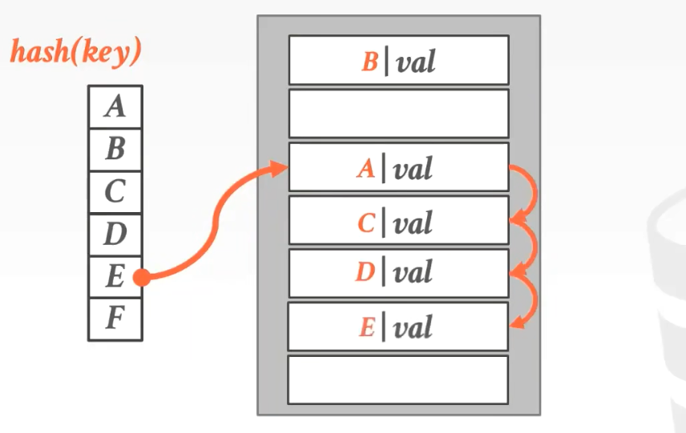
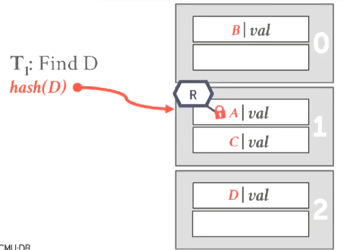
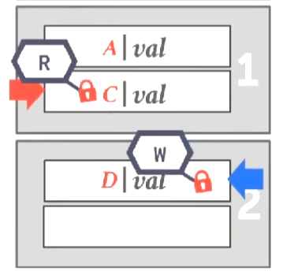

# Hash Table

Hash table是无序的关联容器。

空间复杂度：`O(n)`。

操作复杂度：
* 平均：`O(1)`。
* 最差：`O(n)`。

有两大类：
* 静态hash tbale（提前知道hash table需要存多少个元素）。
* 动态hash table（不知道hash table需要存多少个元素）。

完美hash函数：指不会发送碰撞的hash函数，实际上不存在。

Hash table由两个部分组成：
* Hash Function - 负责执行将key转化成offset。
* Hash Scheme - 负责处理冲突。

## Hash Functions

目前使用的hash functions：
* CRC-64（1975）-> 通常在网络中使用，用于错误检测。
* MurmurHash（2008）-> 快速，通用目的的hash函数。
* Google CityHash（2011）-> 对于短key（小于64bytes）很快。
* Facebook XXHash（2012）-> zstd compression的作者创造，XXHash3是目前最好的hash函数。
* Google FarmHash（2014）-> CityHash的升级版本，有更低的碰撞率。

## Static Hash Schemes

元素的容量固定，如果容量满了，就必须重建hash table。

## Linear Probe Hashing

也叫Open Addressing（开放地址法）。

对key进行hash，算出key的slot。

如果slot上面已有元素，那么向下扫描（循环进行，超过尾部会回到头部），直到遇到一个空的slot。

查找时，算出key的slot，从该slot开始找，直到找到对应entry，或找到一个empty slot，这意味着entry不存在。

这种做法的难点在于删除。

有两种方式：
* tombstone mark（墓碑标记）。

* data movement(进行数据移动)。

非常困难，而且容易出错。

为了弄清楚，是否应该移动，我们需要对key再进行一次hash，看看他是否被别人占了位置，如果是则移动。

对于DBMS来说，我们不关心delete，但如果需要使用hash index，我们需要处理delete的问题。

*NOTE:Linear Probe Hashing是目前最好的Static Hash Scheme，因为它具有最好的locality。*

## Robin Hood Hashing

从rich key中偷走slot给poor key。

rich和poor由key离它应该在的slot的距离数决定，越远越poor。

Robin Hood Hashing尝试使每个key都尽可能靠近他的slot。

冲突时，像Linea Probe一样向下查找slot，直到找到一个empty slot，或者能够从rich key中抢夺slot。

当要插入key(A)离A原本的位置比该slot中的key（B）离B原本的位置更远时，A就可以从B中抢夺slot。

## Cuckoo Hashing

使用多个Hash Table，使得查找和删除一直保持`O(1)`，但插入的代价很高。

通常只使用两张hash table，更多的hash table是不必要且不切实际的。

同时对需要插入的key做两次不同的hash，看哪个hash table的slot是空的，插入到该table中。

如果两个都是满的，那么随便抢走一个slot，然后，被抢走slot的key重新插入到另外一个table中，直到有empty slot出现，如果出现抢夺，被抢走slot的key重复此过程。

我们需要记录最初插入的key，这样当最初插入的key也无slot也用时，就必须执行resize扩容。

## Non-Uniqued Key

有两种方式维护非唯一键（一个键有多个值）：
* Separate Linked List（分离链表）。

将值存在一个链表中，slot存链表的指针。

* Redundant Key（冗余的键）。

查询所有数据需要从key对应的offset开始扫描，直到遇到empty slot。

在实践中，所有人用的都是第二种。

## Dynamic Hash Schemes

在扩容时，不会导致整个table重建。

## Chained Hashing

又叫链表法，Chained Hash Table，Bucket Hash Table，人们最常用的hash table。

当冲突时，在bucket（bucket由多个slot组成）的末尾继续添加entry。

但是冲突太多，查找容易退化为循序扫描。

优化方式：当长度超过某个阈值时对bucket进行再次hash。

## Extendiable Hashing

记录一个全局counter，表示使用hash的bit的数量（从高bit往低bit走），必须与bucket pointers的数量对应。

例如:counter是2，就需要4个bucket pointers，但是可以指向相同的bucket。

对于每个bucket，它们有一个local counter，负责记录它们内部使用的bit数量（同样从高bit往低bit走）。

当查找时，先计算key的hash，根据counter找到对应的bucket，然后在bucket中进行循序扫描。

插入时，找到对应的bucket，如果bucket未满则直接添加到bucket中。

如果bucket已满，则执行分裂，将counter + 1，bucket pointers数量翻倍，然后将bucket分裂并重新分配。

同时bucket pointers也应该重新映射。

## Linaer Hashing

只对溢出的bucket进行重新分配。

维护一个split pointer，指向bucket溢出后，我们要分裂的bucket。

无论溢出的是不是split pointer指向的bucket，我们始终分裂split pointer。

分裂之后，split pointer移动到下一个位置（即循环向下移动）。

当查找时，先用原来的hash对key进行hash，当bucket在split pointer下面时，那就是我们要找的bucket。

当bucket在split pointer上面时，说明bucket进行了分裂，我们需要使用最新的hash。

当split pointer分裂到`2^n`时，旧hash被新hash取代，split pointer重新指向`0`。

如果删除出现了bucket合并（最下面的bucket为空），split pointer移动到上一个位置（即循环向上移动），但是也可以不回收，有不同的取舍。

## Concurrency Control

主要有两种方式：
* Page Latch（每个bucket加latch） *更大的粒度，适合sequential scan*。

read thread在进入一个bucket之前加read latch。

write thread在进入一个bucket之前加write latch。

read thread执行正常的插入步骤，但在进入下一个bucket之前，释放上一个bucket的read latch，并加上下一个bucket的read latch。

同样write thread在进入下一个bucket之前也要释放上一个bucket的write latch，加上下一个bucket的write latch。

* Slot Latch（每个slot加latch） *更小的粒度，对点查和插入有更好的并行性*。

read thread通过`hash(key)`找到对应的slot，对那个slot加read latch。

同样write thread，找到对应的slot，然后加write latch。

write thread和read thread都执行正常的流程，但在进入下一个slot时，加上对应的latch。

| | | |
|-|-|-|
||⇨||

无论哪种方式，都需要对维护buckets的数据结构（可能是一个buckets数组）加read latch，以防这个数据结构出现变化导致segfault。