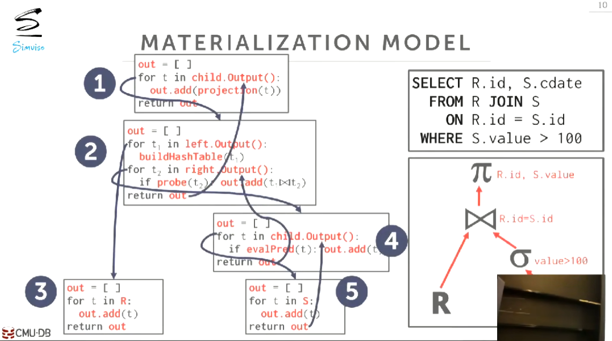

# Query Execution

## Processing Model

处理模型明确了数据库系统如何去执行一个查询计划。

它会明确我们是从上到下执行还是从下到上执行，以及在Operators之间我们实际应该传递些什么东西。

总共有三种方法，对不同的工作负载和操作环境，它们有不同的取舍，对性能的影响也不同。

## Iterator Model

最常见的模型，所有的数据库都能够这样执行查询。

也叫Volcano Model和Pipeline Model。

每一个Opeator都实现`Next()`函数,`Next()`函数只返回一个tuple。

从根节点开始调用Next函数。

如果一个节点没有tuple就去调用子节点的Next,然后在for循环中处理每一个tuple。

先处理Operator树的左边再处理Operator树的右边。


对单个tuple的处理称为Pipeline。

在处理下条数据之前，对当前的数据做尽可能多的处理。

Operators就像状态机，必须保存当前的状态，以便Next函数产生正确的结果。

有些Operators不允许我们进行流水线处理,我们把它们称为Pipeline Breaker。


例如hash join需要先遍历outer table来构造hash table，之后才能产生结果。

Pipeline breaker不可避免。

limit之类的控制输出的操作很容易做到。

## Materialization Model

主要用于内存数据库。

Operators返回所有数据。



不容易控制输出（如limit）。

不适合海量数据的分析处理。

## Vectorized Model

建立在Iterator Model之上,是对Iterator Model的优化。

`Next()`函数返回一批tuple而不是一个tuple。


如果每一批数据都能放在内存中，并且能放在寄存器中，那么就能使用SIMD来并行化，加速数据的处理和判断。

对OLAP来说最理想，同时也是磁盘数据库的最佳选择。

## Processing Direction

分别有两种：

1. 自顶向下
2. 自底向上

### 自顶向下

* 从根节点开始，父节点从它的子节点pull 数据。

* 数据通过函数调用的返回值传递。

### 自底向上

* 从叶节点开始，子节点向它的父节点push 数据。

* 对CPU Caches和Registers有更精细的控制。

第一种更适合基于磁盘的数据库。

第二种更适合内存数据库。

## Access Methods

访问方法是指我们如何去访问表中的数据，有三种基础的方式。

## Sequential Scan

```python
for page in table.pages
    for t in page.tuples 
        if evalPred(t):
            //Do Something!
```

DBMS维护一个内部的cursor来跟踪iterator离开时的状态，以便下一次取值拿到正确的tuple。

优化手段:

1. Perfetching
2. Buffer Pool Bypass
3. Parallelization
4. Zone Maps
5. Late Materialization
6. Heap Clustering

### Perfetching

提前获取将要访问的page。

### Buffer Pool Bypass

用一个小的buffer pool进行scan而不污染全局buffer pool。

### Zone Maps

提前计算好关于page的一些信息，以确定我们是否要访问这个page。


### Late Materialization


当最终结果不需要这个列时，只向上传递这个列的offset（page id之类的东西）,需要其它数据时再通过这个offset去获取数据。

例如，不需要foo.a只传递offset,后面就可以通过offset获取foo.b然后再向上传递offset,通过offset再获得foo.c。

### Heap Clustering

如果index是clustered的就可以通过leaf node去进行scan。


## Index Scan

选择更有选择性的Index进行scan，index包含的tuple越少选择性越高。

如果每一个index的选择性都很低，那不如进行顺序扫描。

### Non-Clustered Index Scan


对得出的page id进行排序，按从小到大的顺序去访问page。

## Multi-Index/"Bitmap" Scan


And 求交集，Or求并集。

PostgreSql会build一个bitmap,每一个bit对应一个record，每个index求出一个bitset，对bitmap进行操作（例如and就是&），最好bitmap中的就是最终结果。

也可以通过hash table，bloom filter的方式实现。

## Expression Evalution


将Where语句转换成表达式树。


从根节点开始进行求值，不断向下到叶节点，然后将值往上传。

如果某个子节点的值总是为常量，则可以进行查询优化（查询重写，将其重写成某个常量）。