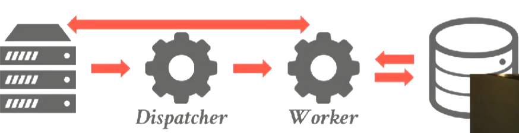
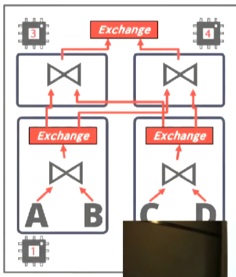
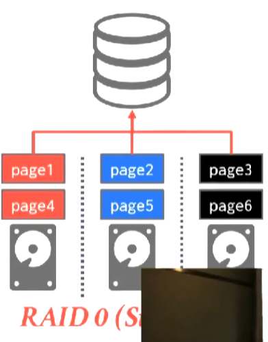

# Query Execution

## Processing Model

处理模型明确了数据库系统如何去执行一个查询计划。

它会明确我们是从上到下执行还是从下到上执行，以及在Operators之间我们实际应该传递些什么东西。

总共有三种方法，对不同的工作负载和操作环境，它们有不同的取舍，对性能的影响也不同。

## Iterator Model

最常见的模型，所有的数据库都能够这样执行查询。

也叫Volcano Model和Pipeline Model。

每一个Opeator都实现`Next()`函数,`Next()`函数只返回一个tuple。

从根节点开始调用Next函数。

如果一个节点没有tuple就去调用子节点的Next,然后在for循环中处理每一个tuple。

先处理Operator树的左边再处理Operator树的右边。


对单个tuple的处理称为Pipeline。

在处理下条数据之前，对当前的数据做尽可能多的处理。

Operators就像状态机，必须保存当前的状态，以便Next函数产生正确的结果。

有些Operators不允许我们进行流水线处理,我们把它们称为Pipeline Breaker。


例如hash join需要先遍历outer table来构造hash table，之后才能产生结果。

Pipeline breaker不可避免。

limit之类的控制输出的操作很容易做到。

## Materialization Model

主要用于内存数据库。

Operators返回所有数据。


不容易控制输出（如limit）。

不适合海量数据的分析处理。

## Vectorized Model

建立在Iterator Model之上,是对Iterator Model的优化。

`Next()`函数返回一批tuple而不是一个tuple。


如果每一批数据都能放在内存中，并且能放在寄存器中，那么就能使用SIMD来并行化，加速数据的处理和判断。

对OLAP来说最理想，同时也是磁盘数据库的最佳选择。

## Processing Direction

分别有两种：

1. 自顶向下
2. 自底向上

### 自顶向下

* 从根节点开始，父节点从它的子节点pull 数据。

* 数据通过函数调用的返回值传递。

### 自底向上

* 从叶节点开始，子节点向它的父节点push 数据。

* 对CPU Caches和Registers有更精细的控制。

第一种更适合基于磁盘的数据库。

第二种更适合内存数据库。

## Access Methods

访问方法是指我们如何去访问表中的数据，有三种基础的方式。

## Sequential Scan

```python
for page in table.pages
    for t in page.tuples 
        if evalPred(t):
            //Do Something!
```

DBMS维护一个内部的cursor来跟踪iterator离开时的状态，以便下一次取值拿到正确的tuple。

优化手段:

1. Perfetching
2. Buffer Pool Bypass
3. Parallelization
4. Zone Maps
5. Late Materialization
6. Heap Clustering

### Perfetching

提前获取将要访问的page。

### Buffer Pool Bypass

用一个小的buffer pool进行scan而不污染全局buffer pool。

### Zone Maps

提前计算好关于page的一些信息，以确定我们是否要访问这个page。


### Late Materialization


当最终结果不需要这个列时，只向上传递这个列的offset（page id之类的东西）,需要其它数据时再通过这个offset去获取数据。

例如，不需要foo.a只传递offset,后面就可以通过offset获取foo.b然后再向上传递offset,通过offset再获得foo.c。

### Heap Clustering

如果index是clustered的就可以通过leaf node去进行scan。


## Index Scan

选择更有选择性的Index进行scan，index包含的tuple越少选择性越高。

如果每一个index的选择性都很低，那不如进行顺序扫描。

### Non-Clustered Index Scan


对得出的page id进行排序，按从小到大的顺序去访问page。

## Multi-Index/"Bitmap" Scan


And 求交集，Or求并集。

PostgreSql会build一个bitmap,每一个bit对应一个record，每个index求出一个bitset，对bitmap进行操作（例如and就是&），最好bitmap中的就是最终结果。

也可以通过hash table，bloom filter的方式实现。

## Expression Evalution


将Where语句转换成表达式树。


从根节点开始进行求值，不断向下到叶节点，然后将值往上传。

如果某个子节点的值总是为常量，则可以进行查询优化（查询重写，将其重写成某个常量）。


## Parallel vs Distributed


## Process Model

处理模型是如何组织系统来通过多个workers来处理并发请求的方式。

### Process per DBMS Worker

最基础的方案，我们把单个OS进程作为worker使用。



特点：
* 可承受性（worker崩溃不会导致系统崩溃）。
* 通过共享（mmap）全局数据结构来节省内存。
* 依赖OS调度。

### Process Pool


特点：
* 仍然依赖共享内存和OS调度。
* 对CPU Cache的局部性有害。

workers的数量通常是固定的，workers都在忙系统就会过载无法处理新的请求，但通常允许管理员分配到一个独占的worker来做一些清理工作。

一个DBMS通常只有一个process pool。

### Thread per DBMS Worker


特点：
* DBMS管理调度。
* 可能有也可能没有dispatcher线程。
* thread crash导致系统崩溃。
* 更低的上下文切换开销。
* 不需要共享内存。

workers不保证请求的不同部分被拆分到不同的worker中。

## Compute Parallelism


### Inter Query Parallelism

* 通过同时并行执行多个查询提升整体性能。
* 如果全部查询都是只读的，那么只需要少量的调度工作。
* 如果有部分查询update了database，那么我们很难保证正确性。

### Intra Query Parallelism

* 通过并行执行单个查询的operators来提升单个查询的性能。
* 从生产者/消费者范式的角度来考虑operators的组织，operators不仅是子节点数据的消费者同时也是父节点数据的生产者。
* 每个operators都有并行算法。
* 可以让多个workers访问集中式数据结构，也可以使用分区来划分工作。

### Parallel Hash Join

在分区后，使用单独的worker为R和S的每个的桶执行join。


有三种方式实现Intra Query Parallelism：

### Intra Operators Parallelism

将一个完整的operators拆解成多个平行的operators，即将数据分成多个段每个段执行的函数是一样的。

DBMS会在查询计划中插入一个exchange operator去收集子operators的数据。

例如对某张table的scan，我们可以创建多个scan operator实例，然后每个实例负责不同的段。


exchange operator有三种类型：
* Gather - 将不同的workers得到的结果进行合并产生单一的输出传递给上面的operator。
* Repartition - 将一个或多个输入根据某种属性重新拆分成多个输出将它们传递给不同的workers处理。（例如group by操作，与map reduce相似）
* Distribute - 将单个输入拆分为多个输出交给不同的worker处理。


### Inter Operators Parallelism

不同workers在同一时间执行不同的operators，又叫pipelined parallelism。


### Bushy

inter operators papallelism的扩展版本。

让多个workers在同一时刻对查询计划的不同部分进行操作。

| | | |
|-|-|-|
||⇨|

它们不是互斥的，可以结合使用。

## I/O Parallelism


对DBMS的文件和数据进行拆分，分散到存储设备的不同位置上。

方法：
* Multiple Disks per Database（一个数据库分散到多个磁盘）。
* One Database per Disk。
* One Relation per Disk。
* Split Relation across Multiple Disks（将一个关系拆分到多个磁盘）。

### Multiple Disks Parallelism 

配置OS/硬件，以便跨多个存储设备存储DBMS的文件：
* Storage Appliances
* RAID Configuration

|RAID 0|RAID 1|
|-|-|
|||

### Database Partitioning

有些DBMS允许您指定每个单独数据库的磁盘位置,缓冲池管理器将页映射到磁盘位置。

如果 DBMS 将每个数据库存储在单独的目录中，这在文件系统级别也很容易做到,但是日志文件可能是共享的。

文件系统可以通过硬链接和软链接为DBMS分布文件到多个磁盘，但log必须靠DBMS手动分区。

### Partition

将单个逻辑表拆分成多个不相交的物理段，然后存放在不同的设备上进行管理。

### Vertical Partitioning

将table的不同属性存储在不同的位置上(例如，文件、磁盘卷)。必须存储tuple 元数据来重建record。


| | | |
|-|-|-|
||⇨||

### Horizontal Partitioning

通过key将不同的tupe分区。

方法：
* Hash Partitioning（通过hash(key)%bucket进行分区）
* Range Partitioning（最常用）
* Predicate Partitioning（通过是否满足某一谓词进行分区）

| | | |
|-|-|-|
||⇨||