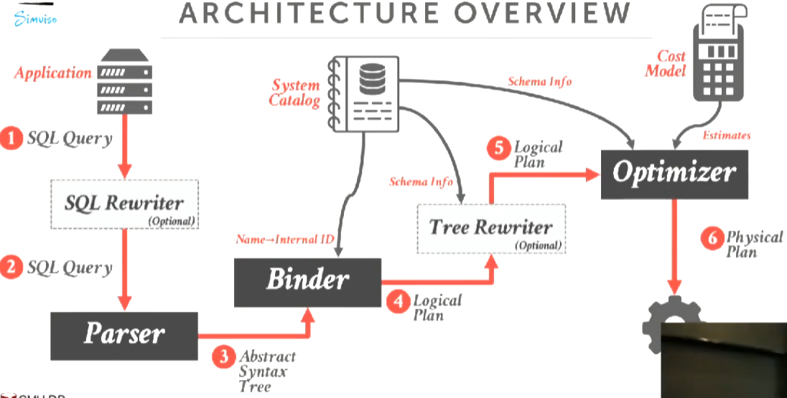
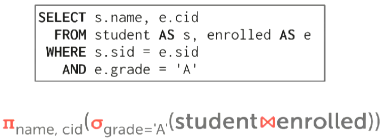
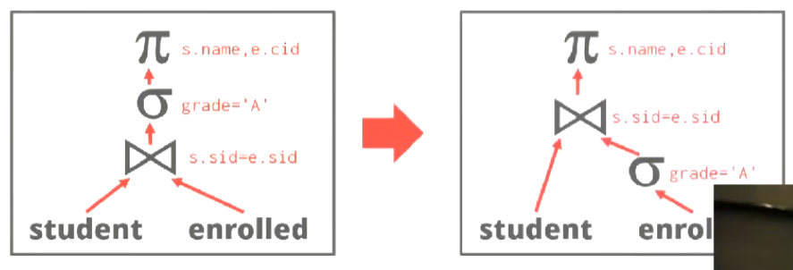
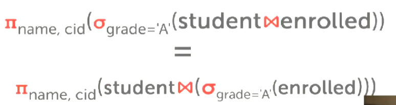
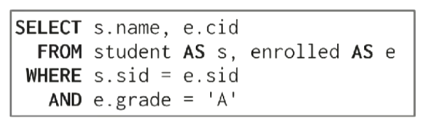
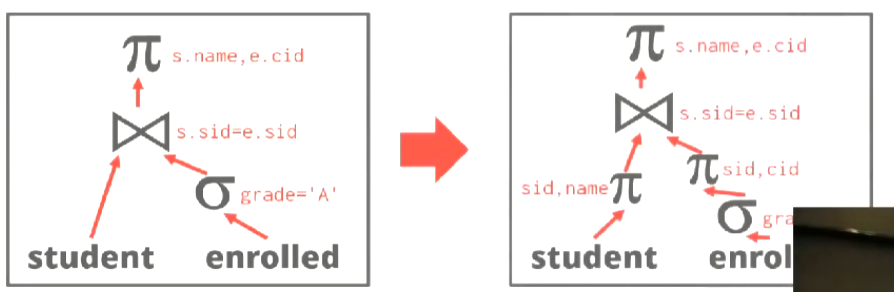

# Query Planning & Optimization

查询优化有两种策略可用：
* Heuristics / Rules - 对查询进行重写，删除或重写其中不高效的部分（依赖System Catalog中存放的元数据）。
* Cost-based Search - 枚举SQL所有可能的查询计划，并通过成本模型预估每个计划的成本，选择成本最低的计划（通常需要查看表数据来决定）。

查询优化Pipeline：

1. Application将SQL发送到SQL Rewriter（optional），rewriter通过某种规则对SQL进行重写优化。
2. 将SQL传入SQL Parser，Parser将SQL转化成抽象语法树（AST）。
3. 将抽象语法树传入Binder，Binder负责将我们使用的具名对象转化成DBMS内部的id（需要询问System Catalog来做到这点，例如`SELECT * FROM foo;`需要将表名foo转化成内部id，如果foo不存在则抛出错误），然后输出Logical Plan。
4. 将Logical Plan传入Tree Rewriter（optional），Tree Rewriter基于某种规则会对Logical Plan进行重写优化（同样需要询问System Catalog），然后输出Logical Plan。
5. 将Logical Plan传入Optimizer，Optimizer使用成本模型选择最优的查询计划（同样需要询问System Catalog），最后Optimizer输出一个Physical Plan。

_Logical Plan表明了这个查询想要做什么，但没有指定要使用的算法。_

_Physical Plan指定了实际上应该如何执行查询，指定了相应的算法。_

## Relational Algebra Equivalences

如果两个关系代数表达式是等价的，那么它们产生相同的tuple set。

DBMS基于这一点通过对查询进行优化，这种优化称为**Query Rewriting（查询重写）**。

_NOTE:tuple set是无序的，所以我们会忽略`ORDER BY`语句，这让我们有更多方案可用选择。_

方式：
* 尽早执行filters。
* 重新排序谓词，以便DBMS选择最有选择性的谓词（即filter）。
* 将一个复杂的谓词拆分成几个谓词并下推（拆分filter并下推）。

### Predicate Pushdown

通过将Filter下推来减少tuple的传递到树的上部的数量。

并不一直work，因为有些user-defined function会导致filter的执行成本很高（例如执行某些自定义的c或者python code）。

### Projection Pushdown

通过提前处理projection（投影）来减少tuple的传递到树的上部的数量。

*NOTE:在分布式数据库中很常见。*

### Rmove Impossible/Unnecessary Predicates

删除某些不必要的谓词，来减少不必要的计算。

返回一个empty set。

| | | |
|-|-|-|
||⇨||

### Join Elimination

删除不必要的join操作。

| | | |
|-|-|-|
||⇨||

此处`id`为`A`的主键，只有当key不可为null并且unique时才能做这种优化。

### Ignore Projections

删除不必要的projection。

| | | |
|-|-|-|
||⇨||

### Merge Predicates

将多个filters合并成一个，减少计算量。

| | | |
|-|-|-|
||⇨||

## Plan Cost Estimation

查询的速度由以下因素影响：
* CPU Cost - 影响小且难以估计。
* Disk - 需要传输的block的数量。
* Memory - 需要使用的内存数量。
* Network - 需要传输的消息数量。

## Plan Enumeration

## Nested Sub-queries
