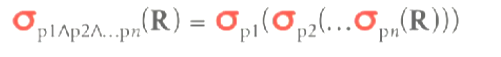
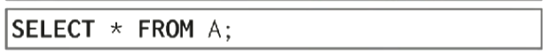
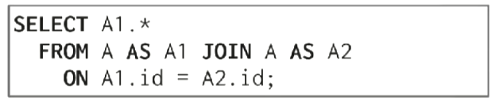

# Query Planning & Optimization

查询优化有两种策略可用：
* Heuristics / Rules - 对查询进行重写，删除或重写其中不高效的部分（依赖System Catalog中存放的元数据）。
* Cost-based Search - 枚举SQL所有可能的查询计划，并通过成本模型预估每个计划的成本，选择成本最低的计划（通常需要查看表数据来决定）。

查询优化Pipeline：

1. Application将SQL发送到SQL Rewriter（optional），rewriter通过某种规则对SQL进行重写优化。
2. 将SQL传入SQL Parser，Parser将SQL转化成抽象语法树（AST）。
3. 将抽象语法树传入Binder，Binder负责将我们使用的具名对象转化成DBMS内部的id（需要询问System Catalog来做到这点，例如`SELECT * FROM foo;`需要将表名foo转化成内部id，如果foo不存在则抛出错误），然后输出Logical Plan。
4. 将Logical Plan传入Tree Rewriter（optional），Tree Rewriter基于某种规则会对Logical Plan进行重写优化（同样需要询问System Catalog），然后输出Logical Plan。
5. 将Logical Plan传入Optimizer，Optimizer使用成本模型选择最优的查询计划（同样需要询问System Catalog），最后Optimizer输出一个Physical Plan。

_Logical Plan表明了这个查询想要做什么，但没有指定要使用的算法。_

_Physical Plan指定了实际上应该如何执行查询，指定了相应的算法。_

## Relational Algebra Equivalences

如果两个关系代数表达式是等价的，那么它们产生相同的tuple set。

DBMS基于这一点通过对查询进行优化，这种优化称为**Query Rewriting（查询重写）**。

_NOTE:tuple set是无序的，所以我们会忽略`ORDER BY`语句，这让我们有更多方案可用选择。_

方式：
* 尽早执行filters。
* 重新排序谓词，以便DBMS选择最有选择性的谓词（即filter）。
* 将一个复杂的谓词拆分成几个谓词并下推（拆分filter并下推）。

### Predicate Pushdown

通过将Filter下推来减少tuple的传递到树的上部的数量。

并不一直work，因为有些user-defined function会导致filter的执行成本很高（例如执行某些自定义的c或者python code）。

### Projection Pushdown

通过提前处理projection（投影）来减少tuple的传递到树的上部的数量。

*NOTE:在分布式数据库中很常见。*

### Rmove Impossible/Unnecessary Predicates

删除某些不必要的谓词，来减少不必要的计算。

返回一个empty set。

| | | |
|-|-|-|
||⇨||

### Join Elimination

删除不必要的join操作。

| | | |
|-|-|-|
||⇨||

此处`id`为`A`的主键，只有当key不可为null并且unique时才能做这种优化。

### Ignore Projections

删除不必要的projection。

| | | |
|-|-|-|
||⇨||

### Merge Predicates

将多个filters合并成一个，减少计算量。

| | | |
|-|-|-|
||⇨||

## Plan Cost Estimation

查询的速度由以下因素影响：
* CPU Cost - 影响小（在磁盘数据库中）且难以估计。
* Disk - 需要传输的block的数量。
* Memory - 需要使用的内存数量。
* Network - 需要传输的消息数量。

在不执行查询计划的前提下，通过cost model（成本模型）来预估查询计划的工作量。

我们列出尽可能多的查询计划，通过cost model预估它们的成本，选择最少的执行。

在DBMS中，我们用来估算成本的基础组件就算statistics catalog（统计信息）。

在主流DBMS中，有不同的SQL语句可以flush其内部的statistics catalog（通过循序扫描的方式）：
* Postgresql/Sqlite： `ANALYZE`。
* Oracle/Mysql：`ANALYZE TABLE`。
* SQL Server：`UPDATE STATISTICS`。
* DB2：`RUNSTATS`。

有些系统会将其作为定时任务执行，有些系统在执行循序扫描的时候也会自动更新statistics catalog，还有些系统通过trigger执行（例如有10%的数据发生了变化）。

statistics catalog主要维护以下数据：
* <code>NR</code> - 关系`R`的tuple数量。
* `V(A,R)` - 关系`R`的中每个属性（列）`A`的不同值的数量。
* `SC(A,R)` - Selection Cardinality（选择基数）是基于上面的信息计算出来的衍生数据<code>SC(A,R) = $\frac{N_R}{V(A,R)}$ </code>，它的意义是每一个不同的值大概有多少的tuple。
* `Sel(P)` - Selectivity(选择率)，指对于一个指定条件来说，在该table中共有多少个tuple（用于预估filter产生的tuple的数量），对于不同的谓语，选择率的计算条件不同，它的意义是某个tuple符合条件的概率（Selectivity ≈ Probability）。

*NOTE:我们假设数据均匀分布，不会产生倾斜，但复杂的DBMS必须考虑现实的数据倾斜情况。*

### Equality Predicate

Equality Predicate（`A = constant`）：<code>Sel(P) = $\frac{SC(P)}{N_R}$</code>

假设`V(age,people) = 5`并且<code>NR = 5</code>。

选择率<code>Sel(age = 2) = $\frac{1}{5}$</code>。

### Range Predicate

Range Predicate（`A >= a`）：<code>Sel(P) = $\frac{A_{max} - a}{A_{max} - A_{min}}$</code>

假设`V(age,people) = 5`并且<code>NR = 5</code>。

选择率<code>Sel(age >= 2) = $\frac{4 - 2}{4 - 0}$ = $\frac{1}{2}$</code>。

### Negation Predicate

Negation Predicate（`not P`）：<code>Sel(not P) = 1 - $\frac{SC(P)}{N_R}$</code>。

假设`V(age,people) = 5`并且<code>NR = 5</code>。

选择率<code>Sel(age != 2) = $\frac{4}{5}$</code>。

### Conjunction Predicate

假设Predicates之间相互独立。

Conjunction Predicate：<code>Sel(P1 ∧ P2) = Sel(P1) * Sel(P2)</code>。

### Disjunction Predicate

假设Predicates之间相互独立。

Disjunction Predicate：<code>Sel(P1 ∨ P2) = = Sel(P1) + Sel(P2) - Sel(P1 ∧ P2) = Sel(P1) + Sel(P2) - Sel(P1) * Sel(P2)</code>。

*NOTE:目前计算Selectivity的假设都不一定总是成立，很可能是不成立的，好的优化器必须考虑这种情况。*

### Non-Uniformed Approxximation

当数据不是均匀分布的，并且它倾斜严重，那么我们必须维护直方图。

*NOTE:同样我们也会使用heavy hitter去维护倾斜非常严重的数据的出现次数。*

直方图会维护每个value出现的次数。

直接存储直方图将带来大量的overhead，因此我们将不同的值合并成bucket，按bucket存储（也叫等宽直方图）。

这种方式也不是很好，因为很可能错估低频率的值的出现概率（例如`7`和`9`在图中的概率与`8`一样）。

解决这种问题最好的方式是使用quantiles（分位数），改变bucket的宽度，使得每个bucket的count总和大致相同。

当数据的改变率达到一定的阈值时，作废直方图，重新生成。

### Simpling

在不通过直方图生成统计信息的情况下，我们可以使用采用（Simpling）的方式。

拿到一个表的小规模副本，假设这个副本与真正的表分布情况相同。

*NOTE:高端系统会把直方图和采用一起使用。*

## Plan Enumeration

Plan Enumeration（计划枚举）是一个NP-hard问题，所以我们不会去详尽地枚举。

当进行N-Way join时，我们有<code>4N</code>个查询计划。

### Single Relation Query Planning

当只涉及一个关系时，planning的最难部分是选择适合的access method。

总共有三种选择：
* Sequential Scan。
* Binary Search（clustered indexs）。
* Index Scan。

当其他选项不可用时，使用循序扫描。

并且我们需要选择谓词的求值顺序。

总是把最具选择性的谓词排在前面，这样一次filte就能过滤掉大量的tuple。

对于OLTP查询来说，本质是我们需要做的就是鉴定这个条件是否是sargable（Search Argument Ablex，有index可用）：
1. 查看所有适合于当前查询的index。
2. 选出那个最具选择性的index。

### Multi-Relation Query Planning

由于当进行N-Way join时，我们有<code>4N</code>个查询计划。

我们需要依赖一个核心假设：只考虑left-deep join trees（左深连接树）的情况，来减少计划的数量。

这个假设来自IBM System R。

不考虑其他情况。

同时如果你始终使用left-deep join trees，那么写入到磁盘的数据量是最小的。

然后我们要枚举join的顺序，列出可用的join算法，枚举每张表的access method。

使用dynamic programming（也来自IBM System R），减少枚举的数量。

通过将大问题分解成小问题，来选择计划：
1. 枚举2-Way Join的数量（先join `R`和`S`，还是`T`和`S`或者`R`和`T`）。

2. 为每一种join枚举不同的算法。

3. 选择代价最小的算法。

4. 加入其他的表。

5. 并选择最合适的算法。

6. 只保留代价最小的路径，并重复上述过程直到所有表都完成join。

枚举每一个join顺序。

对于每一个join顺序枚举每一个join算法。

选择最优的join算法并枚举每一个access method。

完成所有顺序的枚举，并使用代价最低的顺序。

### Genetic Query Optimization (GEQO)

*NOTE:GEQO - 遗传查询优化，postgresql使用了这个算法（在join table > 12时）。*

首先列出一堆的随机计划，然后计算它们的成本。

只留下成本最低的两个，其他的扔掉，随机混合两个成本最低的计划（两个成本最低的计划会被保留），合成一个新的计划，再随机生成一些计划。

重复直到超时或者达到目标代数。

## Nested Sub-queries

有两种简单方式优化（重写）嵌套查询：
* Rwrite to Join - 将嵌套查询重写成join。

* Decompose as variable - 将嵌套查询提取出来，写成变量。

