# Tree Indexs

index是table的副本（replica），允许我们快速地执行查询。

index应该与table保持同步。

## B+Tree Overview

B-Trees:
* B-Tree(1971)
* B+Tree(1973)
* B<sup>*</sup>Tree(1977)
* B<sup>link</sup>-Tree(1981)

名称可以交替使用，B的意思是平衡。

查询、插入，删除的时间复杂度是`O(log n)`。

允许用户顺序访问和范围查询。

B+Tree是一种M-way搜索树，在tree中有个n（`n <= m`）个不同的路线到达其他节点。

每次B-Tree节点都是半满的，满足`M/2 - 1 <= keys <= M-1`。

每一个有`K`个key的节点，有`K + 1`个子节点。

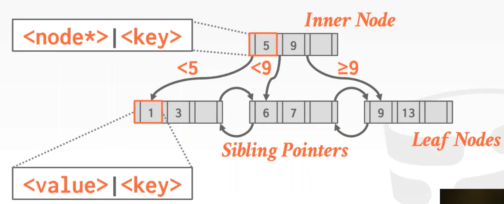

实际使用中，我们不会把key跟value放在一起。

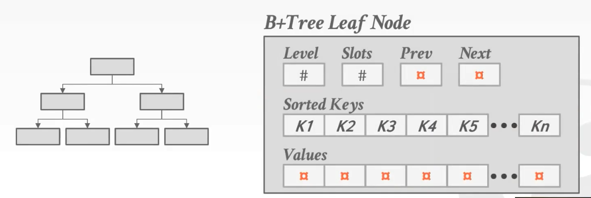

将key跟value分开，既容易处理删除，也能加快查询（因为所有keys都能放入cache中）。

Leaf Node存储什么值：
* Record Id（只保存record的id）。


* Tuple Data（保存整个完整的tuple）。


*NOTE:Oracle & SqlServer默认使用方案1（即存储Recrod id）*

B-Tree vs B+Tree：
* B-Tree 会在inner node中存储value，所以他不会存在重复的key。
* B+Tree 不会在inner node中存储value只把它当路标，所以他会存在重复的key（同时在inner node跟leaf node中），被删除的key也有可能留在inner node作为路标。
* B+Tree 更利于多线程操作，因为只需要对一个方向加latch（写总是向上传播）。

## B+Tree Insert

先向下遍历，找到对应的leaf node，然后把entry插入到leaf node中。

如果leaf node已满，那么我们分裂leaf node。

并将写操作传播到上面的inner node，如果inner node已满那么继续传播。

一个`M`为3的example。

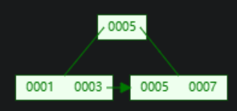

插入2：


再插入4：

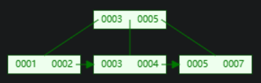

`|1 2 3 4|` 分裂为 `| 1 2 | - |3 4|`，新的路标为`3`，将其传播到inner node。 

## B+Tree Deletion

先向下遍历，找到对应的leaf node，然后删除对应的entry。

如果leaf node不是半满的，那么我们要进行leaf node的合并。

将相邻的leaf node合并起来成为一个新的leaf node，然后向上传播。

一个`M`为5的example。

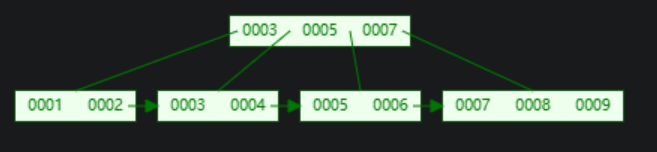

删除1：

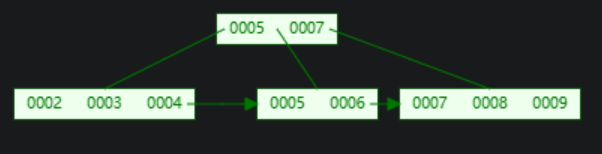

`|1 2|` 变成 `|2|`导致节点不足半满（`2`），`| 2 |`与周围的`|3 4|`合并，成`|2 3 4|`然后将删除向上传播到inner node，删除路标`3`。

*NOTE:部分高端系统会推迟合并，他们使用后台定时扫描批量合并，或者不平衡到一定程度时进行rebuild来代替。他们在周日关闭DBMS，然后rebuild all index来解决不平衡问题。*

## Clustered Index

DBMS的table heap是无序的，但是有时候我们想要让数据有序保存。

对tuple的物理布局匹配的index就是clustered index。

index中保存的page id的大小关系总是与某个属性（大部分是primary key）的大小关系一致。

例如：`primary key A > primary key B` 那么在clustered index中，`A`保存在`B`后面，且在table heap中的顺序也是如此。

## Multikey Index

查询精确值：

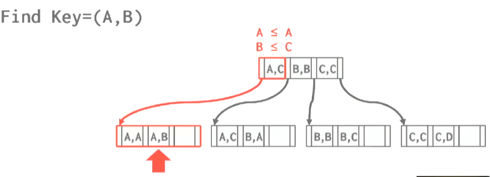

与查询单个key的index一致。

前缀搜索：

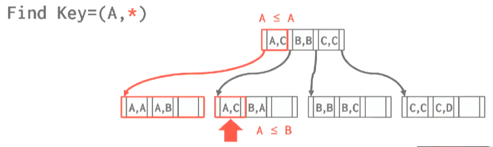

使用字典序进行二分查找。

后缀搜索：

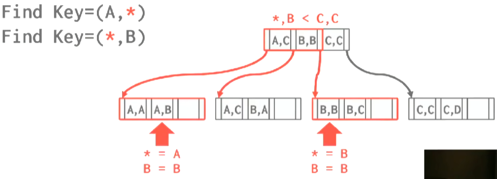

只比较后面的部分，尽可能的在inner node缩小要搜索的范围，然后进行循序找查。

## Design Decisions

Node Size：
* HDD：~ `1MB`。
* SSD：~ `10KB`。
* In-Memory：~ `512B`。

*NOTE：设备越慢，NodeSize越大。*

*NOTE:循序扫描leaf node多，NodeSize偏向大。*

*NOTE:随机点查多，NodeSize偏向小。*

## Variable Length Keys

变长key的处理方式：
* Pointer（不将key存在node中，而是存储它的指针） *现在没人这么做了*。
* Variable Length Node（变长的node size） *Bad idea，现在也没人用了*。
* Padding（填充到最大长度） *有点浪费空间，但是大多数系统选择这么做*。
* Key Map/Indirection（使用间接层）。

间接层类似slotted page：

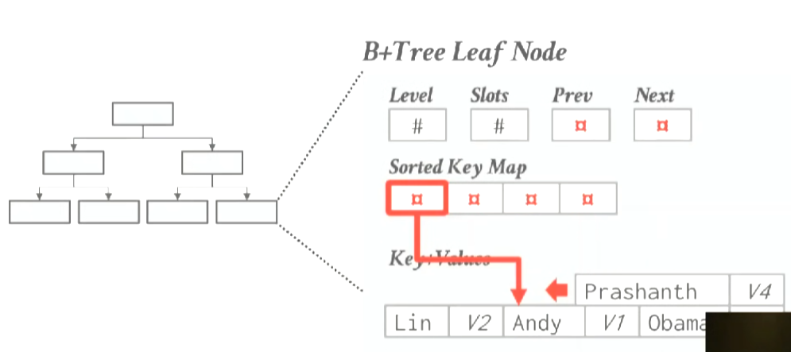

优化：

将key的一部分放在map中(in memory,磁盘中不存在)，减少一部分的循序扫描。

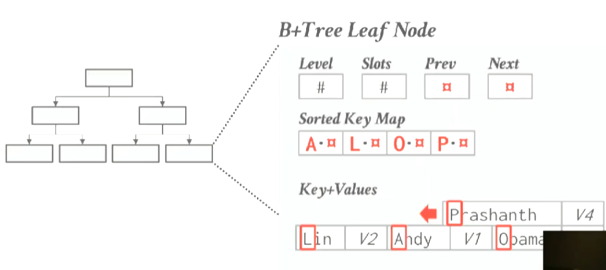

## Non-Uninqued Key Indexs

非唯一键的处理方式：
* Duplicate Keys（将重复的key存在index中,但他们可能不在一个node中）。

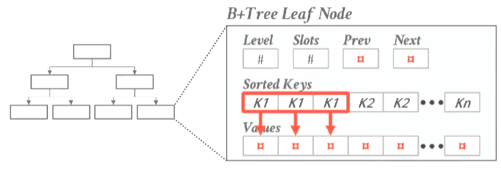

* Value Lists（将每个value存在一个list里）。

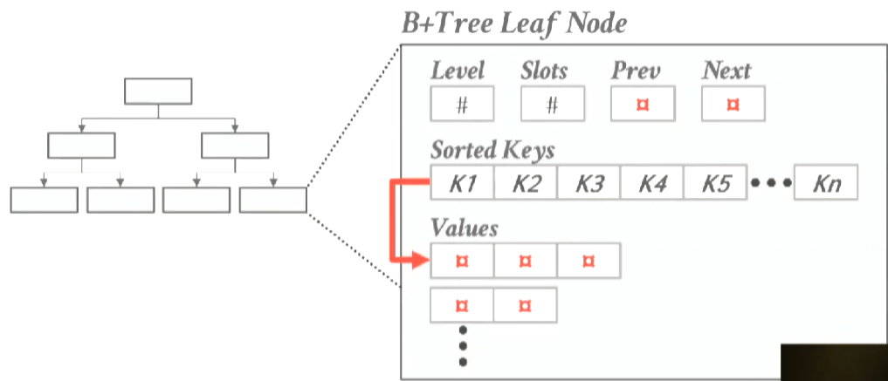

处理 Duplicate Keys:
* Append RecrodId（添加Recrod id到 key的最后面使key变uniqued） *根据partial key lookup工作*。

先将tuple插入到table heap得到recrod id。

然后执行正常的插入步骤。

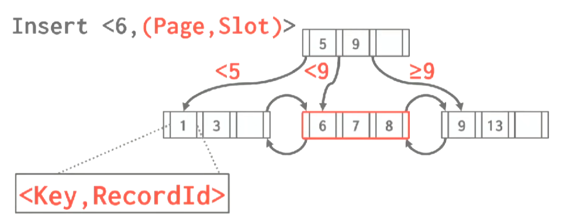


* Overflow Leaf Node（将leaf node溢出，这样我们能确保所有相同的key在同一个node） *复杂且难以维护*。

像正常插入一样执行插入过程。

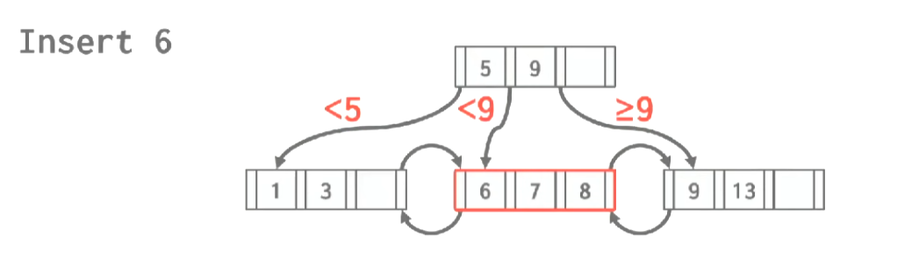

但是如果node空间不够，不进行split，而是使用overflow page。

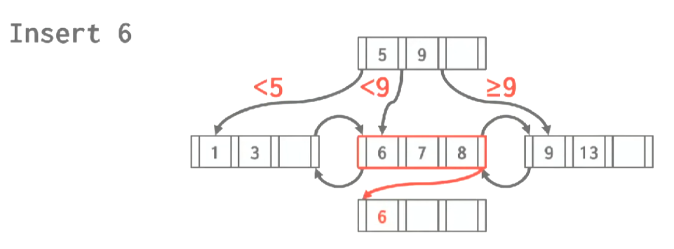

overflow之后可排序也可以不排（需要使用linear search）。

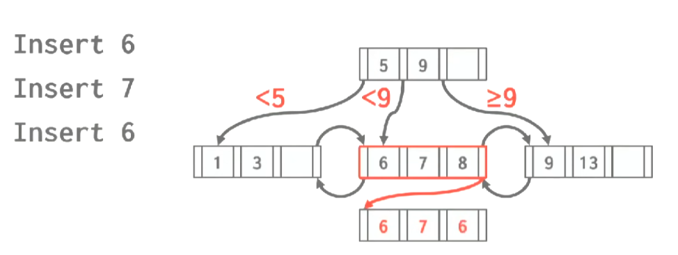

如果overflow page也满了，继续向下添加overflow page。

## Intra-Node Search

在node中的搜索方式：
* Linear Search。

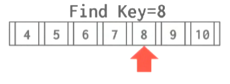

* Binary Search *普遍使用*。

| | | |
|-|-|-|
|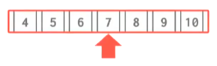|||

* Interpolation（知道keys如何分布，跳到要查找的key的大概位置，从那里开始循序查找）。

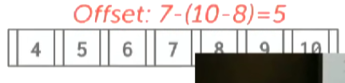

## Optimizations

## Prefix Compress

将有序的键的共同前缀提取。

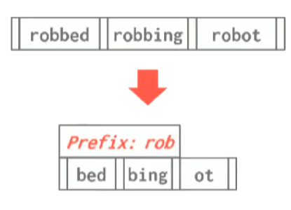

*NOTE:非常常用。*

## Suffix Truncation

我们无需在inner node中存储完整的key，只需要保证我们能够弄清楚通过哪条way就行了。

但在leaf node中还是需要存完整的key。

| | | |
|-|-|-|
|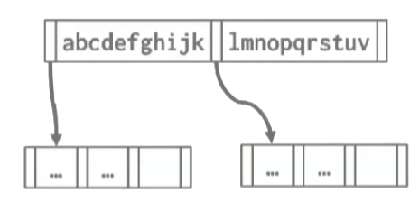|⇨|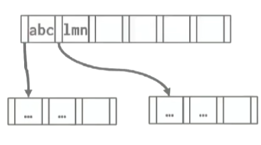|

*NOTE:需要经常维护，如果插入频繁。*

## Bulk Insert

如果我们提前拥有了所有的keys，那么我们可以进行批量的插入，而不是一个一个从上到下的构建b-tree。

首先对keys进行排序。


其次将keys填入leaf node。

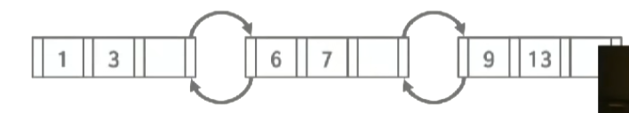

从leaf node中提取路标，构建inner node。

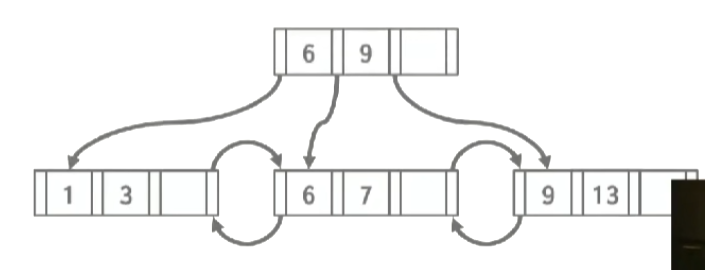

## Point Swizzling

在node中实际存的指针是page id。

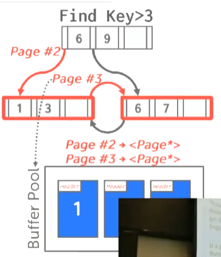

这意味着，我们每次都要通过buffer pool，这个操作很慢（因为有latch）。

如果我们能确保某些page，总是留在memory中，我们就可以使用真正的pointer。

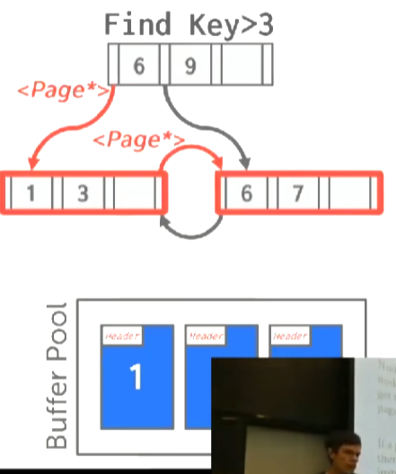


## Implict Indexes

大多数DBMS都会为table的primary key创建一个index。

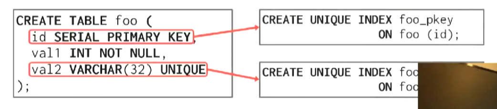

因为要确保唯一性约束（否则我们每次insert都要循序扫描,同理，unique key也会自动create index。

|❌| |✔|
|-|-|-|
|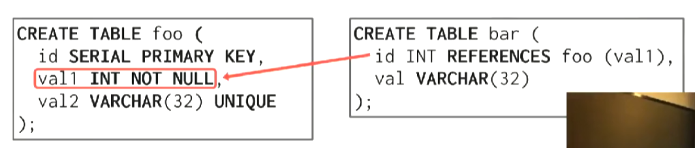|⇨|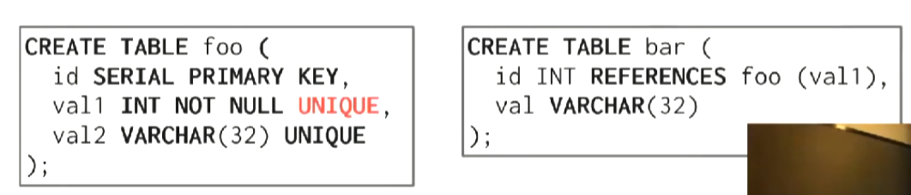|

但foreign key不会自动创建index，但只能references有unique index的key。


## Partial Indexs

给table的子集创建index（只为某些符合条件的tuple创建index）。

减少了index的size，减低了维护index的开销。

例如：

只在`c = 'WuTang'`的tuple set上创建index。 

```sql
CREATE INDEX idx_foo
        ON foo(a,b)
        WHERE c = 'WuTang'; 
```
下面这个查询将利用index。

```sql
SELECT b FROM foo
WHERE a = 123 
AND c = 'WuTang';
```

## Covering Indexes

指响应查询的数据全部在index中可以找到（不需要使用record id 访问table heap，最少只需要一次I/O）。

例如：

在`foo(a,b)`上创建index。

```sql
CREATE INDEX idx_foo
        ON foo(a,b)
```

对于这个查询，`idx_foo`是个Covering Index。

```sql
SELECT b FROM foo
WHERE a = 123 
```

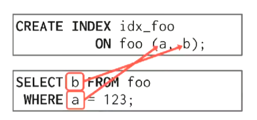

## Index Including Columns

在index中include columns，来使index尽可能对更多从查询成为covering index。

```sql
CREATE INDEX idx_foo
        ON foo(a,b)
        INCLUDE (c);
```

INCLUDE 包含的columns只在leaf node中，不在inner node中。

```sql
SELECT b FROM foo
WHERE a = 123
AND c = 'WuTang';
```

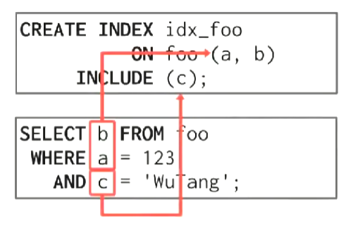

## Function/Expression Indexes

通过某个key的衍生数据创建index。

运行这种查询时，一般的index就无能为力。

```sql
SELECT * FROM user
WHERE EXTRACT(dow
        FROM login) = 2;
```

但是可以针对`EXTRACT(dow FROM login)`创建一个expression index：

```sql
CREATE INDEX idx_user_login
    ON user(EXTRACT(dow FROM login));
```

也可以使用partial index代替：


```sql
CREATE INDEX idx_user_login
    ON user(login)
WHERE EXTRACT(dow FROM login) = 2;
```

创建login是星期2的index。

但你不能为immutable expression创建index。

## Tries/Radix Tree

Tries，又名Digit Search Tree、Prefix Tree（前缀树）。

不在node中存储完整的key，而是key的digit。

key的digit是key的一部分（子集）。

tries将key分解，将digits分布在不同的层中。

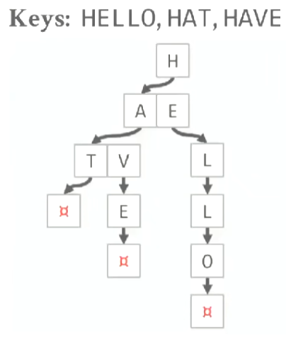

查询`HELLO`

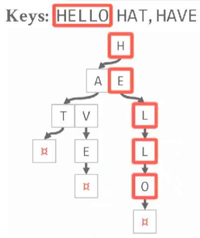

顺着每一次的digits往下查找。

tries的形状取决于key的分布和复杂度。

操作复杂度为`O(K)`其中，`K`是key的长度。

Radix Tree是Tries的特化版本（compressed）。

对Tries进行了垂直压缩。


插入需要向下遍历找到一个empty slot，然后插入entry。

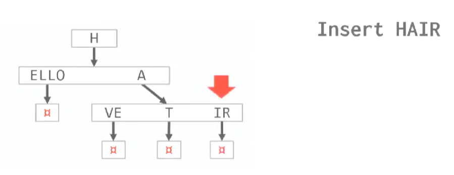

这可能会改变Radix Tree的结构，把一个slot分裂成两个。

删除也需要向下遍历，找到对应的slot删除entry。

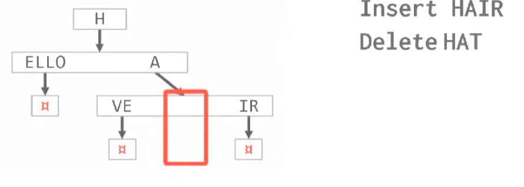

当整个layout只剩下最后一个slot时，进行compaction（压缩）。

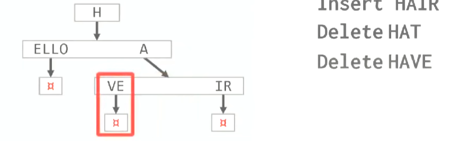

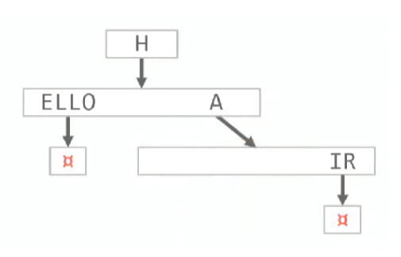

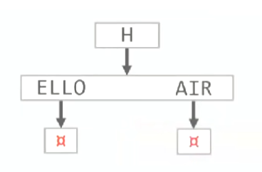

## Inverted Indexes

当我们需要在某个table中的某个colunm（该column较大）上建立index。

确认该column是否包含某个部分的时候，就应该使用Inverted Index（例如建立某篇文章的keyword index，以找出是否包含某个单词的文章）。

有时也叫full-text search index(全文搜索索引)。

## Other Indexs

多维索引：
* R-Tree。
* Quad-Tree。
* KD-Tree。