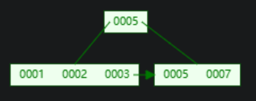

# Tree Indexs

index是table的副本（replica），允许我们快速地执行查询。

index应该与table保持同步。

## B+Tree Overview

B-Trees:
* B-Tree(1971)
* B+Tree(1973)
* B*Tree(1977)
* Blink-Tree(1981)

名称可以交替使用，B的意思是平衡。

查询、插入，删除的时间复杂度是`O(log n)`。

允许用户顺序访问和范围查询。

B+Tree是一种M-way搜索树，在tree中有个n（`n <= m`）个不同的路线到达其他节点。

每次B-Tree节点都是半满的，满足`M/2 - 1 <= keys <= M-1`。

每一个有`K`个key的节点，有`K + 1`个子节点。

实际使用中，我们不会把key跟value放在一起。

将key跟value分开，既容易处理删除，也能加快查询（因为所有keys都能放入cache中）。

Leaf Node存储什么值：
* Record Id（只保存record的id）。

* Tuple Data（保存整个完整的tuple）。

*NOTE:Oracle & SqlServer默认使用方案1（即存储Recrod id）*

B-Tree vs B+Tree：
* B-Tree 会在inner node中存储value，所以他不会存在重复的key。
* B+Tree 不会在inner node中存储value只把它当路标，所以他会存在重复的key（同时在inner node跟leaf node中），被删除的key也有可能留在inner node作为路标。
* B+Tree 更利于多线程操作，因为只需要对一个方向加latch（写总是向上传播）。

## B+Tree Insert

先向下遍历，找到对应的leaf node，然后把entry插入到leaf node中。

如果leaf node已满，那么我们分裂leaf node。

并将写操作传播到上面的inner node，如果inner node已满那么继续传播。

一个`M`为3的example。

插入2：

再插入4：

`|1 2 3 4|` 分裂为 `| 1 2 | - |3 4|`，新的路标为`3`，将其传播到inner node。 

## B+Tree Deletion

先向下遍历，找到对应的leaf node，然后删除对应的entry。

如果leaf node不是半满的，那么我们要进行leaf node的合并。

将相邻的leaf node合并起来成为一个新的leaf node，然后向上传播。

一个`M`为5的example。

删除1：

`|1 2|` 变成 `|2|`导致节点不足半满（`2`），`| 2 |`与周围的`|3 4|`合并，成`|2 3 4|`然后将删除向上传播到inner node，删除路标`3`。

*NOTE:部分高端系统会推迟合并，他们使用后台定时扫描批量合并，或者不平衡到一定程度时进行rebuild来代替。他们在周日关闭DBMS，然后rebuild all index来解决不平衡问题。*

## Clustered Index

DBMS的table heap是无序的，但是有时候我们想要让数据有序保存。

对tuple的物理布局匹配的index就是clustered index。

index中保存的page id的大小关系总是与某个属性（大部分是primary key）的大小关系一致。

例如：`primary key A > primary key B` 那么在clustered index中，`A`保存在`B`后面，且在table heap中的顺序也是如此。

## Multikey Index

查询精确值：

与查询单个key的index一致。

前缀搜索：

使用字典序进行二分查找。

后缀搜索：

只比较后面的部分，尽可能的在inner node缩小要搜索的范围，然后进行循序找查。

## Design Decisions

Node Size：
* HDD：~ `1MB`。
* SSD：~ `10KB`。
* In-Memory：~ `512B`。

*NOTE：设备越慢，NodeSize越大。*

*NOTE:循序扫描leaf node多，NodeSize偏向大。*

*NOTE:随机点查多，NodeSize偏向小。*

## Variable Length Keys

变长key的处理方式：
* Pointer（不将key存在node中，而是存储它的指针） *现在没人这么做了*。
* Variable Length Node（变长的node size） *Bad idea，现在也没人用了*。
* Padding（填充到最大长度） *有点浪费空间，但是大多数系统选择这么做*。
* Key Map/Indirection（使用间接层）。

间接层类似slotted page：

优化：

将key的一部分放在map中(in memory,磁盘中不存在)，减少一部分的循序扫描。

## Non-Uninqued Key Indexs

非唯一键的处理方式：
* Duplicate Keys（将重复的key存在index中,但他们可能不在一个node中）。

* Value Lists（将每个value存在一个list里）。

## Intra-Node Search

在node中的搜索方式：
* Linear Search。

* Binary Search *普遍使用*。

| | | |
|-|-|-|
||||

* Interpolation（知道keys如何分布，跳到要查找的key的大概位置，从那里开始循序查找）。

## Optimizations

## Prefix Compress

将有序的键的共同前缀提取。

*NOTE:非常常用。*

## Suffix Truncation

我们无需在inner node中存储完整的key，只需要保证我们能够弄清楚通过哪条way就行了。

但在leaf node中还是需要存完整的key。

| | | |
|-|-|-|
||⇨||

*NOTE:需要经常维护，如果插入频繁。*

## Bulk Insert

如果我们提前拥有了所有的keys，那么我们可以进行批量的插入，而不是一个一个从上到下的构建b-tree。

首先对keys进行排序。

其次将keys填入leaf node。

从leaf node中提取路标，构建inner node。

## Point Swizzling

在node中实际存的指针是page id。

这意味着，我们每次都要通过buffer pool，这个操作很慢（因为有latch）。

如果我们能确保某些page，总是留在memory中，我们就可以使用真正的pointer。

