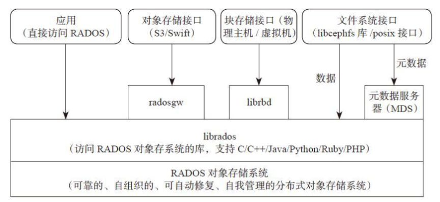
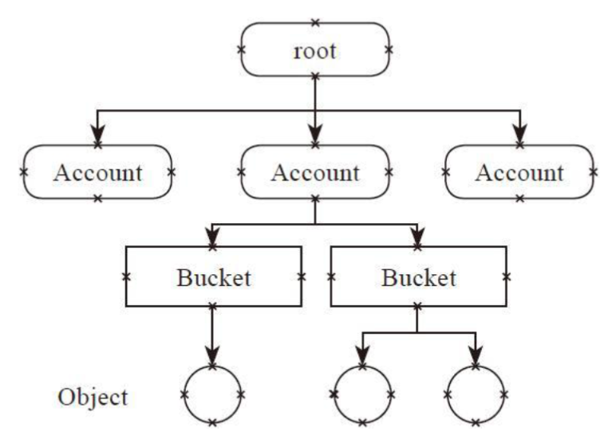
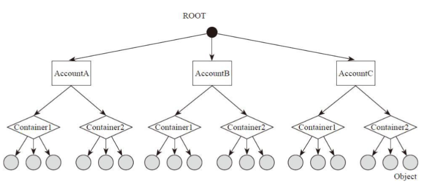
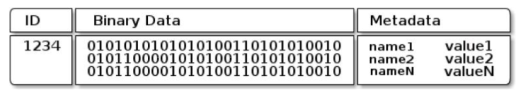
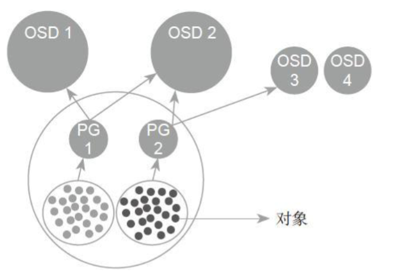
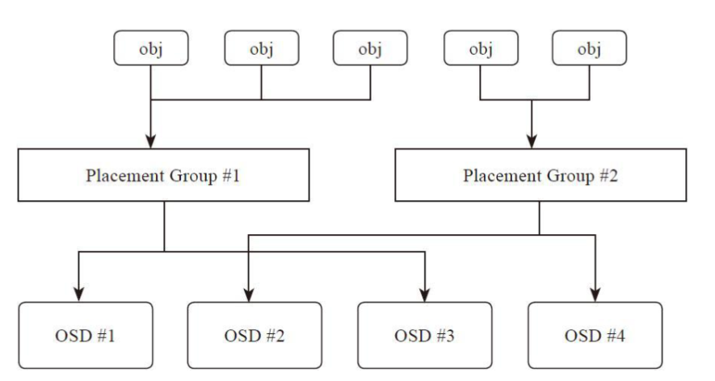
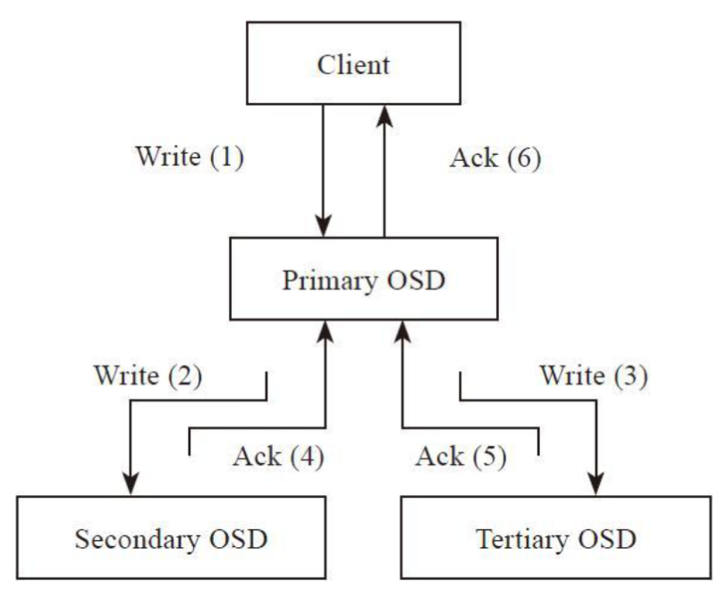
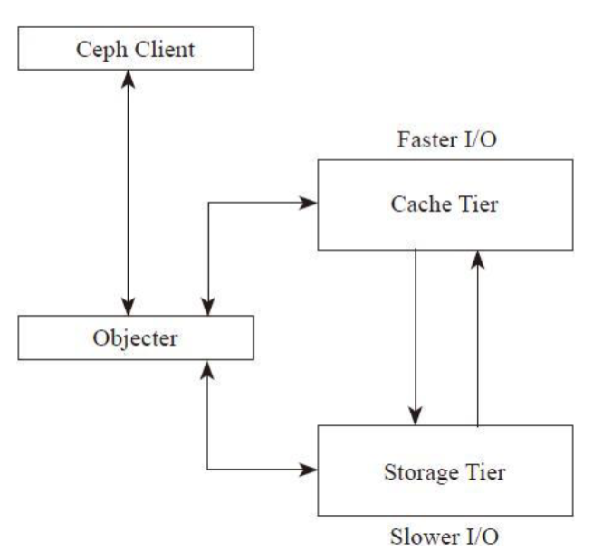

# Architecture

Ceph的整体架构大致如下：

* 最底层基于RADOS（reliable，autonomous，distributed object store），它是一个可靠的、自组织的、可自动修复、自我管理的分布式对象存储系统。其内部包括ceph-osd后台服务进程和ceph-mon监控进程。
* 中间层librados库用于本地或者远程通过网络访问RADOS对象存储系统。它支持多种语言。
* 最上层面向应用提供3种不同的存储接口：
    * 块存储接口，通过librbd库提供了块存储访问接口。它可以为虚拟机提供虚拟磁盘，或者通过内核映射为物理主机提供磁盘空间。
    * 对象存储接口，目前提供了两种类型的API，一种是和AWS的S3接口兼容的API，另一种是和OpenStack的Swift对象接口兼容的API。
    * 文件系统接口，目前提供两种接口，一种是标准的posix接口，另一种通过libcephfs库提供文件系统访问接口。文件系统的元数据服务MDS用于提供元数据访问。数据直接通过librados库访问。

## RBD

RBD（rados block device）是通过librbd库对应用提供块存储，主要面向云平台的虚拟机提供虚拟磁盘。传统SAN就是块存储，通过SCSI或者FC接口给应用提供一个独立的LUN或者卷。RBD类似于传统的SAN存储，都提供数据块级别的访问。

RBD提供了两个接口：
* 一种是直接在用户态实现，通过QEMU Driver供KVM虚拟机使用。
* 另一种是在操作系统内核态实现了一个内核模块。

块存储用作虚拟机的硬盘，其对I/O的要求和传统的物理硬盘类似。一个硬盘应该是能面向通用需求的，既能应付大文件读写，也能处理好小文件读写。也就是说，块存储既需要有较好的随机I/O，又要求有较好的顺序I/O，而且对延迟有比较严格的要求。

## CephFS

CephFS通过在RADOS基础之上增加了MDS（Metadata Server）来提供文件存储。它提供了libcephfs库和标准的POSIX文件接口。CephFS类似于传统的NAS存储，通过NFS或者CIFS协议提供文件系统或者文件目录服务。

Ceph最初的设计为分布式文件系统，其通过动态子树的算法实现了多元数据服务器，但是由于实现复杂，目前还远远不能使用。

*NOTE： Jewel版本的CephFS为主从模式（Master-Slave）的元数据服务器。*

## RadosGW

RadosGW基于librados提供了和Amazon S3接口以及OpenStack Swift接口兼容的对象存储接口。可将其简单地理解为提供基本文件（或者对象）的上传和下载的需求，它有两个特点：

* 提供RESTful Web API接口。
* 它采用扁平的数据组织形式。

RESTful 接口值提供了简单的GET、PUT、DEL等其他接口，对应对象文件的上传、下载、删除、查询等操作。

对象存储的I/O接口相对比较简单，其I/O访问模型都是顺序I/O访问。

对象存储放弃了目录树结构，采用了扁平化组织形式（一般为三级组织结构），这有利于实现近乎无限的容量扩展。

*NOTE： 树状的目录结构为早期本地存储系统设计的信息组织形式，比较直观，容易理解。但是随着存储系统规模的不断扩大，特别是到了云存储时代，其难以大规模扩展的缺点就暴露了出来。*

|S3|Swift|
|-|-|
|||

## RADOS

RADOS是Ceph存储系统的基石，是一个可扩展的、稳定的、自我管理的、自我修复的对象存储系统，是Ceph存储系统的核心。

它完成了一个存储系统的核心功能：
* Monitor模块为整个存储集群提供全局的配置和系统信息。
* 通过CRUSH算法实现对象的寻址过程。
* 完成对象的读写以及其他数据功能。
* 提供了数据均衡功能；通过Peering过程完成一个PG内存达成数据一致性的过程。
* 提供数据自动恢复的功能；提供克隆和快照功能。
* 实现了对象分层存储的功能。
* 实现了数据一致性检查工具Scrub。

## Monitor

Monitor是一个独立部署的daemon进程。通过组成Monitor集群来保证自己的高可用。Monitor集群通过Paxos算法实现了自己数据的一致性。它提供了整个存储系统的节点信息等全局的配置信息。

Cluster Map保存了系统的全局信息：
* Monitor Map：
    * 包括集群的fsid。
    * 所有Monitor的地址和端口。
    * Current Epoch。
* OSD Map：所有OSD的列表，和OSD的状态等。
* MDS Map：所有的MDS的列表和状态。

*NOTE： Current Epoch类似于Raft的term，是Multi-Paxos的“term”。*

## RADOS Object

对象由三个部分组成：
* 对象标志（ID），唯一标识一个对象。
* 对象的数据，其在本地文件系统中对应一个文件，对象的数据就保存在文件中。
* 对象的元数据，以Key-Value（键值对）的形式，可以保存在文件对应的扩展属性中。RADOS增加了另一种方式：以Leveldb等的本地KV存储系统来保存对象的元数据。

## Pool & Placement Group

Pool是一个抽象的存储池。它规定了数据冗余的类型以及对应的副本分布策略。

目前实现了两种pool类型：
* Replicated 类型。
* Erasure Code 类型。

一个Pool由多个PG构成。

PG（placement group）从名字可理解为一个放置策略组，它是对象的集合，该集合里的所有对象都具有相同的放置策略：
* 对象的副本都分布在相同的OSD列表上。
* 一个对象只能属于一个PG，一个PG对应于放置在其上的OSD列表。
* 一个OSD上可以分布多个PG。

*NOTE： PG既是Partition。*

## Object Addressing

对象寻址过程指的是查找对象在集群中分布的位置信息，过程分为两步：
* 对象到PG的映射。这个过程是静态hash映射。
* PG到OSD列表映射（指PG上对象的副本如何分布在OSD上。它使用Ceph自己创新的CRUSH算法来实现，本质上是一个伪随机分布算法。）。

## Data Read/Write

写过程：
1. Client向该PG所在的主OSD发送写请求。
2. 主OSD接收到写请求后，同时向两个从OSD发送写副本的请求，并同时写入主OSD的本地存储中。
3. 主OSD接收到两个从OSD发送写成功的ACK应答，同时确认自己写成功，就向客户端返回写成功的ACK应答。

在写操作的过程中，主OSD必须等待所有的从OSD返回正确应答，才能向客户端返回写操作成功的应答。

## Data Load Balance

当在集群中新添加一个OSD存储设备时，整个集群会发生数据的迁移，使得数据分布达到均衡。Ceph数据迁移的基本单位是PG，即数据迁移是将PG中的所有对象作为一个整体来迁移（组成PG的OSD发生了改变，导致数据迁移）。

*NOTE： 不一定是个好设计，这可能导致系统抖动。*

迁移触发的流程为：
* 当新加入一个OSD时，会改变系统的CRUSH Map。
* PG到OSD列表的映射发生了变化，从而引发数据的迁移。

## Peering

当OSD启动，或者某个OSD失效时，该OSD上的主PG会发起一个Peering的过程。

Ceph的Peering过程是指一个PG内的所有副本通过PG日志来达成数据一致的过程。当Peering完成之后，该PG就可以对外提供读写服务了。

在写操作的过程中，遇到处于不一致的数据对象需要恢复的话，则需要等待，系统优先恢复该对象后，才能继续完成写操作。

## Recovery & Backfill

Ceph的Recovery过程是根据在Peering的过程中产生的、依据PG日志推算出的不一致对象列表来修复其他副本上的数据。

当某个OSD长时间失效后重新加入集群，它已经无法根据PG日志来修复，就需要执行Backfill（回填）过程。

Backfill过程是通过逐一对比两个PG的对象列表来修复。当新加入一个OSD产生了数据迁移，也需要通过Backfill过程来完成。

## Erasure Code

目前Ceph对纠删码（EC）的支持还比较有限。RBD目前不能直接支持纠删码（EC）模式。其或者应用在对象存储radosgw中，或者作为Cache Tier的二层存储。

## Snapshot & Clone

快照（snapshot）就是一个存储设备在某一时刻的全部只读镜像。克隆（clone）是在某一时刻的全部可写镜像。

RADOS对象存储系统本身支持Copy-on-Write方式的快照机制。基于这个机制，Ceph可以实现两种类型的快照：
* 一种是pool级别的快照，给整个pool中的所有对象统一做快照操作。
* 另一种就是用户自己定义的快照实现，这需要客户端配合实现一些快照机制。

RBD的快照实现就属于后者。RBD的克隆实现是在基于RBD的快照基础上，在客户端librbd上实
现了Copy-on-Write（cow）克隆机制。

## Cache Tier

RADOS实现了以pool为基础的自动分层存储机制。它在第一层可以设置cache pool，其为高速存储设备（例如SSD设备）。第二层为data pool，使用大容量低速存储设备（如HDD设备）可以使用EC模式来降低存储空间。通过Cache Tier，可以提高关键数据或者热点数据的性能，同时降低存储开销。

* Ceph Client对于Cache层是透明的。
* 类 `Objecter` 负责决定请求是发给Cache Tier层，还是发给Storage Tier层。
* Cache Tier层为高速I/O层，保存热点数据，或称为活跃的数据。
* Storage Tier层为慢速层，保存非活跃的数据。
* 在Cache Tier层和Storage Tier层之间，数据根据活跃度自动地迁
移。

## Scrub

Scrub机制用于系统检查数据的一致性。它通过在后台定期（默认每天一次）扫描，比较一个PG内的对象分别在其他OSD上的各个副本的元数据和数据来检查是否一致。

根据扫描的内容分为两种：
* 第一种是只比较对象各个副本的元数据。
* 另一种扫描称为deep scrub，它需要进一步比较副本的数据内容检查数据是否一致。

