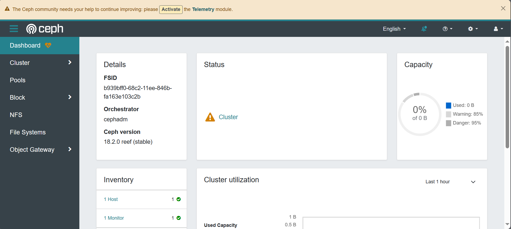

# Ceph Single Host Deploy

## Names

* RADOS GW：全称是RADOS Gateway，提供对象存储服务
* RBD: Reliable Block Device。它提供块存储服务。
* RADOS：a Reliable,Automomous,Distributed Object Storage。Ceph最底层的功能模块，是一个无限可扩容的对象存储服务。
* OSD：Object Storage Device。是分布式存储系统的基本单位，物理意义上对应一块硬盘。
* Monitor： 通常被简称为Mon，提供集群运行图。
* POOL：多个OSD组成的存储池。ceph管理员可以将多个OSD组成一个池子，存储池是软件层面规划出来的的，物理上不真实存在。
* MDS：元数据服务器。负责提供文件系统的元数据。

## Install Cephadm

使用`curl`下载：

```sh
curl --silent --remote-name --location https://download.ceph.com/rpm-${CEPH_RELEASE}/el9/noarch/cephadm
```

其中`${CEPH_RELEASE}`为ceph版本，例如：`18.2.0`

修改权限并安装：

```sh
chmod +x ./cephadm
./cephadm install
```

## Bootstrap

运行

```sh
cephadm bootstrap --mon-ip ${IP}
```

*NOTE： 生产环境请使用`--single-host-defaults` flag。*

其中`${IP}`是当前机器的IP，例如`10.2.217.245`。

*NOTE： 通过`ifconfig`查看。*

完成后将运行dashboard，并输出它的url和默认的username，passwd。

```sh
Verifying podman|docker is present...
Verifying lvm2 is present...
Verifying time synchronization is in place...
Unit chronyd.service is enabled and running
Repeating the final host check...
podman (/usr/bin/podman) version 4.2.0 is present
systemctl is present
lvcreate is present
Unit chronyd.service is enabled and running
Host looks OK
Cluster fsid: b939bff0-68c2-11ee-846b-fa163e103c2b
Verifying IP 10.2.217.245 port 3300 ...
Verifying IP 10.2.217.245 port 6789 ...
Mon IP `10.2.217.245` is in CIDR network `10.2.217.0/24`
Mon IP `10.2.217.245` is in CIDR network `10.2.217.0/24`
Internal network (--cluster-network) has not been provided, OSD replication will default to the public_network
Pulling container image quay.io/ceph/ceph:v18...
Ceph version: ceph version 18.2.0 (5dd24139a1eada541a3bc16b6941c5dde975e26d) reef (stable)
Extracting ceph user uid/gid from container image...
Creating initial keys...
Creating initial monmap...
Creating mon...
Waiting for mon to start...
Waiting for mon...
mon is available
Assimilating anything we can from ceph.conf...
Generating new minimal ceph.conf...
Restarting the monitor...
Setting mon public_network to 10.2.217.0/24
Wrote config to /etc/ceph/ceph.conf
Wrote keyring to /etc/ceph/ceph.client.admin.keyring
Creating mgr...
Verifying port 9283 ...
Verifying port 8765 ...
Verifying port 8443 ...
Waiting for mgr to start...
Waiting for mgr...
mgr not available, waiting (1/15)...
mgr not available, waiting (2/15)...
mgr not available, waiting (3/15)...
mgr not available, waiting (4/15)...
mgr not available, waiting (5/15)...
mgr is available
Enabling cephadm module...
Waiting for the mgr to restart...
Waiting for mgr epoch 5...
mgr epoch 5 is available
Setting orchestrator backend to cephadm...
Generating ssh key...
Wrote public SSH key to /etc/ceph/ceph.pub
Adding key to root@localhost authorized_keys...
Adding host mxc-test-vm-1...
Deploying mon service with default placement...
Deploying mgr service with default placement...
Deploying crash service with default placement...
Deploying ceph-exporter service with default placement...
Deploying prometheus service with default placement...
Deploying grafana service with default placement...
Deploying node-exporter service with default placement...
Deploying alertmanager service with default placement...
Enabling the dashboard module...
Waiting for the mgr to restart...
Waiting for mgr epoch 9...
mgr epoch 9 is available
Generating a dashboard self-signed certificate...
Creating initial admin user...
Fetching dashboard port number...
Ceph Dashboard is now available at:

	     URL: https://mxc-test-vm-1:8443/
	    User: admin
	Password: dhqiohdeum

Enabling client.admin keyring and conf on hosts with "admin" label
Saving cluster configuration to /var/lib/ceph/b939bff0-68c2-11ee-846b-fa163e103c2b/config directory
Enabling autotune for osd_memory_target
You can access the Ceph CLI as following in case of multi-cluster or non-default config:

	sudo /usr/sbin/cephadm shell --fsid b939bff0-68c2-11ee-846b-fa163e103c2b -c /etc/ceph/ceph.conf -k /etc/ceph/ceph.client.admin.keyring

Or, if you are only running a single cluster on this host:

	sudo /usr/sbin/cephadm shell

Please consider enabling telemetry to help improve Ceph:

	ceph telemetry on

For more information see:

	https://docs.ceph.com/en/latest/mgr/telemetry/

Bootstrap complete.
```
|Dashboard|
|-|
||

## Install `ceph-common`

ceph-common包，包含所有ceph命令。

```sh
cephadm add-repo --release quincy
cephadm install ceph-common
```

## OSD Install

主机上的每块非系统硬盘都可作为一个OSD。

但是能安装OSD的硬盘必须满足以下条件：

* 硬盘设备不能有分区。
* 硬盘设备不能被其他LVM占用或声明。
* 硬盘设备不能已挂载。
* 硬盘不能包含文件系统。
* 硬盘设备不能是包含Ceph Bluestore存储引擎的OSD。
* 硬盘设备不能小于5GB。

列出所有OSD：

```sh
ceph orch device ls
```

查看目前哪些设备可以安装OSD。

```sh
ceph orch apply osd --all-available-devices --dry-run
```

*NOTE： `--dry-run` 不会真的安装OSD，该标志使业务流程协调程序提供内容的预览。*

为所有可安装OSD的设备安装OSD（使用任何可用和未使用的存储设备）。

```sh
ceph orch apply osd --all-available-devices
```

*NOTE：这意味着添加磁盘将自动添加OSD，禁用在可用设备上自动创建 OSD可使用flag `--unmanaged=true`。*

为单独的设备安装OSD：

```sh
ceph orch daemon add osd *<host>*:*<device-path>*
```

*NOTE： 例如 10.0.1.15:/dev/sdc。*

## OSD Remove

删除OSD。

```sh
ceph orch osd rm <osd_id(s)> [--replace] [--force]
```

*NOTE： 删除过程时间有点长，因为ceph需要先移除OSD上映射的PG。*

停止删除。

```sh
ceph orch osd rm stop <osd_id(s)>
```

查看删除进度。

```sh
ceph orch osd rm status
```

下线整台机器，移除机器上所有OSD。

```sh
ceph orch device zap <hostname> <path>
```

## OSD Basic Operations

查看OSD状态。

```sh
ceph osd stat
```

查看OSD映射信息。

```sh
ceph osd dump
```

查看OSD目录树。

```sh
ceph osd tree
```

将OSD逐出集群。

```sh
ceph out [OSD]
```

将OSD加入集群。

```sh
ceph in [OSD]
```

开启停止读写。

```sh
ceph start/stop [OSD]
```

设置OSD权重

```sh
ceph osd crush set {id} {weight} [{loc1} [{loc2} ...]]
```

暂停/开启OSD

```sh
ceph osd pause/unpause
```

*NOTE： 暂停之后整个集群不再接收数据。*

禁用自动均衡。

```sh
ceph osd set noout
```

启用自动均衡。

```sh
ceph osd unset noout
```

## Create Ceph Pool

创建Pool。

```sh
ceph osd pool create ${name}
```

其中${name}是池名称。

## Set Pool Quota

```sh
ceph osd pool set-quota {pool-name} [max_objects {obj-count}] [max_bytes {bytes}]
```

要删除配额，请将其值设置为`0`。

## Remove Pool

```sh
ceph osd pool delete {pool-name} [{pool-name} --yes-i-really-really-mean-it]
```

## Rename Pool

```sh
ceph osd pool rename {current-pool-name} {new-pool-name}
```

## Get Pool Status

```sh
ceph osd pool stats [{pool-name}]
```

## Deploy File System

创建FS。

```sh
ceph fs new [NAME] [METADATA POOL] [DATA POOL]
```

部署MDS。

```sh
ceph orch apply mds *<fs-name>* --placement="*<num-daemons>* [*<host1>* ...]"
```

*NOTE：`--placement`如何放置mds，放在哪几个机器上，以及放多少个。*

查看FS状态。

```sh
ceph fs status [NAME]
```

必须设置`enable_multiple`为`true`，才能创建多个文件系统。

```sh
ceph fs flag set enable_multiple true
```

## Mount File System

创建指定用户使其对指定文件系统的指定路径具有指定权限。

```sh
ceph fs authorize [FS-NAME] [USERNAME] [[PATH] [R/W/X]...]
```

将产生一个keyring。

```sh
ceph fs authorize foo client.fs-test-1 / rw

[client.fs-test-1]
	key = AQCCtydlAaofNhAAdgPi2Somfx5srjs1Q1XyGA==
```

将keyring写入到`/etc/ceph/[USERNAME].keyring`,权限必须是`600`。

获取用户授权信息：

```sh
ceph auth get [USERNAME]
```

挂载文件系统。

```sh
mkdir -p [MOUNT_POINT]

ceph-fuse -n [USERNAME] [MOUNT_POINT]
```

卸载文件系统。

```sh
umount -l [MOUNT_POINT]
```

*NOTE：使用`-f`强行卸载。*

## Remove File System

下线FS（同时下线MDS）。

```sh
ceph fs fail [FS-NAME]
```

删除FS。

```sh
ceph fs rm [FS-NAME] --yes-i-really-mean-it
```

## Host Manage

### Add Host

需要先将ssh key添加到新主机的root用户的`authorized_keys`中。

```sh
ssh-copy-id -f -i /etc/ceph/ceph.pub root@host
```

登录host并将key拷贝过去。

添加主机到ceph集群。

```sh
ceph orch host add <newhost> [<ip>] [<label1> ...]
```

扫描集群。

```sh
ceph orch host rescan <hostname> [--with-summary]
```

*NOTE： `–with-summary`标签提供了扫描成功、失败等多个状态的数量统计。*

### Remove Host

将主机删除。

```sh
ceph orch host drain <host>
```

随后这台机器上的所有OSD将会被调度删除。

如果遇到机器故障、宕机或断电，导致不能像上面那样正常移除，也可以强制移除。

```sh
ceph orch host rm <host> --offline --force
```

## RDB

### Create

创建pool。

```sh
ceph osd pool create [NAME]
```

将pool分配给RDB。

```sh
rbd pool init [pool-name]
```

创建image。

```sh
rbd create --size [SIZE] [POOL]/[IMAGE]
```

## Upgrade

开始升级集群。

```sh
ceph orch upgrade start --image quay.io/ceph-ci/ceph:recent-git-branch-name
```

*其中： `--image`是镜像。*

停止升级。

```sh
ceph orch upgrade stop
```

查看日志。

```sh
ceph -W cephadm
```

在升级过程中，ceph 状态输出中会显示一个进度条。它 看起来像这样：

```sh
ceph -s

[...]
  progress:
    Upgrade to docker.io/ceph/ceph:v15.2.1 (00h 20m 12s)
      [=======.....................] (time remaining: 01h 43m 31s)
```

交错升级。

```sh
ceph orch upgrade start --image <image-name> --daemon-types mgr,mon --hosts host1,host2
```

### Private Image

登录私有仓库。

```sh
cephadm registry-login [-h] --registry-url [REGISTRY URL] --registry-username [REGISTRY_USERNAM] --registry-password [REGISTRY_PASSWORD]
```