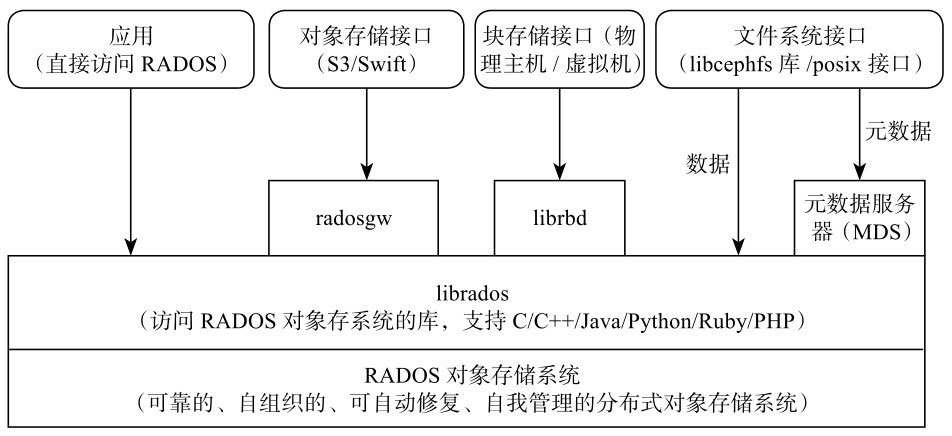

# Index

* [Deploy](./Deploy/Note.md)
* [Architecture](./Architecture/Note.md)
* [RBD](./Research/RBD/Note.md)
* [RGW](./Research/RGW/Note.md)
* [Cephfs](./Research/Cephfs/Note.md)
* [CRUSH](./Research/CRUSH/Note.md)
* [Common Module Source Code Analysis](./Source%20Code%20Analysis/Network%20Communication/Note.md)
* [Prometheus Plugin(Mgr Module) Module Source Code Analysis](./Source%20Code%20Analysis/Prometheus%20Plugin/Note.md)
* [Client Source Code Analysis](./Source%20Code%20Analysis/Client/Note.md)
* [OSD Source Code Analysis](./Source%20Code%20Analysis/OSD/Note.md)
* [Erasesure Code](./Research/ErasureCode/Note.md)
* [Local Object Store Source Code Analysis](./Source%20Code%20Analysis/LocalObjectStore/Note.md)