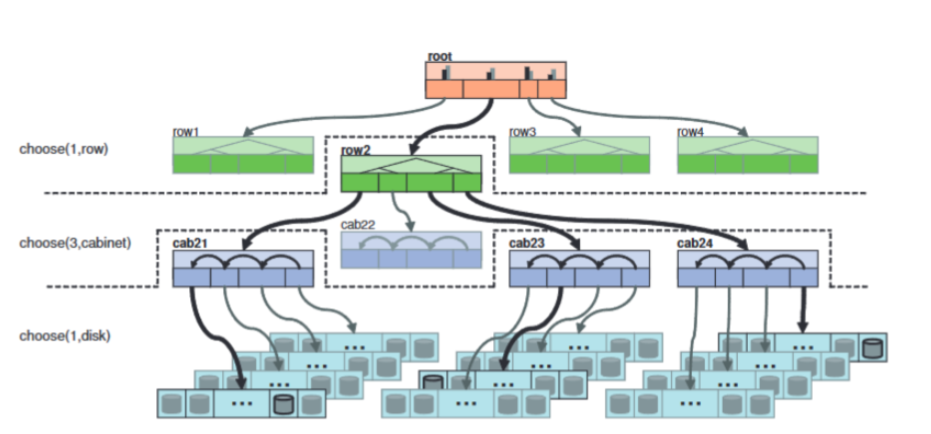
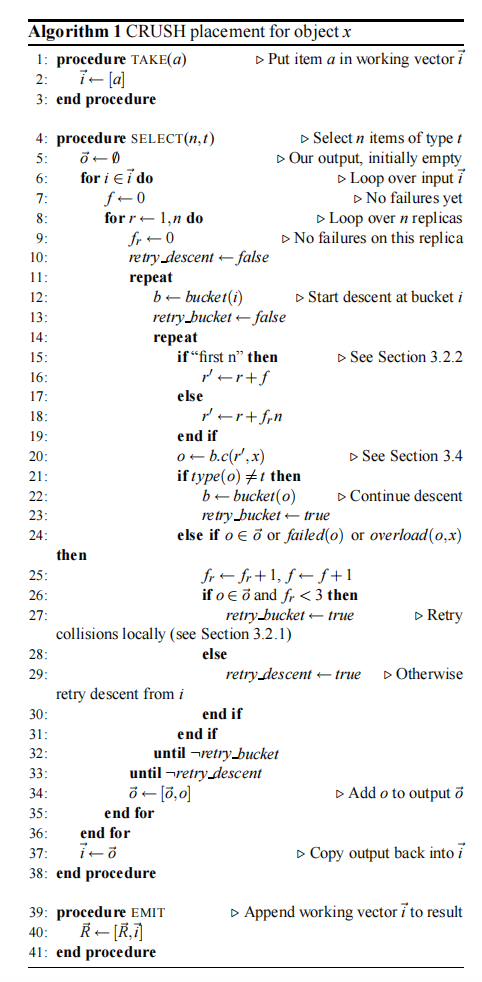

# CRUSH

## Introduction

CRUSH，这是一个可扩展的伪随机数据分布函数，专为分布式基于对象的存储系统设计，能够在不依赖于中央目录的情况下有效地将数据对象映射到存储设备上。CRUSH被实现为一个伪随机确定性函数，将输入值（通常是对象或对象组标识
符）映射到要存储对象副本的设备列表上。这与传统的方法不同，数据存放不依赖于任何类型的配置文件或对
象目录——CRUSH只需要存储集群中组成设备的一种紧凑的层次化描述以及副本的放置策略。

给定一个单独的整数输入值 $X$ ，CRUSH将输出一个有序列表 $\vec{R}$ ，其中包含 $n$ 个不同的存储目标，其中 $n$ 是复制因子（PG大小）。

## Cluster Map

CRUSH依靠Cluster Map描述集群，并在其上根据放置规则将PG映射到OSD。如图所示：



其中每一行的每一项称为一个桶（bucket），桶具有不同的类型并且允许嵌套，这样Cluster map就组成了一个树形结构。在根节点上的是root桶，在叶子节点的是实际的存储设备（OSD）。根节点与叶子节点中间的节点提供了构建故障域的可能性。

## Placement Rule

CRUSH为每种复制策略或分布策略定义了放置规则，允许存储系统或管理员精确指定对象副本的放置方式。例如，可以有一个规则用于选择两个目标进行2路镜像，另一个规则用于选择两个不同数据中心的三个目标进行3路镜像，另一个规则用于在六个存储设备上进行RAID-4等待。

每个规则都由应用于简单执行环境中的层次结构的一系列操作组成。



CRUSH函数的整数输入 $x$ 通常是对象名称或其他标识符，比如一组对象的标识符，这些对象的副本将放置在相同的设备上。 $take(a)$ 操作选择存储层次结构中的一个项（通常是一个桶）并将其分配给向量 $\vec{i}$，该向量作为后续操作的输入。 $select(n,t)$ 操作遍历向量 $\vec{i}$ 中的每个元素 $i$ ，并选择以该点为根的子树中类型为 $t$ 的 $n$ 个不同项。存储设备具有已知的固定类型，系统中的每个存储桶都有一个类型字段，用于区分存储桶的类别（例如，代表“行（row）”的存储桶和代表“柜子（cabinet）”的存储桶）。对于每个 $i ∈ \vec{i}$ ， $select(n,t)$ 调用遍历所请求的 $r ∈ 1, . . . , n$ 个项，并通过任何中间存储桶递归地下降，使用函数 $c(r, x)$ 在每个存储桶中伪随机选择一个嵌套项，直到找到所请求类型 $t$ 的项。得到的 $n|\vec{i}|$ 不同的项被放回到输入 $\vec{i}$ 中，并形成后续 $select(n,t)$ 的输入，或者通过 $emit$ 操作移动到结果向量中。

规则采用以下形式：

```crush
rule <rulename> {

    id <unique number> // 唯一 id
    type [replicated | erasure] // 类型 [副本|纠删码]
    min_size <min-size> // 最小大小（如果池形成的副本数少于这个数目，则 CRUSH 不会选择这一规则。）
    max_size <max-size> // 最大大小（如果池形成的副本数超过这个数目，则 CRUSH 不会选择这一规则。）
    step take <bucket-type> [class <class-name>] // 对应上文的take，取出bucket然后开始迭代
    step [choose|chooseleaf] [firstn|indep] <N> <bucket-type> // 对应上文的select，此处存在多个步骤，firstn代表从选择的bucket 向量中递归选择n个项目，indep代表隔离选择n个项目（向量中的每一个项递归选择一个），chooseleaf选择指定类型的bucket下的存储设备叶节点
    step emit // 对应上文的emit
}
```

### Replicated Rule

一个简单的三副本规则如下：

```log
$ ceph osd crush rule dump replicated_rule
{
    "rule_id": 0,
    "rule_name": "replicated_rule",
    "ruleset": 0,
    "type": 1,
    "min_size": 1,
    "max_size": 10,
    "steps": [
        {
            "op": "take",
            "item": -1,
            "item_name": "default"
        },
        {
            "op": "chooseleaf_firstn",
            "num": 0,
            "type": "host"
        },
        {
            "op": "emit"
        }
    ]
}
```

```crush
rule replicated_rule {
    id 0
    type replicated
    min_size 1
    max_size 10
    step take root
    step choose firstn <N> host
    step emit
}
```

### Erasure Code Rule

一个纠删码规则（2 + 2）如下：

```log
$ ceph osd crush rule dump erasure-code
{
    "rule_id": 1,
    "rule_name": "erasure-code",
    "ruleset": 1,
    "type": 3,
    "min_size": 3,
    "max_size": 4,
    "steps": [
        {
            "op": "set_chooseleaf_tries",
            "num": 5
        },
        {
            "op": "set_choose_tries",
            "num": 100
        },
        {
            "op": "take",
            "item": -1,
            "item_name": "default"
        },
        {
            "op": "chooseleaf_indep",
            "num": 0,
            "type": "host"
        },
        {
            "op": "emit"
        }
    ]
}
```

```crush
rule erasure-code {
    id 1
    type erasure
    min_size 3
    max_size 4
    set_chooseleaf_tries 5
    set_choose_tries 100
    take root
    step chooseleaf indep <N> host
    emit
}
```

## Bucket Selection

在CRUSH的远古时代，每个bucket向下选择都可以有不同的选择算法（uniform、list、tree、straw）。而今这几种算法都已被废弃，目前只存在一个算法straw2。

理论上 straw 算法是非常完美的，然而在 straw 算法实现整整8 年之后，得益于Ceph 应用日益广泛，不断有用户向社区反馈每次集群有新的 OSD加人或者旧的 OSD删除时总会引起不相关的数据迁移，Sage 被迫开始针对 straw 算法已有实现重新进行审视。

算法选择的结果取决于每个元素根据输(input)、随机因子(r)和`item_straw`计算得到的签长，原有的straw算法如下：

```python
max_x = -1
max_item = -1
for each item:
    x = hash(input, r)
    x = x * item_straw
    if x > max_x
        max_x = x
        max_item = item
return max_item
```

`item_sraw`的算法如下：

```python
reverse = rearrange all weights in reverse order
straw = -1
weight_diff_prev_total = 0
for each item:
    item_straw = straw * 0x10000
    weight_diff_prev = (reverse[current_item] - reverse[prev_item]) * item_ramains
    weight_diff_prev_total += weight_diff_prev
    weight_diff_next = (reverse[next_item] - reverse[current_item]) * item_ramains
    scale = weight_diff_prev_total / (weight_diff_prev_total + weight_diff_next)
    straw *= pow(1 / scale, 1 / item_ramins)
```

将所有元素按其权重进行逆序排列后逐个计算每个元素的 `item_straw`，计算过程中不断累积当前元素与前后元素的权重差值，以此作为计算下一个元素 `item_straw` 的基准，因此原有实现中 straw 算法的最终选择结果不仅取决于每个元素的自身权重，而且也和集合当中所有其他元素的权重强相关，从而导致每次有元素加人当前集合或者从当前集合中删除时，都会引起不相关的数据迁移。

```python
max_x = -1
max_item = -1
for each item:
    x = hash(input, r)
    x = ln(x / 65536) / weight
    if x > max_x
        max_x = x
        max_item = item
return max_item
```

针对输入和随机因子执行哈希后，结果落在[0,65535]之间，因此 $\ln(65536)$ 必然小于 1，对其取自然对数 $\ln(x/6536)$ 后结果为负值。进一步地，将其除以自身权重(weight)后，则权重越大，结果越大(因为负得越少)，从而体现我们所期望的每个元素权重对于抽签结果的正反馈作用。

*NOTE：反馈似乎有点用力过猛，小容量OSD被选择的概率太低。*