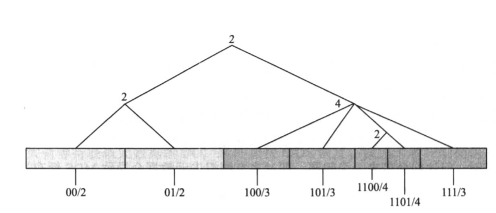

# Cephfs

## File System Basic

在使用计算机过程中，需要对数据进行读写等一系列的操作。比如存储一份数据只需要打开文件编辑器写人数据点击保存，文件内容最终会保存到磁盘上，但我们并不知道这些数据存储在磁盘的具体位置。同理，获取一份数据时，也只需要知道对应的文件名和所在目录，使用相关应用程序打开即可，同样不需要关心从磁盘的具体哪个位置来获取。其实当我们在保存和读取文件时，需要操作系统通过文件系统来完成一系列动作，才能定位到磁盘的具体位置来存储或者读取数据。那么什么是文件系统呢?简言之文件系统是一种针对磁盘(或者其他存储介质)上的用户数据进行组织和追踪的机制，其中元数据负责记录用户数据位置、所有者、访问权限、修改记录等关键信息，本身也要和用户数据一并写入磁盘。


Linux 操作系统通过VFS(Virtual File System)，要求所有接入文件系统必须实现VFS所定义的统一并且符合POSIX 语义的接口，以此来屏蔽不同的本地文件系统以及网络文件系统之间的差异。


### Metadatas

实现上，VFS 为了适配不同类型的文件系统，定义了 4 种基本数据类型，分别为：
* SuperBlock - 文件系统元数据。
* Inode - POSIX文件系统中的一种数据结构，每个Inode 保存文件系统中的一个文件系统对象(包括文件、目录、设备文件socket、管道等等在内)的概要信息，但不包括文件名和文件数据本身，文件数据放置在外部数据块中。
* Dentry - POSIX文件系统中某个目录 Inode 的数据，通过它们连接不同的Inodes，并最终实现文件系统目录树功能。
* File - 表示一个打开的文件 File 和 Inode 之间是多对一的关系，因为多个进程可以打开同一个文件，每一次打开操作，系统都会创建一个 File。

Inode 只记录数据块在存储介质上的位置和分布，以及文件对象属性(包括权限、属性组、数据块信息、时间戳等) 信息，不包含文件名、内容等变长数据，这样可以使得 Inode 结构大小固定，方便查找。但要找到具体的存储位置，还缺少文件在目录树中的位置信息，因此需要引入 Dentry，Inode代表一个文件或目录。

Dentry 在文件系统中起到连接不同文件对应 Inode 的作用。Dentry 包含文件名、文件 Inode 等信息。一般而言，在 Linux 操作系统下，读取或者写入文件时，需要给出文件所在的绝对路径或者相对路径，文件系统查找文件实际就是按照给出的路径从当前目录(如果是绝对路径，则从根目录开始) 到叶子(文件) 进行深度遍历的过程。所有文件人口都从根目录开始，而 Dentry 是连接目录到文件之间的关键要素。


### Links

硬链接指多个Dentry指向同一个Inode号，即相同的存储内容可以使用不同的文件名来表示，特点是目录不能用来创建硬链接(防止出现目录环)、删除一个硬链接不影响其他文件(即只有所有指向同一个 Inode 的所有文件都被删除，文件才会被真正删除).只能对已经存在的文件创建和不能跨文件系统进行链接，一般可以通过 ln/link 命令来创建。

软链接即创建一个新的文件，文件存储的内容是另外一个文件路径名的指向，即软链接和普通的文件除了存储的内容不同，没有其他差别。在链接的目标路径较短的情况下，这个路径被内联到Inode中，称为快速符号链接（fast symlinks），否则使用传统方法，存储在外部数据块中。

### Journal

日志（Journal）是特殊的磁盘区域，用于循环记录文件系统的修改，并定期提交到文件系统进行保存。一旦系统发生崩溃，则日志会起到一个检测点的作用，用于恢复尚未保存的数据，防止文件系统出现数据(包括元数据和数据)丢失。


日志有许多种类，常见的有三种：
* writeback 模式 - 只有元数据会被记录到日志，而数据仍然写入数据盘。这样虽然可以保证元数据一致性，但可能引起数据崩溃，例如在日志写入后、数据写入前系统发生崩溃的场景。
* ordered 模式 - 也是只将元数据写入到日志，但前提是数据已经写入了数据盘。这样可以保证系统崩溃后日志数据与文件系统的一致性，缺点是不能最大限度地保证数据不丢失，例如在数据写人后、元数据写入前系统崩溃的场景。
* data 模式（writeahead模式） - 将元数据和数据都记录到日志中，这样可以最大程度的防止文件系统崩溃和数据丢失，但由于数据写人了两次，性能会下降。

日志提交有两种常见的策略：
* 超时提交 - 指在规定时间到达后日志内容会主动同步到数据存储介质上。
* 满时提交 - 指日志存储空间已经达到上限，会触发同步数据到存储介质上。

一般文件系统会同时启用这两种策略，来最大程度的保证数据安全和一致性。

## Cephfs Design

一般而言，相较传统文件系统而言，分布式文件系统的最大特点是具有良好的横向扩展性，同时性能随存储规模呈线性扩展，而要实现这些目标则必须要对文件系统命名空间分而治之，即通过多服务器实现负荷分担和负载均衡。

另外，为了实现快速索引元数据信息以提升性能，将元数据和用户数据进行分离则是必然的选择。

为了实现文件系统数据(包含元数据和用户数据)负载均衡，业界有如下几种分区方法：

* 静态子树分区 - 即通过手工分区方式，将数据直接分配到某个服务节点上，出现负载不均衡时，再由管理员手动重新进行分配， Sprite、StorageTank 和 PanFS 等系统使用这种方式，这种方式只适应于数据位置固定的场景，不适合动态扩展场景同时存在热点问题。
* 动态子树分区 - 通过实时监控集群节点的负载，动态调整子树分布于不同的节点，能过有效防止热点。缺点是需要进行数据迁移，而大量的数据迁移又会影响到业务，Cephfs选择了这种方式（默认方式）。
* 哈希分区 - 即通过哈希来分配数据存储位置，适合数据分布均衡，负载分布均匀的场景，不能防止出现热点同时节点扩容时需要大量数据移动（可由一致性哈希解决），优点是实现简单（如果不使用一致性哈希）以及不需要中心目录。
* 范围分区 - 即通过范围来分配数据存储位置，具有有哈希分区类似的问题，但可以引入拆分和合并分区进行减少热点的影响（同样需要数据迁移），缺点是需要中心目录，许多存储系统都选择了这种方式。

目录亲和性是指进行分区后，父目录与它的子Inode之间的分区关系，通常存在以下几种：
* 完全分离 - 父目录与它的孩子完全分离，即对Inode和Dentry都进行分区（类似于两张大的数据库表进行分区），父目录的Inode、父目录的Dentry、子Inode不在一个分区（这种方式很糟糕，基本上没什么人用）。
* Inode-Dentry - 对Inode进行分区，但是目录Inode的Dentry跟Inode放在同一个分区（许多系统应用这种方式）。
* Inode-Inode - 对Inode进行分区，但是目录Inode与它的Dentry和子Inode（文件Inode）放在同一个分区。
* 子树 - 将某个目录以下的目录树称为子树进行分区。

在采用动态子树分区法的基础上，CephFS 为了达到最佳的扩展性和性能，将元数据和业务数据进行了分离，并且统一存储到 RADOS。


## Metadata Server(mds)

MDS 用于保存 CephFS 的元数据信息，它是运行在 Ceph 服务侧的daemon，使用动态申请缓存空间来存储元数据信息，其记录的元数据除了文件在磁盘中的位置，还包括文件名、文件属性(包括访问权限、创建时间、组对象等)、归属目录、子树分割以及诸如快照、配额在内的一些高级特性。

在元数据和用户数据分离的文件系统中，高效的元数据性能对整个系统性能至关重要。研究表明，元数据访问占整个文件系统访问比重的 30% ~70%，因此MDS 的性能好坏直接决定 CephFS 文件系统性能的优劣。

事实上Inode 的保存有两种标准，即BSDs-FFS 和C-FFS，其中BSD模式是Inode 保存在 Table 中从而最终保存到磁盘上，C模式就是将Inode 直接嵌人到 Dentry 中。对比测试表明，使用C模式的文件系统要比BSD 模式快10%~300%。C模式的缺点在于对硬链接的支持不太友好，同时又因为Dentry的尺寸变大降低Dentry遍历的性能（要读取的磁盘块数量更多了）。

Ceph使用了C模式存储文件系统元数据，Inode 内嵌到 Dentry 中。同时 MDS 通过扩展表解决了硬链接的问题。Inode 嵌入保存到 Dentry 的方式，极大地提升了路径解析的性能，因为在获取 Dentry 同时顺便将Inode也提取到内存中了，这也有利于将元数据负载均衡应用于分层命名空间。

其次，每个 MDS 独立更新自己的日志。日志可以保存很长时间(即日志文件的规模可以很大)，据此可以筛选出哪些是低频率访问的文件，哪些是高频率访问的文件，以减少低效率的随机访问，并且在 MDS 失效后简化恢复流程。此外，志还具有合并I/0 操作，提高访问效率的功能。

最后，动态子树分区实现了文件系统的动态负载均衡。Ceph 参考 Farsite (最早使用动态迁移目录实现负载均衡的文件系统)允许 MDS 声明管理子树，通过分布式策略来制定平衡机制，对于配置主备模式的 MDS，在主MDS 节点异常后，备 MDS 节点可以马上接管服务:对于已经配置多主模式的 MDS，则会将目录树拆分为多个子树(或者单个热点目录子树)，保证 MDS 访问负载均衡。

## Metadata Storage

MDS 的元数据和业务数据都存储在 RADOS 中。进一步的，MDS 将元数据和业务数据存储在不同的 RADOS 池中，这样的存储方式，非常有利于数据共享，方便 MDS 元数据进行迁移和故障恢复。

每一个dentry都存储在对象的omap中，每一个需要**独立存储**的inode都存储在对象中。

### System Inode

对于系统inode（`/`和inode 100 ~ 200 ）会独立存储inode对象（`<ino>.00000000.inode`）：


```log
$ rados -p fs_meta ls | grep inode
1.00000000.inode
102.00000000.inode
101.00000000.inode
100.00000000.inode
```

其数据如下：

```log
$ rados -p fs_meta get 1.00000000.inode /dev/stdout | hexdump -C
00000000  13 00 00 00 63 65 70 68  20 66 73 20 76 6f 6c 75  |....ceph fs volu|
00000010  6d 65 20 76 30 31 31 06  04 0d 02 00 00 11 06 ad  |me v011.........|
00000020  01 00 00 01 00 00 00 00  00 00 00 00 00 00 00 18  |................|
00000030  33 64 65 15 c7 f6 14 ed  41 00 00 e8 03 00 00 e8  |3de.....A.......|
00000040  03 00 00 01 00 00 00 00  02 00 00 00 00 00 00 00  |................|
00000050  02 02 18 00 00 00 00 00  40 00 01 00 00 00 00 00  |........@.......|
00000060  40 00 02 00 00 00 00 00  00 00 00 00 00 00 00 00  |@...............|
00000070  00 00 00 00 00 00 00 00  00 00 ff ff ff ff ff ff  |................|
00000080  ff ff 00 00 00 00 00 00  00 00 00 00 00 00 18 33  |...............3|
00000090  64 65 15 c7 f6 14 00 00  00 00 00 00 00 00 01 00  |de..............|
000000a0  00 00 00 00 00 00 03 02  28 00 00 00 00 00 00 00  |........(.......|
000000b0  00 00 00 00 18 33 64 65  15 c7 f6 14 08 00 00 00  |.....3de........|
000000c0  00 00 00 00 02 00 00 00  00 00 00 00 78 00 00 00  |............x...|
000000d0  00 00 00 00 03 02 38 00  00 00 b3 08 00 00 00 00  |......8.........|
000000e0  00 00 76 d4 80 b0 00 00  00 00 1d 27 00 00 00 00  |..v........'....|
000000f0  00 00 ec 03 00 00 00 00  00 00 00 00 00 00 00 00  |................|
00000100  00 00 00 00 00 00 00 00  00 00 42 33 64 65 d4 ca  |..........B3de..|
00000110  cb 23 03 02 38 00 00 00  00 00 00 00 00 00 00 00  |.#..8...........|
00000120  00 00 00 00 00 00 00 00  00 00 00 00 00 00 00 00  |................|
00000130  01 00 00 00 00 00 00 00  00 00 00 00 00 00 00 00  |................|
00000140  00 00 00 00 00 00 00 00  67 0c 3a 65 96 51 10 1b  |........g.:e.Q..|
00000150  9a 30 00 00 00 00 00 00  00 00 00 00 00 00 00 00  |.0..............|
00000160  01 00 00 00 00 00 00 00  02 00 00 00 00 00 00 00  |................|
00000170  00 00 00 00 00 00 00 00  00 00 00 00 01 00 00 00  |................|
00000180  00 00 00 00 00 00 00 00  01 01 10 00 00 00 00 00  |................|
00000190  00 00 00 00 00 00 00 00  00 00 00 00 00 00 00 00  |................|
*
000001b0  00 00 67 0c 3a 65 96 51  10 1b 7a 00 00 00 00 00  |..g.:e.Q..z.....|
000001c0  00 00 ff ff ff ff 00 00  00 00 00 00 00 00 00 00  |................|
000001d0  00 00 00 00 00 00 00 00  3e 00 00 00 06 04 38 00  |........>.....8.|
000001e0  00 00 01 00 00 00 00 00  00 00 00 00 00 00 00 00  |................|
000001f0  00 00 00 00 00 00 00 00  00 00 00 00 00 00 00 00  |................|
00000200  00 00 01 00 00 00 00 00  00 00 00 00 00 00 00 00  |................|
00000210  00 00 00 00 00 00 00 00  00 00 00 00 00 00 fe ff  |................|
00000220  ff ff ff ff ff ff 00 00  00 00                    |..........|
0000022a
```

### Primary Dentry

对于每一个目录Inode的dentry，MDS将其分片为几个对象，例如根目录`/`。

```log
$ rados -p fs_meta ls | grep "^1\."
1.00000000.inode
1.00000000
```

同时该目录的dentry和inode合并存储在omap中，这种dentry称为Primary Dentry：


```log
$ rados -p fs_meta listomapkeys 1.00000000
.clang-format_head
ecdir_head
fs.log_head
hot.log_head
ioctl.h_head
root_ino.bin_head
show_dataloc.c_head
show_dataloc.tar.gz_head
show_dataloc_head
test_head
```

其数据如下：

```log
.clang-format_head
value (512 bytes) :
00000000  02 00 00 00 00 00 00 00  69 02 01 f1 01 00 00 00  |........i.......|
00000010  00 00 00 06 04 e7 01 00  00 11 06 ad 01 00 00 57  |...............W|
00000020  b1 05 00 00 01 00 00 00  00 00 00 d1 fb 4d 65 0c  |.............Me.|
00000030  ce 1f 19 ed 81 00 00 e8  03 00 00 e8 03 00 00 01  |................|
00000040  00 00 00 00 00 00 00 00  00 00 00 00 02 02 18 00  |................|
00000050  00 00 00 00 40 00 01 00  00 00 00 00 40 00 02 00  |....@.......@...|
00000060  00 00 00 00 00 00 00 00  00 00 77 28 00 00 00 00  |..........w(....|
00000070  00 00 01 00 00 00 ff ff  ff ff ff ff ff ff 00 00  |................|
00000080  00 00 00 00 00 00 00 00  00 00 d0 d3 39 65 00 00  |............9e..|
00000090  00 00 d1 fb 4d 65 ad 12  f7 15 01 00 00 00 00 00  |....Me..........|
000000a0  00 00 03 02 28 00 00 00  00 00 00 00 00 00 00 00  |....(...........|
000000b0  00 00 00 00 00 00 00 00  00 00 00 00 00 00 00 00  |................|
*
000000d0  03 02 38 00 00 00 00 00  00 00 00 00 00 00 77 28  |..8...........w(|
000000e0  00 00 00 00 00 00 01 00  00 00 00 00 00 00 00 00  |................|
000000f0  00 00 00 00 00 00 00 00  00 00 00 00 00 00 00 00  |................|
00000100  00 00 00 00 00 00 d1 fb  4d 65 0c ce 1f 19 03 02  |........Me......|
00000110  38 00 00 00 00 00 00 00  00 00 00 00 77 28 00 00  |8...........w(..|
00000120  00 00 00 00 01 00 00 00  00 00 00 00 00 00 00 00  |................|
00000130  00 00 00 00 00 00 00 00  00 00 00 00 00 00 00 00  |................|
00000140  00 00 00 00 d1 fb 4d 65  0c ce 1f 19 af 71 00 00  |......Me.....q..|
00000150  00 00 00 00 00 00 00 00  00 00 00 00 01 00 00 00  |................|
00000160  00 00 00 00 a9 71 00 00  00 00 00 00 00 00 00 00  |.....q..........|
00000170  00 00 00 00 00 00 00 00  ff ff ff ff ff ff ff ff  |................|
00000180  00 00 00 00 01 01 10 00  00 00 00 00 00 00 00 00  |................|
00000190  00 00 00 00 00 00 00 00  00 00 00 00 00 00 00 00  |................|
000001a0  00 00 00 00 00 00 00 00  00 00 00 00 00 00 d1 fb  |................|
000001b0  4d 65 ad 12 f7 15 02 00  00 00 00 00 00 00 ff ff  |Me..............|
000001c0  ff ff 00 00 00 00 00 00  00 00 00 00 00 00 00 00  |................|
000001d0  01 00 00 00 10 00 00 00  73 65 63 75 72 69 74 79  |........security|
000001e0  2e 73 65 6c 69 6e 75 78  00 00 00 00 00 00 00 00  |.selinux........|
000001f0  00 00 00 00 fe ff ff ff  ff ff ff ff 00 00 00 00  |................|
00000200

```

### Remote Dentry

MDS中对于哪些hard link到其他inode的dentry，则称为Remote Dentry：


```log
$ rados -p fs_meta listomapvals 100000b007a.00000000
mylink_head
value (28 bytes) :
00000000  02 00 00 00 00 00 00 00  6c 02 01 0d 00 00 00 57  |........l......W|
00000010  b1 05 00 00 01 00 00 08  00 00 00 00              |............|
0000001c
```

相对于Primary Dentry而言,Remote Dentry 可以存在于文件系统层次结构中的任何地方并且位置还会随应用场景不同而变化。

对于每一个文件/目录的第一个对象（空文件和目录也存在这个对象，对于文件这个对象在数据池中，对于目录这个对象在元数据池中），它的xattr保存了parent属性，这个属性存了自己祖先目录的inode和path，利用这个属性通过inode快速得到path，这样通过RemoteDentry存储的inode number就可以快速得到Primary Dentry的位置和其存储的inode。

例如`/ecdir/file`的inode就存储了以下内容：

```log
$ rados -p fs_ec getxattr 1000005b17d.00000000 parent | hexdump -C
00000000  05 04 5d 00 00 00 7d b1  05 00 00 01 00 00 02 00  |..]...}.........|
00000010  00 00 02 02 18 00 00 00  6c b1 05 00 00 01 00 00  |........l.......|
00000020  04 00 00 00 66 69 6c 65  e2 72 00 00 00 00 00 00  |....file.r......|
00000030  02 02 19 00 00 00 01 00  00 00 00 00 00 00 05 00  |................|
00000040  00 00 65 63 64 69 72 83  73 00 00 00 00 00 00 0b  |..ecdir.s.......|
00000050  00 00 00 00 00 00 00 01  00 00 00 02 00 00 00 00  |................|
00000060  00 00 00                                          |...|
00000063
```

*NOTE：这个属性记录的path可能是过期的，只有inode本身被mv这个值才会更新，但是其中记录的inode链路是准确的。*

当Primary Dentry被unlink而Remote Dentry存在时，一个Remote Dentry会被提升到Primary Dentry。

*NOTE：暂不清楚如何通过Primary Dentry得到Remote Dentry的。*

## Journal

大多数文件系统会使用日志保证数据一致性，以方便安全地进行数据更新和写人而不必担心数据被损坏，日志内容在更新完成后会立即被丢弃。相比之下，基于日志文件系统的 LFS和 hFS 使用日志作为主存储结构，原因是志有卓越的写性能(存储日志一般会使用性能更好的固态存储设备例如 SSD、NVRAM 等，同时志会进行顺序读写).而对于日志删除和释放部分，则通常会引人“clean”过程来释放日志的分段信息，从而重新利用日志空间。

MDS的日志系统使用如下混合模式:
* 更新首先会写人到MDS的日志中。
* 将受影响的元数据标记为“dirty”(指元数据有变化)状态，并在MDS缓存中设置为“pinned”状(大多数对元数据的操作都需要一定时间才能完成，为了在操作日志时，缓存中的元数据对象不被并行修改，需要锁定它直到操作完成，这称为“pin”)。
* 最终修改会更新到具体目录的元数据对象中，同时也会做延时处理直到从日志中修剪掉(比如日志空间不够时，会从日志的尾部开始删除)，延时处理允许日志可以变得非常大(数百兆字节或更多)。

MDS日志被视为恢复每个MDS 节点缓存元数据和文件系统状态的一种手段，它使得MDS 不但能获取延迟回写和分组提交等提升写性能的方法，而且不损害元数据的安全性。同时，引人日志能够从两个方面减少 Dentry 的更新:

* 首先，在大多数负载情况下，独立的元数据对象会被多次更新，比如多次修改同一个地方或者临时文件创建后立刻删除等等。对于这类情况则没有必要实时更新到元数据对象中，因此可以直接在日志中将这些实际上并未创建、更新的内容过滤掉。
* 其次，在日志的生命周期内，对给定 Dentry 的所有更新都被有效地提交，即在这段时间内，所有的更新都被记录在一起并一次性提交到元数据对象中。因此，从这个角度而言，日志优化了大部分的 I/O 流程，以一种高效、顺序和限制随机更新元数据对象数目的方式来操作元数据对象。

日志除了支持故障恢复，还允许在恢复 MDS 时启用其缓存保存大量热元数据，热元数据来自日志，避免从冷缓存(即从后端 RADOS 中随机读取到缓存中)开始的低效率加载而导致大量等待获取元数据的I/0，最终加快MDS 恢复，快速为客户端提供 CephFS文件系统服务。

每一个MDS 会维护一个日志系统，其日志中保存了最近创建和修改，但还未提交到RADOS中的内容，日志被切分为固定大小且有序的 Object。正常负载时，MDS 会为每一个日志操作启用单独的 I/O 操作，目的是为在有更新时提供最小的时延，但在负载较重的情况下，为了避免大量日志小文件写操作导致存储瓶颈，MDS 只有在小日志文件增加到一定比例的情况下，才下发一次 I/O 操作。

日志中最重要的一个结构：日志条目，MDS 使用它来跟踪元数据变化信息，这些信息还未被提交到每个目录元数据对象中。日志条目使用 Metablob 来描述单个元数据更新，每一个Metablob 包含一个或者多个目录的 Fragment ID、Dentry和Inode，Metablob 中单个条目的更新都可能涉及要连接它的祖先目录，因为更新需要同步到上层目录，同时日志条目中也会记录祖先目录信息，记录祖先目录信息的目的是在日志恢复时可以快速定位元数据在目录树中属于哪一个层次，除了 Fragment、Dentry 和Inode被 Metablob 用来描述其更新状态，在日志条目中还包含 Inode 编号的分配Inode截断处理和客户端访问操作状态记录。

## Load Balance

### Background

Ceph 则使用动态子树分区(Dynamic SubtreePartition)来实现横向扩展，动态子树能够根据负载情况自动迁移目录树，同时为了实现多个MDS 管理目录的负载而支持细粒度分区(这里指对目录进行分片处理)。

从性能和余的角度考虑，支持客户端节点只与最小范围内的 MDS 进行交互，以实现最小路径元数据查询，在部分不相关的 MDS 故障时还能正常从在线的MDS中获取元数据。

复制祖先元数据到本地MDS 缓存中，是为了支持目录路径解析和访问控制，但这样会带来一个问题，即过多复制祖先元数据会导致 MDS 缓存过大，而缓存过大又会导致元数据查询效率降低，因此需要严格控制复制到 MDS 缓存中的祖先元数据个数。

### Directory Fragments

元数据的复制只便于读操作，而子树通常按目录层次结构粒度进行分区。以上两种机制都不能很好地处理存在单个超大型目录或者目录超负载的情况下的更新操作。此外目录元数据存储方式(最理想的情况是每个目录的Dentry和Inodes 只写人到一个对象)不能很好地应用到大型目录结构中，因为在这种情况下预读取整个目录的成本太高。

为了解决这两个问题，Ceph 扩展了目录层次结构以允许单目录内容被分解为多个片段，称为 Fragments。目录Inode和Fragments 是一对多的关系，即单个目录管理一个或者多个目录Fragments，目录 Fragments 关联具体某一部分的Inode 信息，大部分情况下，由一个Fragment 管理所有的目录内容就已经满足要求，但在目录内容比较多的情况下，就需要启用多个 Fragments来实现负载平衡。Fragments 存储在目录Inode的 FragTree 的结构中，它基于一个内部顶点开始进行2的N次幂分割。



目录树被分割为一个或者多个Fragments，其中树叶是单独的Fragments。

每一个Fragments 通过 bitmask值来进行描述，类似ip 地址与netmask。例如01/2表示对二进制01进行2bit掩码;1100/4表示对二进制1100进行4bit 掩码。通过 Hash 文件名称和在 FragTree 中查找的结果值，来实现目录 Inode到Fragments的映射。

每一个目录下的 Fragments 元数据存储在单独对象中，这样超大目录的预加载的问题就可以得到解决，比如在 `readdir` 函数调用时，会以顺序方式读取相关的 Fragments 对象到缓存，保证应用程序能快速访问目录内容。

由于子树元数据被定义在一组目录 Fragment中，所以可以通过在MDS 之间迁移 Fragment 来实现负载均衡，任何 Fragments 在变大或者繁忙时，都能够被分裂成 $2^n$ 个子 Fragment，与此相反，如果 Fragment 负载降低或者目录被销毁，则Fragment可以进行合并操作。

### Sub Tree Partition

文件系统中的元数据是倒树形结构，树的根对应 root 目录，而 root 所在的MDS 则被设置为MDS-0其他的 MDS 则根据当前整个集群中元数据的负载进行子树划分。

树的根对应 root 目录，而 root 所在的MDS 则被设置为 MDS-0 其他的 MDS 则根据当前整个集群中元数据的负载进行子树划分。


文件系统的命名空间使用子树分区策略可以有效地从目录内容中分离目录的 Inode比如`/`分配给MDS 0，`/usr` 分配给MDS 1，其中`/usr`本身的Inode 被 MDSO管理，`/usr`下面的元数据内容则被 MDS 1管理。分割不是以目录为单位的而是以Fragment为单位的，将一个Fragment管理的Inode再次分割成多个子树。

Subtree 1中虚线表格表示是由 MDS 0管理的祖先元数据(Ancestor Replicas)并被复制到本地MDS缓存中，用来构造根到具体文件的路径。

Local Subtree 1和 Lcal Subtree 2中实线表格表示为本MDS 真正管理的子树元数据，简称为本节点 MDS 的权威元数据，本地权威元数据可以是来自不同MDS的Fragment。Subtree 1、Subtree 2它们分别来自MDS-0和MDS-X，本地子树元数据通过 Fragments 划分为多个子树边界，形成嵌套子树。

Fragment 3用虚线表格表示从本地子分解出来的Fragment迁移到MDS-y中以实现热点数据负载均衡。

Fragment作为子树祖先出现在子树映射表中，并在映射表中作为其key 值信息，而映射值则是嵌套在此子树下的其他子树集合。


*NOTE：Ceph 元数据分区本质上是一种哈希分区+子树划分的方式。*

### Metadata Replication

元数据复制有两个重要目的，首先是保证各个MDS节点之间缓存元数据的层次结构，在这里是指各MDS之间协助管理整个用户空间的元数据，保证不同目录层次的元数据都在这些MDS中，当不同层次的目录有变化时，受到影响的 MDS能够实时更新来保证各 MDS 节点之间缓存的一致性;其次是 MDS 之间进行元数据复制操作，保证在 MDS失败或者负载过重时能将相应的元数据复制到其他正常的 MDS 上。

Ceph 实施缓存策略来解决 MDS 命失败后的恢复，可以简化为以下 4 个步骤：
* 所有缓存元数据必须与根目录关联，即要缓存 MDS 权威元数据的所有祖先元数据。
* 缓存中需要保存权威元数据祖先父类同一级的 Fragments Bound，即MDS 除了包含权威元数据，还需要复制祖先父类这一级别中的所有 Fragment bound 数据但不包含Fragment bound 下一级子树中的元数据内容，这些复制过来的元数据，在MDS 定义为副本元数据。
* 持有副本元数据的 MDS 需要知道副的原始数位置，即权威元数据所在 MDS 的信息。
* 持有权威元数据的MDS必须知道所有该元数据的副本信息在哪些 MDS 中缓存着。

这些约束的目的是：
*  约束 1 和 约束 2 是保证任何一个 MDS 能够解析文件或者目录的绝对路径，当解析 path 到一个子树的边界时，则复制的祖先元数据，保证其可以从其他 MDS 中来进行路径解析（确保父子树故障后不影响当前子树解析绝对路径。）。
* 约束 2 和 约束 3 则保证遇到本地 MDS分片边界后，知道去哪个 MDS 查找。
* 约束 4 则保证当元数据改变后，能够通知持有该副本的 MDS 将缓存中的元数据信息设置为过期。

### Load Balacne Implementation

每一个MDS 会监视统计 Inode 和 Fragment 在缓存中的热度。每一个Inode 会从读和写两个维度来统计热度，而 Fragment 则会另外增加 `readdir` 操作情况、元数据获取操作频率、写入到对象存储中的频率来统计其热度。子树除了管理自己受欢迎程度，还会在每个子树中维护以下3个维度变量来解决元数据深层内套场景：
* 变量 1 统计所有嵌套的元数据热度。
* 变量 2 用于统计当前节点权威元数据的所有套元数据热度
* 变量 3 用于统计当前节点权威子树的元数据热度。

在客户端请求时，受影响的元数据计数器会增加，元数据祖先也会受其影响，反过来又影响到复制和迁移的决策。MDS 节点之间会定时分享它们的负载水平，通过每一个子树的直接祖先，还会管理子树元数据组流行程度，这将允许每个负载过高的节点根据热度统计计数器来选择适合的子树进行迁移。

热度统计计数器会测量到元数据的访问频率，最终计数器为每个目录测量热度。除了热度计数器，子树目录为了更加精确地进行迁移，会增加一个短的列表来显示客户端最后访问的内容，以及在有新的客户端访问时增加一类扩展计数器来辅助子树迁移。

### Sub Trees Migration

子树从一个MDS 迁移到另外一个 MDS 上有两种方案：
* 一种方案是将要迁移的最新子树元数据存储到 RADOS 后端，然后在目的MDS 中加载。
* 另外一种方案则是直接将需要迁移的子树从源MDS 缓存中动态迁移到目的MDS。

Ceph使用了第二种方案：
* 首先目的 MDS 将所有需要迁移的子树元数据副本导入进来。
* 然后源 MDS 通过日志导出事件提交迁移，同时日志导出完成后，通过 ImportFinish 事务来关闭。
* 在源 MDS 迁移之前，任何其他MDS会接收到要复制子树祖先元数据的消息，在复制完成后通知源 MDS，因此任何在其他MDS 缓存中失效的信息将被重新发送到子树原始信息所在旧的 MDS 和新的MDS上以此来获取被迁移子树的元数据信息。

Inode 嵌人到 Dentry 的方式使得子树的迁移成为一种方便可行的方案，它将所有的元数据定义在单一分层的命名空间中，同样基于 RADOS 共享元数据对象，也有助于迁移任意大的子树，因为每次迁移只涉及转移缓存元数据，如果缓存中没有的元数据，则可以直接从共享后端加载。

### Recover

Ceph MDS 元数据基于日志进行故障恢复，但各种因素促使故障恢复复杂化:首先，日志可能非常大，靠近日志尾部的数据可能已经过时;其次，如果元数据在MDS 节点之间进行迁移时出现异常，会引人一些有歧义的权威子树，这需要在故障恢复流程中加以解决:再次，MDS 分布式缓存除了依赖日志记录，还大量依赖一些实时记录比如元数据副本信息，锁状态等(这些数据的信息量太大，如果记录在日志中则太昂贵).因此在故障恢复时需要可靠地建立这些实时信息:最后，打开文件的 Inode 状态信息独立于命名空间，且只在客户端共享，如果 MDS 端(Server 端)异常导致Inode 信息位置有变化时，客户端感知不到，因此故障恢复相应的也需要保证做到客户端应用无感知。

每一个MDS 都会维护一份独立的日志，该日志中包含按照时间排列的一系列原子事件，这些事件一般是一些修改操作记录或者新增元数据信息。日志以 Segments 的方式划分记录，并以子树事件作为 Segments 的开始部分，子树事件用于描述 MDS 在这个时间点对哪些权威子树进行了更改、新增操作。

由于 Inode 条目嵌入在某个层次结构中，因此每次日志更新需要修改相应元数据的祖先的信息，以便定位它在层次结构中的位置。为了避免日志上下文元数据重复，日志中只记录子树到根目录最小范围内的目录元数据信息，且每个 Segment 只记录一次(除非它随后被修改)。在子树和事件之间，每个 Segment 提供了正确解释其包含元数据更新所需要的内容。

MDS 缓存中的每个脏的元数据(指被修改过的元数据)都被放置在链表中，它用于保存被修改的元数据 Segment，且这些Segment 还未真正刷新到元数据对象中。在旧的 Segment 被从日志尾部修剪之前，仍然由脏元数据 Segment 列表来提供访问。在日志需要一个新的存储对象来保存新的修改时，Segment 会被立即创建，新创建的 Segment 同样也会被链表管理。当日志空间不够，需要修剪 Segment 时，则删除整个关联元数据对象的 Segment，以回收磁盘空间。由于 Segment 通过链表管理，因此 MDS 通过简单地遍历就可以找到所有相关的 Segment，以最小的开销来修剪它的日志。

每一个MDS会定期将信标消息发送给集群中主 Monitor，如果一个MDS 在足够长的时间间隔内没有被 Monitor 检测到，则它会被声明为 down 状态，并被广播至其他所有节点。如果 MDS 与 Monitor 的交互中没有收到反馈，则会将自己置为无效状态。

恢复流程分为4个阶段：
* Replay - 重放日志（日志内容也是通过对象的形式保存到 RADOS 中）。
* Resolve - 恢复分布式事务和迁移。
* Reconnect - 重建客户端连接并恢复分布式锁。
* Rejoin - 获取非权威副本。