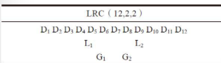
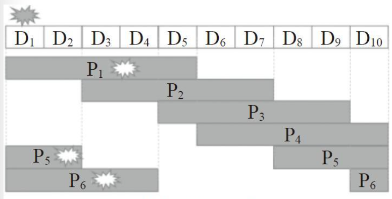
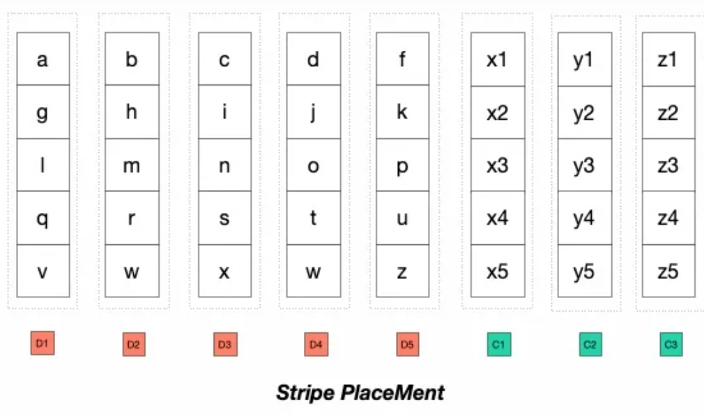
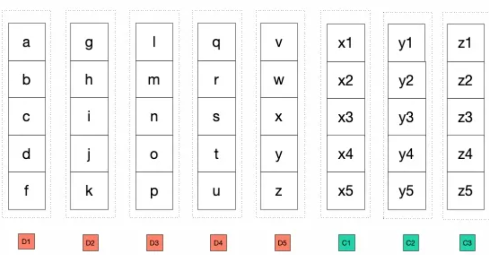
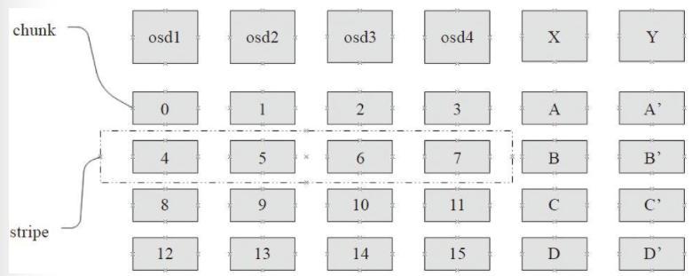

# Erasure Code

## Introduction

纠删码（EC）是最近一段时间存储领域（特别是在云存储领域）比较流行的数据冗余存储的方法，它的原理和传统的RAID类似，但是比RAID方式更灵活。

目前一些主流的云存储厂商都采用EC编码方式。Google GFS II中采用了最基本的RS（6，3）编码，Facebook的HDFS RAID的早期编码方式为RS（10，4）编码。微软的云存储系统Azure使用了的LRC（12，2，2）编码。

各种编码的不同点，实质就是在ErasureCode的三个指标之间折中的结果，这个三指标是：空间利用率、数据可靠性和恢复效率。

Ceph支持以插件的形式来指定不同的EC编码方式。

## Types

### Reed-Solomon Code

目前应用最广泛的纠删码是ReedSolomon编码，简称RS码。

下面介绍RS编码的几个实现：
* Jerasure - Jerasure是一个ErausreCode开源实现库，它实现了EC的RS编码。目前Ceph中默认的编码就是Jerasure方式。
* ISA - ISA是Intel提供的一个EC库，只能运行在Intel CPU上，它利用了Intel处理器本地指令来加速EC的计算。

### LRC

LRC编码的核心思想为：将校验块（parity block）分为全局校验块（global parity）和局部校验块（local reconstruction parity），从而减少恢复数据的网络开销。其目标在于解决当单个磁盘失效后恢复过程的网络开销。

LRC `（M，G，L）`的三个参数分别为：
* `M`是原始数据块的数量。
* `G`为全局校验块的数量。
* `L`为局部校验块的数量。

编码过程为：把数据分成`M`个同等大小的数据块，通过该`M`个数据块计算出`G`份全局效验数据块。然后把`M`个数据块平均分成L组，每组计算出一个本地数据效验块，这样共有`L`个局部数据校验块。

总共有12个数据块，分别为D1 ~ D12。有两个本地数据校验块L1 和L2 ，L1 为通过第一组数据块D1 ~ D6计算而得的本地效验数据块；L2 为第二组数据块D7 ~ D12 计算而得的本地效验数据块。有2个全局数据效验块G1 和G2 ，它是通过所有数据块D1 ~ D12 计算而来。对应RS编码，数据块为D1 ~ D12 ，计算出的效验块为P1 ~ P4 。

不同情况下的数据恢复开销：
* 如果数据块D1 ~ D 12 只有一个数据块损坏，LRC只需要读取6个额外的数据块来恢复。而RS需要读取12个其他的数据块来修复。
* 如果L1 或者L2 其中一个数据块损坏，LRC需要读取6个数据块。如果G1 ，G2 其中一个数据损坏，LRC仍需要读取12个数据块来修复。
最大允许失效的数据块：
* RS允许数据块和校验块中任意的小于等于4个数据的失效。
* 对于LRC：
  * 数据块中，只允许任意的小于等于2个数据块失效。
  * 允许所有的效验块（G1 ，G2 ，L1 ，L2 ）同时失效。
  * 允许至多两个数据块和两个本地效验块同时失效。

## SHEC

SHEC编码方式为SHEC `（K，M，L）`，其中K代表data chunk的数量，M代表parity chunk的数量，L代表计算parity chunk时需要的data chunk的数量。其最大允许失效的数据块为： $\frac{M*L}{K}$ 。这样恢复失效的单个数据块只需要额外读取L个数据块。

下面以SHEC `（10，6，5）`为例，其最大允许失效的数据块为：

$ M(6) * L(5)/ K(10) = 3 $

D1 ~D10 位数据块，P1 为数据块D1 ~ D5 计算出的校验块。P2 位D3 ~ D7 计算出的校验块。其他校验块的计算如图所示。当一个数据块失效时，只读取5个数据块就可以恢复。

### EC Type Summary

* 在三副本的情况下，恢复效率和可靠性都比较高，缺点就是数据容量开销比较大。
* 对于EC的RS编码，和三副本比较，数据开销显著降低，以恢复效率和可靠性为代价。
* LRC编码以数据容量开销略高的代价，换取了数据恢复开销的显著降低。
* SHEC编码用可靠性换代价，在LRC的基础上进一步降低了容量开销。

## Placement

基于不同EC块放置方式，可以分为两类：
* Stripe Placement - 条带放置，将数据顺序进行拆散，逻辑放置在不同的数据块中，打破了数据原先的物理相邻顺序。。
* Contiguous Placement - 连续放置，保留数据原来的顺序。

### Stripe

对于EC块`abcdefghijklmnopqrstuvwxyz`，条带放置结果如下。

特点：
* 一份数据的读取可以同时利用多个磁盘的吞吐能力，但是对于IOPS来说是放大（换句话说对大块数据读取比较友好），缺点就是失去了数据的locality（这在Hadoop大数据体系中将计算放置在数据附近来说是很关键的一点）；
* 及时EC，即不用等凑足整一份大的数据才进行EC写入，基本在凑足EC的条带大小即可进行写入，也就是说在线数据写入可以直接以EC的体系。

### Contiguous

特点：
* 数据都是临近放置，所以一般情况下的数据的读取就跟副本形式一样，在一个数据节点是就可以获得，对于小IO来说比较友好，对于大IO没有明显的缺陷。
* 不能进行及时EC。需要进行凑足一定的数据才能够形成D1到D5的数据块进行EC，所以一般来说比较适合做后台的EC。比如Window Azure Storage 是先写三副本的Extent，在Extent 封存之后后台异步得将数据为EC。

### Read Operations

对于小文件一般是指小于128KB的文件，在Contiguous PlaceMent 条件下小文件在常规情况下的读取方式与传统的多副本类似。但是在高负载情况下和节点故障情况下需要Backup Request机制保障latency（即读取其他块进行重建读避开高负载节点），在如上5+3的模式下，一个IO，需要其他5个节点的IO进行恢复。

而对于Stripe PlaceMent 情况下。如果Stripe Unit 过小，比如4KB，那么可能会导致128KB的小文件读取需要跨很多节点才能够读取完整的数据，相对来说比较费IOPS。这个时候可以适当调整条带大小，使得在正常情况下，小IO的绝大多数情况下的读取可以在单个节点读取，跨越边界情况下读取2个节点。但是这会导致小文件需要很大的IO填充才能够进行一次写入（满条带写），空间利用率会有比较大的降低。

在大块数据读写情况下，Contiguous PlaceMent 方案，在一般场景下跟传统的多副本策略几乎是一样的。因为数据一般来说都是临近放置，直接按照分块的放置进行直接数据读取即可。但是在异常情况下，按照Window Azure Storage 场景的测试，由于磁盘和网络带宽容易相对容易达到瓶颈，所以采用BackUp Request的并没有啥改善。

一般情况下可以认为上层业务的大块连续IO读取都是满条带的读取，在Stripe Placement 情况下，满条带的读取在正常情况下和异常情况下从底层读取的数据量可以认为是一致的，而且当前一般来说EC 解码有硬件加速，即计算层面不太容易成为瓶颈，所以Stripe Placement 在正常度和异常情况下的开销基本可以认为差不多。

在极端情况下，数据跨越stripe unit边界的情况下，会带来2倍的IO放大。但是在Contiguous PlaceMent 策略下，则需要更大的范围内的放大，如下EC 4+2 的策略下，可能会导致4倍的放大，在比如12+3等情况下，会有更大的放大。

## Ceph EC Stripe

下面介绍一些EC的基本概念：
* `chunk` - 一个数据块就叫data chunk，简称chunk，其大小为`chunk_size`设置的字节数。
* `stripe` - 用来计算同一个校验块的一组数据块，称为data stripe，简称stripe，其大小为`stripe_width`，参与的数据块的数目为`stripe_size`。

$stripe\_width = chunk\_size * stripe\_size$

EC（4+2）示例：

`stripe_size`为4，`chunk_size`的大小为1K，那么`stripe_width`的大小就为4K。

在Ceph系统中，默认的`stirpe_width`就为4K。

