# Placement Group

## Intrduction

PG 位于 RADOS 层的中间一一往上负责接收和处理来自客户端的请求，往下负责将这些请求翻译为能够被本地对象存储所能理解的事务。当Cluster map改变时，PG映射的OSD也将随之改变，Ceph以此来实现PG的故障自动迁移。

简言之，PG 是一些对象的集合一，每个对象都属于一个唯一的PG。对象名称的哈希值执行 `stable_mod(PG_NUM)` 后，其结果等于其所属PG的编号。

|Term|Description|
|-|-|
|Acting Set|指一个有序的OSD集合，当前或者曾在某个Interval负责承载对应PG的PG实例。|
|Authoritative History|权威日志。权威日志是 Peering 过程中执行数据同步的依据，通过交换 Info 并基于一定的规则从所有PG实例中选举产生。通过重放权威日志，可以使得 PG 内部就每个对象的应处于的状态(主要指版本号)再次达成一致。|
|Backfill|Backfill是 Recovery 的一种特殊场景，指 Peering 完成后，如果基于当前权威日志无法对 Up Set 当中的某些 PG 实实施增量同步(如承这些 PG实的OSD 离线或者是新的OSD加人集群导致的 PG实例整体迁)则通过完全当前 Primary 所有对象的方式进行全量同步。|
|Epoch| OSDMap 的版本号，由 OSDMonitor 负责生成，总是单调递增。Epoch 变化意味着 OSDMap 发生了变化，需要通过一定的策略扩散至所有客户端和位于服务端的 OSD。因此，为了避 Epoch 变化过于剧烈导致 OSDMap 相关的网络流量和集群存储空间显著增加，同时也导致 Epoch 消耗过快 (Epoch 为无符号32位整数，假定每秒产生13个 Epoch，那么10年时间就会耗光)一个特定时间段内所有针对OSDMap的修改会被折叠进入同一个 Epoch。|
|Eversion|由 Epoch和Version 组成。Version总是由当前 Primary 负责生成，连续并且单调递增和 Epoch 一起唯一标识一次PG内的修改操作。|
|Log|PG使用Log并基于Eversion 顺序记录所有客户端发起的修改操作的历史信息，为后续提供历史操作回溯和数据同步的依据。|
|Info| PG的基本元数据信息。Peering过程中，通过交换Info可以由 Primary 选举得到权威日志，这是后续进行 Log同步和数据同步的基础。|
|Interval|指OSDMap 的一个连续 Epoch 间隔，在此期间对应 PG的Acting Set、Up Set 等没有发生变化。Interval 和具体的 PG 绑定，这意味着即使针对同一个OSDMap 的 Epoch 变化序列，不同的PG也可能产生完全不同的Interval序列。每个Interval的起始 Epoch 也称为 `same_interval_since`。|
|OS|ObjectStore，指OSD后端使用的对象存储引擎，例如 FileStore 或者 BlueStore。|
|Peering|指(当前或者过去曾经)归属于同一个 PG所有的 PG实就本 PG所的全部对象及对象相关的元数据状态进行协商并最终达成一致的过程。Peering基于In和Log 进行。此外，这里的达成一致，即 Peering 完成之后并不意味着每个 PG实例都实时拥有每个对象的最新内容。事实上，为了尽快恢复对外业务，一旦 Peering 完成，在满足条件的前提下 PG就可以切换为 Active 状态继续接受客户端的读写请求，后续数据恢复(即Recovery)可以在后台执行。|
|PGBackend|PGBackend 负责将针对原始对象的操作转化为副本之间的分布式操作。按照副本策略的不同，目前有两种类型的 PGBackend，分别是 ReplicatedBackend (对应多副本)和ECBackend (对应纠删码)。|
|PGID|PG 的身份标识，由 pool-id + PG 在 pool 内唯一编号 + shard (仅适用于纠删码类型的存储池)组成|
|PG Temp|Peering 过程中，如果当前 Interval 通过 CRUSH计算得到的 Up Set 不合理(例如 Up Set中的一些OSD新加人集群，根本没有 PG 的任何历史信息)那么可以通知OSDMonitor设置 PG Temp 来显式指定一些仍然具有相对完备 PG信息的OSD加入 Acting Set，使得Acting Set 中的OSD在完成 Peering 之后能够临时处理客户端发起的读写请求，以尽可能地减少业务中断时间。上述过程会导致 Up Set 和Acting Set 出现临时性的不一致。注意:<br/>1）之所以需要 (通过 PG Temp 的方式)修改 OSDMap，是因为需要同步通知到所有客户端，让它们后续(Peering 完成之后)将读写请求发送至新的Acting Set 而不是 Up Set中的Primary; <br/> 2）PG Temp 生效后，PG将处于 Remapped 状态;<br/>3）Peering 完成后，Up Set 中与Acting Set 不一致的OSD 将在后台通过 Recovery 或者Backh11 方式与当前 Primary 进行数据同步;数据同步完成后，PG需要重新修改 PG Temp为空集合，完成Acting Set 至 Up Set 的切换 (使得Acting Set 和 Up Set 的内容再次变得完全一致)，此时 PG可以取消 Remapped 标记。|
|PGPool|PG 关联存储池的概要信息。如果是存储池快照模式，PGPool 中包含当前存储池所有的快照序列。|
|Primary|指Acting Set 中的第一个OSD，负责处理来自客户端的读写请求，同时也是 Peering 的发起者和协同者。容易理解 Primary 不是固定不变的，而是可以在不同的OSD之间切换。容易理解 Primary 不是固定不变的，而是可以在不同的OSD之间切换。|
|Pull/Push|Recovery 由 Primary主导进行，期间 Primary 通过 Pull 和 Push 的方式进行对象间的数据同步。如果 Primary 检测到自身有对象需要同步，可以通过 Pull 方式从 Replica 获取最新数据(Peering成功完成后可以感知到哪些Replica包含这些最新数据);如果Primary检测到某些 Replica 需要进行数据同步，可以通过 Push 方式主动向其推送最新数据。|
|Recovery|指针对 PG 某些实例进行数据同步的过程，其最终目标是(结合 Backfill)将 PG重新变为Active+Clean 状态。Recovery 是基于 Peering 的结果进行的，一旦Peering 完成，并且PG 内有对象不一致 Recovery 就可以在后台进行。|
|Replica|指当前ActingSet中除Primary之外的所有成员。|
|Stray|PG实例所在的 OSD 不是 PG 当前 Ating Set 中的成员(是过去某个或者某些 Interval曾是)。如果对应的PG已经完成Peering，并且处于Active+Clean状态，那么这个PG实例稍后将被删除;如果对应的PG尚未完成 Peering，那么这个PG实例仍然有可能转化为 Replica。|
|Up Set|指根据CRUSH 计算出来的有序的 OSD 集合，当前或者曾在某个 Interval负责承载对应 PG的PG 实例。一般而言，Acting Set 和 Up Set 总是相同的;但是也有一些特殊情况，此时需要在 OSDMap 中通过设置 PG Temp 来显式指定 Acting Set，这会导致 Up Set和Acting Set 出现不一致。|
|Watch/Notify|用于客户端之间进行状态同步的一种(简单) 机制/协议，基于一个众所周知的对象进行，例如对 RBD而言，这个对象通常是image 的 header 对象。通过向指定对象发送 Watch 消息，客户端注册成为对象的一个观察者 (Watcher)，这些Watcher相关的信息将被固化至对象的基本属性之中，此后该客户端将收到所有向该对象发送的 Notify 消息，并通过 NotifyAck 进行应答。该 Watch 链路有超时限制，需要客户端周期性的发送Ping消息进行保活;超时后链路将被断开，客户端需要重连。通过向指定对象发送 Notify 消息，客户端成为对象的一个通知者 (Notifer)。在收到所有观察者响应(NotifvAck)或者超时之前，通知者(的后续行为)将被阻塞。|

## Read/Write Flow

### Head & Clone & Snapshot

在没有引入快照机制之前，针对原始对象的修改操作非常简单，直接修改原始对象即可。引入快照功能之后，针对原始对象的修改操作变得复杂一为了支持快照回滚操作，一般而言可以通过 COW 机制将原始对象预先克隆出来一份，然后再真正执行针对原始对象的修改操作，但是有两个特殊场景需要额外考虑一一删除原始对象和重新创建原始对象。

如果原始对象被删除，但是仍然被有效的快照引用，显然此时需要借助一个临时对象来保存原始对象相关的历史信息，以便后续进行快照回滚(同时又不能影响原始对象已经不存在这个事实!)。这个临时对象称为 `snapdir` 对象，顾名思义，它仅仅用于保存和原始对象历史快照及克隆相关的信息。

同样的道理，如果原始对象重新被创建并且关联的 `snapdir` 对象存在，则需要执行 `snapdir` 对象清理，并将其存储的快照及克隆历史信息同步转移回原始对象。

### Object Info & SnapSet

对象有两个关键属性(对前端应用不可见)分别用于保存对象的基本信息和快照信息，称为 OI(ObjectInfo)和 SS (Snap Set)属性。

|OI（`object_info_t`）|ObjectState（OI的内存表示）|
|-|-|
|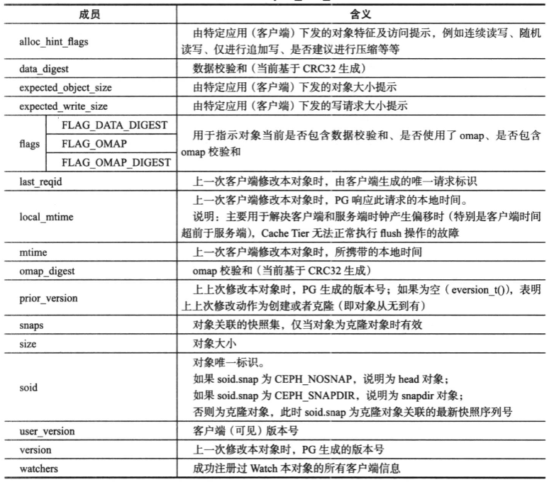|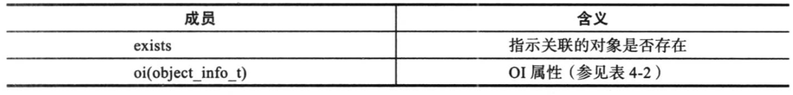|

|SnapSet|SnapSetContext（SnapSet的内存表示）|
|-|-|
|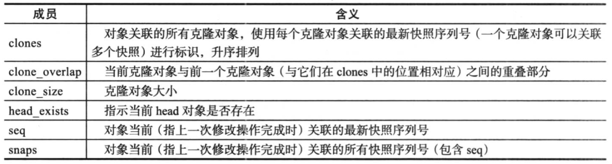|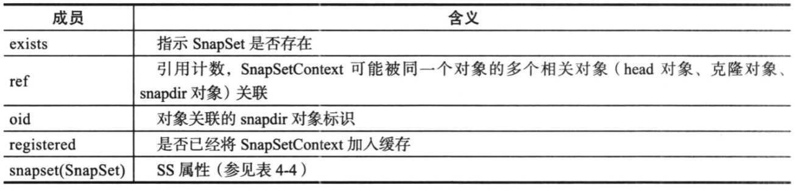|

### SnapContext

如果是前端应用自定义快照模式(例如 RBD，可以针对每个 image 执行快照操作)那么由前端应用下发的请求(op)会携带 SnapContext，指示当前应用的快照信息;如果是存储池快照模式，那么PGPool 中的 SnapContext会指示当前存储池的快照信息(PG每次更新 OSDMap 的同时会同步更新 PGPool)。

|SnapContext|
|-|
|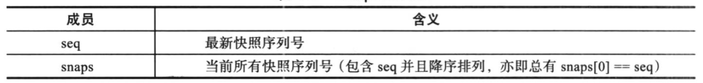|

### ObjectContext

op 操作对象之前，必须先获得对象上下文;在进行读写之前，则必须获得对象上下文的读锁(对应op 仅包含读操作)或者写锁 (对应 op 包含写操作)。原则上，`op_shardedwg`的实现原理可用于确定对访问同一个 PG 的 op 的顺序，但是由于写是异步的(纠删码存储池的读也是异步的)，即写操作在执行过程如果遇到堵塞会让出CPU，所以需要在对象上下文中额外引人一套读写互斥锁机制来确定 op 的顺序。

|ObjectContext|
|-|
|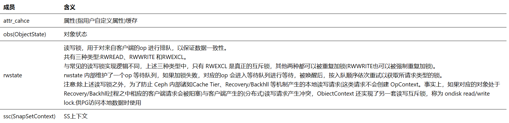|

### Log

日志用于解决 PG副本之间的数据一致性问题，使用 PG元数据对象的omap 保存。

|Log Entry（`pg_log_entry_t`）|
|-|
|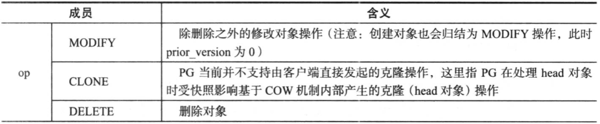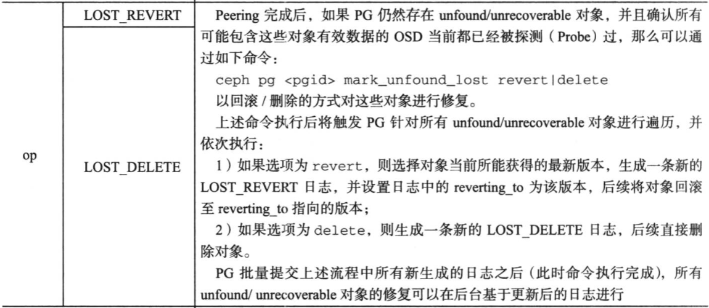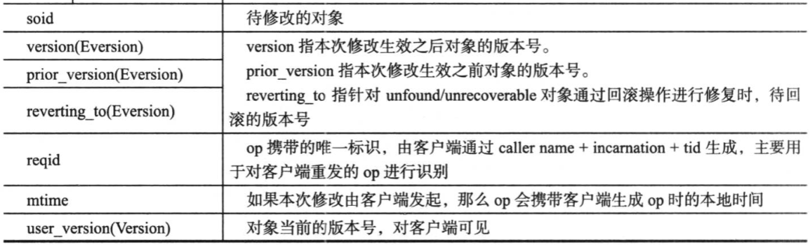|

所有日志在PG中使用一个公共的日志队列进行管理。

|Log（`pg_log_t`）|
|-|
|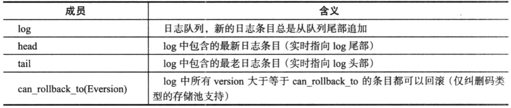|


### OpContext

|成员|含义|
|-|-|
|at_version(Eversion)|如果op 包含修改操作，那么 PG将为op 生成一个 PG内唯一的序列号，该序列号连续且单调递增，用于后续(例如 Peering)对本次修改操作进行追踪和回溯|
|clone_obc(ObjectContext)|克隆对象上下文仅在 p 行过程中产生了新的克隆，或者 op直接针对快照对象或者克隆对象进行操作时加载|
|lock_type|读写锁类型|
|lock manager(ObcLockManager)|指向多个ObiectContext的rwstate用于同时访问多个对象(同一个对象的克隆对象、snapdir 对象等)的读写锁|
|log|PG基于当前op产生的所有日志集合。<br/>注意:日志是基于对象的。针对原始对象(例如 head 对象)的所有修改操作只会产生一条单一的日志记录，但是快照机制的存在使得 PG在执行op 过程中有可能创建克隆对象、创建或者删除 snapdir 对象。因为后面这些操作是针对不同的对象，所以需要为其生成单独的日志记录，所以需要使用集合。|
|modified_ranges|op本次修改操作波及的数据范围|
|new_obs(ObiectState)|op 执行之后(准确地说，是在 Primary 完成op事务装之后)新的对象状态|
|new_snapset(SnapSet)|op 执行之后(准确地说，是在 Primary 完成op事务装之后)新的SS属性|
|obc(ObjectContext)|对象上下文|
|obs(ObjectState)|op 执行之前的对象状态|
|on_applied|回调上下文，OS将事务写人日志后执行|
|on_committed|回调上下文，OS 将事务写人磁盘后执行（对BlueStore而言，写日志和写磁盘是同时完成的）。|
|on_finish|on_finish典型操作为删除OpContext|
|on_success|on_success典型操作为执行 Watch/Notify 相关的操作。因此一般而言，这两个操作需要保证在op 真正完成后(即在所有副本之间都完成之后)执行，执行顺序为on_success ->on_fnish。|
|op|关联的客户端请求|
|snapc(SnapContext)|对象当前最新的快照上下文，每次收到op 时，基于 op 或者PGPool更新|
|snapset(SnapSet)|op 执行之前，对象关联的 SS 属性|
|snapset_obc(ObjectContext)|`snapdir` 对象上下文仅在op涉及`snapdir` 对象操作时加载|

### RepGather

如果 op 包含修改操作，那么需要由 Primary 主导在副本之间执行复制写。顾名思义，当op 涉及的事务由 Primary 完成封装后，会由 RepGather 接管，在副本之间进行分发和同步。

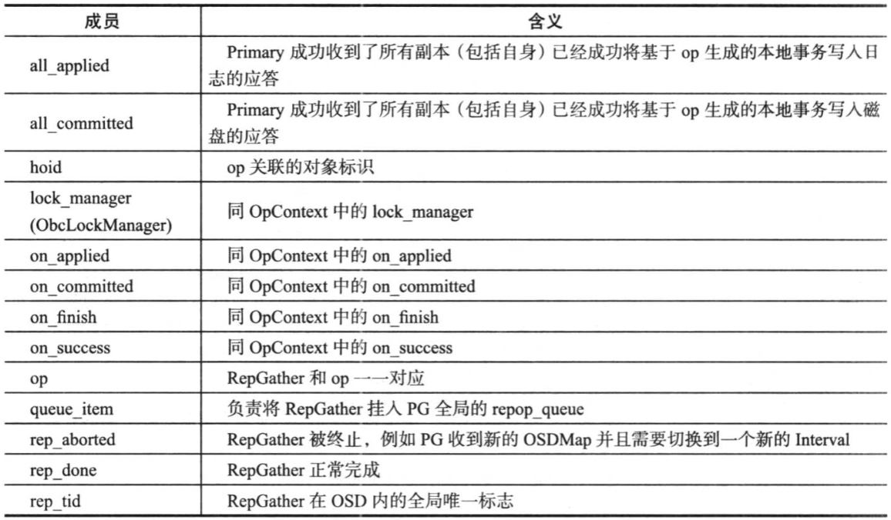

### I/O Flow

客户端读写流程，大体上可以分为如下几个阶段：
* OSD 收到客户端发送的读写请求，将其封装为一个 op 并基于其携带的 PGID 转发至相应的 PG。
* PG 收到 op 后，完成一系列检查，所有条件均满足后，开始真正执行 op。
* 如果 op 只包含读操作，那么直接执行同步读(对应多副本)或者异步读(对应纠删码)，等待读操作完成后向客户端应答。
* 如果 op 包含写操作，首先由 Primary 基于 op 生成一个针对原始对操作的事务及相关日志，然后将其提交至 PGBackend，由 PGBackend 按照复制策略转化为每个 PG 实例(包含 Primary 和所有 Replica)真正需要执行的本地事务并进行分发，当 Primary收到所有副本的写入完成应答之后，对应的 op 执行完成，此时由 Primary 向客户端回应写人完成。

### Message Receive & Dispatch

OSD绑定的 Public Messenger 收到客户端发送的读写请求后，通过OSD注册的回调函数- `ms_fast_dispatch` 进行快速派发(OSD 是 Dispatcher 的一个子类，Dispatcher负责对 Messenger 中的消息进行派发)，这个阶段主要包含以下处理：

* 基于消息(message)创建一个 op ，用于对消息进行跟踪，并记录消息携带的 Epoch。
* 查找 OSD 关联的客户端会话上下文(OSD会为每个客户端创建一个独立的会话上下文)将 op 加人其内部的 `waiting_on_map` 队列(该队列为FIFO队列)，获取当前OSD所持有的OSDMap，并将其与 `waiting_on_map` 队列中的所有op 逐一进行比较一如果 OSD 当前 OSDMap 的 Epoch 不小于 op 携带的 Epoch，则进一步将其派发至OSD的`op_shardedwq` 队列;否则直接终止派发。
* 如果会话上下文中的 `waiting_on_map`不为空，说明至少存在一个op，其携带的 Epoch 比 OSD 当前所持有 OSDMap 的 Epoch 更新，此时将其加 OSD 的全局 `session_waiting_for_map` 集合，该集合中汇集了当前所有需要等待OSD更新完 OSDMap 之后才能继续处理的会话上下文(这里的处理指继续派发会话上下文中的op);否则将对应的会话上下文从 `session_waiting_for_map` 中移除。

op 进入 `op_shardedwq` 队列之后，开始排队并等待处理。顾名思义，`op_shardedwg` 是OSD内部的op 工作队列(Work Queue)，“sharded”关键字则表明其内部实际上存在多个队列(称为 shard list，因为 `op_shardedwq` 对外呈现为一个队列，所以这些内部队列也可以理解为原始队列的分片)。

`op_shardedwq`最终关联一个线池（`osd_op_tp`），负责对`op_shardedwq` 中的op真正进行处理。`osd_op_tp` 包含多个服务线程，具体数目可以根据需要配置。例如假定 `op_shardedwq`中实际工作队列数目为`s`(受配置项`osd_op_num shards` 控制)，每个工作队列需要安排`t`个服务线程(受配置项`osd_op_num_threads_per_shard` 控制)，则最终`osd_op_tp`总的服务线程数目为`s*t`。op 进入哪个工作队列是由它的PG决定的，PGID 取模工作队列总数得到的index，决定op将进入哪个队列。因此相同的PG总是进入相同的队列，这样就确定了op的顺序。

`op_shardedwq` 的内部工作队列可以采用多种实现方式，默认为 `WeightedPriorityQueue`。顾名思义，这是一种基于权重的优先级调度队列一-当 op 携带的优先级大于等于设置的值时(受配置项`osd_op_queue_cut_of` 控制)，队列工作在纯优先级模式(也称为严格优先级模式)：队列内部首先按照优先级被划分为多个优先级队列，然后每个优先级队列按照 op 携带的不同客户端地址再次划分为若干个会话子队列。

* 人队时，按照每个 op 携带的优先级，首先找到对应的优先级队列，其次按 op 携带的客户端地址找到其归属的会话子队列，然后从队尾加入。
* 出队时，则总是查找当前优先级最高的优先级队列并从当前指针指向的会话子队列队头出列(会话子队列是严格的 FIFO 队列)，为了避免同一优先级有来自不同客户端的 op 饿死，每次有 op 成功出队后，其内部指针会从当前会话子队列自动指向下一个会话子队列。

当 op 携带的优先级小于设置的闽值时，队列工作在基于权重的 Round-robin 调度模式（WRR），其与纯优先级模式的区别在于:出队时，选择哪个优先级队列是完全随机的，但是选择结果与每个优先级队列的优先级强相关：优先级越高，则被选中的概率越大:反之优先级低的队列其被选中的概率也低。

当op 成功加人 `op_shardedwq` 中的某个工作队列后，相应的服务线程会被唤醒，通过 OSD 注册的回调函数，找到关联的 PG，由其针对 op 真正执行处理。整个 op 在 PG中的处理过程最终形成了一个十分冗长的函数调用链。

### do_request

`do_request` 作为PG处理 op 的第一步，主要完成一些全局(PG级别的)检查:
* Epoch - 如果 op 携带的 Epoch 更新，那么需要等待 PG 完成 OSDMap 同步之后才能进行处理。
* 如果存在以下情况，则直接丢弃op：
  * op对应的客户端连接已经断开。
  * 收到op 时，PG当前已经切换到一个更新的 Interval (即 PG 此时的 `same_interval_since` 比 op 携带的 Epoch 要大，后续客户端会进行重发)。
  * op 在 PG 分裂之前发送 (后续客户端会进行重发)。
* PG自身状态一如果PG不是 Active 状态，op 同样会被堵塞(这里指来自客户端的op会被堵塞。PG内部产生的一些 op，典型如 Pull/Push，可以在非 Active 状态下被PG直接处理)，需要等待 PG变为 Active 状态之后才能被正常处理。

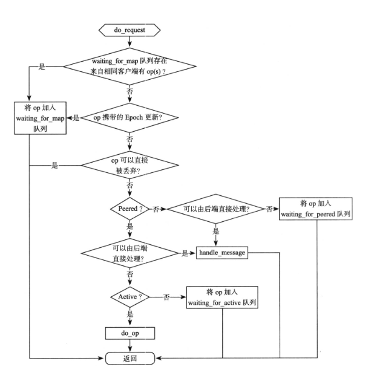

### do_op

通过 `do_request` 校验之后，PG 可以对 op 做进一步的处理。进一步的，如果确认是来自客户端的op，那么PG 通过 `do_op` 对 op 进行处理

op 可能因为不同的原因被推迟处理，PG内部维护了多种不同类型的 op 重试队列，用于对不同场景进行区分。

|Queues|
|-|
|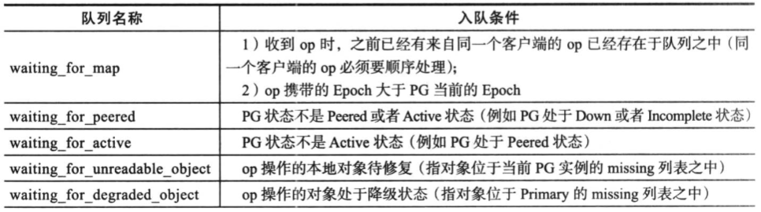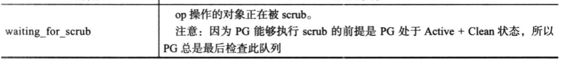|

处理流程如下：

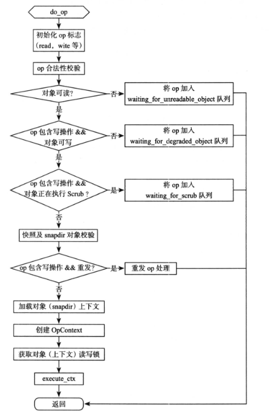

`do_op`主要进行一些对象级别的检查：
* 按照 op 携带的操作类型(单个 op 可以含多个操作)初始化 op 中的各种志位，如:
  * `CEPH_OSD_RMW_FLAG_READ` - 说明 op 中携带读操作。
  * `CEPH_OSD_RMW_FLAG_WRITE` - 说明op 中携带写操作。
  * `CEPH_OSD_RMW_FLAG_RWORDERED` - 说明需要对 op 进行读写排序。
* 完成对op的合法性校验，出现以下情况之一，op 将被认为不合法:
  * PG不包含 op 所携带的对象。
  * op 携带了 `CEPH_OSD_FLAG_PARALLELEXEC`标志，指示 op 之间可以并行执行。
  * op 携带了 `CEPH_OSD_FLAG_BALANCE[LOCALIZE]_READS` 标志，指示 op 可以被Primary/Replica 执行，但是当前处理op的OSD既不是Primary 也不是 Replica。
  * op 对应的客户端未被授权执行 op 所要求操作的能力/权限(例如客户端仅被授予可读权限，但是 op 携带了写操作)。
  * op 携带对象名称、key 或者命名空间长度超过最大限制(在使用传统的 FileStore 引擎时，受底层本地文件系统限制，例如 XFS，所能保存的扩展属性对长度有限制；将OS切换至 BlueStore 时则无此限制)。
  * op 对应的客户端被列入黑名单。
  * op 在集群被标记为 Full 之前发送(PG 通过比对 op 带的 Epoch 和集群标记为Full时的 Epoch 感知)并且没有携带 `CEPH_OSD_FLAG_FULL_FORCE` 标志。
  * PG所在的OSD可用存储空间不足。
  * op 包含写操作并且试图访问快照对象。
  * op 包含写操作并且一次写入的数据量过大(超过配置项`osd_max_write_size`)。
* 检查 op 携带的对象是否不可读或者处于降级状态或者正在被 Scrub，是则加人对应的队列进行排队。
* 检查 op 是否为重发(基于 op 携带的 reqid 在当前 Log 中查找，如果找到，说明为重发)。
* 获取对象上下文，创建 OpContext 对 op 进行追踪，并通过 `execute_ctx`(处理OpContext) 真正开始执行op。

### execute_ctx

`execute_ctx`首先基于当前快照模式，更新 OpContext 中的快照上下文(SnapContext)如果是自定义快照模式，直接基于 op 携带的快照信息更新，否则基于 PGPool 更新。为了保证数据一致性，所有包含修改操作的op 会预先由 Primary 通过 `prepare_transaction` 封装成一个 PG 事务，然后由不同类型的 PGBackend 负责转化为 OS 能够识别的本地事务，最后在副本之间进行分发和同步。

如果 op 包含读操作，那么在`prepare_transaction` 中会同步去磁盘读取相应的内容(指多副本，纠删码复制方式下将执行异步读)，因此需要在执行 `prepare_transaction` 之前预先获取对象上下文中的 `ondisk_read_lock` 并在`prepare_transaction`之后释放。

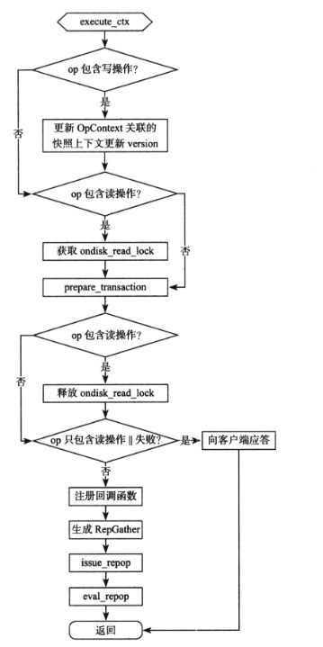

### prepare_transaction

`PGTransaction` 是一种抽象数据类型，它记录了一组以原始对象(即从前端应用视角不考虑复制策略)作为目标的修改操作，后续可以为不同的 PGBackend 翻译成 OS 能够理解的本地事务并执行。与`ObjectStore.:Transaction`(即 OS 事务)类似，`PGTransaction`主要包含一系列操作(修改)原始对象的接口。

|PGTransaction|
|-|
|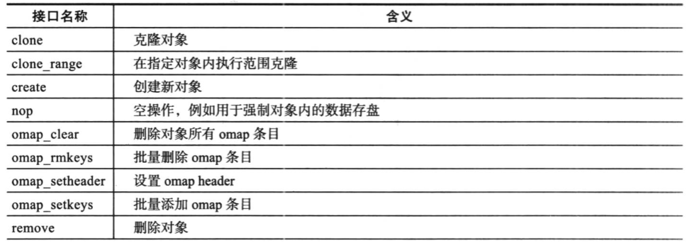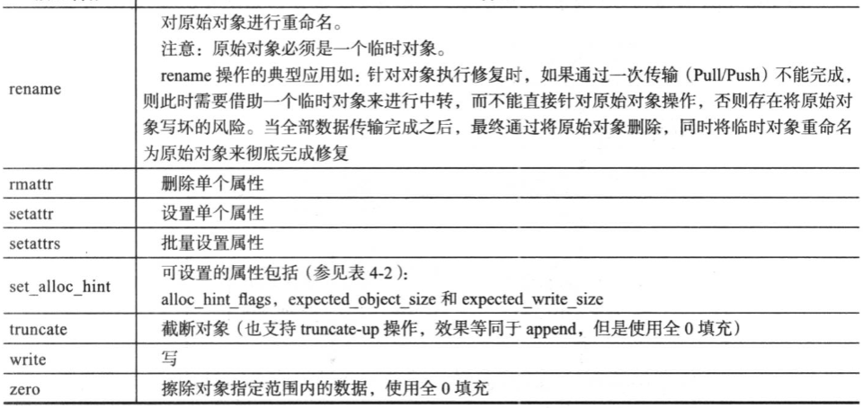|

`prepare_transaction` 负责生成`PGTransaction`，执行分为三个阶段：
* 通过 `do_osd_ops` 生成原始 op 对应的PG事务。
* 如果 op 针对 head 对象操作，通过 `make_writable` 检查是否需要预先执行克降操作。
* 通过 finish ctx 检查是否需要创建或者删除 `snapdir` 对象，生成日志，并更新对象的 OI 和 SS 属性。

值得注意的是，针对同一个对象同一种类型的多次操作可能存在重合部分或者可以合并的可能，典型如 write 和 zero，因此实现上将这类操作进行特殊处理，统一使用一类称为`interval_map`的数据结构进行管理。

顾名思义，`interval_map` 使用 map 对interval(对 PGTransaction 而言，这里的interval 即原始对象中的逻辑地址`<offset,length>`，map 意味着其中的 interval是有序的，并且基于每个 interval 的 offset 进行排序)进行追踪，其特别之处在于需要指定两个自定义函数——split 和 merge，分别应对用于 interval map 中插新的interval时的去重(去重的过程需要从老 interval 中移除重合的部分，因此这个操作称为 split)与合并操作。例如针对 write 操作，split 总是直接将 interval 中的重合部分使用新的待写入数据覆盖，而 merge 则只需要将左右两次写操作进行合并即可(这里的左右写操作分别指满足合并条件时，offset 较小和offset 较大的写操作)。

除了上述操作原始对象的接口，PGTransaction 还额外提供了一个名为 `safe_create_traverse` 的接口，用于 PGBackend 将 PG 事务转化为自身能够理解的本地事务。特别的如果涉及多对象操作，`safe_create_traverse` 内部能够保证这些事务以合理的顺序执行，例如假定待修改的 head 对象关联了快照，转化为本地事务时依然会先创建克隆对象再修改head 对象，而不是相反。

### do_osd_ops

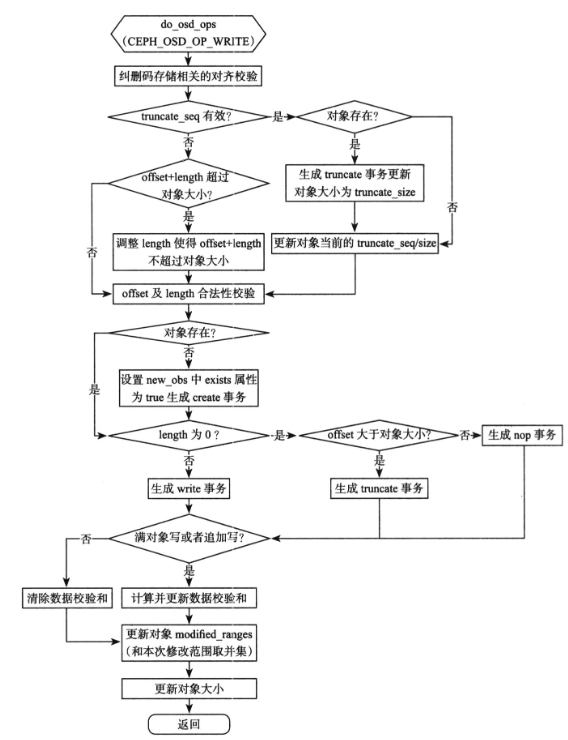

`do_osd_ops`将op转换成PG事务：
* 检查 write 操作携带的 `truncate_seq`，并和对象上下文中保存的 `truncate_seq` 比较从而判定客户端执行 write 操作和trimtrunc/truncate操作的真实顺序，并对 write操作涉及的逻辑地址范围进行修正。
* 检查本地写入逻辑地址范围是否合法一例如限制对象大小不超过100GB(受配置项`osd_max_object_size`控制)。
* 将write操作转化为PGTransaction中的事务.
* 如果是满对象写(包含新写或者覆盖写)，或者为加写并且之前存在数据校验和，则重新计算并更新 OI 中的数据校验和，作为后续执行Deep Scrub的依据;否则清除数据校验和。
* 在 OpContext 中累积本次 write 修改的逻辑地址范围以及其他统计(例如写操作次数、写人字节数)，同时更新对象大小。

当前实现也支持通过 write 操作隐式创建一个新对象，因此如果对应的对象不存在则默认创建，此时将在 PGTransaction 中额外生成一个 create 事务，同时设置 `new_obs.exist` 为true。

### make_writable

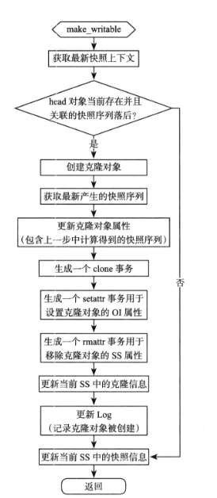

将 op 携带的全部操作都转化为 PGTransaction 中的事务之后，如果op 针对 head对象修改，那么通过 `make_writable` 来判定 head 对象是否需要预先执行克隆。

`make_writable` 首先判断 head 对象是否需要执行克隆：
* 取对象当前的 SnapSet，和 OpContext 中 SnapContext 中的内容进行比较一如果 SnapSet 中最新的快照序列号比SnapContext 中最新的快照序列号小，说明自上一次快照之后，又产生了新的快照，此时不能直接针对 head 对象进行修改，而是需要先执行克隆(默认执行全对象克隆)。
* 如果 SnapContext 携带了多个新的快照序列号(例如自某次快照产生后，很长时间内没有针对本对象执行过任何修改操作，而中间又多次执行了快照操作)，那么所有比 SnapSet 中更新的快照序列号都将关联至同一个克隆对象(亦即后续针对这些快照执行回滚时，都将回滚至同一个克隆对象)。

这里存在一种特殊情况一如果当前操作为删除 head 对象，并且该对象自创建之后没有经历过任何修改(亦即此时 SnapSet 为空)也需要对该 head 对象正常执行克隆后再删除，后续将创建一个 `snapdir` 对象来转移这些快照及相关的克隆信息。

创建克隆对象时，需要同步更新 SS 属性中的相关信息：
* 在 clones 集合中记录当前克隆对象中的最新快照序列号。
* 在 `clone_size` 集合中更新当前克隆对象大小--因为默认使用全对象克隆，所以克隆对象大小为执行克隆时 head 对象的实时大小。
* 在 `clone_overlap` 集合中记录当前克隆对象与前一个克隆对象之间的重合部分。

此外，如果确定需要执行克隆，则需要为克隆对象生成一条新的、独立的日志，并同步更新op中日志版本号。

最后基于SnapContext 来更新对象SS属性中的快照信息。

### finish_ctx

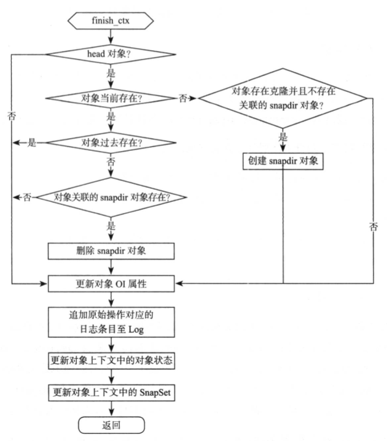

`finish_ctx`主要完成以下操作:
* 如果创建 head 对象并且 `snapdir` 对象存在，则删除 `snapdir` 对象，同时生成一条删除 `snapdir` 对象的日志;如果删除 head 对象并且对象仍然被快照引用，则创建 `snapdir` 对象，同时生成一条创建 `snapdir` 对象的日志，并将 head 对象的 OI和SS 属性使用snapdir 对象转存。
* 如果对象存在，更新对象 OI 属性，如果是 head 对象，同步更新其SS 属性。
* 生成一条 op 操作原始对象的日志，并加至现有 OpContext 中的日志集合中
* 在 OpContext 关联的对象上下文中应用最新的对象状态和SS上下文。

### Callbacks

完成 PG 事务准备后，针对纯粹的读操作而言，如果是同步读，例如多副本，op 已经执行完毕，此时可以直接向客户端应答;如果是异步读，例如纠删码，则将 op 挂入PG内部的异步读队列(`in_progress_async_reads`)，等待异步读完成之后再向客户端应答。

如果是写操作，则分别注册如下几类回调函数：
* `on_commit` - 执行时，向客户端发送写人完成应答。
* `on_success` - 执行时，进行与 Watch/Notify 相关的处理。
* `on_finish` - 执行时，删除 OpContext。

执行顺序：`on_commit` > `on_success` > `on_finish`。

### Transaction Dispatch & Synchronous

所有准备工作就绪后，可以由 Primary 进行副本间的本地事务分发和整体同步，这个过程通过一个 RepGather 来完成。RepGather 基本内容来自 OpContext (例如基于OpContext 初始化 RepGather 时会同步转移 OpContext 中的所有回调函数至 RepGather).区别在于 RepGather 增加了用于副本间进行同步的字段一一典型如 `all_applied` 和`all_committed` 两个标志，分别用于表示是否收到了所有副本写入日志和写人磁盘的应答。

基于 OpContext 初始化 RepGather 之后，可以通过 `issue_repop` 将 RepGather 提交至PGBackend，由后者负责将 PG 事务转化为每个副本间的本地事务之后再进行分发。需要注意的是，在 PG 事务提交至 PGBackend 之后，本地事务有可能立即开始执行，因此在此之前需要先获取波及对象的对象上下文中的 `ondisk_write_lock`，防止和非客户端触发的本地写操作冲突，这些锁将在本地事务执行完成之后释放。此外，因为后续将由 PGBackend接替PG负责对整个事务在副本间的完成情况进踪(这是因为副本间的写日志/磁盘完成应答是由 PGBackend 直接处理的!)所以将PG事务提交至 PGBackend 时同样要注册几类回调函数，用于指示事务整体完成之后的后续操作：

* `on_all_applied` - PGBackend 收到所有副本应答写入日志完成之后执行，执行后将设置 RepGather 中的`all_applied` 标志为 true，同时调用`eval_repop` 来评估 RepGather是否最终完成。
* `on_all_commit`- PGBackend 收到所有副本应答写入磁盘完成之后执行，执行后将设置 RepGather 中的`all_committed` 标志为 true，同时调用 `eval_repop` 来评估RepGather 是否最终完成。
* `on_localapplied_sync` - PGBackend 完成本地事务写日志之后即可同步执行(这里同步的含义取决于 OS 的具体实现，例如 BlueStore 的实现中，通常情况下，`on_localapplied_sync` 将由 BlueStore 中的同步线程执行，而不用再次提交至其内部的 Finisher 线程异步执行)目前主要用于释放 RepGather 中持有的各类对象上下文中的`ondisk_write_lock`。

`eval_repop` 用于评估 RepGather 是否真正完成。如果真正完成，则依次执行 RepGather 中注册过的一系列回调函数，最后将 RepGather 从全局的 RepGather 队列中移除 RepGather。

`submit_transaction` 完成PG的事务分发：
* 对多副本而言，因为每个副本保存的内容完全相同，所以通过 `submit_transaction` 将PGTransaction 转化为每个副本的本地事务无需过多的额外处理(一个重要的例外是需要将日志中的所有条目标记为不可回滚)直接通过 `safe_create_traverse` 逐个事务完成参数传递即可(PGTransaction 和 ObjectStore::Transaction 的事务接口基本是重合的)，之后构造消息向每个副本进行本地事务分发。
* 纠删码的情况比较复杂，特别的，当涉及覆盖写(overwrites)时，如果改写的部分不足一个完整条带(指写人的起始地址或者数据长度没有进行条带对齐)，则需要执行RMW，因此这期间会多次调用 `safe_create_traverse` 分别执行补齐读(Read)、重新生成完整条带并重新计算校验块(Modify)单独生成每个副的事务并构造消息进行分发(Write)同时在必要时执行范围克隆和对 PG 日志进行修正，以支持 Peering 期间(可能需要执行)的回滚操作。

### Space Control

Ceph提供以下参数对存储空间进行控制：

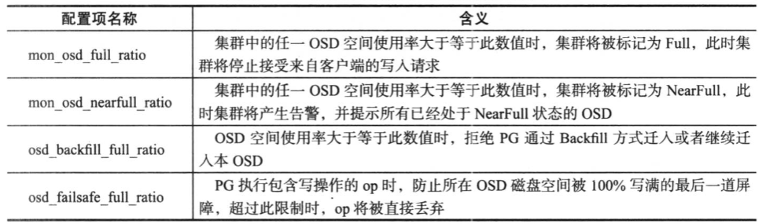

每个OSD 通过心跳机制周期性的检测自身空间使用率，并上报至 Monitor。Monitor 检测到任一OSD的空间使用率突破预先设置的安全屏障时，或者产生告警(超过`mon_osd_nearfull_ratio`)，或者将集群设置为 Full (超过 `mon_osd_full ratio`)并阻止所有客户端继续写入。

`osd_backfill_full_ratio`配置项存在的意义在于有些数据迁移是集群内部自动触发的，例如数据恢复或者自动平衡过程中以 Backfill 方式进行的PG实整体迁。

而 `osd_fail_safefull_ratio` 配置项存在的意义则是如果 `mon_osd_full_ratio` 设置得过高(因为从OSD上报空间使用统计到 Monitor将集群标记为 Full 并真正阻止客户端写人有滞后，所以如果 `mon_osd_full_ratio` 设置不合理，仍然存储客户端继续产生大量写请求将OSD写满的可能)或者某些客户端使用了某些特殊的手段突破集群为 Full 时客户端不能继续写入的限制(例如携带`CEPH_OSD_FLAG_FULL_FORCE`标志)此时 `osd_failsafe_full_ratio` 可以作为防止产生将磁盘空间彻底写满从而导致 OSD 永久性变成只读(FileStore 使用本地文件系统(XFS、ext4、ZFS 等)接管磁盘，例如ZFS 在磁盘空间使用率超过一定门限时，整个文件系统将永久性的变成只读)这类灾难性后果的最后一道屏障。

上述这种空间控制策略虽然看上去有些极端(例如将整个集群标记为 Full 时，其实际整体空间利用率可能还不到 70%!)但却是基于哈希策略分布数据的必要举措，因为无法预料到客户端请求最终会落到哪个OSD上。其次，对 OSD本地空间利用率进行控制的必要性在于大部分本地文件系统在磁盘空间使用率超过 80% 时都会变得极其缓慢，此时集群可能无法再满足时延敏感类应用的需求。

## State Transmit

很多 Ceph 引以为傲的特性，例如自动数据平衡和自动数据迁移，都是以 PG为基础实现的。PG 状态的多样性充分反映了其功能的多样性和复杂性，状态之间的变迁则常常用于表征 PG在不同功能之间进行了切换(例如由 Active+Clean 变为Active+Clean+ScrubbingDeep 状态，说明 PG当前正在或者即将执行数据深度扫)或者 PG 内部数据处理流的进度(例如由Active+Degraded 变为 Active+Clean 状态，说明 PG在后台已经完成了所有损坏对象的修复)。

上述状态指的是能够为普通用户直接感知的外部状态，实现上，PG 内部通过状态机来驱动 PG 在不同外部状态之间进行迁移，因此，相应的 PG 有内(状态机状态)外(负责对外呈现)两种状态。

|State|
|-|
|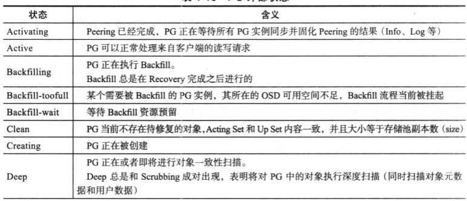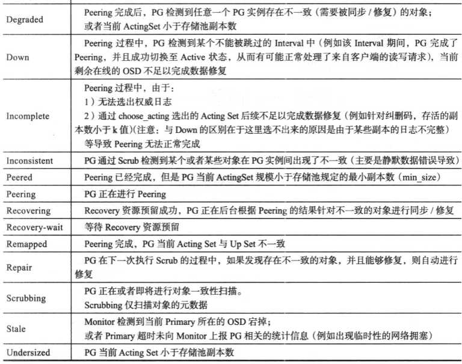|

需要注意的是，这些外部状态并不都是互斥的，某些时刻 PG 可能处于表中多个状态的叠加态之中，常见的如: Active+Clean，表明 PG 当前一切正常;Active+Degraded+Recovering，表明 PG已经完成了 Peering 并且存在数据一致性问题这些不一致的数据(对象)正在后台接受修复等等。

状态机当前一共有四级状态，每一种状态又可以包含若干子状态所有子状态中第一个状态为其默认状态。例如该状态机初始化时，默认会进入 Initial 子状态，又比如当该状态机从其他状态，例如 Reset 状态，跳转至 Started 状态时，默认会进入 Started/Start 子状态。

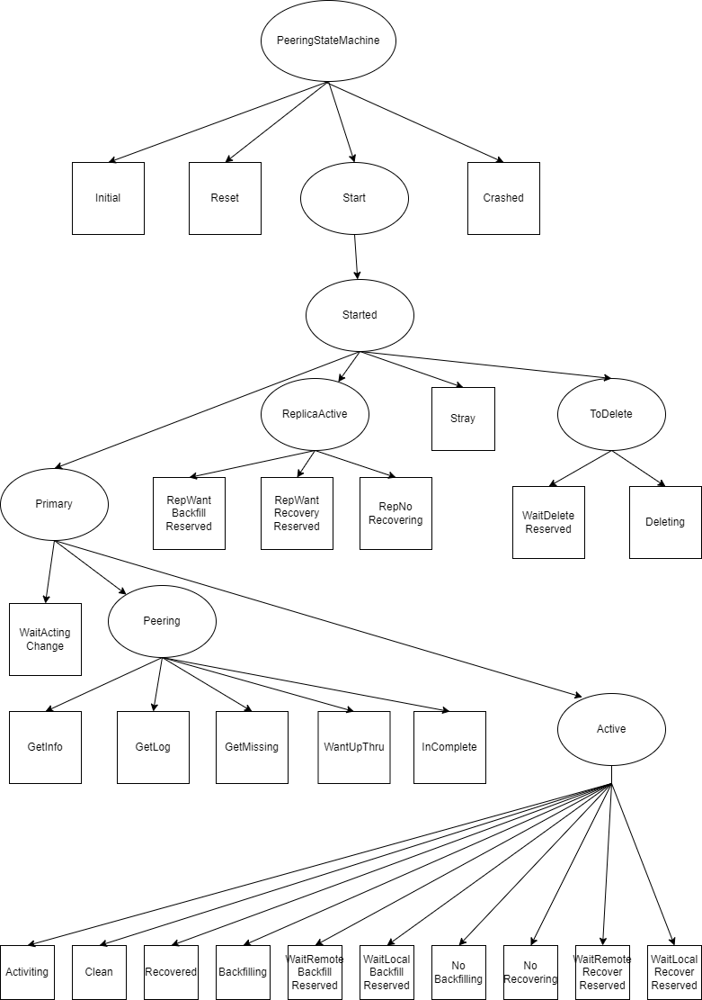

|Event|
|-|
|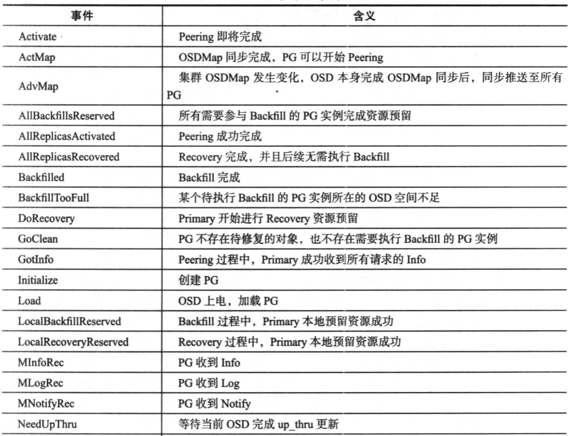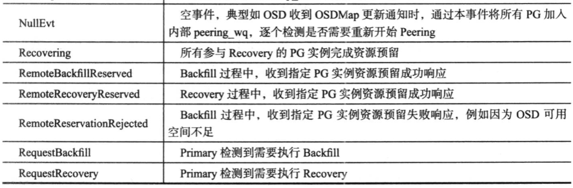|

状态机的整体工作流程如下：

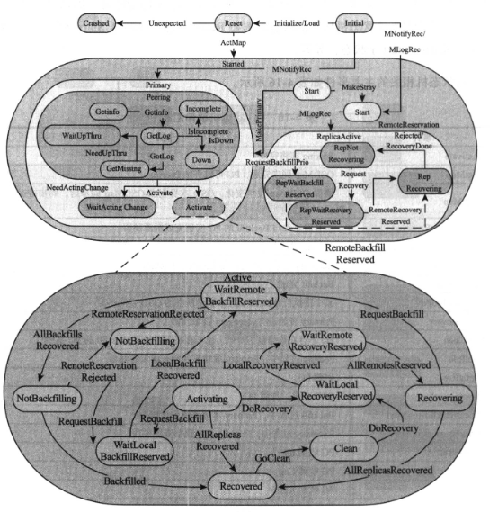

### Create PG

OSDMonitor 收到存储池创建命令之后，最终通过PGMnitor 异步向池中每个 OSD 下发批量创建PG命令。和读写流程类似，PG的创建是在 Primary 的主导下进行的即 PGMonitor 仅需要向当前 Primary 所在的OSD下发 PG 创建请求 Replica 会在随后由 Primary 发起的 Peering 过程中自动被创建。

和读写请求不同，因为创建PG的过程中强烈依赖 OSDMap，所以 OSD 收到该请求后，需要预先获取 OSD 内部的全局互斥锁，以确保该消息处理过程中，OSD 当前关联的 OSDMap 不会发生变化，并最终通过`handle_pg_create`进行处理。

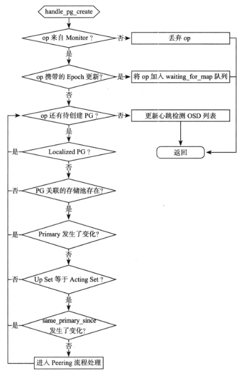

因为 PG 创建必然涉及集群 OSDMap 更新，所以 OSD 处理这类消息之前，必须保证当前所持有的 OSDMap 与消息产生时的OSDMap 同步，否则需要将 op 加人 OSD全局的 `waiting_for_map` 队列(注意不要和上一节中提到的PG内部的 `waiting_for_map`队列混淆!)，同时向 Monitor 发送一个订阅 OSDMap 请求，等待自身OSDMap 更新之后再对 op 进行处理。

同时还要其他常规性检查，例如确认 PG 关联的存储池是否依然存在、Primary 是否发生了变化、Up Set 是否和Acting Set 相等等。

事实上，PGMonitor 在 OSD发送 PG建请求之前已经对上述信息进行过确认，之所以还要进行这类检查，主要是因为当 OSD 收到 op 时，整个集群拓扑结构可能又发生了变化(例如用户创建存储池之后马上又删除)，导致 OSD当前持有的OSDMap 可能比 op 产生时的 OSDMap 更新。一些极端情况下，例如由于网络振荡导致集群短时间内产生了大量 OSDMap 变化，为了防止 PG 在多个 OSD 上被创建(例如 PG的Primary由A -> B -> C -> A，即OSD A收到此PG创建请求时，PG的 Primary 期间经过多次切换，最终又切回 OSD A)，我们还需要对整个 PG 的历史信息进行回溯。

对 PG 历史信息进行回溯的过程称为 `project_pg_history`，基于OSDMap 变化列表进行，以PG创建时的 OSDMap 作为起点，以OSD 当前持有的最新 OSDMap 作为终点其结果将产生三个属性，分别为：
* `same_interval_since` - 标识PG最近一个Interval的起点。
* `same_up_since` - 识自该 Epoch 开始，PG 当前的 Up Set 没有发生过变化。
* `same_primary_since` -标识自该 Epoch 开始，PG当前的Primary 没有发生过变化。

因此，如果完成 `project_pg_history` 之后产生的 `same_primary_since` 大于op 携带的Epoch，说明期间 Primary 曾经发生过变化，我们需要放弃执行本次操作，将决策权交给当前的 Primary(对应 PG已经在别的OSD上创建成功的情况)或者PGMonitor，后续由Primary通过Peering执行 Primary 切换或者由PGMonitor重新发起创建。

如果满足创建条件，在 `handle_pg_create` 的最后一步，OSD 将通过向 `handle_pgpeering_evt` 函数投递一个NullEvt 事件，正式开始着手进行PG创建。该事件没有任何实际作用，仅仅用于初始化创建流程。

顾名思义，`handle_pg_peering_evt` 函数负责处理 Peering 相关的事件。该函数首先判断对应的 PG是否存在，如果存在，则直接从 OSD 全局的 `pg_map` 获取 PG 内存结构。如果不存在，先判该 PG 是否位于待除 PG 列表之中（PG删除是异步的），如果为是，则尝试终止删除并恢复 PG(Ceph 称为“拯救”PG，这种方案之所以可行一一例如不用担心类似“即使拯救成功 PG 中的数据可能也已经残缺不全”这种情况是因为随后 PG 将通过 Peering 重新进行数据同步);如果为否或者PG失败(例如已经被彻底删除)则直接创建 PG，流程如下：

* 直接调用后端 OS 事务接口，依次建 Collection 和 PG元 数据对象。
* 创建PG内存结构，并将其加OSD的全局`pg_map`。
* 填充Info，通过 OS 事务接将其写数据对象的omap。
* 向状态机投递两个事件——Initialize 和ActMap，用于初始化状态机。如果OSD当前为 Primary，那么设置 Primary 状态为 Creating，同时状态机进入Started/Primary/Peering/GetInfo 状态，准备开始执行 Peering。
* 通知OS开始执行上述过中产生的本地事务，同时派发期间产生消息(例如Peering相关的消息)。

查找 PG 成功或者完成 PG 创建之后，`handle_pg_peering_evt`会将调用者输入的 Peering 事件加人 PG的 `peering_queue` 队列，然后再将 PG 加OSD内部的 `peering_wq` 队列，由 OSD后续统一调度和处理。

### Peering

和处理客户端发起的读写请求类似在OSD内部，所有需要执行 Peering 的 PG也会安排一个专门的 `peering_wq` 工作队列，该工作队列同样需要绑定一个线程池（`osd_tp`） 。

然而与 `op_shardedwq` 不同的是：进 `peering_wq` 的不是 op，而是需要处理 Peering 事件的 PG本身。

此外，`pering_wq` 为批处理队列，亦即 `osd_tp` 中的线程对 `peering_wq` 中的条目(即PG)进行处理时，可以一次出列和处理多个条目(受配置项 `osd_peering_wq_batch_size` 控制)，因此，当 `osd_tp` 包含多个服务线程时(受配置项`osd_op_threads`控制) 需要由 `peering_wq` 自身实现互斥机制，防止其中的条目同时被多个服务线程处理。

当PG从`peering_wq` 出列时，OSD 最终通过`process_peering_events`进行批量处理：
* 创建一个 RecoveryCtx，用于批量收集本次处理过程中所有 PG 产生的与 Peering 相关的消息，例如 Query (Info、Log等)、Notify 等。
* 逐个PG处理 - 取 OSD 最新的 OSDMap，通过 `adance_pg` 查 PG 是否需要执行 OSDMap 更新操作。如果为否，说明直接由 Peering 事件触发，将该事件从 PG内部的 `peering_queue` 队列出列，并投递至 PG 内部的状态机进行处理；否则在`advance_pg`内部直接执行 OSDMap 更新操作，完成之后将 PG再次加 `peering_wq` 队列。
* 检查是否需要通知 Monitor 设置本 OSD 的 `up_thru`。
* 批量派发 RecoveryCtx 中累积的 Query、Notify 消息。

如果 PG 当前的OSDMap 与 OSD的最新 OSDMap 版本号相差过大为防止单个 PG 过多的占用时间片，需要分多次对 OSDMap 进行同步，因此每处理一定数量的 OSDMap 后(受配置项`osd_map_max_advance` 控制)，OSD让出时间片，将该PG重新加 `peering_wq`，等待下次继续执行 OSDMap 同步。

如果`advance_pg` 测到 PG 需要进行OSDMap 更新，那么每更新一次，都会同步向状态机投递一个 AdvMap 事件，该事件携带新老 OSDMap 以及 PG 在这两张OSDMap 下的 Up/Acting Set 等映射结果，供状态机判断是否需要重启 Peering。

如果为是，那么状态机将进 Reset 状态，并对 PG 进行去活-一例如暂停 PG 内部的 ScrubRecovery 操作、丢弃尚未完成的 op 等，同时清理 PG 诸如 Active、Recovering 等状态，准备执行 Peering。`advance_pg` 完成或阶段性的完成OSDMap 同步之后，最终会向 PG状态机投递一个ActMap 事件，通知 PG可以开始执行 Peering。

判断是否需要进行或者重启 Peering 的法则比较简单，只要检查本次 OSDMap 更新之后是否会触发 PG 进人一个新的 Interval 即可。因为PG 支持对 OSDMap 进行批量同步，所以在正式进行 Peering 之前，PG 在这些历史的 OSDMap 变化序列中可能产生了一系列已经发生过的Interval，称为 `past_intervals`。

单个Interval 用于指示一个相对稳定的 PG映射周期一-在此期间，PG的Up Set和Acting Set 没有发生变化，关联存储池的副本数、最小副本数以及 PG 数目也没有发生过变化，其磁盘数据结构如下所示：

|`pg_interval_t`|
|-|
|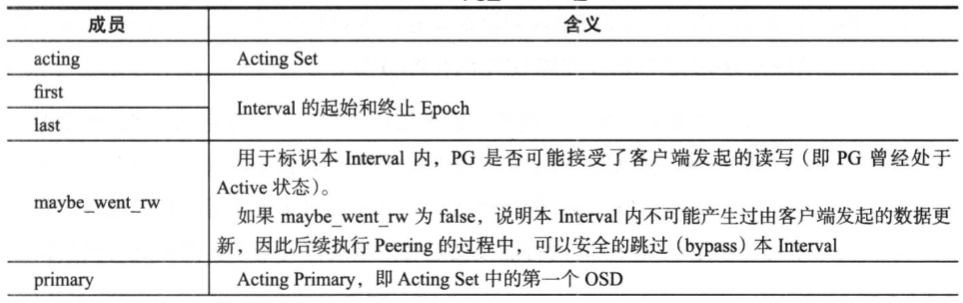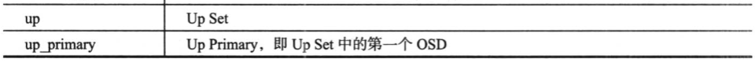|

由Interval定义可见，Interval中已经保存了针对该Interval后续执行 Peering 所需要的全部(OSD)信息，因此，每次生成 `past_intervals` 之后，PG可以立即将 `past_intervals` 作为元数据之一固化至本地磁盘，防止 PG 持续引用一些较老的 OSDMap，进而导致OSD需要存储大量OSDMap，浪费存储空间。

生成Interval的规则比较简单：每次从OSD取当前待更新的 OSDMap 时，我们取其中 PG 关联存储池的副本数、最小副本数和 PG 数目，并基于 CRUSH 重新计算 PG的Acting Set、Acting Primary、Up Set、Up Primary，然后与前一个相邻的OSDMap 进行比较一如果上述属性中任意一个发生变化，说明老的 Interval 结束，新的 Interval开始，此时可以开始填充老 Interval 中的 `first`、`last`、`acting`、`primary`、`up`、`up_primary`等属性，这里的难点在于如何设置`maybe_went_rw`。

`maybe_went_rw`用于标识对应Interval中PG有无可能变为Active 状态从而接受客户端发起的读写请求。显然，如果该标志为 `true`，为了避免潜在的数据丢失风险，我们后续需要通过 Peering 进一步探测此 Interval 中的每个相关的OSD来进行确认：反之则可以直接跳过该Interval。`maybe_went_rw`用来确认过去的最后的Active Set（数据迁移的source）。

为简单计，假定某个集群只有编号为A和B的两个OSD，考虑如下场景:
1. Epoch 1 - A和B正常在线。
2. Epoch 2 - A和B同时掉电，但是因为 OSDMonitor 检测OSD宕有滞后，所以仅有A被标记为Down。
3. Epoch 3 - OSDMonitor 检测到 B宕掉，将B标记为 Down。
4. Epoch 4 - A重新上电并被 OSDMonitor 标记为 Up。

上述集群中OSD状态变化过可以用OSDMap 简记为:
```log
EPOCH 1: A B
EPOCH 2: B
EPOCH 3:
EPOCH 4: A
```

假设PG的`min_size`为1，那么最后的`maybe_went_rw`的Epoch就是2，对应的Acting Set为`[B]`，然后由于OSDMonitor滞后，我们可能早已失去了OSD B，并且B可能永远丢失了，这就会导致A在与上一个`maybe_went_rw`的Epoch进行Peering的时候卡住。Ceph引入`up_thru`解决这个问题，`up_thru`记录OSD上一个完成Peering的Epoch。

```log
EPOCH 1: A B
EPOCH 2: B   up_thru[B]=0
EPOCH 3:
EPOCH 4: A
```

当某个Interval的Acting Set成功完成Peering都必须告知Monitor更新 `up_thru` 然后才能开始提供服务。

进一步的，考虑上面这个例子的另一种可能情形，例如 A 和 B分别掉电:
1. Epoch 1 - A和B正常在线。
2. Epoch 2 - A掉电并被OSDMonitor 标记为 Down，PG 通过B正常完成了 Peering。
3. Epoch 3 - OSDMonitor 成功设置 B的 `up_thru` 为2。
4. Epoch 4 - OSDMonitor 检测到B宕掉，将B标记为 Down。
5. Epoch 5 - A重新上电并被 OSDMonitor 标记为 Up。

```log
EPOCH 1: A B
EPOCH 2: B   up_thru[B]=0
EPOCH 3: B   up_thru[B]=2
EPOCH 4:
EPOCH 5: A
```

这样，引人与OSD状态相关的 `up_thru` 属性后，设置`maybe_went_rw`为true的条件变为：
* Acting Primary存在。
* Acting Set 大于存储池最小副本数(注意:因为最小副本数可以被手动修改，针对纠删码而言，同时要求Acting Set 大于等于k值)。
* 该Interval内，PG(Primary)所在的OSD成功更新了`up_thru` 属性。

完成 `past_intervals` 计算之后，PG可以正式开始 Peering。但是因为集群的OSDMap可能一直处于动态变化之中，如果 PG 在 Peering 的过程中，再次收到 OSDMap 更新通知，那么此时需要重新计算 `past_intervals` 并重启 Peering 流程(Interval可以被合并处理的原因在于PG对于对象的修改操作是基于日志进行的，而 Peering 总是企图基于日志将所有对象都同步更新到其最新版本，这可以通过针对对象的一系列操作日志进行顺序重放实现)。每次更新 `past_intervals` 之后，为了防止重复计算 (因而大量引用一些老的OSDMap)，PG会同步更新 Info 中的 `same_interval_since` 属性，将其指当前PG已经计算得到的最新 Interval，并和生成的 `past_intervals` 一并写入本地磁盘。

#### GetInfo

如果状态机在 Reset 状下收到 ActMap 事件，则意味着可以开始正式执行 Peering。依据PG自身在新OSDMap 中的身份，通过向状态机发送 MakePrimary 或者 MakeStray事件，状态机将分别进入Started/Primary/Peering/GetInf 状态或者 Started/Stray 状态后者意味着对应的PG实例需要由当前 Primary 按照 Peering 的进度和结果进一步确认其身份。

针对Primary，因为此时执行 Peering 的主要依据（`past_intervals`） 已经生成，可以据此来收集本次需要参与 Peering 的全部 OSD 信息，并最终将其加人一个集合，称为PriorSet（“先前”集合）。

简言之，构建 PriorSet 的过程就是针对 `past_intervals` 中的Interval 进行逆序遍历找出所有我们感兴趣的Interval。

首先，Interval不能发生在当前 Primary 的 `last_epoch_started`（上次完成Peering的Epoch） 之前。

当 Peering 接近尾声之时 (PG变为 Active 之前)为了避免由于 OSD再次掉电导致前功尽弃，我们将在最后一步由 Primary 通知所有副本更新Info中的 `last_epoch_started` 将其指向本次 Peering 成功完成时的 Epoch，并和日志以及 Info 中的其他信息一并固化至本地磁盘。

因此，如果 Interval 发生在当前 Primary 的`last_epoch_started` 之前，说明其在上一次成功完成的 Peering 中已经被处理过，无需再次进行处理。这也解释了为什么我们要针对 `past_intervals`进行逆序遍历，因为一旦某个Interval 发生在 Primary 的 `last_epoch_started` 之前，那么 `past_intervals` 中更早的 Interval 必然都可以直接忽略，此时可以直接结束遍历。

需要注意的是，Info 当中实际保存了两个 `last_epoch_started` 属性：
* 一个位于Info下 - 由每个副本收到 Primary 发送的Peering完成通知(Notify)之后更新并和 Peering 结果一并存盘。
* 另一个则位于 Info 的 History 子属性之下 - 由 Primary 收到所有副本 Peering 完成通知应答之后才能更新和存盘，。Primary 在更新 History 中的 `last_epoch _started` 属性后，会同步设置 PG 为 Active 状态(如果此时Acting Set 小于存储池最小副本数，则为 Peered 状态)。

构建 PriorSet 的过程中，如果我们捕获到某个必须要处理(感兴趣)的Interval 不足以完成 Peering，例如所有Acting Set 中的OSD目前都处于离线状态，或者Acting Set 中当前剩余在线的 OSD不足以完成数据修复( Ceph 的强一致性设计，针对客户端的写请求，只有当所有副本都完成之后才会向客户端应答，因此，针对多副本，只要任意一个OSD 存活就足以进行数据修复;针对纠删码，其实现原理要求 Acting Set 中当前存活的 OSD 数目不小于 k 值才能进行数据修复)，那么此时可以直接将 PG 设置为 Down 状态，终止 Peering。

如果 PriorSet 构建成功，那么可以继续进行 Peering。

作为 Peering 的第一步，Primary 首先向所有 PriorSet 中需要探测的OSD(即构造 PriorSet 时，Acting Set中当前仍然在线的 OSD。之所以称为探测，是因为每个Interval 即使设置了 `maybe_went_rw`，也未必一定会产生客户端读写请求，因此在未获取确切的日志信息之前，这个举动带有试探性质) 发送 Query 消息，集中拉取 Info，以获取概要日志信息。

Primary 共计会向 Stray 发送三种类型的消息，分别为 Query、Info和 Log。Query 消息同样可以用于获取 Info 或者 Log，区别在于 Query 消息不会更新Stray当前状态，亦即 Query 消息仅用于 Primary 向 Stray 收集信息，并不能确认其后续是否变为 Replica，真正参与到 Peering 流程中来。

#### GetLog

当所有 Info 收集完毕之后，Primary 通过向状态机发送一个 GotInfo 事件，跳转至Started/Primary/Peering/GetLog 状态，可以开始着手进行日志同步。为此，Primary 需要首先基于如下原则选取一份权威日志，作为同步的基准(以多副本为例):

* 优先选取具有最新内容的日志(即Info中的 `last_update` 最大)。
* 优先选取保留了更多日志条目的日志（即Info中的 `log_tail` 最小）。
* 优先选择当前Primary。

为了保证每个Interval 切换之后能够正常发生客户端读写，PG必须首先在新的 Interval内成功完成Peering，而 Peering 成功完成必然意味着 PG至少已经将全部Acting Set 中的日志记录同步到了最新。

因此，实际操作时，我们可以进一步缩小权威日志的候选范围，仅从最近一次成功完成过 Peering 的那些 PG 当中选取，由前面的分析，即需要查找所有 Info 当中最大的 `last_epoch_started`，并以此作为基准。

如果选取权威日志失败，那么PG 将向状态机发送一个 IsIncomplete 事件，跳转至 Started/Primary/Peering/Incomplete 状态，同时将自身状态设置为 Incomplete。反之，PG可以开始基于权威日志进行日志同步，为此需要确定 PriorSet 当中哪些副本需要或者值得去同步，这个过程称为 `choose_acting`。

由于CRUSH选择 Up Set 的随机性，某些情况下，Up Set 中的某些 OSD 或者因为没有 PG 的任何历史信息，或者因为 PG 版本过于落后(PG 能够保存的志是有限的)，导致它们无法通过日志以增量的方式(称为 Recovery)同步，而只能通过拷贝其他健康 PG中全部内容的方式(称为 Backfill)来进行同步，如果这种情况发生在 Primary 之上，将导致 PG长时间无法接受客户端发起的读写请求。

一个变通的办法是尽可能选择一些还保留有相对完整内容的 PG 副本进行过渡，对应的OSD 称为 PG Temp(即这些 OSD 是PG的“临时”载体)。

通过在OSDMap 中设置 PG Temp，并显式替换 CRUSH 的计算结果。为此我们需要对基于CRUSH“计算”得到的 PG 映射结果进行区分：一种对应原始计算结果，称为 Up Set;另一种称为Acting Set，其结果依赖于 PG Temp 一如果 PG Tep 有效，则使用PGTemp 填充，否则使用 Up Set 填充。

当客户端需要向集群发送读写请求时，总是选择当前Acting Set 中的第一个OSD(亦即Acting Primary)进行发送。当Up Set 中的副本在后台通过 Recovery 或者 Backfill 完成数据同步时，此时可以通知OSDMonitor 取消 PG Temp，使得 Acting Set和 Up Set 再次达成一致，客户端后续的读写业务也随之切回至老的 Primary(即Up Primary)。

出现PG Temp的情况称为Remapped，它同时也是一种 PG外部状态，表明当前 Up Set 中的某些 OSD 需要或者正在通过 Backfill 进行修复，这些OSD和当前 Acting Set 中的所有 OSD 一起组成一个新的集合，我们称为 ActingBackfill。

考虑到我们最终仍然需要将 Acting Set 切回 Up Set，因此，在 Peering 成功完成之后，Acting Set 切回 Up Set 之前，为了避免不必要的数据同步，我们需要针对在此期间由客户端所产生的写请求进行特殊处理。

如果该对象正在被 ActingBackfill 集合当中任意一个OSD 执行 Backfi1，则阻塞此请求，等待 Backfill 完成后，按如下方式处理：所有 Acting Set 中的 OSD 和所有已经完成该对象 Backfill 的OSD正常执行事务；所有尚未完成该对象 Backfill的OSD，则直接执行一个空事务(因为这些OSD 上还不存在这些对象!)，仅用于更新日志、统计等元数据信息。

`choose_acting`为 PG选出一组 OSD 充当 Acting Set。为了和 CRUSH 计算的结果进行区分，我们将 `choose_acting` 选择的结果称为 `want_acting`（Up Set可能与其不一样），选择的原则为：
* 首先选取 Primary。如果当前 Up Set 中的 Primary 能够基于权威日志修复或者自身就是权威日志，则直接将其选为 Primary ;否则选择权威日志所在的 OSD作为Primary。选中的Primary 同步加入`want_acting`列表。
* 其次，依次考虑 Up Set 中所有不在 `want_acting` 列表中的 OSD，如果其还能够基于权威日志修复，则加人 `want_acting` 列表，等待后续通过日志修复；反之，将其加入 Backfill 列表，等待后续通过 Backfill 方式修复。
* 如果当前 `want_acting` 列表大小等于存储池副本数，则终止：否则继续从当前Acting Set中依次选择能够基于日志修复的OSD加`want_acting`列表。
* 如果当前 `want_acting` 列表大小等于存储池副本数，则终止;否则继续从所有返回过Info的OSD中选取能够基于日志修复的OSD加 `want_acting` 列表，直至当前`want_acting`大小等于存储池副本数，或者所有返回过Info的OSD遍历完成。

如果 `choose_acting` 选不出来足够的副本完成数据同步(例如针对纠删码而言，要求存活的副本数不小于 k 值才能进行数据修复)，那么 PG 将进 Incomplete 状态;如果 `choose_acting` 选出来的 `want_acting` 和当前的Acting Set 不一致，说明需要借助 PG Temp 临时进行过渡，Primary 将首先向 Monitor 发送设置 PG Temp 请求，随后向状态机投递一个 NeedActingChange 事件，将状态机设置为 Started/Primary/WaitActingChange 状态等待PG Temp在新的OSDMap 生效后继续。

为了进一步缩短 Peering 流程，Ceph 引入了一种对 PG Temp进行预填充的机制，称为 Prime PG Temp，其主要设想在于每次 OSDMonitor 在新的 OSDMap 生效之后，同步计算基于当前 OSDMap 产生的所有 PG 映射结果，然后赶在下一个 OSDMap 生效之前，判定本次 OSDMap 变化是否有可能会导致某些 PG 发生 Remapping。如果有可能，例如下一个OSDMap 变化是由某些 OSD 宕掉触发，则基于下一个即将生效的 OSDMap 实时计算新的 PG 映射结果，并与基于当前 OSDMap 计算得到的 PG 映射结果相比较，预先填充那些即将受到影响 PG 的 PG Temp并使之在下一个 OSDMap 中一并生效，从而避免这些 PG 在后续 Peering 过程中再次向 OSDMonitor 请求更新 PG Temp。这种预填充带有猜测性质，如果 PG 后续通过  Peering 选出来的 PG Temp 与之不相符，仍然需要通过发送 PG Temp 请求至 OSDMonitor 进行修改。

Primary 接下来将进行日志同步。如果 Primary 自身没有权威日志，那么需要通过发送 Query 消息去权威日志所在的 OSD拉取权威日志至本地。为了尽可能地减少日志传输 Primary 会预先计算待拉取的日志量，即计算待拉取日志的起点 (终点就是权威日志最新日志条目对应的版本号)。这从所有 Acting Set 中选择最小的 `last_update` 即可(由 `last_update` 定义，它是PG所拥有最新日志对应的版本号)。

成功获取到权威日志之后，Primary 可以将其和本地日志进行合并，生成新的权威日志:

* 考虑拉取过来的日志中是比 Primary 更老的日志条目。因为 Primary后续需要对所有 Acting Set 中的副本通过日志进行修复，所以为了防止某些副本需要用到较老的日志而 Primary 当前又没有(比如这些副本最新日志版本号比Primary 最老日志版本号（`tail`）还小)，则只能从权威日志所在的 OSD上去获取。因为日志能够删除的前提是对应的操作必然在当时的副本之间已经完成同步，所以这部分日志和 Primary 自身不存在一致性问题，无需进行特殊处理，直接追加在 Primary 本地日志的`tail`即可。
* 考虑拉取过来的日志中是比 Primary 更新的日志条目。原则上，仅需要将新的日志条目按顺序依次追加到当前 Primary 日志的 `head` 即可，但是需要考虑一种特殊情况，即 Primary 最后更新的那条日志如何处理。

日志使用 Eversion 进行标识和排序。Eversion 包含两个部分：
* 一是产生日志时 OSDMap 对应的 Epoch。
* 二是由 Primary 负责生成的版本号 Version。

|Primary|Authoritative|
|-|-|
|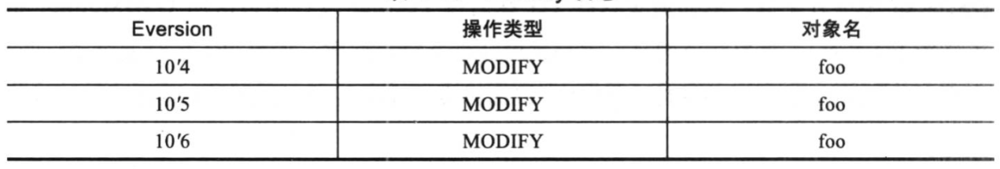|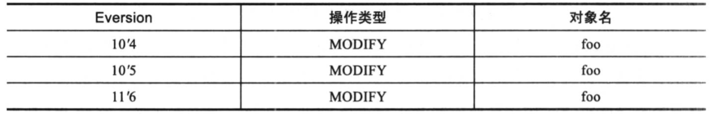|

对比两者最后一条日志，容易发现它们的 Version 相同但是 Epoch 不同 (这种现象通常由于 PG 的 Interval 发生了切换导致)，即这两条日志产生了分歧，那么此时应该如何处理这种分歧呢？

种自然的想法是先将 Primary 本地与权威日志产生分歧的日志进行回退，即先解决分歧，然后再执行合并。考虑到这些产生分歧的日志仍然可能操作同一个对象，也可以先将 Primary 本地有分歧的日志取出，待和权威日志完成合并之后，再集中解决分歧。

和权威日志合并的过程中，如果 Primary 发现本地有对象需要修复，那么会将其加人missing列表，完成合并之后(或者 Primary 自身就拥有权威日志) Primary 通过向状态机发送一个GotLog 事件，切换至Started/Primary/Peering/GetMissing 状态，同时固化合并后的日志及 missing列表至本地磁盘，开始向所有能够通过 Recovery 恢复的OSD(后续称为 Peer)发送Query 消息，以获取它们的日志。同理，收到每个 Peer 的完整日志后通过和本地日志比对(此时Primary 已经完成了和权威日志同步) Primary可以构建所有Peer的missing列表，作为后续执行 Recovery 的依据。

#### GetMissing

每个PG实例的 missing列表记录了自身所有需要通过 Recovery 进行修复的对象信息。以对象为单位，为了后续能够被 Primary 正确的修复，missing 列表中每个条目仅需要记录如下两个重要信息：
* `need` - 对象目标版本号。
* `have` - 对象本地版本号。

当Primary 收到每个 Peer 的本地日志后，可以通过日志合并的方式得到每个 Peer的missing列表，这一过程和上一节中我们提到的 Primary 自身和权威日志合并的过程类似，最终也是通过解决分歧日志得到的（即使用权威的覆盖非权威的）。

为了解决分歧日志，我们首先将所有分歧日志按照对象进行分类一即所有针对同一个对象操作的分歧日志都使用同一个队列进行管理，然后逐个队列(对象)进行处理。

假定针对同一个对象操作中的一系列分歧日志中，最老的那条分歧日志生效之前对象的版本号为 `prior_version`（“先前”版本），则针对每个队列(对象)的处理都可以归结为以下五种情形之一：
* 本地存在比分歧日志条目更新的日志。将本地对象删除，将其加入 missing 列表，同时设置其 `need` 为 权威版本，`have`为 0 (即本地没有)。
* 对象之前不存在(例如`prior_version` 为0，或者最老的分歧日志操作类型为CLONE)。直接删除对象。
* 对象当前位于missing列表之中(例如上一次 Peering 完成之后，Primary 刚刚更新了自身的 missing 列表，但是其中的对象还没来得及修复，系统再次发生掉电)。因为missing列表中 `have` 指示对象当前的本地版本号，所以如果 `have` 等于 `prior_version`，说明所有分歧日志针对该对象的操作尚未生效(因此也就无需执行回滚)，此时可以直接将对象从 missing 列表中移除。反之，则说明至少有部分分歧日志操作已经生效，此时需要将对象回滚至最老的分歧日志操作之前的版本，即 `prior_version`，这通过修改对象在 missing 列表中的 `need` 为 `prior_version`实现。
* 对象不在missing列表之中同时所有分歧日志都可以回滚。此时将所有分歧日志按照从新到老的顺序依次执行回滚。
* 对象不在missing列表之中并且至少存在一条分歧日志不可回滚。此时将本地对象直接删除，将其加入 missing 列表，同时设置其 `need` 为 `prior_version`，`have`为`0`。

当Primary 成功收集到所有 Peer 日志并据此生成各自的missing列表之后，通过向状态机投递一个 Activate 事件，进入 Started/Primary/Active/Activating 状态，开始执行激活PG之前的最后处理。

#### Activate

随着 Peering 逐渐接近尾声，在 PG 正式变为 Active 状态接受客户端读写请求之前还必须先固化本次 Peering 的成果，以保证其不致因为系统掉电而前功尽弃，同时需要初始化后续在后台执行 Recovery 或者 Backfill 所依赖的关键元数据信息，上述过程称为Activate。

`last_epoch_started` 用于指示上一次 Peering 成功完成时的 Epoch，但是因为 Peering 涉及在多个 OSD之间进行数据和状态同步，所以同样存在进度不一致的可能。为此，我们设计了两个 `last_epoch_started`，一个用于标识每个参与本次 Peering的PG 实例本地 Activate 过程已经完成，直接作为本身 Info 的子属性存盘;另一个保存在Info的History子属性下，由 Primary 在检测到所有副本的Activate 过程都完成后统一更新和存盘。

同时，因为 ActingBackfill 中的成员已经全部确定，此时可以按照每个成员的实际情况，分别发送 Info 或者 Log 消息，将它们转化为 Sarted/ReplicaActive 状态，并参与到后续客户端读写、Recovery 或者 Backfill 流程中来，具体有以下几种情形：
* Peer 不需要进行数据恢复，例如 Peer 是权威日志所在的 OSD，则直接向其发送 Info 消息，通知其更新 `last_epoch_started` 即可。
* Peer 需要重新开始 Backfill，此时设置 Info 中的 `last_backfill` 为空，同时向其发送 Log 消息，指示后续需要执行 Backfill。
* Peer 可以通过 Recovery 进行修复，此时直接向其发送 Log 消息，携带 Peer 缺少的那部分日志。

如果 Peer 收到 Log 消息，首先检测自身是否需要重启 Backfill，是则初始化 Backfill设置;否则说明仍然可以通过日志恢复，因此本地通过日志合并的过程重新生成完整日志并构建自身的 missing 列表。此后通过向状态机投递一个Activate 事件，Peer 可以将自身状态机从 Started/Stray 状态切换为 Started/ReplicaActive 状态，同时调用本地OS 接口开始固化Info和日志信息(也包含自身的missing列表)。

如果 Peer 收到 Info 消息，说明自身数据已经和权威日志同步(实际上，此时 Peer仍然可能包含了比权威日志更新的日志，这可能产生分歧日志，因而需要优先解决分歧日志)，此时直接向状态机投递Activate 事件，同样进入 Started/ReplicaActive 状态并开始固化自身 Info。

本地事务成功之后，Peer需要向 Primary 回应一个Info消息，表明 Peering 成果固化成功。

在进行 Recovery 之前，我们必须首先引人一种同时包含所有 missing 条目和它们(目标版本)所在位置信息的全局数据结构，称为 MissingLoc。

MissingLoc 内部可以细分为两张表，分别称为 `needs_recovery_map` 和 `missing_loc` 顾名思义，它们分别保存当前 OSD的本地PG实例 所有待修复的对象，以及这些对象的目标版本具体存在于哪些 OSD 之上。需要注意的是，某些待修复对象的目标版本可能同时存在于多个OSD实例之上，因此 `missing_loc` 中每个待修复对象的位置信息不是单个OSD而是一些OSD的集合。

因为 Recovery 和 Backfill 必须由 Primary 主导(这和为什么必须由 Primary 来主导客户端发起的读写请求原因一致)所以 MissingLoc 也必须由 Primary 来负责统一生成。

对应生成 `needs_recovery_map` 和 `missing_loc` 的顺序，生成完整的 MissingLoc 也分为两步:首先将所有 Peer missing 列表中的条目依次加 `needs_recovery_map` 之中;其次，以每个 Peer 的 Info 和 missing 列表作为输入，针对 `needs_recovery_map` 中的每个对象逐个进行检查，以进一步确认其目标版本的位置信息并填充 `missing_loc`，具体原则如下:
* 如果待修复对象的目标版本号(即`need`)比 Peer 的最新日志版本号(即 `last_update`)还大，说明 Peer 不可能存在该目标版本，直接跳过。
* 待修复对象也位于 Peer 的missing 列表之中，则直接跳过。
* 否则将对象加 `missing_loc`，同时更新其位置列表(增加当前的 Peer 身份信息)。

成功生成 MissingLoc 之后，如果 `needs_recovery_map` 不为空，即存在任何需要被 Recovery 的对象，则 Primary设置自身状态为 Degraded + Activating(事实上每个PG实例都可以独立设置自身的状态，但是 Monitor 只收集 Primary 当前上报的状态作为 PG 的状态);进一步的，如果 Primary 检测到当前Acting Set 小于存储池副本数，则同时设置 Undersized 状态。之后，Primary 通过本地 OS 开始固化 Peering 结果，并等待其他 Peer 确认 Peering 完成。

当 Primary 检测到自身以及所有 Peer 的 Activate 操作都完成时，通过向状态机投递一个 AllReplicasActivated 事件来清除自身的 Activating 状态和 Creating 状态(如有)，同时检测 PG 此时的 Acting Set 是否小于存储池的最小副本数，如果为是，则将 PG 状态设置为 Peered 并终止后续处理;如果为否，则将 PG 状态设置为 Active，同时将之前堵塞的来自客户端的 op 重新入列。

随着 PG 进入 Active 状态，Peering 流程正式宣告完成，此后 PG 可以正常处理来自客户端的读写请求，Recovery 或者 Backfill 可以切换至后台进行。

### Recovery

如果 Primary 检测到自身或者任意一个 Peer 存在待修复的对象，将通过向状态机投递一个 DoRecovery 事件，切换至 Started/Primary/Active/WaitLocalRecoveryReserved 状态，准备开始执行 Recovery，此时 PG进入 Recovery_wait 状态。

为了防止集群中大量 PG 同时执行 Recovery 从而严重拖累客户端响应速度，需要对集群中 Recovery 相关的操作进行限制，这类限制均以 OSD 作为基本实施对象，以配置项形式提供：

|Config|Description|
|-|-|
|`osd_max_backfills`|单个OSD允许同时执行 Recovery 或者 Backfill 的PG实例个数包含 Primary和 Replica。
注意:虽然单个PG的 Recovery 和 Backfill 流程不能并发，但是不同PG的Recovery 和 Backfill 流程可以并发。|
|`osd_max_push_cost/osd_max_push_objects`|指示通过 Push 操作执行 Recovery 时，以OSD为单位，单个请求所能够携带的字节数/对象数。|
|`osd_recovery_max_active`|单个OSD允许同时执行 Recovery 的对象数。|
|`osd_recovery_op_priority`|指示 Recovery op 默认携带的优先级，这类 op 默认进 `op_shardedwq` 处理，即需要和来自客户端的op进行竞争。因此，设置更低的`osd_recovery_op_priority`将使得 Recovery op 在和客户端 op 竞争中处于劣势，从而起到抑制 Recovery，降低其对客户端业务所产生的影响。|
|`osd_recovery_sleep`|Recovery op 每次在 `op_shardedwq` 中被处理前，设置此参数将导致对应的服务线程先休眠对应的时间。容易理解这种方式可以显著拉长 Recovery op 执行的间隔，从而有效抑制由Recovery 产生的流量。|

`osd_max_backfills` 用于显式控制每个OSD上能够同时执行 Recovery 的 PG 实例个数，为此我们需要首先向 Primary 所在的OSD申请 Recovery 资源预留，这通过将对应的 PG 加入 OSD 的全局异步资源预留队列来实现。

该队列对 OSD 现有资源(例如此处的 Recovery 资源)进行统筹，按 PG 入队顺序进行分配。如果已经达到资源上限限制(例如可用资源数为 0)，则后续入队的资源预留请求需要排队，等待已占有资源的 PG 释放资源之后重新申请；反之，则将资源直接分配给当前位于队列头部的 PG (同时减少可用资源数)同时执行该 PG 入队时指定的回调函数，以唤醒 PG 继续执行后续操作。

如果 Primary 本地 Recovery 资源预留成功 Primary 通过向状态机投递一个 LocalRecoveryReserved 事件，切换至Started/Primary/Active/WaitRemoteRecoveryReserved 状态，同时通知所有参与 Recovery 的 Peer(为 ActingBackfill 集合当中除 Primary 之外的所有副本)进行资源预留。每个 Peer 执行本地 Recovery 资源预留的过程和 Primary 类似。当 Primary 检测到所有 Peer 资源预留成功后，通过向状态机投递一个 AllRemotesReserved 事件，进入 Started/Primary/Active/Recovering 状态，正式开始执行Recovery，相应的，PG状态也随之由 Recovery_wait 切换至 Recovering。

在实现上让所有需要执行 Recovery 的 PG 也进入 OSD全局的 `op_shardedwq` 工作队列，和来自客户端的 op 一同参与竞争。这样，或通过降低 Recovery op 的权重，或者通过 QoS 对 Recovery 总的 IOPS 和带宽施加限制，我们可以有效控制集群中 Recovery 行为的资源消耗，避免对正常业务造成显著冲击。

当前 Recovery 一共有两种方式：
* Pull -  Primary 自身存在待修复对象，由 Primary 按照 `missing_loc` 选择合适的副本去拉取待修复对象目标版本至本地，然后完成修复。
* Push - Primary 感知到一个或者多个 Replica 当前存在待修复对象，主动推送每个待修复对象目标版本至相应 Replica，然后由其本地完成修复。

两者同时进行，Primary既“推”又“拉”。

Primary本地对象的修复是基于日志进行的，具体如下：
* 日志中 `last_requested` (注意其类型是 Version，而不是 Eversion)用于指示本次 Recovery 的起始版本号，在 Activate 过程中生成。因此，我们首先将所有待修复对象按照日志版本号进行顺序排列，找到版本号不小于 `last_requested` 的第一个对象，记录其真实日志版本号——v(满足`v >= last_requested`)，同时记录其待修复的目标版本号。
* 如果不为 `head` 对象，那么检查是否需要优先修复 `head` 对象或者 `snapdir` 对象。
* 根据具体PGBackend生成一个Pull类型的op。
* 更新 `last_requested`，使其指向 v。
* 如果尚未达到单次最大修复对象数目限制，则顺序处理队列中下一个待修复对象：否则开始批量发送 Pull 消息，并返回。

需要注意的是，Primary 自我修复过程中，可能会存在多个副本都拥有待修复对象目标版本(典型如多副本)，出于负载均衡的目的此时可以随机选择副本。Primary 在自我修复的同时着手修复各个 Replica 中的损坏对象。因为此前 Primary 已经为每个Replica生成了完整的 missing 列表，可以据此通过Push 的方式逐个完成 Replica 的修复（未完成自我修复的对象会被delay）。

需要注意的是，不同的数据修复策略对于整个 Recovery 的效率存在巨大影响。仍以多副本为例，因为 PG 日志信息中并未记录任何关于修改的详细描述信息，所以 Ceph 目前都是简单的通过全对象拷贝进行修复。容易想见，这在绝大多数情况下都远不是一种最优的数据修复策略，这也是 Ceph 的 Recovery 性能一直为人所诟病的地方。

PG 日志信息中并未记录任何关于修改的详细描述信息，所以 Ceph 目前都是简单的通过全对象拷贝进行修复。

当所有对象修复完成后，Primary 首先通知所有 Replica 释放占用的 Recovery 资源(避免堵塞同一个 OSD 上其他需要执行 Recovery 的 PG 实例)，如果后续需要继续执行 Backfill，那么 Primary 无需释放自身占用的 Recovery 资源，直接向状态机投递一个RequestBackfill事件，清除自身的 Recovering 状态，同时将状态机切换至 Started/Primary/Active/WaitRemoteBackfillReserved 状态，准备开始执行 Backfill。

### Backfill

