# RADOS Block Device

## Introduction

RBD全称RADOS Block Device是使用最广的RADOS接口，上层应用访问RBD有两个方法：
* `krbd` - RBD的内核客户端库。
* `librbd` - RBD的用户态客户端库。

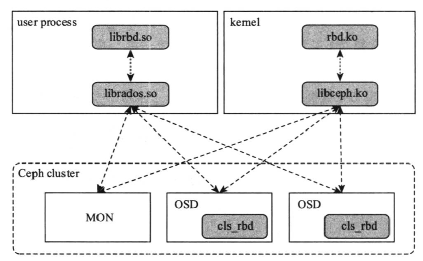

一个Rados Block Image由两个部分组成：
* 元数据（包括image到block id的映射，block id到RADOS对象的映射等）。
* 数据（块切分保存的RADOS对象）。

通常情况下元数据和数据都存储在同一个Pool中。

当Pool中仅存在`test_image`一个镜像时，对象如下：

```log
$ rados ls -p block_pool
rbd_directory
rbd_info
rbd_object_map.2d174922f3a39
rbd_id.test_image
rbd_header.2d174922f3a39
rbd_data.2d174922f3a39.*
```

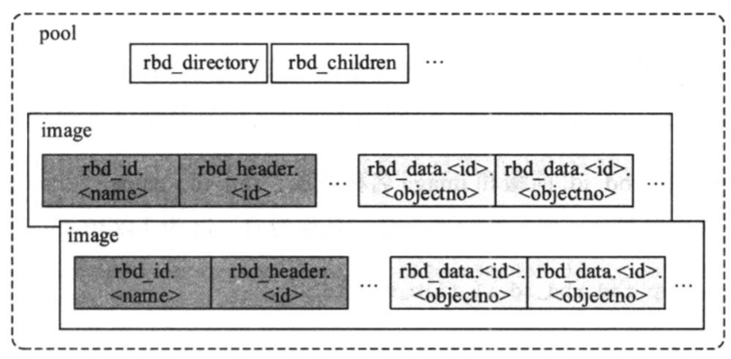

## Metadata

RBD默认将对象的数据和元数据存在在同一个Pool中。

对于元数据而言，RBD有三种不同的存储方式：
* 存储为对象数据 - 简称为data。
* 存储为对象扩展属性（xattr） - 简称为xattr。
* 存储为对象omap - 简称为omap。

|名称|类型|介绍|
|-|-|-|
|rbd_directory|omap|image name到object id的双向映射|
|rbd_info|data|-|
|rbd_id.<image name>|data|存储image name到image id的映射|
|rbd_header.<image id>|omap & xattr|存储 image 所支持的功能特性容量大小等基本信息和配置参数、自定义元数据、锁信息等|
|rbd_object_map.<id>|data|记录组成image所有数据对象的存在状态|

### RBD Directory

RBD 目录类似于DBMS的page directory，利用omap将`<image name> <-> <image id>`的双向map存储在对象中。

其中：
* `id_<image id>` - 存储`<image id> -> <image name>`映射。
* `name_<image name>` - 存储`<image name> -> <image id>`映射。

```log
$ rados listomapvals rbd_directory -p block_pool
id_2d174922f3a39
value (14 bytes) :
00000000  0a 00 00 00 74 65 73 74  5f 69 6d 61 67 65        |....test_image|
0000000e

name_test_image
value (17 bytes) :
00000000  0d 00 00 00 32 64 31 37  34 39 32 32 66 33 61 33  |....2d174922f3a3|
00000010  39                                                |9|
00000011
```

### RBD Id

RBD内部的数据元数据以id为基础，这样做的好处是可以image重命名不需要大量修改。

`rbd_id.<image name>`对象存储image的id。

```log
$ rados get rbd_id.test_image id.log -p block_pool
$ cat id.log
2d174922f3a39
```

### RBD Header

`rbd_header.<image id>`是image 最主要的元数据对象，除了记录容量大小等基本信息之外为单个image 配置的参数、用户自定义的元数据以及为了支持 image 互访问所记录的锁信息等也都记录在该对象中。

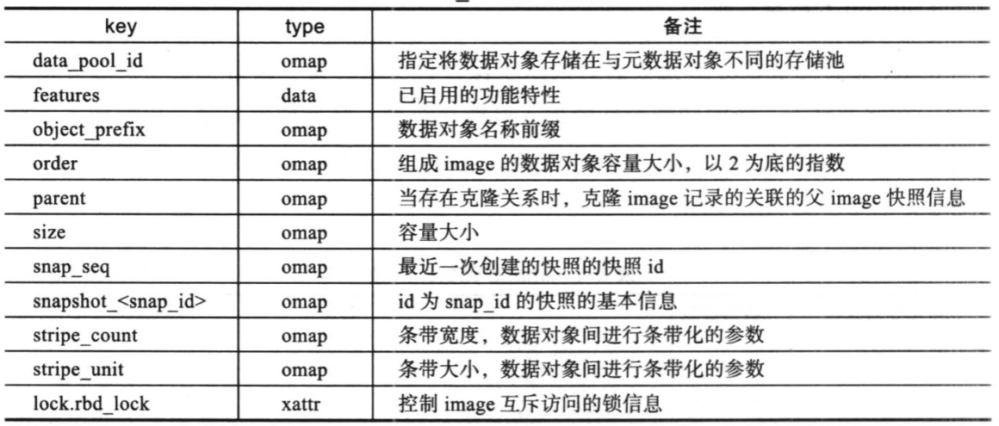

`data_pool_id` 所记录的元数据是一个64位的整型数据，用于记录数据对象所属的pool的id。

通常情况下image 的数据和元数据存储在同一个存储池下，此时 `rbd_header.<image name>` 对象中不存在 `data_pool_id` 元数据记录。由于当前 EC纠删码存储池不支持omap，为了解决RBD支持 EC纠删码存储的问题，必须将数据对象和元数据对象进行分离存储，因此需要一个独立的 `data_pool_id` 元数据用于记录数据对象所在的存储池。

如下所示image的数据存储使用的是id为1的存储池:

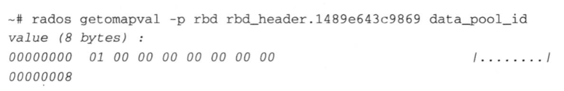

`features` 所记录的元数据是一个64位的整型数据，用于记录image 已启用的功能特性。每个特性占用整型中的一位。

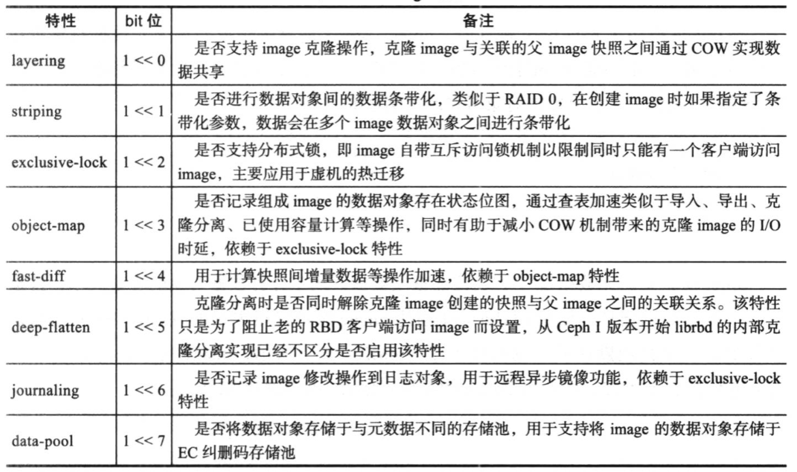

从Ceph Jewel版本开始，使用默认参数创建的image 默认开启 layering、exclusive-lock、object-map、fast-diff、deep-flatten 等五个特性，该默认值可通过 `rbd_default_features` 参数进行控制。

如下所示，image的特性为`0xbd`，对应的二进制表示为`b10111101`，表示该image启用了 data-pool、deep-flatten、fast-diff、object-map、exclusive-lock、layering 这6个特性：

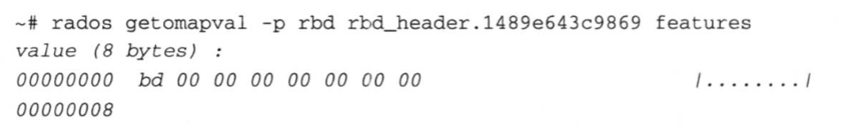

当image启用了 data-pool特性时，object_prefix 前缀的组成会加上元数据对象所在的存储池id：`rbd_data.<pool id>.<id>`。如下所示，image 的数据对象和元数据对象存储在不同的存储池中，且数据对象所在的存储池id为0:

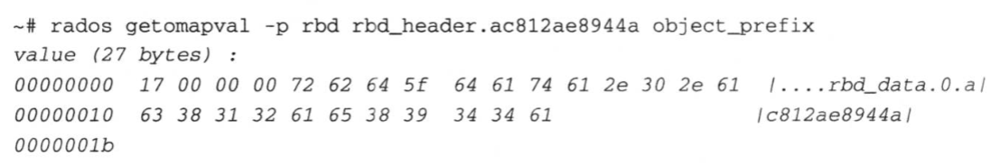

order 所记录的元数据是一个 8 位的整型数据，用于计算数据对象的容量大小，这是个以2为底的指数。使用librbd API创建image 时可以指定order 的值，order 的默认值为22，也就是说默认的数据对象大小为4MB。如下所示，image 的order 值为0x16.用十进制表示就是22，因此该image的数据对象大小使用的是默认值:

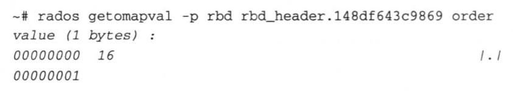

当使用rbd命令行创建image 时可以使用order 或object-size 指定数据对象的大小如果同时指定这两个参数，则order 具有更高优先级。如以下代码片段所示，obiect-size参数指定的数据对象大小会通过取对数然后四舍五人得到 order 值，最终的数据对象大小仍然由 `1 << order` 计算得到：

```cpp
order = std::round(std::log2(object_size));
```

parent所记录的元数据是一个 `cls_rbd_parent` 结构体的实例，只有从快照克隆出来的image 才有该元数据记录，用于记录克隆image 所关联的父image 的快照信息。一旦对克隆 image 进行克隆分离，由于解除了父子关系，该元数据记录会被清除。如下所示即是个克隆image 所关联的快照信息，该父image 快照所属的存储池id为0image id 为ac8c2ae8944a，快照id 为4:

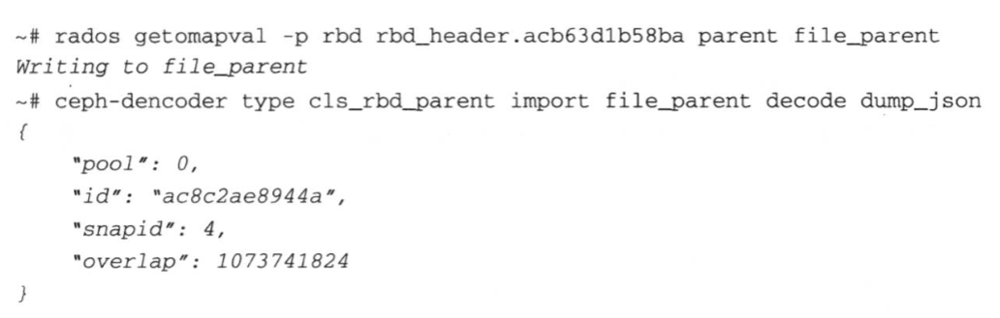

`cls_rbd_parent`中的`overlap` 字段表示克隆image 能够读取的父image 快照数据区间该值只能单调变小，初始值为克隆 image 的初始容量大小，也就是关联的父 image 快照的大小。对克隆image 执行 resize 操作，当容量缩小时，`overlap` 值会相应的调整为克隆image 调整后的容量大小，当容量扩大时 `overlap` 值维持不变。如下所示，对上面的1GB大小的克隆image 调整为512MB 之后`overlap` 相应的调整为536870912，即512MB:

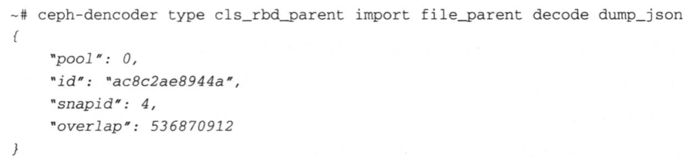

size所记录的元数据是一个64 位的整型数据，用于记录image 的容量大小。

```log
$ rados getomapval -p block_pool rbd_header.2d174922f3a39 size
value (8 bytes) :
00000000  00 00 00 40 00 00 00 00                           |...@....|
00000008
```

`snap_seq`所记录的元数据是一个64位的整型数据用于记录image最后一次创建的快照的快照id，没有创建任何快照的image 该字段为默认值0，该id 通过向 Monitor 注册得到，在单个Pool内单调递增。

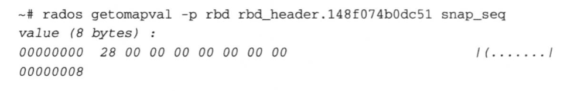

`snapshot_<snap_id>`所记录的元数据是一个`cls_rbd_snap` 结构体的实例，用于记录快照的名称、id 等基本信息，每创建一个快照都会增加一个这样的元数据记录。与imageid类似，快照id 也是内部维护的信息，用以支持快照重命名，例如前面 `cls_rbd_snap`结构体记录的快照信息就是通过快照 id 进行引用。如下所示 image 创建的快照1所对应的id为0x28，而image_size、 features、protection_status 三个字段主要用于克隆相关的操作:

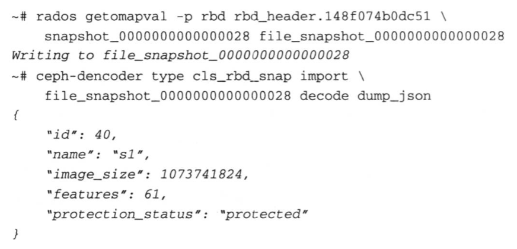

与普通的image不同，克隆image 在创建时不能指定容量大小，而是由image_size决定克隆image 的初始容量大小。features 是父image在建快照时的features 元数据记录，创建克隆image 时如果不显式指定需要启用的功能特性，则默认会使用features 所记录的值。protection_status 用于标识快照的被保护状态，处于被保护状态(protected)的快照不能删除，克隆 image 必须基于被保护的快照进行创建，这主要是为了防止克隆image所引用的父image快照被误删除。

stripe_count、stripe unit 所记录的元数据都是一个64位的整型数用于记录image的条带化信息。image 数据可以在多个数据对象间 (object set，数据对象集)进行条带化，对象集内的数据对象个数stripe_count 即为条带宽度stripe_unit为条带大小。创建image 时如果不指定条带参数，则默认 stripe_count为1，stripe_unit为order 元数据所定义的对象大小，也就是在数据对象之间不再进行条带化。如下所示 image 的条带大小为：128KB，条带宽度为8。

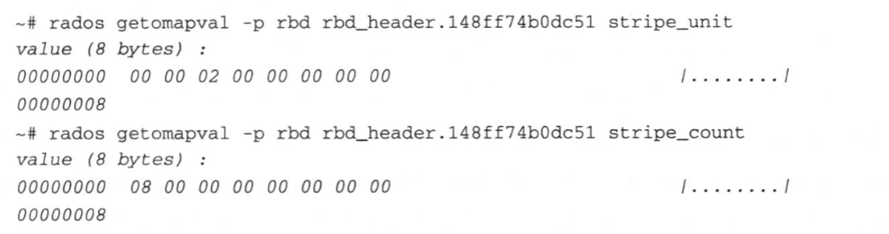

lock.rbd_lock 所记录的元数据是一个`lock_info_t`结构体的实例，用于记录锁类型上锁的客户端等信息，从而实现image 的分布式锁机制。如下所示的image 有一个拿到锁的客户端，客户端id为 client.84229，地址为192.168.133.31:0/4172127016：

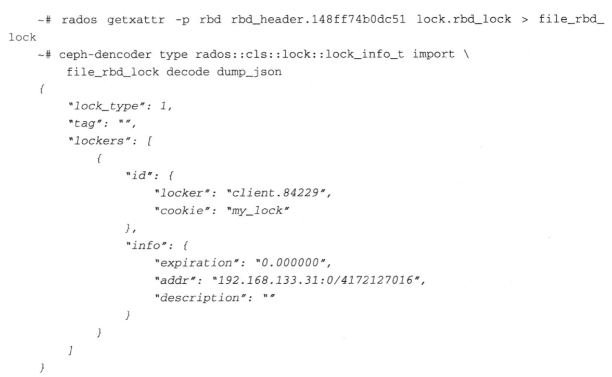

`lock_type` 有两种类型:`LOCK_EXCLUSIVE`、`LOCK_SHARED`，两者的区别是`LOCK_SHARED`允许多个客户端同时对image 上锁，而`LOCK_EXCLUSIVE`在同一时刻只允许个客户端对image上锁。

当前针对image的互斥访问有两种锁机制:advisory lock和exclusive lock，两者的内部实现原理一致，但是对image斥访问的控制有所不同，需要注意的是advisory lock和exclusive lock的内部实现使用的都是`LOCK_EXCLUSIVE`类型的锁。

advisory lock 对应 librbd API中的`rbd_lock_shared/rbd_lock_exclusive/rbd_unlock`，以及rbd命令行中的lock add/remove 命令，advisory lock 对image 的数据访问没有任何互斥保护，仅为协调多个客户端对同一个image 的互访问提供了一种辅助的手段。

exclusive lock 对应 librbd API中的`rbd_lock_acquire/rbd_lock_release`，exclusive lock可以为image的互斥访问提供完整的保护，在启用exclusive-lock 特性的情况下，如果不显式地调用`rbd_lock_acquire` 接口，RBD客户端内部会根据需要自动实现锁资源的争抢和释放，而lock.rbd_lock 中记录的当前拿到锁的客户端信息也会随着锁资源的转移而自动发生变化;而显式地调用`rbd_lock_acquire` 接口拿到锁的客户端必须显式地调用`rbd_lock_release` 接口释放锁，RBD客户端内部在接收到其他客户端的锁请求时不再自动释放锁资源。

### RBD Object Map

Ceph以一种节省空间的方式对image空间进行分配。新创建的image只存在少量元数据对象。当上层文件系统或者其他块设备应用对image写入时再创建相应的数据对象。

在支持 object-map 特性之前，组成image 的各数据对象的存在状态是未知的，针对克隆 image 数据对象的一个I/O 操作可能需要拆分成两个步骤:第一步，尝试直接访问克隆image自身的数据对象，如果返回 -ENOENT 错误，表明此次 I/O 操作所关联的克隆image的数据对象不存在;第二步，需要从关联的父 image 快照中读取相应的数据并做相应的处理，然后才能继续完成刚才的 I/O 操作。如果在I/0 操作前就知道数据对象不存在，则可以跳过第一步，即直接从关联的父 image 快照读取数据，这对于降低克隆image 的IO时延有很大的帮助。此外当需要做一些遍历 image 所有数据对象的操作时，即使组成image的真实存在的数据对象非常稀疏，执行类似于导入、导出、克隆分离、已使用容量计算等操作时仍然需要遍历整个 image 的所有数据对象，导致执行时间较长，用户体验并不友好。

Ceph Hammer 版本引入的 object-map 特性可以有效地缓解上述问题。其实现原理非常简单，核心思想就是将 image 中所有数据对象的存在状态记录在一个独立的元数据对象中，也即`rbd_object_map` 对象。每个数据对象的状态使用两个比特位进行表示，因此总共有四种状态:`b00` 对象不存在、`b01` 对象存在、`b10` 对象待删除、`b11` 对象存在且从上一次快照创建后没有对这个数据对象进行过写操作。

下面以一个1GB大小的image作为示例，分别演示`rbd_object_map` 对象在image初次创建、写入数据、创建快照、再次写入部分数据等四种情况下`rbd_object_map` 对象数据所记录的对象的存在状态的变化。为简单起见，image 的数据对象使用默认值4MB日未设置任何条带化参数。

如下所示为一个新创建的image，此时`rbd_object_map`对象记录的内容为0x00，所有比特位都为0说明此时没有创建任何数据对象:

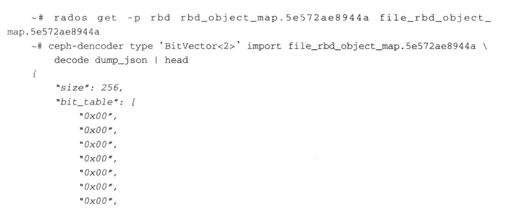

对image写人10MB数据，此时`rbd_object_map`对象记录的内容为0x54，二进制表示为`b01010100`，每两个比特位记录一个数据对象的存在状态，说明该image 当前存在三个数据对象:

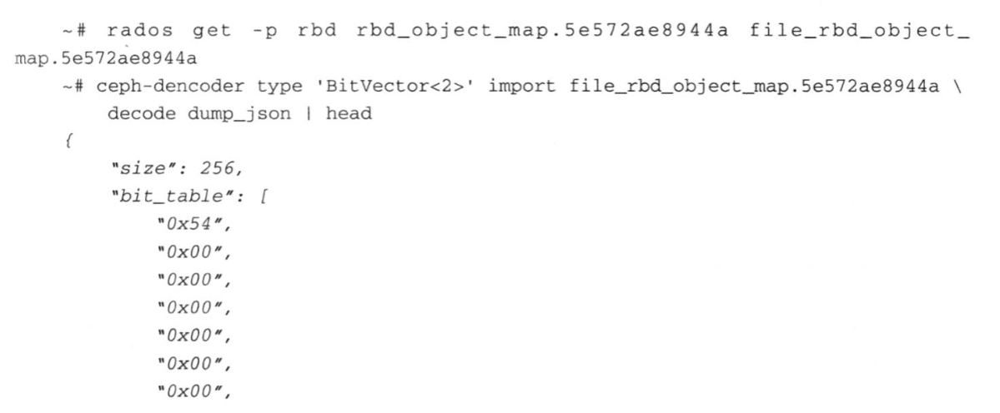

对image创建快照且不进行任何写操作，此时`rbd_object_map`对象记录的内容为0xFC，二进制表示为`b11111100`，因此说明该image 当前存在三个数据对象，且在创建快照后未对这些数据对象进行写操作:

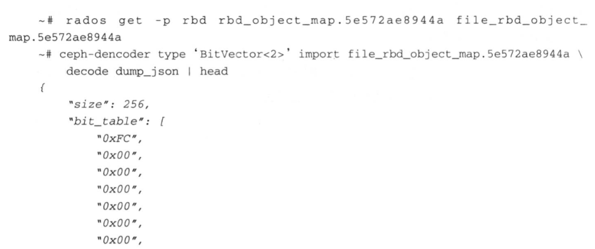

在image偏移为0的位置写入2MB数据，此时`rbd_object_map` 对象记录的内容为0x7C，二进制表示为`b01111100`，说明该image 当前存在三个数据对象，且在创建快照后对第一个数据对象进行过写操作:

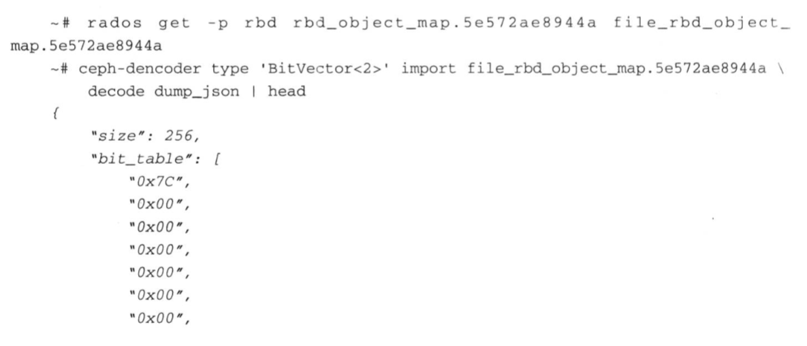

## Data Placement

RBD数据划分比较简单，划分为相同大小的对象即可。

对象名称由`rbd_header.<image id>`里记录的`object_prefix`决定，例如`rbd_data.2d174922f3a39.<object no>`，`object no`是一个64位整数，从0开始编号。

```log
$ rados ls -p block_pool | grep rbd_data.2d174922f3a39 | sort
rbd_data.2d174922f3a39.0000000000000000
rbd_data.2d174922f3a39.0000000000000004
rbd_data.2d174922f3a39.0000000000000005
rbd_data.2d174922f3a39.0000000000000006
rbd_data.2d174922f3a39.0000000000000007
rbd_data.2d174922f3a39.0000000000000008
rbd_data.2d174922f3a39.0000000000000009
rbd_data.2d174922f3a39.000000000000000a
rbd_data.2d174922f3a39.000000000000000b
rbd_data.2d174922f3a39.000000000000000c
rbd_data.2d174922f3a39.000000000000000d
...
```

没有被写入的空间不会存在对象，所使用的容量可能小于image大小，同时单个对象大小也可能小于`order`规定的对象大小（`1 << order`）。

以一个新创建的 image 为例，默认数据对象容量大小为4MB，所有的写操作限定在[0~4MB]范围，即第一个数据对象内。初始时写人4KB数据至[1KB1KB +4KB]区间，此时数据对象的实际大小为 1KB+4KB=5KB=5120B:

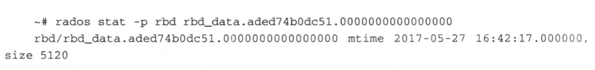

写4KB数据至[3072KB,3072KB +4KB]区间，数据对象实际大小将增大为max(5KB + 3072KB +4KB)=3076KB = 3149824B:

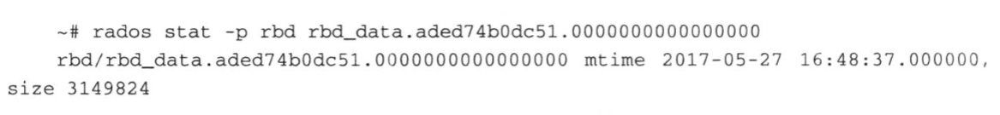

写4KB数据至[1024KB,1024KB + 4KB]区间，数据对象实际大小仍然保持不变max(3076KB,1024KB + 4KB)=3076KB=3149824B:

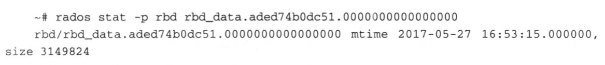

写4KB数据至数据对象的末尾，即[4092KB,4092KB +4KB]，此时数据对象实际大小将达到4MB 最大值 max(3076KB,4092KB +4KB)=4096KB=4194304B:

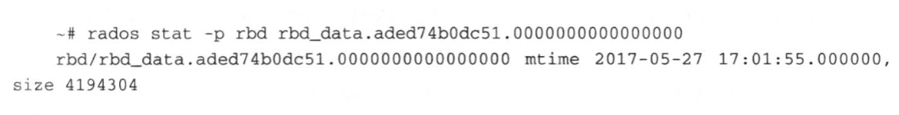

默认创建的image没有启用数据对象间的条带化特性，数据在image 数据对象内以非常朴素的形式(平铺)进行存储(striping v1)。但在建image 时可以通过指定非默认的条带化参数使得数据以类似RAIDO的方式在数据对象集内进行条带化(striping v2)。

## Snapshot

### RADOS Snapshot

RADOS 层支持对单个 RADOS 对象的快照操作，由于快照的存在，一个RADOS 对象由一个head 对象和可能的多个克隆(clone)对象组成。在OSD端使用SapSet 结构体来保存对象的快照信息，其中`clone_overlap` 字段记录 clone 对象与 head 对象的数据内容重叠的区间，该字段可用于对象数据恢复时减少 OSD之间的数据传输。

RADOS对象创建快照后的数据读取流程实际上非常简单，RADOS 客户端在读操作中需要携带需要读取的RADOS对象的snapid，通过snapid 定位到 clone对象或 head 对象即可读到相应的数据。因此下面以图示来描述对 RADOS 对象创建快照后的数据写流程。

假设初始时 head 对象是一个完整的使用默认4MB 大小的对象，且之前未有过COW操作。

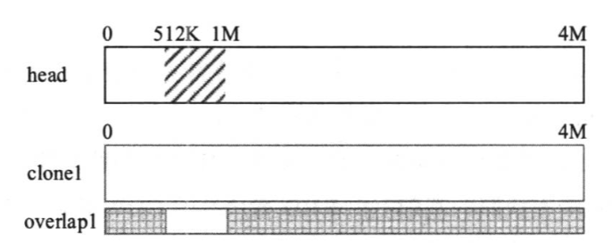

对该对象做快照生成`snap1`，然后写数据到[512K ~ 1M]区间，生成clone对象`clone1`（进行COW），`clone1`保存原来的数据（相当于一个元数据层面的rename），新数据写入到`head`。

写操作会同步更新这个`head` 对象上记录的 `clone_overlap[snap1]`。

对于一个新的快照对象一开始这个重叠区间是整个对象的[0 ~ 4M]，表示所有数据都在`clone1`中，然后每个新的写操作会在这个区间里减去新写的区间，比如刚才的写操作会减去区间[512K ~ 1M]，得到`clone_overlap[snapl]`的区间就是[0 ~ 512K,1M ~ 4M]。

如果继续写512KB的数据至区间[1.5M ~ 2M]，不需要再新建clone对象，只需要直接写入head对象，并更新`clone_overlap[snap1]`。

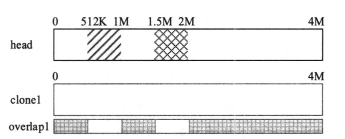

然后创建第二个快照 snap2，再新写人数据至区间[3M ~ 4M]，同样的，快照之后的第一次写入会进行 COW操作，拷贝生成一个 clone 对象 `clone2`。与前面写区间[512K ~ 1M]类似，新创建的快照对象所对应的重叠区间为整个对象大小[0 ~ 4M]，然后减去触发此次 COW 的写操作的区间，因此 `clone_overlap[snap2]`为[0 ~ 3M]。

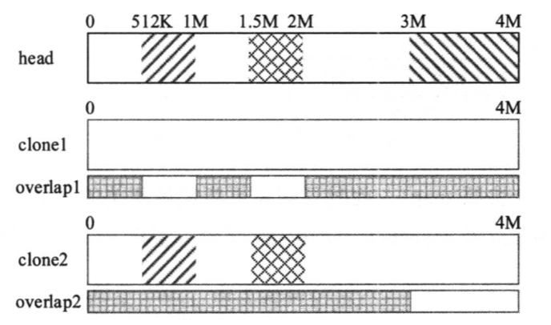

逐渐写入对象之后，重叠区间将变为空。

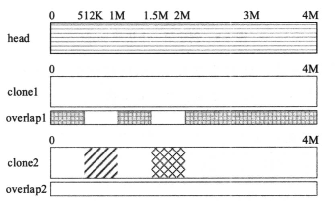

### RBD Snapshot

RBD快照由RADOS快照实现，只需保存足够的元数据信息。

image 的数据对象是写时创建的，假设初始时image 只写人了前8MB 的数据，因此只生成了两个数据对象(同样假设数据对象大小为4MB)。

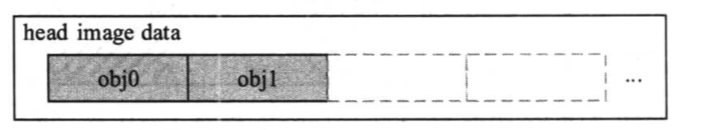

然后创建第一个快照snap1，此时只需要更新快照相关的元数据，即`rbd_header` 元数据对象中的`snap_seq`及`snapshot_<snap_id>`字段，组成image的数据对象不会有任何变化。

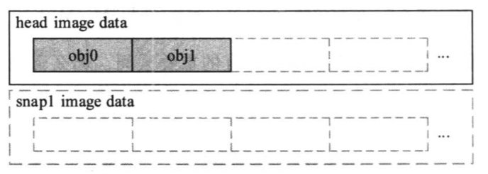

再对 obj0进行写操作，此时会触发 RADOS 快照的 COW机制，克隆生成`obj0-clone1`对象，然后将数据写入 head 对象。

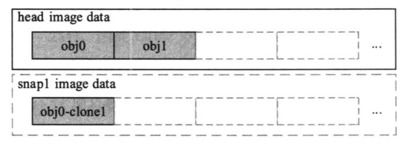

需要注意的是这个操作只在 RADOS 发生，对于RBD来说是无感的（RBD只会用适合的快照上下文去读取对象）。

## Clone

RBD 克隆是在 RBD快照的基础上实现的可写快照，从 image 派生出来的克隆image依赖image的快照。

与 RBD 快照功能类似，RBD克隆的实现使用的也是 COW 机制，但是与快照功能不同的是，COW 实现的层次并不相同。快照功能依赖于RADOS 层的对象快照实现，但是克隆功能完全在 RBD 客户端实现，RADOS层完全不感知image 之间的克隆关系。

创建克隆image 的过程基本上就是创建一个新image的过程，但是在image的元数据中会记录一个 parent 的键值对，也就是记录克隆image 与关联快照的父子关系，与创建新 image类似，由于只需要创建元数据对象，因此image 的克隆操作也非常快速。

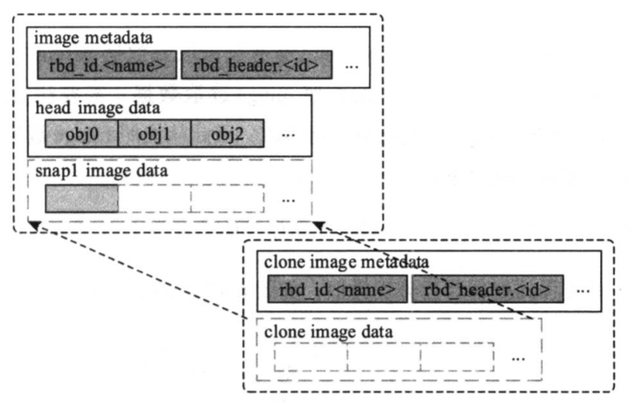

当RBD客户端打开克隆image 时，会读取到 parent 元数据，从而构建出image 之间的依赖关系，对克隆image 数据对象的访问，会先访问克隆 image 的数据对象，如果返回的结果显示数据对象不存在，即返回 -ENOENT，则会尝试访问依赖的关联快照的数据对象，由于克隆关系可能存在多层，因此该过程可能会一直回溯到最顶层的 parent。

这就是为什么需要依赖parent的快照功能来实现克隆，parent在child的视角里是不可变的。

而执行写操作时，只需要创建image的相应对象即可。

|Read|Write|
|-|-|
|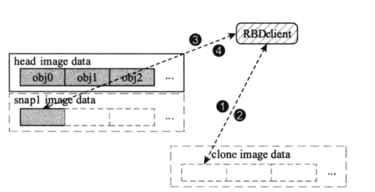|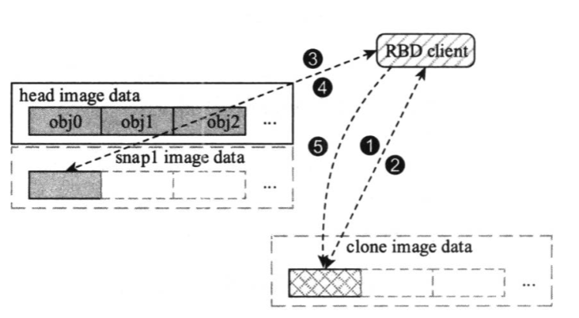|
