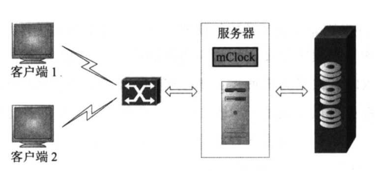
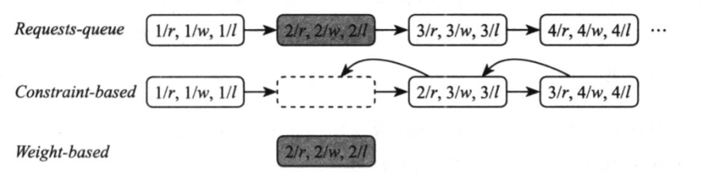

# mClock & dmClock

dmClock算法是一种 mClock 算法的分布式变种（推广）。

## mClock

mClock 是一种基于时间标签的I/0调度算法，最先被VMware提出来的用于集中式管理的存储系统。它使用了 reservation (预留，表示客户端获得的最低I/0资源)、weight(权重，表示客户端所占共享I/O 资源的比重，所谓共享I/O 资源是指满足预留之后剩余的系统I/0资源) 以及 limit(上限，表示客户端可获得的最高I0资源)作为一套模板(称为QoS spec)，作用于不同的客户端，再由服务器依据QoS 模板为每个客户端分配预期的IO资源。

mClock 包括 lient和server 两部分：
* client - 表示某个或某类客户端，可以驻留在实际的客户端或者服务器端，主要负责下发 QoS 模板参数值、收集请求的完成信息等。
* server - mClock 的服务端，是实现I/0调度功能的核心部分。

服务端分两个阶段来处理I/0请求：
* 一是基于强制的 Constraint-based 阶段，只处理满足预留时间（R < now）标签的请求。
* 二是基于权重的 Weight-based 阶段，处理满足上限时间(L >= now)标签的权重标签（按权重分配）请求。

为每个客户端设置一套 QoS 模板参数，包括预留 (r)权重 (w)和上限(I)个维度，服务端据此计算出I/O 请求预期被处理的时间标签，其中预留和上限标签为绝对时间，权重标签为相对时间。

服务端优先工作于 Constraint-based 阶段，处理完所有满足预留时间标签的请求后，再转入（可能不会转入，如果繁忙） Weight-based 阶段处理权重标签请求。请求在哪个阶段处理，由哪个条件优先满足而定。

客户端 $i$ 的第 $r$ 个标签的计算方式如下（其中 $t$ 是当前时间）：

$$
R_{i}^{r} = \max(R_{i}^{r - 1} + 1/r_{i},t)
$$

$$
L_{i}^{r} = \max(L_{i}^{r - 1} + 1/l_{i},t)
$$

$$
P_{i}^{r} = \max(P_{i}^{r - 1} + 1/p_{i},t)
$$

新活动虚拟机的初始 $P$ 标签值设置为当前时间，但之后的 $P$ 标签间隔由虚拟机的相对权重决定。

当一个请求在 Weight-based 阶段被处理，随后的请求的预留时间标签需要往前调整，减去一个步长 1/r 值，以填补在 Weight-based 阶段被处理掉的请求所带来的空缺。

## dmClock

dmClock是mClock算法的分布式版本，两者的基本原理相同。dmClock在分布式系统的每个服务器上运行一个mClock 服务端，在客户端记录并调整每个服务器的I/0请求负载。每个请求的时间标签计算公式如下：

$$
R_{i}^{r} = \max(R_{i}^{r - 1} + δ_{i}/r_{i},t)
$$

$$
L_{i}^{r} = \max(L_{i}^{r - 1} + ρ_{i}/l_{i},t)
$$

$$
P_{i}^{r} = \max(P_{i}^{r - 1} + ρ_{i}/p_{i},t)
$$

客户端记录每个服务器完成的请求个数，在向服务器下发请求时，携带距上次下发请求以来，收到完成的请求个数的增量值，并且是除目标服务器之外，其他服务器完成的请求数之和，分别用 $ρ$ 和 $δ$ 表示两个阶段的增量个数。

当某客户端的预留值设置为 100，之前 mClock一个服务器1秒内需处理的 100 个请求，交由 dmClock 多个服务器共同承担，每个服务器的处理能力可能不同，通过p和8 调整服务器处理请求的个数，达到整体对外提供每秒完成 100个 IO 请求的效果。

## Storage Level Optimal

## Request Queue Implmentation

