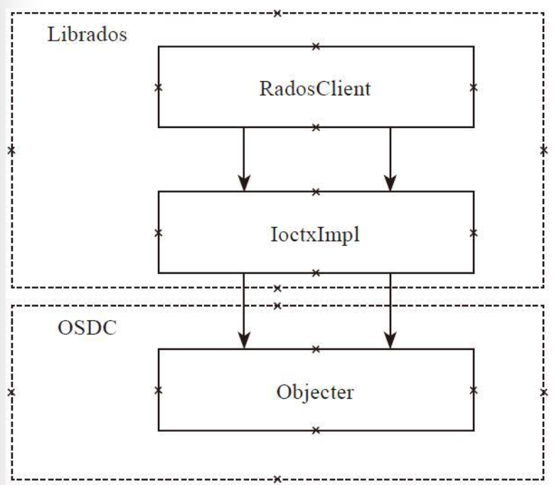

# Client

## Librados

librados是RADOS对象存储系统访问的接口库，它提供了pool的创建、删除、对象的创建、删除、读写等基本操作接口。



在最上层是类RadosClient，它是Librados的核心管理类，处理整个RADOS系统层面以及pool层面的管理。类IoctxImpl实现单个pool层的对象读写等操作。OSDC模块实现了请求的封装和通过网络模块发送请求的逻辑，其核心类Objecter完成对象的地址计算、消息的发送等工作。

```cpp
class librados::RadosClient : public Dispatcher,
			      public md_config_obs_t
{
  friend neorados::detail::RadosClient;
public:
  using Dispatcher::cct;
private:
  std::unique_ptr<CephContext,
		  std::function<void(CephContext*)>> cct_deleter;

public:
  // 配置文件
  const ConfigProxy& conf{cct->_conf};
  // IO相关的状态
  ceph::async::io_context_pool poolctx;
private:
  enum {
    DISCONNECTED,
    CONNECTING,
    CONNECTED,
  } state{DISCONNECTED}; // 连接状态

  // Monitor Client
  MonClient monclient{cct, poolctx};
  // Manager Client
  MgrClient mgrclient{cct, nullptr, &monclient.monmap};

  //
  Messenger *messenger{nullptr};

  uint64_t instance_id{0};

  bool _dispatch(Message *m);
  bool ms_dispatch(Message *m) override;

  void ms_handle_connect(Connection *con) override;
  bool ms_handle_reset(Connection *con) override;
  void ms_handle_remote_reset(Connection *con) override;
  bool ms_handle_refused(Connection *con) override;

  Objecter *objecter{nullptr};

  ceph::mutex lock = ceph::make_mutex("librados::RadosClient::lock");
  ceph::condition_variable cond;
  int refcnt{1};

  version_t log_last_version{0};
  rados_log_callback_t log_cb{nullptr};
  rados_log_callback2_t log_cb2{nullptr};
  void *log_cb_arg{nullptr};
  string log_watch;

  bool service_daemon = false;
  string daemon_name, service_name;
  map<string,string> daemon_metadata;
  ceph::timespan rados_mon_op_timeout{};
}
```

### Connect

connect函数是RadosClient的初始化函数，完成了许多的初始化工作。

```cpp
int librados::RadosClient::connect()
{
  int err;

  // 如果已经连接了，返回错误
  if (state == CONNECTING)
    return -EINPROGRESS;
  if (state == CONNECTED)
    return -EISCONN;
  // 设置状态到连接中
  state = CONNECTING;

  // 启动日志
  if (!cct->_log->is_started()) {
    cct->_log->start();
  }

  // 获取monmap和配置
  {
    MonClient mc_bootstrap(cct, poolctx);
    err = mc_bootstrap.get_monmap_and_config();
    if (err < 0)
      return err;
  }

  common_init_finish(cct);

  poolctx.start(cct->_conf.get_val<std::uint64_t>("librados_thread_count"));

  // get monmap
  err = monclient.build_initial_monmap();
  if (err < 0)
    goto out;

  err = -ENOMEM;
  messenger = Messenger::create_client_messenger(cct, "radosclient");
  if (!messenger)
    goto out;

  // require OSDREPLYMUX feature.  this means we will fail to talk to
  // old servers.  this is necessary because otherwise we won't know
  // how to decompose the reply data into its constituent pieces.
  messenger->set_default_policy(Messenger::Policy::lossy_client(CEPH_FEATURE_OSDREPLYMUX));

  ldout(cct, 1) << "starting msgr at " << messenger->get_myaddrs() << dendl;

  ldout(cct, 1) << "starting objecter" << dendl;

  // 初始化objecter
  objecter = new (std::nothrow) Objecter(cct, messenger, &monclient, poolctx);
  if (!objecter)
    goto out;
  objecter->set_balanced_budget();

  monclient.set_messenger(messenger);
  mgrclient.set_messenger(messenger);

  objecter->init();
  // 设置并启动messager
  messenger->add_dispatcher_head(&mgrclient);
  messenger->add_dispatcher_tail(objecter);
  messenger->add_dispatcher_tail(this);

  messenger->start();

  ldout(cct, 1) << "setting wanted keys" << dendl;
  monclient.set_want_keys(
      CEPH_ENTITY_TYPE_MON | CEPH_ENTITY_TYPE_OSD | CEPH_ENTITY_TYPE_MGR);
  ldout(cct, 1) << "calling monclient init" << dendl;
  err = monclient.init();
  if (err) {
    ldout(cct, 0) << conf->name << " initialization error " << cpp_strerror(-err) << dendl;
    shutdown();
    goto out;
  }

  err = monclient.authenticate(conf->client_mount_timeout);
  if (err) {
    ldout(cct, 0) << conf->name << " authentication error " << cpp_strerror(-err) << dendl;
    shutdown();
    goto out;
  }
  messenger->set_myname(entity_name_t::CLIENT(monclient.get_global_id()));

  // Detect older cluster, put mgrclient into compatible mode
  mgrclient.set_mgr_optional(
      !get_required_monitor_features().contains_all(
        ceph::features::mon::FEATURE_LUMINOUS));

  // MgrClient needs this (it doesn't have MonClient reference itself)
  monclient.sub_want("mgrmap", 0, 0);
  monclient.renew_subs();

  if (service_daemon) {
    ldout(cct, 10) << __func__ << " registering as " << service_name << "."
		   << daemon_name << dendl;
    mgrclient.service_daemon_register(service_name, daemon_name,
				      daemon_metadata);
  }
  mgrclient.init();

  objecter->set_client_incarnation(0);
  objecter->start();
  lock.lock();

  // 连接建立完成
  state = CONNECTED;
  instance_id = monclient.get_global_id();

  lock.unlock();

  ldout(cct, 1) << "init done" << dendl;
  err = 0;

 out:
  if (err) {
    state = DISCONNECTED;

    if (objecter) {
      delete objecter;
      objecter = NULL;
    }
    if (messenger) {
      delete messenger;
      messenger = NULL;
    }
  }

  return err;
}
```

### Aync Pool Creation

```cpp
int librados::RadosClient::pool_create_async(string& name,
					     PoolAsyncCompletionImpl *c,
					     int16_t crush_rule)
{
  int r = wait_for_osdmap();
  if (r < 0)
    return r;

  Context *onfinish = make_lambda_context(CB_PoolAsync_Safe(c));
  objecter->create_pool(name, onfinish, crush_rule);
  return r;
}
```

### Synchronous Pool Creation

在异步的基础上，使用条件变量等待。

```cpp
int librados::RadosClient::pool_create(string& name,
				       int16_t crush_rule)
{
  if (!name.length())
    return -EINVAL;

  // 等地osdmap就绪
  int r = wait_for_osdmap();
  if (r < 0) {
    return r;
  }

  ceph::mutex mylock = ceph::make_mutex("RadosClient::pool_create::mylock");
  int reply;
  ceph::condition_variable cond;
  bool done;
  Context *onfinish = new C_SafeCond(mylock, cond, &done, &reply);
  objecter->create_pool(name, onfinish, crush_rule);

  std::unique_lock l{mylock};
  cond.wait(l, [&done] { return done; });
  return reply;
}
```

### Lookup & List Pool

```cpp
int64_t librados::RadosClient::lookup_pool(const char *name)
{
  int r = wait_for_osdmap();
  if (r < 0) {
    return r;
  }

  int64_t ret = objecter->with_osdmap(std::mem_fn(&OSDMap::lookup_pg_pool_name),
                                 name);
  if (-ENOENT == ret) {
    // Make sure we have the latest map
    int r = wait_for_latest_osdmap();
    if (r < 0)
      return r;
    ret = objecter->with_osdmap(std::mem_fn(&OSDMap::lookup_pg_pool_name),
                                 name);
  }

  return ret;
}
```

```cpp
int librados::RadosClient::pool_list(std::list<std::pair<int64_t, string> >& v)
{
  int r = wait_for_osdmap();
  if (r < 0)
    return r;

  objecter->with_osdmap([&](const OSDMap& o) {
      for (auto p : o.get_pools())
	v.push_back(std::make_pair(p.first, o.get_pool_name(p.first)));
    });
  return 0;
}
```

### Get Status

```cpp
int librados::RadosClient::get_pool_stats(std::list<string>& pools,
					  map<string,::pool_stat_t> *result,
					  bool *pper_pool)
{
  bs::error_code ec;

  std::vector<std::string> v(pools.begin(), pools.end());

  auto [res, per_pool] = objecter->get_pool_stats(v, ca::use_blocked[ec]);
  if (ec)
    return ceph::from_error_code(ec);

  if (per_pool)
    *pper_pool = per_pool;
  if (result)
    result->insert(res.begin(), res.end());

  return 0;
}
```

```cpp
int librados::RadosClient::get_fs_stats(ceph_statfs& stats)
{
  ceph::mutex mylock = ceph::make_mutex("RadosClient::get_fs_stats::mylock");
  ceph::condition_variable cond;
  bool done;
  int ret = 0;
  {
    std::lock_guard l{mylock};
    objecter->get_fs_stats(stats, boost::optional<int64_t> (),
			   new C_SafeCond(mylock, cond, &done, &ret));
  }
  {
    std::unique_lock l{mylock};
    cond.wait(l, [&done] { return done;});
  }
  return ret;
}
```

### Command Handling

`mon_command`处理Monitor相关的命令，它调用函数`monclient.start_mon_command`把命令发送给Monitor处理。函数`osd_command`处理OSD相关的命令，它调用函数`objecter->osd_command`把命令发送给对应OSD处理。函数pg_command处理PG相关的命令，它调用函数`objecter->pg_command`把命令发送给该PG的主OSD来处理。

```cpp

```

### Create IoCtxImpl

`create_ioctx`创建一个pool相关的上下文信息`IoCtxImpl`对象。

```cpp

```

## IoCtxImpl

`IoCtxImpl`是pool相关的上下文信息，一个pool对应一个`IoCtxImpl`对象，可以在该pool里创建，删除对象，完成对象数据读写等各种操作，包括同步和异步的实现。

其处理过程都比较简单，而且过程类似：
* 把请求封装成`ObjectOperation`类（该类定义在`osdc/Objecter.h`中）。
* 然后再添加pool的地址信息，封装成`Objecter::Op`对象。
* 调用函数`objecter->op_submit`发送给相应的OSD，如果是同步操作，就等待操作完成。如果是异步操作，就不用等待，直接返回。当操作完成后，调用相应的回调函数通知。

## OSDC

### ObjectOperation

`ObjectOperation`用于操作相关的参数统一封装在该类里，该类可以一次封装多个对象的操作。

`OSDOp`封装对象的一个操作。结构体`ceph_osd_op`封装一个操作的操作码和相关的输入和输出参数。

