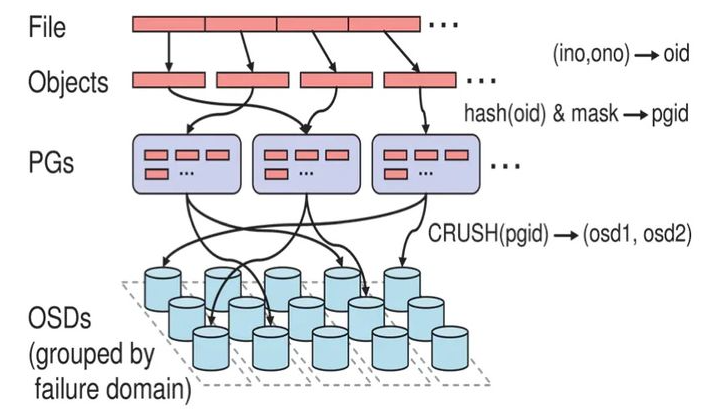

# Client



## Librados

librados是RADOS对象存储系统访问的接口库，它提供了pool的创建、删除、对象的创建、删除、读写等基本操作接口。


在最上层是类RadosClient，它是Librados的核心管理类，处理整个RADOS系统层面以及pool层面的管理。类IoctxImpl实现单个pool层的对象读写等操作。OSDC模块实现了请求的封装和通过网络模块发送请求的逻辑，其核心类Objecter完成对象的地址计算、消息的发送等工作。

```cpp
class librados::RadosClient : public Dispatcher,
			      public md_config_obs_t
{
  friend neorados::detail::RadosClient;
public:
  using Dispatcher::cct;
private:
  std::unique_ptr<CephContext,
		  std::function<void(CephContext*)>> cct_deleter;

public:
  // 配置文件
  const ConfigProxy& conf{cct->_conf};
  // IO相关的状态
  ceph::async::io_context_pool poolctx;
private:
  enum {
    DISCONNECTED,
    CONNECTING,
    CONNECTED,
  } state{DISCONNECTED}; // 连接状态

  // Monitor Client
  MonClient monclient{cct, poolctx};
  // Manager Client
  MgrClient mgrclient{cct, nullptr, &monclient.monmap};

  //
  Messenger *messenger{nullptr};

  uint64_t instance_id{0};

  bool _dispatch(Message *m);
  bool ms_dispatch(Message *m) override;

  void ms_handle_connect(Connection *con) override;
  bool ms_handle_reset(Connection *con) override;
  void ms_handle_remote_reset(Connection *con) override;
  bool ms_handle_refused(Connection *con) override;

  Objecter *objecter{nullptr};

  ceph::mutex lock = ceph::make_mutex("librados::RadosClient::lock");
  ceph::condition_variable cond;
  int refcnt{1};

  version_t log_last_version{0};
  rados_log_callback_t log_cb{nullptr};
  rados_log_callback2_t log_cb2{nullptr};
  void *log_cb_arg{nullptr};
  string log_watch;

  bool service_daemon = false;
  string daemon_name, service_name;
  map<string,string> daemon_metadata;
  ceph::timespan rados_mon_op_timeout{};
}
```

### Connect

connect函数是RadosClient的初始化函数，完成了许多的初始化工作。

```cpp
int librados::RadosClient::connect()
{
  int err;

  // 如果已经连接了，返回错误
  if (state == CONNECTING)
    return -EINPROGRESS;
  if (state == CONNECTED)
    return -EISCONN;
  // 设置状态到连接中
  state = CONNECTING;

  // 启动日志
  if (!cct->_log->is_started()) {
    cct->_log->start();
  }

  // 获取monmap和配置
  {
    MonClient mc_bootstrap(cct, poolctx);
    err = mc_bootstrap.get_monmap_and_config();
    if (err < 0)
      return err;
  }

  common_init_finish(cct);

  poolctx.start(cct->_conf.get_val<std::uint64_t>("librados_thread_count"));

  // get monmap
  err = monclient.build_initial_monmap();
  if (err < 0)
    goto out;

  err = -ENOMEM;
  messenger = Messenger::create_client_messenger(cct, "radosclient");
  if (!messenger)
    goto out;

  // require OSDREPLYMUX feature.  this means we will fail to talk to
  // old servers.  this is necessary because otherwise we won't know
  // how to decompose the reply data into its constituent pieces.
  messenger->set_default_policy(Messenger::Policy::lossy_client(CEPH_FEATURE_OSDREPLYMUX));

  ldout(cct, 1) << "starting msgr at " << messenger->get_myaddrs() << dendl;

  ldout(cct, 1) << "starting objecter" << dendl;

  // 初始化objecter
  objecter = new (std::nothrow) Objecter(cct, messenger, &monclient, poolctx);
  if (!objecter)
    goto out;
  objecter->set_balanced_budget();

  monclient.set_messenger(messenger);
  mgrclient.set_messenger(messenger);

  objecter->init();
  // 设置并启动messager
  messenger->add_dispatcher_head(&mgrclient);
  messenger->add_dispatcher_tail(objecter);
  messenger->add_dispatcher_tail(this);

  messenger->start();

  ldout(cct, 1) << "setting wanted keys" << dendl;
  monclient.set_want_keys(
      CEPH_ENTITY_TYPE_MON | CEPH_ENTITY_TYPE_OSD | CEPH_ENTITY_TYPE_MGR);
  ldout(cct, 1) << "calling monclient init" << dendl;
  err = monclient.init();
  if (err) {
    ldout(cct, 0) << conf->name << " initialization error " << cpp_strerror(-err) << dendl;
    shutdown();
    goto out;
  }

  err = monclient.authenticate(conf->client_mount_timeout);
  if (err) {
    ldout(cct, 0) << conf->name << " authentication error " << cpp_strerror(-err) << dendl;
    shutdown();
    goto out;
  }
  messenger->set_myname(entity_name_t::CLIENT(monclient.get_global_id()));

  // Detect older cluster, put mgrclient into compatible mode
  mgrclient.set_mgr_optional(
      !get_required_monitor_features().contains_all(
        ceph::features::mon::FEATURE_LUMINOUS));

  // MgrClient needs this (it doesn't have MonClient reference itself)
  monclient.sub_want("mgrmap", 0, 0);
  monclient.renew_subs();

  if (service_daemon) {
    ldout(cct, 10) << __func__ << " registering as " << service_name << "."
		   << daemon_name << dendl;
    mgrclient.service_daemon_register(service_name, daemon_name,
				      daemon_metadata);
  }
  mgrclient.init();

  objecter->set_client_incarnation(0);
  objecter->start();
  lock.lock();

  // 连接建立完成
  state = CONNECTED;
  instance_id = monclient.get_global_id();

  lock.unlock();

  ldout(cct, 1) << "init done" << dendl;
  err = 0;

 out:
  if (err) {
    state = DISCONNECTED;

    if (objecter) {
      delete objecter;
      objecter = NULL;
    }
    if (messenger) {
      delete messenger;
      messenger = NULL;
    }
  }

  return err;
}
```

### Aync Pool Creation

```cpp
int librados::RadosClient::pool_create_async(string& name,
					     PoolAsyncCompletionImpl *c,
					     int16_t crush_rule)
{
  int r = wait_for_osdmap();
  if (r < 0)
    return r;

  Context *onfinish = make_lambda_context(CB_PoolAsync_Safe(c));
  objecter->create_pool(name, onfinish, crush_rule);
  return r;
}
```

### Synchronous Pool Creation

在异步的基础上，使用条件变量等待。

```cpp
int librados::RadosClient::pool_create(string& name,
				       int16_t crush_rule)
{
  if (!name.length())
    return -EINVAL;

  // 等地osdmap就绪
  int r = wait_for_osdmap();
  if (r < 0) {
    return r;
  }

  ceph::mutex mylock = ceph::make_mutex("RadosClient::pool_create::mylock");
  int reply;
  ceph::condition_variable cond;
  bool done;
  Context *onfinish = new C_SafeCond(mylock, cond, &done, &reply);
  objecter->create_pool(name, onfinish, crush_rule);

  std::unique_lock l{mylock};
  cond.wait(l, [&done] { return done; });
  return reply;
}
```

### Lookup & List Pool

```cpp
int64_t librados::RadosClient::lookup_pool(const char *name)
{
  int r = wait_for_osdmap();
  if (r < 0) {
    return r;
  }

  int64_t ret = objecter->with_osdmap(std::mem_fn(&OSDMap::lookup_pg_pool_name),
                                 name);
  if (-ENOENT == ret) {
    // Make sure we have the latest map
    int r = wait_for_latest_osdmap();
    if (r < 0)
      return r;
    ret = objecter->with_osdmap(std::mem_fn(&OSDMap::lookup_pg_pool_name),
                                 name);
  }

  return ret;
}
```

```cpp
int librados::RadosClient::pool_list(std::list<std::pair<int64_t, string> >& v)
{
  int r = wait_for_osdmap();
  if (r < 0)
    return r;

  objecter->with_osdmap([&](const OSDMap& o) {
      for (auto p : o.get_pools())
	v.push_back(std::make_pair(p.first, o.get_pool_name(p.first)));
    });
  return 0;
}
```

### Get Status

```cpp
int librados::RadosClient::get_pool_stats(std::list<string>& pools,
					  map<string,::pool_stat_t> *result,
					  bool *pper_pool)
{
  bs::error_code ec;

  std::vector<std::string> v(pools.begin(), pools.end());

  auto [res, per_pool] = objecter->get_pool_stats(v, ca::use_blocked[ec]);
  if (ec)
    return ceph::from_error_code(ec);

  if (per_pool)
    *pper_pool = per_pool;
  if (result)
    result->insert(res.begin(), res.end());

  return 0;
}
```

```cpp
int librados::RadosClient::get_fs_stats(ceph_statfs& stats)
{
  ceph::mutex mylock = ceph::make_mutex("RadosClient::get_fs_stats::mylock");
  ceph::condition_variable cond;
  bool done;
  int ret = 0;
  {
    std::lock_guard l{mylock};
    objecter->get_fs_stats(stats, boost::optional<int64_t> (),
			   new C_SafeCond(mylock, cond, &done, &ret));
  }
  {
    std::unique_lock l{mylock};
    cond.wait(l, [&done] { return done;});
  }
  return ret;
}
```

### Command Handling

`mon_command`处理Monitor相关的命令，它调用函数`monclient.start_mon_command`把命令发送给Monitor处理。

```cpp
int librados::RadosClient::mon_command(const vector<string>& cmd,
				       const bufferlist &inbl,
				       bufferlist *outbl, string *outs)
{
  C_SaferCond ctx;
  mon_command_async(cmd, inbl, outbl, outs, &ctx);
  return ctx.wait();
}

void librados::RadosClient::mon_command_async(const vector<string>& cmd,
                                              const bufferlist &inbl,
                                              bufferlist *outbl, string *outs,
                                              Context *on_finish)
{
  std::lock_guard l{lock};
  monclient.start_mon_command(cmd, inbl,
			      [outs, outbl,
			       on_finish = std::unique_ptr<Context>(on_finish)]
			      (bs::error_code e,
			       std::string&& s,
			       ceph::bufferlist&& b) mutable {
				if (outs)
				  *outs = std::move(s);
				if (outbl)
				  *outbl = std::move(b);
				if (on_finish)
				  on_finish.release()->complete(
				    ceph::from_error_code(e));
			      });
}
```

函数`osd_command`处理OSD相关的命令，它调用函数`objecter->osd_command`把命令发送给对应OSD处理。

```cpp
int librados::RadosClient::osd_command(int osd, vector<string>& cmd,
				       const bufferlist& inbl,
				       bufferlist *poutbl, string *prs)
{
  ceph_tid_t tid;

  if (osd < 0)
    return -EINVAL;


  // XXX do anything with tid?
  bs::error_code ec;
  auto [s, bl] = objecter->osd_command(osd, std::move(cmd), cb::list(inbl),
				       &tid, ca::use_blocked[ec]);
  if (poutbl)
    *poutbl = std::move(bl);
  if (prs)
    *prs = std::move(s);
  return ceph::from_error_code(ec);
}
```

函数`pg_command`处理PG相关的命令，它调用函数`objecter->pg_command`把命令发送给该PG的主OSD来处理。

```cpp
int librados::RadosClient::pg_command(pg_t pgid, vector<string>& cmd,
				      const bufferlist& inbl,
				      bufferlist *poutbl, string *prs)
{
  ceph_tid_t tid;
  bs::error_code ec;
  auto [s, bl] = objecter->pg_command(pgid, std::move(cmd), inbl, &tid,
				      ca::use_blocked[ec]);
  if (poutbl)
    *poutbl = std::move(bl);
  if (prs)
    *prs = std::move(s);
  return ceph::from_error_code(ec);
}
```

### Create IoCtxImpl

`create_ioctx`创建一个pool相关的上下文信息`IoCtxImpl`对象。

```cpp
int librados::RadosClient::create_ioctx(const char *name, IoCtxImpl **io)
{
  int64_t poolid = lookup_pool(name);
  if (poolid < 0) {
    return (int)poolid;
  }

  *io = new librados::IoCtxImpl(this, objecter, poolid, CEPH_NOSNAP);
  return 0;
}

int librados::RadosClient::create_ioctx(int64_t pool_id, IoCtxImpl **io)
{
  std::string pool_name;
  int r = pool_get_name(pool_id, &pool_name, true);
  if (r < 0)
    return r;
  *io = new librados::IoCtxImpl(this, objecter, pool_id, CEPH_NOSNAP);
  return 0;
}
```

## IoCtxImpl

`IoCtxImpl`是pool相关的上下文信息，一个pool对应一个`IoCtxImpl`对象，可以在该pool里创建，删除对象，完成对象数据读写等各种操作，包括同步和异步的实现。

其处理过程都比较简单，而且过程类似：
* 把请求封装成`ObjectOperation`类（该类定义在`osdc/Objecter.h`中）。
* 然后再添加pool的地址信息，封装成`Objecter::Op`对象。
* 调用函数`objecter->op_submit`发送给相应的OSD，如果是同步操作，就等待操作完成。如果是异步操作，就不用等待，直接返回。当操作完成后，调用相应的回调函数通知。

## OSDC

### ObjectOperation

`ObjectOperation`用于操作相关的参数统一封装在该类里，该类可以一次封装多个对象的操作。

```cpp
struct ObjectOperation {
  osdc_opvec ops;     // 操作列表
  int flags = 0;      // 操作的flags
  int priority = 0;   // 优先级

  // 操作参数、回调handler、返回值、错误代码
  boost::container::small_vector<ceph::buffer::list*, osdc_opvec_len> out_bl;
  boost::container::small_vector<
    fu2::unique_function<void(boost::system::error_code, int,
			      const ceph::buffer::list& bl) &&>,
    osdc_opvec_len> out_handler;
  boost::container::small_vector<int*, osdc_opvec_len> out_rval;
  boost::container::small_vector<boost::system::error_code*,
				 osdc_opvec_len> out_ec;
};
```

### OSDOp

`OSDOp`封装对象的一个操作。结构体`ceph_osd_op`封装一个操作的操作码和相关的输入和输出参数。

```cpp
struct OSDOp {
  ceph_osd_op op; // 操作码，flags和参数（结构类似io_uring）
  sobject_t soid; // 目标对象id

  ceph::buffer::list indata, outdata; // 输入输出
  errorcode32_t rval = 0; // 错误码
};
```

### op_target

```cpp
struct op_target_t {
    int flags = 0; // flags

    epoch_t epoch = 0;  ///< latest epoch we calculated the mapping

    object_t base_oid;              // 目标对象id
    object_locator_t base_oloc;     // 目标对象位置
    object_t target_oid;            // 最终目标对象id
    object_locator_t target_oloc;   // 最终目标对象位置

    // 由于 Cache tier的存在，导致产生最终目标和pool的不同。

    ///< true if we are directed at base_pgid, not base_oid
    bool precalc_pgid = false;

    ///< true if we have ever mapped to a valid pool
    bool pool_ever_existed = false;

    ///< explcit pg target, if any
    pg_t base_pgid;

    pg_t pgid; ///< last (raw) pg we mapped to
    spg_t actual_pgid; ///< last (actual) spg_t we mapped to
    unsigned pg_num = 0; ///< last pg_num we mapped to
    unsigned pg_num_mask = 0; ///< last pg_num_mask we mapped to
    unsigned pg_num_pending = 0; ///< last pg_num we mapped to
    std::vector<int> up; ///< set of up osds for last pg we mapped to
    std::vector<int> acting; ///< set of acting osds for last pg we mapped to
    int up_primary = -1; ///< last up_primary we mapped to
    int acting_primary = -1;  ///< last acting_primary we mapped to
    int size = -1; ///< the size of the pool when were were last mapped
    int min_size = -1; ///< the min size of the pool when were were last mapped
    bool sort_bitwise = false; ///< whether the hobject_t sort order is bitwise
    bool recovery_deletes = false; ///< whether the deletes are performed during recovery instead of peering
    uint32_t peering_crush_bucket_count = 0;
    uint32_t peering_crush_bucket_target = 0;
    uint32_t peering_crush_bucket_barrier = 0;
    int32_t peering_crush_mandatory_member = CRUSH_ITEM_NONE;

    bool used_replica = false;
    bool paused = false;

    int osd = -1;      ///< the final target osd, or -1

    epoch_t last_force_resend = 0;
};
```

### Op

结构Op封装了完成一个操作的相关上下文信息，包括target地址信息、链接信息。

```cpp
  struct Op : public RefCountedObject {
    OSDSession *session = nullptr; // OSD session
    int incarnation = 0; // reference counter

    op_target_t target; // 目标对象

    ConnectionRef con = nullptr;  // for rx buffer only
    uint64_t features = CEPH_FEATURES_SUPPORTED_DEFAULT; // explicitly specified op features

    osdc_opvec ops; // 对应多个操作的封装

    snapid_t snapid = CEPH_NOSNAP; // 快照id
    SnapContext snapc; // 快照上下文
    ceph::real_time mtime;

    // 每个操作对应的buffer list
    ceph::buffer::list *outbl = nullptr;
    boost::container::small_vector<ceph::buffer::list*, osdc_opvec_len> out_bl;
    // 每个操作对应的回调handler
    boost::container::small_vector<
      fu2::unique_function<void(boost::system::error_code, int,
				const ceph::buffer::list& bl) &&>,
      osdc_opvec_len> out_handler;
    // 每个操作对应的返回值
    boost::container::small_vector<int*, osdc_opvec_len> out_rval;
    // 每个操作对应的错误码
    boost::container::small_vector<boost::system::error_code*,
				   osdc_opvec_len> out_ec;

    int priority = 0; // 优先级
    using OpSig = void(boost::system::error_code);
    using OpComp = ceph::async::Completion<OpSig>;
    // Due to an irregularity of cmpxattr, we actualy need the 'int'
    // value for onfinish for legacy librados users. As such just
    // preserve the Context* in this one case. That way we can have
    // our callers just pass in a unique_ptr<OpComp> and not deal with
    // our signature in Objecter being different than the exposed
    // signature in RADOS.
    //
    // Add a function for the linger case, where we want better
    // semantics than Context, but still need to be under the completion_lock.
    std::variant<std::unique_ptr<OpComp>, fu2::unique_function<OpSig>,
		 Context*> onfinish; // 所有操作的完成handler
    uint64_t ontimeout = 0; // timeout handler实际上是个指针

    ceph_tid_t tid = 0;
    int attempts = 0;

    version_t *objver;
    epoch_t *reply_epoch = nullptr;

    ceph::coarse_mono_time stamp;

    epoch_t map_dne_bound = 0;

    int budget = -1;

    /// true if we should resend this message on failure
    bool should_resend = true;

    /// true if the throttle budget is get/put on a series of OPs,
    /// instead of per OP basis, when this flag is set, the budget is
    /// acquired before sending the very first OP of the series and
    /// released upon receiving the last OP reply.
    bool ctx_budgeted = false;

    int *data_offset;

    osd_reqid_t reqid; // explicitly setting reqid
    ZTracer::Trace trace;
};
```

### Striper

object有分片（stripe）时，类Striper用于完成对象分片数据的计算。`ceph_file_layout`用来保存文件或者image的分片信息。

```cpp
/*
 * ceph_file_layout - describe data layout for a file/inode
 */
struct ceph_file_layout {
	/* file -> object mapping */
	__le32 fl_stripe_unit;     // stripe的单位，必须是page_size的倍数
	__le32 fl_stripe_count;    // stripe跨越的对象数
	__le32 fl_object_size;     // 对象的大小
	__le32 fl_cas_hash;        // hash 类型当前版本未使用。  0 = none; 1 = sha256

	/* pg -> disk layout */
	__le32 fl_object_stripe_unit;  // pg -> disk layout的映射 当前版本未使用

	/* object -> pg layout */
	__le32 fl_unused;       /* unused; used to be preferred primary for pg (-1 for none) */
	__le32 fl_pg_pool;      // pool 的id。
} __attribute__ ((packed));
```

`ObjectExtent`用来记录对象内的分片信息。

```cpp
class ObjectExtent {
  /**
   * ObjectExtents are used for specifying IO behavior against RADOS
   * objects when one is using the ObjectCacher.
   *
   * To use this in a real system, *every member* must be filled
   * out correctly. In particular, make sure to initialize the
   * oloc correctly, as its default values are deliberate poison
   * and will cause internal ObjectCacher asserts.
   *
   * Similarly, your buffer_extents vector *must* specify a total
   * size equal to your length. If the buffer_extents inadvertently
   * contain less space than the length member specifies, you
   * will get unintelligible asserts deep in the ObjectCacher.
   *
   * If you are trying to do testing and don't care about actual
   * RADOS function, the simplest thing to do is to initialize
   * the ObjectExtent (truncate_size can be 0), create a single entry
   * in buffer_extents matching the length, and set oloc.pool to 0.
   */
 public:
  object_t    oid;       // 对象id
  uint64_t    objectno;
  uint64_t    offset;    // 对象内的offset
  uint64_t    length;    // 长度
  uint64_t    truncate_size;	// 对象truncate的长度

  object_locator_t oloc;   // 对象位置（pool 等）

  // extent 映射信息：表示在offset处buffer的长度
  std::vector<std::pair<uint64_t,uint64_t> >  buffer_extents;  // off -> len.  extents in buffer being mapped (may be fragmented bc of striping!)

  ObjectExtent() : objectno(0), offset(0), length(0), truncate_size(0) {}
  ObjectExtent(object_t o, uint64_t ono, uint64_t off, uint64_t l, uint64_t ts) :
    oid(o), objectno(ono), offset(off), length(l), truncate_size(ts) { }
};
```

例如要计算的文件的offset为2KB，length为16KB。

*NOTE：每一格表示4K。*

文件的分片信息如下：


stripe为4KB，stripe_count为3，object_size为8KB。对象obj1对应的ObjectExtent为：

```cpp
object_extents[obj1] =
    {
      oid  = "obj1",
      objectno = 0,
      offset = 2k,
      length = 6k,
      buffer_extents = {[0,2k], [6k,4k]}
    }
```

oid就是映射对象的id，objectno为stirpe对象的序号，offset为映射的数据段在对象内的起始偏移，length为对象内的长度。buffer_extents为映射的数据在buffer内的偏移和长度。

也就是说对象的[2k,4k]对应buffer的[0,2k]的位置，而[4k,8k]对应buffer的[6k.10k]的位置。

*NOTE：在buffer上连续，在底层object上不一定连续。*

### ObjectCacher

ObjectCacher提供了客户端的基于LRU算法对象数据缓存功能。

## Client Read/Write Operation


`IoCtxImpl::write`和`IoCtxImpl::read`函数完成具体的写操作。

*NOTE： 对于append操作而言，需要先创建对象以进行write。*

```cpp
int librados::IoCtxImpl::write(const object_t& oid, bufferlist& bl,
			       size_t len, uint64_t off)
{
  if (len > UINT_MAX/2)
    return -E2BIG;
  ::ObjectOperation op;
  prepare_assert_ops(&op);
  bufferlist mybl;
  mybl.substr_of(bl, 0, len);
  op.write(off, mybl);
  return operate(oid, &op, NULL);
}
```

实际的操作由`operate`完成。

```cpp
int librados::IoCtxImpl::operate(const object_t& oid, ::ObjectOperation *o,
				 ceph::real_time *pmtime, int flags)
{
  ceph::real_time ut = (pmtime ? *pmtime :
    ceph::real_clock::now());

  // 快照不支持写入
  if (snap_seq != CEPH_NOSNAP)
    return -EROFS;

  // 操作大小为0，直接返回
  if (!o->size())
    return 0;

  ceph::mutex mylock = ceph::make_mutex("IoCtxImpl::operate::mylock");
  ceph::condition_variable cond;
  bool done;
  int r;
  version_t ver;

  Context *oncommit = new C_SafeCond(mylock, cond, &done, &r);

  int op = o->ops[0].op.op;
  ldout(client->cct, 10) << ceph_osd_op_name(op) << " oid=" << oid
			 << " nspace=" << oloc.nspace << dendl;
  Objecter::Op *objecter_op = objecter->prepare_mutate_op(
    oid, oloc,
    *o, snapc, ut,
    flags | extra_op_flags,
    oncommit, &ver);
  // 提交操作
  objecter->op_submit(objecter_op);

  {
    std::unique_lock l{mylock};
    cond.wait(l, [&done] { return done;});
  }
  ldout(client->cct, 10) << "Objecter returned from "
	<< ceph_osd_op_name(op) << " r=" << r << dendl;

  set_sync_op_version(ver);

  return r;
}
```

### op_submit

`op_submit`用来把封装好的操作Op通过网络发送出去。

如果`osd_timeout`大于0，设置定时器，当操作超时，就调用定时器回调函数`op_cancel`取消操作。

```cpp
void Objecter::op_submit(Op *op, ceph_tid_t *ptid, int *ctx_budget)
{
  shunique_lock rl(rwlock, ceph::acquire_shared);
  ceph_tid_t tid = 0;
  if (!ptid)
    ptid = &tid;
  op->trace.event("op submit");
  _op_submit_with_budget(op, rl, ptid, ctx_budget);
}
```

`_op_submit_with_budget`用来处理Throttle相关的流量限制。

```cpp
void Objecter::_op_submit_with_budget(Op *op,
				      shunique_lock<ceph::shared_mutex>& sul,
				      ceph_tid_t *ptid,
				      int *ctx_budget)
{
  ceph_assert(initialized);

  ceph_assert(op->ops.size() == op->out_bl.size());
  ceph_assert(op->ops.size() == op->out_rval.size());
  ceph_assert(op->ops.size() == op->out_handler.size());

  // throttle.  before we look at any state, because
  // _take_op_budget() may drop our lock while it blocks.
  if (!op->ctx_budgeted || (ctx_budget && (*ctx_budget == -1))) {
    int op_budget = _take_op_budget(op, sul);
    // take and pass out the budget for the first OP
    // in the context session
    if (ctx_budget && (*ctx_budget == -1)) {
      *ctx_budget = op_budget;
    }
  }

  if (osd_timeout > timespan(0)) {
    if (op->tid == 0)
      op->tid = ++last_tid;
    auto tid = op->tid;
    op->ontimeout = timer.add_event(osd_timeout,
				    [this, tid]() {
				      op_cancel(tid, -ETIMEDOUT); });
  }

  _op_submit(op, sul, ptid);
}
```

`_op_submit`完成了关键的地址寻址和发送工作。

处理过程如下：
* 调用`_calc_target`来计算对象的目标OSD。
* 调用`_get_session`获取目标OSD的链接，如果返回值为`-EAGAIN`，就升级为写锁，重新获取。
* 检查当前的状态，如果目标OSD被pause或者OSD空间满，就暂时不发送请求，否则调用函数`_prepare_osd_op`准备请求的消息，调用函数`_send_op`发送出去。

```cpp
void Objecter::_op_submit(Op *op, shunique_lock<ceph::shared_mutex>& sul, ceph_tid_t *ptid)
{
  // rwlock is locked

  ldout(cct, 10) << __func__ << " op " << op << dendl;

  // pick target
  ceph_assert(op->session == NULL);
  OSDSession *s = NULL;

  bool check_for_latest_map = _calc_target(&op->target, nullptr)
    == RECALC_OP_TARGET_POOL_DNE;

  // Try to get a session, including a retry if we need to take write lock
  int r = _get_session(op->target.osd, &s, sul);
  if (r == -EAGAIN ||
      (check_for_latest_map && sul.owns_lock_shared()) ||
      cct->_conf->objecter_debug_inject_relock_delay) {
      epoch_t orig_epoch = osdmap->get_epoch();
      sul.unlock();
      if (cct->_conf->objecter_debug_inject_relock_delay) {
        sleep(1);
      }
      sul.lock();
      if (orig_epoch != osdmap->get_epoch()) {
        // map changed; recalculate mapping
        ldout(cct, 10) << __func__ << " relock raced with osdmap, recalc target"
  		     << dendl;
        check_for_latest_map = _calc_target(&op->target, nullptr) == RECALC_OP_TARGET_POOL_DNE;
        if (s) {
        	put_session(s);
        	s = NULL;
        	r = -EAGAIN;
        }
      }
  }
  if (r == -EAGAIN) {
    ceph_assert(s == NULL);
    r = _get_session(op->target.osd, &s, sul);
  }
  ceph_assert(r == 0);
  ceph_assert(s);  // may be homeless

  _send_op_account(op);

  // send?

  ceph_assert(op->target.flags & (CEPH_OSD_FLAG_READ|CEPH_OSD_FLAG_WRITE));

  bool need_send = false;
  if (op->target.paused) {
    ldout(cct, 10) << " tid " << op->tid << " op " << op << " is paused"
		   << dendl;
    _maybe_request_map();
  } else if (!s->is_homeless()) {
    need_send = true;
  } else {
    _maybe_request_map();
  }

  unique_lock sl(s->lock);
  if (op->tid == 0)
    op->tid = ++last_tid;

  ldout(cct, 10) << "_op_submit oid " << op->target.base_oid
		 << " '" << op->target.base_oloc << "' '"
		 << op->target.target_oloc << "' " << op->ops << " tid "
		 << op->tid << " osd." << (!s->is_homeless() ? s->osd : -1)
		 << dendl;

  _session_op_assign(s, op);

  if (need_send) {
    _send_op(op);
  }

  // Last chance to touch Op here, after giving up session lock it can
  // be freed at any time by response handler.
  ceph_tid_t tid = op->tid;
  if (check_for_latest_map) {
    _send_op_map_check(op);
  }
  if (ptid)
    *ptid = tid;
  op = NULL;

  sl.unlock();
  put_session(s);

  ldout(cct, 5) << num_in_flight << " in flight" << dendl;
}
```

```cpp
void Objecter::_send_op(Op *op)
{
  // rwlock is locked
  // op->session->lock is locked

  // backoff?
  auto p = op->session->backoffs.find(op->target.actual_pgid);
  if (p != op->session->backoffs.end()) {
    hobject_t hoid = op->target.get_hobj();
    auto q = p->second.lower_bound(hoid);
    if (q != p->second.begin()) {
      --q;
      if (hoid >= q->second.end) {
	++q;
      }
    }
    if (q != p->second.end()) {
      ldout(cct, 20) << __func__ << " ? " << q->first << " [" << q->second.begin
		     << "," << q->second.end << ")" << dendl;
      int r = cmp(hoid, q->second.begin);
      if (r == 0 || (r > 0 && hoid < q->second.end)) {
	ldout(cct, 10) << __func__ << " backoff " << op->target.actual_pgid
		       << " id " << q->second.id << " on " << hoid
		       << ", queuing " << op << " tid " << op->tid << dendl;
	return;
      }
    }
  }

  ceph_assert(op->tid > 0);
  MOSDOp *m = _prepare_osd_op(op);

  if (op->target.actual_pgid != m->get_spg()) {
    ldout(cct, 10) << __func__ << " " << op->tid << " pgid change from "
		   << m->get_spg() << " to " << op->target.actual_pgid
		   << ", updating and reencoding" << dendl;
    m->set_spg(op->target.actual_pgid);
    m->clear_payload();  // reencode
  }

  ldout(cct, 15) << "_send_op " << op->tid << " to "
		 << op->target.actual_pgid << " on osd." << op->session->osd
		 << dendl;

  ConnectionRef con = op->session->con;
  ceph_assert(con);

  op->incarnation = op->session->incarnation;

  if (op->trace.valid()) {
    m->trace.init("op msg", nullptr, &op->trace);
  }
  op->session->con->send_message(m);
}
```

### _calc_target

`_calc_target`用于完成对象到osd的寻址过程。

处理过程如下：
* 根据`t->base_oloc.pool`的pool信息，获取`pg_pool_t`对象。
* 如果强制重发，`force_resend`设置为true。
* 检查cache tier，如果是读操作，并且有读缓存，就设置`target_oloc.pool`为该pool的`read_tier`值；如果是写操作，并且有写缓存，就设置`target_oloc.pool`为该pool的`write_tier`值。
* 调用`osdmap->object_locator_to_pg`获取目标对象所在的PG。
* 调用`osdmap->pg_to_up_acting_osds`，通过CRUSH，获取该PG对应的OSD列表。
* 根据操作类型做不同的处理：
  * 如果是写操作，`target`的OSD就设置为主OSD；
  * 如果是读操作：
    * 如果设置了`CEPH_OSD_FLAG_BALANCE_READS`标志，就随机选择一个副本读取。
    * 如果设置了`CEPH_OSD_FLAG_LOCALIZE_READS`标志，就尽可能选择本地副本读取。

```cpp
int Objecter::_calc_target(op_target_t *t, Connection *con, bool any_change)
{
  // rwlock is locked
  bool is_read = t->flags & CEPH_OSD_FLAG_READ;
  bool is_write = t->flags & CEPH_OSD_FLAG_WRITE;
  t->epoch = osdmap->get_epoch();
  ldout(cct,20) << __func__ << " epoch " << t->epoch
		<< " base " << t->base_oid << " " << t->base_oloc
		<< " precalc_pgid " << (int)t->precalc_pgid
		<< " pgid " << t->base_pgid
		<< (is_read ? " is_read" : "")
		<< (is_write ? " is_write" : "")
		<< dendl;

  const pg_pool_t *pi = osdmap->get_pg_pool(t->base_oloc.pool);
  if (!pi) {
    t->osd = -1;
    return RECALC_OP_TARGET_POOL_DNE;
  }
  ldout(cct,30) << __func__ << "  base pi " << pi
		<< " pg_num " << pi->get_pg_num() << dendl;

  bool force_resend = false;
  if (osdmap->get_epoch() == pi->last_force_op_resend) {
    if (t->last_force_resend < pi->last_force_op_resend) {
      t->last_force_resend = pi->last_force_op_resend;
      force_resend = true;
    } else if (t->last_force_resend == 0) {
      force_resend = true;
    }
  }

  // apply tiering
  t->target_oid = t->base_oid;
  t->target_oloc = t->base_oloc;
  if ((t->flags & CEPH_OSD_FLAG_IGNORE_OVERLAY) == 0) {
    if (is_read && pi->has_read_tier())
      t->target_oloc.pool = pi->read_tier;
    if (is_write && pi->has_write_tier())
      t->target_oloc.pool = pi->write_tier;
    pi = osdmap->get_pg_pool(t->target_oloc.pool);
    if (!pi) {
      t->osd = -1;
      return RECALC_OP_TARGET_POOL_DNE;
    }
  }

  pg_t pgid;
  if (t->precalc_pgid) {
    ceph_assert(t->flags & CEPH_OSD_FLAG_IGNORE_OVERLAY);
    ceph_assert(t->base_oid.name.empty()); // make sure this is a pg op
    ceph_assert(t->base_oloc.pool == (int64_t)t->base_pgid.pool());
    pgid = t->base_pgid;
  } else {
    int ret = osdmap->object_locator_to_pg(t->target_oid, t->target_oloc,
					   pgid);
    if (ret == -ENOENT) {
      t->osd = -1;
      return RECALC_OP_TARGET_POOL_DNE;
    }
  }
  ldout(cct,20) << __func__ << " target " << t->target_oid << " "
		<< t->target_oloc << " -> pgid " << pgid << dendl;
  ldout(cct,30) << __func__ << "  target pi " << pi
		<< " pg_num " << pi->get_pg_num() << dendl;
  t->pool_ever_existed = true;

  int size = pi->size;
  int min_size = pi->min_size;
  unsigned pg_num = pi->get_pg_num();
  unsigned pg_num_mask = pi->get_pg_num_mask();
  unsigned pg_num_pending = pi->get_pg_num_pending();
  int up_primary, acting_primary;
  vector<int> up, acting;
  ps_t actual_ps = ceph_stable_mod(pgid.ps(), pg_num, pg_num_mask);
  pg_t actual_pgid(actual_ps, pgid.pool());
  pg_mapping_t pg_mapping;
  pg_mapping.epoch = osdmap->get_epoch();
  if (lookup_pg_mapping(actual_pgid, &pg_mapping)) {
    up = pg_mapping.up;
    up_primary = pg_mapping.up_primary;
    acting = pg_mapping.acting;
    acting_primary = pg_mapping.acting_primary;
  } else {
    osdmap->pg_to_up_acting_osds(actual_pgid, &up, &up_primary,
                                 &acting, &acting_primary);
    pg_mapping_t pg_mapping(osdmap->get_epoch(),
                            up, up_primary, acting, acting_primary);
    update_pg_mapping(actual_pgid, std::move(pg_mapping));
  }
  bool sort_bitwise = osdmap->test_flag(CEPH_OSDMAP_SORTBITWISE);
  bool recovery_deletes = osdmap->test_flag(CEPH_OSDMAP_RECOVERY_DELETES);
  unsigned prev_seed = ceph_stable_mod(pgid.ps(), t->pg_num, t->pg_num_mask);
  pg_t prev_pgid(prev_seed, pgid.pool());
  if (any_change && PastIntervals::is_new_interval(
	t->acting_primary,
	acting_primary,
	t->acting,
	acting,
	t->up_primary,
	up_primary,
	t->up,
	up,
	t->size,
	size,
	t->min_size,
	min_size,
	t->pg_num,
	pg_num,
	t->pg_num_pending,
	pg_num_pending,
	t->sort_bitwise,
	sort_bitwise,
	t->recovery_deletes,
	recovery_deletes,
	t->peering_crush_bucket_count,
	pi->peering_crush_bucket_count,
	t->peering_crush_bucket_target,
	pi->peering_crush_bucket_target,
	t->peering_crush_bucket_barrier,
	pi->peering_crush_bucket_barrier,
	t->peering_crush_mandatory_member,
	pi->peering_crush_mandatory_member,
	prev_pgid)) {
    force_resend = true;
  }

  bool unpaused = false;
  bool should_be_paused = target_should_be_paused(t);
  if (t->paused && !should_be_paused) {
    unpaused = true;
  }
  if (t->paused != should_be_paused) {
    ldout(cct, 10) << __func__ << " paused " << t->paused
		   << " -> " << should_be_paused << dendl;
    t->paused = should_be_paused;
  }

  bool legacy_change =
    t->pgid != pgid ||
      is_pg_changed(
	t->acting_primary, t->acting, acting_primary, acting,
	t->used_replica || any_change);
  bool split_or_merge = false;
  if (t->pg_num) {
    split_or_merge =
      prev_pgid.is_split(t->pg_num, pg_num, nullptr) ||
      prev_pgid.is_merge_source(t->pg_num, pg_num, nullptr) ||
      prev_pgid.is_merge_target(t->pg_num, pg_num);
  }

  if (legacy_change || split_or_merge || force_resend) {
    t->pgid = pgid;
    t->acting = acting;
    t->acting_primary = acting_primary;
    t->up_primary = up_primary;
    t->up = up;
    t->size = size;
    t->min_size = min_size;
    t->pg_num = pg_num;
    t->pg_num_mask = pg_num_mask;
    t->pg_num_pending = pg_num_pending;
    spg_t spgid(actual_pgid);
    if (pi->is_erasure()) {
      for (uint8_t i = 0; i < acting.size(); ++i) {
        if (acting[i] == acting_primary) {
          spgid.reset_shard(shard_id_t(i));
          break;
        }
      }
    }
    t->actual_pgid = spgid;
    t->sort_bitwise = sort_bitwise;
    t->recovery_deletes = recovery_deletes;
    t->peering_crush_bucket_count = pi->peering_crush_bucket_count;
    t->peering_crush_bucket_target = pi->peering_crush_bucket_target;
    t->peering_crush_bucket_barrier = pi->peering_crush_bucket_barrier;
    t->peering_crush_mandatory_member = pi->peering_crush_mandatory_member;
    ldout(cct, 10) << __func__ << " "
		   << " raw pgid " << pgid << " -> actual " << t->actual_pgid
		   << " acting " << acting
		   << " primary " << acting_primary << dendl;
    t->used_replica = false;
    if ((t->flags & (CEPH_OSD_FLAG_BALANCE_READS |
                     CEPH_OSD_FLAG_LOCALIZE_READS)) &&
        !is_write && pi->is_replicated() && acting.size() > 1) {
      int osd;
      ceph_assert(is_read && acting[0] == acting_primary);
      if (t->flags & CEPH_OSD_FLAG_BALANCE_READS) {
	int p = rand() % acting.size();
	if (p)
	  t->used_replica = true;
	osd = acting[p];
	ldout(cct, 10) << " chose random osd." << osd << " of " << acting
		       << dendl;
      } else {
	// look for a local replica.  prefer the primary if the
	// distance is the same.
	int best = -1;
	int best_locality = 0;
	for (unsigned i = 0; i < acting.size(); ++i) {
	  int locality = osdmap->crush->get_common_ancestor_distance(
		 cct, acting[i], crush_location);
	  ldout(cct, 20) << __func__ << " localize: rank " << i
			 << " osd." << acting[i]
			 << " locality " << locality << dendl;
	  if (i == 0 ||
	      (locality >= 0 && best_locality >= 0 &&
	       locality < best_locality) ||
	      (best_locality < 0 && locality >= 0)) {
	    best = i;
	    best_locality = locality;
	    if (i)
	      t->used_replica = true;
	  }
	}
	ceph_assert(best >= 0);
	osd = acting[best];
      }
      t->osd = osd;
    } else {
      t->osd = acting_primary;
    }
  }
  if (legacy_change || unpaused || force_resend) {
    return RECALC_OP_TARGET_NEED_RESEND;
  }
  if (split_or_merge &&
      (osdmap->require_osd_release >= ceph_release_t::luminous ||
       HAVE_FEATURE(osdmap->get_xinfo(acting_primary).features,
		    RESEND_ON_SPLIT))) {
    return RECALC_OP_TARGET_NEED_RESEND;
  }
  return RECALC_OP_TARGET_NO_ACTION;
}
```

### Object Id Generation

对于文件来说，可以由inode确定唯一一个文件，文件对应的object id也根据此生成。

```cpp
object_t format_oid(const char* object_format, uint64_t object_no) {
  char buf[strlen(object_format) + 32];
  snprintf(buf, sizeof(buf), object_format, (long long unsigned)object_no);
  return object_t(buf);
}
```

```cpp
  static void file_to_extents(CephContext *cct, inodeno_t ino,
		const file_layout_t *layout,
		uint64_t offset, uint64_t len,
		uint64_t trunc_size,
		std::vector<ObjectExtent>& extents) {
    // generate prefix/format
    char buf[32];
    snprintf(buf, sizeof(buf), "%llx.%%08llx", (long long unsigned)ino);

    file_to_extents(cct, buf, layout, offset, len, trunc_size, extents);
  }
```

```cpp
void Striper::file_to_extents(CephContext *cct, const char *object_format,
			      const file_layout_t *layout,
			      uint64_t offset, uint64_t len,
			      uint64_t trunc_size,
			      std::vector<ObjectExtent>& extents,
			      uint64_t buffer_offset)
{
  striper::LightweightObjectExtents lightweight_object_extents;
  file_to_extents(cct, layout, offset, len, trunc_size, buffer_offset,
                  &lightweight_object_extents);

  // convert lightweight object extents to heavyweight version
  extents.reserve(lightweight_object_extents.size());
  for (auto& lightweight_object_extent : lightweight_object_extents) {
    auto& object_extent = extents.emplace_back(
      object_t(format_oid(object_format, lightweight_object_extent.object_no)),
      lightweight_object_extent.object_no,
      lightweight_object_extent.offset, lightweight_object_extent.length,
      lightweight_object_extent.truncate_size);

    object_extent.oloc = OSDMap::file_to_object_locator(*layout);
    object_extent.buffer_extents.reserve(
      lightweight_object_extent.buffer_extents.size());
    object_extent.buffer_extents.insert(
      object_extent.buffer_extents.end(),
      lightweight_object_extent.buffer_extents.begin(),
      lightweight_object_extent.buffer_extents.end());
  }
}
```

```cpp
void Striper::file_to_extents(
    CephContext *cct, const file_layout_t *layout, uint64_t offset,
    uint64_t len, uint64_t trunc_size, uint64_t buffer_offset,
    striper::LightweightObjectExtents* object_extents) {
  ldout(cct, 10) << "file_to_extents " << offset << "~" << len << dendl;
  ceph_assert(len > 0);

  /*
   * we want only one extent per object!  this means that each extent
   * we read may map into different bits of the final read
   * buffer.. hence buffer_extents
   */

  __u32 object_size = layout->object_size;
  __u32 su = layout->stripe_unit;
  __u32 stripe_count = layout->stripe_count;
  ceph_assert(object_size >= su);
  if (stripe_count == 1) {
    ldout(cct, 20) << " sc is one, reset su to os" << dendl;
    su = object_size;
  }
  uint64_t stripes_per_object = object_size / su;
  ldout(cct, 20) << " su " << su << " sc " << stripe_count << " os "
		 << object_size << " stripes_per_object " << stripes_per_object
		 << dendl;

  uint64_t cur = offset;
  uint64_t left = len;
  while (left > 0) {
    // layout into objects
    uint64_t blockno = cur / su; // which block
    // which horizontal stripe (Y)
    uint64_t stripeno = blockno / stripe_count;
    // which object in the object set (X)
    uint64_t stripepos = blockno % stripe_count;
    // which object set
    uint64_t objectsetno = stripeno / stripes_per_object;
    // object id
    uint64_t objectno = objectsetno * stripe_count + stripepos;

    // map range into object
    uint64_t block_start = (stripeno % stripes_per_object) * su;
    uint64_t block_off = cur % su;
    uint64_t max = su - block_off;

    uint64_t x_offset = block_start + block_off;
    uint64_t x_len;
    if (left > max)
      x_len = max;
    else
      x_len = left;

    ldout(cct, 20) << " off " << cur << " blockno " << blockno << " stripeno "
		   << stripeno << " stripepos " << stripepos << " objectsetno "
		   << objectsetno << " objectno " << objectno
		   << " block_start " << block_start << " block_off "
		   << block_off << " " << x_offset << "~" << x_len
		   << dendl;

    striper::LightweightObjectExtent* ex = nullptr;
    auto it = std::upper_bound(object_extents->begin(), object_extents->end(),
                               objectno, OrderByObject());
    striper::LightweightObjectExtents::reverse_iterator rev_it(it);
    if (rev_it == object_extents->rend() ||
        rev_it->object_no != objectno ||
        rev_it->offset + rev_it->length != x_offset) {
      // expect up to "stripe-width - 1" vector shifts in the worst-case
      ex = &(*object_extents->emplace(
        it, objectno, x_offset, x_len,
        object_truncate_size(cct, layout, objectno, trunc_size)));
        ldout(cct, 20) << " added new " << *ex << dendl;
    } else {
      ex = &(*rev_it);
      ceph_assert(ex->offset + ex->length == x_offset);

      ldout(cct, 20) << " adding in to " << *ex << dendl;
      ex->length += x_len;
    }

    ex->buffer_extents.emplace_back(cur - offset + buffer_offset, x_len);

    ldout(cct, 15) << "file_to_extents  " << *ex << dendl;
    // ldout(cct, 0) << "map: ino " << ino << " oid " << ex.oid << " osd "
    //		  << ex.osd << " offset " << ex.offset << " len " << ex.len
    //		  << " ... left " << left << dendl;

    left -= x_len;
    cur += x_len;
  }
}
```