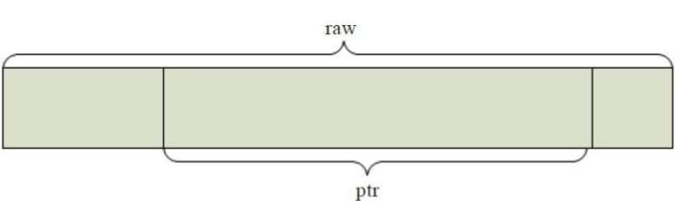
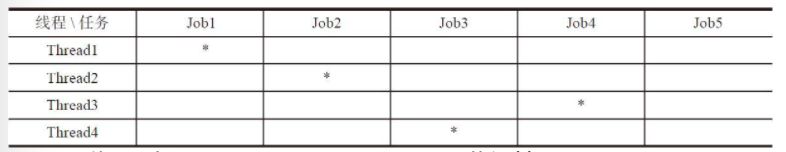

# Common Module Source Code Analysis

## Object

Object 是默认为 4MB 大小的数据块。一个对象就对应本地文件系统中的一个文件。

```cpp
struct object_t {
  std::string name;

  ...

  void swap(object_t& o) {
    name.swap(o.name);
  }
  void clear() {
    name.clear();
  }

  ...
};
```

在代码实现中，有`object`、`sobject`、`hobject`、`ghobject`等不同的类。

`sobject_t`在`object_t`之上增加了snapshot信息，用于标识是否是快照对象。

数据成员snap为快照对象的对应的快照序号。如果一个对象不是快照对象（也就是head对象），那么snap字段就被设置为`CEPH_NOSNAP`值。

```cpp
struct snapid_t {
  uint64_t val;

  ...
};

struct sobject_t {
  object_t oid;
  snapid_t snap;

  ...

  void swap(sobject_t& o) {
    oid.swap(o.oid);
    snapid_t t = snap;
    snap = o.snap;
    o.snap = t;
  }

  ...
};
```

`hobject_t`意为hash object，是实际的数据存储对象，其在`sobject_t`的基础上增加了一些字段：
* `pool` - 所在的pool的id。
* `nspace` - nspace一般为空，它用于标识特殊的对象。
* `key` - 对象的特殊标记。
* `hash` - hash和key不能同时设置，hash值一般设置为就是pg的id值。

```cpp
struct hobject_t {
public:
  static const int64_t POOL_META = -1;
  static const int64_t POOL_TEMP_START = -2; // and then negative

public:
  object_t oid;
  snapid_t snap;
private:
  uint32_t hash;
  bool max;
  uint32_t nibblewise_key_cache;
  uint32_t hash_reverse_bits;
public:
  int64_t pool;
  std::string nspace;

private:
  std::string key;

};
```

`ghobject_t`在对象`hobject_t`的基础上，用于ErasureCode模式下的PG添加了以下字段：
* `generation` - 记录对象的版本号。
* `shard_id` - EC条带的块id。

```cpp
struct ghobject_t {
  hobject_t hobj;
  gen_t generation;
  shard_id_t shard_id;
  bool max;

public:
  static const gen_t NO_GEN = UINT64_MAX;

  ...
}
```

写操作保存对象的上一个版本（`generation`）的对象，当EC写失败时，可以rollback到上一个版本。

## Buffer

Buffer namespace定义了和缓冲区相关的结构。

### buffer::raw

一个原始的数据Buffer，在其基础之上添加了长度、引用计数和额外的crc校验信息。

```cpp
class raw {
  public:
    // In the future we might want to have a slab allocator here with few
    // embedded slots. This would allow to avoid the "if" in dtor of ptr_node.
    std::aligned_storage<sizeof(ptr_node),
			 alignof(ptr_node)>::type bptr_storage;
  protected:
    char *data; // 数据指针
    unsigned len; // 长度
  public:
    ceph::atomic<unsigned> nref { 0 }; // 引用计数
    int mempool; // 内存池

    std::pair<size_t, size_t> last_crc_offset {std::numeric_limits<size_t>::max(),
                                               std::numeric_limits<size_t>::max()};
    // 数据起始段和结束段 (from,to)

    std::pair<uint32_t, uint32_t> last_crc_val; // 对应的crc32 checksum

    mutable ceph::spinlock crc_spinlock;
}
```

下列类都继承了`buffer::raw`，实现了data对应内存空间的申请：
* `raw_malloc`用`malloc`函数分配内存空间。
* `raw_mmap_pages`通过`mmap`来把内存匿名映射到进程的地址空间。
* `raw_posix_aligned`调用了函数`posix_memalign`来申请内存地址对齐的内存空间。
* `raw_hack_aligned`是在系统不支持内存对齐申请的情况下自己实现了内存地址的对齐。
* `raw_pipe`以pipe做为Buffer的内存空间。
* `raw_char` 使用了C++的new操作符来申请内存空间。

### buffer::ptr

`ptr`是`raw`里的一个任意的数据段，`_off`是在`_raw`里的偏移量，`_len`是`ptr`的长度。



同时`ptr`是一个智能指针，语义与`std::shared_ptr`类似。

```cpp
class CEPH_BUFFER_API ptr {
    friend class list;
  protected:
    raw *_raw;
    unsigned _off, _len;

  public:
    ~ptr() {
      // BE CAREFUL: this destructor is called also for hypercombined ptr_node.
      // After freeing underlying raw, `*this` can become inaccessible as well!
      release();
    }
}

buffer::ptr::ptr(const ptr& p) : _raw(p._raw), _off(p._off), _len(p._len)
{
  if (_raw) {
    _raw->nref++;
    bdout << "ptr " << this << " get " << _raw << bendl;
  }
}
```

### buffer::list

`list`是一个由`buffer`组成的链表。

```cpp

class CEPH_BUFFER_API list {
public:
    ...
private:
    // my private bits
    buffers_t _buffers;

    // track bufferptr we can modify (especially ::append() to). Not all bptrs
    // bufferlist holds have this trait -- if somebody ::push_back(const ptr&),
    // he expects it won't change.
    ptr_node* _carriage;
    unsigned _len, _num;
    // _len 是所有buffer的总长度
    // _num 是链表元素个数
}

class buffers_t {
  // _root.next can be thought as _head
  ptr_hook _root;
  ptr_hook* _tail;
}

```

## Threading Module

## Thread Pool

Thread Pool实现了MPMC线程池。

ThreadPool实现的线程池，其每个线程都有机会处理工作队列的任意一个任务。这就会导致一个问题，如果任务之间有互斥性，那么正在处理该任务的两个线程有一个必须等待另一个处理完成后才能处理，从而导致线程的阻塞，性能下降。

由于Job1和Job2的关联性，二者不能并发执行，只能顺序执行，二者之间用一个互斥锁来控制。如果Thread1先获得互斥锁就先执行，Thread2必须等待，直到Thread1执行完Job1后释放了该互斥锁，Thread2获得该互斥锁后才能执行Job2。显然，这种任务的调度方式应对这种不能完全并行的任务是有缺陷的。实际上Thread2可以去执行其他任务，比如Job5。Job1和Job2既然是顺序的，就都可以交给Thread1执行。



ShardedThreadPool对上述的任务调度方式做了改进，其在线程的执行函数里，添加了表示线程的`thread_index`。

具体如何实现Shard方式，还需要使用者自己去实现。其基本的思想就是：每个线程对应一个任务队列，所有需要顺序执行的任务都放在同一个线程的任务队列里，全部由该线程执行。

### Finisher

Finisher用来完成回调函数Context的执行，其内部有一个FinisherThread线程来用于执行Context回调函数。

### Throttle

Throttle用来限制消费的资源数量（也常称为槽位“slot”），当请求的slot数量达到max值时，请求就会被阻塞，直到有新的槽位释放出来

### SafeTimer

SafeTimer实现了定时器的功能