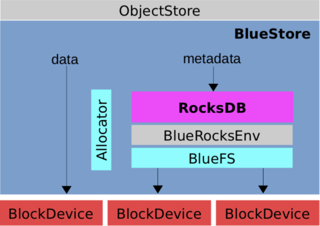
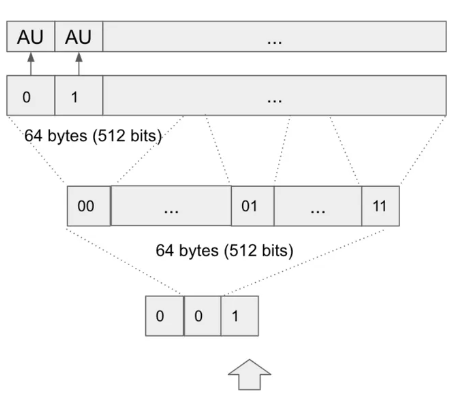
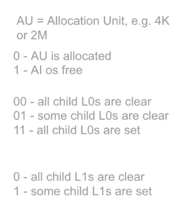
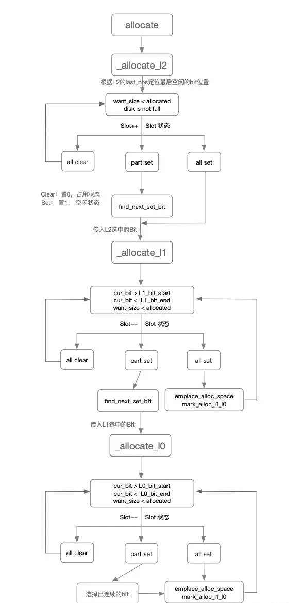
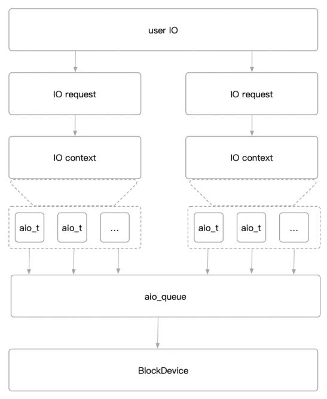
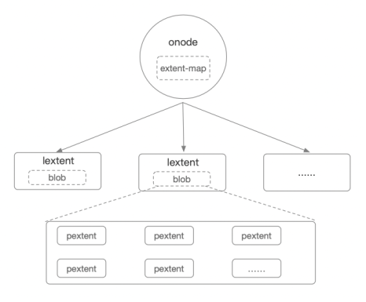
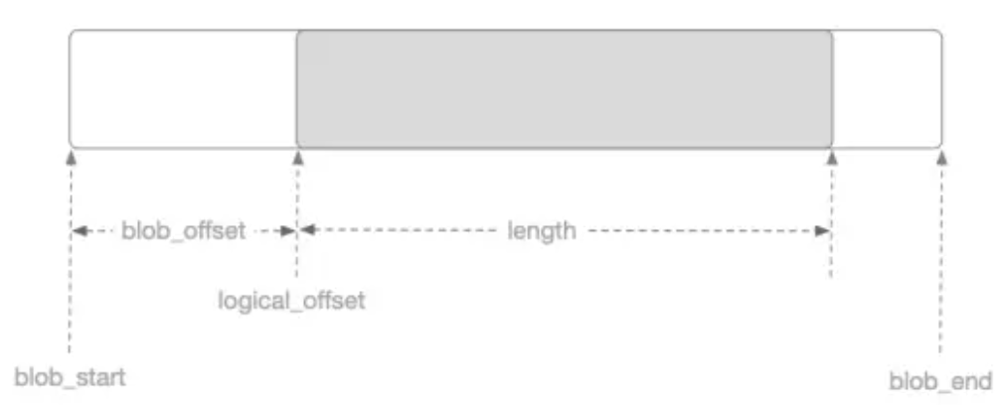
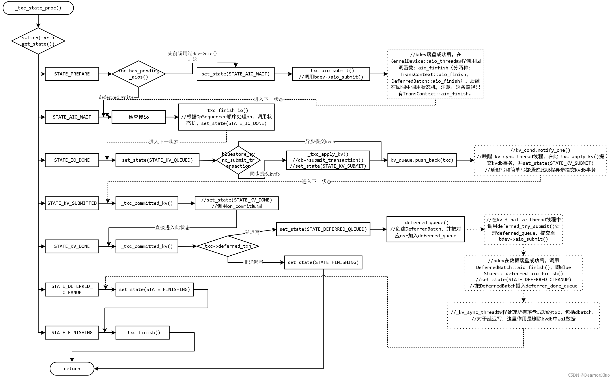
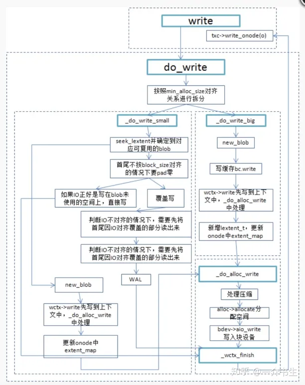

# Local Object Storage

## Introduction



Ceph早期的单机对象存储引擎是FileStore，为了维护数据的一致性，写入之前数据会先写Journal，然后再写到文件系统，会有一倍的写放大，而同时现在的文件系统一般都是日志型文件系统(ext系列、xfs)，文件系统本身为了数据的一致性，也会写Journal，此时便相当于维护了两份Journal；另外FileStore是针对HDD的，并没有对SSD作优化，随着SSD的普及，针对SSD优化的单机对象存储也被提上了日程，BlueStore便由此应运而出。

BlueStore便是一个事务型的本地日志文件系统。因为面向下一代全闪存阵列的设计，所以BlueStore在保证数据可靠性和一致性的前提下，需要尽可能的减小日志系统中双写带来的影响。

全闪存阵列的存储介质的主要开销不再是磁盘寻址时间，而是数据传输时间。因此当一次写入的数据量超过一定规模后，写入Journal盘(SSD)的延时和直接写入数据盘(SSD)的延迟不再有明显优势，所以Journal的存在性便大大减弱了。但是要保证OverWrite(覆盖写)的数据一致性，又不得不借助于Journal，所以针对Journal设计的考量便变得尤为重要了。

一个可行的方式是使用增量日志。针对大范围的覆盖写，只在其前后非磁盘块大小对齐的部分使用Journal，即RMW，其他部分直接重定向写COW即可。

## Concepts

`BlockSize`是磁盘IO操作的最小单元(原子操作)。HDD为`512B`，SSD为`4K`。即读写的数据就算少于`BlockSize`，磁盘IO的大小按`BlockSize`对齐，一个`BlockSize`的I/O操作是原子操作，要么写入成功，要么写入失败，即使掉电不会存在部分写入的情况，但多个`BlockSize`存在只写入前面`N`个`BlockSize`的情况。

RWM(Read-Modify-Write)指当覆盖写发生时，如果本次改写的内容不足一个`BlockSize`，那么需要先将对应的块读上来，然后再内存中将原内容和待修改内容合并，最后将新的块写到原来的位置。但是RMW也带来了两个问题：

* 需要额外的读开销；
* 是RMW不是原子操作，如果磁盘中途掉电，会有数据损坏的风险。

为此我们需要引入Journal，先将待更新数据写入Journal，然后再更新数据，最后再删除Journal对应的空间，但者又引入了写放大，Bluestore将写放大控制在较小的范围内，只有非对齐部分使用RMW。

COW(Copy-On-Write)指当覆盖写发生时，不是更新磁盘对应位置已有的内容，而是新分配一块空间，写入本次更新的内容，然后更新对应的地址指针，最后释放原有数据对应的磁盘空间。理论上COW可以解决RMW的两个问题，但是也带来了其他的问题：

* COW机制破坏了数据在磁盘分布的物理连续性。经过多次COW后，读数据的顺序读将会便会随机读。
* 针对小于块大小的覆盖写采用COW会得不偿失：
  * 将新的内容写入新的块后，原有的块仍然保留部分有效内容，不能释放无效空间，而且再次读的时候需要将两个块读出来做Merge操作，才能返回最终需要的数据，将大大影响读性能。
  * 存储系统一般元数据越多，功能越丰富，元数据越少，功能越简单。而且任何操作必然涉及元数据，所以元数据是系统中的热点数据。COW涉及空间重分配和地址重定向，将会引入更多的元数据，进而导致系统元数据无法全部缓存在内存里面，性能会大打折扣。

## Architecture

基于以上设计理念，BlueStore的写策略综合运用了COW和RMW策略。非覆盖写直接分配空间写入即可；块大小对齐的覆盖写采用COW策略；小于块大小的覆盖写采用RMW策略。

核心模块：
* BlockDevice - 物理块设备，使用`libaio`操作的磁盘。
* RocksDB - 存储WAL、对象元数据、对象扩展属性Omap、磁盘分配器元数据。
* BlueRocksEnv - 封装RocksDB文件操作的接口，实现了`RocksDB::Env`接口，给RocksDB用。
* BlueFS - 小型的Append文件系统，作为RocksDB的底层存储。
* Allocator - 磁盘分配器，负责高效的分配磁盘空间（当前实现是bitmap）。

## BlueFS

RocksDB是基于本地文件系统的，但是文件系统的许多功能对于RocksDB不是必须的，所以为了提升RocksDB的性能，需要对本地文件系统进行裁剪。最直接的办法便是为RocksDB量身定制一套本地文件系统，BlueFS便应运而生。

BlueFS是个简易的用户态日志型文件系统，实现了`RocksDB::Env`所有接口。BlueFS在设计上支持把`.log`和`.sst`分开存储，`.log`使用速度更快的存储介质(NVME等)。

BlueStore将所有存储空间从逻辑上分了3个层次：
* 慢速空间(Block)：存储对象数据，可以使用HDD，由BlueStore管理。
* 高速空间(DB)：存储RocksDB的`sst`文件，可以使用SSD，由BlueFS管理。
* 超高速空间(WAL)：存储RocksDB的`log`文件，可以使用NVME，由BlueFS管理。

相对于POSIX文件系统有以下几个优点：
* 元数据结构简单，使用两个map(dir_map、file_map)即可管理文件的所有元数据。
* 由于RocksDB只需要追加写，所以每次分配物理空间时进行提前预分配，一方面减少空间分配的次数，另一方面做到较好的空间连续性。
* 由于RocksDB的文件数量较少，可以将文件的元数据全部加载到内存，从而提高读取性能。
* 多设备支持，BlueFS将存储空间划分了3个层次：Slow慢速空间(存放BlueStore数据)、DB高速空间(存放sstable)、WAL超高速空间(存放WAL、自身Journal)，空间不足或空间不存在时可自动降级到下一层空间。
* 新型硬件支持，抽象出了`block_device`，可以支持`libaio`、`io_uring`、SPDK、PMEM、NVME-ZNS。

BlueFS的数据结构比较简单，主要包含三部分：
* superblock - 主要存放BlueFS的全局信息以及日志的信息，其位置固定在BlueFS的头部4K。
* journal - 存放元数据操作的日志记录，一般会预分配一块连续区域，写满以后从剩余空间再进行分配，在程序启动加载的时候逐条回放journal记录，从而将元数据加载到内存。也会对journal进行压缩，防止空间浪费、重放时间长。压缩时会遍历元数据，将元数据重新写到新的日志文件中，最后替换日志文件。
* data - 实际的文件数据存放区域，每次写入时从剩余空间分配一块区域，存放sstable文件的数据。

BlueFS元数据主要包含：
* superblock。
* dir_map。
* file_map
* 文件到物理地址的映射关系。

每个文件的数据在物理空间上的地址由若干个extents表示。

一个extent包含`bdev`、`offset`和`length`三个元素，`bdev`为设备标识。

```cpp
struct bluefs_extent_t {
  uint64_t offset = 0;
  uint32_t length = 0;
  uint8_t bdev;
};
```

因为BlueFS将存储空间设备划分为三层：慢速（Slow）空间、高速（DB）空间、超高速（WAL），`bdev`即标识此extent在哪块设备上，`offset`表示此extent的数据在设备上的物理偏移地址，`length`表示该块数据的长度。

```cpp
struct bluefs_fnode_t {
    uint64_t ino;
    uint64_t size;
    utime_t mtime;
    uint8_t __unused__;   // was prefer_bdev
    mempool::bluefs::vector<bluefs_extent_t> extents;

    // precalculated logical offsets for extents vector entries
    // allows fast lookup for extent index by the offset value via upper_bound()
    mempool::bluefs::vector<uint64_t> extents_index;

    uint64_t allocated;
};
```
### Mount

```cpp
int BlueFS::mount() {
    dout(1) << __func__ << dendl;

    int r = _open_super();
    if (r < 0) {
        derr << __func__ << " failed to open super: " << cpp_strerror(r) << dendl;
        goto out;
    }

    // set volume selector if not provided before/outside
    if (vselector == nullptr) {
        vselector.reset(
            new OriginalVolumeSelector(get_block_device_size(BlueFS::BDEV_WAL) * 95 / 100,
                                       get_block_device_size(BlueFS::BDEV_DB) * 95 / 100,
                                       get_block_device_size(BlueFS::BDEV_SLOW) * 95 / 100));
    }

    _init_alloc();
    _init_logger();

    r = _replay(false, false);
    if (r < 0) {
        derr << __func__ << " failed to replay log: " << cpp_strerror(r) << dendl;
        _stop_alloc();
        goto out;
    }

    // init freelist
    for (auto &p : file_map) {
        dout(30) << __func__ << " noting alloc for " << p.second->fnode << dendl;
        for (auto &q : p.second->fnode.extents) {
            bool is_shared = is_shared_alloc(q.bdev);
            ceph_assert(!is_shared || (is_shared && shared_alloc));
            if (is_shared && shared_alloc->need_init && shared_alloc->a) {
                shared_alloc->bluefs_used += q.length;
                alloc[q.bdev]->init_rm_free(q.offset, q.length);
            } else if (!is_shared) {
                alloc[q.bdev]->init_rm_free(q.offset, q.length);
            }
        }
    }
    if (shared_alloc) {
        shared_alloc->need_init = false;
        dout(1) << __func__ << " shared_bdev_used = " << shared_alloc->bluefs_used << dendl;
    } else {
        dout(1) << __func__ << " shared bdev not used" << dendl;
    }

    // set up the log for future writes
    log_writer = _create_writer(_get_file(1));
    ceph_assert(log_writer->file->fnode.ino == 1);
    log_writer->pos = log_writer->file->fnode.size;
    dout(10) << __func__ << " log write pos set to 0x" << std::hex << log_writer->pos << std::dec
             << dendl;

    return 0;

out:
    super = bluefs_super_t();
    return r;
}
```

主要流程：
* 加载superblock到内存（`_open_super`）。
* 初始化各存储空间的块分配器（`_init_alloc`）。
* 日志回放建立dir_map、file_map来重建整体元数据（`_replay(false, false)`）。
* 标记已分配空间：BlueFS没有像BlueStore那样使用FreelistManager来持久化分配结果，因为sstable大小固定从不修改，所以BlueFS磁盘分配需求都是比较同意和固定的。会遍历每个文件的分配信息，然后移除相应的磁盘分配器中的空闲空间，防止已分配空间的重复分配。

### Open File

```cpp
int BlueFS::open_for_read(std::string_view dirname,
                          std::string_view filename,
                          FileReader **h,
                          bool random) {
    std::lock_guard l(lock);
    dout(10) << __func__ << " " << dirname << "/" << filename
             << (random ? " (random)" : " (sequential)") << dendl;
    map<string, DirRef>::iterator p = dir_map.find(dirname);
    if (p == dir_map.end()) {
        dout(20) << __func__ << " dir " << dirname << " not found" << dendl;
        return -ENOENT;
    }
    DirRef dir = p->second;

    map<string, FileRef>::iterator q = dir->file_map.find(filename);
    if (q == dir->file_map.end()) {
        dout(20) << __func__ << " dir " << dirname << " (" << dir << ") file " << filename
                 << " not found" << dendl;
        return -ENOENT;
    }
    File *file = q->second.get();

    *h = new FileReader(file, random ? 4096 : cct->_conf->bluefs_max_prefetch, random, false);
    dout(10) << __func__ << " h " << *h << " on " << file->fnode << dendl;
    return 0;
}
```

```cpp
int BlueFS::open_for_write(std::string_view dirname,
                           std::string_view filename,
                           FileWriter **h,
                           bool overwrite) {
    std::lock_guard l(lock);
    dout(10) << __func__ << " " << dirname << "/" << filename << dendl;
    map<string, DirRef>::iterator p = dir_map.find(dirname);
    DirRef dir;
    if (p == dir_map.end()) {
        // implicitly create the dir
        dout(20) << __func__ << "  dir " << dirname << " does not exist" << dendl;
        return -ENOENT;
    } else {
        dir = p->second;
    }

    FileRef file;
    bool create = false;
    bool truncate = false;
    map<string, FileRef>::iterator q = dir->file_map.find(filename);
    if (q == dir->file_map.end()) {
        if (overwrite) {
            dout(20) << __func__ << " dir " << dirname << " (" << dir << ") file " << filename
                     << " does not exist" << dendl;
            return -ENOENT;
        }
        file = ceph::make_ref<File>();
        file->fnode.ino = ++ino_last;
        file_map[ino_last] = file;
        dir->file_map[string{filename}] = file;
        ++file->refs;
        create = true;
    } else {
        // overwrite existing file?
        file = q->second;
        if (overwrite) {
            dout(20) << __func__ << " dir " << dirname << " (" << dir << ") file " << filename
                     << " already exists, overwrite in place" << dendl;
        } else {
            dout(20) << __func__ << " dir " << dirname << " (" << dir << ") file " << filename
                     << " already exists, truncate + overwrite" << dendl;
            vselector->sub_usage(file->vselector_hint, file->fnode);
            file->fnode.size = 0;
            for (auto &p : file->fnode.extents) {
                pending_release[p.bdev].insert(p.offset, p.length);
            }
            truncate = true;

            file->fnode.clear_extents();
        }
    }
    ceph_assert(file->fnode.ino > 1);

    file->fnode.mtime = ceph_clock_now();
    file->vselector_hint = vselector->get_hint_by_dir(dirname);
    if (create || truncate) {
        vselector->add_usage(file->vselector_hint, file->fnode);   // update file count
    }

    dout(20) << __func__ << " mapping " << dirname << "/" << filename << " vsel_hint "
             << file->vselector_hint << dendl;

    log_t.op_file_update(file->fnode);
    if (create)
        log_t.op_dir_link(dirname, filename, file->fnode.ino);

    *h = _create_writer(file);

    if (boost::algorithm::ends_with(filename, ".log")) {
        (*h)->writer_type = BlueFS::WRITER_WAL;
        if (logger && !overwrite) {
            logger->inc(l_bluefs_files_written_wal);
        }
    } else if (boost::algorithm::ends_with(filename, ".sst")) {
        (*h)->writer_type = BlueFS::WRITER_SST;
        if (logger) {
            logger->inc(l_bluefs_files_written_sst);
        }
    }

    dout(10) << __func__ << " h " << *h << " on " << file->fnode << dendl;
    return 0;
}
```

BlueFS使用扁平的双层目录结构，打开过程简单没有路径解析：
* 首先使用`dirname`从`dirmap`找到相应的`dir`。
* 从`dir`中找到对应文件的`FileRef`。
* 按读写方式进行初始化。

### Read File

```cpp
int64_t BlueFS::_read(FileReader *h,       ///< [in] read from here
                      uint64_t off,        ///< [in] offset
                      size_t len,          ///< [in] this many bytes
                      bufferlist *outbl,   ///< [out] optional: reference the result here
                      char *out)           ///< [out] optional: or copy it here
{
    FileReaderBuffer *buf = &(h->buf);

    bool prefetch = !outbl && !out;
    dout(10) << __func__ << " h " << h << " 0x" << std::hex << off << "~" << len << std::dec
             << " from " << h->file->fnode << (prefetch ? " prefetch" : "") << dendl;

    ++h->file->num_reading;

    if (!h->ignore_eof && off + len > h->file->fnode.size) {
        if (off > h->file->fnode.size)
            len = 0;
        else
            len = h->file->fnode.size - off;
        dout(20) << __func__ << " reaching (or past) eof, len clipped to 0x" << std::hex << len
                 << std::dec << dendl;
    }
    logger->inc(l_bluefs_read_count, 1);
    logger->inc(l_bluefs_read_bytes, len);
    if (prefetch) {
        logger->inc(l_bluefs_read_prefetch_count, 1);
        logger->inc(l_bluefs_read_prefetch_bytes, len);
    }

    if (outbl)
        outbl->clear();

    int64_t ret = 0;
    std::shared_lock s_lock(h->lock);
    while (len > 0) {
        size_t left;
        if (off < buf->bl_off || off >= buf->get_buf_end()) {
            s_lock.unlock();
            std::unique_lock u_lock(h->lock);
            buf->bl.reassign_to_mempool(mempool::mempool_bluefs_file_reader);
            if (off < buf->bl_off || off >= buf->get_buf_end()) {
                // if precondition hasn't changed during locking upgrade.
                buf->bl.clear();
                buf->bl_off = off & super.block_mask();
                uint64_t x_off = 0;
                auto p = h->file->fnode.seek(buf->bl_off, &x_off);
                if (p == h->file->fnode.extents.end()) {
                    dout(5) << __func__ << " reading less then required " << ret << "<" << ret + len
                            << dendl;
                    break;
                }

                uint64_t want = round_up_to(len + (off & ~super.block_mask()), super.block_size);
                want = std::max(want, buf->max_prefetch);
                uint64_t l = std::min(p->length - x_off, want);
                // hard cap to 1GB
                l = std::min(l, uint64_t(1) << 30);
                uint64_t eof_offset = round_up_to(h->file->fnode.size, super.block_size);
                if (!h->ignore_eof && buf->bl_off + l > eof_offset) {
                    l = eof_offset - buf->bl_off;
                }
                dout(20) << __func__ << " fetching 0x" << std::hex << x_off << "~" << l << std::dec
                         << " of " << *p << dendl;
                int r;
                // when reading BlueFS log (only happens on startup) use non-buffered io
                // it makes it in sync with logic in _flush_range()
                bool use_buffered_io =
                    h->file->fnode.ino == 1 ? false : cct->_conf->bluefs_buffered_io;
                if (!cct->_conf->bluefs_check_for_zeros) {
                    r = bdev[p->bdev]->read(
                        p->offset + x_off, l, &buf->bl, ioc[p->bdev], use_buffered_io);
                } else {
                    r = read(
                        p->bdev, p->offset + x_off, l, &buf->bl, ioc[p->bdev], use_buffered_io);
                }
                ceph_assert(r == 0);
            }
            u_lock.unlock();
            s_lock.lock();
            // we should recheck if buffer is valid after lock downgrade
            continue;
        }
        left = buf->get_buf_remaining(off);
        dout(20) << __func__ << " left 0x" << std::hex << left << " len 0x" << len << std::dec
                 << dendl;

        int64_t r = std::min(len, left);
        if (outbl) {
            bufferlist t;
            t.substr_of(buf->bl, off - buf->bl_off, r);
            outbl->claim_append(t);
        }
        if (out) {
            auto p = buf->bl.begin();
            p.seek(off - buf->bl_off);
            p.copy(r, out);
            out += r;
        }

        dout(30) << __func__ << " result chunk (0x" << std::hex << r << std::dec << " bytes):\n";
        bufferlist t;
        t.substr_of(buf->bl, off - buf->bl_off, r);
        t.hexdump(*_dout);
        *_dout << dendl;

        off += r;
        len -= r;
        ret += r;
        buf->pos += r;
    }

    dout(20) << __func__ << " got " << ret << dendl;
    ceph_assert(!outbl || (int)outbl->length() == ret);
    --h->file->num_reading;
    return ret;
}
```

### Write File

BlueFS只提供append操作，所有文件都是追加写入。RocksDB调用完append以后，数据并未真正落盘，而是先缓存在内存当中，只有调用`sync`时才会真正落盘。

```cpp
class FileWriter {
    // note: BlueRocksEnv uses this append exclusively, so it's safe
    // to use buffer_appender exclusively here (e.g., it's notion of
    // offset will remain accurate).
    void append(const char *buf, size_t len) {
        uint64_t l0 = get_buffer_length();
        ceph_assert(l0 + len <= std::numeric_limits<unsigned>::max());
        buffer_appender.append(buf, len);
    }
};
```

```cpp
int BlueFS::_flush(FileWriter *h, bool force, bool *flushed) {
    uint64_t length = h->get_buffer_length();
    uint64_t offset = h->pos;
    if (flushed) {
        *flushed = false;
    }
    if (!force && length < cct->_conf->bluefs_min_flush_size) {
        dout(10) << __func__ << " " << h << " ignoring, length " << length << " < min_flush_size "
                 << cct->_conf->bluefs_min_flush_size << dendl;
        return 0;
    }
    if (length == 0) {
        dout(10) << __func__ << " " << h << " no dirty data on " << h->file->fnode << dendl;
        return 0;
    }
    dout(10) << __func__ << " " << h << " 0x" << std::hex << offset << "~" << length << std::dec
             << " to " << h->file->fnode << dendl;
    ceph_assert(h->pos <= h->file->fnode.size);
    int r = _flush_range(h, offset, length);
    if (flushed) {
        *flushed = true;
    }
    return r;
}
```

```cpp
int BlueFS::_flush_range(FileWriter *h, uint64_t offset, uint64_t length) {
    dout(10) << __func__ << " " << h << " pos 0x" << std::hex << h->pos << " 0x" << offset << "~"
             << length << std::dec << " to " << h->file->fnode << dendl;
    if (h->file->deleted) {
        dout(10) << __func__ << "  deleted, no-op" << dendl;
        return 0;
    }

    ceph_assert(h->file->num_readers.load() == 0);

    bool buffered;
    if (h->file->fnode.ino == 1)
        buffered = false;
    else
        buffered = cct->_conf->bluefs_buffered_io;

    if (offset + length <= h->pos)
        return 0;
    if (offset < h->pos) {
        length -= h->pos - offset;
        offset = h->pos;
        dout(10) << " still need 0x" << std::hex << offset << "~" << length << std::dec << dendl;
    }
    ceph_assert(offset <= h->file->fnode.size);

    uint64_t allocated = h->file->fnode.get_allocated();
    vselector->sub_usage(h->file->vselector_hint, h->file->fnode);
    // do not bother to dirty the file if we are overwriting
    // previously allocated extents.

    if (allocated < offset + length) {
        // we should never run out of log space here; see the min runway check
        // in _flush_and_sync_log.
        ceph_assert(h->file->fnode.ino != 1);
        int r = _allocate(vselector->select_prefer_bdev(h->file->vselector_hint),
                          offset + length - allocated,
                          &h->file->fnode);
        if (r < 0) {
            derr << __func__ << " allocated: 0x" << std::hex << allocated << " offset: 0x" << offset
                 << " length: 0x" << length << std::dec << dendl;
            vselector->add_usage(h->file->vselector_hint, h->file->fnode);   // undo
            ceph_abort_msg("bluefs enospc");
            return r;
        }
        h->file->is_dirty = true;
    }
    if (h->file->fnode.size < offset + length) {
        h->file->fnode.size = offset + length;
        if (h->file->fnode.ino > 1) {
            // we do not need to dirty the log file (or it's compacting
            // replacement) when the file size changes because replay is
            // smart enough to discover it on its own.
            h->file->is_dirty = true;
        }
    }
    dout(20) << __func__ << " file now, unflushed " << h->file->fnode << dendl;

    uint64_t x_off = 0;
    auto p = h->file->fnode.seek(offset, &x_off);
    ceph_assert(p != h->file->fnode.extents.end());
    dout(20) << __func__ << " in " << *p << " x_off 0x" << std::hex << x_off << std::dec << dendl;

    unsigned partial = x_off & ~super.block_mask();
    if (partial) {
        dout(20) << __func__ << " using partial tail 0x" << std::hex << partial << std::dec
                 << dendl;
        x_off -= partial;
        offset -= partial;
        length += partial;
        dout(20) << __func__ << " waiting for previous aio to complete" << dendl;
        for (auto p : h->iocv) {
            if (p) {
                p->aio_wait();
            }
        }
    }

    auto bl = h->flush_buffer(cct, partial, length, super);
    ceph_assert(bl.length() >= length);
    h->pos = offset + length;
    length = bl.length();

    switch (h->writer_type) {
    case WRITER_WAL:
        logger->inc(l_bluefs_bytes_written_wal, length);
        break;
    case WRITER_SST:
        logger->inc(l_bluefs_bytes_written_sst, length);
        break;
    }

    dout(30) << "dump:\n";
    bl.hexdump(*_dout);
    *_dout << dendl;

    uint64_t bloff = 0;
    uint64_t bytes_written_slow = 0;
    while (length > 0) {
        uint64_t x_len = std::min(p->length - x_off, length);
        bufferlist t;
        t.substr_of(bl, bloff, x_len);
        if (cct->_conf->bluefs_sync_write) {
            bdev[p->bdev]->write(p->offset + x_off, t, buffered, h->write_hint);
        } else {
            bdev[p->bdev]->aio_write(
                p->offset + x_off, t, h->iocv[p->bdev], buffered, h->write_hint);
        }
        h->dirty_devs[p->bdev] = true;
        if (p->bdev == BDEV_SLOW) {
            bytes_written_slow += t.length();
        }

        bloff += x_len;
        length -= x_len;
        ++p;
        x_off = 0;
    }
    if (bytes_written_slow) {
        logger->inc(l_bluefs_bytes_written_slow, bytes_written_slow);
    }
    for (unsigned i = 0; i < MAX_BDEV; ++i) {
        if (bdev[i]) {
            if (h->iocv[i] && h->iocv[i]->has_pending_aios()) {
                bdev[i]->aio_submit(h->iocv[i]);
            }
        }
    }
    vselector->add_usage(h->file->vselector_hint, h->file->fnode);
    dout(20) << __func__ << " h " << h << " pos now 0x" << std::hex << h->pos << std::dec << dendl;
    return 0;
}
```

```cpp
int BlueFS::_flush_and_sync_log(std::unique_lock<ceph::mutex> &l,
                                uint64_t want_seq,
                                uint64_t jump_to) {
    while (log_flushing) {
        dout(10) << __func__ << " want_seq " << want_seq << " log is currently flushing, waiting"
                 << dendl;
        ceph_assert(!jump_to);
        log_cond.wait(l);
    }
    if (want_seq && want_seq <= log_seq_stable) {
        dout(10) << __func__ << " want_seq " << want_seq << " <= log_seq_stable " << log_seq_stable
                 << ", done" << dendl;
        ceph_assert(!jump_to);
        return 0;
    }
    if (log_t.empty() && dirty_files.empty()) {
        dout(10) << __func__ << " want_seq " << want_seq << " " << log_t
                 << " not dirty, dirty_files empty, no-op" << dendl;
        ceph_assert(!jump_to);
        return 0;
    }

    vector<interval_set<uint64_t>> to_release(pending_release.size());
    to_release.swap(pending_release);

    uint64_t seq = log_t.seq = ++log_seq;
    ceph_assert(want_seq == 0 || want_seq <= seq);
    log_t.uuid = super.uuid;

    // log dirty files
    auto lsi = dirty_files.find(seq);
    if (lsi != dirty_files.end()) {
        dout(20) << __func__ << " " << lsi->second.size() << " dirty_files" << dendl;
        for (auto &f : lsi->second) {
            dout(20) << __func__ << "   op_file_update " << f.fnode << dendl;
            log_t.op_file_update(f.fnode);
        }
    }

    dout(10) << __func__ << " " << log_t << dendl;
    ceph_assert(!log_t.empty());

    // allocate some more space (before we run out)?
    // BTW: this triggers `flush()` in the `page_aligned_appender` of `log_writer`.
    int64_t runway =
        log_writer->file->fnode.get_allocated() - log_writer->get_effective_write_pos();
    bool just_expanded_log = false;
    if (runway < (int64_t)cct->_conf->bluefs_min_log_runway) {
        dout(10) << __func__ << " allocating more log runway (0x" << std::hex << runway << std::dec
                 << " remaining)" << dendl;
        while (new_log_writer) {
            dout(10) << __func__ << " waiting for async compaction" << dendl;
            log_cond.wait(l);
        }
        vselector->sub_usage(log_writer->file->vselector_hint, log_writer->file->fnode);
        int r = _allocate(vselector->select_prefer_bdev(log_writer->file->vselector_hint),
                          cct->_conf->bluefs_max_log_runway,
                          &log_writer->file->fnode);
        ceph_assert(r == 0);
        vselector->add_usage(log_writer->file->vselector_hint, log_writer->file->fnode);
        log_t.op_file_update(log_writer->file->fnode);
        just_expanded_log = true;
    }

    bufferlist bl;
    bl.reserve(super.block_size);
    encode(log_t, bl);
    // pad to block boundary
    size_t realign = super.block_size - (bl.length() % super.block_size);
    if (realign && realign != super.block_size)
        bl.append_zero(realign);

    logger->inc(l_bluefs_logged_bytes, bl.length());

    if (just_expanded_log) {
        ceph_assert(bl.length() <=
                    runway);   // if we write this, we will have an unrecoverable data loss
    }

    log_writer->append(bl);

    log_t.clear();
    log_t.seq = 0;   // just so debug output is less confusing
    log_flushing = true;

    int r = _flush(log_writer, true);
    ceph_assert(r == 0);

    if (jump_to) {
        dout(10) << __func__ << " jumping log offset from 0x" << std::hex << log_writer->pos
                 << " -> 0x" << jump_to << std::dec << dendl;
        log_writer->pos = jump_to;
        vselector->sub_usage(log_writer->file->vselector_hint, log_writer->file->fnode.size);
        log_writer->file->fnode.size = jump_to;
        vselector->add_usage(log_writer->file->vselector_hint, log_writer->file->fnode.size);
    }

    _flush_bdev_safely(log_writer);

    log_flushing = false;
    log_cond.notify_all();

    // clean dirty files
    if (seq > log_seq_stable) {
        log_seq_stable = seq;
        dout(20) << __func__ << " log_seq_stable " << log_seq_stable << dendl;

        auto p = dirty_files.begin();
        while (p != dirty_files.end()) {
            if (p->first > log_seq_stable) {
                dout(20) << __func__ << " done cleaning up dirty files" << dendl;
                break;
            }

            auto l = p->second.begin();
            while (l != p->second.end()) {
                File *file = &*l;
                ceph_assert(file->dirty_seq > 0);
                ceph_assert(file->dirty_seq <= log_seq_stable);
                dout(20) << __func__ << " cleaned file " << file->fnode << dendl;
                file->dirty_seq = 0;
                p->second.erase(l++);
            }

            ceph_assert(p->second.empty());
            dirty_files.erase(p++);
        }
    } else {
        dout(20) << __func__ << " log_seq_stable " << log_seq_stable << " already >= out seq "
                 << seq << ", we lost a race against another log flush, done" << dendl;
    }

    for (unsigned i = 0; i < to_release.size(); ++i) {
        if (!to_release[i].empty()) {
            /* OK, now we have the guarantee alloc[i] won't be null. */
            int r = 0;
            if (cct->_conf->bdev_enable_discard && cct->_conf->bdev_async_discard) {
                r = bdev[i]->queue_discard(to_release[i]);
                if (r == 0)
                    continue;
            } else if (cct->_conf->bdev_enable_discard) {
                for (auto p = to_release[i].begin(); p != to_release[i].end(); ++p) {
                    bdev[i]->discard(p.get_start(), p.get_len());
                }
            }
            alloc[i]->release(to_release[i]);
            if (is_shared_alloc(i)) {
                shared_alloc->bluefs_used -= to_release[i].size();
            }
        }
    }

    _update_logger_stats();

    return 0;
}
```

写入流程：
* open file for write - 打开文件句柄，如果文件不存在则创建新的文件，如果文件存在则会更新文件fnode中的mtime，在事务log_t中添加更新操作，此时事务记录还不会持久化到journal中。
* append file - 将数据追加到文件当中，此时数据缓存在内存当中，并未落盘，也未分配新的空间。
* flush data(写数据) - 判断文件已分配剩余空间（fnode中的 allocated - size）是否足够写入缓存数据，若不够则为文件分配新的空间；如果有新分配空间，将文件标记为dirty加到dirty_files当中，将数据进行磁盘块大小对其后落盘，此时数据已经写到硬盘当中，元数据还未更新，同时BlueFS中的文件都是追加写入，不存在原地覆盖写，就算失败也不会污染原来的数据。
* flush metadata - 从dirty_files中取到dirty的文件，在事务log_t中添加更新操作（即添加OP_FILE_UPDATE类型的记录），将log_t中的内容sync到journal中，然后移除dirty_files中已更新的文件。

## Alloactor

### Introduction

BlueStore的磁盘分配器，负责高效的分配磁盘空间。目前支持Stupid和Bitmap两种磁盘分配器。都是仅仅在内存中分配，并不做持久化。

FreeListManager负责管理空闲空间列表。目前支持Extent和Bitmap两种，由于Extent开销大，新版中已经移除，只剩Bitmap。FreelistManager将block按一定数量组成段，每个段对应一个k/v键值对，key为第一个block在磁盘物理地址空间的offset，value为段内每个block的状态，即由0/1组成的位图，1为空闲，0为使用，这样可以通过与1进行异或运算，将分配和回收空间两种操作统一起来。

新版本BitMap分配器以Tree-Like的方式组织数据结构，整体分为L0、L1、L2三层。每一层都包含了完整的磁盘空间映射，只不过是slot以及children的粒度不同，这样可以加快查找。





分配器分配空间的大体策略如下：
* 循环从L2中找到可以分配空间的slot以及children位置。
* 在L2的slot以及children位置的基础上循环找到L1中可以分配空间的slot以及children位置。
* 在L1的slot以及children位置的基础上循环找到L0中可以分配空间的slot以及children位置。
* 在1-3步骤中保存分配空间的结果以及设置每层对应位置分配的标志位。

新版本Bitmap分配器整体架构设计有以下几点优势：
* Allocator避免在内存中使用指针和树形结构，使用`vector`连续的内存空间。
* Allocator充分利用64位机器CPU缓存的特性，最大程序的提高性能。
* Allocator操作的单元是64 bit，而不是在单个bit上操作。
* Allocator使用3级树状结构，可以更快的查找空闲空间。
* Allocator在初始化时L0、L1、L2三级BitMap就占用了固定的内存大小。
* Allocator可以支持并发的分配空闲，锁定L2的children(bit)即可，暂未实现。

空闲的空间列表会持久化在RocksDB中，为了保证元数据和数据写入的一致性，`BitmapFreeListmanager`会由使用者调用，会将对象元数据和分配结果通过RocksDB的`WriteBatch`接口原子写入。

### Concepts

* `extent` - offset + length，表示一段连续的物理磁盘地址空间。
* `PExtentVector` - 存放空间分配结果，可能是一个或者多个extent。
* `bdev_block_size` - 磁盘块大小，IO的最小单元，默认4K。
* `min_alloc_size` - 最小分配单元，SSD默认16K，HDD默认64K。
* `max_alloc_size` - 最大分配单元，默认0不限制，即一次连续的分配结果只包含一个extent。
* `alloc_unit` - 分配单元(AU)，一般设置为min_alloc_size。
* `slot` - uint64类型，64 bit，位操作的基本单元。
* `children` - slot的分配单元，可能占1 bit，也可能占2 bit。
* `slot_set` - 8个slot构成一个slot集合(512bit)，构成上层Level的 children。
* `slot_vector` - slot数组，也即uint64的数组。每一层都用一个slot_vector组织。

`Allocator`接口。

```cpp
class Allocator {
  /*
  * returns allocator type name as per names in config
  */
  virtual const char* get_type() const = 0;

  /*
   * Allocate required number of blocks in n number of extents.
   * Min and Max number of extents are limited by:
   * a. alloc unit
   * b. max_alloc_size.
   * as no extent can be lesser than block_size and greater than max_alloc size.
   * Apart from that extents can vary between these lower and higher limits according
   * to free block search algorithm and availability of contiguous space.
   */
  virtual int64_t allocate(uint64_t want_size, uint64_t block_size,
  	   uint64_t max_alloc_size, int64_t hint,
  	   PExtentVector *extents) = 0;

  /* Bulk release. Implementations may override this method to handle the whole
   * set at once. This could save e.g. unnecessary mutex dance. */
  virtual void release(const interval_set<uint64_t>& release_set) = 0;
  void release(const PExtentVector& release_set);

  virtual void dump() = 0;
  virtual void dump(std::function<void(uint64_t offset, uint64_t length)> notify) = 0;

  virtual void zoned_set_zone_states(std::vector<zone_state_t> &&_zone_states) {}
  virtual bool zoned_get_zones_to_clean(std::deque<uint64_t> *zones_to_clean) {
    return false;
  }

  virtual void init_add_free(uint64_t offset, uint64_t length) = 0;
  virtual void init_rm_free(uint64_t offset, uint64_t length) = 0;

  virtual uint64_t get_free() = 0;
  virtual double get_fragmentation()
  {
    return 0.0;
  }
  virtual double get_fragmentation_score();
  virtual void shutdown() = 0;
};
```

`AllocatorLevel`基类。

```cpp
class AllocatorLevel {
   protected:
    // 一个 slot 有多少个 children。slot 的大小是 64bit。
    // L0、L2的 children 大小是1bit，所以含有64个。
    // L1的 children 大小是2bit，所以含有32个。
    virtual uint64_t _children_per_slot() const = 0;

    // 每个 children 之间的磁盘空间长度，也即每个 children 的大小。
    // L0 的每个 children 间隔长度为：l0_granularity = alloc_unit。
    // L1 的每个 children 间隔长度为：l1_granularity = 512 * l0_granularity。
    // L2 的每个 children 间隔长度为：l2_granularity = 256 * l1_granularity。
    virtual uint64_t _level_granularity() const = 0;

   public:
    // L0 分配的次数，调用_allocate_l0的次数。
    static uint64_t l0_dives;

    // 遍历 L0 slot 的次数。
    static uint64_t l0_iterations;

    // 遍历 L0 slot(部分占用，部分空闲)的次数。
    static uint64_t l0_inner_iterations;

    // L0 分配 slot 的次数。
    static uint64_t alloc_fragments;

    // L1 分配 slot(部分占用，部分空闲)的次数。
    static uint64_t alloc_fragments_fast;

    // L2 分配的次数 ，调用 _allocate_l2的次数。
    static uint64_t l2_allocs;

    virtual ~AllocatorLevel() {}
};
```

### Allocate



最终分配的结果存储在`interval_vector_t`结构体里面，实际上就是`extent_vector`，因为分配的磁盘空间不一定是完全连续的，所以会有多个extent，而在往`extent_vector`插入extent的时候会合并相邻的extent为一个extent。如果`max_alloc_size`设置了，且单个连续的分配大小超过了`max_alloc_size`，那么extent的length最大为`max_alloc_size`，同时这次分配结果也会拆分会多个extent。

### Release

```cpp
// to provide compatibility with BlueStore's allocator interface
void _free_l2(const interval_set<uint64_t> &rr) {
    uint64_t released = 0;
    std::lock_guard l(lock);
    for (auto r : rr) {
        released += l1._free_l1(r.first, r.second);
        uint64_t l2_pos = r.first / l2_granularity;
        uint64_t l2_pos_end =
            p2roundup(int64_t(r.first + r.second), int64_t(l2_granularity)) / l2_granularity;

        _mark_l2_free(l2_pos, l2_pos_end);
    }
    available += released;
}

uint64_t _free_l1(uint64_t offs, uint64_t len) {
    uint64_t l0_pos_start = offs / l0_granularity;
    uint64_t l0_pos_end = p2roundup(offs + len, l0_granularity) / l0_granularity;
    _mark_free_l1_l0(l0_pos_start, l0_pos_end);
    return l0_granularity * (l0_pos_end - l0_pos_start);
}

void _mark_free_l1_l0(int64_t l0_pos_start, int64_t l0_pos_end) {
    _mark_free_l0(l0_pos_start, l0_pos_end);
    l0_pos_start = p2align(l0_pos_start, int64_t(bits_per_slotset));
    l0_pos_end = p2roundup(l0_pos_end, int64_t(bits_per_slotset));
    _mark_l1_on_l0(l0_pos_start, l0_pos_end);
}

void _mark_free_l0(int64_t l0_pos_start, int64_t l0_pos_end) {
    auto d0 = L0_ENTRIES_PER_SLOT;

    auto pos = l0_pos_start;
    slot_t bits = (slot_t)1 << (l0_pos_start % d0);
    slot_t *val_s = &l0[pos / d0];
    int64_t pos_e = std::min(l0_pos_end, p2roundup<int64_t>(l0_pos_start + 1, d0));
    while (pos < pos_e) {
        *val_s |= bits;
        bits <<= 1;
        pos++;
    }
    pos_e = std::min(l0_pos_end, p2align<int64_t>(l0_pos_end, d0));
    while (pos < pos_e) {
        *(++val_s) = all_slot_set;
        pos += d0;
    }
    bits = 1;
    ++val_s;
    while (pos < l0_pos_end) {
        *val_s |= bits;
        bits <<= 1;
        pos++;
    }
}
```

## Block Device



Ceph新的存储引擎BlueStore已成为默认的存储引擎，抛弃了对传统文件系统的依赖，直接管理裸设备，通过libaio的方式进行读写。抽象出了`BlockDevice`基类，提供统一的操作接口，后端对应不同的设备类型的实现(Kernel、NVME、NVRAM)等。

目前线上环境大多数还是使用HDD和Sata SSD，其派生的类为`KernelDevice`。

```cpp
class KernelDevice : public BlockDevice {
    // 裸设备以direct、buffered两种方式打开的fd
    int fd_direct, fd_buffered;

    // 设备总大小
    uint64_t size;

    // 块大小
    uint64_t block_size;

    // 设备路径
    std::string path;

    // 是否启用Libaio
    bool aio, dio;

    // interval_set是offset+length
    // discard_queued 存放需要做Discard的Extent。
    interval_set<uint64_t> discard_queued;

    // discard_finishing 和 discard_queued 交换值，存放完成Discard的Extent
    interval_set<uint64_t> discard_finishing;

    // libaio线程，收割完成的事件
    struct AioCompletionThread : public Thread {
        KernelDevice *bdev;
        explicit AioCompletionThread(KernelDevice *b) : bdev(b) {}
        void *entry() override {
            bdev->_aio_thread();
            return NULL;
        }
    } aio_thread;

    // Discard线程，用于SSD的Trim
    struct DiscardThread : public Thread {
        KernelDevice *bdev;
        explicit DiscardThread(KernelDevice *b) : bdev(b) {}
        void *entry() override {
            bdev->_discard_thread();
            return NULL;
        }
    } discard_thread;

    // 同步IO
    int read(uint64_t off, uint64_t len, bufferlist *pbl, IOContext *ioc,
             bool buffered) override;
    int write(uint64_t off, bufferlist &bl, bool buffered) override;

    // 异步IO
    int aio_read(uint64_t off, uint64_t len, bufferlist *pbl,
                 IOContext *ioc) override;
    int aio_read(uint64_t off, uint64_t len, bufferlist *pbl,
                 IOContext *ioc) override;
    void aio_submit(IOContext *ioc) override;

    // sync数据
    int flush() override;

    // 对SSD指定offset、len的数据做Trim
    int discard(uint64_t offset, uint64_t len) override;
};
```

### Initial

BlueFS会使用BlockDevice存放RocksDB的WAL以及SStable，同样BlueStore也会使用BlockDevice来存放对象的数据。创建的时候根据不同的设备类型然后创建不同的设备。

```cpp
BlockDevice *BlockDevice::create(CephContext *cct,
                                 const string &path,
                                 aio_callback_t cb,
                                 void *cbpriv,
                                 aio_callback_t d_cb,
                                 void *d_cbpriv) {
    const string blk_dev_name = cct->_conf.get_val<string>("bdev_type");
    block_device_t device_type = block_device_t::unknown;
    if (blk_dev_name.empty()) {
        device_type = detect_device_type(path);
    } else {
        device_type = device_type_from_name(blk_dev_name);
    }
    return create_with_type(device_type, cct, path, cb, cbpriv, d_cb, d_cbpriv);
}
```


```cpp
int KernelDevice::open(const string &p) {
    path = p;
    int r = 0, i = 0;
    dout(1) << __func__ << " path " << path << dendl;

    for (i = 0; i < WRITE_LIFE_MAX; i++) {
        int fd = ::open(path.c_str(), O_RDWR | O_DIRECT);
        if (fd < 0) {
            r = -errno;
            break;
        }
        fd_directs[i] = fd;

        fd = ::open(path.c_str(), O_RDWR | O_CLOEXEC);
        if (fd < 0) {
            r = -errno;
            break;
        }
        fd_buffereds[i] = fd;
    }

    if (i != WRITE_LIFE_MAX) {
        derr << __func__ << " open got: " << cpp_strerror(r) << dendl;
        goto out_fail;
    }

#if defined(F_SET_FILE_RW_HINT)
    for (i = WRITE_LIFE_NONE; i < WRITE_LIFE_MAX; i++) {
        if (fcntl(fd_directs[i], F_SET_FILE_RW_HINT, &i) < 0) {
            r = -errno;
            break;
        }
        if (fcntl(fd_buffereds[i], F_SET_FILE_RW_HINT, &i) < 0) {
            r = -errno;
            break;
        }
    }
    if (i != WRITE_LIFE_MAX) {
        enable_wrt = false;
        dout(0) << "ioctl(F_SET_FILE_RW_HINT) on " << path << " failed: " << cpp_strerror(r)
                << dendl;
    }
#endif

    dio = true;
    aio = cct->_conf->bdev_aio;
    if (!aio) {
        ceph_abort_msg("non-aio not supported");
    }

    // disable readahead as it will wreak havoc on our mix of
    // directio/aio and buffered io.
    r = posix_fadvise(fd_buffereds[WRITE_LIFE_NOT_SET], 0, 0, POSIX_FADV_RANDOM);
    if (r) {
        r = -r;
        derr << __func__ << " posix_fadvise got: " << cpp_strerror(r) << dendl;
        goto out_fail;
    }

    if (lock_exclusive) {
        r = _lock();
        if (r < 0) {
            derr << __func__ << " failed to lock " << path << ": " << cpp_strerror(r) << dendl;
            goto out_fail;
        }
    }

    struct stat st;
    r = ::fstat(fd_directs[WRITE_LIFE_NOT_SET], &st);
    if (r < 0) {
        r = -errno;
        derr << __func__ << " fstat got " << cpp_strerror(r) << dendl;
        goto out_fail;
    }

    // Operate as though the block size is 4 KB.  The backing file
    // blksize doesn't strictly matter except that some file systems may
    // require a read/modify/write if we write something smaller than
    // it.
    block_size = cct->_conf->bdev_block_size;
    if (block_size != (unsigned)st.st_blksize) {
        dout(1) << __func__ << " backing device/file reports st_blksize " << st.st_blksize
                << ", using bdev_block_size " << block_size << " anyway" << dendl;
    }


    {
        BlkDev blkdev_direct(fd_directs[WRITE_LIFE_NOT_SET]);
        BlkDev blkdev_buffered(fd_buffereds[WRITE_LIFE_NOT_SET]);

        if (S_ISBLK(st.st_mode)) {
            int64_t s;
            r = blkdev_direct.get_size(&s);
            if (r < 0) {
                goto out_fail;
            }
            size = s;
        } else {
            size = st.st_size;
        }

        char partition[PATH_MAX], devname[PATH_MAX];
        if ((r = blkdev_buffered.partition(partition, PATH_MAX)) ||
            (r = blkdev_buffered.wholedisk(devname, PATH_MAX))) {
            derr << "unable to get device name for " << path << ": " << cpp_strerror(r) << dendl;
            rotational = true;
        } else {
            dout(20) << __func__ << " devname " << devname << dendl;
            rotational = blkdev_buffered.is_rotational();
            support_discard = blkdev_buffered.support_discard();
            this->devname = devname;
            _detect_vdo();
        }
    }

    r = _aio_start();
    if (r < 0) {
        goto out_fail;
    }
    _discard_start();

    // round size down to an even block
    size &= ~(block_size - 1);

    dout(1) << __func__ << " size " << size << " (0x" << std::hex << size << std::dec << ", "
            << byte_u_t(size) << ")"
            << " block_size " << block_size << " (" << byte_u_t(block_size) << ")"
            << " " << (rotational ? "rotational" : "non-rotational") << " discard "
            << (support_discard ? "supported" : "not supported") << dendl;
    return 0;

out_fail:
    for (i = 0; i < WRITE_LIFE_MAX; i++) {
        if (fd_directs[i] >= 0) {
            VOID_TEMP_FAILURE_RETRY(::close(fd_directs[i]));
            fd_directs[i] = -1;
        } else {
            break;
        }
        if (fd_buffereds[i] >= 0) {
            VOID_TEMP_FAILURE_RETRY(::close(fd_buffereds[i]));
            fd_buffereds[i] = -1;
        } else {
            break;
        }
    }
    return r;
}
```

此时设备以及可以进行IO；设备的空间管理以及使用由BlueFS和BlueStore决定，BlockDevice仅仅提供同步IO和异步IO的操作接口。

### Synchronous I/O

#### Read

```cpp
int KernelDevice::read(uint64_t off, uint64_t len, bufferlist *pbl, IOContext *ioc, bool buffered) {
    dout(5) << __func__ << " 0x" << std::hex << off << "~" << len << std::dec
            << (buffered ? " (buffered)" : " (direct)") << dendl;
    ceph_assert(is_valid_io(off, len));

    _aio_log_start(ioc, off, len);

    auto start1 = mono_clock::now();

    auto p = ceph::buffer::ptr_node::create(ceph::buffer::create_small_page_aligned(len));
    int r = ::pread(buffered ? fd_buffereds[WRITE_LIFE_NOT_SET] : fd_directs[WRITE_LIFE_NOT_SET],
                    p->c_str(),
                    len,
                    off);
    auto age = cct->_conf->bdev_debug_aio_log_age;
    if (mono_clock::now() - start1 >= make_timespan(age)) {
        derr << __func__ << " stalled read "
             << " 0x" << std::hex << off << "~" << len << std::dec
             << (buffered ? " (buffered)" : " (direct)") << " since " << start1 << ", timeout is "
             << age << "s" << dendl;
    }

    if (r < 0) {
        if (ioc->allow_eio && is_expected_ioerr(r)) {
            r = -EIO;
        } else {
            r = -errno;
        }
        goto out;
    }
    ceph_assert((uint64_t)r == len);
    pbl->push_back(std::move(p));

    dout(40) << "data: ";
    pbl->hexdump(*_dout);
    *_dout << dendl;

out:
    _aio_log_finish(ioc, off, len);
    return r < 0 ? r : 0;
}
```

#### Write

```cpp
int KernelDevice::_sync_write(uint64_t off, bufferlist &bl, bool buffered, int write_hint) {
    uint64_t len = bl.length();
    dout(5) << __func__ << " 0x" << std::hex << off << "~" << len << std::dec
            << (buffered ? " (buffered)" : " (direct)") << dendl;
    if (cct->_conf->bdev_inject_crash && rand() % cct->_conf->bdev_inject_crash == 0) {
        derr << __func__ << " bdev_inject_crash: dropping io 0x" << std::hex << off << "~" << len
             << std::dec << dendl;
        ++injecting_crash;
        return 0;
    }
    vector<iovec> iov;
    bl.prepare_iov(&iov);

    auto left = len;
    auto o = off;
    size_t idx = 0;
    do {
        auto r = ::pwritev(choose_fd(buffered, write_hint), &iov[idx], iov.size() - idx, o);

        if (r < 0) {
            r = -errno;
            derr << __func__ << " pwritev error: " << cpp_strerror(r) << dendl;
            return r;
        }
        o += r;
        left -= r;
        if (left) {
            // skip fully processed IOVs
            while (idx < iov.size() && (size_t)r >= iov[idx].iov_len) {
                r -= iov[idx++].iov_len;
            }
            // update partially processed one if any
            if (r) {
                ceph_assert(idx < iov.size());
                ceph_assert((size_t)r < iov[idx].iov_len);
                iov[idx].iov_base = static_cast<char *>(iov[idx].iov_base) + r;
                iov[idx].iov_len -= r;
                r = 0;
            }
            ceph_assert(r == 0);
        }
    } while (left);

#ifdef HAVE_SYNC_FILE_RANGE
    if (buffered) {
        // initiate IO and wait till it completes
        auto r = ::sync_file_range(
            fd_buffereds[WRITE_LIFE_NOT_SET],
            off,
            len,
            SYNC_FILE_RANGE_WRITE | SYNC_FILE_RANGE_WAIT_AFTER | SYNC_FILE_RANGE_WAIT_BEFORE);
        if (r < 0) {
            r = -errno;
            derr << __func__ << " sync_file_range error: " << cpp_strerror(r) << dendl;
            return r;
        }
    }
#endif

    io_since_flush.store(true);

    return 0;
}
```

### Asynchronous I/O

使用`libaio`进行异步数据读写。

*NOTE：当前似乎`io_uring`是个更好的选择。*

```cpp
void KernelDevice::aio_submit(IOContext *ioc) {
    dout(20) << __func__ << " ioc " << ioc << " pending " << ioc->num_pending.load() << " running "
             << ioc->num_running.load() << dendl;

    if (ioc->num_pending.load() == 0) {
        return;
    }

    // move these aside, and get our end iterator position now, as the
    // aios might complete as soon as they are submitted and queue more
    // wal aio's.
    list<aio_t>::iterator e = ioc->running_aios.begin();
    ioc->running_aios.splice(e, ioc->pending_aios);

    int pending = ioc->num_pending.load();
    ioc->num_running += pending;
    ioc->num_pending -= pending;
    ceph_assert(ioc->num_pending.load() == 0);   // we should be only thread doing this
    ceph_assert(ioc->pending_aios.size() == 0);

    if (cct->_conf->bdev_debug_aio) {
        list<aio_t>::iterator p = ioc->running_aios.begin();
        while (p != e) {
            dout(30) << __func__ << " " << *p << dendl;
            std::lock_guard l(debug_queue_lock);
            debug_aio_link(*p++);
        }
    }

    void *priv = static_cast<void *>(ioc);
    int r, retries = 0;
    // num of pending aios should not overflow when passed to submit_batch()
    assert(pending <= std::numeric_limits<uint16_t>::max());
    r = io_queue->submit_batch(ioc->running_aios.begin(), e, pending, priv, &retries);

    if (retries)
        derr << __func__ << " retries " << retries << dendl;
    if (r < 0) {
        derr << " aio submit got " << cpp_strerror(r) << dendl;
        ceph_assert(r == 0);
    }
}
```

在AIO 线程进行完成收割。

```cpp
void KernelDevice::_aio_thread() {
    dout(10) << __func__ << " start" << dendl;
    int inject_crash_count = 0;
    while (!aio_stop) {
        dout(40) << __func__ << " polling" << dendl;
        int max = cct->_conf->bdev_aio_reap_max;
        aio_t *aio[max];
        int r = io_queue->get_next_completed(cct->_conf->bdev_aio_poll_ms, aio, max);
        if (r < 0) {
            derr << __func__ << " got " << cpp_strerror(r) << dendl;
            ceph_abort_msg("got unexpected error from io_getevents");
        }
        if (r > 0) {
            dout(30) << __func__ << " got " << r << " completed aios" << dendl;
            for (int i = 0; i < r; ++i) {
                IOContext *ioc = static_cast<IOContext *>(aio[i]->priv);
                _aio_log_finish(ioc, aio[i]->offset, aio[i]->length);
                if (aio[i]->queue_item.is_linked()) {
                    std::lock_guard l(debug_queue_lock);
                    debug_aio_unlink(*aio[i]);
                }

                // set flag indicating new ios have completed.  we do this *before*
                // any completion or notifications so that any user flush() that
                // follows the observed io completion will include this io.  Note
                // that an earlier, racing flush() could observe and clear this
                // flag, but that also ensures that the IO will be stable before the
                // later flush() occurs.
                io_since_flush.store(true);

                long r = aio[i]->get_return_value();
                if (r < 0) {
                    derr << __func__ << " got r=" << r << " (" << cpp_strerror(r) << ")" << dendl;
                    if (ioc->allow_eio && is_expected_ioerr(r)) {
                        derr << __func__ << " translating the error to EIO for upper layer"
                             << dendl;
                        ioc->set_return_value(-EIO);
                    } else {
                        if (is_expected_ioerr(r)) {
                            note_io_error_event(devname.c_str(),
                                                path.c_str(),
                                                r,
#if defined(HAVE_POSIXAIO)
                                                aio[i]->aio.aiocb.aio_lio_opcode,
#else
                                                 aio[i]->iocb.aio_lio_opcode,
#endif
                                                aio[i]->offset,
                                                aio[i]->length);
                            ceph_abort_msg("Unexpected IO error. "
                                           "This may suggest a hardware issue. "
                                           "Please check your kernel log!");
                        }
                        ceph_abort_msg("Unexpected IO error. "
                                       "This may suggest HW issue. Please check your dmesg!");
                    }
                } else if (aio[i]->length != (uint64_t)r) {
                    derr << "aio to 0x" << std::hex << aio[i]->offset << "~" << aio[i]->length
                         << std::dec << " but returned: " << r << dendl;
                    ceph_abort_msg("unexpected aio return value: does not match length");
                }

                dout(10) << __func__ << " finished aio " << aio[i] << " r " << r << " ioc " << ioc
                         << " with " << (ioc->num_running.load() - 1) << " aios left" << dendl;

                // NOTE: once num_running and we either call the callback or
                // call aio_wake we cannot touch ioc or aio[] as the caller
                // may free it.
                if (ioc->priv) {
                    if (--ioc->num_running == 0) {
                        aio_callback(aio_callback_priv, ioc->priv);
                    }
                } else {
                    ioc->try_aio_wake();
                }
            }
        }
        if (cct->_conf->bdev_debug_aio) {
            utime_t now = ceph_clock_now();
            std::lock_guard l(debug_queue_lock);
            if (debug_oldest) {
                if (debug_stall_since == utime_t()) {
                    debug_stall_since = now;
                } else {
                    if (cct->_conf->bdev_debug_aio_suicide_timeout) {
                        utime_t cutoff = now;
                        cutoff -= cct->_conf->bdev_debug_aio_suicide_timeout;
                        if (debug_stall_since < cutoff) {
                            derr << __func__ << " stalled aio " << debug_oldest << " since "
                                 << debug_stall_since << ", timeout is "
                                 << cct->_conf->bdev_debug_aio_suicide_timeout << "s, suicide"
                                 << dendl;
                            ceph_abort_msg("stalled aio... buggy kernel or bad device?");
                        }
                    }
                }
            }
        }
        reap_ioc();
        if (cct->_conf->bdev_inject_crash) {
            ++inject_crash_count;
            if (inject_crash_count * cct->_conf->bdev_aio_poll_ms / 1000 >
                cct->_conf->bdev_inject_crash + cct->_conf->bdev_inject_crash_flush_delay) {
                derr << __func__ << " bdev_inject_crash trigger from aio thread" << dendl;
                cct->_log->flush();
                _exit(1);
            }
        }
    }
    reap_ioc();
    dout(10) << __func__ << " end" << dendl;
}
```

### Flush

BlueStore往往采用异步IO，同步数据到磁盘上调用flush函数。

先通过`libaio`写入数据，然后在`kv_sync_thread`里面调用flush函数，把数据和元数据同步到磁盘上。

```cpp
int KernelDevice::flush() {
    // protect flush with a mutex.  note that we are not really protecting
    // data here.  instead, we're ensuring that if any flush() caller
    // sees that io_since_flush is true, they block any racing callers
    // until the flush is observed.  that allows racing threads to be
    // calling flush while still ensuring that *any* of them that got an
    // aio completion notification will not return before that aio is
    // stable on disk: whichever thread sees the flag first will block
    // followers until the aio is stable.
    std::lock_guard l(flush_mutex);

    bool expect = true;
    if (!io_since_flush.compare_exchange_strong(expect, false)) {
        dout(10) << __func__ << " no-op (no ios since last flush), flag is "
                 << (int)io_since_flush.load() << dendl;
        return 0;
    }

    dout(10) << __func__ << " start" << dendl;
    if (cct->_conf->bdev_inject_crash) {
        ++injecting_crash;
        // sleep for a moment to give other threads a chance to submit or
        // wait on io that races with a flush.
        derr << __func__ << " injecting crash. first we sleep..." << dendl;
        sleep(cct->_conf->bdev_inject_crash_flush_delay);
        derr << __func__ << " and now we die" << dendl;
        cct->_log->flush();
        _exit(1);
    }
    utime_t start = ceph_clock_now();
    int r = ::fdatasync(fd_directs[WRITE_LIFE_NOT_SET]);
    utime_t end = ceph_clock_now();
    utime_t dur = end - start;
    if (r < 0) {
        r = -errno;
        derr << __func__ << " fdatasync got: " << cpp_strerror(r) << dendl;
        ceph_abort();
    }
    dout(5) << __func__ << " in " << dur << dendl;
    ;
    return r;
}
```


### Discard

BlueStore针对SSD的优化之一就是添加了Discard操作。Discard(Trim)的主要作用是提高GC效率以及减小写入放大。

KernelDevice会启动一个Discard线程，不断的从`discard_queued`里面取出Extent，然后做Discard。

```cpp
void KernelDevice::_discard_thread() {
    std::unique_lock l(discard_lock);
    ceph_assert(!discard_started);
    discard_started = true;
    discard_cond.notify_all();
    while (true) {
        ceph_assert(discard_finishing.empty());
        if (discard_queued.empty()) {
            if (discard_stop)
                break;
            dout(20) << __func__ << " sleep" << dendl;
            discard_cond.notify_all();   // for the thread trying to drain...
            discard_cond.wait(l);
            dout(20) << __func__ << " wake" << dendl;
        } else {
            discard_finishing.swap(discard_queued);
            discard_running = true;
            l.unlock();
            dout(20) << __func__ << " finishing" << dendl;
            for (auto p = discard_finishing.begin(); p != discard_finishing.end(); ++p) {
                discard(p.get_start(), p.get_len());
            }

            discard_callback(discard_callback_priv, static_cast<void *>(&discard_finishing));
            discard_finishing.clear();
            l.lock();
            discard_running = false;
        }
    }
    dout(10) << __func__ << " finish" << dendl;
    discard_started = false;
}
```

```cpp
int KernelDevice::discard(uint64_t offset, uint64_t len) {
    int r = 0;
    if (cct->_conf->objectstore_blackhole) {
        lderr(cct) << __func__ << " objectstore_blackhole=true, throwing out IO" << dendl;
        return 0;
    }
    if (support_discard) {
        dout(10) << __func__ << " 0x" << std::hex << offset << "~" << len << std::dec << dendl;

        r = BlkDev{fd_directs[WRITE_LIFE_NOT_SET]}.discard((int64_t)offset, (int64_t)len);
    }
    return r;
}
```

BlueFS和BlueStore在涉及到数据删除的时候调用`queue_discard`将需要做Discard的Extent传入`discard_queued`。

```cpp
int KernelDevice::queue_discard(interval_set<uint64_t> &to_release) {
    if (!support_discard)
        return -1;

    if (to_release.empty())
        return 0;

    std::lock_guard l(discard_lock);
    discard_queued.insert(to_release);
    discard_cond.notify_all();
    return 0;
}
```

---

See also: [SSD](/SSD/README.md)

## FreelistManager

BlueStore直接管理裸设备，需要自行管理空间的分配和释放。`Stupid`和`Bitmap`分配器的结果是保存在内存中的，需要使用`FreelistManager`来持久化。

一个block的状态可以为占用和空闲两种状态，持久化时只需要记录一种状态即可，便可以推导出另一种状态，BlueStore记录的是空闲block。主要有两个原因：
* 回收空间的时候，方便空闲空间的合并；
* 已分配的空间在Object中已有记录。

FreelistManager最开始有`extent`和`bitmap`两种实现，现在默认为`bitmap`实现，`extent`的实现已经废弃。

空闲空间持久化到磁盘也是通过RocksDB的Batch写入的。FreelistManager将block按一定数量组成段，每个段对应一个键值对，`key`为第一个block在磁盘物理地址空间的offset，`value`为段内每个block的状态，即由0/1组成的位图，1为空闲，0为使用，这样可以通过与1进行异或运算，将分配和回收空间两种操作统一起来。

```cpp
class FreelistManager {
    virtual int create(uint64_t size, uint64_t granularity, KeyValueDB::Transaction txn) = 0;

    virtual int init(KeyValueDB *kvdb,
                     bool db_in_read_only,
                     std::function<int(const std::string &, std::string *)> cfg_reader) = 0;
    virtual void sync(KeyValueDB *kvdb) = 0;
    virtual void shutdown() = 0;

    virtual void dump(KeyValueDB *kvdb) = 0;

    virtual void enumerate_reset() = 0;
    virtual bool enumerate_next(KeyValueDB *kvdb, uint64_t *offset, uint64_t *length) = 0;

    virtual void allocate(uint64_t offset, uint64_t length, KeyValueDB::Transaction txn) = 0;
    virtual void release(uint64_t offset, uint64_t length, KeyValueDB::Transaction txn) = 0;

    virtual uint64_t get_size() const = 0;
    virtual uint64_t get_alloc_units() const = 0;
    virtual uint64_t get_alloc_size() const = 0;

    virtual void get_meta(uint64_t target_size, std::vector<std::pair<string, string>> *) const = 0;

    virtual std::vector<zone_state_t> get_zone_states(KeyValueDB *kvdb) const {
        return {};
    }
};
```

`BitmapFreelistManager`实现如下。

```cpp
class BitmapFreelistManager : public FreelistManager {
    // rocksdb key前缀：meta_prefix为 B，bitmap_prefix为 b
    std::string meta_prefix, bitmap_prefix;
    // rocksdb的merge操作：按位异或(xor)
    std::shared_ptr<KeyValueDB::MergeOperator> merge_op;
    // enumerate操作时加锁
    ceph::mutex lock = ceph::make_mutex("BitmapFreelistManager::lock");
    // 设备总大小
    uint64_t size;              ///< size of device (bytes)
    // block大小：bdev_block_size，默认min_alloc_size
    uint64_t bytes_per_block;   ///< bytes per block (bdev_block_size)
    // 每个key包含多少个block， 默认128
    uint64_t blocks_per_key;    ///< blocks (bits) per key/value pair
    // 每个key对应空间大小
    uint64_t bytes_per_key;     ///< bytes per key/value pair
    // 设备总block数
    uint64_t blocks;            ///< size of device (blocks, size rounded up)

    // 遍历rocksdb key相关的成员
    uint64_t block_mask;   ///< mask to convert byte offset to block offset
    uint64_t key_mask;     ///< mask to convert offset to key offset

    ceph::buffer::list all_set_bl;

    KeyValueDB::Iterator enumerate_p;
    uint64_t enumerate_offset;         ///< logical offset; position
    ceph::buffer::list enumerate_bl;   ///< current key at enumerate_offset
    int enumerate_bl_pos;              ///< bit position in enumerate_bl
};
```

### Initial

BlueStore在初始化osd的时候，会调用`mkfs`，初始化FreelistManager(create/init)，后续如果重启进程，会执行`mount`函数，只会调用`FreelistManager::init`。

```cpp
int BlueStore::mkfs() {
    dout(1) << __func__ << " path " << path << dendl;
    int r;
    uuid_d old_fsid;
    uint64_t reserved;
    if (cct->_conf->osd_max_object_size > OBJECT_MAX_SIZE) {
        derr << __func__ << " osd_max_object_size " << cct->_conf->osd_max_object_size
             << " > bluestore max " << OBJECT_MAX_SIZE << dendl;
        return -EINVAL;
    }

    {
        string done;
        r = read_meta("mkfs_done", &done);
        if (r == 0) {
            dout(1) << __func__ << " already created" << dendl;
            if (cct->_conf->bluestore_fsck_on_mkfs) {
                r = fsck(cct->_conf->bluestore_fsck_on_mkfs_deep);
                if (r < 0) {
                    derr << __func__ << " fsck found fatal error: " << cpp_strerror(r) << dendl;
                    return r;
                }
                if (r > 0) {
                    derr << __func__ << " fsck found " << r << " errors" << dendl;
                    r = -EIO;
                }
            }
            return r;   // idempotent
        }
    }

    {
        string type;
        r = read_meta("type", &type);
        if (r == 0) {
            if (type != "bluestore") {
                derr << __func__ << " expected bluestore, but type is " << type << dendl;
                return -EIO;
            }
        } else {
            r = write_meta("type", "bluestore");
            if (r < 0)
                return r;
        }
    }

    freelist_type = "bitmap";

    r = _open_path();
    if (r < 0)
        return r;

    r = _open_fsid(true);
    if (r < 0)
        goto out_path_fd;

    r = _lock_fsid();
    if (r < 0)
        goto out_close_fsid;

    r = _read_fsid(&old_fsid);
    if (r < 0 || old_fsid.is_zero()) {
        if (fsid.is_zero()) {
            fsid.generate_random();
            dout(1) << __func__ << " generated fsid " << fsid << dendl;
        } else {
            dout(1) << __func__ << " using provided fsid " << fsid << dendl;
        }
        // we'll write it later.
    } else {
        if (!fsid.is_zero() && fsid != old_fsid) {
            derr << __func__ << " on-disk fsid " << old_fsid << " != provided " << fsid << dendl;
            r = -EINVAL;
            goto out_close_fsid;
        }
        fsid = old_fsid;
    }

    r = _setup_block_symlink_or_file("block",
                                     cct->_conf->bluestore_block_path,
                                     cct->_conf->bluestore_block_size,
                                     cct->_conf->bluestore_block_create);
    if (r < 0)
        goto out_close_fsid;
    if (cct->_conf->bluestore_bluefs) {
        r = _setup_block_symlink_or_file("block.wal",
                                         cct->_conf->bluestore_block_wal_path,
                                         cct->_conf->bluestore_block_wal_size,
                                         cct->_conf->bluestore_block_wal_create);
        if (r < 0)
            goto out_close_fsid;
        r = _setup_block_symlink_or_file("block.db",
                                         cct->_conf->bluestore_block_db_path,
                                         cct->_conf->bluestore_block_db_size,
                                         cct->_conf->bluestore_block_db_create);
        if (r < 0)
            goto out_close_fsid;
    }

    r = _open_bdev(true);
    if (r < 0)
        goto out_close_fsid;

    // choose min_alloc_size
    if (cct->_conf->bluestore_min_alloc_size) {
        min_alloc_size = cct->_conf->bluestore_min_alloc_size;
    } else {
        ceph_assert(bdev);
        if (_use_rotational_settings()) {
            min_alloc_size = cct->_conf->bluestore_min_alloc_size_hdd;
        } else {
            min_alloc_size = cct->_conf->bluestore_min_alloc_size_ssd;
        }
    }
    _validate_bdev();

    // make sure min_alloc_size is power of 2 aligned.
    if (!isp2(min_alloc_size)) {
        derr << __func__ << " min_alloc_size 0x" << std::hex << min_alloc_size << std::dec
             << " is not power of 2 aligned!" << dendl;
        r = -EINVAL;
        goto out_close_bdev;
    }

    r = _create_alloc();
    if (r < 0) {
        goto out_close_bdev;
    }

    reserved = _get_ondisk_reserved();
    shared_alloc.a->init_add_free(reserved, p2align(bdev->get_size(), min_alloc_size) - reserved);

    r = _open_db(true);
    if (r < 0)
        goto out_close_alloc;

    {
        KeyValueDB::Transaction t = db->get_transaction();
        r = _open_fm(t, true);
        if (r < 0)
            goto out_close_db;
        {
            bufferlist bl;
            encode((uint64_t)0, bl);
            t->set(PREFIX_SUPER, "nid_max", bl);
            t->set(PREFIX_SUPER, "blobid_max", bl);
        }

        {
            bufferlist bl;
            encode((uint64_t)min_alloc_size, bl);
            t->set(PREFIX_SUPER, "min_alloc_size", bl);
        }
        {
            bufferlist bl;
            if (cct->_conf.get_val<bool>("bluestore_debug_legacy_omap")) {
                bl.append(stringify(OMAP_BULK));
            } else {
                bl.append(stringify(OMAP_PER_PG));
            }
            t->set(PREFIX_SUPER, "per_pool_omap", bl);
        }
        ondisk_format = latest_ondisk_format;
        _prepare_ondisk_format_super(t);
        db->submit_transaction_sync(t);
    }

    r = write_meta("kv_backend", cct->_conf->bluestore_kvbackend);
    if (r < 0)
        goto out_close_fm;

    r = write_meta("bluefs", stringify(bluefs ? 1 : 0));
    if (r < 0)
        goto out_close_fm;

    if (fsid != old_fsid) {
        r = _write_fsid();
        if (r < 0) {
            derr << __func__ << " error writing fsid: " << cpp_strerror(r) << dendl;
            goto out_close_fm;
        }
    }

out_close_fm:
    _close_fm();
out_close_db:
    _close_db(false);
out_close_alloc:
    _close_alloc();
out_close_bdev:
    _close_bdev();
out_close_fsid:
    _close_fsid();
out_path_fd:
    _close_path();

    if (r == 0 && cct->_conf->bluestore_fsck_on_mkfs) {
        int rc = fsck(cct->_conf->bluestore_fsck_on_mkfs_deep);
        if (rc < 0)
            return rc;
        if (rc > 0) {
            derr << __func__ << " fsck found " << rc << " errors" << dendl;
            r = -EIO;
        }
    }

    if (r == 0) {
        // indicate success by writing the 'mkfs_done' file
        r = write_meta("mkfs_done", "yes");
    }

    if (r < 0) {
        derr << __func__ << " failed, " << cpp_strerror(r) << dendl;
    } else {
        dout(0) << __func__ << " success" << dendl;
    }
    return r;
}
```

主要流程：
* 检测`osd_max_object_size`配置。
* 查看是否已经被初始化过，如果被初始化过调用`fsck`（返回值为错误数量）。
* 检查`type`是否是`Bluestore`。
* 打开三个设备：
  * `block` - 主设备。
  * `block.wal` - 日志设备。
  * `block.db` - Rocksdb设备。
* 打开块设备。
* 创建`Allocator`。
* 打开Rocksdb。
* 打开FreeListManager。
* 持久化一些配置项。
* 写入`mkfs_done`。

```cpp
int BlueStore::_open_fm(KeyValueDB::Transaction t, bool read_only) {
    int r;

    ceph_assert(fm == NULL);
    fm = FreelistManager::create(cct, freelist_type, PREFIX_ALLOC);
    ceph_assert(fm);
    if (t) {
        // create mode. initialize freespace
        dout(20) << __func__ << " initializing freespace" << dendl;
        {
            bufferlist bl;
            bl.append(freelist_type);
            t->set(PREFIX_SUPER, "freelist_type", bl);
        }
        // being able to allocate in units less than bdev block size
        // seems to be a bad idea.
        ceph_assert(cct->_conf->bdev_block_size <= (int64_t)min_alloc_size);

        uint64_t alloc_size = min_alloc_size;
        if (bdev->is_smr()) {
            alloc_size = _zoned_piggyback_device_parameters_onto(alloc_size);
        }

        fm->create(bdev->get_size(), alloc_size, t);

        // allocate superblock reserved space.  note that we do not mark
        // bluefs space as allocated in the freelist; we instead rely on
        // bluefs doing that itself.
        auto reserved = _get_ondisk_reserved();
        fm->allocate(0, reserved, t);

        if (cct->_conf->bluestore_debug_prefill > 0) {
            uint64_t end = bdev->get_size() - reserved;
            dout(1) << __func__ << " pre-fragmenting freespace, using "
                    << cct->_conf->bluestore_debug_prefill << " with max free extent "
                    << cct->_conf->bluestore_debug_prefragment_max << dendl;
            uint64_t start = p2roundup(reserved, min_alloc_size);
            uint64_t max_b = cct->_conf->bluestore_debug_prefragment_max / min_alloc_size;
            float r = cct->_conf->bluestore_debug_prefill;
            r /= 1.0 - r;
            bool stop = false;

            while (!stop && start < end) {
                uint64_t l = (rand() % max_b + 1) * min_alloc_size;
                if (start + l > end) {
                    l = end - start;
                    l = p2align(l, min_alloc_size);
                }
                ceph_assert(start + l <= end);

                uint64_t u = 1 + (uint64_t)(r * (double)l);
                u = p2roundup(u, min_alloc_size);
                if (start + l + u > end) {
                    u = end - (start + l);
                    // trim to align so we don't overflow again
                    u = p2align(u, min_alloc_size);
                    stop = true;
                }
                ceph_assert(start + l + u <= end);

                dout(20) << __func__ << " free 0x" << std::hex << start << "~" << l << " use 0x"
                         << u << std::dec << dendl;

                if (u == 0) {
                    // break if u has been trimmed to nothing
                    break;
                }

                fm->allocate(start + l, u, t);
                start += l + u;
            }
        }
        r = _write_out_fm_meta(0);
        ceph_assert(r == 0);
    } else {
        r = fm->init(db, read_only, [&](const std::string &key, std::string *result) {
            return read_meta(key, result);
        });
        if (r < 0) {
            derr << __func__ << " freelist init failed: " << cpp_strerror(r) << dendl;
            delete fm;
            fm = NULL;
            return r;
        }
    }
    // if space size tracked by free list manager is that higher than actual
    // dev size one can hit out-of-space allocation which will result
    // in data loss and/or assertions
    // Probably user altered the device size somehow.
    // The only fix for now is to redeploy OSD.
    if (fm->get_size() >= bdev->get_size() + min_alloc_size) {
        ostringstream ss;
        ss << "slow device size mismatch detected, "
           << " fm size(" << fm->get_size() << ") > slow device size(" << bdev->get_size()
           << "), Please stop using this OSD as it might cause data loss.";
        _set_disk_size_mismatch_alert(ss.str());
    }
    return 0;
}
```

```cpp
int BitmapFreelistManager::create(uint64_t new_size,
                                  uint64_t granularity,
                                  KeyValueDB::Transaction txn) {
    bytes_per_block = granularity;
    ceph_assert(isp2(bytes_per_block));
    size = p2align(new_size, bytes_per_block);
    blocks_per_key = cct->_conf->bluestore_freelist_blocks_per_key;

    _init_misc();

    blocks = size_2_block_count(size);
    if (blocks * bytes_per_block > size) {
        dout(10) << __func__ << " rounding blocks up from 0x" << std::hex << size << " to 0x"
                 << (blocks * bytes_per_block) << " (0x" << blocks << " blocks)" << std::dec
                 << dendl;
        // set past-eof blocks as allocated
        _xor(size, blocks * bytes_per_block - size, txn);
    }
    dout(1) << __func__ << " size 0x" << std::hex << size << " bytes_per_block 0x"
            << bytes_per_block << " blocks 0x" << blocks << " blocks_per_key 0x" << blocks_per_key
            << std::dec << dendl;
    {
        bufferlist bl;
        encode(bytes_per_block, bl);
        txn->set(meta_prefix, "bytes_per_block", bl);
    }
    {
        bufferlist bl;
        encode(blocks_per_key, bl);
        txn->set(meta_prefix, "blocks_per_key", bl);
    }
    {
        bufferlist bl;
        encode(blocks, bl);
        txn->set(meta_prefix, "blocks", bl);
    }
    {
        bufferlist bl;
        encode(size, bl);
        txn->set(meta_prefix, "size", bl);
    }
    return 0;
}
```

```cpp
void BitmapFreelistManager::_init_misc() {
    bufferptr z(blocks_per_key >> 3);
    memset(z.c_str(), 0xff, z.length());
    all_set_bl.clear();
    all_set_bl.append(z);

    block_mask = ~(bytes_per_block - 1);

    bytes_per_key = bytes_per_block * blocks_per_key;
    key_mask = ~(bytes_per_key - 1);
    dout(10) << __func__ << std::hex << " bytes_per_key 0x" << bytes_per_key << ", key_mask 0x"
             << key_mask << std::dec << dendl;
}
```

### Merge

Merge提供合并操作减少操作rocksdb的次数，bitmap主要使用`XorMergeOperator`。

```cpp
struct XorMergeOperator : public KeyValueDB::MergeOperator {
    void merge_nonexistent(const char *rdata, size_t rlen, std::string *new_value) override {
        *new_value = std::string(rdata, rlen);
    }
    void merge(const char *ldata,
               size_t llen,
               const char *rdata,
               size_t rlen,
               std::string *new_value) override {
        ceph_assert(llen == rlen);
        *new_value = std::string(ldata, llen);
        for (size_t i = 0; i < rlen; ++i) {
            (*new_value)[i] ^= rdata[i];
        }
    }
    // We use each operator name and each prefix to construct the
    // overall RocksDB operator name for consistency check at open time.
    const char *name() const override {
        return "bitwise_xor";
    }
};
```

```cpp
bool Merge(const rocksdb::Slice &key,
           const rocksdb::Slice *existing_value,
           const rocksdb::Slice &value,
           std::string *new_value,
           rocksdb::Logger *logger) const override {
    // for default column family
    // extract prefix from key and compare against each registered merge op;
    // even though merge operator for explicit CF is included in merge_ops,
    // it won't be picked up, since it won't match.
    for (auto &p : store.merge_ops) {
        if (p.first.compare(0, p.first.length(), key.data(), p.first.length()) == 0 &&
            key.data()[p.first.length()] == 0) {
            if (existing_value) {
                p.second->merge(existing_value->data(),
                                existing_value->size(),
                                value.data(),
                                value.size(),
                                new_value);
            } else {
                p.second->merge_nonexistent(value.data(), value.size(), new_value);
            }
            break;
        }
    }
    return true;   // OK :)
}
```

### Allocate

分配和释放空间两种操作是完全一样的，都是进行异或操作（调用`_xor`）。

```cpp
void BitmapFreelistManager::allocate(uint64_t offset,
                                     uint64_t length,
                                     KeyValueDB::Transaction txn) {
    dout(10) << __func__ << " 0x" << std::hex << offset << "~" << length << std::dec << dendl;
    _xor(offset, length, txn);
}

void BitmapFreelistManager::release(uint64_t offset, uint64_t length, KeyValueDB::Transaction txn) {
    dout(10) << __func__ << " 0x" << std::hex << offset << "~" << length << std::dec << dendl;
    _xor(offset, length, txn);
}
```

```cpp
void BitmapFreelistManager::_xor(uint64_t offset, uint64_t length, KeyValueDB::Transaction txn) {
    // must be block aligned
    ceph_assert((offset & block_mask) == offset);
    ceph_assert((length & block_mask) == length);

    uint64_t first_key = offset & key_mask;
    uint64_t last_key = (offset + length - 1) & key_mask;
    dout(20) << __func__ << " first_key 0x" << std::hex << first_key << " last_key 0x" << last_key
             << std::dec << dendl;

    if (first_key == last_key) {
        bufferptr p(blocks_per_key >> 3);
        p.zero();
        unsigned s = (offset & ~key_mask) / bytes_per_block;
        unsigned e = ((offset + length - 1) & ~key_mask) / bytes_per_block;
        for (unsigned i = s; i <= e; ++i) {
            p[i >> 3] ^= 1ull << (i & 7);
        }
        string k;
        make_offset_key(first_key, &k);
        bufferlist bl;
        bl.append(p);
        dout(30) << __func__ << " 0x" << std::hex << first_key << std::dec << ": ";
        bl.hexdump(*_dout, false);
        *_dout << dendl;
        txn->merge(bitmap_prefix, k, bl);
    } else {
        // first key
        {
            bufferptr p(blocks_per_key >> 3);
            p.zero();
            unsigned s = (offset & ~key_mask) / bytes_per_block;
            unsigned e = blocks_per_key;
            for (unsigned i = s; i < e; ++i) {
                p[i >> 3] ^= 1ull << (i & 7);
            }
            string k;
            make_offset_key(first_key, &k);
            bufferlist bl;
            bl.append(p);
            dout(30) << __func__ << " 0x" << std::hex << first_key << std::dec << ": ";
            bl.hexdump(*_dout, false);
            *_dout << dendl;
            txn->merge(bitmap_prefix, k, bl);
            first_key += bytes_per_key;
        }
        // middle keys
        while (first_key < last_key) {
            string k;
            make_offset_key(first_key, &k);
            dout(30) << __func__ << " 0x" << std::hex << first_key << std::dec << ": ";
            all_set_bl.hexdump(*_dout, false);
            *_dout << dendl;
            txn->merge(bitmap_prefix, k, all_set_bl);
            first_key += bytes_per_key;
        }
        ceph_assert(first_key == last_key);
        {
            bufferptr p(blocks_per_key >> 3);
            p.zero();
            unsigned e = ((offset + length - 1) & ~key_mask) / bytes_per_block;
            for (unsigned i = 0; i <= e; ++i) {
                p[i >> 3] ^= 1ull << (i & 7);
            }
            string k;
            make_offset_key(first_key, &k);
            bufferlist bl;
            bl.append(p);
            dout(30) << __func__ << " 0x" << std::hex << first_key << std::dec << ": ";
            bl.hexdump(*_dout, false);
            *_dout << dendl;
            txn->merge(bitmap_prefix, k, bl);
        }
    }
}
```

分配和释放操作一样，都是将段的bit位和当前的值进行异或。一个段对应一组blocks，默认128个，在k/v中对应一组值。例如，当磁盘空间全部空闲的时候，k/v状态如下: (b00000000，0x00), (b00001000, 0x00), (b00002000, 0x00)……b为key的前缀，代表bitmap。

## Objects

一个文件的逻辑空间上是连续的，但是真正在磁盘上的物理空间分布并不一定是连续的（即non-clustered）。

同时`lseek`、`pwrite`之类的系统调用，也可能使得文件偏移量大于文件的长度，在文件中形成一个空洞，这些空洞中的字节都是`0`。空洞是否占用磁盘空间是有文件系统决定的，不过大部分的文件系统ext4、xfs都不占磁盘空间。这部分数据是0同时这部分数据不占磁盘空间，这种文件称为稀疏文件，这种写入方式为稀疏写。

BlueStore中的对象也支持稀疏写，同时支持克隆等功能，所以对象的数据组织结构设计的会相对复杂一点。

### Concepts

* `Collection` - PG在内存的数据结构。
* `bluestore_cnode_t` - PG在磁盘的数据结构。
* `Onode` - 对象在内存的数据结构。
* `bluestore_onode_t` - 对象在磁盘的数据结构。
* `Extent` - 一段对象逻辑空间(`lextent`)。
* `extent_map_t` - 一个对象包含多段逻辑空间。
* `bluestore_pextent_t` - 一段连续磁盘物理空间。
* `bluestore_blob_t` - 一片不一定连续的磁盘物理空间，包含多段`pextent`。
* `Blob` - 包含一个`bluestore_blob_t`、引用计数、共享blob等信息。

### Onode



BlueStore的每个对象对应一个Onode结构体，每个Onode包含一张extent-map，extent-map包含多个extent(lextent)，每个extent负责管理对象内的一个逻辑段数据并且关联一个Blob，Blob包含多个pextent，最终将对象的数据映射到磁盘上。

```cpp
/// an in-memory object
struct Onode {
    MEMPOOL_CLASS_HELPERS();

    // RC
    std::atomic_int nref = 0;       ///< reference count
    std::atomic_int pin_nref = 0;   ///< reference count replica to track pinning
    // PG
    Collection *c;
    // id
    ghobject_t oid;

    /// key under PREFIX_OBJ where we are stored
    mempool::bluestore_cache_meta::string key;

    boost::intrusive::list_member_hook<> lru_item;

    // Onode in rocksdb
    bluestore_onode_t onode;   ///< metadata stored as value in kv store
    // 墓碑标记
    bool exists;               ///< true if object logically exists
    // 是否在cache中
    bool cached;               ///< Onode is logically in the cache
                               /// (it can be pinned and hence physically out
                               /// of it at the moment though)

    // extent map
    ExtentMap extent_map;

    // track txc's that have not been committed to kv store (and whose
    // effects cannot be read via the kvdb read methods)
    std::atomic<int> flushing_count = {0};
    std::atomic<int> waiting_count = {0};
    /// protect flush_txns
    ceph::mutex flush_lock = ceph::make_mutex("BlueStore::Onode::flush_lock");
    ceph::condition_variable flush_cond;   ///< wait here for uncommitted txns
};
```

`extent_map`是有序的Extent逻辑空间集合，持久化在RocksDB。lexetnt--->blob

由于支持稀疏写，所以extent map中的extent可以是不连续的，即存在空洞。
也即前一个extent的结束地址小于后一个extent的起始地址。

如果单个对象内的extent过多(小块随机写多、磁盘碎片化严重)
那么ExtentMap会很大，严重影响RocksDB的访问效率
所以需要对ExtentMap分片即`shard_info`，同时也会合并相邻的小段。
好处可以按需加载，减少内存占用量等。

```cpp
/// onode: per-object metadata
struct bluestore_onode_t {
    // 逻辑id，单个Blobstore唯一
    uint64_t nid = 0;    ///< numeric id (locally unique)
    // 对象大小
    uint64_t size = 0;   ///< object size
    // 对象扩展属性
    // mempool to be assigned to buffer::ptr manually
    std::map<mempool::bluestore_cache_meta::string, ceph::buffer::ptr> attrs;

    struct shard_info {
        uint32_t offset = 0;   ///< logical offset for start of shard
        uint32_t bytes = 0;    ///< encoded bytes
        DENC(shard_info, v, p) {
            denc_varint(v.offset, p);
            denc_varint(v.bytes, p);
        }
        void dump(ceph::Formatter *f) const;
    };
    std::vector<shard_info> extent_map_shards;   ///< extent std::map shards (if any)

    uint32_t expected_object_size = 0;
    uint32_t expected_write_size = 0;
    uint32_t alloc_hint_flags = 0;

    // omap 相关
    uint8_t flags = 0;

    enum {
        FLAG_OMAP = 1,           ///< object may have omap data
        FLAG_PGMETA_OMAP = 2,    ///< omap data is in meta omap prefix
        FLAG_PERPOOL_OMAP = 4,   ///< omap data is in per-pool prefix; per-pool keys
        FLAG_PERPG_OMAP = 8,     ///< omap data is in per-pg prefix; per-pg keys
    };
```

### PExtent

每段`pextent`（physical extent）对应一段连续的磁盘物理空间。

```cpp
/// pextent: physical extent
// {offset,length}
struct bluestore_pextent_t : public bluestore_interval_t<uint64_t, uint32_t> {
};
```

`offset`和`length`都是块对齐的。

### LExtent

Extent是对象内的基本数据管理单元，数据压缩、数据校验、数据共享等功能都是基于Extent粒度实现的。这里的Extent是对象内的，并不是磁盘内的，所以称为`lextent`（logical extent），和磁盘内的`pextent`以示区分。

```cpp
struct Extent : public ExtentBase {
        MEMPOOL_CLASS_HELPERS();

        // 对象逻辑偏移量，不需要块对齐
        uint32_t logical_offset = 0;   ///< logical offset
        // blob 偏移量
        uint32_t blob_offset = 0;      ///< blob offset
        // 长度，不需要块对齐
        uint32_t length = 0;           ///< length
        // blob对象
        BlobRef blob;                  ///< the blob with our data
};
```
`blob_offset`有两种不同的情况：
* 当`logical_offset`是块对齐时，`blob_offset`始终为0。
* 当`logical_offset`不是块对齐时，将逻辑段内的数据通过Blob映射到磁盘物理段会产生物理段内的偏移称为`blob_offset`。



### Blob

```cpp
struct Blob {
    MEMPOOL_CLASS_HELPERS();

    std::atomic_int nref = {0};     ///< reference count
    int16_t id = -1;                ///< id, for spanning blobs only, >= 0
    int16_t last_encoded_id = -1;   ///< (ephemeral) used during encoding only
    SharedBlobRef shared_blob;      ///< shared blob state (if any)
};
```

```cpp
struct bluestore_blob_t {
private:
    PExtentVector extents;            ///< raw data position on device
    uint32_t logical_length = 0;      ///< original length of data stored in the blob
    uint32_t compressed_length = 0;   ///< compressed length if any
};
```

### Big-Write

磁盘的最小分配单元是`min_alloc_size`。

对齐到`min_alloc_size`的写称为大写(big-write)，在处理是会根据实际大小生成lextent、blob，lextent包含的区域是`min_alloc_size`的整数倍，如果lextent是之前写过的，那么会将之前lextent对应的空间记录下来并回收。

```cpp
void BlueStore::_do_write_big(TransContext *txc,
                              CollectionRef &c,
                              OnodeRef &o,
                              uint64_t offset,
                              uint64_t length,
                              bufferlist::iterator &blp,
                              WriteContext *wctx) {
    dout(10) << __func__ << " 0x" << std::hex << offset << "~" << length << " target_blob_size 0x"
             << wctx->target_blob_size << std::dec << " compress " << (int)wctx->compress << dendl;
    logger->inc(l_bluestore_write_big);
    logger->inc(l_bluestore_write_big_bytes, length);
    auto max_bsize = std::max(wctx->target_blob_size, min_alloc_size);
    uint64_t prefer_deferred_size_snapshot = prefer_deferred_size.load();
    while (length > 0) {
        bool new_blob = false;
        BlobRef b;
        uint32_t b_off = 0;
        uint32_t l = 0;

        // attempting to reuse existing blob
        if (!wctx->compress) {
            // enforce target blob alignment with max_bsize
            l = max_bsize - p2phase(offset, max_bsize);
            l = std::min(uint64_t(l), length);

            auto end = o->extent_map.extent_map.end();

            dout(20) << __func__ << " may be defer: 0x" << std::hex << offset << "~" << l
                     << std::dec << dendl;

            if (prefer_deferred_size_snapshot && l <= prefer_deferred_size_snapshot * 2) {
                // Single write that spans two adjusted existing blobs can result
                // in up to two deferred blocks of 'prefer_deferred_size'
                // So we're trying to minimize the amount of resulting blobs
                // and preserve 2 blobs rather than inserting one more in between
                // E.g. write 0x10000~20000 over existing blobs
                // (0x0~20000 and 0x20000~20000) is better (from subsequent reading
                // performance point of view) to result in two deferred writes to
                // existing blobs than having 3 blobs: 0x0~10000, 0x10000~20000, 0x30000~10000

                // look for an existing mutable blob we can write into
                auto ep = o->extent_map.seek_lextent(offset);
                auto ep_next = end;
                BigDeferredWriteContext head_info, tail_info;

                bool will_defer = ep != end
                                    ? head_info.can_defer(
                                          ep, prefer_deferred_size_snapshot, block_size, offset, l)
                                    : false;
                auto offset_next = offset + head_info.used;
                auto remaining = l - head_info.used;
                if (will_defer && remaining) {
                    will_defer = false;
                    if (remaining <= prefer_deferred_size_snapshot) {
                        ep_next = o->extent_map.seek_lextent(offset_next);
                        // check if we can defer remaining totally
                        will_defer = ep_next == end
                                       ? false
                                       : tail_info.can_defer(ep_next,
                                                             prefer_deferred_size_snapshot,
                                                             block_size,
                                                             offset_next,
                                                             remaining);
                        will_defer = will_defer && remaining == tail_info.used;
                    }
                }
                if (will_defer) {
                    dout(20) << __func__ << " " << *(head_info.blob_ref) << " deferring big "
                             << std::hex << " (0x" << head_info.b_off << "~"
                             << head_info.blob_aligned_len() << ")" << std::dec
                             << " write via deferred" << dendl;
                    if (remaining) {
                        dout(20) << __func__ << " " << *(tail_info.blob_ref) << " deferring big "
                                 << std::hex << " (0x" << tail_info.b_off << "~"
                                 << tail_info.blob_aligned_len() << ")" << std::dec
                                 << " write via deferred" << dendl;
                    }

                    will_defer = head_info.apply_defer();
                    if (!will_defer) {
                        dout(20) << __func__ << " deferring big fell back, head isn't continuous"
                                 << dendl;
                    } else if (remaining) {
                        will_defer = tail_info.apply_defer();
                        if (!will_defer) {
                            dout(20) << __func__
                                     << " deferring big fell back, tail isn't continuous" << dendl;
                        }
                    }
                }
                if (will_defer) {
                    _do_write_big_apply_deferred(txc, c, o, head_info, blp, wctx);
                    if (remaining) {
                        _do_write_big_apply_deferred(txc, c, o, tail_info, blp, wctx);
                    }
                    dout(20) << __func__ << " defer big: 0x" << std::hex << offset << "~" << l
                             << std::dec << dendl;
                    offset += l;
                    length -= l;
                    logger->inc(l_bluestore_write_big_blobs, remaining ? 2 : 1);
                    logger->inc(l_bluestore_write_big_deferred, remaining ? 2 : 1);
                    continue;
                }
            }
            dout(20) << __func__ << " lookup for blocks to reuse..." << dendl;

            o->extent_map.punch_hole(c, offset, l, &wctx->old_extents);

            // seek again as punch_hole could invalidate ep
            auto ep = o->extent_map.seek_lextent(offset);
            auto begin = o->extent_map.extent_map.begin();
            auto prev_ep = end;
            if (ep != begin) {
                prev_ep = ep;
                --prev_ep;
            }

            auto min_off = offset >= max_bsize ? offset - max_bsize : 0;
            // search suitable extent in both forward and reverse direction in
            // [offset - target_max_blob_size, offset + target_max_blob_size] range
            // then check if blob can be reused via can_reuse_blob func.
            bool any_change;
            do {
                any_change = false;
                if (ep != end && ep->logical_offset < offset + max_bsize) {
                    dout(20) << __func__ << " considering " << *ep << " bstart 0x" << std::hex
                             << ep->blob_start() << std::dec << dendl;

                    if (offset >= ep->blob_start() &&
                        ep->blob->can_reuse_blob(
                            min_alloc_size, max_bsize, offset - ep->blob_start(), &l)) {
                        b = ep->blob;
                        b_off = offset - ep->blob_start();
                        prev_ep = end;   // to avoid check below
                        dout(20) << __func__ << " reuse blob " << *b << std::hex << " (0x" << b_off
                                 << "~" << l << ")" << std::dec << dendl;
                    } else {
                        ++ep;
                        any_change = true;
                    }
                }

                if (prev_ep != end && prev_ep->logical_offset >= min_off) {
                    dout(20) << __func__ << " considering rev " << *prev_ep << " bstart 0x"
                             << std::hex << prev_ep->blob_start() << std::dec << dendl;
                    if (prev_ep->blob->can_reuse_blob(
                            min_alloc_size, max_bsize, offset - prev_ep->blob_start(), &l)) {
                        b = prev_ep->blob;
                        b_off = offset - prev_ep->blob_start();
                        dout(20) << __func__ << " reuse blob " << *b << std::hex << " (0x" << b_off
                                 << "~" << l << ")" << std::dec << dendl;
                    } else if (prev_ep != begin) {
                        --prev_ep;
                        any_change = true;
                    } else {
                        prev_ep = end;   // to avoid useless first extent re-check
                    }
                }
            } while (b == nullptr && any_change);
        } else {
            // trying to utilize as longer chunk as permitted in case of compression.
            l = std::min(max_bsize, length);
            o->extent_map.punch_hole(c, offset, l, &wctx->old_extents);
        }   // if (!wctx->compress)

        if (b == nullptr) {
            b = c->new_blob();
            b_off = 0;
            new_blob = true;
        }
        bufferlist t;
        blp.copy(l, t);
        wctx->write(offset, b, l, b_off, t, b_off, l, false, new_blob);
        dout(20) << __func__ << " schedule write big: 0x" << std::hex << offset << "~" << l
                 << std::dec << (new_blob ? " new " : " reuse ") << *b << dendl;
        offset += l;
        length -= l;
        logger->inc(l_bluestore_write_big_blobs);
    }
}
```

### Small-Write

落在`min_alloc_size`区间内的写称为小写(small-write)。因为最小分配单元`min_alloc_size`，HDD默认`64K`，SSD默认`16K`，所以如果是一个`4KB`的IO那么只会占用到blob的一部分，剩余的空间还可以存放其他的数据。所以小写会先根据offset查找有没有可复用的blob，如果没有则生成新的blob。

```cpp
void BlueStore::_do_write_small(TransContext *txc,
                                CollectionRef &c,
                                OnodeRef &o,
                                uint64_t offset,
                                uint64_t length,
                                bufferlist::iterator &blp,
                                WriteContext *wctx) {
    dout(10) << __func__ << " 0x" << std::hex << offset << "~" << length << std::dec << dendl;
    ceph_assert(length < min_alloc_size);

    uint64_t end_offs = offset + length;

    logger->inc(l_bluestore_write_small);
    logger->inc(l_bluestore_write_small_bytes, length);

    bufferlist bl;
    blp.copy(length, bl);

    auto max_bsize = std::max(wctx->target_blob_size, min_alloc_size);
    auto min_off = offset >= max_bsize ? offset - max_bsize : 0;
    uint32_t alloc_len = min_alloc_size;
    auto offset0 = p2align<uint64_t>(offset, alloc_len);

    bool any_change;

    // search suitable extent in both forward and reverse direction in
    // [offset - target_max_blob_size, offset + target_max_blob_size] range
    // then check if blob can be reused via can_reuse_blob func or apply
    // direct/deferred write (the latter for extents including or higher
    // than 'offset' only).
    o->extent_map.fault_range(db, min_off, offset + max_bsize - min_off);

    // On zoned devices, the first goal is to support non-overwrite workloads,
    // such as RGW, with large, aligned objects.  Therefore, for user writes
    // _do_write_small should not trigger.  OSDs, however, write and update a tiny
    // amount of metadata, such as OSD maps, to disk.  For those cases, we
    // temporarily just pad them to min_alloc_size and write them to a new place
    // on every update.
    if (bdev->is_smr()) {
        BlobRef b = c->new_blob();
        uint64_t b_off = p2phase<uint64_t>(offset, alloc_len);
        uint64_t b_off0 = b_off;
        _pad_zeros(&bl, &b_off0, min_alloc_size);
        o->extent_map.punch_hole(c, offset, length, &wctx->old_extents);
        wctx->write(offset, b, alloc_len, b_off0, bl, b_off, length, false, true);
        return;
    }

    // Look for an existing mutable blob we can use.
    auto begin = o->extent_map.extent_map.begin();
    auto end = o->extent_map.extent_map.end();
    auto ep = o->extent_map.seek_lextent(offset);
    if (ep != begin) {
        --ep;
        if (ep->blob_end() <= offset) {
            ++ep;
        }
    }
    auto prev_ep = end;
    if (ep != begin) {
        prev_ep = ep;
        --prev_ep;
    }

    boost::container::flat_set<const bluestore_blob_t *> inspected_blobs;
    // We don't want to have more blobs than min alloc units fit
    // into 2 max blobs
    size_t blob_threshold = max_blob_size / min_alloc_size * 2 + 1;
    bool above_blob_threshold = false;

    inspected_blobs.reserve(blob_threshold);

    uint64_t max_off = 0;
    auto start_ep = ep;
    auto end_ep = ep;   // exclusively
    do {
        any_change = false;

        if (ep != end && ep->logical_offset < offset + max_bsize) {
            BlobRef b = ep->blob;
            if (!above_blob_threshold) {
                inspected_blobs.insert(&b->get_blob());
                above_blob_threshold = inspected_blobs.size() >= blob_threshold;
            }
            max_off = ep->logical_end();
            auto bstart = ep->blob_start();

            dout(20) << __func__ << " considering " << *b << " bstart 0x" << std::hex << bstart
                     << std::dec << dendl;
            if (bstart >= end_offs) {
                dout(20) << __func__ << " ignoring distant " << *b << dendl;
            } else if (!b->get_blob().is_mutable()) {
                dout(20) << __func__ << " ignoring immutable " << *b << dendl;
            } else if (ep->logical_offset % min_alloc_size != ep->blob_offset % min_alloc_size) {
                dout(20) << __func__ << " ignoring offset-skewed " << *b << dendl;
            } else {
                uint64_t chunk_size = b->get_blob().get_chunk_size(block_size);
                // can we pad our head/tail out with zeros?
                uint64_t head_pad, tail_pad;
                head_pad = p2phase(offset, chunk_size);
                tail_pad = p2nphase(end_offs, chunk_size);
                if (head_pad || tail_pad) {
                    o->extent_map.fault_range(
                        db, offset - head_pad, end_offs - offset + head_pad + tail_pad);
                }
                if (head_pad && o->extent_map.has_any_lextents(offset - head_pad, head_pad)) {
                    head_pad = 0;
                }
                if (tail_pad && o->extent_map.has_any_lextents(end_offs, tail_pad)) {
                    tail_pad = 0;
                }

                uint64_t b_off = offset - head_pad - bstart;
                uint64_t b_len = length + head_pad + tail_pad;

                // direct write into unused blocks of an existing mutable blob?
                if ((b_off % chunk_size == 0 && b_len % chunk_size == 0) &&
                    b->get_blob().get_ondisk_length() >= b_off + b_len &&
                    b->get_blob().is_unused(b_off, b_len) &&
                    b->get_blob().is_allocated(b_off, b_len)) {
                    _apply_padding(head_pad, tail_pad, bl);

                    dout(20) << __func__ << "  write to unused 0x" << std::hex << b_off << "~"
                             << b_len << " pad 0x" << head_pad << " + 0x" << tail_pad << std::dec
                             << " of mutable " << *b << dendl;
                    _buffer_cache_write(
                        txc, b, b_off, bl, wctx->buffered ? 0 : Buffer::FLAG_NOCACHE);

                    if (!g_conf()->bluestore_debug_omit_block_device_write) {
                        if (b_len < prefer_deferred_size) {
                            dout(20) << __func__ << " deferring small 0x" << std::hex << b_len
                                     << std::dec << " unused write via deferred" << dendl;
                            bluestore_deferred_op_t *op = _get_deferred_op(txc, bl.length());
                            op->op = bluestore_deferred_op_t::OP_WRITE;
                            b->get_blob().map(b_off, b_len, [&](uint64_t offset, uint64_t length) {
                                op->extents.emplace_back(bluestore_pextent_t(offset, length));
                                return 0;
                            });
                            op->data = bl;
                        } else {
                            b->get_blob().map_bl(b_off, bl, [&](uint64_t offset, bufferlist &t) {
                                bdev->aio_write(offset, t, &txc->ioc, wctx->buffered);
                            });
                        }
                    }
                    b->dirty_blob().calc_csum(b_off, bl);
                    dout(20) << __func__ << "  lex old " << *ep << dendl;
                    Extent *le = o->extent_map.set_lextent(
                        c, offset, b_off + head_pad, length, b, &wctx->old_extents);
                    b->dirty_blob().mark_used(le->blob_offset, le->length);

                    txc->statfs_delta.stored() += le->length;
                    dout(20) << __func__ << "  lex " << *le << dendl;
                    logger->inc(l_bluestore_write_small_unused);
                    return;
                }
                // read some data to fill out the chunk?
                uint64_t head_read = p2phase(b_off, chunk_size);
                uint64_t tail_read = p2nphase(b_off + b_len, chunk_size);
                if ((head_read || tail_read) &&
                    (b->get_blob().get_ondisk_length() >= b_off + b_len + tail_read) &&
                    head_read + tail_read < min_alloc_size) {
                    b_off -= head_read;
                    b_len += head_read + tail_read;

                } else {
                    head_read = tail_read = 0;
                }

                // chunk-aligned deferred overwrite?
                if (b->get_blob().get_ondisk_length() >= b_off + b_len && b_off % chunk_size == 0 &&
                    b_len % chunk_size == 0 && b->get_blob().is_allocated(b_off, b_len)) {

                    _apply_padding(head_pad, tail_pad, bl);

                    dout(20) << __func__ << "  reading head 0x" << std::hex << head_read
                             << " and tail 0x" << tail_read << std::dec << dendl;
                    if (head_read) {
                        bufferlist head_bl;
                        int r = _do_read(
                            c.get(), o, offset - head_pad - head_read, head_read, head_bl, 0);
                        ceph_assert(r >= 0 && r <= (int)head_read);
                        size_t zlen = head_read - r;
                        if (zlen) {
                            head_bl.append_zero(zlen);
                            logger->inc(l_bluestore_write_pad_bytes, zlen);
                        }
                        head_bl.claim_append(bl);
                        bl.swap(head_bl);
                        logger->inc(l_bluestore_write_penalty_read_ops);
                    }
                    if (tail_read) {
                        bufferlist tail_bl;
                        int r =
                            _do_read(c.get(), o, offset + length + tail_pad, tail_read, tail_bl, 0);
                        ceph_assert(r >= 0 && r <= (int)tail_read);
                        size_t zlen = tail_read - r;
                        if (zlen) {
                            tail_bl.append_zero(zlen);
                            logger->inc(l_bluestore_write_pad_bytes, zlen);
                        }
                        bl.claim_append(tail_bl);
                        logger->inc(l_bluestore_write_penalty_read_ops);
                    }
                    logger->inc(l_bluestore_write_small_pre_read);

                    _buffer_cache_write(
                        txc, b, b_off, bl, wctx->buffered ? 0 : Buffer::FLAG_NOCACHE);

                    b->dirty_blob().calc_csum(b_off, bl);

                    if (!g_conf()->bluestore_debug_omit_block_device_write) {
                        bluestore_deferred_op_t *op = _get_deferred_op(txc, bl.length());
                        op->op = bluestore_deferred_op_t::OP_WRITE;
                        int r =
                            b->get_blob().map(b_off, b_len, [&](uint64_t offset, uint64_t length) {
                                op->extents.emplace_back(bluestore_pextent_t(offset, length));
                                return 0;
                            });
                        ceph_assert(r == 0);
                        op->data = std::move(bl);
                        dout(20) << __func__ << "  deferred write 0x" << std::hex << b_off << "~"
                                 << b_len << std::dec << " of mutable " << *b << " at "
                                 << op->extents << dendl;
                    }

                    Extent *le = o->extent_map.set_lextent(
                        c, offset, offset - bstart, length, b, &wctx->old_extents);
                    b->dirty_blob().mark_used(le->blob_offset, le->length);
                    txc->statfs_delta.stored() += le->length;
                    dout(20) << __func__ << "  lex " << *le << dendl;
                    return;
                }
                // try to reuse blob if we can
                if (b->can_reuse_blob(min_alloc_size, max_bsize, offset0 - bstart, &alloc_len)) {
                    ceph_assert(alloc_len == min_alloc_size);   // expecting data always
                                                                // fit into reused blob
                    // Need to check for pending writes desiring to
                    // reuse the same pextent. The rationale is that during GC two chunks
                    // from garbage blobs(compressed?) can share logical space within the same
                    // AU. That's in turn might be caused by unaligned len in clone_range2.
                    // Hence the second write will fail in an attempt to reuse blob at
                    // do_alloc_write().
                    if (!wctx->has_conflict(b, offset0, offset0 + alloc_len, min_alloc_size)) {

                        // we can't reuse pad_head/pad_tail since they might be truncated
                        // due to existent extents
                        uint64_t b_off = offset - bstart;
                        uint64_t b_off0 = b_off;
                        _pad_zeros(&bl, &b_off0, chunk_size);

                        dout(20) << __func__ << " reuse blob " << *b << std::hex << " (0x" << b_off0
                                 << "~" << bl.length() << ")"
                                 << " (0x" << b_off << "~" << length << ")" << std::dec << dendl;

                        o->extent_map.punch_hole(c, offset, length, &wctx->old_extents);
                        wctx->write(offset, b, alloc_len, b_off0, bl, b_off, length, false, false);
                        logger->inc(l_bluestore_write_small_unused);
                        return;
                    }
                }
            }
            ++ep;
            end_ep = ep;
            any_change = true;
        }   // if (ep != end && ep->logical_offset < offset + max_bsize)

        // check extent for reuse in reverse order
        if (prev_ep != end && prev_ep->logical_offset >= min_off) {
            BlobRef b = prev_ep->blob;
            if (!above_blob_threshold) {
                inspected_blobs.insert(&b->get_blob());
                above_blob_threshold = inspected_blobs.size() >= blob_threshold;
            }
            start_ep = prev_ep;
            auto bstart = prev_ep->blob_start();
            dout(20) << __func__ << " considering " << *b << " bstart 0x" << std::hex << bstart
                     << std::dec << dendl;
            if (b->can_reuse_blob(min_alloc_size, max_bsize, offset0 - bstart, &alloc_len)) {
                ceph_assert(alloc_len == min_alloc_size);   // expecting data always
                                                            // fit into reused blob
                // Need to check for pending writes desiring to
                // reuse the same pextent. The rationale is that during GC two chunks
                // from garbage blobs(compressed?) can share logical space within the same
                // AU. That's in turn might be caused by unaligned len in clone_range2.
                // Hence the second write will fail in an attempt to reuse blob at
                // do_alloc_write().
                if (!wctx->has_conflict(b, offset0, offset0 + alloc_len, min_alloc_size)) {

                    uint64_t chunk_size = b->get_blob().get_chunk_size(block_size);
                    uint64_t b_off = offset - bstart;
                    uint64_t b_off0 = b_off;
                    _pad_zeros(&bl, &b_off0, chunk_size);

                    dout(20) << __func__ << " reuse blob " << *b << std::hex << " (0x" << b_off0
                             << "~" << bl.length() << ")"
                             << " (0x" << b_off << "~" << length << ")" << std::dec << dendl;

                    o->extent_map.punch_hole(c, offset, length, &wctx->old_extents);
                    wctx->write(offset, b, alloc_len, b_off0, bl, b_off, length, false, false);
                    logger->inc(l_bluestore_write_small_unused);
                    return;
                }
            }
            if (prev_ep != begin) {
                --prev_ep;
                any_change = true;
            } else {
                prev_ep = end;   // to avoid useless first extent re-check
            }
        }   // if (prev_ep != end && prev_ep->logical_offset >= min_off)
    } while (any_change);

    if (above_blob_threshold) {
        dout(10) << __func__ << " request GC, blobs >= " << inspected_blobs.size() << " "
                 << std::hex << min_off << "~" << max_off << std::dec << dendl;
        ceph_assert(start_ep != end_ep);
        for (auto ep = start_ep; ep != end_ep; ++ep) {
            dout(20) << __func__ << " inserting for GC " << std::hex << ep->logical_offset << "~"
                     << ep->length << std::dec << dendl;

            wctx->extents_to_gc.union_insert(ep->logical_offset, ep->length);
        }
        // insert newly written extent to GC
        wctx->extents_to_gc.union_insert(offset, length);
        dout(20) << __func__ << " inserting (last) for GC " << std::hex << offset << "~" << length
                 << std::dec << dendl;
    }
    // new blob.
    BlobRef b = c->new_blob();
    uint64_t b_off = p2phase<uint64_t>(offset, alloc_len);
    uint64_t b_off0 = b_off;
    _pad_zeros(&bl, &b_off0, block_size);
    o->extent_map.punch_hole(c, offset, length, &wctx->old_extents);
    wctx->write(offset,
                b,
                alloc_len,
                b_off0,
                bl,
                b_off,
                length,
                min_alloc_size != block_size,   // use 'unused' bitmap when alloc granularity
                                                // doesn't match disk one only
                true);

    return;
}
```

### Transaction

写操作将在事务中被使用（`queue_transactions`）。

```cpp
// ---------------------------
// transactions

int BlueStore::queue_transactions(CollectionHandle &ch,
                                  vector<Transaction> &tls,
                                  TrackedOpRef op,
                                  ThreadPool::TPHandle *handle) {
    FUNCTRACE(cct);
    list<Context *> on_applied, on_commit, on_applied_sync;
    ObjectStore::Transaction::collect_contexts(tls, &on_applied, &on_commit, &on_applied_sync);

    ...
    OpSequencer *osr = c->osr.get();
    ...

    // prepare
    TransContext *txc = _txc_create(static_cast<Collection *>(ch.get()), osr, &on_commit, op);

    // With HM-SMR drives (and ZNS SSDs) we want the I/O allocation and I/O
    // submission to happen atomically because if I/O submission happens in a
    // different order than I/O allocation, we end up issuing non-sequential
    // writes to the drive.  This is a temporary solution until ZONE APPEND
    // support matures in the kernel.  For more information please see:
    // https://www.usenix.org/conference/vault20/presentation/bjorling
    if (bdev->is_smr()) {
        atomic_alloc_and_submit_lock.lock();
    }
    for (vector<Transaction>::iterator p = tls.begin(); p != tls.end(); ++p) {
        txc->bytes += (*p).get_num_bytes();
        _txc_add_transaction(txc, &(*p));
    }
    _txc_calc_cost(txc);

    _txc_write_nodes(txc, txc->t);

    // journal deferred items
    if (txc->deferred_txn) {
        txc->deferred_txn->seq = ++deferred_seq;
        bufferlist bl;
        encode(*txc->deferred_txn, bl);
        string key;
        get_deferred_key(txc->deferred_txn->seq, &key);
        txc->t->set(PREFIX_DEFERRED, key, bl);
    }

    _txc_finalize_kv(txc, txc->t);
    ...

    // execute (start)
    _txc_state_proc(txc);
    ...
    return 0;
}
```

事务的`state_prepare`阶段会调用`_txc_add_transaction`方法，把OSD事务转换为BlueStore事务。

```cpp
void BlueStore::_txc_add_transaction(TransContext *txc, Transaction *t) {
    Transaction::iterator i = t->begin();

    _dump_transaction<30>(cct, t);

    vector<CollectionRef> cvec(i.colls.size());
    unsigned j = 0;
    for (vector<coll_t>::iterator p = i.colls.begin(); p != i.colls.end(); ++p, ++j) {
        cvec[j] = _get_collection(*p);
    }

    vector<OnodeRef> ovec(i.objects.size());

    for (int pos = 0; i.have_op(); ++pos) {
        Transaction::Op *op = i.decode_op();
        int r = 0;

        // no coll or obj
        if (op->op == Transaction::OP_NOP)
            continue;


        // collection operations
        CollectionRef &c = cvec[op->cid];

        // initialize osd_pool_id and do a smoke test that all collections belong
        // to the same pool
        spg_t pgid;
        if (!!c ? c->cid.is_pg(&pgid) : false) {
            ceph_assert(txc->osd_pool_id == META_POOL_ID || txc->osd_pool_id == pgid.pool());
            txc->osd_pool_id = pgid.pool();
        }

        switch (op->op) {
        case Transaction::OP_RMCOLL: {
            const coll_t &cid = i.get_cid(op->cid);
            r = _remove_collection(txc, cid, &c);
            if (!r)
                continue;
        } break;

        case Transaction::OP_MKCOLL: {
            ceph_assert(!c);
            const coll_t &cid = i.get_cid(op->cid);
            r = _create_collection(txc, cid, op->split_bits, &c);
            if (!r)
                continue;
        } break;

        case Transaction::OP_SPLIT_COLLECTION:
            ceph_abort_msg("deprecated");
            break;

        case Transaction::OP_SPLIT_COLLECTION2: {
            uint32_t bits = op->split_bits;
            uint32_t rem = op->split_rem;
            r = _split_collection(txc, c, cvec[op->dest_cid], bits, rem);
            if (!r)
                continue;
        } break;

        case Transaction::OP_MERGE_COLLECTION: {
            uint32_t bits = op->split_bits;
            r = _merge_collection(txc, &c, cvec[op->dest_cid], bits);
            if (!r)
                continue;
        } break;

        case Transaction::OP_COLL_HINT: {
            uint32_t type = op->hint;
            bufferlist hint;
            i.decode_bl(hint);
            auto hiter = hint.cbegin();
            if (type == Transaction::COLL_HINT_EXPECTED_NUM_OBJECTS) {
                uint32_t pg_num;
                uint64_t num_objs;
                decode(pg_num, hiter);
                decode(num_objs, hiter);
                dout(10) << __func__ << " collection hint objects is a no-op, "
                         << " pg_num " << pg_num << " num_objects " << num_objs << dendl;
            } else {
                // Ignore the hint
                dout(10) << __func__ << " unknown collection hint " << type << dendl;
            }
            continue;
        } break;

        case Transaction::OP_COLL_SETATTR:
            r = -EOPNOTSUPP;
            break;

        case Transaction::OP_COLL_RMATTR:
            r = -EOPNOTSUPP;
            break;

        case Transaction::OP_COLL_RENAME:
            ceph_abort_msg("not implemented");
            break;
        }
        if (r < 0) {
            derr << __func__ << " error " << cpp_strerror(r) << " not handled on operation "
                 << op->op << " (op " << pos << ", counting from 0)" << dendl;
            _dump_transaction<0>(cct, t);
            ceph_abort_msg("unexpected error");
        }

        // these operations implicity create the object
        bool create = false;
        if (op->op == Transaction::OP_TOUCH || op->op == Transaction::OP_CREATE ||
            op->op == Transaction::OP_WRITE || op->op == Transaction::OP_ZERO) {
            create = true;
        }

        // object operations
        std::unique_lock l(c->lock);
        OnodeRef &o = ovec[op->oid];
        if (!o) {
            ghobject_t oid = i.get_oid(op->oid);
            o = c->get_onode(oid, create, op->op == Transaction::OP_CREATE);
        }
        if (!create && (!o || !o->exists)) {
            dout(10) << __func__ << " op " << op->op << " got ENOENT on " << i.get_oid(op->oid)
                     << dendl;
            r = -ENOENT;
            goto endop;
        }

        switch (op->op) {
        case Transaction::OP_CREATE:
        case Transaction::OP_TOUCH:
            r = _touch(txc, c, o);
            break;

        case Transaction::OP_WRITE: {
            uint64_t off = op->off;
            uint64_t len = op->len;
            uint32_t fadvise_flags = i.get_fadvise_flags();
            bufferlist bl;
            i.decode_bl(bl);
            r = _write(txc, c, o, off, len, bl, fadvise_flags);
        } break;

        case Transaction::OP_ZERO: {
            uint64_t off = op->off;
            uint64_t len = op->len;
            r = _zero(txc, c, o, off, len);
        } break;

        case Transaction::OP_TRIMCACHE: {
            // deprecated, no-op
        } break;

        case Transaction::OP_TRUNCATE: {
            uint64_t off = op->off;
            r = _truncate(txc, c, o, off);
        } break;

        case Transaction::OP_REMOVE: {
            r = _remove(txc, c, o);
        } break;

        case Transaction::OP_SETATTR: {
            string name = i.decode_string();
            bufferptr bp;
            i.decode_bp(bp);
            r = _setattr(txc, c, o, name, bp);
        } break;

        case Transaction::OP_SETATTRS: {
            map<string, bufferptr> aset;
            i.decode_attrset(aset);
            r = _setattrs(txc, c, o, aset);
        } break;

        case Transaction::OP_RMATTR: {
            string name = i.decode_string();
            r = _rmattr(txc, c, o, name);
        } break;

        case Transaction::OP_RMATTRS: {
            r = _rmattrs(txc, c, o);
        } break;

        case Transaction::OP_CLONE: {
            OnodeRef &no = ovec[op->dest_oid];
            if (!no) {
                const ghobject_t &noid = i.get_oid(op->dest_oid);
                no = c->get_onode(noid, true);
            }
            r = _clone(txc, c, o, no);
        } break;

        case Transaction::OP_CLONERANGE:
            ceph_abort_msg("deprecated");
            break;

        case Transaction::OP_CLONERANGE2: {
            OnodeRef &no = ovec[op->dest_oid];
            if (!no) {
                const ghobject_t &noid = i.get_oid(op->dest_oid);
                no = c->get_onode(noid, true);
            }
            uint64_t srcoff = op->off;
            uint64_t len = op->len;
            uint64_t dstoff = op->dest_off;
            r = _clone_range(txc, c, o, no, srcoff, len, dstoff);
        } break;

        case Transaction::OP_COLL_ADD:
            ceph_abort_msg("not implemented");
            break;

        case Transaction::OP_COLL_REMOVE:
            ceph_abort_msg("not implemented");
            break;

        case Transaction::OP_COLL_MOVE:
            ceph_abort_msg("deprecated");
            break;

        case Transaction::OP_COLL_MOVE_RENAME:
        case Transaction::OP_TRY_RENAME: {
            ceph_assert(op->cid == op->dest_cid);
            const ghobject_t &noid = i.get_oid(op->dest_oid);
            OnodeRef &no = ovec[op->dest_oid];
            if (!no) {
                no = c->get_onode(noid, false);
            }
            r = _rename(txc, c, o, no, noid);
        } break;

        case Transaction::OP_OMAP_CLEAR: {
            r = _omap_clear(txc, c, o);
        } break;
        case Transaction::OP_OMAP_SETKEYS: {
            bufferlist aset_bl;
            i.decode_attrset_bl(&aset_bl);
            r = _omap_setkeys(txc, c, o, aset_bl);
        } break;
        case Transaction::OP_OMAP_RMKEYS: {
            bufferlist keys_bl;
            i.decode_keyset_bl(&keys_bl);
            r = _omap_rmkeys(txc, c, o, keys_bl);
        } break;
        case Transaction::OP_OMAP_RMKEYRANGE: {
            string first, last;
            first = i.decode_string();
            last = i.decode_string();
            r = _omap_rmkey_range(txc, c, o, first, last);
        } break;
        case Transaction::OP_OMAP_SETHEADER: {
            bufferlist bl;
            i.decode_bl(bl);
            r = _omap_setheader(txc, c, o, bl);
        } break;

        case Transaction::OP_SETALLOCHINT: {
            r = _set_alloc_hint(
                txc, c, o, op->expected_object_size, op->expected_write_size, op->hint);
        } break;

        default:
            derr << __func__ << " bad op " << op->op << dendl;
            ceph_abort();
        }

    endop:
        if (r < 0) {
            bool ok = false;

            if (r == -ENOENT &&
                !(op->op == Transaction::OP_CLONERANGE || op->op == Transaction::OP_CLONE ||
                  op->op == Transaction::OP_CLONERANGE2 || op->op == Transaction::OP_COLL_ADD ||
                  op->op == Transaction::OP_SETATTR || op->op == Transaction::OP_SETATTRS ||
                  op->op == Transaction::OP_RMATTR || op->op == Transaction::OP_OMAP_SETKEYS ||
                  op->op == Transaction::OP_OMAP_RMKEYS ||
                  op->op == Transaction::OP_OMAP_RMKEYRANGE ||
                  op->op == Transaction::OP_OMAP_SETHEADER))
                // -ENOENT is usually okay
                ok = true;
            if (r == -ENODATA)
                ok = true;

            if (!ok) {
                const char *msg = "unexpected error code";

                if (r == -ENOENT &&
                    (op->op == Transaction::OP_CLONERANGE || op->op == Transaction::OP_CLONE ||
                     op->op == Transaction::OP_CLONERANGE2))
                    msg = "ENOENT on clone suggests osd bug";

                if (r == -ENOSPC)
                    // For now, if we hit _any_ ENOSPC, crash, before we do any damage
                    // by partially applying transactions.
                    msg = "ENOSPC from bluestore, misconfigured cluster";

                if (r == -ENOTEMPTY) {
                    msg = "ENOTEMPTY suggests garbage data in osd data dir";
                }

                derr << __func__ << " error " << cpp_strerror(r) << " not handled on operation "
                     << op->op << " (op " << pos << ", counting from 0)" << dendl;
                derr << msg << dendl;
                _dump_transaction<0>(cct, t);
                ceph_abort_msg("unexpected error");
            }
        }
    }
}
```



`BlueStore::_write`将调用`_do_write`，而`_do_write`将调用`_do_write_data`和`_do_alloc_write`：
* `_do_write_data` - 进行大写和小写，将数据放在WriteContext，此时数据还在内存。
* `_do_alloc_write` - Allocator分配空间，并调用`aio_write`将数据提交到`libaio`队列。

### Simple-Write

simple-write和deferred-write抽象了基类`AioContext`，当IO完成时调用回调函数`aio_finish`。

```cpp
struct AioContext {
    virtual void aio_finish(BlueStore *store) = 0;
    virtual ~AioContext() {
    }
};
```

simple-write对应的上下文是`TransContext`，处理COW场景（big-write和非覆盖small-write），通常在`state_prepare`阶段将IO分为big-write和small-write的时候就已经调用`aio_write`提交到`libaio`队列了，后续会通过`_aio_thread`线程收割完成的AIO事件。

非覆盖small-write存在两种情况：
* 一种是append。
* 另外一种是指的write正好打在一个blob上，这个blob没有其他数据，可以直接覆盖。

```cpp
struct TransContext final : public AioContext {
    ...
    void aio_finish(BlueStore *store) override {
        store->txc_aio_finish(this);
    }
    ...
};
```

在处理simple-write时，需要考虑offset、length是否对齐到block_size(4KB)以进行补零对齐的操作。

所以BlueStore在处理数据写入时，需要将数据对齐到block_size，提升写磁盘效率。

### Deferred-Write

deferred-write处理RMW场景（覆盖small-write）以及小于`prefer_deferred_size`的small-write，对应的结构是`DeferredBatch`。

```cpp
struct DeferredBatch final : public AioContext {
    struct deferred_io {
        bufferlist bl;  ///< data
        uint64_t seq;   ///< deferred transaction seq
    };

    // txcs in this batch
    deferred_queue_t txcs;

    // aio 完成的回调函数
    void aio_finish(BlueStore *store) override {
        store->_deferred_aio_finish(osr);
    }
};
```

deferred-write在`state_prepare`阶段会将对应的数据写入RocksDB，在之后会进行RMW操作以及Cleanup RocksDB中的deferred-write的数据。

### Summary

总体流程如下。



## Cache

BlueStore抛弃了文件系统，直接管理裸设备，那么便用不了文件系统的Cache机制，需要自己实现元数据和数据的Cache，缓存系统的性能直接影响到了BlueStore的性能。

BlueStore有两种Cache算法：`LRU`和`2Q`。默认使用`2QCache`，缓存的元数据为`Onode`，数据为`Buffer`：
* `LRUCache` - Onode和Buffer各使用一个链表，采用LRU淘汰策略。
* `TwoQCache`：Onode使用一个链表，采用LRU策略；Buffer使用三个链表，采用2Q策略。

```cpp
int OSD::init() {
    ...
    store->set_cache_shards(get_num_cache_shards());
    ...
}

size_t OSD::get_num_cache_shards() {
    return cct->_conf.get_val<Option::size_t>("osd_num_cache_shards");
}
```

### Metadata

BlueStore主要的元数据有两种类型：
* Collection - 常驻内存。
* Onode - 缓存。

#### Collection

Collocation对应PG在BlueStore中的内存数据结构，Cnode对应PG在BlueStore中的磁盘数据结构。

```cpp
struct Collection : public CollectionImpl {
    BlueStore *store;
    // 每个PG有一个osr，在BlueStore层面保证读写事物的顺序性和并发性
    OpSequencerRef osr;
    // PG对应的 cache shard
    BufferCacheShard *cache;   ///< our cache shard
    // pg的磁盘结构
    bluestore_cnode_t cnode;
    ceph::shared_mutex lock =
        ceph::make_shared_mutex("BlueStore::Collection::lock", true, false);

    bool exists;

    SharedBlobSet shared_blob_set;   ///< open SharedBlobs

    // cache onodes on a per-collection basis to avoid lock
    // contention.
    OnodeSpace onode_space;

    // pool options
    pool_opts_t pool_opts;
    ContextQueue *commit_queue;
};

// PG的磁盘数据结构
struct bluestore_cnode_t {
    uint32_t bits; ///< how many bits of coll pgid are significant
}
```

在BlueStore启动的时候，会调用`_open_collections`从RocksDB中加载Collection(PG)，同时也会指定一个Cache给PG。

```cpp
int BlueStore::_open_collections() {
    dout(10) << __func__ << dendl;
    collections_had_errors = false;
    ceph_assert(coll_map.empty());
    KeyValueDB::Iterator it = db->get_iterator(PREFIX_COLL);
    for (it->upper_bound(string()); it->valid(); it->next()) {
        coll_t cid;
        if (cid.parse(it->key())) {
            auto c = ceph::make_ref<Collection>(
                this,
                onode_cache_shards[cid.hash_to_shard(onode_cache_shards.size())],
                buffer_cache_shards[cid.hash_to_shard(buffer_cache_shards.size())],
                cid);
            bufferlist bl = it->value();
            auto p = bl.cbegin();
            try {
                decode(c->cnode, p);
            } catch (ceph::buffer::error &e) {
                derr << __func__
                     << " failed to decode cnode, key:" << pretty_binary_string(it->key()) << dendl;
                return -EIO;
            }
            dout(20) << __func__ << " opened " << cid << " " << c << " " << c->cnode << dendl;
            _osr_attach(c.get());
            coll_map[cid] = c;

        } else {
            derr << __func__ << " unrecognized collection " << it->key() << dendl;
            collections_had_errors = true;
        }
    }
    return 0;
}
```

同样创建PG时，也需要将其放入Rocksdb。

```cpp
int BlueStore::_create_collection(TransContext *txc,
                                  const coll_t &cid,
                                  unsigned bits,
                                  CollectionRef *c) {
    dout(15) << __func__ << " " << cid << " bits " << bits << dendl;
    int r;
    bufferlist bl;

    {
        std::unique_lock l(coll_lock);
        if (*c) {
            r = -EEXIST;
            goto out;
        }
        auto p = new_coll_map.find(cid);
        ceph_assert(p != new_coll_map.end());
        *c = p->second;
        (*c)->cnode.bits = bits;
        coll_map[cid] = *c;
        new_coll_map.erase(p);
    }
    encode((*c)->cnode, bl);
    txc->t->set(PREFIX_COLL, stringify(cid), bl);
    r = 0;

out:
    dout(10) << __func__ << " " << cid << " bits " << bits << " = " << r << dendl;
    return r;
}
```

单个BlueStore管理的`Collection`是有限的(Ceph推荐每个OSD承载100个PG)，同时Collection结构体比较小巧，所以BlueStore将`Collection`设计为常驻内存。

#### Onode

每个对象对应一个`Onode`数据结构，而对象是属于PG的，所以`Onode`也属于PG，为了方便针对PG的操作(删除`Collection`时，不需要完整遍历Cache中的`Onode`队列来逐个检查与被删除Collection的关系)，引入了中间结构`OnodeSpace`使用一个map来记录`Collection`和`Onode`的映射关系。

```cpp
struct Collection : public CollectionImpl {
    BlueStore *store;
    // 每个PG有一个osr，在BlueStore层面保证读写事物的顺序性和并发性
    OpSequencerRef osr;
    // PG对应的 cache shard
    BufferCacheShard *cache;   ///< our cache shard
    // pg的磁盘结构
    bluestore_cnode_t cnode;
    ceph::shared_mutex lock =
        ceph::make_shared_mutex("BlueStore::Collection::lock", true, false);

    bool exists;

    SharedBlobSet shared_blob_set;   ///< open SharedBlobs

    // cache onodes on a per-collection basis to avoid lock
    // contention.
    OnodeSpace onode_space;

    // pool options
    pool_opts_t pool_opts;
    ContextQueue *commit_queue;
};
```

```cpp
struct OnodeSpace {
    OnodeCacheShard *cache;

private:
    /// forward lookups
    mempool::bluestore_cache_meta::unordered_map<ghobject_t, OnodeRef> onode_map;
};
```

### Object Data

对象的数据使用`BufferSpace`来管理。

```cpp
/// map logical extent range (object) onto buffers
struct BufferSpace {
    enum {
        BYPASS_CLEAN_CACHE = 0x1,   // bypass clean cache
    };

    typedef boost::intrusive::list<
        Buffer,
        boost::intrusive::
            member_hook<Buffer, boost::intrusive::list_member_hook<>, &Buffer::state_item>>
        state_list_t;

    mempool::bluestore_cache_meta::map<uint32_t, std::unique_ptr<Buffer>> buffer_map;

    // we use a bare intrusive list here instead of std::map because
    // it uses less memory and we expect this to be very small (very
    // few IOs in flight to the same Blob at the same time).
    state_list_t writing;   ///< writing buffers, sorted by seq, ascending
};
```

写入完成时，会调用`BlueStore::BufferSpace::_finish_write`通过flag查看是否缓存数据。

```cpp
void BlueStore::BufferSpace::_finish_write(BufferCacheShard *cache, uint64_t seq) {
    auto i = writing.begin();
    while (i != writing.end()) {
        if (i->seq > seq) {
            break;
        }
        if (i->seq < seq) {
            ++i;
            continue;
        }

        Buffer *b = &*i;
        ceph_assert(b->is_writing());

        if (b->flags & Buffer::FLAG_NOCACHE) {
            writing.erase(i++);
            ldout(cache->cct, 20) << __func__ << " discard " << *b << dendl;
            buffer_map.erase(b->offset);
        } else {
            b->state = Buffer::STATE_CLEAN;
            writing.erase(i++);
            b->maybe_rebuild();
            b->data.reassign_to_mempool(mempool::mempool_bluestore_cache_data);
            cache->_add(b, 1, nullptr);
            ldout(cache->cct, 20) << __func__ << " added " << *b << dendl;
        }
    }
    cache->_trim();
    cache->_audit("finish_write end");
}
```

```cpp
int BlueStore::_do_read(Collection *c,
                        OnodeRef &o,
                        uint64_t offset,
                        size_t length,
                        bufferlist &bl,
                        uint32_t op_flags,
                        uint64_t retry_count) {
    FUNCTRACE(cct);
    int r = 0;
    int read_cache_policy = 0;   // do not bypass clean or dirty cache

    dout(20) << __func__ << " 0x" << std::hex << offset << "~" << length << " size 0x"
             << o->onode.size << " (" << std::dec << o->onode.size << ")" << dendl;
    bl.clear();

    if (offset >= o->onode.size) {
        return r;
    }

    // generally, don't buffer anything, unless the client explicitly requests
    // it.
    bool buffered = false;
    if (op_flags & CEPH_OSD_OP_FLAG_FADVISE_WILLNEED) {
        dout(20) << __func__ << " will do buffered read" << dendl;
        buffered = true;
    } else if (cct->_conf->bluestore_default_buffered_read &&
               (op_flags &
                (CEPH_OSD_OP_FLAG_FADVISE_DONTNEED | CEPH_OSD_OP_FLAG_FADVISE_NOCACHE)) == 0) {
        dout(20) << __func__ << " defaulting to buffered read" << dendl;
        buffered = true;
    }

    if (offset + length > o->onode.size) {
        length = o->onode.size - offset;
    }

    auto start = mono_clock::now();
    o->extent_map.fault_range(db, offset, length);
    log_latency(__func__,
                l_bluestore_read_onode_meta_lat,
                mono_clock::now() - start,
                cct->_conf->bluestore_log_op_age);
    _dump_onode<30>(cct, *o);

    // for deep-scrub, we only read dirty cache and bypass clean cache in
    // order to read underlying block device in case there are silent disk errors.
    if (op_flags & CEPH_OSD_OP_FLAG_BYPASS_CLEAN_CACHE) {
        dout(20) << __func__ << " will bypass cache and do direct read" << dendl;
        read_cache_policy = BufferSpace::BYPASS_CLEAN_CACHE;
    }

    // build blob-wise list to of stuff read (that isn't cached)
    ready_regions_t ready_regions;
    blobs2read_t blobs2read;
    _read_cache(o, offset, length, read_cache_policy, ready_regions, blobs2read);


    // read raw blob data.
    start = mono_clock::now();   // for the sake of simplicity
                                 // measure the whole block below.
                                 // The error isn't that much...
    vector<bufferlist> compressed_blob_bls;
    IOContext ioc(cct, NULL, true);   // allow EIO
    r = _prepare_read_ioc(blobs2read, &compressed_blob_bls, &ioc);
    // we always issue aio for reading, so errors other than EIO are not allowed
    if (r < 0)
        return r;

    int64_t num_ios = blobs2read.size();
    if (ioc.has_pending_aios()) {
        num_ios = ioc.get_num_ios();
        bdev->aio_submit(&ioc);
        dout(20) << __func__ << " waiting for aio" << dendl;
        ioc.aio_wait();
        r = ioc.get_return_value();
        if (r < 0) {
            ceph_assert(r == -EIO);   // no other errors allowed
            return -EIO;
        }
    }
    log_latency_fn(__func__,
                   l_bluestore_read_wait_aio_lat,
                   mono_clock::now() - start,
                   cct->_conf->bluestore_log_op_age,
                   [&](auto lat) { return ", num_ios = " + stringify(num_ios); });

    bool csum_error = false;
    r = _generate_read_result_bl(o,
                                 offset,
                                 length,
                                 ready_regions,
                                 compressed_blob_bls,
                                 blobs2read,
                                 buffered,
                                 &csum_error,
                                 bl);
    if (csum_error) {
        // Handles spurious read errors caused by a kernel bug.
        // We sometimes get all-zero pages as a result of the read under
        // high memory pressure. Retrying the failing read succeeds in most
        // cases.
        // See also: http://tracker.ceph.com/issues/22464
        if (retry_count >= cct->_conf->bluestore_retry_disk_reads) {
            return -EIO;
        }
        return _do_read(c, o, offset, length, bl, op_flags, retry_count + 1);
    }
    r = bl.length();
    if (retry_count) {
        logger->inc(l_bluestore_reads_with_retries);
        dout(5) << __func__ << " read at 0x" << std::hex << offset << "~" << length << " failed "
                << std::dec << retry_count << " times before succeeding" << dendl;
        stringstream s;
        s << " reads with retries: " << logger->get(l_bluestore_reads_with_retries);
        _set_spurious_read_errors_alert(s.str());
    }
    return r;
}
```

当读取完成时，也会根据`bluestore_default_buffered_read`决定是否缓存读取结果。

### Trim

BlueStore的元数据和数据都是使用内存池管理的，后台有内存池线程监控内存的使用情况，超过内存使用的限制便会做`trim`，丢弃一部分缓存的元数据和数据。

```cpp
void *BlueStore::MempoolThread::entry() {
    std::unique_lock l{lock};

    uint32_t prev_config_change = store->config_changed.load();
    uint64_t base = store->osd_memory_base;
    double fragmentation = store->osd_memory_expected_fragmentation;
    uint64_t target = store->osd_memory_target;
    uint64_t min = store->osd_memory_cache_min;
    uint64_t max = min;

    // When setting the maximum amount of memory to use for cache, first
    // assume some base amount of memory for the OSD and then fudge in
    // some overhead for fragmentation that scales with cache usage.
    uint64_t ltarget = (1.0 - fragmentation) * target;
    if (ltarget > base + min) {
        max = ltarget - base;
    }

    binned_kv_cache = store->db->get_priority_cache();
    binned_kv_onode_cache = store->db->get_priority_cache(PREFIX_OBJ);
    if (store->cache_autotune && binned_kv_cache != nullptr) {
        pcm = std::make_shared<PriorityCache::Manager>(
            store->cct, min, max, target, true, "bluestore-pricache");
        pcm->insert("kv", binned_kv_cache, true);
        pcm->insert("meta", meta_cache, true);
        pcm->insert("data", data_cache, true);
        if (binned_kv_onode_cache != nullptr) {
            pcm->insert("kv_onode", binned_kv_onode_cache, true);
        }
    }

    utime_t next_balance = ceph_clock_now();
    utime_t next_resize = ceph_clock_now();
    utime_t next_deferred_force_submit = ceph_clock_now();
    utime_t alloc_stats_dump_clock = ceph_clock_now();

    bool interval_stats_trim = false;
    while (!stop) {
        // Update pcm cache settings if related configuration was changed
        uint32_t cur_config_change = store->config_changed.load();
        if (cur_config_change != prev_config_change) {
            _update_cache_settings();
            prev_config_change = cur_config_change;
        }

        // Before we trim, check and see if it's time to rebalance/resize.
        double autotune_interval = store->cache_autotune_interval;
        double resize_interval = store->osd_memory_cache_resize_interval;
        double max_defer_interval = store->max_defer_interval;

        double alloc_stats_dump_interval = store->cct->_conf->bluestore_alloc_stats_dump_interval;

        if (alloc_stats_dump_interval > 0 &&
            alloc_stats_dump_clock + alloc_stats_dump_interval < ceph_clock_now()) {
            store->_record_allocation_stats();
            alloc_stats_dump_clock = ceph_clock_now();
        }
        if (autotune_interval > 0 && next_balance < ceph_clock_now()) {
            _adjust_cache_settings();

            // Log events at 5 instead of 20 when balance happens.
            interval_stats_trim = true;

            if (pcm != nullptr) {
                pcm->balance();
            }

            next_balance = ceph_clock_now();
            next_balance += autotune_interval;
        }
        if (resize_interval > 0 && next_resize < ceph_clock_now()) {
            if (ceph_using_tcmalloc() && pcm != nullptr) {
                pcm->tune_memory();
            }
            next_resize = ceph_clock_now();
            next_resize += resize_interval;
        }

        if (max_defer_interval > 0 && next_deferred_force_submit < ceph_clock_now()) {
            if (store->get_deferred_last_submitted() + max_defer_interval < ceph_clock_now()) {
                store->deferred_try_submit();
            }
            next_deferred_force_submit = ceph_clock_now();
            next_deferred_force_submit += max_defer_interval / 3;
        }

        // Now Resize the shards
        _resize_shards(interval_stats_trim);
        interval_stats_trim = false;

        store->_update_cache_logger();
        auto wait = ceph::make_timespan(store->cct->_conf->bluestore_cache_trim_interval);
        cond.wait_for(l, wait);
    }
    // do final dump
    store->_record_allocation_stats();
    stop = false;
    pcm = nullptr;
    return NULL;
}
```