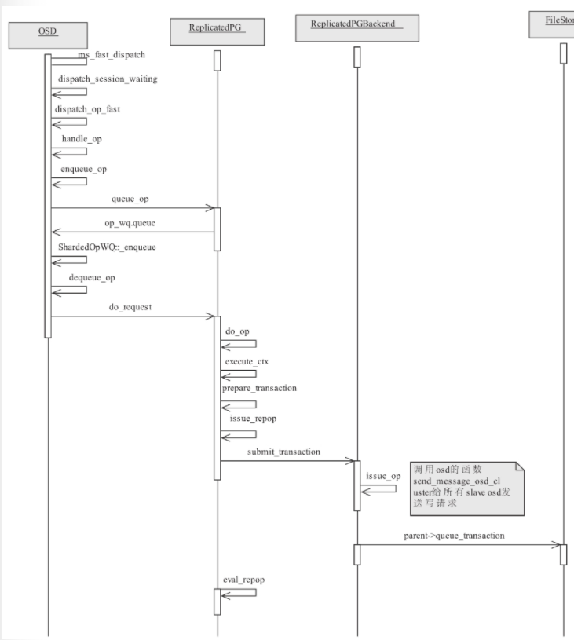

# OSD Source Code Analysis

## Operation Handle

操作处理分为三个阶段：
* 入队阶段 - 从函数`ms_fast_dispatch`到函数`enqueue_op`为止。
* 调度阶段 - 这个阶段在`OSD::ShardedOpWQ::_process`中处理入队的`OpSchedulerItem`。
* 执行阶段 - 这个阶段分为两个步骤：
    * 复制阶段 - 核心工作就是把封装好的事务通过网络分发到从副本上。
    * 写入阶段 - 最后调用本地ObjectStore完成本地对象的数据写入。



### Enqueue Phase


具体实现流程：
* 首先检查`service`，如果已经停止了，就直接返回。
* 调用函数`op_tracker.create_request`把`Message`转换为`OpRequest`。
* 对于不同的客户端版本采取不同的做法：
  * 新式客户端（具有功能`CEPH_FEATUREMASK_RESEND_ON_SPLIT`），直接调用`enqueue_op`入队处理。
  * 老式客户端：
    * 获取`nextmap`（也就是最新的`osdmap`）和`session`。
    * 调用函数`update_waiting_for_pg`来更新`session`里保存的OSDMap信息。
    * 加入`waiting_on_map` 入队处理。
    * 调用`dispatch_session_waiting`处理，它循环调用函数`enqueue_op`入队。

```cpp
void OSD::ms_fast_dispatch(Message *m) {

#ifdef HAVE_JAEGER
    jaeger_tracing::init_tracer("osd-services-reinit");
    dout(10) << "jaeger tracer after " << opentracing::Tracer::Global() << dendl;
    auto dispatch_span = jaeger_tracing::new_span(__func__);
#endif
    FUNCTRACE(cct);
    if (service.is_stopping()) {
        m->put();
        return;
    }

    // peering event?
    switch (m->get_type()) {
    case CEPH_MSG_PING:
        dout(10) << "ping from " << m->get_source() << dendl;
        m->put();
        return;
    case MSG_OSD_FORCE_RECOVERY:
        handle_fast_force_recovery(static_cast<MOSDForceRecovery *>(m));
        return;
    case MSG_OSD_SCRUB2:
        handle_fast_scrub(static_cast<MOSDScrub2 *>(m));
        return;

    case MSG_OSD_PG_CREATE2:
        return handle_fast_pg_create(static_cast<MOSDPGCreate2 *>(m));
    case MSG_OSD_PG_QUERY:
        return handle_fast_pg_query(static_cast<MOSDPGQuery *>(m));
    case MSG_OSD_PG_NOTIFY:
        return handle_fast_pg_notify(static_cast<MOSDPGNotify *>(m));
    case MSG_OSD_PG_INFO:
        return handle_fast_pg_info(static_cast<MOSDPGInfo *>(m));
    case MSG_OSD_PG_REMOVE:
        return handle_fast_pg_remove(static_cast<MOSDPGRemove *>(m));

        // these are single-pg messages that handle themselves
    case MSG_OSD_PG_LOG:
    case MSG_OSD_PG_TRIM:
    case MSG_OSD_PG_NOTIFY2:
    case MSG_OSD_PG_QUERY2:
    case MSG_OSD_PG_INFO2:
    case MSG_OSD_BACKFILL_RESERVE:
    case MSG_OSD_RECOVERY_RESERVE:
    case MSG_OSD_PG_LEASE:
    case MSG_OSD_PG_LEASE_ACK: {
        MOSDPeeringOp *pm = static_cast<MOSDPeeringOp *>(m);
        if (require_osd_peer(pm)) {
            enqueue_peering_evt(pm->get_spg(), PGPeeringEventRef(pm->get_event()));
        }
        pm->put();
        return;
    }
    }

    OpRequestRef op = op_tracker.create_request<OpRequest, Message *>(m);
    {
#ifdef WITH_LTTNG
        osd_reqid_t reqid = op->get_reqid();
#endif
        tracepoint(osd, ms_fast_dispatch, reqid.name._type, reqid.name._num, reqid.tid, reqid.inc);
    }
#ifdef HAVE_JAEGER
    op->set_osd_parent_span(dispatch_span);
    if (op->osd_parent_span) {
        auto op_req_span = jaeger_tracing::child_span("op-request-created", op->osd_parent_span);
        op->set_osd_parent_span(op_req_span);
    }
#endif
    if (m->trace)
        op->osd_trace.init("osd op", &trace_endpoint, &m->trace);

    // note sender epoch, min req's epoch
    op->sent_epoch = static_cast<MOSDFastDispatchOp *>(m)->get_map_epoch();
    op->min_epoch = static_cast<MOSDFastDispatchOp *>(m)->get_min_epoch();
    ceph_assert(op->min_epoch <= op->sent_epoch);   // sanity check!

    service.maybe_inject_dispatch_delay();

    if (m->get_connection()->has_features(CEPH_FEATUREMASK_RESEND_ON_SPLIT) ||
        m->get_type() != CEPH_MSG_OSD_OP) {
        // queue it directly
        enqueue_op(static_cast<MOSDFastDispatchOp *>(m)->get_spg(),
                   std::move(op),
                   static_cast<MOSDFastDispatchOp *>(m)->get_map_epoch());
    } else {
        // legacy client, and this is an MOSDOp (the *only* fast dispatch
        // message that didn't have an explicit spg_t); we need to map
        // them to an spg_t while preserving delivery order.
        auto priv = m->get_connection()->get_priv();
        if (auto session = static_cast<Session *>(priv.get()); session) {
            std::lock_guard l{session->session_dispatch_lock};
            op->get();
            session->waiting_on_map.push_back(*op);
            OSDMapRef nextmap = service.get_nextmap_reserved();
            dispatch_session_waiting(session, nextmap);
            service.release_map(nextmap);
        }
    }
    OID_EVENT_TRACE_WITH_MSG(m, "MS_FAST_DISPATCH_END", false);
}
```

```cpp
void OSD::dispatch_session_waiting(const ceph::ref_t<Session> &session, OSDMapRef osdmap) {
    ceph_assert(ceph_mutex_is_locked(session->session_dispatch_lock));

    auto i = session->waiting_on_map.begin();
    while (i != session->waiting_on_map.end()) {
        OpRequestRef op = &(*i);
        ceph_assert(ms_can_fast_dispatch(op->get_req()));
        auto m = op->get_req<MOSDFastDispatchOp>();
        if (m->get_min_epoch() > osdmap->get_epoch()) {
            break;
        }
        session->waiting_on_map.erase(i++);
        op->put();

        spg_t pgid;
        if (m->get_type() == CEPH_MSG_OSD_OP) {
            pg_t actual_pgid = osdmap->raw_pg_to_pg(static_cast<const MOSDOp *>(m)->get_pg());
            if (!osdmap->get_primary_shard(actual_pgid, &pgid)) {
                continue;
            }
        } else {
            pgid = m->get_spg();
        }
        enqueue_op(pgid, std::move(op), m->get_map_epoch());
    }

    if (session->waiting_on_map.empty()) {
        clear_session_waiting_on_map(session);
    } else {
        register_session_waiting_on_map(session);
    }
}
```

`enqueue_op`入队。

```cpp
void OSD::enqueue_op(spg_t pg, OpRequestRef &&op, epoch_t epoch) {
    const utime_t stamp = op->get_req()->get_recv_stamp();
    const utime_t latency = ceph_clock_now() - stamp;
    const unsigned priority = op->get_req()->get_priority();
    const int cost = op->get_req()->get_cost();
    const uint64_t owner = op->get_req()->get_source().num();
    const int type = op->get_req()->get_type();

    dout(15) << "enqueue_op " << op << " prio " << priority << " type " << type << " cost " << cost
             << " latency " << latency << " epoch " << epoch << " " << *(op->get_req()) << dendl;
    op->osd_trace.event("enqueue op");
    op->osd_trace.keyval("priority", priority);
    op->osd_trace.keyval("cost", cost);
#ifdef HAVE_JAEGER
    if (op->osd_parent_span) {
        auto enqueue_span = jaeger_tracing::child_span(__func__, op->osd_parent_span);
        enqueue_span->Log({{"priority", priority},
                           {"cost", cost},
                           {"epoch", epoch},
                           {"owner", owner},
                           {"type", type}});
    }
#endif
    op->mark_queued_for_pg();
    logger->tinc(l_osd_op_before_queue_op_lat, latency);
    if (type == MSG_OSD_PG_PUSH || type == MSG_OSD_PG_PUSH_REPLY) {
        op_shardedwq.queue(OpSchedulerItem(
            unique_ptr<OpSchedulerItem::OpQueueable>(new PGRecoveryMsg(pg, std::move(op))),
            cost,
            priority,
            stamp,
            owner,
            epoch));
    } else {
        op_shardedwq.queue(OpSchedulerItem(
            unique_ptr<OpSchedulerItem::OpQueueable>(new PGOpItem(pg, std::move(op))),
            cost,
            priority,
            stamp,
            owner,
            epoch));
    }
}
```

### Schedule Phase

由此可见`OpSchedulerItem::OpQueueable`是context，进一步的接口为`PGOpQueueable`。

执行时将进入`run`函数。

```cpp
void PGOpItem::run(OSD *osd, OSDShard *sdata, PGRef &pg, ThreadPool::TPHandle &handle) {
#ifdef HAVE_JAEGER
    auto PGOpItem_span = jaeger_tracing::child_span("PGOpItem::run", op->osd_parent_span);
#endif
    osd->dequeue_op(pg, op, handle);
    pg->unlock();
}

void PGPeeringItem::run(OSD *osd, OSDShard *sdata, PGRef &pg, ThreadPool::TPHandle &handle) {
    osd->dequeue_peering_evt(sdata, pg.get(), evt, handle);
}

void PGSnapTrim::run(OSD *osd, OSDShard *sdata, PGRef &pg, ThreadPool::TPHandle &handle) {
    pg->snap_trimmer(epoch_queued);
    pg->unlock();
}

void PGScrub::run(OSD *osd, OSDShard *sdata, PGRef &pg, ThreadPool::TPHandle &handle) {
    pg->scrub(epoch_queued, handle);
    pg->unlock();
}

void PGScrubAfterRepair::run(OSD *osd,
                             OSDShard *sdata,
                             PGRef &pg,
                             ThreadPool::TPHandle &handle) {
    pg->recovery_scrub(epoch_queued, handle);
    pg->unlock();
}

void PGScrubResched::run(OSD *osd, OSDShard *sdata, PGRef &pg, ThreadPool::TPHandle &handle) {
    pg->scrub_send_scrub_resched(epoch_queued, handle);
    pg->unlock();
}

void PGScrubResourcesOK::run(OSD *osd,
                             OSDShard *sdata,
                             PGRef &pg,
                             ThreadPool::TPHandle &handle) {
    pg->scrub_send_resources_granted(epoch_queued, handle);
    pg->unlock();
}

void PGScrubDenied::run(OSD *osd, OSDShard *sdata, PGRef &pg, ThreadPool::TPHandle &handle) {
    pg->scrub_send_resources_denied(epoch_queued, handle);
    pg->unlock();
}

void PGScrubPushesUpdate::run(OSD *osd,
                              OSDShard *sdata,
                              PGRef &pg,
                              ThreadPool::TPHandle &handle) {
    pg->scrub_send_pushes_update(epoch_queued, handle);
    pg->unlock();
}

void PGScrubAppliedUpdate::run(OSD *osd,
                               OSDShard *sdata,
                               PGRef &pg,
                               ThreadPool::TPHandle &handle) {
    pg->scrub_send_applied_update(epoch_queued, handle);
    pg->unlock();
}

void PGScrubUnblocked::run(OSD *osd, OSDShard *sdata, PGRef &pg, ThreadPool::TPHandle &handle) {
    pg->scrub_send_unblocking(epoch_queued, handle);
    pg->unlock();
}

void PGScrubDigestUpdate::run(OSD *osd,
                              OSDShard *sdata,
                              PGRef &pg,
                              ThreadPool::TPHandle &handle) {
    pg->scrub_send_digest_update(epoch_queued, handle);
    pg->unlock();
}

void PGScrubGotLocalMap::run(OSD *osd,
                             OSDShard *sdata,
                             PGRef &pg,
                             ThreadPool::TPHandle &handle) {
    pg->scrub_send_local_map_ready(epoch_queued, handle);
    pg->unlock();
}

void PGScrubGotReplMaps::run(OSD *osd,
                             OSDShard *sdata,
                             PGRef &pg,
                             ThreadPool::TPHandle &handle) {
    pg->scrub_send_replmaps_ready(epoch_queued, handle);
    pg->unlock();
}

void PGScrubMapsCompared::run(OSD *osd,
                              OSDShard *sdata,
                              PGRef &pg,
                              ThreadPool::TPHandle &handle) {
    pg->scrub_send_maps_compared(epoch_queued, handle);
    pg->unlock();
}

void PGRepScrub::run(OSD *osd, OSDShard *sdata, PGRef &pg, ThreadPool::TPHandle &handle) {
    pg->replica_scrub(epoch_queued, activation_index, handle);
    pg->unlock();
}

void PGRepScrubResched::run(OSD *osd,
                            OSDShard *sdata,
                            PGRef &pg,
                            ThreadPool::TPHandle &handle) {
    pg->replica_scrub_resched(epoch_queued, activation_index, handle);
    pg->unlock();
}

void PGScrubReplicaPushes::run([[maybe_unused]] OSD *osd,
                               OSDShard *sdata,
                               PGRef &pg,
                               ThreadPool::TPHandle &handle) {
    pg->scrub_send_replica_pushes(epoch_queued, handle);
    pg->unlock();
}

void PGScrubScrubFinished::run([[maybe_unused]] OSD *osd,
                               OSDShard *sdata,
                               PGRef &pg,
                               ThreadPool::TPHandle &handle) {
    pg->scrub_send_scrub_is_finished(epoch_queued, handle);
    pg->unlock();
}

void PGScrubGetNextChunk::run([[maybe_unused]] OSD *osd,
                              OSDShard *sdata,
                              PGRef &pg,
                              ThreadPool::TPHandle &handle) {
    pg->scrub_send_get_next_chunk(epoch_queued, handle);
    pg->unlock();
}

void PGScrubChunkIsBusy::run([[maybe_unused]] OSD *osd,
                             OSDShard *sdata,
                             PGRef &pg,
                             ThreadPool::TPHandle &handle) {
    pg->scrub_send_chunk_busy(epoch_queued, handle);
    pg->unlock();
}

void PGScrubChunkIsFree::run([[maybe_unused]] OSD *osd,
                             OSDShard *sdata,
                             PGRef &pg,
                             ThreadPool::TPHandle &handle) {
    pg->scrub_send_chunk_free(epoch_queued, handle);
    pg->unlock();
}

void PGRecovery::run(OSD *osd, OSDShard *sdata, PGRef &pg, ThreadPool::TPHandle &handle) {
    osd->do_recovery(pg.get(), epoch_queued, reserved_pushes, handle);
    pg->unlock();
}

void PGRecoveryContext::run(OSD *osd,
                            OSDShard *sdata,
                            PGRef &pg,
                            ThreadPool::TPHandle &handle) {
    c.release()->complete(handle);
    pg->unlock();
}

void PGDelete::run(OSD *osd, OSDShard *sdata, PGRef &pg, ThreadPool::TPHandle &handle) {
    osd->dequeue_delete(sdata, pg.get(), epoch_queued, handle);
}

void PGRecoveryMsg::run(OSD *osd, OSDShard *sdata, PGRef &pg, ThreadPool::TPHandle &handle) {
    osd->dequeue_op(pg, op, handle);
    pg->unlock();
}
```

而`OpScheduler`是调度器接口，负责调度`OpSchedulerItem`，后者封装了`OpSchedulerItem::OpQueueable`。

```cpp
OpSchedulerRef make_scheduler(CephContext *cct, uint32_t num_shards, bool is_rotational) {
    const std::string *type = &cct->_conf->osd_op_queue;
    if (*type == "debug_random") {
        static const std::string index_lookup[] = {"mclock_scheduler", "wpq"};
        srand(time(NULL));
        unsigned which = rand() % (sizeof(index_lookup) / sizeof(index_lookup[0]));
        type = &index_lookup[which];
    }

    if (*type == "wpq") {
        // default is 'wpq'
        return std::make_unique<
            ClassedOpQueueScheduler<WeightedPriorityQueue<OpSchedulerItem, client>>>(
            cct, cct->_conf->osd_op_pq_max_tokens_per_priority, cct->_conf->osd_op_pq_min_cost);
    } else if (*type == "mclock_scheduler") {
        return std::make_unique<mClockScheduler>(cct, num_shards, is_rotational);
    } else {
        ceph_assert("Invalid choice of wq" == 0);
    }
}
```

最后`OSD::ShardedOpWQ::_process`将会从`OpScheduler`取出`OpSchedulerItem`，调用它的`run`。

```cpp
void run(OSD *osd, OSDShard *sdata, PGRef &pg, ThreadPool::TPHandle &handle) {
    qitem->run(osd, sdata, pg, handle);
}
```

导致相应的`OpSchedulerItem::OpQueueable::run`被调用，其将调用`OSD`的相关函数。

### Execute Phase(Only Write)

以`PGOpItem`为例。

```cpp
void OSD::dequeue_op(PGRef pg, OpRequestRef op, ThreadPool::TPHandle &handle) {
    const Message *m = op->get_req();

    FUNCTRACE(cct);
    OID_EVENT_TRACE_WITH_MSG(m, "DEQUEUE_OP_BEGIN", false);

    utime_t now = ceph_clock_now();
    op->set_dequeued_time(now);

    utime_t latency = now - m->get_recv_stamp();
    dout(10) << "dequeue_op " << op << " prio " << m->get_priority() << " cost " << m->get_cost()
             << " latency " << latency << " " << *m << " pg " << *pg << dendl;

    logger->tinc(l_osd_op_before_dequeue_op_lat, latency);

    service.maybe_share_map(m->get_connection().get(), pg->get_osdmap(), op->sent_epoch);

    if (pg->is_deleting())
        return;

    op->mark_reached_pg();
    op->osd_trace.event("dequeue_op");

    pg->do_request(op, handle);

    // finish
    dout(10) << "dequeue_op " << op << " finish" << dendl;
    OID_EVENT_TRACE_WITH_MSG(m, "DEQUEUE_OP_END", false);
}
```

然后进入`PG::do_rquest`，其实现为`PrimaryLogPG::do_request`。

```cpp
void PrimaryLogPG::do_request(OpRequestRef &op, ThreadPool::TPHandle &handle) {
    if (op->osd_trace) {
        op->pg_trace.init("pg op", &trace_endpoint, &op->osd_trace);
        op->pg_trace.event("do request");
    }
#ifdef HAVE_JAEGER
    if (op->osd_parent_span) {
        auto do_req_span = jaeger_tracing::child_span(__func__, op->osd_parent_span);
    }
#endif
    // make sure we have a new enough map
    auto p = waiting_for_map.find(op->get_source());
    if (p != waiting_for_map.end()) {
        // preserve ordering
        dout(20) << __func__ << " waiting_for_map " << p->first << " not empty, queueing" << dendl;
        p->second.push_back(op);
        op->mark_delayed("waiting_for_map not empty");
        return;
    }
    if (!have_same_or_newer_map(op->min_epoch)) {
        dout(20) << __func__ << " min " << op->min_epoch << ", queue on waiting_for_map "
                 << op->get_source() << dendl;
        waiting_for_map[op->get_source()].push_back(op);
        op->mark_delayed("op must wait for map");
        osd->request_osdmap_update(op->min_epoch);
        return;
    }

    if (can_discard_request(op)) {
        return;
    }

    // pg-wide backoffs
    const Message *m = op->get_req();
    int msg_type = m->get_type();
    if (m->get_connection()->has_feature(CEPH_FEATURE_RADOS_BACKOFF)) {
        auto session = ceph::ref_cast<Session>(m->get_connection()->get_priv());
        if (!session)
            return;   // drop it.
        if (msg_type == CEPH_MSG_OSD_OP) {
            if (session->check_backoff(cct, info.pgid, info.pgid.pgid.get_hobj_start(), m)) {
                return;
            }

            bool backoff = is_down() || is_incomplete() || (!is_active() && is_peered());
            if (g_conf()->osd_backoff_on_peering && !backoff) {
                if (is_peering()) {
                    backoff = true;
                }
            }
            if (backoff) {
                add_pg_backoff(session);
                return;
            }
        }
        // pg backoff acks at pg-level
        if (msg_type == CEPH_MSG_OSD_BACKOFF) {
            const MOSDBackoff *ba = static_cast<const MOSDBackoff *>(m);
            if (ba->begin != ba->end) {
                handle_backoff(op);
                return;
            }
        }
    }

    if (!is_peered()) {
        // Delay unless PGBackend says it's ok
        if (pgbackend->can_handle_while_inactive(op)) {
            // hande replica message
            bool handled = pgbackend->handle_message(op);
            ceph_assert(handled);
            return;
        } else {
            waiting_for_peered.push_back(op);
            op->mark_delayed("waiting for peered");
            return;
        }
    }

    if (recovery_state.needs_flush()) {
        dout(20) << "waiting for flush on " << op << dendl;
        waiting_for_flush.push_back(op);
        op->mark_delayed("waiting for flush");
        return;
    }

    ceph_assert(is_peered() && !recovery_state.needs_flush());
    if (pgbackend->handle_message(op))
        return;

    switch (msg_type) {
    case CEPH_MSG_OSD_OP:
    case CEPH_MSG_OSD_BACKOFF:
        if (!is_active()) {
            dout(20) << " peered, not active, waiting for active on " << op << dendl;
            waiting_for_active.push_back(op);
            op->mark_delayed("waiting for active");
            return;
        }
        switch (msg_type) {
        case CEPH_MSG_OSD_OP:
            // verify client features
            if ((pool.info.has_tiers() || pool.info.is_tier()) &&
                !op->has_feature(CEPH_FEATURE_OSD_CACHEPOOL)) {
                osd->reply_op_error(op, -EOPNOTSUPP);
                return;
            }
            do_op(op);
            break;
        case CEPH_MSG_OSD_BACKOFF:
            // object-level backoff acks handled in osdop context
            handle_backoff(op);
            break;
        }
        break;

    case MSG_OSD_PG_SCAN:
        do_scan(op, handle);
        break;

    case MSG_OSD_PG_BACKFILL:
        do_backfill(op);
        break;

    case MSG_OSD_PG_BACKFILL_REMOVE:
        do_backfill_remove(op);
        break;

    case MSG_OSD_SCRUB_RESERVE: {
        if (!m_scrubber) {
            osd->reply_op_error(op, -EAGAIN);
            return;
        }
        auto m = op->get_req<MOSDScrubReserve>();
        switch (m->type) {
        case MOSDScrubReserve::REQUEST:
            m_scrubber->handle_scrub_reserve_request(op);
            break;
        case MOSDScrubReserve::GRANT:
            m_scrubber->handle_scrub_reserve_grant(op, m->from);
            break;
        case MOSDScrubReserve::REJECT:
            m_scrubber->handle_scrub_reserve_reject(op, m->from);
            break;
        case MOSDScrubReserve::RELEASE:
            m_scrubber->handle_scrub_reserve_release(op);
            break;
        }
    } break;

    case MSG_OSD_REP_SCRUB:
        replica_scrub(op, handle);
        break;

    case MSG_OSD_REP_SCRUBMAP:
        do_replica_scrub_map(op);
        break;

    case MSG_OSD_PG_UPDATE_LOG_MISSING:
        do_update_log_missing(op);
        break;

    case MSG_OSD_PG_UPDATE_LOG_MISSING_REPLY:
        do_update_log_missing_reply(op);
        break;

    default:
        ceph_abort_msg("bad message type in do_request");
    }
}
```

以`backfill`为例。

```cpp
void PrimaryLogPG::do_backfill(OpRequestRef op) {
    auto m = op->get_req<MOSDPGBackfill>();
    ceph_assert(m->get_type() == MSG_OSD_PG_BACKFILL);
    dout(10) << "do_backfill " << *m << dendl;

    op->mark_started();

    switch (m->op) {
    case MOSDPGBackfill::OP_BACKFILL_FINISH: {
        ceph_assert(cct->_conf->osd_kill_backfill_at != 1);

        MOSDPGBackfill *reply = new MOSDPGBackfill(MOSDPGBackfill::OP_BACKFILL_FINISH_ACK,
                                                   get_osdmap_epoch(),
                                                   m->query_epoch,
                                                   spg_t(info.pgid.pgid, get_primary().shard));
        reply->set_priority(get_recovery_op_priority());
        osd->send_message_osd_cluster(reply, m->get_connection());
        queue_peering_event(PGPeeringEventRef(std::make_shared<PGPeeringEvent>(
            get_osdmap_epoch(), get_osdmap_epoch(), RecoveryDone())));
    }
        // fall-thru

    case MOSDPGBackfill::OP_BACKFILL_PROGRESS: {
        ceph_assert(cct->_conf->osd_kill_backfill_at != 2);

        ObjectStore::Transaction t;
        recovery_state.update_backfill_progress(
            m->last_backfill, m->stats, m->op == MOSDPGBackfill::OP_BACKFILL_PROGRESS, t);

        int tr = osd->store->queue_transaction(ch, std::move(t), NULL);
        ceph_assert(tr == 0);
    } break;

    case MOSDPGBackfill::OP_BACKFILL_FINISH_ACK: {
        ceph_assert(is_primary());
        ceph_assert(cct->_conf->osd_kill_backfill_at != 3);
        finish_recovery_op(hobject_t::get_max());
    } break;
    }
}
```

最后将封装成`ObjectStore::Transaction`，调用`ObjectStore::queue_transaction`。

`ObjectStore`的实现目前有：
* `BlueStore`。
* `FileStore`。
* `KStore`。
* `MemStore`。

目前主要的实现是`BlueStore`。

```cpp
// in ObjectStore
int queue_transaction(CollectionHandle& ch,
	Transaction&& t,
	TrackedOpRef op = TrackedOpRef(),
	ThreadPool::TPHandle *handle = NULL) {
  std::vector<Transaction> tls;
  tls.push_back(std::move(t));
  return queue_transactions(ch, tls, op, handle);
}

// in BlueStore
int BlueStore::queue_transactions(CollectionHandle &ch,
                                  vector<Transaction> &tls,
                                  TrackedOpRef op,
                                  ThreadPool::TPHandle *handle) {
    FUNCTRACE(cct);
    list<Context *> on_applied, on_commit, on_applied_sync;
    ObjectStore::Transaction::collect_contexts(tls, &on_applied, &on_commit, &on_applied_sync);

    auto start = mono_clock::now();

    Collection *c = static_cast<Collection *>(ch.get());
    OpSequencer *osr = c->osr.get();
    dout(10) << __func__ << " ch " << c << " " << c->cid << dendl;

    // prepare
    TransContext *txc = _txc_create(static_cast<Collection *>(ch.get()), osr, &on_commit, op);

    // With HM-SMR drives (and ZNS SSDs) we want the I/O allocation and I/O
    // submission to happen atomically because if I/O submission happens in a
    // different order than I/O allocation, we end up issuing non-sequential
    // writes to the drive.  This is a temporary solution until ZONE APPEND
    // support matures in the kernel.  For more information please see:
    // https://www.usenix.org/conference/vault20/presentation/bjorling
    if (bdev->is_smr()) {
        atomic_alloc_and_submit_lock.lock();
    }
    for (vector<Transaction>::iterator p = tls.begin(); p != tls.end(); ++p) {
        txc->bytes += (*p).get_num_bytes();
        _txc_add_transaction(txc, &(*p));
    }
    _txc_calc_cost(txc);

    _txc_write_nodes(txc, txc->t);

    // journal deferred items
    if (txc->deferred_txn) {
        txc->deferred_txn->seq = ++deferred_seq;
        bufferlist bl;
        encode(*txc->deferred_txn, bl);
        string key;
        get_deferred_key(txc->deferred_txn->seq, &key);
        txc->t->set(PREFIX_DEFERRED, key, bl);
    }

    _txc_finalize_kv(txc, txc->t);

#ifdef WITH_BLKIN
    if (txc->trace) {
        txc->trace.event("txc encode finished");
    }
#endif

    if (handle)
        handle->suspend_tp_timeout();

    auto tstart = mono_clock::now();

    if (!throttle.try_start_transaction(*db, *txc, tstart)) {
        // ensure we do not block here because of deferred writes
        dout(10) << __func__ << " failed get throttle_deferred_bytes, aggressive" << dendl;
        ++deferred_aggressive;
        deferred_try_submit();
        {
            // wake up any previously finished deferred events
            std::lock_guard l(kv_lock);
            if (!kv_sync_in_progress) {
                kv_sync_in_progress = true;
                kv_cond.notify_one();
            }
        }
        throttle.finish_start_transaction(*db, *txc, tstart);
        --deferred_aggressive;
    }
    auto tend = mono_clock::now();

    if (handle)
        handle->reset_tp_timeout();

    logger->inc(l_bluestore_txc);

    // execute (start)
    _txc_state_proc(txc);

    if (bdev->is_smr()) {
        atomic_alloc_and_submit_lock.unlock();
    }

    // we're immediately readable (unlike FileStore)
    for (auto c : on_applied_sync) {
        c->complete(0);
    }
    if (!on_applied.empty()) {
        if (c->commit_queue) {
            c->commit_queue->queue(on_applied);
        } else {
            finisher.queue(on_applied);
        }
    }

#ifdef WITH_BLKIN
    if (txc->trace) {
        txc->trace.event("txc applied");
    }
#endif

    log_latency("submit_transact",
                l_bluestore_submit_lat,
                mono_clock::now() - start,
                cct->_conf->bluestore_log_op_age);
    log_latency("throttle_transact",
                l_bluestore_throttle_lat,
                tend - tstart,
                cct->_conf->bluestore_log_op_age);
    return 0;
}

BlueStore::TransContext *BlueStore::_txc_create(Collection *c,
                                                OpSequencer *osr,
                                                list<Context *> *on_commits,
                                                TrackedOpRef osd_op) {
    TransContext *txc = new TransContext(cct, c, osr, on_commits);
    txc->t = db->get_transaction();

#ifdef WITH_BLKIN
    if (osd_op && osd_op->pg_trace) {
        txc->trace.init("TransContext", &trace_endpoint, &osd_op->pg_trace);
        txc->trace.event("txc create");
        txc->trace.keyval("txc seq", txc->seq);
    }
#endif

    osr->queue_new(txc);
    dout(20) << __func__ << " osr " << osr << " = " << txc << " seq " << txc->seq << dendl;
    return txc;
}

void BlueStore::_txc_calc_cost(TransContext *txc) {
    // one "io" for the kv commit
    auto ios = 1 + txc->ioc.get_num_ios();
    auto cost = throttle_cost_per_io.load();
    txc->cost = ios * cost + txc->bytes;
    txc->ios = ios;
    dout(10) << __func__ << " " << txc << " cost " << txc->cost << " (" << ios << " ios * " << cost
             << " + " << txc->bytes << " bytes)" << dendl;
}

void BlueStore::_txc_write_nodes(TransContext *txc, KeyValueDB::Transaction t) {
    dout(20) << __func__ << " txc " << txc << " onodes " << txc->onodes << " shared_blobs "
             << txc->shared_blobs << dendl;

    // finalize onodes
    for (auto o : txc->onodes) {
        _record_onode(o, t);
        o->flushing_count++;
    }

    // objects we modified but didn't affect the onode
    auto p = txc->modified_objects.begin();
    while (p != txc->modified_objects.end()) {
        if (txc->onodes.count(*p) == 0) {
            (*p)->flushing_count++;
            ++p;
        } else {
            // remove dups with onodes list to avoid problems in _txc_finish
            p = txc->modified_objects.erase(p);
        }
    }

    // finalize shared_blobs
    for (auto sb : txc->shared_blobs) {
        string key;
        auto sbid = sb->get_sbid();
        get_shared_blob_key(sbid, &key);
        if (sb->persistent->empty()) {
            dout(20) << __func__ << " shared_blob 0x" << std::hex << sbid << std::dec << " is empty"
                     << dendl;
            t->rmkey(PREFIX_SHARED_BLOB, key);
        } else {
            bufferlist bl;
            encode(*(sb->persistent), bl);
            dout(20) << __func__ << " shared_blob 0x" << std::hex << sbid << std::dec << " is "
                     << bl.length() << " " << *sb << dendl;
            t->set(PREFIX_SHARED_BLOB, key, bl);
        }
    }
}
```

```cpp
void BlueStore::_txc_state_proc(TransContext *txc) {
    while (true) {
        dout(10) << __func__ << " txc " << txc << " " << txc->get_state_name() << dendl;
        switch (txc->get_state()) {
        // Phase 1: submit AIO
        case TransContext::STATE_PREPARE:
            throttle.log_state_latency(*txc, logger, l_bluestore_state_prepare_lat);
            if (txc->ioc.has_pending_aios()) {
                txc->set_state(TransContext::STATE_AIO_WAIT);
#ifdef WITH_BLKIN
                if (txc->trace) {
                    txc->trace.keyval("pending aios", txc->ioc.num_pending.load());
                }
#endif
                txc->had_ios = true;
                _txc_aio_submit(txc);
                return;
            }
            // ** fall-thru **
        // Phase 2: wait for AIO
        case TransContext::STATE_AIO_WAIT: {
            mono_clock::duration lat =
                throttle.log_state_latency(*txc, logger, l_bluestore_state_aio_wait_lat);
            if (ceph::to_seconds<double>(lat) >= cct->_conf->bluestore_log_op_age) {
                dout(0) << __func__ << " slow aio_wait, txc = " << txc << ", latency = " << lat
                        << dendl;
            }
        }

        _txc_finish_io(txc);   // may trigger blocked txc's too
        return;

        // Phase 3: Prepare KV transaction
        case TransContext::STATE_IO_DONE:
            ceph_assert(ceph_mutex_is_locked(txc->osr->qlock));   // see _txc_finish_io
            if (txc->had_ios) {
                ++txc->osr->txc_with_unstable_io;
            }
            throttle.log_state_latency(*txc, logger, l_bluestore_state_io_done_lat);
            txc->set_state(TransContext::STATE_KV_QUEUED);
            if (cct->_conf->bluestore_sync_submit_transaction) {
                if (txc->last_nid >= nid_max || txc->last_blobid >= blobid_max) {
                    dout(20) << __func__ << " last_{nid,blobid} exceeds max, submit via kv thread"
                             << dendl;
                } else if (txc->osr->kv_committing_serially) {
                    dout(20) << __func__ << " prior txc submitted via kv thread, us too" << dendl;
                    // note: this is starvation-prone.  once we have a txc in a busy
                    // sequencer that is committing serially it is possible to keep
                    // submitting new transactions fast enough that we get stuck doing
                    // so.  the alternative is to block here... fixme?
                } else if (txc->osr->txc_with_unstable_io) {
                    dout(20) << __func__ << " prior txc(s) with unstable ios "
                             << txc->osr->txc_with_unstable_io.load() << dendl;
                } else if (cct->_conf->bluestore_debug_randomize_serial_transaction &&
                           rand() % cct->_conf->bluestore_debug_randomize_serial_transaction == 0) {
                    dout(20) << __func__ << " DEBUG randomly forcing submit via kv thread" << dendl;
                } else {
                    _txc_apply_kv(txc, true);
                }
            }
            {
                std::lock_guard l(kv_lock);
                kv_queue.push_back(txc);
                if (!kv_sync_in_progress) {
                    kv_sync_in_progress = true;
                    kv_cond.notify_one();
                }
                if (txc->get_state() != TransContext::STATE_KV_SUBMITTED) {
                    kv_queue_unsubmitted.push_back(txc);
                    ++txc->osr->kv_committing_serially;
                }
                if (txc->had_ios)
                    kv_ios++;
                kv_throttle_costs += txc->cost;
            }
            return;
        // Phase 4: Commit KV Transaction
        case TransContext::STATE_KV_SUBMITTED:
            _txc_committed_kv(txc);
            // ** fall-thru **

        case TransContext::STATE_KV_DONE:
            throttle.log_state_latency(*txc, logger, l_bluestore_state_kv_done_lat);
            if (txc->deferred_txn) {
                txc->set_state(TransContext::STATE_DEFERRED_QUEUED);
                _deferred_queue(txc);
                return;
            }
            txc->set_state(TransContext::STATE_FINISHING);
            break;

        case TransContext::STATE_DEFERRED_CLEANUP:
            throttle.log_state_latency(*txc, logger, l_bluestore_state_deferred_cleanup_lat);
            txc->set_state(TransContext::STATE_FINISHING);
            // ** fall-thru **

        case TransContext::STATE_FINISHING:
            throttle.log_state_latency(*txc, logger, l_bluestore_state_finishing_lat);
            _txc_finish(txc);
            return;

        default:
            derr << __func__ << " unexpected txc " << txc << " state " << txc->get_state_name()
                 << dendl;
            ceph_abort_msg("unexpected txc state");
            return;
        }
    }
}
```

### Execute Phase(Replicate + Write)

以`do_op`为例。

```cpp
/** do_op - do an op
 * pg lock will be held (if multithreaded)
 * osd_lock NOT held.
 */
void PrimaryLogPG::do_op(OpRequestRef &op) {
    FUNCTRACE(cct);
    // NOTE: take a non-const pointer here; we must be careful not to
    // change anything that will break other reads on m (operator<<).
    MOSDOp *m = static_cast<MOSDOp *>(op->get_nonconst_req());
    ceph_assert(m->get_type() == CEPH_MSG_OSD_OP);
    if (m->finish_decode()) {
        op->reset_desc();   // for TrackedOp
        m->clear_payload();
    }

    dout(20) << __func__ << ": op " << *m << dendl;

    const hobject_t head = m->get_hobj().get_head();

    if (!info.pgid.pgid.contains(info.pgid.pgid.get_split_bits(pool.info.get_pg_num()), head)) {
        derr << __func__ << " " << info.pgid.pgid << " does not contain " << head << " pg_num "
             << pool.info.get_pg_num() << " hash " << std::hex << head.get_hash() << std::dec
             << dendl;
        osd->clog->warn() << info.pgid.pgid << " does not contain " << head << " op " << *m;
        ceph_assert(!cct->_conf->osd_debug_misdirected_ops);
        return;
    }

    bool can_backoff = m->get_connection()->has_feature(CEPH_FEATURE_RADOS_BACKOFF);
    ceph::ref_t<Session> session;
    if (can_backoff) {
        session = static_cast<Session *>(m->get_connection()->get_priv().get());
        if (!session.get()) {
            dout(10) << __func__ << " no session" << dendl;
            return;
        }

        if (session->check_backoff(cct, info.pgid, head, m)) {
            return;
        }
    }

    if (m->has_flag(CEPH_OSD_FLAG_PARALLELEXEC)) {
        // not implemented.
        dout(20) << __func__ << ": PARALLELEXEC not implemented " << *m << dendl;
        osd->reply_op_error(op, -EINVAL);
        return;
    }

    {
        int r = op->maybe_init_op_info(*get_osdmap());
        if (r) {
            osd->reply_op_error(op, r);
            return;
        }
    }

    if ((m->get_flags() & (CEPH_OSD_FLAG_BALANCE_READS | CEPH_OSD_FLAG_LOCALIZE_READS)) &&
        op->may_read() && !(op->may_write() || op->may_cache())) {
        // balanced reads; any replica will do
        if (!(is_primary() || is_nonprimary())) {
            osd->handle_misdirected_op(this, op);
            return;
        }
    } else {
        // normal case; must be primary
        if (!is_primary()) {
            osd->handle_misdirected_op(this, op);
            return;
        }
    }

    if (!check_laggy(op)) {
        return;
    }

    if (!op_has_sufficient_caps(op)) {
        osd->reply_op_error(op, -EPERM);
        return;
    }

    if (op->includes_pg_op()) {
        return do_pg_op(op);
    }

    // object name too long?
    if (m->get_oid().name.size() > cct->_conf->osd_max_object_name_len) {
        dout(4) << "do_op name is longer than " << cct->_conf->osd_max_object_name_len << " bytes"
                << dendl;
        osd->reply_op_error(op, -ENAMETOOLONG);
        return;
    }
    if (m->get_hobj().get_key().size() > cct->_conf->osd_max_object_name_len) {
        dout(4) << "do_op locator is longer than " << cct->_conf->osd_max_object_name_len
                << " bytes" << dendl;
        osd->reply_op_error(op, -ENAMETOOLONG);
        return;
    }
    if (m->get_hobj().nspace.size() > cct->_conf->osd_max_object_namespace_len) {
        dout(4) << "do_op namespace is longer than " << cct->_conf->osd_max_object_namespace_len
                << " bytes" << dendl;
        osd->reply_op_error(op, -ENAMETOOLONG);
        return;
    }
    if (m->get_hobj().oid.name.empty()) {
        dout(4) << "do_op empty oid name is not allowed" << dendl;
        osd->reply_op_error(op, -EINVAL);
        return;
    }

    if (int r = osd->store->validate_hobject_key(head)) {
        dout(4) << "do_op object " << head << " invalid for backing store: " << r << dendl;
        osd->reply_op_error(op, r);
        return;
    }

    // blocklisted?
    if (get_osdmap()->is_blocklisted(m->get_source_addr())) {
        dout(10) << "do_op " << m->get_source_addr() << " is blocklisted" << dendl;
        osd->reply_op_error(op, -EBLOCKLISTED);
        return;
    }

    // order this op as a write?
    bool write_ordered = op->rwordered();

    // discard due to cluster full transition?  (we discard any op that
    // originates before the cluster or pool is marked full; the client
    // will resend after the full flag is removed or if they expect the
    // op to succeed despite being full).  The except is FULL_FORCE and
    // FULL_TRY ops, which there is no reason to discard because they
    // bypass all full checks anyway.  If this op isn't write or
    // read-ordered, we skip.
    // FIXME: we exclude mds writes for now.
    if (write_ordered &&
        !(m->get_source().is_mds() || m->has_flag(CEPH_OSD_FLAG_FULL_TRY) ||
          m->has_flag(CEPH_OSD_FLAG_FULL_FORCE)) &&
        info.history.last_epoch_marked_full > m->get_map_epoch()) {
        dout(10) << __func__ << " discarding op sent before full " << m << " " << *m << dendl;
        return;
    }
    // mds should have stopped writing before this point.
    // We can't allow OSD to become non-startable even if mds
    // could be writing as part of file removals.
    if (write_ordered && osd->check_failsafe_full(get_dpp()) &&
        !m->has_flag(CEPH_OSD_FLAG_FULL_TRY)) {
        dout(10) << __func__ << " fail-safe full check failed, dropping request." << dendl;
        return;
    }
    int64_t poolid = get_pgid().pool();
    if (op->may_write()) {

        const pg_pool_t *pi = get_osdmap()->get_pg_pool(poolid);
        if (!pi) {
            return;
        }

        // invalid?
        if (m->get_snapid() != CEPH_NOSNAP) {
            dout(20) << __func__ << ": write to clone not valid " << *m << dendl;
            osd->reply_op_error(op, -EINVAL);
            return;
        }

        // too big?
        if (cct->_conf->osd_max_write_size && m->get_data_len() > cct->_conf->osd_max_write_size
                                                                      << 20) {
            // journal can't hold commit!
            derr << "do_op msg data len " << m->get_data_len() << " > osd_max_write_size "
                 << (cct->_conf->osd_max_write_size << 20) << " on " << *m << dendl;
            osd->reply_op_error(op, -OSD_WRITETOOBIG);
            return;
        }
    }

    dout(10) << "do_op " << *m << (op->may_write() ? " may_write" : "")
             << (op->may_read() ? " may_read" : "") << (op->may_cache() ? " may_cache" : "")
             << " -> " << (write_ordered ? "write-ordered" : "read-ordered") << " flags "
             << ceph_osd_flag_string(m->get_flags()) << dendl;

#ifdef HAVE_JAEGER
    if (op->osd_parent_span) {
        auto do_op_span = jaeger_tracing::child_span(__func__, op->osd_parent_span);
    }
#endif
    // missing object?
    if (is_unreadable_object(head)) {
        if (!is_primary()) {
            osd->reply_op_error(op, -EAGAIN);
            return;
        }
        if (can_backoff && (g_conf()->osd_backoff_on_degraded ||
                            (g_conf()->osd_backoff_on_unfound &&
                             recovery_state.get_missing_loc().is_unfound(head)))) {
            add_backoff(session, head, head);
            maybe_kick_recovery(head);
        } else {
            wait_for_unreadable_object(head, op);
        }
        return;
    }

    if (write_ordered) {
        // degraded object?
        if (is_degraded_or_backfilling_object(head)) {
            if (can_backoff && g_conf()->osd_backoff_on_degraded) {
                add_backoff(session, head, head);
                maybe_kick_recovery(head);
            } else {
                wait_for_degraded_object(head, op);
            }
            return;
        }

        if (m_scrubber->is_scrub_active() && m_scrubber->write_blocked_by_scrub(head)) {
            dout(20) << __func__ << ": waiting for scrub" << dendl;
            waiting_for_scrub.push_back(op);
            op->mark_delayed("waiting for scrub");
            return;
        }
        if (!check_laggy_requeue(op)) {
            return;
        }

        // blocked on snap?
        if (auto blocked_iter = objects_blocked_on_degraded_snap.find(head);
            blocked_iter != std::end(objects_blocked_on_degraded_snap)) {
            hobject_t to_wait_on(head);
            to_wait_on.snap = blocked_iter->second;
            wait_for_degraded_object(to_wait_on, op);
            return;
        }
        if (auto blocked_snap_promote_iter = objects_blocked_on_snap_promotion.find(head);
            blocked_snap_promote_iter != std::end(objects_blocked_on_snap_promotion)) {
            wait_for_blocked_object(blocked_snap_promote_iter->second->obs.oi.soid, op);
            return;
        }
        if (objects_blocked_on_cache_full.count(head)) {
            block_write_on_full_cache(head, op);
            return;
        }
    }

    // dup/resent?
    if (op->may_write() || op->may_cache()) {
        // warning: we will get back *a* request for this reqid, but not
        // necessarily the most recent.  this happens with flush and
        // promote ops, but we can't possible have both in our log where
        // the original request is still not stable on disk, so for our
        // purposes here it doesn't matter which one we get.
        eversion_t version;
        version_t user_version;
        int return_code = 0;
        vector<pg_log_op_return_item_t> op_returns;
        bool got = check_in_progress_op(
            m->get_reqid(), &version, &user_version, &return_code, &op_returns);
        if (got) {
            dout(3) << __func__ << " dup " << m->get_reqid() << " version " << version << dendl;
            if (already_complete(version)) {
                osd->reply_op_error(op, return_code, version, user_version, op_returns);
            } else {
                dout(10) << " waiting for " << version << " to commit" << dendl;
                // always queue ondisk waiters, so that we can requeue if needed
                waiting_for_ondisk[version].emplace_back(op, user_version, return_code, op_returns);
                op->mark_delayed("waiting for ondisk");
            }
            return;
        }
    }

    ObjectContextRef obc;
    bool can_create = op->may_write();
    hobject_t missing_oid;

    // kludge around the fact that LIST_SNAPS sets CEPH_SNAPDIR for LIST_SNAPS
    const hobject_t &oid = m->get_snapid() == CEPH_SNAPDIR ? head : m->get_hobj();

    // make sure LIST_SNAPS is on CEPH_SNAPDIR and nothing else
    for (vector<OSDOp>::iterator p = m->ops.begin(); p != m->ops.end(); ++p) {
        OSDOp &osd_op = *p;

        if (osd_op.op.op == CEPH_OSD_OP_LIST_SNAPS) {
            if (m->get_snapid() != CEPH_SNAPDIR) {
                dout(10) << "LIST_SNAPS with incorrect context" << dendl;
                osd->reply_op_error(op, -EINVAL);
                return;
            }
        } else {
            if (m->get_snapid() == CEPH_SNAPDIR) {
                dout(10) << "non-LIST_SNAPS on snapdir" << dendl;
                osd->reply_op_error(op, -EINVAL);
                return;
            }
        }
    }

    // io blocked on obc?
    if (!m->has_flag(CEPH_OSD_FLAG_FLUSH) && maybe_await_blocked_head(oid, op)) {
        return;
    }

    if (!is_primary()) {
        if (!recovery_state.can_serve_replica_read(oid)) {
            dout(20) << __func__ << ": unstable write on replica, bouncing to primary " << *m
                     << dendl;
            osd->reply_op_error(op, -EAGAIN);
            return;
        }
        dout(20) << __func__ << ": serving replica read on oid " << oid << dendl;
    }

    int r = find_object_context(
        oid, &obc, can_create, m->has_flag(CEPH_OSD_FLAG_MAP_SNAP_CLONE), &missing_oid);

    // LIST_SNAPS needs the ssc too
    if (obc && m->get_snapid() == CEPH_SNAPDIR && !obc->ssc) {
        obc->ssc = get_snapset_context(oid, true);
    }

    if (r == -EAGAIN) {
        // If we're not the primary of this OSD, we just return -EAGAIN. Otherwise,
        // we have to wait for the object.
        if (is_primary()) {
            // missing the specific snap we need; requeue and wait.
            ceph_assert(!op->may_write());   // only happens on a read/cache
            wait_for_unreadable_object(missing_oid, op);
            return;
        }
    } else if (r == 0) {
        if (is_unreadable_object(obc->obs.oi.soid)) {
            dout(10) << __func__ << ": clone " << obc->obs.oi.soid << " is unreadable, waiting"
                     << dendl;
            wait_for_unreadable_object(obc->obs.oi.soid, op);
            return;
        }

        // degraded object?  (the check above was for head; this could be a clone)
        if (write_ordered && obc->obs.oi.soid.snap != CEPH_NOSNAP &&
            is_degraded_or_backfilling_object(obc->obs.oi.soid)) {
            dout(10) << __func__ << ": clone " << obc->obs.oi.soid << " is degraded, waiting"
                     << dendl;
            wait_for_degraded_object(obc->obs.oi.soid, op);
            return;
        }
    }

    bool in_hit_set = false;
    if (hit_set) {
        if (obc.get()) {
            if (obc->obs.oi.soid != hobject_t() && hit_set->contains(obc->obs.oi.soid))
                in_hit_set = true;
        } else {
            if (missing_oid != hobject_t() && hit_set->contains(missing_oid))
                in_hit_set = true;
        }
        if (!op->hitset_inserted) {
            hit_set->insert(oid);
            op->hitset_inserted = true;
            if (hit_set->is_full() ||
                hit_set_start_stamp + pool.info.hit_set_period <= m->get_recv_stamp()) {
                hit_set_persist();
            }
        }
    }

    if (agent_state) {
        if (agent_choose_mode(false, op))
            return;
    }

    if (obc.get() && obc->obs.exists && obc->obs.oi.has_manifest()) {
        if (recover_adjacent_clones(obc, op)) {
            return;
        }
        if (maybe_handle_manifest(op, write_ordered, obc))
            return;
    }

    if (maybe_handle_cache(op, write_ordered, obc, r, missing_oid, false, in_hit_set))
        return;

    if (r && (r != -ENOENT || !obc)) {
        // copy the reqids for copy get on ENOENT
        if (r == -ENOENT && (m->ops[0].op.op == CEPH_OSD_OP_COPY_GET)) {
            fill_in_copy_get_noent(op, oid, m->ops[0]);
            return;
        }
        dout(20) << __func__ << ": find_object_context got error " << r << dendl;
        if (op->may_write() && get_osdmap()->require_osd_release >= ceph_release_t::kraken) {
            record_write_error(op, oid, nullptr, r);
        } else {
            osd->reply_op_error(op, r);
        }
        return;
    }

    // make sure locator is consistent
    object_locator_t oloc(obc->obs.oi.soid);
    if (m->get_object_locator() != oloc) {
        dout(10) << " provided locator " << m->get_object_locator() << " != object's "
                 << obc->obs.oi.soid << dendl;
        osd->clog->warn() << "bad locator " << m->get_object_locator() << " on object " << oloc
                          << " op " << *m;
    }

    // io blocked on obc?
    if (obc->is_blocked() && !m->has_flag(CEPH_OSD_FLAG_FLUSH)) {
        wait_for_blocked_object(obc->obs.oi.soid, op);
        return;
    }

    dout(25) << __func__ << " oi " << obc->obs.oi << dendl;

    OpContext *ctx = new OpContext(op, m->get_reqid(), &m->ops, obc, this);

    if (m->has_flag(CEPH_OSD_FLAG_SKIPRWLOCKS)) {
        dout(20) << __func__ << ": skipping rw locks" << dendl;
    } else if (m->get_flags() & CEPH_OSD_FLAG_FLUSH) {
        dout(20) << __func__ << ": part of flush, will ignore write lock" << dendl;

        // verify there is in fact a flush in progress
        // FIXME: we could make this a stronger test.
        map<hobject_t, FlushOpRef>::iterator p = flush_ops.find(obc->obs.oi.soid);
        if (p == flush_ops.end()) {
            dout(10) << __func__ << " no flush in progress, aborting" << dendl;
            reply_ctx(ctx, -EINVAL);
            return;
        }
    } else if (!get_rw_locks(write_ordered, ctx)) {
        dout(20) << __func__ << " waiting for rw locks " << dendl;
        op->mark_delayed("waiting for rw locks");
        close_op_ctx(ctx);
        return;
    }
    dout(20) << __func__ << " obc " << *obc << dendl;

    if (r) {
        dout(20) << __func__ << " returned an error: " << r << dendl;
        if (op->may_write() && get_osdmap()->require_osd_release >= ceph_release_t::kraken) {
            record_write_error(op, oid, nullptr, r, ctx->op->allows_returnvec() ? ctx : nullptr);
        } else {
            osd->reply_op_error(op, r);
        }
        close_op_ctx(ctx);
        return;
    }

    if (m->has_flag(CEPH_OSD_FLAG_IGNORE_CACHE)) {
        ctx->ignore_cache = true;
    }

    if ((op->may_read()) && (obc->obs.oi.is_lost())) {
        // This object is lost. Reading from it returns an error.
        dout(20) << __func__ << ": object " << obc->obs.oi.soid << " is lost" << dendl;
        reply_ctx(ctx, -ENFILE);
        return;
    }
    if (!op->may_write() && !op->may_cache() &&
        (!obc->obs.exists || ((m->get_snapid() != CEPH_SNAPDIR) && obc->obs.oi.is_whiteout()))) {
        // copy the reqids for copy get on ENOENT
        if (m->ops[0].op.op == CEPH_OSD_OP_COPY_GET) {
            fill_in_copy_get_noent(op, oid, m->ops[0]);
            close_op_ctx(ctx);
            return;
        }
        reply_ctx(ctx, -ENOENT);
        return;
    }

    op->mark_started();

    execute_ctx(ctx);
    utime_t prepare_latency = ceph_clock_now();
    prepare_latency -= op->get_dequeued_time();
    osd->logger->tinc(l_osd_op_prepare_lat, prepare_latency);
    if (op->may_read() && op->may_write()) {
        osd->logger->tinc(l_osd_op_rw_prepare_lat, prepare_latency);
    } else if (op->may_read()) {
        osd->logger->tinc(l_osd_op_r_prepare_lat, prepare_latency);
    } else if (op->may_write() || op->may_cache()) {
        osd->logger->tinc(l_osd_op_w_prepare_lat, prepare_latency);
    }

    // force recovery of the oldest missing object if too many logs
    maybe_force_recovery();
}
```

`execute_ctx`将`OpContext`包装成`transaction`，并发起复制操作。

```cpp
void PrimaryLogPG::execute_ctx(OpContext *ctx) {
    FUNCTRACE(cct);
    dout(10) << __func__ << " " << ctx << dendl;
    ctx->reset_obs(ctx->obc);
    ctx->update_log_only = false;   // reset in case finish_copyfrom() is re-running execute_ctx
    OpRequestRef op = ctx->op;
    auto m = op->get_req<MOSDOp>();
    ObjectContextRef obc = ctx->obc;
    const hobject_t &soid = obc->obs.oi.soid;

    // this method must be idempotent since we may call it several times
    // before we finally apply the resulting transaction.
    ctx->op_t.reset(new PGTransaction);

    if (op->may_write() || op->may_cache()) {
        // snap
        if (!(m->has_flag(CEPH_OSD_FLAG_ENFORCE_SNAPC)) && pool.info.is_pool_snaps_mode()) {
            // use pool's snapc
            ctx->snapc = pool.snapc;
        } else {
            // client specified snapc
            ctx->snapc.seq = m->get_snap_seq();
            ctx->snapc.snaps = m->get_snaps();
            filter_snapc(ctx->snapc.snaps);
        }
        if ((m->has_flag(CEPH_OSD_FLAG_ORDERSNAP)) && ctx->snapc.seq < obc->ssc->snapset.seq) {
            dout(10) << " ORDERSNAP flag set and snapc seq " << ctx->snapc.seq << " < snapset seq "
                     << obc->ssc->snapset.seq << " on " << obc->obs.oi.soid << dendl;
            reply_ctx(ctx, -EOLDSNAPC);
            return;
        }

        // version
        ctx->at_version = get_next_version();
        ctx->mtime = m->get_mtime();

        dout(10) << __func__ << " " << soid << " " << *ctx->ops << " ov " << obc->obs.oi.version
                 << " av " << ctx->at_version << " snapc " << ctx->snapc << " snapset "
                 << obc->ssc->snapset << dendl;
    } else {
        dout(10) << __func__ << " " << soid << " " << *ctx->ops << " ov " << obc->obs.oi.version
                 << dendl;
    }

    if (!ctx->user_at_version)
        ctx->user_at_version = obc->obs.oi.user_version;

    dout(30) << __func__ << " user_at_version " << ctx->user_at_version << dendl;

    {
#ifdef WITH_LTTNG
        osd_reqid_t reqid = ctx->op->get_reqid();
#endif
        tracepoint(osd, prepare_tx_enter, reqid.name._type, reqid.name._num, reqid.tid, reqid.inc);
    }
#ifdef HAVE_JAEGER
    if (ctx->op->osd_parent_span) {
        auto execute_span = jaeger_tracing::child_span(__func__, ctx->op->osd_parent_span);
    }
#endif

    int result = prepare_transaction(ctx);

    {
#ifdef WITH_LTTNG
        osd_reqid_t reqid = ctx->op->get_reqid();
#endif
        tracepoint(osd, prepare_tx_exit, reqid.name._type, reqid.name._num, reqid.tid, reqid.inc);
    }

    bool pending_async_reads = !ctx->pending_async_reads.empty();
    if (result == -EINPROGRESS || pending_async_reads) {
        // come back later.
        if (pending_async_reads) {
            ceph_assert(pool.info.is_erasure());
            in_progress_async_reads.push_back(make_pair(op, ctx));
            ctx->start_async_reads(this);
        }
        return;
    }

    if (result == -EAGAIN) {
        // clean up after the ctx
        close_op_ctx(ctx);
        return;
    }

    bool ignore_out_data = false;
    if (!ctx->op_t->empty() && op->may_write() && result >= 0) {
        // successful update
        if (ctx->op->allows_returnvec()) {
            // enforce reasonable bound on the return buffer sizes
            for (auto &i : *ctx->ops) {
                if (i.outdata.length() > cct->_conf->osd_max_write_op_reply_len) {
                    dout(10) << __func__ << " op " << i << " outdata overflow" << dendl;
                    result = -EOVERFLOW;   // overall result is overflow
                    i.rval = -EOVERFLOW;
                    i.outdata.clear();
                }
            }
        } else {
            // legacy behavior -- zero result and return data etc.
            ignore_out_data = true;
            result = 0;
        }
    }

    // prepare the reply
    ctx->reply = new MOSDOpReply(m, result, get_osdmap_epoch(), 0, ignore_out_data);
    dout(20) << __func__ << " alloc reply " << ctx->reply << " result " << result << dendl;

    // read or error?
    if ((ctx->op_t->empty() || result < 0) && !ctx->update_log_only) {
        // finish side-effects
        if (result >= 0)
            do_osd_op_effects(ctx, m->get_connection());

        complete_read_ctx(result, ctx);
        return;
    }

    ctx->reply->set_reply_versions(ctx->at_version, ctx->user_at_version);

    ceph_assert(op->may_write() || op->may_cache());

    // trim log?
    recovery_state.update_trim_to();

    // verify that we are doing this in order?
    if (cct->_conf->osd_debug_op_order && m->get_source().is_client() && !pool.info.is_tier() &&
        !pool.info.has_tiers()) {
        map<client_t, ceph_tid_t> &cm = debug_op_order[obc->obs.oi.soid];
        ceph_tid_t t = m->get_tid();
        client_t n = m->get_source().num();
        map<client_t, ceph_tid_t>::iterator p = cm.find(n);
        if (p == cm.end()) {
            dout(20) << " op order client." << n << " tid " << t << " (first)" << dendl;
            cm[n] = t;
        } else {
            dout(20) << " op order client." << n << " tid " << t << " last was " << p->second
                     << dendl;
            if (p->second > t) {
                derr << "bad op order, already applied " << p->second << " > this " << t << dendl;
                ceph_abort_msg("out of order op");
            }
            p->second = t;
        }
    }

    if (ctx->update_log_only) {
        if (result >= 0)
            do_osd_op_effects(ctx, m->get_connection());

        dout(20) << __func__ << " update_log_only -- result=" << result << dendl;
        // save just what we need from ctx
        MOSDOpReply *reply = ctx->reply;
        ctx->reply = nullptr;
        reply->get_header().data_off = (ctx->data_off ? *ctx->data_off : 0);

        if (result == -ENOENT) {
            reply->set_enoent_reply_versions(info.last_update, info.last_user_version);
        }
        reply->add_flags(CEPH_OSD_FLAG_ACK | CEPH_OSD_FLAG_ONDISK);
        // append to pg log for dup detection - don't save buffers for now
        record_write_error(op, soid, reply, result, ctx->op->allows_returnvec() ? ctx : nullptr);
        close_op_ctx(ctx);
        return;
    }

    // no need to capture PG ref, repop cancel will handle that
    // Can capture the ctx by pointer, it's owned by the repop
    ctx->register_on_commit([m, ctx, this]() {
        if (ctx->op)
            log_op_stats(*ctx->op, ctx->bytes_written, ctx->bytes_read);

        if (m && !ctx->sent_reply) {
            MOSDOpReply *reply = ctx->reply;
            ctx->reply = nullptr;
            reply->add_flags(CEPH_OSD_FLAG_ACK | CEPH_OSD_FLAG_ONDISK);
            dout(10) << " sending reply on " << *m << " " << reply << dendl;
            osd->send_message_osd_client(reply, m->get_connection());
            ctx->sent_reply = true;
            ctx->op->mark_commit_sent();
        }
    });
    ctx->register_on_success([ctx, this]() {
        do_osd_op_effects(ctx, ctx->op ? ctx->op->get_req()->get_connection() : ConnectionRef());
    });
    ctx->register_on_finish([ctx]() { delete ctx; });

    // issue replica writes
    ceph_tid_t rep_tid = osd->get_tid();

    RepGather *repop = new_repop(ctx, obc, rep_tid);

    issue_repop(repop, ctx);
    eval_repop(repop);
    repop->put();
}
```

`prepare_transaction`封装`OpContext`为`transaction`。

```cpp
int PrimaryLogPG::prepare_transaction(OpContext *ctx) {
    ceph_assert(!ctx->ops->empty());

    // valid snap context?
    if (!ctx->snapc.is_valid()) {
        dout(10) << " invalid snapc " << ctx->snapc << dendl;
        return -EINVAL;
    }

    // prepare the actual mutation
    int result = do_osd_ops(ctx, *ctx->ops);
    if (result < 0) {
        if (ctx->op->may_write() && get_osdmap()->require_osd_release >= ceph_release_t::kraken) {
            // need to save the error code in the pg log, to detect dup ops,
            // but do nothing else
            ctx->update_log_only = true;
        }
        return result;
    }

    // read-op?  write-op noop? done?
    if (ctx->op_t->empty() && !ctx->modify) {
        if (ctx->pending_async_reads.empty())
            unstable_stats.add(ctx->delta_stats);
        if (ctx->op->may_write() && get_osdmap()->require_osd_release >= ceph_release_t::kraken) {
            ctx->update_log_only = true;
        }
        return result;
    }

    // check for full
    if ((ctx->delta_stats.num_bytes > 0 || ctx->delta_stats.num_objects > 0) &&   // FIXME: keys?
        pool.info.has_flag(pg_pool_t::FLAG_FULL)) {
        auto m = ctx->op->get_req<MOSDOp>();
        if (ctx->reqid.name.is_mds() ||   // FIXME: ignore MDS for now
            m->has_flag(CEPH_OSD_FLAG_FULL_FORCE)) {
            dout(20) << __func__ << " full, but proceeding due to FULL_FORCE or MDS" << dendl;
        } else if (m->has_flag(CEPH_OSD_FLAG_FULL_TRY)) {
            // they tried, they failed.
            dout(20) << __func__ << " full, replying to FULL_TRY op" << dendl;
            return pool.info.has_flag(pg_pool_t::FLAG_FULL_QUOTA) ? -EDQUOT : -ENOSPC;
        } else {
            // drop request
            dout(20) << __func__ << " full, dropping request (bad client)" << dendl;
            return -EAGAIN;
        }
    }

    const hobject_t &soid = ctx->obs->oi.soid;
    // clone, if necessary
    if (soid.snap == CEPH_NOSNAP)
        make_writeable(ctx);

    finish_ctx(ctx, ctx->new_obs.exists ? pg_log_entry_t::MODIFY : pg_log_entry_t::DELETE, result);

    return result;
}
```

`issue_repop`发起复制操作，并调用`PGBackend::submit_transaction`提交事务。

```cpp
RepGather *repop = new_repop(ctx, obc, rep_tid);

issue_repop(repop, ctx);
eval_repop(repop);
repop->put();
```

```cpp
boost::intrusive_ptr<PrimaryLogPG::RepGather> PrimaryLogPG::new_repop(
    eversion_t version,
    int r,
    ObcLockManager &&manager,
    OpRequestRef &&op,
    std::optional<std::function<void(void)>> &&on_complete) {
    RepGather *repop = new RepGather(std::move(manager),
                                     std::move(op),
                                     std::move(on_complete),
                                     osd->get_tid(),
                                     info.last_complete,
                                     r);
    repop->v = version;

    repop->start = ceph_clock_now();

    repop_queue.push_back(&repop->queue_item);

    osd->logger->inc(l_osd_op_wip);

    dout(10) << __func__ << ": " << *repop << dendl;
    return boost::intrusive_ptr<RepGather>(repop);
}
```

```cpp
void PrimaryLogPG::issue_repop(RepGather *repop, OpContext *ctx) {
    FUNCTRACE(cct);
    const hobject_t &soid = ctx->obs->oi.soid;
    dout(7) << "issue_repop rep_tid " << repop->rep_tid << " o " << soid << dendl;
#ifdef HAVE_JAEGER
    if (ctx->op->osd_parent_span) {
        auto issue_repop_span = jaeger_tracing::child_span(__func__, ctx->op->osd_parent_span);
    }
#endif

    repop->v = ctx->at_version;

    ctx->op_t->add_obc(ctx->obc);
    if (ctx->clone_obc) {
        ctx->op_t->add_obc(ctx->clone_obc);
    }
    if (ctx->head_obc) {
        ctx->op_t->add_obc(ctx->head_obc);
    }

    Context *on_all_commit = new C_OSD_RepopCommit(this, repop);
    if (!(ctx->log.empty())) {
        ceph_assert(ctx->at_version >= projected_last_update);
        projected_last_update = ctx->at_version;
    }
    for (auto &&entry : ctx->log) {
        projected_log.add(entry);
    }

    recovery_state.pre_submit_op(soid, ctx->log, ctx->at_version);
    pgbackend->submit_transaction(soid,
                                  ctx->delta_stats,
                                  ctx->at_version,
                                  std::move(ctx->op_t),
                                  recovery_state.get_pg_trim_to(),
                                  recovery_state.get_min_last_complete_ondisk(),
                                  std::move(ctx->log),
                                  ctx->updated_hset_history,
                                  on_all_commit,
                                  repop->rep_tid,
                                  ctx->reqid,
                                  ctx->op);
}
```

`PGBackend`目前存在两种实现：
* `ReplicatedBackend` - Primary-backup Replication。
* `ECBackend` - 纠删码。

```cpp
void ReplicatedBackend::submit_transaction(const hobject_t &soid,
                                           const object_stat_sum_t &delta_stats,
                                           const eversion_t &at_version,
                                           PGTransactionUPtr &&_t,
                                           const eversion_t &trim_to,
                                           const eversion_t &min_last_complete_ondisk,
                                           vector<pg_log_entry_t> &&_log_entries,
                                           std::optional<pg_hit_set_history_t> &hset_history,
                                           Context *on_all_commit,
                                           ceph_tid_t tid,
                                           osd_reqid_t reqid,
                                           OpRequestRef orig_op) {
    parent->apply_stats(soid, delta_stats);

    vector<pg_log_entry_t> log_entries(_log_entries);
    ObjectStore::Transaction op_t;
    PGTransactionUPtr t(std::move(_t));
    set<hobject_t> added, removed;
    generate_transaction(
        t, coll, log_entries, &op_t, &added, &removed, get_osdmap()->require_osd_release);
    ceph_assert(added.size() <= 1);
    ceph_assert(removed.size() <= 1);

    auto insert_res = in_progress_ops.insert(
        make_pair(tid, ceph::make_ref<InProgressOp>(tid, on_all_commit, orig_op, at_version)));
    ceph_assert(insert_res.second);
    InProgressOp &op = *insert_res.first->second;

#ifdef HAVE_JAEGER
    auto rep_sub_trans = jaeger_tracing::child_span("ReplicatedBackend::submit_transaction",
                                                    orig_op->osd_parent_span);
#endif
    op.waiting_for_commit.insert(parent->get_acting_recovery_backfill_shards().begin(),
                                 parent->get_acting_recovery_backfill_shards().end());

    issue_op(soid,
             at_version,
             tid,
             reqid,
             trim_to,
             min_last_complete_ondisk,
             added.size() ? *(added.begin()) : hobject_t(),
             removed.size() ? *(removed.begin()) : hobject_t(),
             log_entries,
             hset_history,
             &op,
             op_t);

    add_temp_objs(added);
    clear_temp_objs(removed);

    parent->log_operation(std::move(log_entries),
                          hset_history,
                          trim_to,
                          at_version,
                          min_last_complete_ondisk,
                          true,
                          op_t);

    op_t.register_on_commit(parent->bless_context(new C_OSD_OnOpCommit(this, &op)));

    vector<ObjectStore::Transaction> tls;
    tls.push_back(std::move(op_t));

    parent->queue_transactions(tls, op.op);
    if (at_version != eversion_t()) {
        parent->op_applied(at_version);
    }
}
```

`issue_op`将请求发送给每一个backup OSD。

```cpp
Message *ReplicatedBackend::generate_subop(const hobject_t &soid,
                                           const eversion_t &at_version,
                                           ceph_tid_t tid,
                                           osd_reqid_t reqid,
                                           eversion_t pg_trim_to,
                                           eversion_t min_last_complete_ondisk,
                                           hobject_t new_temp_oid,
                                           hobject_t discard_temp_oid,
                                           const bufferlist &log_entries,
                                           std::optional<pg_hit_set_history_t> &hset_hist,
                                           ObjectStore::Transaction &op_t,
                                           pg_shard_t peer,
                                           const pg_info_t &pinfo) {
    int acks_wanted = CEPH_OSD_FLAG_ACK | CEPH_OSD_FLAG_ONDISK;
    // forward the write/update/whatever
    MOSDRepOp *wr = new MOSDRepOp(reqid,
                                  parent->whoami_shard(),
                                  spg_t(get_info().pgid.pgid, peer.shard),
                                  soid,
                                  acks_wanted,
                                  get_osdmap_epoch(),
                                  parent->get_last_peering_reset_epoch(),
                                  tid,
                                  at_version);

    // ship resulting transaction, log entries, and pg_stats
    if (!parent->should_send_op(peer, soid)) {
        ObjectStore::Transaction t;
        encode(t, wr->get_data());
    } else {
        encode(op_t, wr->get_data());
        wr->get_header().data_off = op_t.get_data_alignment();
    }

    wr->logbl = log_entries;

    if (pinfo.is_incomplete())
        wr->pg_stats = pinfo.stats;   // reflects backfill progress
    else
        wr->pg_stats = get_info().stats;

    wr->pg_trim_to = pg_trim_to;

    if (HAVE_FEATURE(parent->min_peer_features(), OSD_REPOP_MLCOD)) {
        wr->min_last_complete_ondisk = min_last_complete_ondisk;
    } else {
        /* Some replicas need this field to be at_version.  New replicas
         * will ignore it */
        wr->set_rollback_to(at_version);
    }

    wr->new_temp_oid = new_temp_oid;
    wr->discard_temp_oid = discard_temp_oid;
    wr->updated_hit_set_history = hset_hist;
    return wr;
}

void ReplicatedBackend::issue_op(const hobject_t &soid,
                                 const eversion_t &at_version,
                                 ceph_tid_t tid,
                                 osd_reqid_t reqid,
                                 eversion_t pg_trim_to,
                                 eversion_t min_last_complete_ondisk,
                                 hobject_t new_temp_oid,
                                 hobject_t discard_temp_oid,
                                 const vector<pg_log_entry_t> &log_entries,
                                 std::optional<pg_hit_set_history_t> &hset_hist,
                                 InProgressOp *op,
                                 ObjectStore::Transaction &op_t) {
    if (parent->get_acting_recovery_backfill_shards().size() > 1) {
        if (op->op) {
            op->op->pg_trace.event("issue replication ops");
            ostringstream ss;
            set<pg_shard_t> replicas = parent->get_acting_recovery_backfill_shards();
            replicas.erase(parent->whoami_shard());
            ss << "waiting for subops from " << replicas;
            op->op->mark_sub_op_sent(ss.str());
        }

        // avoid doing the same work in generate_subop
        bufferlist logs;
        encode(log_entries, logs);

        for (const auto &shard : get_parent()->get_acting_recovery_backfill_shards()) {
            if (shard == parent->whoami_shard())
                continue;
            const pg_info_t &pinfo = parent->get_shard_info().find(shard)->second;

            Message *wr;
            wr = generate_subop(soid,
                                at_version,
                                tid,
                                reqid,
                                pg_trim_to,
                                min_last_complete_ondisk,
                                new_temp_oid,
                                discard_temp_oid,
                                logs,
                                hset_hist,
                                op_t,
                                shard,
                                pinfo);
            if (op->op && op->op->pg_trace)
                wr->trace.init("replicated op", nullptr, &op->op->pg_trace);
            get_parent()->send_message_osd_cluster(shard.osd, wr, get_osdmap_epoch());
        }
    }
}
```

复制发起后在primary上执行操作。

```cpp
parent->queue_transactions(tls, op.op);
if (at_version != eversion_t()) {
    parent->op_applied(at_version);
}
```

### Execute Phase(Backup)

backup的处理流程基本与primary一致。

`PrimaryLogPG::do_rquest`中。

```cpp
if (!is_peered()) {
    // Delay unless PGBackend says it's ok
    if (pgbackend->can_handle_while_inactive(op)) {
        bool handled = pgbackend->handle_message(op);
        ceph_assert(handled);
        return;
    } else {
        waiting_for_peered.push_back(op);
        op->mark_delayed("waiting for peered");
        return;
    }
}
```

```cpp
bool PGBackend::handle_message(OpRequestRef op)
{
  switch (op->get_req()->get_type()) {
  case MSG_OSD_PG_RECOVERY_DELETE:
    handle_recovery_delete(op);
    return true;

  case MSG_OSD_PG_RECOVERY_DELETE_REPLY:
    handle_recovery_delete_reply(op);
    return true;

  default:
    break;
  }

  return _handle_message(op);
}

bool ReplicatedBackend::_handle_message(OpRequestRef op) {
    dout(10) << __func__ << ": " << op << dendl;
    switch (op->get_req()->get_type()) {
    case MSG_OSD_PG_PUSH:
        do_push(op);
        return true;

    case MSG_OSD_PG_PULL:
        do_pull(op);
        return true;

    case MSG_OSD_PG_PUSH_REPLY:
        do_push_reply(op);
        return true;

    case MSG_OSD_REPOP: {
        do_repop(op);
        return true;
    }

    case MSG_OSD_REPOPREPLY: {
        do_repop_reply(op);
        return true;
    }

    default:
        break;
    }
    return false;
}
```

最终进入`do_reop`处理。

```cpp
// sub op modify
void ReplicatedBackend::do_repop(OpRequestRef op) {
    static_cast<MOSDRepOp *>(op->get_nonconst_req())->finish_decode();
    auto m = op->get_req<MOSDRepOp>();
    int msg_type = m->get_type();
    ceph_assert(MSG_OSD_REPOP == msg_type);

    const hobject_t &soid = m->poid;

    dout(10) << __func__ << " " << soid << " v " << m->version
             << (m->logbl.length() ? " (transaction)" : " (parallel exec") << " "
             << m->logbl.length() << dendl;

#ifdef HAVE_JAEGER
    auto do_repop_span = jaeger_tracing::child_span(__func__, op->osd_parent_span);
#endif

    // sanity checks
    ceph_assert(m->map_epoch >= get_info().history.same_interval_since);

    dout(30) << __func__ << " missing before " << get_parent()->get_log().get_missing().get_items()
             << dendl;
    parent->maybe_preempt_replica_scrub(soid);

    int ackerosd = m->get_source().num();

    op->mark_started();

    RepModifyRef rm(std::make_shared<RepModify>());
    rm->op = op;
    rm->ackerosd = ackerosd;
    rm->last_complete = get_info().last_complete;
    rm->epoch_started = get_osdmap_epoch();

    ceph_assert(m->logbl.length());
    // shipped transaction and log entries
    vector<pg_log_entry_t> log;

    auto p = const_cast<bufferlist &>(m->get_data()).cbegin();
    decode(rm->opt, p);

    if (m->new_temp_oid != hobject_t()) {
        dout(20) << __func__ << " start tracking temp " << m->new_temp_oid << dendl;
        add_temp_obj(m->new_temp_oid);
    }
    if (m->discard_temp_oid != hobject_t()) {
        dout(20) << __func__ << " stop tracking temp " << m->discard_temp_oid << dendl;
        if (rm->opt.empty()) {
            dout(10) << __func__ << ": removing object " << m->discard_temp_oid
                     << " since we won't get the transaction" << dendl;
            rm->localt.remove(coll, ghobject_t(m->discard_temp_oid));
        }
        clear_temp_obj(m->discard_temp_oid);
    }

    p = const_cast<bufferlist &>(m->logbl).begin();
    decode(log, p);
    rm->opt.set_fadvise_flag(CEPH_OSD_OP_FLAG_FADVISE_DONTNEED);

    bool update_snaps = false;
    if (!rm->opt.empty()) {
        // If the opt is non-empty, we infer we are before
        // last_backfill (according to the primary, not our
        // not-quite-accurate value), and should update the
        // collections now.  Otherwise, we do it later on push.
        update_snaps = true;
    }

    // flag set to true during async recovery
    bool async = false;
    pg_missing_tracker_t pmissing = get_parent()->get_local_missing();
    if (pmissing.is_missing(soid)) {
        async = true;
        dout(30) << __func__ << " is_missing " << pmissing.is_missing(soid) << dendl;
        for (auto &&e : log) {
            dout(30) << " add_next_event entry " << e << dendl;
            get_parent()->add_local_next_event(e);
            dout(30) << " entry is_delete " << e.is_delete() << dendl;
        }
    }

    parent->update_stats(m->pg_stats);
    parent->log_operation(std::move(log),
                          m->updated_hit_set_history,
                          m->pg_trim_to,
                          m->version, /* Replicated PGs don't have rollback info */
                          m->min_last_complete_ondisk,
                          update_snaps,
                          rm->localt,
                          async);

    rm->opt.register_on_commit(parent->bless_context(new C_OSD_RepModifyCommit(this, rm)));
    vector<ObjectStore::Transaction> tls;
    tls.reserve(2);
    tls.push_back(std::move(rm->localt));
    tls.push_back(std::move(rm->opt));
    parent->queue_transactions(tls, op);
    // op is cleaned up by oncommit/onapply when both are executed
    dout(30) << __func__ << " missing after" << get_parent()->get_log().get_missing().get_items()
             << dendl;
}
```

完成后通过`ReplicatedBackend::repop_commit`将`reply`发送给primary。

```cpp
void ReplicatedBackend::repop_commit(RepModifyRef rm) {
    rm->op->mark_commit_sent();
    rm->op->pg_trace.event("sup_op_commit");
    rm->committed = true;

    // send commit.
    auto m = rm->op->get_req<MOSDRepOp>();
    ceph_assert(m->get_type() == MSG_OSD_REPOP);
    dout(10) << __func__ << " on op " << *m << ", sending commit to osd." << rm->ackerosd << dendl;
    ceph_assert(get_osdmap()->is_up(rm->ackerosd));

    get_parent()->update_last_complete_ondisk(rm->last_complete);

    MOSDRepOpReply *reply = new MOSDRepOpReply(m,
                                               get_parent()->whoami_shard(),
                                               0,
                                               get_osdmap_epoch(),
                                               m->get_min_epoch(),
                                               CEPH_OSD_FLAG_ONDISK);
    reply->set_last_complete_ondisk(rm->last_complete);
    reply->set_priority(CEPH_MSG_PRIO_HIGH);   // this better match ack priority!
    reply->trace = rm->op->pg_trace;
    get_parent()->send_message_osd_cluster(rm->ackerosd, reply, get_osdmap_epoch());

    log_subop_stats(get_parent()->get_logger(), rm->op, l_osd_sop_w);
}
```

primary进入`ReplicatedBackend::do_repop_reply`，处理backup的reply。

```cpp
void ReplicatedBackend::do_repop_reply(OpRequestRef op) {
    static_cast<MOSDRepOpReply *>(op->get_nonconst_req())->finish_decode();
    auto r = op->get_req<MOSDRepOpReply>();
    ceph_assert(r->get_header().type == MSG_OSD_REPOPREPLY);

    op->mark_started();

    // must be replication.
    ceph_tid_t rep_tid = r->get_tid();
    pg_shard_t from = r->from;

    auto iter = in_progress_ops.find(rep_tid);
    if (iter != in_progress_ops.end()) {
        InProgressOp &ip_op = *iter->second;
        const MOSDOp *m = nullptr;
        if (ip_op.op)
            m = ip_op.op->get_req<MOSDOp>();

        if (m)
            dout(7) << __func__ << ": tid " << ip_op.tid << " op "   //<< *m
                    << " ack_type " << (int)r->ack_type << " from " << from << dendl;
        else
            dout(7) << __func__ << ": tid " << ip_op.tid << " (no op) "
                    << " ack_type " << (int)r->ack_type << " from " << from << dendl;

        // oh, good.

        if (r->ack_type & CEPH_OSD_FLAG_ONDISK) {
            ceph_assert(ip_op.waiting_for_commit.count(from));
            ip_op.waiting_for_commit.erase(from);
            if (ip_op.op) {
                ip_op.op->mark_event("sub_op_commit_rec");
                ip_op.op->pg_trace.event("sub_op_commit_rec");
            }
        } else {
            // legacy peer; ignore
        }

        parent->update_peer_last_complete_ondisk(from, r->get_last_complete_ondisk());

        if (ip_op.waiting_for_commit.empty() && ip_op.on_commit) {
            ip_op.on_commit->complete(0);
            ip_op.on_commit = 0;
            in_progress_ops.erase(iter);
        }
    }
}
```

最后进入`ReplicatedBackend::op_commit`。

```cpp
void ReplicatedBackend::op_commit(const ceph::ref_t<InProgressOp> &op) {
    if (op->on_commit == nullptr) {
        // aborted
        return;
    }

    FUNCTRACE(cct);
    OID_EVENT_TRACE_WITH_MSG((op && op->op) ? op->op->get_req() : NULL, "OP_COMMIT_BEGIN", true);
    dout(10) << __func__ << ": " << op->tid << dendl;
    if (op->op) {
        op->op->mark_event("op_commit");
        op->op->pg_trace.event("op commit");
    }

    op->waiting_for_commit.erase(get_parent()->whoami_shard());

    if (op->waiting_for_commit.empty()) {
        op->on_commit->complete(0);
        op->on_commit = 0;
        in_progress_ops.erase(op->tid);
    }
}
```

最后将reply发送给client。

```cpp
ctx->register_on_commit([m, ctx, this]() {
    if (ctx->op)
        log_op_stats(*ctx->op, ctx->bytes_written, ctx->bytes_read);

    if (m && !ctx->sent_reply) {
        MOSDOpReply *reply = ctx->reply;
        ctx->reply = nullptr;
        reply->add_flags(CEPH_OSD_FLAG_ACK | CEPH_OSD_FLAG_ONDISK);
        dout(10) << " sending reply on " << *m << " " << reply << dendl;
        osd->send_message_osd_client(reply, m->get_connection());
        ctx->sent_reply = true;
        ctx->op->mark_commit_sent();
    }
});
```

## Peering & Backfill