# OSD Source Code Analysis

## Operation Handle

操作处理分为三个阶段：
* 入队阶段 - 从函数`ms_fast_dispatch`到函数`enqueue_op`为止。
* 调度阶段 - 这个阶段在`OSD::ShardedOpWQ::_process`中处理入队的`OpSchedulerItem`。
* 执行阶段 - 这个阶段分为两个步骤：
    * 复制阶段 - 核心工作就是把封装好的事务通过网络分发到从副本上。
    * 写入阶段 - 最后调用本地ObjectStore完成本地对象的数据写入。


### Enqueue Phase


具体实现流程：
* 首先检查`service`，如果已经停止了，就直接返回。
* 调用函数`op_tracker.create_request`把`Message`转换为`OpRequest`。
* 对于不同的客户端版本采取不同的做法：
  * 新式客户端（具有功能`CEPH_FEATUREMASK_RESEND_ON_SPLIT`），直接调用`enqueue_op`入队处理。
  * 老式客户端：
    * 获取`nextmap`（也就是最新的`osdmap`）和`session`。
    * 调用函数`update_waiting_for_pg`来更新`session`里保存的OSDMap信息。
    * 加入`waiting_on_map` 入队处理。
    * 调用`dispatch_session_waiting`处理，它循环调用函数`enqueue_op`入队。

```cpp
void OSD::ms_fast_dispatch(Message *m) {

#ifdef HAVE_JAEGER
    jaeger_tracing::init_tracer("osd-services-reinit");
    dout(10) << "jaeger tracer after " << opentracing::Tracer::Global() << dendl;
    auto dispatch_span = jaeger_tracing::new_span(__func__);
#endif
    FUNCTRACE(cct);
    if (service.is_stopping()) {
        m->put();
        return;
    }

    // peering event?
    switch (m->get_type()) {
    case CEPH_MSG_PING:
        dout(10) << "ping from " << m->get_source() << dendl;
        m->put();
        return;
    case MSG_OSD_FORCE_RECOVERY:
        handle_fast_force_recovery(static_cast<MOSDForceRecovery *>(m));
        return;
    case MSG_OSD_SCRUB2:
        handle_fast_scrub(static_cast<MOSDScrub2 *>(m));
        return;

    case MSG_OSD_PG_CREATE2:
        return handle_fast_pg_create(static_cast<MOSDPGCreate2 *>(m));
    case MSG_OSD_PG_QUERY:
        return handle_fast_pg_query(static_cast<MOSDPGQuery *>(m));
    case MSG_OSD_PG_NOTIFY:
        return handle_fast_pg_notify(static_cast<MOSDPGNotify *>(m));
    case MSG_OSD_PG_INFO:
        return handle_fast_pg_info(static_cast<MOSDPGInfo *>(m));
    case MSG_OSD_PG_REMOVE:
        return handle_fast_pg_remove(static_cast<MOSDPGRemove *>(m));

        // these are single-pg messages that handle themselves
    case MSG_OSD_PG_LOG:
    case MSG_OSD_PG_TRIM:
    case MSG_OSD_PG_NOTIFY2:
    case MSG_OSD_PG_QUERY2:
    case MSG_OSD_PG_INFO2:
    case MSG_OSD_BACKFILL_RESERVE:
    case MSG_OSD_RECOVERY_RESERVE:
    case MSG_OSD_PG_LEASE:
    case MSG_OSD_PG_LEASE_ACK: {
        MOSDPeeringOp *pm = static_cast<MOSDPeeringOp *>(m);
        if (require_osd_peer(pm)) {
            enqueue_peering_evt(pm->get_spg(), PGPeeringEventRef(pm->get_event()));
        }
        pm->put();
        return;
    }
    }

    OpRequestRef op = op_tracker.create_request<OpRequest, Message *>(m);
    {
#ifdef WITH_LTTNG
        osd_reqid_t reqid = op->get_reqid();
#endif
        tracepoint(osd, ms_fast_dispatch, reqid.name._type, reqid.name._num, reqid.tid, reqid.inc);
    }
#ifdef HAVE_JAEGER
    op->set_osd_parent_span(dispatch_span);
    if (op->osd_parent_span) {
        auto op_req_span = jaeger_tracing::child_span("op-request-created", op->osd_parent_span);
        op->set_osd_parent_span(op_req_span);
    }
#endif
    if (m->trace)
        op->osd_trace.init("osd op", &trace_endpoint, &m->trace);

    // note sender epoch, min req's epoch
    op->sent_epoch = static_cast<MOSDFastDispatchOp *>(m)->get_map_epoch();
    op->min_epoch = static_cast<MOSDFastDispatchOp *>(m)->get_min_epoch();
    ceph_assert(op->min_epoch <= op->sent_epoch);   // sanity check!

    service.maybe_inject_dispatch_delay();

    if (m->get_connection()->has_features(CEPH_FEATUREMASK_RESEND_ON_SPLIT) ||
        m->get_type() != CEPH_MSG_OSD_OP) {
        // queue it directly
        enqueue_op(static_cast<MOSDFastDispatchOp *>(m)->get_spg(),
                   std::move(op),
                   static_cast<MOSDFastDispatchOp *>(m)->get_map_epoch());
    } else {
        // legacy client, and this is an MOSDOp (the *only* fast dispatch
        // message that didn't have an explicit spg_t); we need to map
        // them to an spg_t while preserving delivery order.
        auto priv = m->get_connection()->get_priv();
        if (auto session = static_cast<Session *>(priv.get()); session) {
            std::lock_guard l{session->session_dispatch_lock};
            op->get();
            session->waiting_on_map.push_back(*op);
            OSDMapRef nextmap = service.get_nextmap_reserved();
            dispatch_session_waiting(session, nextmap);
            service.release_map(nextmap);
        }
    }
    OID_EVENT_TRACE_WITH_MSG(m, "MS_FAST_DISPATCH_END", false);
}
```

```cpp
void OSD::dispatch_session_waiting(const ceph::ref_t<Session> &session, OSDMapRef osdmap) {
    ceph_assert(ceph_mutex_is_locked(session->session_dispatch_lock));

    auto i = session->waiting_on_map.begin();
    while (i != session->waiting_on_map.end()) {
        OpRequestRef op = &(*i);
        ceph_assert(ms_can_fast_dispatch(op->get_req()));
        auto m = op->get_req<MOSDFastDispatchOp>();
        if (m->get_min_epoch() > osdmap->get_epoch()) {
            break;
        }
        session->waiting_on_map.erase(i++);
        op->put();

        spg_t pgid;
        if (m->get_type() == CEPH_MSG_OSD_OP) {
            pg_t actual_pgid = osdmap->raw_pg_to_pg(static_cast<const MOSDOp *>(m)->get_pg());
            if (!osdmap->get_primary_shard(actual_pgid, &pgid)) {
                continue;
            }
        } else {
            pgid = m->get_spg();
        }
        enqueue_op(pgid, std::move(op), m->get_map_epoch());
    }

    if (session->waiting_on_map.empty()) {
        clear_session_waiting_on_map(session);
    } else {
        register_session_waiting_on_map(session);
    }
}
```

`enqueue_op`入队。

```cpp
void OSD::enqueue_op(spg_t pg, OpRequestRef &&op, epoch_t epoch) {
    const utime_t stamp = op->get_req()->get_recv_stamp();
    const utime_t latency = ceph_clock_now() - stamp;
    const unsigned priority = op->get_req()->get_priority();
    const int cost = op->get_req()->get_cost();
    const uint64_t owner = op->get_req()->get_source().num();
    const int type = op->get_req()->get_type();

    dout(15) << "enqueue_op " << op << " prio " << priority << " type " << type << " cost " << cost
             << " latency " << latency << " epoch " << epoch << " " << *(op->get_req()) << dendl;
    op->osd_trace.event("enqueue op");
    op->osd_trace.keyval("priority", priority);
    op->osd_trace.keyval("cost", cost);
#ifdef HAVE_JAEGER
    if (op->osd_parent_span) {
        auto enqueue_span = jaeger_tracing::child_span(__func__, op->osd_parent_span);
        enqueue_span->Log({{"priority", priority},
                           {"cost", cost},
                           {"epoch", epoch},
                           {"owner", owner},
                           {"type", type}});
    }
#endif
    op->mark_queued_for_pg();
    logger->tinc(l_osd_op_before_queue_op_lat, latency);
    if (type == MSG_OSD_PG_PUSH || type == MSG_OSD_PG_PUSH_REPLY) {
        op_shardedwq.queue(OpSchedulerItem(
            unique_ptr<OpSchedulerItem::OpQueueable>(new PGRecoveryMsg(pg, std::move(op))),
            cost,
            priority,
            stamp,
            owner,
            epoch));
    } else {
        op_shardedwq.queue(OpSchedulerItem(
            unique_ptr<OpSchedulerItem::OpQueueable>(new PGOpItem(pg, std::move(op))),
            cost,
            priority,
            stamp,
            owner,
            epoch));
    }
}
```

### Schedule Phase

由此可见`OpSchedulerItem::OpQueueable`是context，进一步的接口为`PGOpQueueable`。

执行时将进入`run`函数。

```cpp
void PGOpItem::run(OSD *osd, OSDShard *sdata, PGRef &pg, ThreadPool::TPHandle &handle) {
#ifdef HAVE_JAEGER
    auto PGOpItem_span = jaeger_tracing::child_span("PGOpItem::run", op->osd_parent_span);
#endif
    osd->dequeue_op(pg, op, handle);
    pg->unlock();
}

void PGPeeringItem::run(OSD *osd, OSDShard *sdata, PGRef &pg, ThreadPool::TPHandle &handle) {
    osd->dequeue_peering_evt(sdata, pg.get(), evt, handle);
}

void PGSnapTrim::run(OSD *osd, OSDShard *sdata, PGRef &pg, ThreadPool::TPHandle &handle) {
    pg->snap_trimmer(epoch_queued);
    pg->unlock();
}

void PGScrub::run(OSD *osd, OSDShard *sdata, PGRef &pg, ThreadPool::TPHandle &handle) {
    pg->scrub(epoch_queued, handle);
    pg->unlock();
}

void PGScrubAfterRepair::run(OSD *osd,
                             OSDShard *sdata,
                             PGRef &pg,
                             ThreadPool::TPHandle &handle) {
    pg->recovery_scrub(epoch_queued, handle);
    pg->unlock();
}

void PGScrubResched::run(OSD *osd, OSDShard *sdata, PGRef &pg, ThreadPool::TPHandle &handle) {
    pg->scrub_send_scrub_resched(epoch_queued, handle);
    pg->unlock();
}

void PGScrubResourcesOK::run(OSD *osd,
                             OSDShard *sdata,
                             PGRef &pg,
                             ThreadPool::TPHandle &handle) {
    pg->scrub_send_resources_granted(epoch_queued, handle);
    pg->unlock();
}

void PGScrubDenied::run(OSD *osd, OSDShard *sdata, PGRef &pg, ThreadPool::TPHandle &handle) {
    pg->scrub_send_resources_denied(epoch_queued, handle);
    pg->unlock();
}

void PGScrubPushesUpdate::run(OSD *osd,
                              OSDShard *sdata,
                              PGRef &pg,
                              ThreadPool::TPHandle &handle) {
    pg->scrub_send_pushes_update(epoch_queued, handle);
    pg->unlock();
}

void PGScrubAppliedUpdate::run(OSD *osd,
                               OSDShard *sdata,
                               PGRef &pg,
                               ThreadPool::TPHandle &handle) {
    pg->scrub_send_applied_update(epoch_queued, handle);
    pg->unlock();
}

void PGScrubUnblocked::run(OSD *osd, OSDShard *sdata, PGRef &pg, ThreadPool::TPHandle &handle) {
    pg->scrub_send_unblocking(epoch_queued, handle);
    pg->unlock();
}

void PGScrubDigestUpdate::run(OSD *osd,
                              OSDShard *sdata,
                              PGRef &pg,
                              ThreadPool::TPHandle &handle) {
    pg->scrub_send_digest_update(epoch_queued, handle);
    pg->unlock();
}

void PGScrubGotLocalMap::run(OSD *osd,
                             OSDShard *sdata,
                             PGRef &pg,
                             ThreadPool::TPHandle &handle) {
    pg->scrub_send_local_map_ready(epoch_queued, handle);
    pg->unlock();
}

void PGScrubGotReplMaps::run(OSD *osd,
                             OSDShard *sdata,
                             PGRef &pg,
                             ThreadPool::TPHandle &handle) {
    pg->scrub_send_replmaps_ready(epoch_queued, handle);
    pg->unlock();
}

void PGScrubMapsCompared::run(OSD *osd,
                              OSDShard *sdata,
                              PGRef &pg,
                              ThreadPool::TPHandle &handle) {
    pg->scrub_send_maps_compared(epoch_queued, handle);
    pg->unlock();
}

void PGRepScrub::run(OSD *osd, OSDShard *sdata, PGRef &pg, ThreadPool::TPHandle &handle) {
    pg->replica_scrub(epoch_queued, activation_index, handle);
    pg->unlock();
}

void PGRepScrubResched::run(OSD *osd,
                            OSDShard *sdata,
                            PGRef &pg,
                            ThreadPool::TPHandle &handle) {
    pg->replica_scrub_resched(epoch_queued, activation_index, handle);
    pg->unlock();
}

void PGScrubReplicaPushes::run([[maybe_unused]] OSD *osd,
                               OSDShard *sdata,
                               PGRef &pg,
                               ThreadPool::TPHandle &handle) {
    pg->scrub_send_replica_pushes(epoch_queued, handle);
    pg->unlock();
}

void PGScrubScrubFinished::run([[maybe_unused]] OSD *osd,
                               OSDShard *sdata,
                               PGRef &pg,
                               ThreadPool::TPHandle &handle) {
    pg->scrub_send_scrub_is_finished(epoch_queued, handle);
    pg->unlock();
}

void PGScrubGetNextChunk::run([[maybe_unused]] OSD *osd,
                              OSDShard *sdata,
                              PGRef &pg,
                              ThreadPool::TPHandle &handle) {
    pg->scrub_send_get_next_chunk(epoch_queued, handle);
    pg->unlock();
}

void PGScrubChunkIsBusy::run([[maybe_unused]] OSD *osd,
                             OSDShard *sdata,
                             PGRef &pg,
                             ThreadPool::TPHandle &handle) {
    pg->scrub_send_chunk_busy(epoch_queued, handle);
    pg->unlock();
}

void PGScrubChunkIsFree::run([[maybe_unused]] OSD *osd,
                             OSDShard *sdata,
                             PGRef &pg,
                             ThreadPool::TPHandle &handle) {
    pg->scrub_send_chunk_free(epoch_queued, handle);
    pg->unlock();
}

void PGRecovery::run(OSD *osd, OSDShard *sdata, PGRef &pg, ThreadPool::TPHandle &handle) {
    osd->do_recovery(pg.get(), epoch_queued, reserved_pushes, handle);
    pg->unlock();
}

void PGRecoveryContext::run(OSD *osd,
                            OSDShard *sdata,
                            PGRef &pg,
                            ThreadPool::TPHandle &handle) {
    c.release()->complete(handle);
    pg->unlock();
}

void PGDelete::run(OSD *osd, OSDShard *sdata, PGRef &pg, ThreadPool::TPHandle &handle) {
    osd->dequeue_delete(sdata, pg.get(), epoch_queued, handle);
}

void PGRecoveryMsg::run(OSD *osd, OSDShard *sdata, PGRef &pg, ThreadPool::TPHandle &handle) {
    osd->dequeue_op(pg, op, handle);
    pg->unlock();
}
```

而`OpScheduler`是调度器接口，负责调度`OpSchedulerItem`，后者封装了`OpSchedulerItem::OpQueueable`。

```cpp
OpSchedulerRef make_scheduler(CephContext *cct, uint32_t num_shards, bool is_rotational) {
    const std::string *type = &cct->_conf->osd_op_queue;
    if (*type == "debug_random") {
        static const std::string index_lookup[] = {"mclock_scheduler", "wpq"};
        srand(time(NULL));
        unsigned which = rand() % (sizeof(index_lookup) / sizeof(index_lookup[0]));
        type = &index_lookup[which];
    }

    if (*type == "wpq") {
        // default is 'wpq'
        return std::make_unique<
            ClassedOpQueueScheduler<WeightedPriorityQueue<OpSchedulerItem, client>>>(
            cct, cct->_conf->osd_op_pq_max_tokens_per_priority, cct->_conf->osd_op_pq_min_cost);
    } else if (*type == "mclock_scheduler") {
        return std::make_unique<mClockScheduler>(cct, num_shards, is_rotational);
    } else {
        ceph_assert("Invalid choice of wq" == 0);
    }
}
```

最后`OSD::ShardedOpWQ::_process`将会从`OpScheduler`取出`OpSchedulerItem`，调用它的`run`。

```cpp
void run(OSD *osd, OSDShard *sdata, PGRef &pg, ThreadPool::TPHandle &handle) {
    qitem->run(osd, sdata, pg, handle);
}
```

导致相应的`OpSchedulerItem::OpQueueable::run`被调用，其将调用`OSD`的相关函数。

### Execute Phase(Only Write)

以`PGOpItem`为例。

```cpp
void OSD::dequeue_op(PGRef pg, OpRequestRef op, ThreadPool::TPHandle &handle) {
    const Message *m = op->get_req();

    FUNCTRACE(cct);
    OID_EVENT_TRACE_WITH_MSG(m, "DEQUEUE_OP_BEGIN", false);

    utime_t now = ceph_clock_now();
    op->set_dequeued_time(now);

    utime_t latency = now - m->get_recv_stamp();
    dout(10) << "dequeue_op " << op << " prio " << m->get_priority() << " cost " << m->get_cost()
             << " latency " << latency << " " << *m << " pg " << *pg << dendl;

    logger->tinc(l_osd_op_before_dequeue_op_lat, latency);

    service.maybe_share_map(m->get_connection().get(), pg->get_osdmap(), op->sent_epoch);

    if (pg->is_deleting())
        return;

    op->mark_reached_pg();
    op->osd_trace.event("dequeue_op");

    pg->do_request(op, handle);

    // finish
    dout(10) << "dequeue_op " << op << " finish" << dendl;
    OID_EVENT_TRACE_WITH_MSG(m, "DEQUEUE_OP_END", false);
}
```

然后进入`PG::do_rquest`，其实现为`PrimaryLogPG::do_request`。

```cpp
void PrimaryLogPG::do_request(OpRequestRef &op, ThreadPool::TPHandle &handle) {
    if (op->osd_trace) {
        op->pg_trace.init("pg op", &trace_endpoint, &op->osd_trace);
        op->pg_trace.event("do request");
    }
#ifdef HAVE_JAEGER
    if (op->osd_parent_span) {
        auto do_req_span = jaeger_tracing::child_span(__func__, op->osd_parent_span);
    }
#endif
    // make sure we have a new enough map
    auto p = waiting_for_map.find(op->get_source());
    if (p != waiting_for_map.end()) {
        // preserve ordering
        dout(20) << __func__ << " waiting_for_map " << p->first << " not empty, queueing" << dendl;
        p->second.push_back(op);
        op->mark_delayed("waiting_for_map not empty");
        return;
    }
    if (!have_same_or_newer_map(op->min_epoch)) {
        dout(20) << __func__ << " min " << op->min_epoch << ", queue on waiting_for_map "
                 << op->get_source() << dendl;
        waiting_for_map[op->get_source()].push_back(op);
        op->mark_delayed("op must wait for map");
        osd->request_osdmap_update(op->min_epoch);
        return;
    }

    if (can_discard_request(op)) {
        return;
    }

    // pg-wide backoffs
    const Message *m = op->get_req();
    int msg_type = m->get_type();
    if (m->get_connection()->has_feature(CEPH_FEATURE_RADOS_BACKOFF)) {
        auto session = ceph::ref_cast<Session>(m->get_connection()->get_priv());
        if (!session)
            return;   // drop it.
        if (msg_type == CEPH_MSG_OSD_OP) {
            if (session->check_backoff(cct, info.pgid, info.pgid.pgid.get_hobj_start(), m)) {
                return;
            }

            bool backoff = is_down() || is_incomplete() || (!is_active() && is_peered());
            if (g_conf()->osd_backoff_on_peering && !backoff) {
                if (is_peering()) {
                    backoff = true;
                }
            }
            if (backoff) {
                add_pg_backoff(session);
                return;
            }
        }
        // pg backoff acks at pg-level
        if (msg_type == CEPH_MSG_OSD_BACKOFF) {
            const MOSDBackoff *ba = static_cast<const MOSDBackoff *>(m);
            if (ba->begin != ba->end) {
                handle_backoff(op);
                return;
            }
        }
    }

    if (!is_peered()) {
        // Delay unless PGBackend says it's ok
        if (pgbackend->can_handle_while_inactive(op)) {
            // hande replica message
            bool handled = pgbackend->handle_message(op);
            ceph_assert(handled);
            return;
        } else {
            waiting_for_peered.push_back(op);
            op->mark_delayed("waiting for peered");
            return;
        }
    }

    if (recovery_state.needs_flush()) {
        dout(20) << "waiting for flush on " << op << dendl;
        waiting_for_flush.push_back(op);
        op->mark_delayed("waiting for flush");
        return;
    }

    ceph_assert(is_peered() && !recovery_state.needs_flush());
    if (pgbackend->handle_message(op))
        return;

    switch (msg_type) {
    case CEPH_MSG_OSD_OP:
    case CEPH_MSG_OSD_BACKOFF:
        if (!is_active()) {
            dout(20) << " peered, not active, waiting for active on " << op << dendl;
            waiting_for_active.push_back(op);
            op->mark_delayed("waiting for active");
            return;
        }
        switch (msg_type) {
        case CEPH_MSG_OSD_OP:
            // verify client features
            if ((pool.info.has_tiers() || pool.info.is_tier()) &&
                !op->has_feature(CEPH_FEATURE_OSD_CACHEPOOL)) {
                osd->reply_op_error(op, -EOPNOTSUPP);
                return;
            }
            do_op(op);
            break;
        case CEPH_MSG_OSD_BACKOFF:
            // object-level backoff acks handled in osdop context
            handle_backoff(op);
            break;
        }
        break;

    case MSG_OSD_PG_SCAN:
        do_scan(op, handle);
        break;

    case MSG_OSD_PG_BACKFILL:
        do_backfill(op);
        break;

    case MSG_OSD_PG_BACKFILL_REMOVE:
        do_backfill_remove(op);
        break;

    case MSG_OSD_SCRUB_RESERVE: {
        if (!m_scrubber) {
            osd->reply_op_error(op, -EAGAIN);
            return;
        }
        auto m = op->get_req<MOSDScrubReserve>();
        switch (m->type) {
        case MOSDScrubReserve::REQUEST:
            m_scrubber->handle_scrub_reserve_request(op);
            break;
        case MOSDScrubReserve::GRANT:
            m_scrubber->handle_scrub_reserve_grant(op, m->from);
            break;
        case MOSDScrubReserve::REJECT:
            m_scrubber->handle_scrub_reserve_reject(op, m->from);
            break;
        case MOSDScrubReserve::RELEASE:
            m_scrubber->handle_scrub_reserve_release(op);
            break;
        }
    } break;

    case MSG_OSD_REP_SCRUB:
        replica_scrub(op, handle);
        break;

    case MSG_OSD_REP_SCRUBMAP:
        do_replica_scrub_map(op);
        break;

    case MSG_OSD_PG_UPDATE_LOG_MISSING:
        do_update_log_missing(op);
        break;

    case MSG_OSD_PG_UPDATE_LOG_MISSING_REPLY:
        do_update_log_missing_reply(op);
        break;

    default:
        ceph_abort_msg("bad message type in do_request");
    }
}
```

以`backfill`为例。

```cpp
void PrimaryLogPG::do_backfill(OpRequestRef op) {
    auto m = op->get_req<MOSDPGBackfill>();
    ceph_assert(m->get_type() == MSG_OSD_PG_BACKFILL);
    dout(10) << "do_backfill " << *m << dendl;

    op->mark_started();

    switch (m->op) {
    case MOSDPGBackfill::OP_BACKFILL_FINISH: {
        ceph_assert(cct->_conf->osd_kill_backfill_at != 1);

        MOSDPGBackfill *reply = new MOSDPGBackfill(MOSDPGBackfill::OP_BACKFILL_FINISH_ACK,
                                                   get_osdmap_epoch(),
                                                   m->query_epoch,
                                                   spg_t(info.pgid.pgid, get_primary().shard));
        reply->set_priority(get_recovery_op_priority());
        osd->send_message_osd_cluster(reply, m->get_connection());
        queue_peering_event(PGPeeringEventRef(std::make_shared<PGPeeringEvent>(
            get_osdmap_epoch(), get_osdmap_epoch(), RecoveryDone())));
    }
        // fall-thru

    case MOSDPGBackfill::OP_BACKFILL_PROGRESS: {
        ceph_assert(cct->_conf->osd_kill_backfill_at != 2);

        ObjectStore::Transaction t;
        recovery_state.update_backfill_progress(
            m->last_backfill, m->stats, m->op == MOSDPGBackfill::OP_BACKFILL_PROGRESS, t);

        int tr = osd->store->queue_transaction(ch, std::move(t), NULL);
        ceph_assert(tr == 0);
    } break;

    case MOSDPGBackfill::OP_BACKFILL_FINISH_ACK: {
        ceph_assert(is_primary());
        ceph_assert(cct->_conf->osd_kill_backfill_at != 3);
        finish_recovery_op(hobject_t::get_max());
    } break;
    }
}
```

最后将封装成`ObjectStore::Transaction`，调用`ObjectStore::queue_transaction`。

`ObjectStore`的实现目前有：
* `BlueStore`。
* `FileStore`。
* `KStore`。
* `MemStore`。

目前主要的实现是`BlueStore`。

```cpp
// in ObjectStore
int queue_transaction(CollectionHandle& ch,
	Transaction&& t,
	TrackedOpRef op = TrackedOpRef(),
	ThreadPool::TPHandle *handle = NULL) {
  std::vector<Transaction> tls;
  tls.push_back(std::move(t));
  return queue_transactions(ch, tls, op, handle);
}

// in BlueStore
int BlueStore::queue_transactions(CollectionHandle &ch,
                                  vector<Transaction> &tls,
                                  TrackedOpRef op,
                                  ThreadPool::TPHandle *handle) {
    FUNCTRACE(cct);
    list<Context *> on_applied, on_commit, on_applied_sync;
    ObjectStore::Transaction::collect_contexts(tls, &on_applied, &on_commit, &on_applied_sync);

    auto start = mono_clock::now();

    Collection *c = static_cast<Collection *>(ch.get());
    OpSequencer *osr = c->osr.get();
    dout(10) << __func__ << " ch " << c << " " << c->cid << dendl;

    // prepare
    TransContext *txc = _txc_create(static_cast<Collection *>(ch.get()), osr, &on_commit, op);

    // With HM-SMR drives (and ZNS SSDs) we want the I/O allocation and I/O
    // submission to happen atomically because if I/O submission happens in a
    // different order than I/O allocation, we end up issuing non-sequential
    // writes to the drive.  This is a temporary solution until ZONE APPEND
    // support matures in the kernel.  For more information please see:
    // https://www.usenix.org/conference/vault20/presentation/bjorling
    if (bdev->is_smr()) {
        atomic_alloc_and_submit_lock.lock();
    }
    for (vector<Transaction>::iterator p = tls.begin(); p != tls.end(); ++p) {
        txc->bytes += (*p).get_num_bytes();
        _txc_add_transaction(txc, &(*p));
    }
    _txc_calc_cost(txc);

    _txc_write_nodes(txc, txc->t);

    // journal deferred items
    if (txc->deferred_txn) {
        txc->deferred_txn->seq = ++deferred_seq;
        bufferlist bl;
        encode(*txc->deferred_txn, bl);
        string key;
        get_deferred_key(txc->deferred_txn->seq, &key);
        txc->t->set(PREFIX_DEFERRED, key, bl);
    }

    _txc_finalize_kv(txc, txc->t);

#ifdef WITH_BLKIN
    if (txc->trace) {
        txc->trace.event("txc encode finished");
    }
#endif

    if (handle)
        handle->suspend_tp_timeout();

    auto tstart = mono_clock::now();

    if (!throttle.try_start_transaction(*db, *txc, tstart)) {
        // ensure we do not block here because of deferred writes
        dout(10) << __func__ << " failed get throttle_deferred_bytes, aggressive" << dendl;
        ++deferred_aggressive;
        deferred_try_submit();
        {
            // wake up any previously finished deferred events
            std::lock_guard l(kv_lock);
            if (!kv_sync_in_progress) {
                kv_sync_in_progress = true;
                kv_cond.notify_one();
            }
        }
        throttle.finish_start_transaction(*db, *txc, tstart);
        --deferred_aggressive;
    }
    auto tend = mono_clock::now();

    if (handle)
        handle->reset_tp_timeout();

    logger->inc(l_bluestore_txc);

    // execute (start)
    _txc_state_proc(txc);

    if (bdev->is_smr()) {
        atomic_alloc_and_submit_lock.unlock();
    }

    // we're immediately readable (unlike FileStore)
    for (auto c : on_applied_sync) {
        c->complete(0);
    }
    if (!on_applied.empty()) {
        if (c->commit_queue) {
            c->commit_queue->queue(on_applied);
        } else {
            finisher.queue(on_applied);
        }
    }

#ifdef WITH_BLKIN
    if (txc->trace) {
        txc->trace.event("txc applied");
    }
#endif

    log_latency("submit_transact",
                l_bluestore_submit_lat,
                mono_clock::now() - start,
                cct->_conf->bluestore_log_op_age);
    log_latency("throttle_transact",
                l_bluestore_throttle_lat,
                tend - tstart,
                cct->_conf->bluestore_log_op_age);
    return 0;
}

BlueStore::TransContext *BlueStore::_txc_create(Collection *c,
                                                OpSequencer *osr,
                                                list<Context *> *on_commits,
                                                TrackedOpRef osd_op) {
    TransContext *txc = new TransContext(cct, c, osr, on_commits);
    txc->t = db->get_transaction();

#ifdef WITH_BLKIN
    if (osd_op && osd_op->pg_trace) {
        txc->trace.init("TransContext", &trace_endpoint, &osd_op->pg_trace);
        txc->trace.event("txc create");
        txc->trace.keyval("txc seq", txc->seq);
    }
#endif

    osr->queue_new(txc);
    dout(20) << __func__ << " osr " << osr << " = " << txc << " seq " << txc->seq << dendl;
    return txc;
}

void BlueStore::_txc_calc_cost(TransContext *txc) {
    // one "io" for the kv commit
    auto ios = 1 + txc->ioc.get_num_ios();
    auto cost = throttle_cost_per_io.load();
    txc->cost = ios * cost + txc->bytes;
    txc->ios = ios;
    dout(10) << __func__ << " " << txc << " cost " << txc->cost << " (" << ios << " ios * " << cost
             << " + " << txc->bytes << " bytes)" << dendl;
}

void BlueStore::_txc_write_nodes(TransContext *txc, KeyValueDB::Transaction t) {
    dout(20) << __func__ << " txc " << txc << " onodes " << txc->onodes << " shared_blobs "
             << txc->shared_blobs << dendl;

    // finalize onodes
    for (auto o : txc->onodes) {
        _record_onode(o, t);
        o->flushing_count++;
    }

    // objects we modified but didn't affect the onode
    auto p = txc->modified_objects.begin();
    while (p != txc->modified_objects.end()) {
        if (txc->onodes.count(*p) == 0) {
            (*p)->flushing_count++;
            ++p;
        } else {
            // remove dups with onodes list to avoid problems in _txc_finish
            p = txc->modified_objects.erase(p);
        }
    }

    // finalize shared_blobs
    for (auto sb : txc->shared_blobs) {
        string key;
        auto sbid = sb->get_sbid();
        get_shared_blob_key(sbid, &key);
        if (sb->persistent->empty()) {
            dout(20) << __func__ << " shared_blob 0x" << std::hex << sbid << std::dec << " is empty"
                     << dendl;
            t->rmkey(PREFIX_SHARED_BLOB, key);
        } else {
            bufferlist bl;
            encode(*(sb->persistent), bl);
            dout(20) << __func__ << " shared_blob 0x" << std::hex << sbid << std::dec << " is "
                     << bl.length() << " " << *sb << dendl;
            t->set(PREFIX_SHARED_BLOB, key, bl);
        }
    }
}
```

```cpp
void BlueStore::_txc_state_proc(TransContext *txc) {
    while (true) {
        dout(10) << __func__ << " txc " << txc << " " << txc->get_state_name() << dendl;
        switch (txc->get_state()) {
        // Phase 1: submit AIO
        case TransContext::STATE_PREPARE:
            throttle.log_state_latency(*txc, logger, l_bluestore_state_prepare_lat);
            if (txc->ioc.has_pending_aios()) {
                txc->set_state(TransContext::STATE_AIO_WAIT);
#ifdef WITH_BLKIN
                if (txc->trace) {
                    txc->trace.keyval("pending aios", txc->ioc.num_pending.load());
                }
#endif
                txc->had_ios = true;
                _txc_aio_submit(txc);
                return;
            }
            // ** fall-thru **
        // Phase 2: wait for AIO
        case TransContext::STATE_AIO_WAIT: {
            mono_clock::duration lat =
                throttle.log_state_latency(*txc, logger, l_bluestore_state_aio_wait_lat);
            if (ceph::to_seconds<double>(lat) >= cct->_conf->bluestore_log_op_age) {
                dout(0) << __func__ << " slow aio_wait, txc = " << txc << ", latency = " << lat
                        << dendl;
            }
        }

        _txc_finish_io(txc);   // may trigger blocked txc's too
        return;

        // Phase 3: Prepare KV transaction
        case TransContext::STATE_IO_DONE:
            ceph_assert(ceph_mutex_is_locked(txc->osr->qlock));   // see _txc_finish_io
            if (txc->had_ios) {
                ++txc->osr->txc_with_unstable_io;
            }
            throttle.log_state_latency(*txc, logger, l_bluestore_state_io_done_lat);
            txc->set_state(TransContext::STATE_KV_QUEUED);
            if (cct->_conf->bluestore_sync_submit_transaction) {
                if (txc->last_nid >= nid_max || txc->last_blobid >= blobid_max) {
                    dout(20) << __func__ << " last_{nid,blobid} exceeds max, submit via kv thread"
                             << dendl;
                } else if (txc->osr->kv_committing_serially) {
                    dout(20) << __func__ << " prior txc submitted via kv thread, us too" << dendl;
                    // note: this is starvation-prone.  once we have a txc in a busy
                    // sequencer that is committing serially it is possible to keep
                    // submitting new transactions fast enough that we get stuck doing
                    // so.  the alternative is to block here... fixme?
                } else if (txc->osr->txc_with_unstable_io) {
                    dout(20) << __func__ << " prior txc(s) with unstable ios "
                             << txc->osr->txc_with_unstable_io.load() << dendl;
                } else if (cct->_conf->bluestore_debug_randomize_serial_transaction &&
                           rand() % cct->_conf->bluestore_debug_randomize_serial_transaction == 0) {
                    dout(20) << __func__ << " DEBUG randomly forcing submit via kv thread" << dendl;
                } else {
                    _txc_apply_kv(txc, true);
                }
            }
            {
                std::lock_guard l(kv_lock);
                kv_queue.push_back(txc);
                if (!kv_sync_in_progress) {
                    kv_sync_in_progress = true;
                    kv_cond.notify_one();
                }
                if (txc->get_state() != TransContext::STATE_KV_SUBMITTED) {
                    kv_queue_unsubmitted.push_back(txc);
                    ++txc->osr->kv_committing_serially;
                }
                if (txc->had_ios)
                    kv_ios++;
                kv_throttle_costs += txc->cost;
            }
            return;
        // Phase 4: Commit KV Transaction
        case TransContext::STATE_KV_SUBMITTED:
            _txc_committed_kv(txc);
            // ** fall-thru **

        case TransContext::STATE_KV_DONE:
            throttle.log_state_latency(*txc, logger, l_bluestore_state_kv_done_lat);
            if (txc->deferred_txn) {
                txc->set_state(TransContext::STATE_DEFERRED_QUEUED);
                _deferred_queue(txc);
                return;
            }
            txc->set_state(TransContext::STATE_FINISHING);
            break;

        case TransContext::STATE_DEFERRED_CLEANUP:
            throttle.log_state_latency(*txc, logger, l_bluestore_state_deferred_cleanup_lat);
            txc->set_state(TransContext::STATE_FINISHING);
            // ** fall-thru **

        case TransContext::STATE_FINISHING:
            throttle.log_state_latency(*txc, logger, l_bluestore_state_finishing_lat);
            _txc_finish(txc);
            return;

        default:
            derr << __func__ << " unexpected txc " << txc << " state " << txc->get_state_name()
                 << dendl;
            ceph_abort_msg("unexpected txc state");
            return;
        }
    }
}
```

### Execute Phase(Replicate + Write)

以`do_op`为例。

```cpp
/** do_op - do an op
 * pg lock will be held (if multithreaded)
 * osd_lock NOT held.
 */
void PrimaryLogPG::do_op(OpRequestRef &op) {
    FUNCTRACE(cct);
    // NOTE: take a non-const pointer here; we must be careful not to
    // change anything that will break other reads on m (operator<<).
    MOSDOp *m = static_cast<MOSDOp *>(op->get_nonconst_req());
    ceph_assert(m->get_type() == CEPH_MSG_OSD_OP);
    if (m->finish_decode()) {
        op->reset_desc();   // for TrackedOp
        m->clear_payload();
    }

    dout(20) << __func__ << ": op " << *m << dendl;

    const hobject_t head = m->get_hobj().get_head();

    if (!info.pgid.pgid.contains(info.pgid.pgid.get_split_bits(pool.info.get_pg_num()), head)) {
        derr << __func__ << " " << info.pgid.pgid << " does not contain " << head << " pg_num "
             << pool.info.get_pg_num() << " hash " << std::hex << head.get_hash() << std::dec
             << dendl;
        osd->clog->warn() << info.pgid.pgid << " does not contain " << head << " op " << *m;
        ceph_assert(!cct->_conf->osd_debug_misdirected_ops);
        return;
    }

    bool can_backoff = m->get_connection()->has_feature(CEPH_FEATURE_RADOS_BACKOFF);
    ceph::ref_t<Session> session;
    if (can_backoff) {
        session = static_cast<Session *>(m->get_connection()->get_priv().get());
        if (!session.get()) {
            dout(10) << __func__ << " no session" << dendl;
            return;
        }

        if (session->check_backoff(cct, info.pgid, head, m)) {
            return;
        }
    }

    if (m->has_flag(CEPH_OSD_FLAG_PARALLELEXEC)) {
        // not implemented.
        dout(20) << __func__ << ": PARALLELEXEC not implemented " << *m << dendl;
        osd->reply_op_error(op, -EINVAL);
        return;
    }

    {
        int r = op->maybe_init_op_info(*get_osdmap());
        if (r) {
            osd->reply_op_error(op, r);
            return;
        }
    }

    if ((m->get_flags() & (CEPH_OSD_FLAG_BALANCE_READS | CEPH_OSD_FLAG_LOCALIZE_READS)) &&
        op->may_read() && !(op->may_write() || op->may_cache())) {
        // balanced reads; any replica will do
        if (!(is_primary() || is_nonprimary())) {
            osd->handle_misdirected_op(this, op);
            return;
        }
    } else {
        // normal case; must be primary
        if (!is_primary()) {
            osd->handle_misdirected_op(this, op);
            return;
        }
    }

    if (!check_laggy(op)) {
        return;
    }

    if (!op_has_sufficient_caps(op)) {
        osd->reply_op_error(op, -EPERM);
        return;
    }

    if (op->includes_pg_op()) {
        return do_pg_op(op);
    }

    // object name too long?
    if (m->get_oid().name.size() > cct->_conf->osd_max_object_name_len) {
        dout(4) << "do_op name is longer than " << cct->_conf->osd_max_object_name_len << " bytes"
                << dendl;
        osd->reply_op_error(op, -ENAMETOOLONG);
        return;
    }
    if (m->get_hobj().get_key().size() > cct->_conf->osd_max_object_name_len) {
        dout(4) << "do_op locator is longer than " << cct->_conf->osd_max_object_name_len
                << " bytes" << dendl;
        osd->reply_op_error(op, -ENAMETOOLONG);
        return;
    }
    if (m->get_hobj().nspace.size() > cct->_conf->osd_max_object_namespace_len) {
        dout(4) << "do_op namespace is longer than " << cct->_conf->osd_max_object_namespace_len
                << " bytes" << dendl;
        osd->reply_op_error(op, -ENAMETOOLONG);
        return;
    }
    if (m->get_hobj().oid.name.empty()) {
        dout(4) << "do_op empty oid name is not allowed" << dendl;
        osd->reply_op_error(op, -EINVAL);
        return;
    }

    if (int r = osd->store->validate_hobject_key(head)) {
        dout(4) << "do_op object " << head << " invalid for backing store: " << r << dendl;
        osd->reply_op_error(op, r);
        return;
    }

    // blocklisted?
    if (get_osdmap()->is_blocklisted(m->get_source_addr())) {
        dout(10) << "do_op " << m->get_source_addr() << " is blocklisted" << dendl;
        osd->reply_op_error(op, -EBLOCKLISTED);
        return;
    }

    // order this op as a write?
    bool write_ordered = op->rwordered();

    // discard due to cluster full transition?  (we discard any op that
    // originates before the cluster or pool is marked full; the client
    // will resend after the full flag is removed or if they expect the
    // op to succeed despite being full).  The except is FULL_FORCE and
    // FULL_TRY ops, which there is no reason to discard because they
    // bypass all full checks anyway.  If this op isn't write or
    // read-ordered, we skip.
    // FIXME: we exclude mds writes for now.
    if (write_ordered &&
        !(m->get_source().is_mds() || m->has_flag(CEPH_OSD_FLAG_FULL_TRY) ||
          m->has_flag(CEPH_OSD_FLAG_FULL_FORCE)) &&
        info.history.last_epoch_marked_full > m->get_map_epoch()) {
        dout(10) << __func__ << " discarding op sent before full " << m << " " << *m << dendl;
        return;
    }
    // mds should have stopped writing before this point.
    // We can't allow OSD to become non-startable even if mds
    // could be writing as part of file removals.
    if (write_ordered && osd->check_failsafe_full(get_dpp()) &&
        !m->has_flag(CEPH_OSD_FLAG_FULL_TRY)) {
        dout(10) << __func__ << " fail-safe full check failed, dropping request." << dendl;
        return;
    }
    int64_t poolid = get_pgid().pool();
    if (op->may_write()) {

        const pg_pool_t *pi = get_osdmap()->get_pg_pool(poolid);
        if (!pi) {
            return;
        }

        // invalid?
        if (m->get_snapid() != CEPH_NOSNAP) {
            dout(20) << __func__ << ": write to clone not valid " << *m << dendl;
            osd->reply_op_error(op, -EINVAL);
            return;
        }

        // too big?
        if (cct->_conf->osd_max_write_size && m->get_data_len() > cct->_conf->osd_max_write_size
                                                                      << 20) {
            // journal can't hold commit!
            derr << "do_op msg data len " << m->get_data_len() << " > osd_max_write_size "
                 << (cct->_conf->osd_max_write_size << 20) << " on " << *m << dendl;
            osd->reply_op_error(op, -OSD_WRITETOOBIG);
            return;
        }
    }

    dout(10) << "do_op " << *m << (op->may_write() ? " may_write" : "")
             << (op->may_read() ? " may_read" : "") << (op->may_cache() ? " may_cache" : "")
             << " -> " << (write_ordered ? "write-ordered" : "read-ordered") << " flags "
             << ceph_osd_flag_string(m->get_flags()) << dendl;

#ifdef HAVE_JAEGER
    if (op->osd_parent_span) {
        auto do_op_span = jaeger_tracing::child_span(__func__, op->osd_parent_span);
    }
#endif
    // missing object?
    if (is_unreadable_object(head)) {
        if (!is_primary()) {
            osd->reply_op_error(op, -EAGAIN);
            return;
        }
        if (can_backoff && (g_conf()->osd_backoff_on_degraded ||
                            (g_conf()->osd_backoff_on_unfound &&
                             recovery_state.get_missing_loc().is_unfound(head)))) {
            add_backoff(session, head, head);
            maybe_kick_recovery(head);
        } else {
            wait_for_unreadable_object(head, op);
        }
        return;
    }

    if (write_ordered) {
        // degraded object?
        if (is_degraded_or_backfilling_object(head)) {
            if (can_backoff && g_conf()->osd_backoff_on_degraded) {
                add_backoff(session, head, head);
                maybe_kick_recovery(head);
            } else {
                wait_for_degraded_object(head, op);
            }
            return;
        }

        if (m_scrubber->is_scrub_active() && m_scrubber->write_blocked_by_scrub(head)) {
            dout(20) << __func__ << ": waiting for scrub" << dendl;
            waiting_for_scrub.push_back(op);
            op->mark_delayed("waiting for scrub");
            return;
        }
        if (!check_laggy_requeue(op)) {
            return;
        }

        // blocked on snap?
        if (auto blocked_iter = objects_blocked_on_degraded_snap.find(head);
            blocked_iter != std::end(objects_blocked_on_degraded_snap)) {
            hobject_t to_wait_on(head);
            to_wait_on.snap = blocked_iter->second;
            wait_for_degraded_object(to_wait_on, op);
            return;
        }
        if (auto blocked_snap_promote_iter = objects_blocked_on_snap_promotion.find(head);
            blocked_snap_promote_iter != std::end(objects_blocked_on_snap_promotion)) {
            wait_for_blocked_object(blocked_snap_promote_iter->second->obs.oi.soid, op);
            return;
        }
        if (objects_blocked_on_cache_full.count(head)) {
            block_write_on_full_cache(head, op);
            return;
        }
    }

    // dup/resent?
    if (op->may_write() || op->may_cache()) {
        // warning: we will get back *a* request for this reqid, but not
        // necessarily the most recent.  this happens with flush and
        // promote ops, but we can't possible have both in our log where
        // the original request is still not stable on disk, so for our
        // purposes here it doesn't matter which one we get.
        eversion_t version;
        version_t user_version;
        int return_code = 0;
        vector<pg_log_op_return_item_t> op_returns;
        bool got = check_in_progress_op(
            m->get_reqid(), &version, &user_version, &return_code, &op_returns);
        if (got) {
            dout(3) << __func__ << " dup " << m->get_reqid() << " version " << version << dendl;
            if (already_complete(version)) {
                osd->reply_op_error(op, return_code, version, user_version, op_returns);
            } else {
                dout(10) << " waiting for " << version << " to commit" << dendl;
                // always queue ondisk waiters, so that we can requeue if needed
                waiting_for_ondisk[version].emplace_back(op, user_version, return_code, op_returns);
                op->mark_delayed("waiting for ondisk");
            }
            return;
        }
    }

    ObjectContextRef obc;
    bool can_create = op->may_write();
    hobject_t missing_oid;

    // kludge around the fact that LIST_SNAPS sets CEPH_SNAPDIR for LIST_SNAPS
    const hobject_t &oid = m->get_snapid() == CEPH_SNAPDIR ? head : m->get_hobj();

    // make sure LIST_SNAPS is on CEPH_SNAPDIR and nothing else
    for (vector<OSDOp>::iterator p = m->ops.begin(); p != m->ops.end(); ++p) {
        OSDOp &osd_op = *p;

        if (osd_op.op.op == CEPH_OSD_OP_LIST_SNAPS) {
            if (m->get_snapid() != CEPH_SNAPDIR) {
                dout(10) << "LIST_SNAPS with incorrect context" << dendl;
                osd->reply_op_error(op, -EINVAL);
                return;
            }
        } else {
            if (m->get_snapid() == CEPH_SNAPDIR) {
                dout(10) << "non-LIST_SNAPS on snapdir" << dendl;
                osd->reply_op_error(op, -EINVAL);
                return;
            }
        }
    }

    // io blocked on obc?
    if (!m->has_flag(CEPH_OSD_FLAG_FLUSH) && maybe_await_blocked_head(oid, op)) {
        return;
    }

    if (!is_primary()) {
        if (!recovery_state.can_serve_replica_read(oid)) {
            dout(20) << __func__ << ": unstable write on replica, bouncing to primary " << *m
                     << dendl;
            osd->reply_op_error(op, -EAGAIN);
            return;
        }
        dout(20) << __func__ << ": serving replica read on oid " << oid << dendl;
    }

    int r = find_object_context(
        oid, &obc, can_create, m->has_flag(CEPH_OSD_FLAG_MAP_SNAP_CLONE), &missing_oid);

    // LIST_SNAPS needs the ssc too
    if (obc && m->get_snapid() == CEPH_SNAPDIR && !obc->ssc) {
        obc->ssc = get_snapset_context(oid, true);
    }

    if (r == -EAGAIN) {
        // If we're not the primary of this OSD, we just return -EAGAIN. Otherwise,
        // we have to wait for the object.
        if (is_primary()) {
            // missing the specific snap we need; requeue and wait.
            ceph_assert(!op->may_write());   // only happens on a read/cache
            wait_for_unreadable_object(missing_oid, op);
            return;
        }
    } else if (r == 0) {
        if (is_unreadable_object(obc->obs.oi.soid)) {
            dout(10) << __func__ << ": clone " << obc->obs.oi.soid << " is unreadable, waiting"
                     << dendl;
            wait_for_unreadable_object(obc->obs.oi.soid, op);
            return;
        }

        // degraded object?  (the check above was for head; this could be a clone)
        if (write_ordered && obc->obs.oi.soid.snap != CEPH_NOSNAP &&
            is_degraded_or_backfilling_object(obc->obs.oi.soid)) {
            dout(10) << __func__ << ": clone " << obc->obs.oi.soid << " is degraded, waiting"
                     << dendl;
            wait_for_degraded_object(obc->obs.oi.soid, op);
            return;
        }
    }

    bool in_hit_set = false;
    if (hit_set) {
        if (obc.get()) {
            if (obc->obs.oi.soid != hobject_t() && hit_set->contains(obc->obs.oi.soid))
                in_hit_set = true;
        } else {
            if (missing_oid != hobject_t() && hit_set->contains(missing_oid))
                in_hit_set = true;
        }
        if (!op->hitset_inserted) {
            hit_set->insert(oid);
            op->hitset_inserted = true;
            if (hit_set->is_full() ||
                hit_set_start_stamp + pool.info.hit_set_period <= m->get_recv_stamp()) {
                hit_set_persist();
            }
        }
    }

    if (agent_state) {
        if (agent_choose_mode(false, op))
            return;
    }

    if (obc.get() && obc->obs.exists && obc->obs.oi.has_manifest()) {
        if (recover_adjacent_clones(obc, op)) {
            return;
        }
        if (maybe_handle_manifest(op, write_ordered, obc))
            return;
    }

    if (maybe_handle_cache(op, write_ordered, obc, r, missing_oid, false, in_hit_set))
        return;

    if (r && (r != -ENOENT || !obc)) {
        // copy the reqids for copy get on ENOENT
        if (r == -ENOENT && (m->ops[0].op.op == CEPH_OSD_OP_COPY_GET)) {
            fill_in_copy_get_noent(op, oid, m->ops[0]);
            return;
        }
        dout(20) << __func__ << ": find_object_context got error " << r << dendl;
        if (op->may_write() && get_osdmap()->require_osd_release >= ceph_release_t::kraken) {
            record_write_error(op, oid, nullptr, r);
        } else {
            osd->reply_op_error(op, r);
        }
        return;
    }

    // make sure locator is consistent
    object_locator_t oloc(obc->obs.oi.soid);
    if (m->get_object_locator() != oloc) {
        dout(10) << " provided locator " << m->get_object_locator() << " != object's "
                 << obc->obs.oi.soid << dendl;
        osd->clog->warn() << "bad locator " << m->get_object_locator() << " on object " << oloc
                          << " op " << *m;
    }

    // io blocked on obc?
    if (obc->is_blocked() && !m->has_flag(CEPH_OSD_FLAG_FLUSH)) {
        wait_for_blocked_object(obc->obs.oi.soid, op);
        return;
    }

    dout(25) << __func__ << " oi " << obc->obs.oi << dendl;

    OpContext *ctx = new OpContext(op, m->get_reqid(), &m->ops, obc, this);

    if (m->has_flag(CEPH_OSD_FLAG_SKIPRWLOCKS)) {
        dout(20) << __func__ << ": skipping rw locks" << dendl;
    } else if (m->get_flags() & CEPH_OSD_FLAG_FLUSH) {
        dout(20) << __func__ << ": part of flush, will ignore write lock" << dendl;

        // verify there is in fact a flush in progress
        // FIXME: we could make this a stronger test.
        map<hobject_t, FlushOpRef>::iterator p = flush_ops.find(obc->obs.oi.soid);
        if (p == flush_ops.end()) {
            dout(10) << __func__ << " no flush in progress, aborting" << dendl;
            reply_ctx(ctx, -EINVAL);
            return;
        }
    } else if (!get_rw_locks(write_ordered, ctx)) {
        dout(20) << __func__ << " waiting for rw locks " << dendl;
        op->mark_delayed("waiting for rw locks");
        close_op_ctx(ctx);
        return;
    }
    dout(20) << __func__ << " obc " << *obc << dendl;

    if (r) {
        dout(20) << __func__ << " returned an error: " << r << dendl;
        if (op->may_write() && get_osdmap()->require_osd_release >= ceph_release_t::kraken) {
            record_write_error(op, oid, nullptr, r, ctx->op->allows_returnvec() ? ctx : nullptr);
        } else {
            osd->reply_op_error(op, r);
        }
        close_op_ctx(ctx);
        return;
    }

    if (m->has_flag(CEPH_OSD_FLAG_IGNORE_CACHE)) {
        ctx->ignore_cache = true;
    }

    if ((op->may_read()) && (obc->obs.oi.is_lost())) {
        // This object is lost. Reading from it returns an error.
        dout(20) << __func__ << ": object " << obc->obs.oi.soid << " is lost" << dendl;
        reply_ctx(ctx, -ENFILE);
        return;
    }
    if (!op->may_write() && !op->may_cache() &&
        (!obc->obs.exists || ((m->get_snapid() != CEPH_SNAPDIR) && obc->obs.oi.is_whiteout()))) {
        // copy the reqids for copy get on ENOENT
        if (m->ops[0].op.op == CEPH_OSD_OP_COPY_GET) {
            fill_in_copy_get_noent(op, oid, m->ops[0]);
            close_op_ctx(ctx);
            return;
        }
        reply_ctx(ctx, -ENOENT);
        return;
    }

    op->mark_started();

    execute_ctx(ctx);
    utime_t prepare_latency = ceph_clock_now();
    prepare_latency -= op->get_dequeued_time();
    osd->logger->tinc(l_osd_op_prepare_lat, prepare_latency);
    if (op->may_read() && op->may_write()) {
        osd->logger->tinc(l_osd_op_rw_prepare_lat, prepare_latency);
    } else if (op->may_read()) {
        osd->logger->tinc(l_osd_op_r_prepare_lat, prepare_latency);
    } else if (op->may_write() || op->may_cache()) {
        osd->logger->tinc(l_osd_op_w_prepare_lat, prepare_latency);
    }

    // force recovery of the oldest missing object if too many logs
    maybe_force_recovery();
}
```

`execute_ctx`将`OpContext`包装成`transaction`，并发起复制操作。

```cpp
void PrimaryLogPG::execute_ctx(OpContext *ctx) {
    FUNCTRACE(cct);
    dout(10) << __func__ << " " << ctx << dendl;
    ctx->reset_obs(ctx->obc);
    ctx->update_log_only = false;   // reset in case finish_copyfrom() is re-running execute_ctx
    OpRequestRef op = ctx->op;
    auto m = op->get_req<MOSDOp>();
    ObjectContextRef obc = ctx->obc;
    const hobject_t &soid = obc->obs.oi.soid;

    // this method must be idempotent since we may call it several times
    // before we finally apply the resulting transaction.
    ctx->op_t.reset(new PGTransaction);

    if (op->may_write() || op->may_cache()) {
        // snap
        if (!(m->has_flag(CEPH_OSD_FLAG_ENFORCE_SNAPC)) && pool.info.is_pool_snaps_mode()) {
            // use pool's snapc
            ctx->snapc = pool.snapc;
        } else {
            // client specified snapc
            ctx->snapc.seq = m->get_snap_seq();
            ctx->snapc.snaps = m->get_snaps();
            filter_snapc(ctx->snapc.snaps);
        }
        if ((m->has_flag(CEPH_OSD_FLAG_ORDERSNAP)) && ctx->snapc.seq < obc->ssc->snapset.seq) {
            dout(10) << " ORDERSNAP flag set and snapc seq " << ctx->snapc.seq << " < snapset seq "
                     << obc->ssc->snapset.seq << " on " << obc->obs.oi.soid << dendl;
            reply_ctx(ctx, -EOLDSNAPC);
            return;
        }

        // version
        ctx->at_version = get_next_version();
        ctx->mtime = m->get_mtime();

        dout(10) << __func__ << " " << soid << " " << *ctx->ops << " ov " << obc->obs.oi.version
                 << " av " << ctx->at_version << " snapc " << ctx->snapc << " snapset "
                 << obc->ssc->snapset << dendl;
    } else {
        dout(10) << __func__ << " " << soid << " " << *ctx->ops << " ov " << obc->obs.oi.version
                 << dendl;
    }

    if (!ctx->user_at_version)
        ctx->user_at_version = obc->obs.oi.user_version;

    dout(30) << __func__ << " user_at_version " << ctx->user_at_version << dendl;

    {
#ifdef WITH_LTTNG
        osd_reqid_t reqid = ctx->op->get_reqid();
#endif
        tracepoint(osd, prepare_tx_enter, reqid.name._type, reqid.name._num, reqid.tid, reqid.inc);
    }
#ifdef HAVE_JAEGER
    if (ctx->op->osd_parent_span) {
        auto execute_span = jaeger_tracing::child_span(__func__, ctx->op->osd_parent_span);
    }
#endif

    int result = prepare_transaction(ctx);

    {
#ifdef WITH_LTTNG
        osd_reqid_t reqid = ctx->op->get_reqid();
#endif
        tracepoint(osd, prepare_tx_exit, reqid.name._type, reqid.name._num, reqid.tid, reqid.inc);
    }

    bool pending_async_reads = !ctx->pending_async_reads.empty();
    if (result == -EINPROGRESS || pending_async_reads) {
        // come back later.
        if (pending_async_reads) {
            ceph_assert(pool.info.is_erasure());
            in_progress_async_reads.push_back(make_pair(op, ctx));
            ctx->start_async_reads(this);
        }
        return;
    }

    if (result == -EAGAIN) {
        // clean up after the ctx
        close_op_ctx(ctx);
        return;
    }

    bool ignore_out_data = false;
    if (!ctx->op_t->empty() && op->may_write() && result >= 0) {
        // successful update
        if (ctx->op->allows_returnvec()) {
            // enforce reasonable bound on the return buffer sizes
            for (auto &i : *ctx->ops) {
                if (i.outdata.length() > cct->_conf->osd_max_write_op_reply_len) {
                    dout(10) << __func__ << " op " << i << " outdata overflow" << dendl;
                    result = -EOVERFLOW;   // overall result is overflow
                    i.rval = -EOVERFLOW;
                    i.outdata.clear();
                }
            }
        } else {
            // legacy behavior -- zero result and return data etc.
            ignore_out_data = true;
            result = 0;
        }
    }

    // prepare the reply
    ctx->reply = new MOSDOpReply(m, result, get_osdmap_epoch(), 0, ignore_out_data);
    dout(20) << __func__ << " alloc reply " << ctx->reply << " result " << result << dendl;

    // read or error?
    if ((ctx->op_t->empty() || result < 0) && !ctx->update_log_only) {
        // finish side-effects
        if (result >= 0)
            do_osd_op_effects(ctx, m->get_connection());

        complete_read_ctx(result, ctx);
        return;
    }

    ctx->reply->set_reply_versions(ctx->at_version, ctx->user_at_version);

    ceph_assert(op->may_write() || op->may_cache());

    // trim log?
    recovery_state.update_trim_to();

    // verify that we are doing this in order?
    if (cct->_conf->osd_debug_op_order && m->get_source().is_client() && !pool.info.is_tier() &&
        !pool.info.has_tiers()) {
        map<client_t, ceph_tid_t> &cm = debug_op_order[obc->obs.oi.soid];
        ceph_tid_t t = m->get_tid();
        client_t n = m->get_source().num();
        map<client_t, ceph_tid_t>::iterator p = cm.find(n);
        if (p == cm.end()) {
            dout(20) << " op order client." << n << " tid " << t << " (first)" << dendl;
            cm[n] = t;
        } else {
            dout(20) << " op order client." << n << " tid " << t << " last was " << p->second
                     << dendl;
            if (p->second > t) {
                derr << "bad op order, already applied " << p->second << " > this " << t << dendl;
                ceph_abort_msg("out of order op");
            }
            p->second = t;
        }
    }

    if (ctx->update_log_only) {
        if (result >= 0)
            do_osd_op_effects(ctx, m->get_connection());

        dout(20) << __func__ << " update_log_only -- result=" << result << dendl;
        // save just what we need from ctx
        MOSDOpReply *reply = ctx->reply;
        ctx->reply = nullptr;
        reply->get_header().data_off = (ctx->data_off ? *ctx->data_off : 0);

        if (result == -ENOENT) {
            reply->set_enoent_reply_versions(info.last_update, info.last_user_version);
        }
        reply->add_flags(CEPH_OSD_FLAG_ACK | CEPH_OSD_FLAG_ONDISK);
        // append to pg log for dup detection - don't save buffers for now
        record_write_error(op, soid, reply, result, ctx->op->allows_returnvec() ? ctx : nullptr);
        close_op_ctx(ctx);
        return;
    }

    // no need to capture PG ref, repop cancel will handle that
    // Can capture the ctx by pointer, it's owned by the repop
    ctx->register_on_commit([m, ctx, this]() {
        if (ctx->op)
            log_op_stats(*ctx->op, ctx->bytes_written, ctx->bytes_read);

        if (m && !ctx->sent_reply) {
            MOSDOpReply *reply = ctx->reply;
            ctx->reply = nullptr;
            reply->add_flags(CEPH_OSD_FLAG_ACK | CEPH_OSD_FLAG_ONDISK);
            dout(10) << " sending reply on " << *m << " " << reply << dendl;
            osd->send_message_osd_client(reply, m->get_connection());
            ctx->sent_reply = true;
            ctx->op->mark_commit_sent();
        }
    });
    ctx->register_on_success([ctx, this]() {
        do_osd_op_effects(ctx, ctx->op ? ctx->op->get_req()->get_connection() : ConnectionRef());
    });
    ctx->register_on_finish([ctx]() { delete ctx; });

    // issue replica writes
    ceph_tid_t rep_tid = osd->get_tid();

    RepGather *repop = new_repop(ctx, obc, rep_tid);

    issue_repop(repop, ctx);
    eval_repop(repop);
    repop->put();
}
```

`prepare_transaction`封装`OpContext`为`transaction`。

```cpp
int PrimaryLogPG::prepare_transaction(OpContext *ctx) {
    ceph_assert(!ctx->ops->empty());

    // valid snap context?
    if (!ctx->snapc.is_valid()) {
        dout(10) << " invalid snapc " << ctx->snapc << dendl;
        return -EINVAL;
    }

    // prepare the actual mutation
    int result = do_osd_ops(ctx, *ctx->ops);
    if (result < 0) {
        if (ctx->op->may_write() && get_osdmap()->require_osd_release >= ceph_release_t::kraken) {
            // need to save the error code in the pg log, to detect dup ops,
            // but do nothing else
            ctx->update_log_only = true;
        }
        return result;
    }

    // read-op?  write-op noop? done?
    if (ctx->op_t->empty() && !ctx->modify) {
        if (ctx->pending_async_reads.empty())
            unstable_stats.add(ctx->delta_stats);
        if (ctx->op->may_write() && get_osdmap()->require_osd_release >= ceph_release_t::kraken) {
            ctx->update_log_only = true;
        }
        return result;
    }

    // check for full
    if ((ctx->delta_stats.num_bytes > 0 || ctx->delta_stats.num_objects > 0) &&   // FIXME: keys?
        pool.info.has_flag(pg_pool_t::FLAG_FULL)) {
        auto m = ctx->op->get_req<MOSDOp>();
        if (ctx->reqid.name.is_mds() ||   // FIXME: ignore MDS for now
            m->has_flag(CEPH_OSD_FLAG_FULL_FORCE)) {
            dout(20) << __func__ << " full, but proceeding due to FULL_FORCE or MDS" << dendl;
        } else if (m->has_flag(CEPH_OSD_FLAG_FULL_TRY)) {
            // they tried, they failed.
            dout(20) << __func__ << " full, replying to FULL_TRY op" << dendl;
            return pool.info.has_flag(pg_pool_t::FLAG_FULL_QUOTA) ? -EDQUOT : -ENOSPC;
        } else {
            // drop request
            dout(20) << __func__ << " full, dropping request (bad client)" << dendl;
            return -EAGAIN;
        }
    }

    const hobject_t &soid = ctx->obs->oi.soid;
    // clone, if necessary
    if (soid.snap == CEPH_NOSNAP)
        make_writeable(ctx);

    finish_ctx(ctx, ctx->new_obs.exists ? pg_log_entry_t::MODIFY : pg_log_entry_t::DELETE, result);

    return result;
}
```

`issue_repop`发起复制操作，并调用`PGBackend::submit_transaction`提交事务。

```cpp
RepGather *repop = new_repop(ctx, obc, rep_tid);

issue_repop(repop, ctx);
eval_repop(repop);
repop->put();
```

```cpp
boost::intrusive_ptr<PrimaryLogPG::RepGather> PrimaryLogPG::new_repop(
    eversion_t version,
    int r,
    ObcLockManager &&manager,
    OpRequestRef &&op,
    std::optional<std::function<void(void)>> &&on_complete) {
    RepGather *repop = new RepGather(std::move(manager),
                                     std::move(op),
                                     std::move(on_complete),
                                     osd->get_tid(),
                                     info.last_complete,
                                     r);
    repop->v = version;

    repop->start = ceph_clock_now();

    repop_queue.push_back(&repop->queue_item);

    osd->logger->inc(l_osd_op_wip);

    dout(10) << __func__ << ": " << *repop << dendl;
    return boost::intrusive_ptr<RepGather>(repop);
}
```

```cpp
void PrimaryLogPG::issue_repop(RepGather *repop, OpContext *ctx) {
    FUNCTRACE(cct);
    const hobject_t &soid = ctx->obs->oi.soid;
    dout(7) << "issue_repop rep_tid " << repop->rep_tid << " o " << soid << dendl;
#ifdef HAVE_JAEGER
    if (ctx->op->osd_parent_span) {
        auto issue_repop_span = jaeger_tracing::child_span(__func__, ctx->op->osd_parent_span);
    }
#endif

    repop->v = ctx->at_version;

    ctx->op_t->add_obc(ctx->obc);
    if (ctx->clone_obc) {
        ctx->op_t->add_obc(ctx->clone_obc);
    }
    if (ctx->head_obc) {
        ctx->op_t->add_obc(ctx->head_obc);
    }

    Context *on_all_commit = new C_OSD_RepopCommit(this, repop);
    if (!(ctx->log.empty())) {
        ceph_assert(ctx->at_version >= projected_last_update);
        projected_last_update = ctx->at_version;
    }
    for (auto &&entry : ctx->log) {
        projected_log.add(entry);
    }

    recovery_state.pre_submit_op(soid, ctx->log, ctx->at_version);
    pgbackend->submit_transaction(soid,
                                  ctx->delta_stats,
                                  ctx->at_version,
                                  std::move(ctx->op_t),
                                  recovery_state.get_pg_trim_to(),
                                  recovery_state.get_min_last_complete_ondisk(),
                                  std::move(ctx->log),
                                  ctx->updated_hset_history,
                                  on_all_commit,
                                  repop->rep_tid,
                                  ctx->reqid,
                                  ctx->op);
}
```

`PGBackend`目前存在两种实现：
* `ReplicatedBackend` - Primary-backup Replication。
* `ECBackend` - 纠删码。

```cpp
void ReplicatedBackend::submit_transaction(const hobject_t &soid,
                                           const object_stat_sum_t &delta_stats,
                                           const eversion_t &at_version,
                                           PGTransactionUPtr &&_t,
                                           const eversion_t &trim_to,
                                           const eversion_t &min_last_complete_ondisk,
                                           vector<pg_log_entry_t> &&_log_entries,
                                           std::optional<pg_hit_set_history_t> &hset_history,
                                           Context *on_all_commit,
                                           ceph_tid_t tid,
                                           osd_reqid_t reqid,
                                           OpRequestRef orig_op) {
    parent->apply_stats(soid, delta_stats);

    vector<pg_log_entry_t> log_entries(_log_entries);
    ObjectStore::Transaction op_t;
    PGTransactionUPtr t(std::move(_t));
    set<hobject_t> added, removed;
    generate_transaction(
        t, coll, log_entries, &op_t, &added, &removed, get_osdmap()->require_osd_release);
    ceph_assert(added.size() <= 1);
    ceph_assert(removed.size() <= 1);

    auto insert_res = in_progress_ops.insert(
        make_pair(tid, ceph::make_ref<InProgressOp>(tid, on_all_commit, orig_op, at_version)));
    ceph_assert(insert_res.second);
    InProgressOp &op = *insert_res.first->second;

#ifdef HAVE_JAEGER
    auto rep_sub_trans = jaeger_tracing::child_span("ReplicatedBackend::submit_transaction",
                                                    orig_op->osd_parent_span);
#endif
    op.waiting_for_commit.insert(parent->get_acting_recovery_backfill_shards().begin(),
                                 parent->get_acting_recovery_backfill_shards().end());

    issue_op(soid,
             at_version,
             tid,
             reqid,
             trim_to,
             min_last_complete_ondisk,
             added.size() ? *(added.begin()) : hobject_t(),
             removed.size() ? *(removed.begin()) : hobject_t(),
             log_entries,
             hset_history,
             &op,
             op_t);

    add_temp_objs(added);
    clear_temp_objs(removed);

    parent->log_operation(std::move(log_entries),
                          hset_history,
                          trim_to,
                          at_version,
                          min_last_complete_ondisk,
                          true,
                          op_t);

    op_t.register_on_commit(parent->bless_context(new C_OSD_OnOpCommit(this, &op)));

    vector<ObjectStore::Transaction> tls;
    tls.push_back(std::move(op_t));

    parent->queue_transactions(tls, op.op);
    if (at_version != eversion_t()) {
        parent->op_applied(at_version);
    }
}
```

`issue_op`将请求发送给每一个backup OSD。

```cpp
Message *ReplicatedBackend::generate_subop(const hobject_t &soid,
                                           const eversion_t &at_version,
                                           ceph_tid_t tid,
                                           osd_reqid_t reqid,
                                           eversion_t pg_trim_to,
                                           eversion_t min_last_complete_ondisk,
                                           hobject_t new_temp_oid,
                                           hobject_t discard_temp_oid,
                                           const bufferlist &log_entries,
                                           std::optional<pg_hit_set_history_t> &hset_hist,
                                           ObjectStore::Transaction &op_t,
                                           pg_shard_t peer,
                                           const pg_info_t &pinfo) {
    int acks_wanted = CEPH_OSD_FLAG_ACK | CEPH_OSD_FLAG_ONDISK;
    // forward the write/update/whatever
    MOSDRepOp *wr = new MOSDRepOp(reqid,
                                  parent->whoami_shard(),
                                  spg_t(get_info().pgid.pgid, peer.shard),
                                  soid,
                                  acks_wanted,
                                  get_osdmap_epoch(),
                                  parent->get_last_peering_reset_epoch(),
                                  tid,
                                  at_version);

    // ship resulting transaction, log entries, and pg_stats
    if (!parent->should_send_op(peer, soid)) {
        ObjectStore::Transaction t;
        encode(t, wr->get_data());
    } else {
        encode(op_t, wr->get_data());
        wr->get_header().data_off = op_t.get_data_alignment();
    }

    wr->logbl = log_entries;

    if (pinfo.is_incomplete())
        wr->pg_stats = pinfo.stats;   // reflects backfill progress
    else
        wr->pg_stats = get_info().stats;

    wr->pg_trim_to = pg_trim_to;

    if (HAVE_FEATURE(parent->min_peer_features(), OSD_REPOP_MLCOD)) {
        wr->min_last_complete_ondisk = min_last_complete_ondisk;
    } else {
        /* Some replicas need this field to be at_version.  New replicas
         * will ignore it */
        wr->set_rollback_to(at_version);
    }

    wr->new_temp_oid = new_temp_oid;
    wr->discard_temp_oid = discard_temp_oid;
    wr->updated_hit_set_history = hset_hist;
    return wr;
}

void ReplicatedBackend::issue_op(const hobject_t &soid,
                                 const eversion_t &at_version,
                                 ceph_tid_t tid,
                                 osd_reqid_t reqid,
                                 eversion_t pg_trim_to,
                                 eversion_t min_last_complete_ondisk,
                                 hobject_t new_temp_oid,
                                 hobject_t discard_temp_oid,
                                 const vector<pg_log_entry_t> &log_entries,
                                 std::optional<pg_hit_set_history_t> &hset_hist,
                                 InProgressOp *op,
                                 ObjectStore::Transaction &op_t) {
    if (parent->get_acting_recovery_backfill_shards().size() > 1) {
        if (op->op) {
            op->op->pg_trace.event("issue replication ops");
            ostringstream ss;
            set<pg_shard_t> replicas = parent->get_acting_recovery_backfill_shards();
            replicas.erase(parent->whoami_shard());
            ss << "waiting for subops from " << replicas;
            op->op->mark_sub_op_sent(ss.str());
        }

        // avoid doing the same work in generate_subop
        bufferlist logs;
        encode(log_entries, logs);

        for (const auto &shard : get_parent()->get_acting_recovery_backfill_shards()) {
            if (shard == parent->whoami_shard())
                continue;
            const pg_info_t &pinfo = parent->get_shard_info().find(shard)->second;

            Message *wr;
            wr = generate_subop(soid,
                                at_version,
                                tid,
                                reqid,
                                pg_trim_to,
                                min_last_complete_ondisk,
                                new_temp_oid,
                                discard_temp_oid,
                                logs,
                                hset_hist,
                                op_t,
                                shard,
                                pinfo);
            if (op->op && op->op->pg_trace)
                wr->trace.init("replicated op", nullptr, &op->op->pg_trace);
            get_parent()->send_message_osd_cluster(shard.osd, wr, get_osdmap_epoch());
        }
    }
}
```

复制发起后在primary上执行操作。

```cpp
parent->queue_transactions(tls, op.op);
if (at_version != eversion_t()) {
    parent->op_applied(at_version);
}
```

### Execute Phase(Backup)

backup的处理流程基本与primary一致。

`PrimaryLogPG::do_rquest`中。

```cpp
if (!is_peered()) {
    // Delay unless PGBackend says it's ok
    if (pgbackend->can_handle_while_inactive(op)) {
        bool handled = pgbackend->handle_message(op);
        ceph_assert(handled);
        return;
    } else {
        waiting_for_peered.push_back(op);
        op->mark_delayed("waiting for peered");
        return;
    }
}
```

```cpp
bool PGBackend::handle_message(OpRequestRef op)
{
  switch (op->get_req()->get_type()) {
  case MSG_OSD_PG_RECOVERY_DELETE:
    handle_recovery_delete(op);
    return true;

  case MSG_OSD_PG_RECOVERY_DELETE_REPLY:
    handle_recovery_delete_reply(op);
    return true;

  default:
    break;
  }

  return _handle_message(op);
}

bool ReplicatedBackend::_handle_message(OpRequestRef op) {
    dout(10) << __func__ << ": " << op << dendl;
    switch (op->get_req()->get_type()) {
    case MSG_OSD_PG_PUSH:
        do_push(op);
        return true;

    case MSG_OSD_PG_PULL:
        do_pull(op);
        return true;

    case MSG_OSD_PG_PUSH_REPLY:
        do_push_reply(op);
        return true;

    case MSG_OSD_REPOP: {
        do_repop(op);
        return true;
    }

    case MSG_OSD_REPOPREPLY: {
        do_repop_reply(op);
        return true;
    }

    default:
        break;
    }
    return false;
}
```

最终进入`do_reop`处理。

```cpp
// sub op modify
void ReplicatedBackend::do_repop(OpRequestRef op) {
    static_cast<MOSDRepOp *>(op->get_nonconst_req())->finish_decode();
    auto m = op->get_req<MOSDRepOp>();
    int msg_type = m->get_type();
    ceph_assert(MSG_OSD_REPOP == msg_type);

    const hobject_t &soid = m->poid;

    dout(10) << __func__ << " " << soid << " v " << m->version
             << (m->logbl.length() ? " (transaction)" : " (parallel exec") << " "
             << m->logbl.length() << dendl;

#ifdef HAVE_JAEGER
    auto do_repop_span = jaeger_tracing::child_span(__func__, op->osd_parent_span);
#endif

    // sanity checks
    ceph_assert(m->map_epoch >= get_info().history.same_interval_since);

    dout(30) << __func__ << " missing before " << get_parent()->get_log().get_missing().get_items()
             << dendl;
    parent->maybe_preempt_replica_scrub(soid);

    int ackerosd = m->get_source().num();

    op->mark_started();

    RepModifyRef rm(std::make_shared<RepModify>());
    rm->op = op;
    rm->ackerosd = ackerosd;
    rm->last_complete = get_info().last_complete;
    rm->epoch_started = get_osdmap_epoch();

    ceph_assert(m->logbl.length());
    // shipped transaction and log entries
    vector<pg_log_entry_t> log;

    auto p = const_cast<bufferlist &>(m->get_data()).cbegin();
    decode(rm->opt, p);

    if (m->new_temp_oid != hobject_t()) {
        dout(20) << __func__ << " start tracking temp " << m->new_temp_oid << dendl;
        add_temp_obj(m->new_temp_oid);
    }
    if (m->discard_temp_oid != hobject_t()) {
        dout(20) << __func__ << " stop tracking temp " << m->discard_temp_oid << dendl;
        if (rm->opt.empty()) {
            dout(10) << __func__ << ": removing object " << m->discard_temp_oid
                     << " since we won't get the transaction" << dendl;
            rm->localt.remove(coll, ghobject_t(m->discard_temp_oid));
        }
        clear_temp_obj(m->discard_temp_oid);
    }

    p = const_cast<bufferlist &>(m->logbl).begin();
    decode(log, p);
    rm->opt.set_fadvise_flag(CEPH_OSD_OP_FLAG_FADVISE_DONTNEED);

    bool update_snaps = false;
    if (!rm->opt.empty()) {
        // If the opt is non-empty, we infer we are before
        // last_backfill (according to the primary, not our
        // not-quite-accurate value), and should update the
        // collections now.  Otherwise, we do it later on push.
        update_snaps = true;
    }

    // flag set to true during async recovery
    bool async = false;
    pg_missing_tracker_t pmissing = get_parent()->get_local_missing();
    if (pmissing.is_missing(soid)) {
        async = true;
        dout(30) << __func__ << " is_missing " << pmissing.is_missing(soid) << dendl;
        for (auto &&e : log) {
            dout(30) << " add_next_event entry " << e << dendl;
            get_parent()->add_local_next_event(e);
            dout(30) << " entry is_delete " << e.is_delete() << dendl;
        }
    }

    parent->update_stats(m->pg_stats);
    parent->log_operation(std::move(log),
                          m->updated_hit_set_history,
                          m->pg_trim_to,
                          m->version, /* Replicated PGs don't have rollback info */
                          m->min_last_complete_ondisk,
                          update_snaps,
                          rm->localt,
                          async);

    rm->opt.register_on_commit(parent->bless_context(new C_OSD_RepModifyCommit(this, rm)));
    vector<ObjectStore::Transaction> tls;
    tls.reserve(2);
    tls.push_back(std::move(rm->localt));
    tls.push_back(std::move(rm->opt));
    parent->queue_transactions(tls, op);
    // op is cleaned up by oncommit/onapply when both are executed
    dout(30) << __func__ << " missing after" << get_parent()->get_log().get_missing().get_items()
             << dendl;
}
```

完成后通过`ReplicatedBackend::repop_commit`将`reply`发送给primary。

```cpp
void ReplicatedBackend::repop_commit(RepModifyRef rm) {
    rm->op->mark_commit_sent();
    rm->op->pg_trace.event("sup_op_commit");
    rm->committed = true;

    // send commit.
    auto m = rm->op->get_req<MOSDRepOp>();
    ceph_assert(m->get_type() == MSG_OSD_REPOP);
    dout(10) << __func__ << " on op " << *m << ", sending commit to osd." << rm->ackerosd << dendl;
    ceph_assert(get_osdmap()->is_up(rm->ackerosd));

    get_parent()->update_last_complete_ondisk(rm->last_complete);

    MOSDRepOpReply *reply = new MOSDRepOpReply(m,
                                               get_parent()->whoami_shard(),
                                               0,
                                               get_osdmap_epoch(),
                                               m->get_min_epoch(),
                                               CEPH_OSD_FLAG_ONDISK);
    reply->set_last_complete_ondisk(rm->last_complete);
    reply->set_priority(CEPH_MSG_PRIO_HIGH);   // this better match ack priority!
    reply->trace = rm->op->pg_trace;
    get_parent()->send_message_osd_cluster(rm->ackerosd, reply, get_osdmap_epoch());

    log_subop_stats(get_parent()->get_logger(), rm->op, l_osd_sop_w);
}
```

primary进入`ReplicatedBackend::do_repop_reply`，处理backup的reply。

```cpp
void ReplicatedBackend::do_repop_reply(OpRequestRef op) {
    static_cast<MOSDRepOpReply *>(op->get_nonconst_req())->finish_decode();
    auto r = op->get_req<MOSDRepOpReply>();
    ceph_assert(r->get_header().type == MSG_OSD_REPOPREPLY);

    op->mark_started();

    // must be replication.
    ceph_tid_t rep_tid = r->get_tid();
    pg_shard_t from = r->from;

    auto iter = in_progress_ops.find(rep_tid);
    if (iter != in_progress_ops.end()) {
        InProgressOp &ip_op = *iter->second;
        const MOSDOp *m = nullptr;
        if (ip_op.op)
            m = ip_op.op->get_req<MOSDOp>();

        if (m)
            dout(7) << __func__ << ": tid " << ip_op.tid << " op "   //<< *m
                    << " ack_type " << (int)r->ack_type << " from " << from << dendl;
        else
            dout(7) << __func__ << ": tid " << ip_op.tid << " (no op) "
                    << " ack_type " << (int)r->ack_type << " from " << from << dendl;

        // oh, good.

        if (r->ack_type & CEPH_OSD_FLAG_ONDISK) {
            ceph_assert(ip_op.waiting_for_commit.count(from));
            ip_op.waiting_for_commit.erase(from);
            if (ip_op.op) {
                ip_op.op->mark_event("sub_op_commit_rec");
                ip_op.op->pg_trace.event("sub_op_commit_rec");
            }
        } else {
            // legacy peer; ignore
        }

        parent->update_peer_last_complete_ondisk(from, r->get_last_complete_ondisk());

        if (ip_op.waiting_for_commit.empty() && ip_op.on_commit) {
            ip_op.on_commit->complete(0);
            ip_op.on_commit = 0;
            in_progress_ops.erase(iter);
        }
    }
}
```

最后进入`ReplicatedBackend::op_commit`。

```cpp
void ReplicatedBackend::op_commit(const ceph::ref_t<InProgressOp> &op) {
    if (op->on_commit == nullptr) {
        // aborted
        return;
    }

    FUNCTRACE(cct);
    OID_EVENT_TRACE_WITH_MSG((op && op->op) ? op->op->get_req() : NULL, "OP_COMMIT_BEGIN", true);
    dout(10) << __func__ << ": " << op->tid << dendl;
    if (op->op) {
        op->op->mark_event("op_commit");
        op->op->pg_trace.event("op commit");
    }

    op->waiting_for_commit.erase(get_parent()->whoami_shard());

    if (op->waiting_for_commit.empty()) {
        op->on_commit->complete(0);
        op->on_commit = 0;
        in_progress_ops.erase(op->tid);
    }
}
```

最后将reply发送给client。

```cpp
ctx->register_on_commit([m, ctx, this]() {
    if (ctx->op)
        log_op_stats(*ctx->op, ctx->bytes_written, ctx->bytes_read);

    if (m && !ctx->sent_reply) {
        MOSDOpReply *reply = ctx->reply;
        ctx->reply = nullptr;
        reply->add_flags(CEPH_OSD_FLAG_ACK | CEPH_OSD_FLAG_ONDISK);
        dout(10) << " sending reply on " << *m << " " << reply << dendl;
        osd->send_message_osd_client(reply, m->get_connection());
        ctx->sent_reply = true;
        ctx->op->mark_commit_sent();
    }
});
```

## Log

权威日志（在代码里一般简写为olog）是一个PG的完整顺序且连续操作的日志记录。该日志将作为数据修复的依据。

日志增长从`tail`到`head`，新日志添加进去成为新的`head`。

### Append

```cpp
void PeeringState::add_log_entry(const pg_log_entry_t& e, bool applied)
{
  // raise last_complete only if we were previously up to date
  if (info.last_complete == info.last_update)
    info.last_complete = e.version;

  // raise last_update.
  ceph_assert(e.version > info.last_update);
  info.last_update = e.version;

  // raise user_version, if it increased (it may have not get bumped
  // by all logged updates)
  if (e.user_version > info.last_user_version)
    info.last_user_version = e.user_version;

  // log mutation
  pg_log.add(e, applied);
  psdout(10) << "add_log_entry " << e << dendl;
}
```

```cpp
// actors
void add(const pg_log_entry_t &e, bool applied = true) {
    if (!applied) {
        ceph_assert(get_can_rollback_to() == head);
    }

    // make sure our buffers don't pin bigger buffers
    e.mod_desc.trim_bl();

    // add to log
    log.push_back(e);

    // riter previously pointed to the previous entry
    if (rollback_info_trimmed_to_riter == log.rbegin())
        ++rollback_info_trimmed_to_riter;

    ceph_assert(e.version > head);
    ceph_assert(head.version == 0 || e.version.version > head.version);
    head = e.version;

    // to our index
    if ((indexed_data & PGLOG_INDEXED_OBJECTS) && e.object_is_indexed()) {
        objects[e.soid] = &(log.back());
    }
    if (indexed_data & PGLOG_INDEXED_CALLER_OPS) {
        if (e.reqid_is_indexed()) {
            caller_ops[e.reqid] = &(log.back());
        }
    }

    if (indexed_data & PGLOG_INDEXED_EXTRA_CALLER_OPS) {
        for (auto j = e.extra_reqids.begin(); j != e.extra_reqids.end(); ++j) {
            extra_caller_ops.insert(std::make_pair(j->first, &(log.back())));
        }
    }

    if (!applied) {
        skip_can_rollback_to_to_head();
    }
}   // add
```

### Write

`PG:do_peering_event`、`OSD::advance_pg`和`PG::read_state`都会触发`PG::write_if_dirty`把log刷到transaction里面。

```cpp
void PG::do_peering_event(PGPeeringEventRef evt, PeeringCtx &rctx) {
    dout(10) << __func__ << ": " << evt->get_desc() << dendl;
    ceph_assert(have_same_or_newer_map(evt->get_epoch_sent()));
    if (old_peering_evt(evt)) {
        dout(10) << "discard old " << evt->get_desc() << dendl;
    } else {
        recovery_state.handle_event(evt, &rctx);
    }
    // write_if_dirty regardless of path above to ensure we capture any work
    // done by OSD::advance_pg().
    write_if_dirty(rctx.transaction);
}
```

```cpp
bool OSD::advance_pg(epoch_t osd_epoch, PG *pg, ThreadPool::TPHandle &handle, PeeringCtx &rctx) {
    if (osd_epoch <= pg->get_osdmap_epoch()) {
        return true;
    }
    ceph_assert(pg->is_locked());
    OSDMapRef lastmap = pg->get_osdmap();
    set<PGRef> new_pgs;   // any split children
    bool ret = true;

    unsigned old_pg_num =
        lastmap->have_pg_pool(pg->pg_id.pool()) ? lastmap->get_pg_num(pg->pg_id.pool()) : 0;
    for (epoch_t next_epoch = pg->get_osdmap_epoch() + 1; next_epoch <= osd_epoch; ++next_epoch) {
        OSDMapRef nextmap = service.try_get_map(next_epoch);
        if (!nextmap) {
            dout(20) << __func__ << " missing map " << next_epoch << dendl;
            continue;
        }

        unsigned new_pg_num = (old_pg_num && nextmap->have_pg_pool(pg->pg_id.pool()))
                                ? nextmap->get_pg_num(pg->pg_id.pool())
                                : 0;
        if (old_pg_num && new_pg_num && old_pg_num != new_pg_num) {
            // check for merge
            if (nextmap->have_pg_pool(pg->pg_id.pool())) {
                spg_t parent;
                if (pg->pg_id.is_merge_source(old_pg_num, new_pg_num, &parent)) {
                    // we are merge source
                    PGRef spg = pg;   // carry a ref
                    dout(1) << __func__ << " " << pg->pg_id << " is merge source, target is "
                            << parent << dendl;
                    pg->write_if_dirty(rctx);
                    if (!new_pgs.empty()) {
                        rctx.transaction.register_on_applied(new C_FinishSplits(this, new_pgs));
                        new_pgs.clear();
                    }
                    dispatch_context(rctx, pg, pg->get_osdmap(), &handle);
                    pg->ch->flush();
                    // release backoffs explicitly, since the on_shutdown path
                    // aggressively tears down backoff state.
                    if (pg->is_primary()) {
                        pg->release_pg_backoffs();
                    }
                    pg->on_shutdown();
                    OSDShard *sdata = pg->osd_shard;
                    {
                        std::lock_guard l(sdata->shard_lock);
                        if (pg->pg_slot) {
                            sdata->_detach_pg(pg->pg_slot);
                            // update pg count now since we might not get an osdmap
                            // any time soon.
                            if (pg->is_primary())
                                logger->dec(l_osd_pg_primary);
                            else if (pg->is_nonprimary())
                                logger->dec(l_osd_pg_replica);   // misnomer
                            else
                                logger->dec(l_osd_pg_stray);
                        }
                    }
                    pg->unlock();

                    set<spg_t> children;
                    parent.is_split(new_pg_num, old_pg_num, &children);
                    if (add_merge_waiter(nextmap, parent, pg, children.size())) {
                        enqueue_peering_evt(
                            parent,
                            PGPeeringEventRef(std::make_shared<PGPeeringEvent>(
                                nextmap->get_epoch(), nextmap->get_epoch(), NullEvt())));
                    }
                    ret = false;
                    goto out;
                } else if (pg->pg_id.is_merge_target(old_pg_num, new_pg_num)) {
                    // we are merge target
                    set<spg_t> children;
                    pg->pg_id.is_split(new_pg_num, old_pg_num, &children);
                    dout(20) << __func__ << " " << pg->pg_id << " is merge target, sources are "
                             << children << dendl;
                    map<spg_t, PGRef> sources;
                    {
                        std::lock_guard l(merge_lock);
                        auto &s = merge_waiters[nextmap->get_epoch()][pg->pg_id];
                        unsigned need = children.size();
                        dout(20) << __func__ << " have " << s.size() << "/" << need << dendl;
                        if (s.size() == need) {
                            sources.swap(s);
                            merge_waiters[nextmap->get_epoch()].erase(pg->pg_id);
                            if (merge_waiters[nextmap->get_epoch()].empty()) {
                                merge_waiters.erase(nextmap->get_epoch());
                            }
                        }
                    }
                    if (!sources.empty()) {
                        unsigned new_pg_num = nextmap->get_pg_num(pg->pg_id.pool());
                        unsigned split_bits = pg->pg_id.get_split_bits(new_pg_num);
                        dout(1) << __func__ << " merging " << pg->pg_id << dendl;
                        pg->merge_from(sources,
                                       rctx,
                                       split_bits,
                                       nextmap->get_pg_pool(pg->pg_id.pool())->last_pg_merge_meta);
                        pg->pg_slot->waiting_for_merge_epoch = 0;
                    } else {
                        dout(20) << __func__ << " not ready to merge yet" << dendl;
                        pg->write_if_dirty(rctx);
                        if (!new_pgs.empty()) {
                            rctx.transaction.register_on_applied(new C_FinishSplits(this, new_pgs));
                            new_pgs.clear();
                        }
                        dispatch_context(rctx, pg, pg->get_osdmap(), &handle);
                        pg->unlock();
                        // kick source(s) to get them ready
                        for (auto &i : children) {
                            dout(20) << __func__ << " kicking source " << i << dendl;
                            enqueue_peering_evt(
                                i,
                                PGPeeringEventRef(std::make_shared<PGPeeringEvent>(
                                    nextmap->get_epoch(), nextmap->get_epoch(), NullEvt())));
                        }
                        ret = false;
                        goto out;
                    }
                }
            }
        }

        vector<int> newup, newacting;
        int up_primary, acting_primary;
        nextmap->pg_to_up_acting_osds(
            pg->pg_id.pgid, &newup, &up_primary, &newacting, &acting_primary);
        pg->handle_advance_map(
            nextmap, lastmap, newup, up_primary, newacting, acting_primary, rctx);

        auto oldpool = lastmap->get_pools().find(pg->pg_id.pool());
        auto newpool = nextmap->get_pools().find(pg->pg_id.pool());
        if (oldpool != lastmap->get_pools().end() && newpool != nextmap->get_pools().end()) {
            dout(20) << __func__ << " new pool opts " << newpool->second.opts << " old pool opts "
                     << oldpool->second.opts << dendl;

            double old_min_interval = 0, new_min_interval = 0;
            oldpool->second.opts.get(pool_opts_t::SCRUB_MIN_INTERVAL, &old_min_interval);
            newpool->second.opts.get(pool_opts_t::SCRUB_MIN_INTERVAL, &new_min_interval);

            double old_max_interval = 0, new_max_interval = 0;
            oldpool->second.opts.get(pool_opts_t::SCRUB_MAX_INTERVAL, &old_max_interval);
            newpool->second.opts.get(pool_opts_t::SCRUB_MAX_INTERVAL, &new_max_interval);

            // Assume if an interval is change from set to unset or vice versa the actual config
            // is different.  Keep it simple even if it is possible to call resched_all_scrub()
            // unnecessarily.
            if (old_min_interval != new_min_interval || old_max_interval != new_max_interval) {
                pg->on_info_history_change();
            }
        }

        if (new_pg_num && old_pg_num != new_pg_num) {
            // check for split
            set<spg_t> children;
            if (pg->pg_id.is_split(old_pg_num, new_pg_num, &children)) {
                split_pgs(pg, children, &new_pgs, lastmap, nextmap, rctx);
            }
        }

        lastmap = nextmap;
        old_pg_num = new_pg_num;
        handle.reset_tp_timeout();
    }
    pg->handle_activate_map(rctx);

    ret = true;
out:
    if (!new_pgs.empty()) {
        rctx.transaction.register_on_applied(new C_FinishSplits(this, new_pgs));
    }
    return ret;
}
```

```cpp
void PG::read_state(ObjectStore *store) {
    PastIntervals past_intervals_from_disk;
    pg_info_t info_from_disk;
    int r = read_info(store, pg_id, coll, info_from_disk, past_intervals_from_disk, info_struct_v);
    ceph_assert(r >= 0);

    if (info_struct_v < pg_compat_struct_v) {
        derr << "PG needs upgrade, but on-disk data is too old; upgrade to"
             << " an older version first." << dendl;
        ceph_abort_msg("PG too old to upgrade");
    }

    recovery_state.init_from_disk_state(std::move(info_from_disk),
                                        std::move(past_intervals_from_disk),
                                        [this, store](PGLog &pglog) {
                                            ostringstream oss;
                                            pglog.read_log_and_missing(
                                                store,
                                                ch,
                                                pgmeta_oid,
                                                info,
                                                oss,
                                                cct->_conf->osd_ignore_stale_divergent_priors,
                                                cct->_conf->osd_debug_verify_missing_on_start);

                                            if (oss.tellp())
                                                osd->clog->error() << oss.str();
                                            return 0;
                                        });

    if (info_struct_v < pg_latest_struct_v) {
        upgrade(store);
    }

    // initialize current mapping
    {
        int primary, up_primary;
        vector<int> acting, up;
        get_osdmap()->pg_to_up_acting_osds(pg_id.pgid, &up, &up_primary, &acting, &primary);
        recovery_state.init_primary_up_acting(up, acting, up_primary, primary);
        recovery_state.set_role(OSDMap::calc_pg_role(pg_whoami, acting));
    }

    // init pool options
    store->set_collection_opts(ch, pool.info.opts);

    PeeringCtx rctx(ceph_release_t::unknown);
    handle_initialize(rctx);
    // note: we don't activate here because we know the OSD will advance maps
    // during boot.
    write_if_dirty(rctx.transaction);
    store->queue_transaction(ch, std::move(rctx.transaction));
}
```

`PeeringState::write_if_dirty`调用`PG::prepare_write`把dirty log entry写进transaction里面（是否queue这个transaction看具体流程）。

```cpp
void PeeringState::write_if_dirty(ObjectStore::Transaction &t) {
    pl->prepare_write(info,
                      last_written_info,
                      past_intervals,
                      pg_log,
                      dirty_info,
                      dirty_big_info,
                      last_persisted_osdmap < get_osdmap_epoch(),
                      t);
    if (dirty_info || dirty_big_info) {
        last_persisted_osdmap = get_osdmap_epoch();
        last_written_info = info;
        dirty_info = false;
        dirty_big_info = false;
    }
}
```

`PG::prepare_write`调用`PG::prepare_info_keymap`和`PGLog::write_log_and_missing`填充需要操作的Maps，然后将修改添加到transaction中。

```cpp
void PG::prepare_write(pg_info_t &info,
                       pg_info_t &last_written_info,
                       PastIntervals &past_intervals,
                       PGLog &pglog,
                       bool dirty_info,
                       bool dirty_big_info,
                       bool need_write_epoch,
                       ObjectStore::Transaction &t) {
    info.stats.stats.add(unstable_stats);
    unstable_stats.clear();
    map<string, bufferlist> km;
    string key_to_remove;
    if (dirty_big_info || dirty_info) {
        int ret = prepare_info_keymap(cct,
                                      &km,
                                      &key_to_remove,
                                      get_osdmap_epoch(),
                                      info,
                                      last_written_info,
                                      past_intervals,
                                      dirty_big_info,
                                      need_write_epoch,
                                      cct->_conf->osd_fast_info,
                                      osd->logger,
                                      this);
        ceph_assert(ret == 0);
    }
    pglog.write_log_and_missing(t, &km, coll, pgmeta_oid, pool.info.require_rollback());
    if (!km.empty())
        t.omap_setkeys(coll, pgmeta_oid, km);
    if (!key_to_remove.empty())
        t.omap_rmkey(coll, pgmeta_oid, key_to_remove);
}
```

### Merge

`merge_log`用于把本地日志和权威日志合并。

其处理过程如下：
* 本地日志和权威日志没有重叠的部分：在这种情况下就无法依据日志来修复，只能通过Backfill过程来完成修复。所以先确保权威日志和本地日志有重叠的部分。
* 本地日志和权威日志有重叠部分的处理：
  * 如果olog.tail小于log.tail，也就是权威日志的尾部比本地日志长。在这种情况下，只要把日志多出的部分添加到本地日志即可，它不影响missing对象集合。
  * 本地日志的头部比权威日志的头部长，说明有多出来的divergent日志，调用函数`rewind_divergent_log`去处理。
  * 本地日志的头部比权威日志的头部短，说明有缺失的日志，其处理过程为：把缺失的日志添加到本地日志中，记录missing的对象，并删除多出来的日志记录。

```cpp
void PGLog::merge_log(pg_info_t &oinfo,
                      pg_log_t &&olog,
                      pg_shard_t fromosd,
                      pg_info_t &info,
                      LogEntryHandler *rollbacker,
                      bool &dirty_info,
                      bool &dirty_big_info) {
    dout(10) << "merge_log " << olog << " from osd." << fromosd << " into " << log << dendl;

    // Check preconditions

    // If our log is empty, the incoming log needs to have not been trimmed.
    ceph_assert(!log.null() || olog.tail == eversion_t());
    // The logs must overlap.
    ceph_assert(log.head >= olog.tail && olog.head >= log.tail);

    for (auto i = missing.get_items().begin(); i != missing.get_items().end(); ++i) {
        dout(20) << "pg_missing_t sobject: " << i->first << dendl;
    }

    bool changed = false;

    // extend on tail?
    //  this is just filling in history.  it does not affect our
    //  missing set, as that should already be consistent with our
    //  current log.
    eversion_t orig_tail = log.tail;
    if (olog.tail < log.tail) {
        dout(10) << "merge_log extending tail to " << olog.tail << dendl;
        auto from = olog.log.begin();
        auto to = from;
        eversion_t last;
        for (; to != olog.log.end(); ++to) {
            if (to->version > log.tail)
                break;
            log.index(*to);
            dout(15) << *to << dendl;
            last = to->version;
        }
        mark_dirty_to(last);

        // splice into our log.
        log.log.splice(log.log.begin(), std::move(olog.log), from, to);

        info.log_tail = log.tail = olog.tail;
        changed = true;
    }

    if (oinfo.stats.reported_seq <
            info.stats.reported_seq ||   // make sure reported always increases
        oinfo.stats.reported_epoch < info.stats.reported_epoch) {
        oinfo.stats.reported_seq = info.stats.reported_seq;
        oinfo.stats.reported_epoch = info.stats.reported_epoch;
    }
    if (info.last_backfill.is_max())
        info.stats = oinfo.stats;
    info.hit_set = oinfo.hit_set;

    // do we have divergent entries to throw out?
    if (olog.head < log.head) {
        rewind_divergent_log(olog.head, info, rollbacker, dirty_info, dirty_big_info);
        changed = true;
    }

    // extend on head?
    if (olog.head > log.head) {
        dout(10) << "merge_log extending head to " << olog.head << dendl;

        // find start point in olog
        auto to = olog.log.end();
        auto from = olog.log.end();
        eversion_t lower_bound = std::max(olog.tail, orig_tail);
        while (1) {
            if (from == olog.log.begin())
                break;
            --from;
            dout(20) << "  ? " << *from << dendl;
            if (from->version <= log.head) {
                lower_bound = std::max(lower_bound, from->version);
                ++from;
                break;
            }
        }
        dout(20) << "merge_log cut point (usually last shared) is " << lower_bound << dendl;
        mark_dirty_from(lower_bound);

        // We need to preserve the original crt before it gets updated in rewind_from_head().
        // Later, in merge_object_divergent_entries(), we use it to check whether we can rollback
        // a divergent entry or not.
        eversion_t original_crt = log.get_can_rollback_to();
        dout(20) << __func__ << " original_crt = " << original_crt << dendl;
        auto divergent = log.rewind_from_head(lower_bound);
        // move aside divergent items
        for (auto &&oe : divergent) {
            dout(10) << "merge_log divergent " << oe << dendl;
        }
        log.roll_forward_to(log.head, rollbacker);

        mempool::osd_pglog::list<pg_log_entry_t> new_entries;
        new_entries.splice(new_entries.end(), olog.log, from, to);
        append_log_entries_update_missing(
            info.last_backfill, new_entries, false, &log, missing, rollbacker, this);

        _merge_divergent_entries(log, divergent, info, original_crt, missing, rollbacker, this);

        info.last_update = log.head = olog.head;

        // We cannot rollback into the new log entries
        log.skip_can_rollback_to_to_head();

        info.last_user_version = oinfo.last_user_version;
        info.purged_snaps = oinfo.purged_snaps;
        // update num_missing too
        // we might have appended some more missing objects above
        info.stats.stats.sum.num_objects_missing = missing.num_missing();

        changed = true;
    }

    // now handle dups
    if (merge_log_dups(olog)) {
        changed = true;
    }

    dout(10) << "merge_log result " << log << " " << missing << " changed=" << changed << dendl;

    if (changed) {
        dirty_info = true;
        dirty_big_info = true;
    }
}
```

**应用举例:**

**权威日志的尾部版本比本地日志的尾部小:**

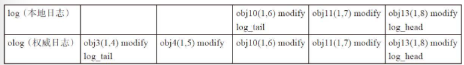

本地log的`log_tail`为`obj10（1，6）`，权威日志`olog`的`log_tail`为`obj3（1，4）`。

把日志记录`obj3（1，4）`、`obj4（1，5）`添加到本地日志中，修改info.log_tail和log.tail指针即可。

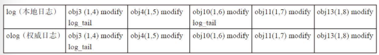

**本地日志的头部版本比权威日志长，如下所示：**

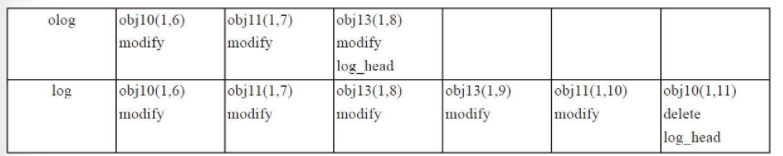

权威日志的`log_head`为`obj13（1，8）`，而本地日志的`log_head`为`obj10（1，11）`。本地日志的`log_head`版本大于权威日志的`log_head`版本，调用函数`rewind_divergent_log`来处理本地有分歧的日志。

在本例的具体处理过程为：把对象`obj10`、`obj11`、`obj13`加入missing列表中用于修复。最后删除多余的日志。

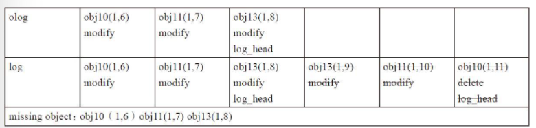

**本地日志的头部版本比权威日志的头部短，如下所示：**

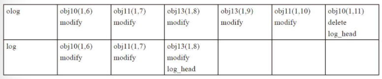

权威日志的`log_head`为`obj10（1，11）`，而本地日志的`log_head`为`obj13（1，8）`，即本地日志的`log_head`版本小于权威日志的`log_head`版本。

其处理方式如下：把本地日志缺失的日志添加到本地，并计算本地缺失的对象。

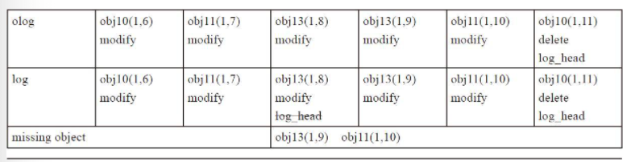

### Trim

`trim`用来删除不需要的旧日志。当日志的条目数大于`osd_min_log_entries`时，需要进行`trim`操作。

```cpp
void PGLog::trim(eversion_t trim_to, pg_info_t &info, bool transaction_applied, bool async) {
    dout(10) << __func__ << " proposed trim_to = " << trim_to << dendl;
    // trim?
    if (trim_to > log.tail) {
        dout(10) << __func__ << " missing = " << missing.num_missing() << dendl;
        // Don't assert for async_recovery_targets or backfill_targets
        // or whenever there are missing items
        if (transaction_applied && !async && (missing.num_missing() == 0))
            ceph_assert(trim_to <= info.last_complete);

        dout(10) << "trim " << log << " to " << trim_to << dendl;
        log.trim(cct, trim_to, &trimmed, &trimmed_dups, &write_from_dups);
        info.log_tail = log.tail;
        if (log.complete_to != log.log.end())
            dout(10) << " after trim complete_to " << log.complete_to->version << dendl;
    }
}
```

### Process Replica Logs

`PGLog::proc_replica_log`用于处理其他副本节点发过来的和权威日志有分叉（divergent）的日志。其关键在于计算missing的对象列表，也就是需要修复的对象。

具体处理过程如下：
* 如果日志不重叠，就无法通过日志来修复，需要进行Backfill过程，直接返回。
* 如果日志的`head`相同，说明没有分歧日志（divergent log），直接返回。
* 如果日志有重叠并且日志的`head`不相同，需要处理分歧的日志：
  * 计算第一条分歧日志`first_non_divergent`，本地日志从后往前（head -> tail）查找小于等于`olog.head`的日志记录。
  * 设置边界`limit`为`std::max(olog.tail, log.tail)`（`olog.head` >= `log.tail`）。
  * 设置查找点`lu`：
    * 如果`first_non_divergent`没找到或者`first_non_divergent` < `limit`，那么`lu`为`limit`。
    * 否则`lu`为`first_non_divergent`。
  * 构建`folog`，把所有没有分歧的日志添加到`folog`里。
  * 调用函数`_merge_divergent_entries`处理分歧日志。
  * 更新`oinfo`的`last_update`为`lu`。
  * 如果有对象missing，就设置`last_complete`为小于`first_missing`。

```cpp
void PGLog::proc_replica_log(pg_info_t &oinfo,
                             const pg_log_t &olog,
                             pg_missing_t &omissing,
                             pg_shard_t from) const {
    dout(10) << "proc_replica_log for osd." << from << ": " << oinfo << " " << olog << " "
             << omissing << dendl;

    if (olog.head < log.tail) {
        dout(10) << __func__ << ": osd." << from << " does not overlap, not looking "
                 << "for divergent objects" << dendl;
        return;
    }
    if (olog.head == log.head) {
        dout(10) << __func__ << ": osd." << from << " same log head, not looking "
                 << "for divergent objects" << dendl;
        return;
    }

    /*
      basically what we're doing here is rewinding the remote log,
      dropping divergent entries, until we find something that matches
      our master log.  we then reset last_update to reflect the new
      point up to which missing is accurate.

      later, in activate(), missing will get wound forward again and
      we will send the peer enough log to arrive at the same state.
    */

    for (auto i = omissing.get_items().begin(); i != omissing.get_items().end(); ++i) {
        dout(20) << " before missing " << i->first << " need " << i->second.need << " have "
                 << i->second.have << dendl;
    }

    auto first_non_divergent = log.log.rbegin();
    while (1) {
        if (first_non_divergent == log.log.rend())
            break;
        if (first_non_divergent->version <= olog.head) {
            dout(20) << "merge_log point (usually last shared) is " << *first_non_divergent
                     << dendl;
            break;
        }
        ++first_non_divergent;
    }

    /* Because olog.head >= log.tail, we know that both pgs must at least have
     * the event represented by log.tail.  Similarly, because log.head >= olog.tail,
     * we know that the event represented by olog.tail must be common to both logs.
     * Furthermore, the event represented by a log tail was necessarily trimmed,
     * thus neither olog.tail nor log.tail can be divergent. It's
     * possible that olog/log contain no actual events between olog.head and
     * max(log.tail, olog.tail), however, since they might have been split out.
     * Thus, if we cannot find an event e such that
     * log.tail <= e.version <= log.head, the last_update must actually be
     * max(log.tail, olog.tail).
     */
    eversion_t limit = std::max(olog.tail, log.tail);
    eversion_t lu = (first_non_divergent == log.log.rend() || first_non_divergent->version < limit)
                      ? limit
                      : first_non_divergent->version;

    // we merge and adjust the replica's log, rollback the rollbackable divergent entry,
    // remove the unrollbackable divergent entry and mark the according object as missing.
    // the rollback boundary must choose crt of the olog which going to be merged.
    // The replica log's(olog) crt will not be modified, so it could get passed
    // to _merge_divergent_entries() directly.
    IndexedLog folog(olog);
    auto divergent = folog.rewind_from_head(lu);
    _merge_divergent_entries(
        folog, divergent, oinfo, olog.get_can_rollback_to(), omissing, 0, this);

    if (lu < oinfo.last_update) {
        dout(10) << " peer osd." << from << " last_update now " << lu << dendl;
        oinfo.last_update = lu;
    }

    if (omissing.have_missing()) {
        eversion_t first_missing =
            omissing.get_items().at(omissing.get_rmissing().begin()->second).need;
        oinfo.last_complete = eversion_t();
        for (auto i = olog.log.begin(); i != olog.log.end(); ++i) {
            if (i->version < first_missing)
                oinfo.last_complete = i->version;
            else
                break;
        }
    } else {
        oinfo.last_complete = oinfo.last_update;
    }
}   // proc_replica_log
```

`_merge_divergent_entries`处理所有的分歧日志，首先把所有分歧日志的对象按照对象分类，然后分别调用函数`_merge_object_divergent_entries`对每个分歧日志的对象进行处理。

函数`_merge_object_divergent_entries`用于处理单个对象的divergent日志，其处理过程如下：
* 首先进行比较，如果处理的对象`hoid`大于`info.last_backfill`，说明该对象本来就不存在，没有必要修复。
    * *这种情况一般发生在如下情景：该PG在上一次Peering操作成功后，PG还没有进入clean状态，正在Backfill过程中，就再次触发了Peering的过程。`info.last_backfill`为上次最后一个修复的对象。在本PG完成Peering后就开始修复，先完成Recovery操作，然后会继续完成上次的Backfill操作，所以没有必要在这里检查来修复。*
* 通过该对象的日志记录来检查版本是否一致。首先确保是同一个对象，本次日志记录的版本`prior_version`等于上一条日志记录的version值。
* `first_divergent_update`为该对象的日志记录中第一个产生分歧的版本；`last_divergent_update`为最后一个产生分歧的版本；版本`prior_version`为第一个分歧产生的前一个版本，也就是应该存在的对象版本。`object_not_in_store`用来标记该对象不缺失，且第一条分歧日志操作是删除操作。处理分歧日志的五种情况如下所示：
  * 在没有分歧的日志里查找到该对象，但是已存在的对象的版本大于第一个分歧对象的版本。这种情况的出现，是由于在`merge_log`中产生权威日志时的日志更新，相应的处理已经做了，这里不做任何处理。
  * 如果`prior_version`为`eversion_t()`，为对象的`create`操作或者是`clone`操作，那么这个对象就不需要修复。如果已经在missing记录中，就删除该missing记录。
  * 如果该对象已经处于missing列表中，如下进行处理：
    * 如果日志记录显示当前已经拥有的该对象版本`have`等于`prior_version`，说明对象不缺失，不需要修复，删除missing中的记录。
    * 否则，修改需要修复的版本`need`为`prior_version`；如果`prior_version`小于等于`info.log_tail`时，这是不合理的，设置`new_divergent_prior`用于后续处理。
  * 如果该对象的所有版本都可以回滚，直接通过本地回滚操作就可以修复，不需要加入missing列表来修复。
  * 如果不是所有的对象版本都可以回滚，删除相关的版本，把`prior_version`加入missing记录中用于修复。

```cpp
/**
 * _merge_object_divergent_entries
 *
 * There are 5 distinct cases:
 * 1) There is a more recent update: in this case we assume we adjusted the
 *    store and missing during merge_log
 * 2) The first entry in the divergent sequence is a create.  This might
 *    either be because the object is a clone or because prior_version is
 *    eversion_t().  In this case the object does not exist and we must
 *    adjust missing and the store to match.
 * 3) We are currently missing the object.  In this case, we adjust the
 *    missing to our prior_version taking care to add a divergent_prior
 *    if necessary
 * 4) We can rollback all of the entries.  In this case, we do so using
 *    the rollbacker and return -- the object does not go into missing.
 * 5) We cannot rollback at least 1 of the entries.  In this case, we
 *    clear the object out of the store and add a missing entry at
 *    prior_version taking care to add a divergent_prior if
 *    necessary.
 */
template<typename missing_type>
static void _merge_object_divergent_entries(
    const IndexedLog &log,   ///< [in] log to merge against
    const hobject_t &hoid,   ///< [in] object we are merging
    const mempool::osd_pglog::list<pg_log_entry_t>
        &orig_entries,                 ///< [in] entries for hoid to merge
    const pg_info_t &info,             ///< [in] info for merging entries
    eversion_t olog_can_rollback_to,   ///< [in] rollback boundary of input InedexedLog
    missing_type &missing,             ///< [in,out] missing to adjust, use
    LogEntryHandler *rollbacker,       ///< [in] optional rollbacker object
    const DoutPrefixProvider *dpp      ///< [in] logging provider
) {
    ldpp_dout(dpp, 20) << __func__ << ": merging hoid " << hoid << " entries: " << orig_entries
                       << dendl;

    if (hoid > info.last_backfill) {
        ldpp_dout(dpp, 10) << __func__ << ": hoid " << hoid << " after last_backfill" << dendl;
        return;
    }

    // entries is non-empty
    ceph_assert(!orig_entries.empty());
    // strip out and ignore ERROR entries
    mempool::osd_pglog::list<pg_log_entry_t> entries;
    eversion_t last;
    bool seen_non_error = false;
    for (auto i = orig_entries.begin(); i != orig_entries.end(); ++i) {
        // all entries are on hoid
        ceph_assert(i->soid == hoid);
        // did not see error entries before this entry and this entry is not error
        // then this entry is the first non error entry
        bool first_non_error = !seen_non_error && !i->is_error();
        if (!i->is_error()) {
            // see a non error entry now
            seen_non_error = true;
        }

        // No need to check the first entry since it prior_version is unavailable
        // in the std::list
        // No need to check if the prior_version is the minimal version
        // No need to check the first non-error entry since the leading error
        // entries are not its prior version
        if (i != orig_entries.begin() && i->prior_version != eversion_t() && !first_non_error) {
            // in increasing order of version
            ceph_assert(i->version > last);
            // prior_version correct (unless it is an ERROR entry)
            ceph_assert(i->prior_version == last || i->is_error());
        }
        if (i->is_error()) {
            ldpp_dout(dpp, 20) << __func__ << ": ignoring " << *i << dendl;
        } else {
            ldpp_dout(dpp, 20) << __func__ << ": keeping " << *i << dendl;
            entries.push_back(*i);
            last = i->version;
        }
    }
    if (entries.empty()) {
        ldpp_dout(dpp, 10) << __func__ << ": no non-ERROR entries" << dendl;
        return;
    }

    const eversion_t prior_version = entries.begin()->prior_version;
    const eversion_t first_divergent_update = entries.begin()->version;
    const eversion_t last_divergent_update = entries.rbegin()->version;
    const bool object_not_in_store = !missing.is_missing(hoid) && entries.rbegin()->is_delete();
    ldpp_dout(dpp, 10) << __func__ << ": hoid "
                       << " object_not_in_store: " << object_not_in_store << dendl;
    ldpp_dout(dpp, 10) << __func__ << ": hoid " << hoid << " prior_version: " << prior_version
                       << " first_divergent_update: " << first_divergent_update
                       << " last_divergent_update: " << last_divergent_update << dendl;

    auto objiter = log.objects.find(hoid);
    if (objiter != log.objects.end() && objiter->second->version >= first_divergent_update) {
        /// Case 1)
        ldpp_dout(dpp, 10) << __func__ << ": more recent entry found: " << *objiter->second
                           << ", already merged" << dendl;

        ceph_assert(objiter->second->version > last_divergent_update);

        // ensure missing has been updated appropriately
        if (objiter->second->is_update() ||
            (missing.may_include_deletes && objiter->second->is_delete())) {
            ceph_assert(missing.is_missing(hoid) &&
                        missing.get_items().at(hoid).need == objiter->second->version);
        } else {
            ceph_assert(!missing.is_missing(hoid));
        }
        missing.revise_have(hoid, eversion_t());
        missing.mark_fully_dirty(hoid);
        if (rollbacker) {
            if (!object_not_in_store) {
                rollbacker->remove(hoid);
            }
            for (auto &&i : entries) {
                rollbacker->trim(i);
            }
        }
        return;
    }

    ldpp_dout(dpp, 10) << __func__ << ": hoid " << hoid << " has no more recent entries in log"
                       << dendl;
    if (prior_version == eversion_t() || entries.front().is_clone()) {
        /// Case 2)
        ldpp_dout(dpp, 10) << __func__ << ": hoid " << hoid
                           << " prior_version or op type indicates creation,"
                           << " deleting" << dendl;
        if (missing.is_missing(hoid))
            missing.rm(missing.get_items().find(hoid));
        if (rollbacker) {
            if (!object_not_in_store) {
                rollbacker->remove(hoid);
            }
            for (auto &&i : entries) {
                rollbacker->trim(i);
            }
        }
        return;
    }

    if (missing.is_missing(hoid)) {
        /// Case 3)
        ldpp_dout(dpp, 10) << __func__ << ": hoid " << hoid << " missing, "
                           << missing.get_items().at(hoid) << " adjusting" << dendl;

        if (missing.get_items().at(hoid).have == prior_version) {
            ldpp_dout(dpp, 10)
                << __func__ << ": hoid " << hoid << " missing.have is prior_version "
                << prior_version << " removing from missing" << dendl;
            missing.rm(missing.get_items().find(hoid));
        } else {
            ldpp_dout(dpp, 10) << __func__ << ": hoid " << hoid << " missing.have is "
                               << missing.get_items().at(hoid).have << ", adjusting" << dendl;
            missing.revise_need(hoid, prior_version, false);
            if (prior_version <= info.log_tail) {
                ldpp_dout(dpp, 10)
                    << __func__ << ": hoid " << hoid << " prior_version " << prior_version
                    << " <= info.log_tail " << info.log_tail << dendl;
            }
        }
        if (rollbacker) {
            for (auto &&i : entries) {
                rollbacker->trim(i);
            }
        }
        return;
    }

    ldpp_dout(dpp, 10) << __func__ << ": hoid " << hoid << " must be rolled back or recovered,"
                       << " attempting to rollback" << dendl;
    bool can_rollback = true;
    // We are going to make an important decision based on the
    // olog_can_rollback_to value we have received, better known it.
    ldpp_dout(dpp, 10) << __func__ << ": hoid " << hoid
                       << " olog_can_rollback_to: " << olog_can_rollback_to << dendl;
    /// Distinguish between 4) and 5)
    for (auto i = entries.rbegin(); i != entries.rend(); ++i) {
        if (!i->can_rollback() || i->version <= olog_can_rollback_to) {
            ldpp_dout(dpp, 10)
                << __func__ << ": hoid " << hoid << " cannot rollback " << *i << dendl;
            can_rollback = false;
            break;
        }
    }

    if (can_rollback) {
        /// Case 4)
        for (auto i = entries.rbegin(); i != entries.rend(); ++i) {
            ceph_assert(i->can_rollback() && i->version > olog_can_rollback_to);
            ldpp_dout(dpp, 10)
                << __func__ << ": hoid " << hoid << " rolling back " << *i << dendl;
            if (rollbacker)
                rollbacker->rollback(*i);
        }
        ldpp_dout(dpp, 10) << __func__ << ": hoid " << hoid << " rolled back" << dendl;
        return;
    } else {
        /// Case 5)
        ldpp_dout(dpp, 10) << __func__ << ": hoid " << hoid << " cannot roll back, "
                           << "removing and adding to missing" << dendl;
        if (rollbacker) {
            if (!object_not_in_store)
                rollbacker->remove(hoid);
            for (auto &&i : entries) {
                rollbacker->trim(i);
            }
        }
        missing.add(hoid, prior_version, eversion_t(), false);
        if (prior_version <= info.log_tail) {
            ldpp_dout(dpp, 10)
                << __func__ << ": hoid " << hoid << " prior_version " << prior_version
                << " <= info.log_tail " << info.log_tail << dendl;
        }
    }
}
```

## Peering

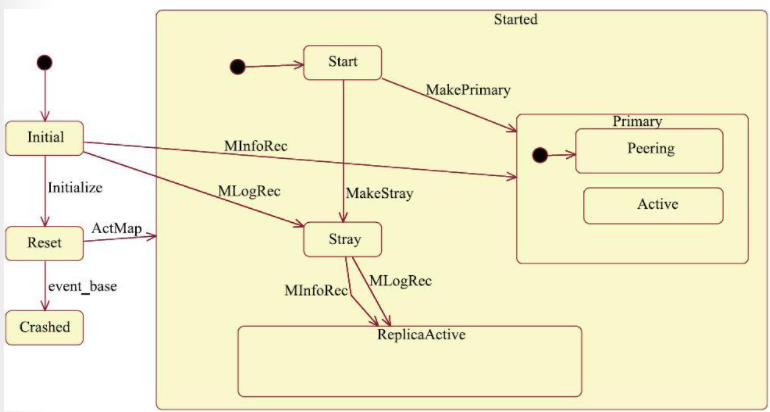

Peering的过程使一个PG内的OSD达成一个一致状态。当主从副本达成一个一致的状态后，PG处于active状态，Peering过程的状态就结束了。但此时该PG的OSD的数据副本上的数据并非完全一致。

PG在如下两种情况下触发Peering过程。
* 当系统初始化时，OSD重新启动导致PG重新加载，或者PG新创建时，PG会发起一次Peering的过程。
* 当有OSD失效，OSD的增加或者删除等导致PG的acting set发生了变化，该PG就会重新发起一次Peering过程。

acting set是一个PG对应副本所在的OSD列表，该列表是有序的，列表中第一个OSD为主OSD。在通常情况下，up set和acting set列表完全相同。

假设一个PG的acting set为[0，1，2]列表。此时如果osd0出现故障，导致CRUSH算法重新分配该PG的acting set为[3，1，2]。此时osd3为该PG的主OSD，但是osd3为新加入的OSD，并不能负担该PG上的读操作。所以PG向Monitor申请一个临时的PG，osd1为临时的主OSD，这时up set变为[1，3，2]，acting set依然为[3，1，2]，导致acting set和up set不同。当osd3完成Backfill过程之后，临时PG被取消，该PG的up set修复为acting set，此时acting set和up set都为[3，1，2]列表。

### PG Create

`OSD::ms_fast_dispatch`中。

```cpp
    case MSG_OSD_PG_CREATE2:
        return handle_fast_pg_create(static_cast<MOSDPGCreate2 *>(m));
    case MSG_OSD_PG_QUERY:
        return handle_fast_pg_query(static_cast<MOSDPGQuery *>(m));
    case MSG_OSD_PG_NOTIFY:
        return handle_fast_pg_notify(static_cast<MOSDPGNotify *>(m));
    case MSG_OSD_PG_INFO:
        return handle_fast_pg_info(static_cast<MOSDPGInfo *>(m));
    case MSG_OSD_PG_REMOVE:
        return handle_fast_pg_remove(static_cast<MOSDPGRemove *>(m));
```

`handle_fast_pg_create`负责创建PG。

```cpp
void OSD::handle_fast_pg_create(MOSDPGCreate2 *m) {
    dout(7) << __func__ << " " << *m << " from " << m->get_source() << dendl;
    if (!require_mon_peer(m)) {
        m->put();
        return;
    }
    for (auto &p : m->pgs) {
        spg_t pgid = p.first;
        epoch_t created = p.second.first;
        utime_t created_stamp = p.second.second;
        auto q = m->pg_extra.find(pgid);
        if (q == m->pg_extra.end()) {
            dout(20) << __func__ << " " << pgid << " e" << created << "@" << created_stamp
                     << " (no history or past_intervals)" << dendl;
            // pre-octopus ... no pg history.  this can be removed in Q release.
            enqueue_peering_evt(pgid,
                                PGPeeringEventRef(std::make_shared<PGPeeringEvent>(
                                    m->epoch,
                                    m->epoch,
                                    NullEvt(),
                                    true,
                                    new PGCreateInfo(pgid,
                                                     created,
                                                     pg_history_t(created, created_stamp),
                                                     PastIntervals(),
                                                     true))));
        } else {
            dout(20) << __func__ << " " << pgid << " e" << created << "@" << created_stamp
                     << " history " << q->second.first << " pi " << q->second.second << dendl;
            if (!q->second.second.empty() && m->epoch < q->second.second.get_bounds().second) {
                clog->error() << "got pg_create on " << pgid << " epoch " << m->epoch
                              << " and unmatched past_intervals " << q->second.second
                              << " (history " << q->second.first << ")";
            } else {
                enqueue_peering_evt(
                    pgid,
                    PGPeeringEventRef(std::make_shared<PGPeeringEvent>(
                        m->epoch,
                        m->epoch,
                        NullEvt(),
                        true,
                        new PGCreateInfo(
                            pgid, m->epoch, q->second.first, q->second.second, true))));
            }
        }
    }

    {
        std::lock_guard l(pending_creates_lock);
        if (pending_creates_from_mon == 0) {
            last_pg_create_epoch = m->epoch;
        }
    }

    m->put();
}
```

调用`enqueue_peering_evt`，将`PGPeeringItem`入队。

```cpp
void OSD::enqueue_peering_evt(spg_t pgid, PGPeeringEventRef evt) {
    dout(15) << __func__ << " " << pgid << " " << evt->get_desc() << dendl;
    op_shardedwq.queue(
        OpSchedulerItem(unique_ptr<OpSchedulerItem::OpQueueable>(new PGPeeringItem(pgid, evt)),
                        10,
                        cct->_conf->osd_peering_op_priority,
                        utime_t(),
                        0,
                        evt->get_epoch_sent()));
}
```

`OpScheduler`线程进入`PGPeeringItem::run`。

```cpp
void PGPeeringItem::run(OSD *osd, OSDShard *sdata, PGRef &pg, ThreadPool::TPHandle &handle) {
    osd->dequeue_peering_evt(sdata, pg.get(), evt, handle);
}
```

### PG Peering

```cpp
void OSD::dequeue_peering_evt(OSDShard *sdata,
                              PG *pg,
                              PGPeeringEventRef evt,
                              ThreadPool::TPHandle &handle) {
    PeeringCtx rctx = create_context();
    auto curmap = sdata->get_osdmap();
    bool need_up_thru = false;
    epoch_t same_interval_since = 0;
    if (!pg) {
        if (const MQuery *q = dynamic_cast<const MQuery *>(evt->evt.get())) {
            handle_pg_query_nopg(*q);
        } else {
            derr << __func__ << " unrecognized pg-less event " << evt->get_desc() << dendl;
            ceph_abort();
        }
    } else if (advance_pg(curmap->get_epoch(), pg, handle, rctx)) {
        pg->do_peering_event(evt, rctx);
        if (pg->is_deleted()) {
            pg->unlock();
            return;
        }
        dispatch_context(rctx, pg, curmap, &handle);
        need_up_thru = pg->get_need_up_thru();
        same_interval_since = pg->get_same_interval_since();
        pg->unlock();
    }

    if (need_up_thru) {
        queue_want_up_thru(same_interval_since);
    }

    service.send_pg_temp();
}
```

```cpp
void PG::do_peering_event(PGPeeringEventRef evt, PeeringCtx &rctx)
{
  dout(10) << __func__ << ": " << evt->get_desc() << dendl;
  ceph_assert(have_same_or_newer_map(evt->get_epoch_sent()));
  if (old_peering_evt(evt)) {
    dout(10) << "discard old " << evt->get_desc() << dendl;
  } else {
    recovery_state.handle_event(evt, &rctx);
  }
  // write_if_dirty regardless of path above to ensure we capture any work
  // done by OSD::advance_pg().
  write_if_dirty(rctx.transaction);
}
```

Peering状态转换过程如下：
* 当进入Peering状态后，就进入默认子状态GetInfo中。
* 状态GetInfo接收事件GotInfo后，转移到GetLog状态中。
* 如果状态GetLog接收到IsIncomplete事件后，跳转到Incomplete状态。
* 状态GetLog接收到事件GotLog后，就转入GetMissing状态。
* 状态GetMissing接收到事件Activate事件，转入状态active状态。

Peering过程基本分为如下三个步骤：
* GetInfo - PG的主OSD通过发送消息获取所有从OSD的`pg_info`信息。
* GetLog - 根据各个副本获取的`pg_info`信息的比较，选择一个拥有权威日志的OSD（`auth_log_shard`）。如果主OSD不是拥有权威日志的OSD，就从该OSD上拉取权威日志。主OSD完成拉取权威日志后也就拥有了权威日志。
* GetMissing - 主OSD拉取其他从OSD的PG日志（或者部分获取，或者全部获取`FULL_LOG`）。通过与本地权威日志的对比，来计算该OSD上缺失的object信息，作为后续Recovery操作过程的依据。
* 最后通过Active操作激活主OSD，并发送`notify`通知消息，激活相应的从OSD。

### PG Load

`OSD::init`调用`OSD::load_pgs`加载PG，`OSD::load_pgs`从ObjectStore读取列表。

遍历列表，调用每一个PG的`PG::read_state`从磁盘中恢复PG。

```cpp
void OSD::load_pgs() {
    ceph_assert(ceph_mutex_is_locked(osd_lock));
    dout(0) << "load_pgs" << dendl;

    {
        auto pghist = make_pg_num_history_oid();
        bufferlist bl;
        int r = store->read(service.meta_ch, pghist, 0, 0, bl, 0);
        if (r >= 0 && bl.length() > 0) {
            auto p = bl.cbegin();
            decode(pg_num_history, p);
        }
        dout(20) << __func__ << " pg_num_history " << pg_num_history << dendl;
    }

    vector<coll_t> ls;
    int r = store->list_collections(ls);
    if (r < 0) {
        derr << "failed to list pgs: " << cpp_strerror(-r) << dendl;
    }

    int num = 0;
    for (vector<coll_t>::iterator it = ls.begin(); it != ls.end(); ++it) {
        spg_t pgid;
        if (it->is_temp(&pgid) || (it->is_pg(&pgid) && PG::_has_removal_flag(store, pgid))) {
            dout(10) << "load_pgs " << *it << " removing, legacy or flagged for removal pg"
                     << dendl;
            recursive_remove_collection(cct, store, pgid, *it);
            continue;
        }

        if (!it->is_pg(&pgid)) {
            dout(10) << "load_pgs ignoring unrecognized " << *it << dendl;
            continue;
        }

        dout(10) << "pgid " << pgid << " coll " << coll_t(pgid) << dendl;
        epoch_t map_epoch = 0;
        int r = PG::peek_map_epoch(store, pgid, &map_epoch);
        if (r < 0) {
            derr << __func__ << " unable to peek at " << pgid << " metadata, skipping" << dendl;
            continue;
        }

        PGRef pg;
        if (map_epoch > 0) {
            OSDMapRef pgosdmap = service.try_get_map(map_epoch);
            if (!pgosdmap) {
                if (!get_osdmap()->have_pg_pool(pgid.pool())) {
                    derr << __func__ << ": could not find map for epoch " << map_epoch << " on pg "
                         << pgid << ", but the pool is not present in the "
                         << "current map, so this is probably a result of bug 10617.  "
                         << "Skipping the pg for now, you can use ceph-objectstore-tool "
                         << "to clean it up later." << dendl;
                    continue;
                } else {
                    derr << __func__ << ": have pgid " << pgid << " at epoch " << map_epoch
                         << ", but missing map.  Crashing." << dendl;
                    ceph_abort_msg("Missing map in load_pgs");
                }
            }
            pg = _make_pg(pgosdmap, pgid);
        } else {
            pg = _make_pg(get_osdmap(), pgid);
        }
        if (!pg) {
            recursive_remove_collection(cct, store, pgid, *it);
            continue;
        }

        // there can be no waiters here, so we don't call _wake_pg_slot

        pg->lock();
        pg->ch = store->open_collection(pg->coll);

        // read pg state, log
        pg->read_state(store);

        if (pg->dne()) {
            dout(10) << "load_pgs " << *it << " deleting dne" << dendl;
            pg->ch = nullptr;
            pg->unlock();
            recursive_remove_collection(cct, store, pgid, *it);
            continue;
        }
        {
            uint32_t shard_index = pgid.hash_to_shard(shards.size());
            assert(NULL != shards[shard_index]);
            store->set_collection_commit_queue(pg->coll, &(shards[shard_index]->context_queue));
        }

        pg->reg_next_scrub();

        dout(10) << __func__ << " loaded " << *pg << dendl;
        pg->unlock();

        register_pg(pg);
        ++num;
    }
    dout(0) << __func__ << " opened " << num << " pgs" << dendl;
}
```

```cpp
void PG::read_state(ObjectStore *store) {
    PastIntervals past_intervals_from_disk;
    pg_info_t info_from_disk;
    int r = read_info(store, pg_id, coll, info_from_disk, past_intervals_from_disk, info_struct_v);
    ceph_assert(r >= 0);

    if (info_struct_v < pg_compat_struct_v) {
        derr << "PG needs upgrade, but on-disk data is too old; upgrade to"
             << " an older version first." << dendl;
        ceph_abort_msg("PG too old to upgrade");
    }

    recovery_state.init_from_disk_state(std::move(info_from_disk),
                                        std::move(past_intervals_from_disk),
                                        [this, store](PGLog &pglog) {
                                            ostringstream oss;
                                            pglog.read_log_and_missing(
                                                store,
                                                ch,
                                                pgmeta_oid,
                                                info,
                                                oss,
                                                cct->_conf->osd_ignore_stale_divergent_priors,
                                                cct->_conf->osd_debug_verify_missing_on_start);

                                            if (oss.tellp())
                                                osd->clog->error() << oss.str();
                                            return 0;
                                        });

    if (info_struct_v < pg_latest_struct_v) {
        upgrade(store);
    }

    // initialize current mapping
    {
        int primary, up_primary;
        vector<int> acting, up;
        get_osdmap()->pg_to_up_acting_osds(pg_id.pgid, &up, &up_primary, &acting, &primary);
        recovery_state.init_primary_up_acting(up, acting, up_primary, primary);
        recovery_state.set_role(OSDMap::calc_pg_role(pg_whoami, acting));
    }

    // init pool options
    store->set_collection_opts(ch, pool.info.opts);

    PeeringCtx rctx(ceph_release_t::unknown);
    handle_initialize(rctx);
    // note: we don't activate here because we know the OSD will advance maps
    // during boot.
    write_if_dirty(rctx.transaction);
    store->queue_transaction(ch, std::move(rctx.transaction));
}
```

最终调用`PG::handle_initialize`进入Initial状态。

```cpp
void PG::handle_initialize(PeeringCtx &rctx)
{
  PeeringState::Initialize evt;
  peering_state.handle_event(evt, &rctx);
}
```

### PG States

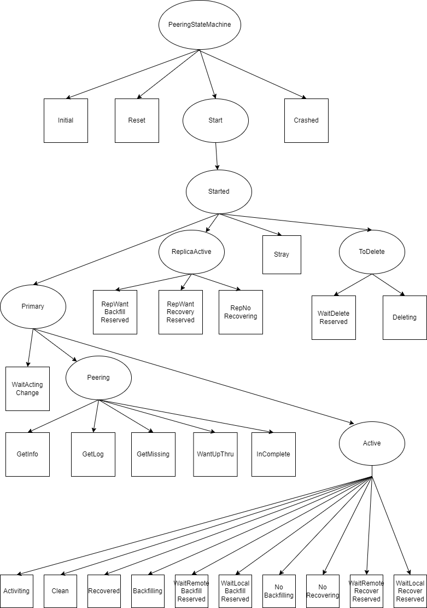

Source Code:
* [PeeringState.h](./PeeringState.h)
* [PeeringState.cc](./PeeringState.cc)

## Peering Detail

### Definations of Data Structure

`eversion_t`是log entry的版本数据，作用类似于raft log entry的`index`和`term`。

```cpp
class eversion_t {
public:
    version_t version; // version -> raft index?
    epoch_t epoch;
    __u32 __pad; // padding to 16 bytes
};
```

`pg_info_t` 保存了一些PG的元数据和统计信息。

```cpp
/**
 * pg_info_t - summary of PG statistics.
 *
 * some notes:
 *  - last_complete implies we have all objects that existed as of that
 *    stamp, OR a newer object, OR have already applied a later delete.
 *  - if last_complete >= log.tail, then we know pg contents thru log.head.
 *    otherwise, we have no idea what the pg is supposed to contain.
 */
struct pg_info_t {
    spg_t pgid;                      ///< PG ID
    eversion_t last_update;          ///< last object version applied to store.
    eversion_t last_complete;        ///< last version pg was complete through.
    epoch_t last_epoch_started;      ///< last epoch at which this pg started on this osd
    epoch_t last_interval_started;   ///< first epoch of last_epoch_started interval

    version_t last_user_version;     ///< last user object version applied to store

    eversion_t log_tail;             ///< oldest log entry.

    hobject_t last_backfill;         ///< objects >= this and < last_complete may be missing

    interval_set<snapid_t> purged_snaps; // snapshot tomb marks

    pg_stat_t stats; // statistics

    pg_history_t history; // history information
    pg_hit_set_history_t hit_set; // for cache tier
};
```

`pg_history_t`保存了最近PG Peering和Mapping的历史。

```cpp
/**
 * pg_history_t - information about recent pg peering/mapping history
 *
 * This is aggressively shared between OSDs to bound the amount of past
 * history they need to worry about.
 */
struct pg_history_t {
    epoch_t epoch_created = 0;        // epoch in which *pg* was created (pool or pg)
    epoch_t epoch_pool_created = 0;   // epoch in which *pool* was created
                                      // (note: may be pg creation epoch for
                                      // pre-luminous clusters)
    epoch_t last_epoch_started = 0;
    ;   // lower bound on last epoch started (anywhere, not necessarily locally)
        // https://docs.ceph.com/docs/master/dev/osd_internals/last_epoch_started/
    epoch_t last_interval_started = 0;
    ;   // first epoch of last_epoch_started interval
    epoch_t last_epoch_clean = 0;
    ;   // lower bound on last epoch the PG was completely clean.
    epoch_t last_interval_clean = 0;
    ;   // first epoch of last_epoch_clean interval
    epoch_t last_epoch_split = 0;
    ;   // as parent or child
    epoch_t last_epoch_marked_full = 0;
    ;   // pool or cluster

    /**
     * In the event of a map discontinuity, same_*_since may reflect the first
     * map the osd has seen in the new map sequence rather than the actual start
     * of the interval.  This is ok since a discontinuity at epoch e means there
     * must have been a clean interval between e and now and that we cannot be
     * in the active set during the interval containing e.
     */
    epoch_t same_up_since = 0;
    ;   // same acting set since
    epoch_t same_interval_since = 0;
    ;   // same acting AND up set since
    epoch_t same_primary_since = 0;
    ;   // same primary at least back through this epoch.

    eversion_t last_scrub;
    eversion_t last_deep_scrub;
    utime_t last_scrub_stamp;
    utime_t last_deep_scrub_stamp;
    utime_t last_clean_scrub_stamp;

    /// upper bound on how long prior interval readable (relative to encode time)
    ceph::timespan prior_readable_until_ub = ceph::timespan::zero();
};
```

`last_epoch_started`字段有两个地方出现：
* 一个是`pg_info_t`里的`last_epoch_started`，代表最后一次Peering成功后的epoch值，是本地PG完成Peering后就设置的。
* 另一个是`pg_history_t`里的`last_epoch_started`，是PG里所有的OSD都完成Peering后设置的epoch值。

特别指出`last_update`和`last_complete`、`last_backfill`之间的区别。

在PG处于clean状态时，`last_complete`就等于`last_update`的值，并且等于PG日志中的`head`版本。它们都同步更新，此时没有区别。`last_bacfill`设置为MAX值。

下面的PG日志里有三条日志记录。此时`last_update`和`last_complete`以及`pg_log.head`都指向版本（1，2）。由于没有缺失的对象，不需要恢复，`last_backfill`设置为MAX值。

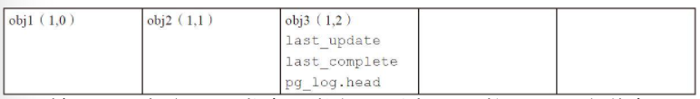

当该osd1发生异常之后，过一段时间后又重新恢复，当完成了Peering后的情况。此时该PG可以继续接受更新操作。

下面的灰色字体的日志记录为该osd1崩溃期间缺失的日志，obj7为新的写入的操作日志记录。`last_update`指向最新的更新版本（1，7），`last_complete`依然指向版本（1，2）。

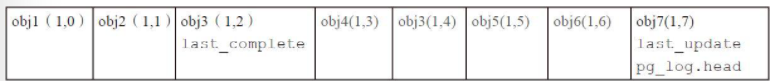

`last_complete`为Recovery修复进程完成的指针。 当该PG开始进行Recovery工作时，`last_complete`指针随着Recovery过程推进，它指向完成修复的版本。

例如：当Recovery完成后`last_complete`指针指向最后一个修复的对象的版本（1，6），如下所示：

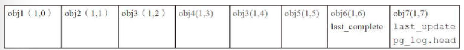

`last_backfill`为Backfill修复进程的指针。 在Ceph Peering的过程中，该PG有osd2无法根据PG日志来恢复，就需要进行Backfill过程。`last_backfill`初始化为MIN对象，用来记录Backfill的修复进程中已修复的对象。

例如：进行Backfill操作时，扫描本地对象（按照对象的hash值排序）。`last_backfill`随修复的过程中不断推进。如果对象小于等于`last_backfill`，就是已经修复完成的对象。如果对象大于`last_backfill`且对象的版本小于`last_complete`，就是处于缺失还没有修复的对象。过程如下所示：

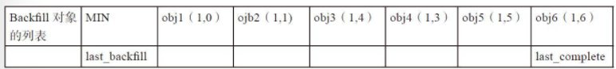

当恢复完成之后，`last_backfill`设置为MAX值，表明恢复完成，设置`last_complete`等于`last_update`的值。

### GetInfo

GetInfo过程获取该PG在其他OSD上的`pg_info_t`信息。这里的其他OSD包括当前PG的活跃OSD，以及past interval期间该PG所有处于up状态的OSD。

`past_interval`是epoch的一个序列。在该序列内一个PG的acting set和up set不会变化。

`current_inteval`是一个特殊的`past_interval`，它是当前最新的一个没有变化的序列。

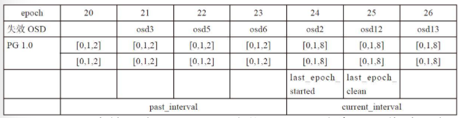

当PG进入Peering状态后，就进入默认的子状态`GetInfo`里。

```cpp
// boost::statechart::state<current state, state machine, default state>
struct Peering
    : boost::statechart::state<Peering, Primary, GetInfo>
    , NamedState {};
```

GetInfo状态的操作主要在构造函数完成。

```cpp
/*--------GetInfo---------*/
PeeringState::GetInfo::GetInfo(my_context ctx)
    : my_base(ctx)
    , NamedState(context<PeeringMachine>().state_history, "Started/Primary/Peering/GetInfo") {
    context<PeeringMachine>().log_enter(state_name);


    DECLARE_LOCALS;
    ps->check_past_interval_bounds();
    ps->log_weirdness();
    PastIntervals::PriorSet &prior_set = context<Peering>().prior_set;

    ceph_assert(ps->blocked_by.empty());

    prior_set = ps->build_prior();
    ps->prior_readable_down_osds = prior_set.down;

    if (ps->prior_readable_down_osds.empty()) {
        psdout(10)
            << " no prior_set down osds, will clear prior_readable_until_ub before activating"
            << dendl;
    }

    ps->reset_min_peer_features();
    get_infos();
    if (prior_set.pg_down) {
        post_event(IsDown());
    } else if (peer_info_requested.empty()) {
        post_event(GotInfo());
    }
}
```

流程如下：
* 调用`PeeringState::build_prior`获得`prior_set`。
* 调用`get_infos()`给参与的OSD发送获取请求。
* 根据`get_infos()`后的`prior_set`状态决定转移到哪个状态。

```cpp
void PeeringState::GetInfo::get_infos() {
    DECLARE_LOCALS;
    PastIntervals::PriorSet &prior_set = context<Peering>().prior_set;

    ps->blocked_by.clear();
    for (auto it = prior_set.probe.begin(); it != prior_set.probe.end(); ++it) {
        pg_shard_t peer = *it;
        // skip self
        if (peer == ps->pg_whoami) {
            continue;
        }
        // skip if peer already in peer_info
        if (ps->peer_info.count(peer)) {
            psdout(10) << " have osd." << peer << " info " << ps->peer_info[peer] << dendl;
            continue;
        }
        // skip if already send request
        if (peer_info_requested.count(peer)) {
            psdout(10) << " already requested info from osd." << peer << dendl;
            ps->blocked_by.insert(peer.osd);
        // skip if osd down
        } else if (!ps->get_osdmap()->is_up(peer.osd)) {
            psdout(10) << " not querying info from down osd." << peer << dendl;
        } else {
            // send query to osd
            psdout(10) << " querying info from osd." << peer << dendl;
            context<PeeringMachine>().send_query(peer.osd,
                                                 pg_query_t(pg_query_t::INFO,
                                                            it->shard,
                                                            ps->pg_whoami.shard,
                                                            ps->info.history,
                                                            ps->get_osdmap_epoch()));
            peer_info_requested.insert(peer);
            ps->blocked_by.insert(peer.osd);
        }
    }

    ps->check_prior_readable_down_osds(ps->get_osdmap());

    pl->publish_stats_to_osd();
}
```

`GetInfo::react`接收OSD的响应，调用`PeeringState::proc_replica_info`处理。

```cpp
boost::statechart::result PeeringState::GetInfo::react(const MNotifyRec &infoevt) {

    DECLARE_LOCALS;

    auto p = peer_info_requested.find(infoevt.from);
    if (p != peer_info_requested.end()) {
        peer_info_requested.erase(p);
        ps->blocked_by.erase(infoevt.from.osd);
    }

    epoch_t old_start = ps->info.history.last_epoch_started;
    if (ps->proc_replica_info(infoevt.from, infoevt.notify.info, infoevt.notify.epoch_sent)) {
        // we got something new ...
        PastIntervals::PriorSet &prior_set = context<Peering>().prior_set;
        if (old_start < ps->info.history.last_epoch_started) {
            psdout(10) << " last_epoch_started moved forward, rebuilding prior" << dendl;
            prior_set = ps->build_prior();
            ps->prior_readable_down_osds = prior_set.down;

            // filter out any osds that got dropped from the probe set from
            // peer_info_requested.  this is less expensive than restarting
            // peering (which would re-probe everyone).
            auto p = peer_info_requested.begin();
            while (p != peer_info_requested.end()) {
                if (prior_set.probe.count(*p) == 0) {
                    psdout(20) << " dropping osd." << *p
                               << " from info_requested, no longer in probe set" << dendl;
                    peer_info_requested.erase(p++);
                } else {
                    ++p;
                }
            }
            get_infos();
        }
        psdout(20) << "Adding osd: " << infoevt.from.osd << " peer features: " << hex
                   << infoevt.features << dec << dendl;
        ps->apply_peer_features(infoevt.features);

        // are we done getting everything?
        if (peer_info_requested.empty() && !prior_set.pg_down) {
            psdout(20) << "Common peer features: " << hex << ps->get_min_peer_features() << dec
                       << dendl;
            psdout(20) << "Common acting features: " << hex << ps->get_min_acting_features() << dec
                       << dendl;
            psdout(20) << "Common upacting features: " << hex << ps->get_min_upacting_features()
                       << dec << dendl;
            post_event(GotInfo());
        }
    }
    return discard_event();
}
```

如果处理流程没有遇到问题，投递`GotInfo`事件进入`GetLog`状态。

### GetLog

当PG的主OSD获取到所有从OSD（以及past interval期间的所有参与该PG且目前仍处于active状态的OSD）的pg_info信息后，就跳转到GetLog状态。

处理逻辑同样在构造函数中。

```cpp
PeeringState::GetLog::GetLog(my_context ctx)
    : my_base(ctx)
    , NamedState(context<PeeringMachine>().state_history, "Started/Primary/Peering/GetLog")
    , msg(0) {
    context<PeeringMachine>().log_enter(state_name);

    DECLARE_LOCALS;

    ps->log_weirdness();

    // adjust acting?
    if (!ps->choose_acting(auth_log_shard, false, &context<Peering>().history_les_bound)) {
        if (!ps->want_acting.empty()) {
            post_event(NeedActingChange());
        } else {
            post_event(IsIncomplete());
        }
        return;
    }

    // am i the best?
    if (auth_log_shard == ps->pg_whoami) {
        post_event(GotLog());
        return;
    }

    const pg_info_t &best = ps->peer_info[auth_log_shard];

    // am i broken?
    if (ps->info.last_update < best.log_tail) {
        psdout(10) << " not contiguous with osd." << auth_log_shard << ", down" << dendl;
        post_event(IsIncomplete());
        return;
    }

    // how much log to request?
    eversion_t request_log_from = ps->info.last_update;
    ceph_assert(!ps->acting_recovery_backfill.empty());
    for (auto p = ps->acting_recovery_backfill.begin(); p != ps->acting_recovery_backfill.end();
         ++p) {
        if (*p == ps->pg_whoami)
            continue;
        pg_info_t &ri = ps->peer_info[*p];
        if (ri.last_update < ps->info.log_tail && ri.last_update >= best.log_tail &&
            ri.last_update < request_log_from)
            request_log_from = ri.last_update;
    }

    // how much?
    psdout(10) << " requesting log from osd." << auth_log_shard << dendl;
    context<PeeringMachine>().send_query(auth_log_shard.osd,
                                         pg_query_t(pg_query_t::LOG,
                                                    auth_log_shard.shard,
                                                    ps->pg_whoami.shard,
                                                    request_log_from,
                                                    ps->info.history,
                                                    ps->get_osdmap_epoch()));

    ceph_assert(ps->blocked_by.empty());
    ps->blocked_by.insert(auth_log_shard.osd);
    pl->publish_stats_to_osd();
}
```

流程如下：
* 调用函数`PeeringState::choose_acting`选出具有权威日志的OSD，并计算出`acting_backfill`和`backfill_targets`两个OSD列表。输出保存在`auth_log_shard`里。
  * 如果选择失败并且`want_acting`不为空，就投递`NeedActingChange`事件，状态机转移到WaitActingChang状态，等待申请临时PG返回结果。如果`want_acting`为空，就抛出`IsIncomplete`事件，PG的状态机转移到Incomplete状态。表明失败，PG就处于Incomplete状态。
* 如果`auth_log_shard`等于`pg->pg_whoami`的值，也就是选出的拥有权威日志的OSD为当前主OSD，直接投递事件`GotLog`完成GetLog过程。
* 如果`pg->info.last_update`小于权威OSD的`log_tail`，也就是本OSD的日志和权威日志不重叠，那么本OSD无法恢复，投递`IsIncomplete`事件。
* 计算需要获取多少Log。
* 调用`PeeringMachine::send_query`发送请求获取Log。

### Choose OLog

函数`choose_acting`用来计算PG的`acting_backfill`和`backfill_targets`两个OSD列表。

`acting_backfill`保存了当前PG的acting列表，包括需要进行Backfill操作的OSD列表；`backfill_targets`列表保存了需要进行Backfill的OSD列表。

```cpp
/**
 * choose acting
 *
 * calculate the desired acting, and request a change with the monitor
 * if it differs from the current acting.
 *
 * if restrict_to_up_acting=true, we filter out anything that's not in
 * up/acting.  in order to lift this restriction, we need to
 *  1) check whether it's worth switching the acting set any time we get
 *     a new pg info (not just here, when recovery finishes)
 *  2) check whether anything in want_acting went down on each new map
 *     (and, if so, calculate a new want_acting)
 *  3) remove the assertion in PG::PeeringState::Active::react(const AdvMap)
 * TODO!
 */
bool PeeringState::choose_acting(pg_shard_t &auth_log_shard_id,
                                 bool restrict_to_up_acting,
                                 bool *history_les_bound,
                                 bool request_pg_temp_change_only) {
    map<pg_shard_t, pg_info_t> all_info(peer_info.begin(), peer_info.end());
    all_info[pg_whoami] = info;

    if (cct->_conf->subsys.should_gather<dout_subsys, 10>()) {
        for (auto p = all_info.begin(); p != all_info.end(); ++p) {
            psdout(10) << __func__ << " all_info osd." << p->first << " " << p->second << dendl;
        }
    }

    auto auth_log_shard = find_best_info(all_info, restrict_to_up_acting, history_les_bound);

    if (auth_log_shard == all_info.end()) {
        if (up != acting) {
            psdout(10) << __func__ << " no suitable info found (incomplete backfills?),"
                       << " reverting to up" << dendl;
            want_acting = up;
            vector<int> empty;
            pl->queue_want_pg_temp(empty);
        } else {
            psdout(10) << __func__ << " failed" << dendl;
            ceph_assert(want_acting.empty());
        }
        return false;
    }

    ceph_assert(!auth_log_shard->second.is_incomplete());
    auth_log_shard_id = auth_log_shard->first;

    set<pg_shard_t> want_backfill, want_acting_backfill;
    vector<int> want;
    stringstream ss;
    if (pool.info.is_replicated()) {
        auto [primary_shard, oldest_log] = select_replicated_primary(
            auth_log_shard,
            cct->_conf.get_val<uint64_t>("osd_force_auth_primary_missing_objects"),
            up,
            up_primary,
            all_info,
            get_osdmap(),
            ss);
        if (pool.info.is_stretch_pool()) {
            calc_replicated_acting_stretch(primary_shard,
                                           oldest_log,
                                           get_osdmap()->get_pg_size(info.pgid.pgid),
                                           acting,
                                           up,
                                           up_primary,
                                           all_info,
                                           restrict_to_up_acting,
                                           &want,
                                           &want_backfill,
                                           &want_acting_backfill,
                                           get_osdmap(),
                                           pool,
                                           ss);
        } else {
            calc_replicated_acting(primary_shard,
                                   oldest_log,
                                   get_osdmap()->get_pg_size(info.pgid.pgid),
                                   acting,
                                   up,
                                   up_primary,
                                   all_info,
                                   restrict_to_up_acting,
                                   &want,
                                   &want_backfill,
                                   &want_acting_backfill,
                                   get_osdmap(),
                                   pool,
                                   ss);
        }
    } else {
        calc_ec_acting(auth_log_shard,
                       get_osdmap()->get_pg_size(info.pgid.pgid),
                       acting,
                       up,
                       all_info,
                       restrict_to_up_acting,
                       &want,
                       &want_backfill,
                       &want_acting_backfill,
                       ss);
    }
    psdout(10) << ss.str() << dendl;

    if (!recoverable(want)) {
        want_acting.clear();
        return false;
    }

    set<pg_shard_t> want_async_recovery;
    if (HAVE_FEATURE(get_osdmap()->get_up_osd_features(), SERVER_MIMIC)) {
        if (pool.info.is_erasure()) {
            choose_async_recovery_ec(
                all_info, auth_log_shard->second, &want, &want_async_recovery, get_osdmap());
        } else {
            choose_async_recovery_replicated(
                all_info, auth_log_shard->second, &want, &want_async_recovery, get_osdmap());
        }
    }
    while (want.size() > pool.info.size) {
        // async recovery should have taken out as many osds as it can.
        // if not, then always evict the last peer
        // (will get synchronously recovered later)
        psdout(10) << __func__ << " evicting osd." << want.back() << " from oversized want " << want
                   << dendl;
        want.pop_back();
    }
    if (want != acting) {
        psdout(10) << __func__ << " want " << want << " != acting " << acting
                   << ", requesting pg_temp change" << dendl;
        want_acting = want;

        if (!cct->_conf->osd_debug_no_acting_change) {
            if (want_acting == up) {
                // There can't be any pending backfill if
                // want is the same as crush map up OSDs.
                ceph_assert(want_backfill.empty());
                vector<int> empty;
                pl->queue_want_pg_temp(empty);
            } else
                pl->queue_want_pg_temp(want);
        }
        return false;
    }

    if (request_pg_temp_change_only)
        return true;
    want_acting.clear();
    acting_recovery_backfill = want_acting_backfill;
    psdout(10) << "acting_recovery_backfill is " << acting_recovery_backfill << dendl;
    ceph_assert(backfill_targets.empty() || backfill_targets == want_backfill);
    if (backfill_targets.empty()) {
        // Caller is GetInfo
        backfill_targets = want_backfill;
    }
    // Adding !needs_recovery() to let the async_recovery_targets reset after recovery is complete
    ceph_assert(async_recovery_targets.empty() || async_recovery_targets == want_async_recovery ||
                !needs_recovery());
    if (async_recovery_targets.empty() || !needs_recovery()) {
        async_recovery_targets = want_async_recovery;
    }
    // Will not change if already set because up would have had to change
    // Verify that nothing in backfill is in stray_set
    for (auto i = want_backfill.begin(); i != want_backfill.end(); ++i) {
        ceph_assert(stray_set.find(*i) == stray_set.end());
    }
    psdout(10) << "choose_acting want=" << want << " backfill_targets=" << want_backfill
               << " async_recovery_targets=" << async_recovery_targets << dendl;
    return true;
}
```

处理过程如下：
* 首先调用函数`find_best_info`来选举出一个拥有权威日志的OSD，保存在变量`auth_log_shard`里。
* 根据`pool_info`进行不同的操作，计算出`want_backfill`和`want_acting_backfill`、`want_activing`（`want`）。
  * 如果是副本池（`pool.info.is_replicated()`） 调用`select_replicated_primary`选择一个primary，并返回olog的`tail`。
    * 如果是Stretch Cluster（geo-replica），调用`calc_replicated_acting_stretch`。
    * 否则调用`calc_replicated_acting`。
  * 否则为EC池调用`calc_ec_acting`。
* 如果`want`不等于`activing`需要申请临时PG，调用`queue_want_pg_temp`。
* 否则返回`true`。

举例说明需要申请临时PG的场景：
* 当前PG1.0，其acting列表和up列表都为[0，1，2]，PG处于clean状态。
* 此时，osd0崩溃，导致该PG经过CRUSH算法重新获得acting和up列表都为[3，1，2]。
* 选择出拥有权威日志的osd为1，经过`calc_replicated_acting`算法，want列表为[1，3，2]，acting_backfill为[1，3，2]，want_backfill为[3]。特别注意want列表第一个为主OSD，如果up_primay无法恢复，就选择权威日志的OSD为主OSD。
* want[1，3，2]不等于acting[3，1，2]时，并且不等于up[3，1，2]，需要向Monitor申请pg_temp为want。
* 申请成功pg_temp以后，acting为[3，1，2]，up为[1，3，2]，osd1做为临时的主OSD，处理读写请求。当该PG恢复处于clean状态，pg_temp取消，acting和up都恢复为[3，1，2]。

```cpp
std::pair<map<pg_shard_t, pg_info_t>::const_iterator, eversion_t>
PeeringState::select_replicated_primary(map<pg_shard_t, pg_info_t>::const_iterator auth_log_shard,
                                        uint64_t force_auth_primary_missing_objects,
                                        const std::vector<int> &up,
                                        pg_shard_t up_primary,
                                        const map<pg_shard_t, pg_info_t> &all_info,
                                        const OSDMapRef osdmap,
                                        ostream &ss) {
    pg_shard_t auth_log_shard_id = auth_log_shard->first;

    ss << __func__ << " newest update on osd." << auth_log_shard_id << " with "
       << auth_log_shard->second << std::endl;

    // select primary
    auto primary = all_info.find(up_primary);
    if (up.size() && !primary->second.is_incomplete() &&
        primary->second.last_update >= auth_log_shard->second.log_tail) {
        if (HAVE_FEATURE(osdmap->get_up_osd_features(), SERVER_NAUTILUS)) {
            auto approx_missing_objects = primary->second.stats.stats.sum.num_objects_missing;
            auto auth_version = auth_log_shard->second.last_update.version;
            auto primary_version = primary->second.last_update.version;
            if (auth_version > primary_version) {
                approx_missing_objects += auth_version - primary_version;
            } else {
                approx_missing_objects += primary_version - auth_version;
            }
            if ((uint64_t)approx_missing_objects > force_auth_primary_missing_objects) {
                primary = auth_log_shard;
                ss << "up_primary: " << up_primary << ") has approximate " << approx_missing_objects
                   << "(>" << force_auth_primary_missing_objects << ") "
                   << "missing objects, osd." << auth_log_shard_id << " selected as primary instead"
                   << std::endl;
            } else {
                ss << "up_primary: " << up_primary << ") selected as primary" << std::endl;
            }
        } else {
            ss << "up_primary: " << up_primary << ") selected as primary" << std::endl;
        }
    } else {
        ceph_assert(!auth_log_shard->second.is_incomplete());
        ss << "up[0] needs backfill, osd." << auth_log_shard_id << " selected as primary instead"
           << std::endl;
        primary = auth_log_shard;
    }

    ss << __func__ << " primary is osd." << primary->first << " with " << primary->second
       << std::endl;

    /* We include auth_log_shard->second.log_tail because in GetLog,
     * we will request logs back to the min last_update over our
     * acting_backfill set, which will result in our log being extended
     * as far backwards as necessary to pick up any peers which can
     * be log recovered by auth_log_shard's log */
    eversion_t oldest_auth_log_entry =
        std::min(primary->second.log_tail, auth_log_shard->second.log_tail);

    return std::make_pair(primary, oldest_auth_log_entry);
}
```

`select_replicated_primary`处理流程：
* 查看当前OSD版本是否大于`NAUTILUS`：
  * 如果是，计算primary和auth之间的对象差距，过大（>= `force_auth_primary_missing_objects`）则选择auth为primary。
  * 否则，直接返回primary。
* 将`std::min(primary->second.log_tail, auth_log_shard->second.log_tail)`作为权威日志的`tail`返回。

`find_best_info`用于选取一个拥有权威日志的OSD。根据`last_epoch_clean`到目前为止，各个past interval期间参与该PG的所有目前还处于up状态的OSD上`pg_info_t`信息，来选取一个拥有权威日志的OSD，选择的优先顺序如下：
* 具有最新的`last_update`的OSD。
* 如果条件1相同，选择日志更长的OSD。
* 如果1，2条件都相同，选择当前的主OSD。

```cpp
/**
 * find_best_info
 *
 * Returns an iterator to the best info in infos sorted by:
 *  1) Prefer newer last_update
 *  2) Prefer longer tail if it brings another info into contiguity
 *  3) Prefer current primary
 */
map<pg_shard_t, pg_info_t>::const_iterator PeeringState::find_best_info(
    const map<pg_shard_t, pg_info_t> &infos,
    bool restrict_to_up_acting,
    bool *history_les_bound) const {
    ceph_assert(history_les_bound);
    /* See doc/dev/osd_internals/last_epoch_started.rst before attempting
     * to make changes to this process.  Also, make sure to update it
     * when you find bugs! */
    epoch_t max_last_epoch_started_found = 0;
    for (auto i = infos.begin(); i != infos.end(); ++i) {
        if (!cct->_conf->osd_find_best_info_ignore_history_les &&
            max_last_epoch_started_found < i->second.history.last_epoch_started) {
            *history_les_bound = true;
            max_last_epoch_started_found = i->second.history.last_epoch_started;
        }
        if (!i->second.is_incomplete() &&
            max_last_epoch_started_found < i->second.last_epoch_started) {
            *history_les_bound = false;
            max_last_epoch_started_found = i->second.last_epoch_started;
        }
    }
    eversion_t min_last_update_acceptable = eversion_t::max();
    for (auto i = infos.begin(); i != infos.end(); ++i) {
        if (max_last_epoch_started_found <= i->second.last_epoch_started) {
            if (min_last_update_acceptable > i->second.last_update)
                min_last_update_acceptable = i->second.last_update;
        }
    }
    if (min_last_update_acceptable == eversion_t::max())
        return infos.end();

    auto best = infos.end();
    // find osd with newest last_update (oldest for ec_pool).
    // if there are multiples, prefer
    //  - a longer tail, if it brings another peer into log contiguity
    //  - the current primary
    for (auto p = infos.begin(); p != infos.end(); ++p) {
        if (restrict_to_up_acting && !is_up(p->first) && !is_acting(p->first))
            continue;
        // Only consider peers with last_update >= min_last_update_acceptable
        if (p->second.last_update < min_last_update_acceptable)
            continue;
        // Disqualify anyone with a too old last_epoch_started
        if (p->second.last_epoch_started < max_last_epoch_started_found)
            continue;
        // Disqualify anyone who is incomplete (not fully backfilled)
        if (p->second.is_incomplete())
            continue;
        if (best == infos.end()) {
            best = p;
            continue;
        }
        // Prefer newer last_update
        if (pool.info.require_rollback()) {
            if (p->second.last_update > best->second.last_update)
                continue;
            if (p->second.last_update < best->second.last_update) {
                best = p;
                continue;
            }
        } else {
            if (p->second.last_update < best->second.last_update)
                continue;
            if (p->second.last_update > best->second.last_update) {
                best = p;
                continue;
            }
        }

        // Prefer longer tail
        if (p->second.log_tail > best->second.log_tail) {
            continue;
        } else if (p->second.log_tail < best->second.log_tail) {
            best = p;
            continue;
        }

        if (!p->second.has_missing() && best->second.has_missing()) {
            psdout(10) << __func__ << " prefer osd." << p->first
                       << " because it is complete while best has missing" << dendl;
            best = p;
            continue;
        } else if (p->second.has_missing() && !best->second.has_missing()) {
            psdout(10) << __func__ << " skipping osd." << p->first
                       << " because it has missing while best is complete" << dendl;
            continue;
        } else {
            // both are complete or have missing
            // fall through
        }

        // prefer current primary (usually the caller), all things being equal
        if (p->first == pg_whoami) {
            psdout(10) << "calc_acting prefer osd." << p->first << " because it is current primary"
                       << dendl;
            best = p;
            continue;
        }
    }
    return best;
}
```

流程如下：
* 首先在所有OSD中计算`max_last_epoch_started`，然后在拥有最大的`last_epoch_started`的OSD中计算`min_last_update_acceptable`的值。
* 如果`min_last_update_acceptable`为`eversion_t::max()`，返回`infos.end()`，选取失败。
* 根据以下条件选择一个OSD：
  * 首先过滤掉`last_update`小于`min_last_update_acceptable`，或者`last_epoch_started`小于`max_last_epoch_started_found`，或者处于incomplete的OSD。
  * 如果PG类型是EC，选择最小的`last_update`；如果PG类型是副本，选择最大的`last_update`的OSD。
  * 如果上述条件都相同，选择`long tail`最小的，也就是日志最长的OSD。
  * 如果上述条件都相同，选择当前的主OSD。

综上的选择过程可知：拥有权威日志的OSD特征如下：
* 非Incomplete的OSD。
* 必须有最大`last_epoch_strated`。
* `last_update`有可能是最大，但至少是`min_last_update_acceptable`。
* 有可能是日志最长的OSD，有可能是主OSD。


`PeeringState::calc_replicated_acting`函数计算本PG相关的下列OSD列表：
* `want_primary`：主OSD，如果它不是up_primay，就需要申请临时PG。
* `backfill`：需要进行Backfill操作的OSD。
* `acting_backfill`：所有进行acting和Backfill的OSD的集合。
* `want`和`acting_backfill`的OSD相同，前者类型是`pg_shard_t`，后者为`int`。

```cpp
/**
 * calculate the desired acting set.
 *
 * Choose an appropriate acting set.  Prefer up[0], unless it is
 * incomplete, or another osd has a longer tail that allows us to
 * bring other up nodes up to date.
 */
void PeeringState::calc_replicated_acting(map<pg_shard_t, pg_info_t>::const_iterator primary,
                                          eversion_t oldest_auth_log_entry,
                                          unsigned size,
                                          const vector<int> &acting,
                                          const vector<int> &up,
                                          pg_shard_t up_primary,
                                          const map<pg_shard_t, pg_info_t> &all_info,
                                          bool restrict_to_up_acting,
                                          vector<int> *want,
                                          set<pg_shard_t> *backfill,
                                          set<pg_shard_t> *acting_backfill,
                                          const OSDMapRef osdmap,
                                          const PGPool &pool,
                                          ostream &ss) {
    ss << __func__ << (restrict_to_up_acting ? " restrict_to_up_acting" : "") << std::endl;

    want->push_back(primary->first.osd);
    acting_backfill->insert(primary->first);

    // select replicas that have log contiguity with primary.
    // prefer up, then acting, then any peer_info osds
    for (auto i : up) {
        pg_shard_t up_cand = pg_shard_t(i, shard_id_t::NO_SHARD);
        if (up_cand == primary->first)
            continue;
        const pg_info_t &cur_info = all_info.find(up_cand)->second;
        if (cur_info.is_incomplete() || cur_info.last_update < oldest_auth_log_entry) {
            ss << " shard " << up_cand << " (up) backfill " << cur_info << std::endl;
            backfill->insert(up_cand);
            acting_backfill->insert(up_cand);
        } else {
            want->push_back(i);
            acting_backfill->insert(up_cand);
            ss << " osd." << i << " (up) accepted " << cur_info << std::endl;
        }
    }

    if (want->size() >= size) {
        return;
    }

    std::vector<std::pair<eversion_t, int>> candidate_by_last_update;
    candidate_by_last_update.reserve(acting.size());
    // This no longer has backfill OSDs, but they are covered above.
    for (auto i : acting) {
        pg_shard_t acting_cand(i, shard_id_t::NO_SHARD);
        // skip up osds we already considered above
        if (acting_cand == primary->first)
            continue;
        auto up_it = find(up.begin(), up.end(), i);
        if (up_it != up.end())
            continue;

        const pg_info_t &cur_info = all_info.find(acting_cand)->second;
        if (cur_info.is_incomplete() || cur_info.last_update < oldest_auth_log_entry) {
            ss << " shard " << acting_cand << " (acting) REJECTED " << cur_info << std::endl;
        } else {
            candidate_by_last_update.emplace_back(cur_info.last_update, i);
        }
    }

    auto sort_by_eversion = [](const std::pair<eversion_t, int> &lhs,
                               const std::pair<eversion_t, int> &rhs) {
        return lhs.first > rhs.first;
    };
    // sort by last_update, in descending order.
    std::sort(candidate_by_last_update.begin(), candidate_by_last_update.end(), sort_by_eversion);
    for (auto &p : candidate_by_last_update) {
        ceph_assert(want->size() < size);
        want->push_back(p.second);
        pg_shard_t s = pg_shard_t(p.second, shard_id_t::NO_SHARD);
        acting_backfill->insert(s);
        ss << " shard " << s << " (acting) accepted " << all_info.find(s)->second << std::endl;
        if (want->size() >= size) {
            return;
        }
    }

    if (restrict_to_up_acting) {
        return;
    }
    candidate_by_last_update.clear();
    candidate_by_last_update.reserve(all_info.size());   // overestimate but fine
    // continue to search stray to find more suitable peers
    for (auto &i : all_info) {
        // skip up osds we already considered above
        if (i.first == primary->first)
            continue;
        auto up_it = find(up.begin(), up.end(), i.first.osd);
        if (up_it != up.end())
            continue;
        auto acting_it = find(acting.begin(), acting.end(), i.first.osd);
        if (acting_it != acting.end())
            continue;

        if (i.second.is_incomplete() || i.second.last_update < oldest_auth_log_entry) {
            ss << " shard " << i.first << " (stray) REJECTED " << i.second << std::endl;
        } else {
            candidate_by_last_update.emplace_back(i.second.last_update, i.first.osd);
        }
    }

    if (candidate_by_last_update.empty()) {
        // save us some effort
        return;
    }

    // sort by last_update, in descending order.
    std::sort(candidate_by_last_update.begin(), candidate_by_last_update.end(), sort_by_eversion);

    for (auto &p : candidate_by_last_update) {
        ceph_assert(want->size() < size);
        want->push_back(p.second);
        pg_shard_t s = pg_shard_t(p.second, shard_id_t::NO_SHARD);
        acting_backfill->insert(s);
        ss << " shard " << s << " (stray) accepted " << all_info.find(s)->second << std::endl;
        if (want->size() >= size) {
            return;
        }
    }
}
```

具体处理过程如下：
* 把主OSD加入到`want`和`acting_backfill`列表中。
* `size`为要选择的副本数，依次从`up`、`acting`、`all_info`里选择`size`个副本OSD：
    * 如果该OSD上的PG处于incomplete的状态，或者`cur_info.last_update`小于主OSD和`auth_log_shard`的最小值，则该PG副本无法通过日志修复，只能通过Backfill操作来修复。把该OSD分别加入backfill和acting_backfill集合中。
    * 否则就可以根据PG日志来恢复，只加入`acting_backfill`集和`want`列表中，不用加入到Backfill列表中。

如果主OSD不是拥有权威日志的OSD，就需要去拥有权威日志的OSD上拉取权威日志。

```cpp
boost::statechart::result PeeringState::GetLog::react(const MLogRec &logevt) {
    ceph_assert(!msg);
    if (logevt.from != auth_log_shard) {
        psdout(10) << "GetLog: discarding log from "
                   << "non-auth_log_shard osd." << logevt.from << dendl;
        return discard_event();
    }
    psdout(10) << "GetLog: received master log from osd." << logevt.from << dendl;
    msg = logevt.msg;
    post_event(GotLog());
    return discard_event();
}
```

当收到权威日志后，封装成`MLogRec`事件。本函数就用于处理该事件。它首先确认是从`auth_log_shard`端发送的消息，然后投递`GotLog`事件。

```cpp
boost::statechart::result PeeringState::GetLog::react(const GotLog &) {

    DECLARE_LOCALS;
    psdout(10) << "leaving GetLog" << dendl;
    if (msg) {
        psdout(10) << "processing master log" << dendl;
        ps->proc_master_log(context<PeeringMachine>().get_cur_transaction(),
                            msg->info,
                            std::move(msg->log),
                            std::move(msg->missing),
                            auth_log_shard);
    }
    ps->start_flush(context<PeeringMachine>().get_cur_transaction());
    return transit<GetMissing>();
}
```

处理过程如下：
* 如果msg不为空，就调用函数`proc_master_log`合并自己缺失的权威日志，并更新自己`pg_info`相关的信息。从此，做为主OSD，也是拥有权威日志的OSD。
* 调用函数`pg->start_flush`添加一个空操作。
* 状态转移到GetMissing状态。

经过GetLog阶段的处理后，该PG的主OSD已经获取了权威日志，以及pg_info的权威信息。

### GetMissing

GetMissing的处理过程为：
* 首先，拉取各个从OSD上的有效日志。
* 其次，用主OSD上的权威日志与各个从OSD的日志进行对比，从而计算出各从OSD上不一致的对象并保存在对应的`pg_missing_t`结构中，做为后续数据修复的依据。

主OSD的不一致的对象信息，已经在调用函数`proc_master_log`合并权威日志的过程中计算出来，所以这里只计算从OSD上的不一致的对象。

```cpp
/*------GetMissing--------*/
PeeringState::GetMissing::GetMissing(my_context ctx)
    : my_base(ctx)
    , NamedState(context<PeeringMachine>().state_history, "Started/Primary/Peering/GetMissing") {
    context<PeeringMachine>().log_enter(state_name);

    DECLARE_LOCALS;
    ps->log_weirdness();
    ceph_assert(!ps->acting_recovery_backfill.empty());
    eversion_t since;
    for (auto i = ps->acting_recovery_backfill.begin(); i != ps->acting_recovery_backfill.end();
         ++i) {
        if (*i == ps->get_primary())
            continue;
        const pg_info_t &pi = ps->peer_info[*i];
        // reset this so to make sure the pg_missing_t is initialized and
        // has the correct semantics even if we don't need to get a
        // missing set from a shard. This way later additions due to
        // lost+unfound delete work properly.
        ps->peer_missing[*i].may_include_deletes = !ps->perform_deletes_during_peering();

        if (pi.is_empty())
            continue;   // no pg data, nothing divergent

        if (pi.last_update < ps->pg_log.get_tail()) {
            psdout(10) << " osd." << *i << " is not contiguous, will restart backfill" << dendl;
            ps->peer_missing[*i].clear();
            continue;
        }
        if (pi.last_backfill == hobject_t()) {
            psdout(10) << " osd." << *i << " will fully backfill; can infer empty missing set"
                       << dendl;
            ps->peer_missing[*i].clear();
            continue;
        }

        if (pi.last_update == pi.last_complete &&       // peer has no missing
            pi.last_update == ps->info.last_update) {   // peer is up to date
            // replica has no missing and identical log as us.  no need to
            // pull anything.
            // FIXME: we can do better here.  if last_update==last_complete we
            //        can infer the rest!
            psdout(10) << " osd." << *i << " has no missing, identical log" << dendl;
            ps->peer_missing[*i].clear();
            continue;
        }

        // We pull the log from the peer's last_epoch_started to ensure we
        // get enough log to detect divergent updates.
        since.epoch = pi.last_epoch_started;
        ceph_assert(pi.last_update >=
                    ps->info.log_tail);   // or else choose_acting() did a bad thing
        if (pi.log_tail <= since) {
            psdout(10) << " requesting log+missing since " << since << " from osd." << *i << dendl;
            context<PeeringMachine>().send_query(i->osd,
                                                 pg_query_t(pg_query_t::LOG,
                                                            i->shard,
                                                            ps->pg_whoami.shard,
                                                            since,
                                                            ps->info.history,
                                                            ps->get_osdmap_epoch()));
        } else {
            psdout(10) << " requesting fulllog+missing from osd." << *i << " (want since " << since
                       << " < log.tail " << pi.log_tail << ")" << dendl;
            context<PeeringMachine>().send_query(i->osd,
                                                 pg_query_t(pg_query_t::FULLLOG,
                                                            i->shard,
                                                            ps->pg_whoami.shard,
                                                            ps->info.history,
                                                            ps->get_osdmap_epoch()));
        }
        peer_missing_requested.insert(*i);
        ps->blocked_by.insert(i->osd);
    }

    if (peer_missing_requested.empty()) {
        if (ps->need_up_thru) {
            psdout(10) << " still need up_thru update before going active" << dendl;
            post_event(NeedUpThru());
            return;
        }

        // all good!
        post_event(Activate(ps->get_osdmap_epoch()));
    } else {
        pl->publish_stats_to_osd();
    }
}
```

具体处理过程为：
* 不需要获取PG日志的情况：
  * 如果`pi.is_empty()`，没有任何信息，需要Backfill过程来修复，不需要获取日志。
  * `pi.last_update`小于`pg->pg_log.get_tail()`，该OSD的`pg_info`记录中，`last_update`小于权威日志的尾部记录，该OSD的日志和权威日志不重叠，该OSD操作已经远远落后于权威OSD，已经无法根据日志来修复，需要Backfill过程来修复。
  * `pi.last_backfill`为`hobject_t()`，说明在past interval，该OSD标记需要Backfill操作，实际并没开始Backfill的工作，需要继续Backfill过程。
  * `pi.last_update`等于`pi.last_complete`，说明该PG没有丢失的对象，已经完成Recovery操作阶段，并且`pi.last_update`等于`pg->info.last_update`，说明日志和权威日志的最后更新一致，说明该PG数据完整，不需要恢复。
* 获取日志的情况：当`pi.last_update`大于`pg->info.log_tail`，该OSD的日志记录和权威日志记录重叠，可以通过日志来修复。`since`是从`last_epoch_started`开始的版本值：
  * 如果该PG的日志记录`pi.log_tail`小于等于`since`（`since`包含的条目在权威日志中），那就发送消息`pg_query_t::LOG`，从`since`开始获取日志记录。
  * 如果该PG的日志记录`pi.log_tail`大于`since`（`since`包含的条目不在权威日志中），就发送消息`pg_query_t::FULLLOG`来获取该OSD的全部日志记录。
* 最后检查如果`peer_missing_requested`为空，说明所有获取日志的请求返回并处理完成。如果需要`pg->need_up_thru`，投递`NeedUpThru`事件；否则，直接投递`Activate`事件进入Activate状态。

下面举例说明获取日志的两种情况：

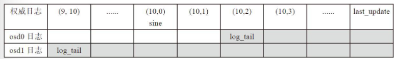

当前`last_epoch_started`的值为`10`，`since`是`last_epoch_started`后的首个日志版本值，当前需要恢复的有效日志是经过`since`操作之后的日志，之前的日志已经没有用了。

*NOTE： `last_epoch_started`是上一次完成Peering的版本值。*

* 对于osd0，其日志`log_tail`大于当前节点的`since`，全部拷贝osd0上的日志；
* 对于osd1，其日志`log_tail`小于当前节点的`since`，只拷贝从`since`开始的日志记录。

当一个PG的主OSD接收到从OSD返回的获取日志ACK应答后，就把该消息封装成`MLogRec`事件。

```cpp
boost::statechart::result PeeringState::GetMissing::react(const MLogRec &logevt) {
    DECLARE_LOCALS;

    peer_missing_requested.erase(logevt.from);
    ps->proc_replica_log(
        logevt.msg->info, logevt.msg->log, std::move(logevt.msg->missing), logevt.from);

    if (peer_missing_requested.empty()) {
        if (ps->need_up_thru) {
            psdout(10) << " still need up_thru update before going active" << dendl;
            post_event(NeedUpThru());
        } else {
            psdout(10) << "Got last missing, don't need missing "
                       << "posting Activate" << dendl;
            post_event(Activate(ps->get_osdmap_epoch()));
        }
    }
    return discard_event();
}
```

具体过程过程如下：
* 调用`proc_replica_log`处理日志。通过日志的对比，获取该OSD上处于missing状态的对象列表。
* 如果`peer_missing_requested`为空，即所有的获取日志请求返回并处理。如果需要`pg->need_up_thru`，投递`NeedUpThru`事件。否则，直接调投递`Activate`事件进入Activate状态。

`proc_replica_log`处理各个从OSD上发过来的日志。它通过比较该OSD的日志和权威日志，来计算该OSD上处于missing状态的对象列表。

### Active

如果GetMissing处理成功，就跳转到Activate状态。到本阶段为止，可以说Peering主要工作已经完成，但还需要后续的处理，激活各个副本。

```cpp
/*---------Active---------*/
PeeringState::Active::Active(my_context ctx)
    : my_base(ctx)
    , NamedState(context<PeeringMachine>().state_history, "Started/Primary/Active")
    , remote_shards_to_reserve_recovery(
          unique_osd_shard_set(context<PeeringMachine>().state->pg_whoami,
                               context<PeeringMachine>().state->acting_recovery_backfill))
    , remote_shards_to_reserve_backfill(
          unique_osd_shard_set(context<PeeringMachine>().state->pg_whoami,
                               context<PeeringMachine>().state->backfill_targets))
    , all_replicas_activated(false) {
    context<PeeringMachine>().log_enter(state_name);


    DECLARE_LOCALS;

    ceph_assert(!ps->backfill_reserved);
    ceph_assert(ps->is_primary());
    psdout(10) << "In Active, about to call activate" << dendl;
    ps->start_flush(context<PeeringMachine>().get_cur_transaction());
    ps->activate(context<PeeringMachine>().get_cur_transaction(),
                 ps->get_osdmap_epoch(),
                 context<PeeringMachine>().get_recovery_ctx());

    // everyone has to commit/ack before we are truly active
    ps->blocked_by.clear();
    for (auto p = ps->acting_recovery_backfill.begin(); p != ps->acting_recovery_backfill.end();
         ++p) {
        if (p->shard != ps->pg_whoami.shard) {
            ps->blocked_by.insert(p->shard);
        }
    }
    pl->publish_stats_to_osd();
    psdout(10) << "Activate Finished" << dendl;
}
```

构造函数处理：
* 初始化`remote_shards_to_reserve_recovery`和`remote_shards_to_reserve_backfill`，需要Recovery操作和Backfill操作的OSD。
* 调用函数`pg->start_flush`来完成相关数据的flush工作。
* 调用函数`pg->activate`激活其他OSD。

```cpp
void PeeringState::activate(ObjectStore::Transaction &t,
                            epoch_t activation_epoch,
                            PeeringCtxWrapper &ctx) {
    ceph_assert(!is_peered());

    // twiddle pg state
    state_clear(PG_STATE_DOWN);

    send_notify = false;

    if (is_primary()) {
        // only update primary last_epoch_started if we will go active
        if (acting_set_writeable()) {
            ceph_assert(cct->_conf->osd_find_best_info_ignore_history_les ||
                        info.last_epoch_started <= activation_epoch);
            info.last_epoch_started = activation_epoch;
            info.last_interval_started = info.history.same_interval_since;
        }
    } else if (is_acting(pg_whoami)) {
        /* update last_epoch_started on acting replica to whatever the primary sent
         * unless it's smaller (could happen if we are going peered rather than
         * active, see doc/dev/osd_internals/last_epoch_started.rst) */
        if (info.last_epoch_started < activation_epoch) {
            info.last_epoch_started = activation_epoch;
            info.last_interval_started = info.history.same_interval_since;
        }
    }

    auto &missing = pg_log.get_missing();

    min_last_complete_ondisk = eversion_t(0, 0);   // we don't know (yet)!
    if (is_primary()) {
        last_update_ondisk = info.last_update;
    }
    last_update_applied = info.last_update;
    last_rollback_info_trimmed_to_applied = pg_log.get_can_rollback_to();

    need_up_thru = false;

    // write pg info, log
    dirty_info = true;
    dirty_big_info = true;   // maybe

    pl->schedule_event_on_commit(
        t,
        std::make_shared<PGPeeringEvent>(get_osdmap_epoch(),
                                         get_osdmap_epoch(),
                                         ActivateCommitted(get_osdmap_epoch(), activation_epoch)));

    // init complete pointer
    if (missing.num_missing() == 0) {
        psdout(10) << "activate - no missing, moving last_complete " << info.last_complete << " -> "
                   << info.last_update << dendl;
        info.last_complete = info.last_update;
        info.stats.stats.sum.num_objects_missing = 0;
        pg_log.reset_recovery_pointers();
    } else {
        psdout(10) << "activate - not complete, " << missing << dendl;
        info.stats.stats.sum.num_objects_missing = missing.num_missing();
        pg_log.activate_not_complete(info);
    }

    log_weirdness();

    if (is_primary()) {
        // initialize snap_trimq
        interval_set<snapid_t> to_trim;
        auto &removed_snaps_queue = get_osdmap()->get_removed_snaps_queue();
        auto p = removed_snaps_queue.find(info.pgid.pgid.pool());
        if (p != removed_snaps_queue.end()) {
            dout(20) << "activate - purged_snaps " << info.purged_snaps << " removed_snaps "
                     << p->second << dendl;
            for (auto q : p->second) {
                to_trim.insert(q.first, q.second);
            }
        }
        interval_set<snapid_t> purged;
        purged.intersection_of(to_trim, info.purged_snaps);
        to_trim.subtract(purged);

        if (HAVE_FEATURE(upacting_features, SERVER_OCTOPUS)) {
            renew_lease(pl->get_mnow());
            // do not schedule until we are actually activated
        }

        // adjust purged_snaps: PG may have been inactive while snaps were pruned
        // from the removed_snaps_queue in the osdmap.  update local purged_snaps
        // reflect only those snaps that we thought were pruned and were still in
        // the queue.
        info.purged_snaps.swap(purged);

        // start up replicas
        if (prior_readable_down_osds.empty()) {
            dout(10) << __func__ << " no prior_readable_down_osds to wait on, clearing ub" << dendl;
            clear_prior_readable_until_ub();
        }
        info.history.refresh_prior_readable_until_ub(pl->get_mnow(), prior_readable_until_ub);

        ceph_assert(!acting_recovery_backfill.empty());
        for (auto i = acting_recovery_backfill.begin(); i != acting_recovery_backfill.end(); ++i) {
            if (*i == pg_whoami)
                continue;
            pg_shard_t peer = *i;
            ceph_assert(peer_info.count(peer));
            pg_info_t &pi = peer_info[peer];

            psdout(10) << "activate peer osd." << peer << " " << pi << dendl;

            MRef<MOSDPGLog> m;
            ceph_assert(peer_missing.count(peer));
            pg_missing_t &pm = peer_missing[peer];

            bool needs_past_intervals = pi.dne();

            // Save num_bytes for backfill reservation request, can't be negative
            peer_bytes[peer] = std::max<int64_t>(0, pi.stats.stats.sum.num_bytes);

            if (pi.last_update == info.last_update) {
                // empty log
                if (!pi.last_backfill.is_max())
                    pl->get_clog_info() << info.pgid << " continuing backfill to osd." << peer
                                        << " from (" << pi.log_tail << "," << pi.last_update << "] "
                                        << pi.last_backfill << " to " << info.last_update;
                if (!pi.is_empty()) {
                    psdout(10) << "activate peer osd." << peer
                               << " is up to date, queueing in pending_activators" << dendl;
                    ctx.send_info(peer.osd,
                                  spg_t(info.pgid.pgid, peer.shard),
                                  get_osdmap_epoch(),   // fixme: use lower epoch?
                                  get_osdmap_epoch(),
                                  info,
                                  get_lease());
                } else {
                    psdout(10) << "activate peer osd." << peer
                               << " is up to date, but sending pg_log anyway" << dendl;
                    m = make_message<MOSDPGLog>(
                        i->shard, pg_whoami.shard, get_osdmap_epoch(), info, last_peering_reset);
                }
            } else if (pg_log.get_tail() > pi.last_update || pi.last_backfill == hobject_t() ||
                       (backfill_targets.count(*i) && pi.last_backfill.is_max())) {
                /* ^ This last case covers a situation where a replica is not contiguous
                 * with the auth_log, but is contiguous with this replica.  Reshuffling
                 * the active set to handle this would be tricky, so instead we just go
                 * ahead and backfill it anyway.  This is probably preferrable in any
                 * case since the replica in question would have to be significantly
                 * behind.
                 */
                // backfill
                pl->get_clog_debug() << info.pgid << " starting backfill to osd." << peer
                                     << " from (" << pi.log_tail << "," << pi.last_update << "] "
                                     << pi.last_backfill << " to " << info.last_update;

                pi.last_update = info.last_update;
                pi.last_complete = info.last_update;
                pi.set_last_backfill(hobject_t());
                pi.last_epoch_started = info.last_epoch_started;
                pi.last_interval_started = info.last_interval_started;
                pi.history = info.history;
                pi.hit_set = info.hit_set;
                pi.stats.stats.clear();
                pi.stats.stats.sum.num_bytes = peer_bytes[peer];

                // initialize peer with our purged_snaps.
                pi.purged_snaps = info.purged_snaps;

                m = make_message<MOSDPGLog>(i->shard,
                                            pg_whoami.shard,
                                            get_osdmap_epoch(),
                                            pi,
                                            last_peering_reset /* epoch to create pg at */);

                // send some recent log, so that op dup detection works well.
                m->log.copy_up_to(cct, pg_log.get_log(), cct->_conf->osd_max_pg_log_entries);
                m->info.log_tail = m->log.tail;
                pi.log_tail = m->log.tail;   // sigh...

                pm.clear();
            } else {
                // catch up
                ceph_assert(pg_log.get_tail() <= pi.last_update);
                m = make_message<MOSDPGLog>(i->shard,
                                            pg_whoami.shard,
                                            get_osdmap_epoch(),
                                            info,
                                            last_peering_reset /* epoch to create pg at */);
                // send new stuff to append to replicas log
                m->log.copy_after(cct, pg_log.get_log(), pi.last_update);
            }

            // share past_intervals if we are creating the pg on the replica
            // based on whether our info for that peer was dne() *before*
            // updating pi.history in the backfill block above.
            if (m && needs_past_intervals)
                m->past_intervals = past_intervals;

            // update local version of peer's missing list!
            if (m && pi.last_backfill != hobject_t()) {
                for (auto p = m->log.log.begin(); p != m->log.log.end(); ++p) {
                    if (p->soid <= pi.last_backfill && !p->is_error()) {
                        if (perform_deletes_during_peering() && p->is_delete()) {
                            pm.rm(p->soid, p->version);
                        } else {
                            pm.add_next_event(*p);
                        }
                    }
                }
            }

            if (m) {
                dout(10) << "activate peer osd." << peer << " sending " << m->log << dendl;
                m->lease = get_lease();
                pl->send_cluster_message(peer.osd, m, get_osdmap_epoch());
            }

            // peer now has
            pi.last_update = info.last_update;

            // update our missing
            if (pm.num_missing() == 0) {
                pi.last_complete = pi.last_update;
                psdout(10) << "activate peer osd." << peer << " " << pi << " uptodate" << dendl;
            } else {
                psdout(10) << "activate peer osd." << peer << " " << pi << " missing " << pm
                           << dendl;
            }
        }

        // Set up missing_loc
        set<pg_shard_t> complete_shards;
        for (auto i = acting_recovery_backfill.begin(); i != acting_recovery_backfill.end(); ++i) {
            psdout(20) << __func__ << " setting up missing_loc from shard " << *i << " " << dendl;
            if (*i == get_primary()) {
                missing_loc.add_active_missing(missing);
                if (!missing.have_missing())
                    complete_shards.insert(*i);
            } else {
                auto peer_missing_entry = peer_missing.find(*i);
                ceph_assert(peer_missing_entry != peer_missing.end());
                missing_loc.add_active_missing(peer_missing_entry->second);
                if (!peer_missing_entry->second.have_missing() &&
                    peer_info[*i].last_backfill.is_max())
                    complete_shards.insert(*i);
            }
        }

        // If necessary, create might_have_unfound to help us find our unfound objects.
        // NOTE: It's important that we build might_have_unfound before trimming the
        // past intervals.
        might_have_unfound.clear();
        if (needs_recovery()) {
            // If only one shard has missing, we do a trick to add all others as recovery
            // source, this is considered safe since the PGLogs have been merged locally,
            // and covers vast majority of the use cases, like one OSD/host is down for
            // a while for hardware repairing
            if (complete_shards.size() + 1 == acting_recovery_backfill.size()) {
                missing_loc.add_batch_sources_info(complete_shards, ctx.handle);
            } else {
                missing_loc.add_source_info(pg_whoami, info, pg_log.get_missing(), ctx.handle);
                for (auto i = acting_recovery_backfill.begin(); i != acting_recovery_backfill.end();
                     ++i) {
                    if (*i == pg_whoami)
                        continue;
                    psdout(10) << __func__ << ": adding " << *i << " as a source" << dendl;
                    ceph_assert(peer_missing.count(*i));
                    ceph_assert(peer_info.count(*i));
                    missing_loc.add_source_info(*i, peer_info[*i], peer_missing[*i], ctx.handle);
                }
            }
            for (auto i = peer_missing.begin(); i != peer_missing.end(); ++i) {
                if (is_acting_recovery_backfill(i->first))
                    continue;
                ceph_assert(peer_info.count(i->first));
                search_for_missing(peer_info[i->first], i->second, i->first, ctx);
            }

            build_might_have_unfound();

            // Always call now so update_calc_stats() will be accurate
            discover_all_missing(ctx.msgs);
        }

        // num_objects_degraded if calculated should reflect this too, unless no
        // missing and we are about to go clean.
        if (get_osdmap()->get_pg_size(info.pgid.pgid) > actingset.size()) {
            state_set(PG_STATE_UNDERSIZED);
        }

        state_set(PG_STATE_ACTIVATING);
        pl->on_activate(std::move(to_trim));
    }
    if (acting_set_writeable()) {
        PGLog::LogEntryHandlerRef rollbacker{pl->get_log_handler(t)};
        pg_log.roll_forward(rollbacker.get());
    }
}
```

处理流程如下：
* 更新`pg_info`，设置info.last_complete指针：
  * 如果`missing.num_missing()`等于`0`，表明处于clean状态。直接更新`info.last_complete`等于`info.last_update`，并调用`pg_log.reset_recovery_pointers()`调整log的`complete_to`指针。
  * 否则，如果有需要恢复的对象，就调用函数`pg_log.activate_not_complete(info)`，设置`info.last_complete`为缺失的第一个对象的前一版本。
* 给每个从OSD发送MOSDPGLog类型的消息，激活该PG的从OSD上的副本。分别对应三种不同处理：
  * 如果`pi.last_update`等于`info.last_update`，这种情况下，该OSD本身就是clean的，不需要给该OSD发送其他信息。只发送pg_info来激活从OSD。
  * 需要Backfill操作的OSD，发送`pg_info`，以及osd_min_pg_log_entries数量的PG日志。
  * 需要Recovery操作的OSD，发送`pg_info`，以及从缺失的日志（`pi.last_update`之后的）。
* 设置MissingLoc，也就是统计缺失的对象，以及缺失的对象所在的OSD，核心就是调用MissingLoc的`add_source_info`函数。
* 设置当前PG的状态：
  * 如果`acting`的数量不够PG size，设置为`PG_STATE_UNDERSIZED | PG_STATE_ACTIVATING`。
  * 否则设置为`PG_STATE_ACTIVATING`。

当收到从OSD发送的`MOSDPGLog`的ACK消息后，触发`MInfoRec`事件。

```cpp
boost::statechart::result PeeringState::Active::react(const MInfoRec &infoevt) {
    DECLARE_LOCALS;
    ceph_assert(ps->is_primary());

    ceph_assert(!ps->acting_recovery_backfill.empty());
    if (infoevt.lease_ack) {
        ps->proc_lease_ack(infoevt.from.osd, *infoevt.lease_ack);
    }
    // don't update history (yet) if we are active and primary; the replica
    // may be telling us they have activated (and committed) but we can't
    // share that until _everyone_ does the same.
    if (ps->is_acting_recovery_backfill(infoevt.from) &&
        ps->peer_activated.count(infoevt.from) == 0) {
        psdout(10) << " peer osd." << infoevt.from << " activated and committed" << dendl;
        ps->peer_activated.insert(infoevt.from);
        ps->blocked_by.erase(infoevt.from.shard);
        pl->publish_stats_to_osd();
        if (ps->peer_activated.size() == ps->acting_recovery_backfill.size()) {
            all_activated_and_committed();
        }
    }
    return discard_event();
}
```

主要流程：
* 调用`ps->proc_lease_ack`确认租约。
* 如果peer在`acting_recovery_backfill`里面，就添加到`peer_activated`中。
* 当`peer_activated`的大小与`acting_recovery_backfill`相等，调用`all_activated_and_committed`。

```cpp
/*
 * update info.history.last_epoch_started ONLY after we and all
 * replicas have activated AND committed the activate transaction
 * (i.e. the peering results are stable on disk).
 */
void PeeringState::Active::all_activated_and_committed() {
    DECLARE_LOCALS;
    psdout(10) << "all_activated_and_committed" << dendl;
    ceph_assert(ps->is_primary());
    ceph_assert(ps->peer_activated.size() == ps->acting_recovery_backfill.size());
    ceph_assert(!ps->acting_recovery_backfill.empty());
    ceph_assert(ps->blocked_by.empty());

    if (HAVE_FEATURE(ps->upacting_features, SERVER_OCTOPUS)) {
        // this is overkill when the activation is quick, but when it is slow it
        // is important, because the lease was renewed by the activate itself but we
        // don't know how long ago that was, and simply scheduling now may leave
        // a gap in lease coverage.  keep it simple and aggressively renew.
        ps->renew_lease(pl->get_mnow());
        ps->send_lease();
        ps->schedule_renew_lease();
    }

    // Degraded?
    ps->update_calc_stats();
    if (ps->info.stats.stats.sum.num_objects_degraded) {
        ps->state_set(PG_STATE_DEGRADED);
    } else {
        ps->state_clear(PG_STATE_DEGRADED);
    }

    post_event(PeeringState::AllReplicasActivated());
}
```

流程如下：
* `renew_lease`并通过`send_lease`和`schedule_renew_lease`重新申请租约。
* 调用`update_calc_stats`计算对象状态。
* 如果有对象degraded，PG状态加上`PG_STATE_DEGRADED`。
* 投递`AllReplicasActivated`事件。

```cpp
boost::statechart::result PeeringState::Active::react(const AllReplicasActivated &evt) {

    DECLARE_LOCALS;
    pg_t pgid = context<PeeringMachine>().spgid.pgid;

    all_replicas_activated = true;

    ps->state_clear(PG_STATE_ACTIVATING);
    ps->state_clear(PG_STATE_CREATING);
    ps->state_clear(PG_STATE_PREMERGE);

    bool merge_target;
    if (ps->pool.info.is_pending_merge(pgid, &merge_target)) {
        ps->state_set(PG_STATE_PEERED);
        ps->state_set(PG_STATE_PREMERGE);

        if (ps->actingset.size() != ps->get_osdmap()->get_pg_size(pgid)) {
            if (merge_target) {
                pg_t src = pgid;
                src.set_ps(ps->pool.info.get_pg_num_pending());
                assert(src.get_parent() == pgid);
                pl->set_not_ready_to_merge_target(pgid, src);
            } else {
                pl->set_not_ready_to_merge_source(pgid);
            }
        }
    } else if (!ps->acting_set_writeable()) {
        ps->state_set(PG_STATE_PEERED);
    } else {
        ps->state_set(PG_STATE_ACTIVE);
    }

    auto mnow = pl->get_mnow();
    if (ps->prior_readable_until_ub > mnow) {
        psdout(10) << " waiting for prior_readable_until_ub " << ps->prior_readable_until_ub
                   << " > mnow " << mnow << dendl;
        ps->state_set(PG_STATE_WAIT);
        pl->queue_check_readable(ps->last_peering_reset, ps->prior_readable_until_ub - mnow);
    } else {
        psdout(10) << " mnow " << mnow << " >= prior_readable_until_ub "
                   << ps->prior_readable_until_ub << dendl;
    }

    if (ps->pool.info.has_flag(pg_pool_t::FLAG_CREATING)) {
        pl->send_pg_created(pgid);
    }

    ps->info.history.last_epoch_started = ps->info.last_epoch_started;
    ps->info.history.last_interval_started = ps->info.last_interval_started;
    ps->dirty_info = true;

    ps->share_pg_info();
    pl->publish_stats_to_osd();

    pl->on_activate_complete();

    return discard_event();
}
```

主要进行如下处理：
* 取消`PG_STATE_ACTIVATING`、`PG_STATE_CREATING`和`PG_STATE_PREMERGE`状态。
* 如果该PG上acting状态的OSD数量大于等于Pool的`min_size`，设置该PG为`PG_STATE_ACTIVE`的状态；否则设置为`PG_STATE_PEERED`状态。
* 如果`pg_info`具有状态`FLAG_CREATING`调用`pl->send_pg_created(pgid)`发送PG创建消息。
* 调用`on_activate_complete`。

```cpp
void PrimaryLogPG::on_activate_complete() {
    check_local();
    // waiters
    if (!recovery_state.needs_flush()) {
        requeue_ops(waiting_for_peered);
    } else if (!waiting_for_peered.empty()) {
        dout(10) << __func__ << " flushes in progress, moving " << waiting_for_peered.size()
                 << " items to waiting_for_flush" << dendl;
        ceph_assert(waiting_for_flush.empty());
        waiting_for_flush.swap(waiting_for_peered);
    }


    // all clean?
    if (needs_recovery()) {
        dout(10) << "activate not all replicas are up-to-date, queueing recovery" << dendl;
        queue_peering_event(PGPeeringEventRef(std::make_shared<PGPeeringEvent>(
            get_osdmap_epoch(), get_osdmap_epoch(), PeeringState::DoRecovery())));
    } else if (needs_backfill()) {
        dout(10) << "activate queueing backfill" << dendl;
        queue_peering_event(PGPeeringEventRef(std::make_shared<PGPeeringEvent>(
            get_osdmap_epoch(), get_osdmap_epoch(), PeeringState::RequestBackfill())));
    } else {
        dout(10) << "activate all replicas clean, no recovery" << dendl;
        queue_peering_event(PGPeeringEventRef(std::make_shared<PGPeeringEvent>(
            get_osdmap_epoch(), get_osdmap_epoch(), PeeringState::AllReplicasRecovered())));
    }

    publish_stats_to_osd();

    if (get_backfill_targets().size()) {
        last_backfill_started = recovery_state.earliest_backfill();
        new_backfill = true;
        ceph_assert(!last_backfill_started.is_max());
        dout(5) << __func__ << ": bft=" << get_backfill_targets() << " from "
                << last_backfill_started << dendl;
        for (set<pg_shard_t>::const_iterator i = get_backfill_targets().begin();
             i != get_backfill_targets().end();
             ++i) {
            dout(5) << "target shard " << *i << " from "
                    << recovery_state.get_peer_info(*i).last_backfill << dendl;
        }
    }

    hit_set_setup();
    agent_setup();
}
```

主要流程：
* `check_local`检查本地的stray对象是否都被删除。
* 如果有读写请求在等待Peering操作，则把该请求添加到处理队列`requeue_ops(pg->waiting_for_peered)`。
* 调用函数`on_activate`，如果需要Recovery操作，触发`DoRecovery`事件，如果需要Backfill操作，触发`RequestBackfill`事件；否则触发`AllReplicasRecovered`事件。
* 初始化Cache Tier需要的`hit_set`对象。
* 初始化Cache Tier需要的`agent`对象。

### Replica View

根据不同的角色，如果是主OSD，PG对应的状态机就进入了Primary状态。如果不是主OSD，就进入Stray状态。

Stray状态有两种情况：
* 接收到`PGINFO`。
* 接收到`MOSDPGLog`。

```cpp
boost::statechart::result PeeringState::Stray::react(const MInfoRec &infoevt) {
    DECLARE_LOCALS;
    psdout(10) << "got info from osd." << infoevt.from << " " << infoevt.info << dendl;

    if (ps->info.last_update > infoevt.info.last_update) {
        // rewind divergent log entries
        ObjectStore::Transaction &t = context<PeeringMachine>().get_cur_transaction();
        ps->rewind_divergent_log(t, infoevt.info.last_update);
        ps->info.stats = infoevt.info.stats;
        ps->info.hit_set = infoevt.info.hit_set;
    }

    if (infoevt.lease) {
        ps->proc_lease(*infoevt.lease);
    }

    ceph_assert(infoevt.info.last_update == ps->info.last_update);
    ceph_assert(ps->pg_log.get_head() == ps->info.last_update);

    post_event(Activate(infoevt.info.last_epoch_started));
    return transit<ReplicaActive>();
}
```

从PG接收到主PG发送的`MInfoRec`事件，也就是接收到主OSD发送的`pg_info`信息。

如果当前`pg->info.last_update`大于`infoevt.info.last_update`，说明当前的日志有divergent的日志，调用函数`rewind_divergent_log`清理日志即可。

最后投递Activate事件，进入ReplicaActive状态。

```cpp
boost::statechart::result PeeringState::Stray::react(const MLogRec &logevt) {
    DECLARE_LOCALS;
    MOSDPGLog *msg = logevt.msg.get();
    psdout(10) << "got info+log from osd." << logevt.from << " " << msg->info << " " << msg->log
               << dendl;

    ObjectStore::Transaction &t = context<PeeringMachine>().get_cur_transaction();
    if (msg->info.last_backfill == hobject_t()) {
        // restart backfill
        ps->info = msg->info;
        pl->on_info_history_change();
        ps->dirty_info = true;
        ps->dirty_big_info = true;   // maybe.

        PGLog::LogEntryHandlerRef rollbacker{pl->get_log_handler(t)};
        ps->pg_log.reset_backfill_claim_log(msg->log, rollbacker.get());

        ps->pg_log.reset_backfill();
    } else {
        ps->merge_log(t, msg->info, std::move(msg->log), logevt.from);
    }
    if (logevt.msg->lease) {
        ps->proc_lease(*logevt.msg->lease);
    }

    ceph_assert(ps->pg_log.get_head() == ps->info.last_update);

    post_event(Activate(logevt.msg->info.last_epoch_started));
    return transit<ReplicaActive>();
}
```

当从PG接收到`MLogRec`事件，就对应着接收到主PG发送的`MOSDPGLog`消息，其通知从PG处于activate状态，具体处理过程如下：
* 如果`msg->info.last_backfill`为`hobject_t()`，从OSD为Backfill的OSD。
* 否则就是需要Recovery操作的OSD，调用`merge_log`把主OSD发送过来的日志合并。
* 确认租约。
* 投递`Activate`事件进入ReplicaActive状态。

### Error Handle

当一个OSD失效，Monitor会通过heartbeat检测到，导致osd map发生了变化，Monitor会把最新的osd map推送给OSD，导致OSD上的受影响PG重新进行Peering操作。

在函数`OSD::handle_osd_map`处理osd map的变化，该函数调用`consume_map`，对每一个PG调用`enqueue_peering_evt`，使其进入Peering状态。

## Recovery

### Resource Reserve

在数据修复的过程中，为了控制一个OSD上正在修复的PG最大数目，需要资源预约，在主OSD上和从OSD上都需要预约。如果没有预约成功，需要阻塞等待。一个OSD能同时修复的最大PG数在配置选项`osd_max_backfills`中设置，默认值为`1`。

`AsyncReserver`用来管理资源预约，其模板参数`<T>`为要预约的资源类型。该类实现了异步的资源预约。当成功完成资源预约后，就调用注册的回调函数通知调用方预约成功。

### State Transit

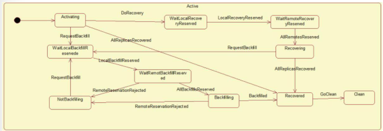

当PG进入Active状态后，就进入默认的子状态Activating。

数据修复的状态转换过程如下所示：
* 当进入Activating状态后，如果此时所有的副本都完整，不需要修复，其状态转移过程如下：
  * Activating状态接收到`AllReplicatedRecovered`事件，直接转换到Recovered状态。
  * Recovered状态接收到`GoClean`事件，整个PG转入Clean状态。
* 当进入Activating状态后，没有Recovery过程，只需要Backfill过程的情况：
  * Activating状态直接接收到`RequestBackfill`事件，进入WaitLocalBackfillReservede状态。
  * 当WaitLocalBackfillReservede状态接收到`LocalBackfillReserved`事件后，意味着本地资源预约成功，转入WaitRemoteBackfillReserved状态。
  * 所有副本资源预约成功后，主PG就会接收到`AllBackfillsReserved`事件，进入Backfilling状态，开始实际数据Backfill操作过程。
  * Backfilling状态接收Backfilled事件，标志Backfill过程完成，进入Recovered状态。
  * 异常处理：当在状态WaitRemotBackfillReserved和Backfilling接收到`RemoteReservationRejected`事件时，表明资源预约失败，进入NotBackfilling状态，再次等待`RequestBackfilling`事件来重新发起Backfill过程。
* 当PG既需要Recovery过程，也可能需要Backfill过程时，PG先完成Recovery过程，再完成Backfill过程，特别强调这里的先后顺序。其具体过程如下：
  * Activating状态：在接收到`DoRecovery`事件后，转移到WaitLocalRecoveryReserved状态。
  * WaitLocalRecoveryReserved状态：在这个状态中完成本地资源的预约。当收到`LocalRecoveryReserved`事件后，标志着本地资源预约的完成，转移到WaitRemoteRecoveryReserved状态。
  * WaitRemoteRecoveryReserved状态：在这个状态中完成远程资源的预约。当接收到`AllRemotesReserved`事件，标志着该PG在所有参与数据修复的从OSD上完成资源预约，进入Recoverying状态。
  * Recoverying状态：在这个状态中完成实际的数据修复工作。完成后把PG设置为`PG_STATE_RECOVERING`状态，开始启动数据修复。
  * 在Recoverying状态完成Recovery工作后，如果需要Backfill工作，就接收RequestBackfill事件，转入Backfill流程。
  * 如果没有Backfill工作流程，直接接收`AllReplicasRecovered`事件，转入Recovered状态。
  * Recovered状态：到达本状态，意味着已经完成数据修复工作。当收到事件`GoClean`后，PG就进入clean状态。

### Recovery Process

数据修复的依据是在Peering过程中产生的如下信息：
* 主副本上的缺失对象的信息保存在`pg_log`类的`pg_missing_t`结构中。
* 各从副本上的缺失对象信息保存在OSD对应的`peer_missing`中的`pg_missing_t`结构中。
* 缺失对象的位置信息保存在`MissingLoc`中。

根据以上信息，就可以知道该PG里各个OSD缺失的对象信息，以及该缺失的对象目前在哪些OSD上有完整的信息。基于上面的信息，数据修复过程就相对比较清晰：
* 对于主OSD缺失的对象，随机选择一个拥有该对象的OSD，把数据拉取过来。
* 对于replica缺失的对象，从主副本上把缺失的对象数据推送到从副本上来完成数据的修复。
* 对于比较特殊的快照对象，在修复时加入了一些优化的方法。

`OSD::do_recovery`函数来执行实际的数据修复操作。

```cpp
void OSD::do_recovery(PG *pg,
                      epoch_t queued,
                      uint64_t reserved_pushes,
                      ThreadPool::TPHandle &handle) {
    uint64_t started = 0;

    /*
     * When the value of osd_recovery_sleep is set greater than zero, recovery
     * ops are scheduled after osd_recovery_sleep amount of time from the previous
     * recovery event's schedule time. This is done by adding a
     * recovery_requeue_callback event, which re-queues the recovery op using
     * queue_recovery_after_sleep.
     */
    float recovery_sleep = get_osd_recovery_sleep();
    {
        std::lock_guard l(service.sleep_lock);
        if (recovery_sleep > 0 && service.recovery_needs_sleep) {
            PGRef pgref(pg);
            auto recovery_requeue_callback =
                new LambdaContext([this, pgref, queued, reserved_pushes](int r) {
                    dout(20) << "do_recovery wake up at " << ceph_clock_now()
                             << ", re-queuing recovery" << dendl;
                    std::lock_guard l(service.sleep_lock);
                    service.recovery_needs_sleep = false;
                    service.queue_recovery_after_sleep(pgref.get(), queued, reserved_pushes);
                });

            // This is true for the first recovery op and when the previous recovery op
            // has been scheduled in the past. The next recovery op is scheduled after
            // completing the sleep from now.

            if (auto now = ceph::real_clock::now(); service.recovery_schedule_time < now) {
                service.recovery_schedule_time = now;
            }
            service.recovery_schedule_time += ceph::make_timespan(recovery_sleep);
            service.sleep_timer.add_event_at(service.recovery_schedule_time,
                                             recovery_requeue_callback);
            dout(20) << "Recovery event scheduled at " << service.recovery_schedule_time << dendl;
            return;
        }
    }

    {
        {
            std::lock_guard l(service.sleep_lock);
            service.recovery_needs_sleep = true;
        }

        if (pg->pg_has_reset_since(queued)) {
            goto out;
        }

        dout(10) << "do_recovery starting " << reserved_pushes << " " << *pg << dendl;
#ifdef DEBUG_RECOVERY_OIDS
        dout(20) << "  active was " << service.recovery_oids[pg->pg_id] << dendl;
#endif

        bool do_unfound = pg->start_recovery_ops(reserved_pushes, handle, &started);
        dout(10) << "do_recovery started " << started << "/" << reserved_pushes << " on " << *pg
                 << dendl;

        if (do_unfound) {
            PeeringCtx rctx = create_context();
            rctx.handle = &handle;
            pg->find_unfound(queued, rctx);
            dispatch_context(rctx, pg, pg->get_osdmap());
        }
    }

out:
    ceph_assert(started <= reserved_pushes);
    service.release_reserved_pushes(reserved_pushes);
}
```

其中`OSD::get_osd_recovery_sleep`可以控制数据恢复的速度。

```cpp
float OSD::get_osd_recovery_sleep() {
    if (cct->_conf->osd_recovery_sleep)
        return cct->_conf->osd_recovery_sleep;
    if (!store_is_rotational && !journal_is_rotational)
        return cct->_conf->osd_recovery_sleep_ssd;
    else if (store_is_rotational && !journal_is_rotational)
        return cct->_conf.get_val<double>("osd_recovery_sleep_hybrid");
    else
        return cct->_conf->osd_recovery_sleep_hdd;
}
```

具体处理流程如下：
* 配置选项`osd_recovery_sleep`设置了线程做一次修复后的休眠时间。如果设置了该值，每次线程开始先休眠相应的时间长度。该参数默认值为0，不需要休眠。
* 调用`PrimaryLogPG::start_recovery_ops`进行实际恢复。

```cpp
bool PrimaryLogPG::start_recovery_ops(uint64_t max,
                                      ThreadPool::TPHandle &handle,
                                      uint64_t *ops_started) {
    uint64_t &started = *ops_started;
    started = 0;
    bool work_in_progress = false;
    bool recovery_started = false;
    ceph_assert(is_primary());
    ceph_assert(is_peered());
    ceph_assert(!recovery_state.is_deleting());

    ceph_assert(recovery_queued);
    recovery_queued = false;

    if (!state_test(PG_STATE_RECOVERING) && !state_test(PG_STATE_BACKFILLING)) {
        /* TODO: I think this case is broken and will make do_recovery()
         * unhappy since we're returning false */
        dout(10) << "recovery raced and were queued twice, ignoring!" << dendl;
        return have_unfound();
    }

    const auto &missing = recovery_state.get_pg_log().get_missing();

    uint64_t num_unfound = get_num_unfound();

    if (!recovery_state.have_missing()) {
        recovery_state.local_recovery_complete();
    }

    if (!missing.have_missing() ||   // Primary does not have missing
                                     // or all of the missing objects are unfound.
        recovery_state.all_missing_unfound()) {
        // Recover the replicas.
        started = recover_replicas(max, handle, &recovery_started);
    }
    if (!started) {
        // We still have missing objects that we should grab from replicas.
        started += recover_primary(max, handle);
    }
    if (!started && num_unfound != get_num_unfound()) {
        // second chance to recovery replicas
        started = recover_replicas(max, handle, &recovery_started);
    }

    if (started || recovery_started)
        work_in_progress = true;

    bool deferred_backfill = false;
    if (recovering.empty() && state_test(PG_STATE_BACKFILLING) && !get_backfill_targets().empty() &&
        started < max && missing.num_missing() == 0 && waiting_on_backfill.empty()) {
        if (get_osdmap()->test_flag(CEPH_OSDMAP_NOBACKFILL)) {
            dout(10) << "deferring backfill due to NOBACKFILL" << dendl;
            deferred_backfill = true;
        } else if (get_osdmap()->test_flag(CEPH_OSDMAP_NOREBALANCE) && !is_degraded()) {
            dout(10) << "deferring backfill due to NOREBALANCE" << dendl;
            deferred_backfill = true;
        } else if (!recovery_state.is_backfill_reserved()) {
            /* DNMNOTE I think this branch is dead */
            dout(10) << "deferring backfill due to !backfill_reserved" << dendl;
            if (!backfill_reserving) {
                dout(10) << "queueing RequestBackfill" << dendl;
                backfill_reserving = true;
                queue_peering_event(PGPeeringEventRef(std::make_shared<PGPeeringEvent>(
                    get_osdmap_epoch(), get_osdmap_epoch(), PeeringState::RequestBackfill())));
            }
            deferred_backfill = true;
        } else {
            started += recover_backfill(max - started, handle, &work_in_progress);
        }
    }

    dout(10) << " started " << started << dendl;
    osd->logger->inc(l_osd_rop, started);

    if (!recovering.empty() || work_in_progress || recovery_ops_active > 0 || deferred_backfill)
        return !work_in_progress && have_unfound();

    ceph_assert(recovering.empty());
    ceph_assert(recovery_ops_active == 0);

    dout(10) << __func__
             << " needs_recovery: " << recovery_state.get_missing_loc().get_needs_recovery()
             << dendl;
    dout(10) << __func__ << " missing_loc: " << recovery_state.get_missing_loc().get_missing_locs()
             << dendl;
    int unfound = get_num_unfound();
    if (unfound) {
        dout(10) << " still have " << unfound << " unfound" << dendl;
        return true;
    }

    if (missing.num_missing() > 0) {
        // this shouldn't happen!
        osd->clog->error() << info.pgid << " Unexpected Error: recovery ending with "
                           << missing.num_missing() << ": " << missing.get_items();
        return false;
    }

    if (needs_recovery()) {
        // this shouldn't happen!
        // We already checked num_missing() so we must have missing replicas
        osd->clog->error() << info.pgid
                           << " Unexpected Error: recovery ending with missing replicas";
        return false;
    }

    if (state_test(PG_STATE_RECOVERING)) {
        state_clear(PG_STATE_RECOVERING);
        state_clear(PG_STATE_FORCED_RECOVERY);
        if (needs_backfill()) {
            dout(10) << "recovery done, queuing backfill" << dendl;
            queue_peering_event(PGPeeringEventRef(std::make_shared<PGPeeringEvent>(
                get_osdmap_epoch(), get_osdmap_epoch(), PeeringState::RequestBackfill())));
        } else {
            dout(10) << "recovery done, no backfill" << dendl;
            state_clear(PG_STATE_FORCED_BACKFILL);
            queue_peering_event(PGPeeringEventRef(std::make_shared<PGPeeringEvent>(
                get_osdmap_epoch(), get_osdmap_epoch(), PeeringState::AllReplicasRecovered())));
        }
    } else {   // backfilling
        state_clear(PG_STATE_BACKFILLING);
        state_clear(PG_STATE_FORCED_BACKFILL);
        state_clear(PG_STATE_FORCED_RECOVERY);
        dout(10) << "recovery done, backfill done" << dendl;
        queue_peering_event(PGPeeringEventRef(std::make_shared<PGPeeringEvent>(
            get_osdmap_epoch(), get_osdmap_epoch(), PeeringState::Backfilled())));
    }

    return false;
}
```

主要流程：
* 进行一些状态检查。
* 根据当前primary状态进行恢复：
  * 如果`num_missing`等于`num_unfound`，说明主OSD所缺失对象都为unfound类型的对象，先调用函数`recover_replicas`启动修复replica上的对象。
  * 如果`started`为`0`，也就是已经启动修复的对象数量为`0`，调用函数`recover_primary`修复主OSD上的对象。
  * 如果`started`仍然为0，且`num_unfound`有变化，再次启动`recover_replicas`修复副本。
* 如果`started`不为零或`recovery_started`不为`false`，设置`work_in_progress`的值为true。
* 如果recovering队列为空，也就是没有正在进行Recovery操作的对象，状态为`PG_STATE_BACKFILL`，并且`backfill_targets`不为空，`started`小于`max`，`missing.num_missing()`为`0`，的情况下：
  * 如果`PG_STATE_RECOVERING`设置了：
    *  如果需要backfill，就投递`RequestBackfill`事件给状态机，启动Backfill过程。
    *  否则投递`AllReplicasRecovered`事件。
  * 否则，投递`Backfilled`事件完成数据恢复。

```cpp
/**
 * do one recovery op.
 * return true if done, false if nothing left to do.
 */
uint64_t PrimaryLogPG::recover_primary(uint64_t max, ThreadPool::TPHandle &handle) {
    ceph_assert(is_primary());

    const auto &missing = recovery_state.get_pg_log().get_missing();

    dout(10) << __func__ << " recovering " << recovering.size() << " in pg,"
             << " missing " << missing << dendl;

    dout(25) << __func__ << " " << missing.get_items() << dendl;

    // look at log!
    pg_log_entry_t *latest = 0;
    unsigned started = 0;
    int skipped = 0;

    PGBackend::RecoveryHandle *h = pgbackend->open_recovery_op();
    map<version_t, hobject_t>::const_iterator p =
        missing.get_rmissing().lower_bound(recovery_state.get_pg_log().get_log().last_requested);
    while (p != missing.get_rmissing().end()) {
        handle.reset_tp_timeout();
        hobject_t soid;
        version_t v = p->first;

        auto it_objects = recovery_state.get_pg_log().get_log().objects.find(p->second);
        if (it_objects != recovery_state.get_pg_log().get_log().objects.end()) {
            latest = it_objects->second;
            ceph_assert(latest->is_update() || latest->is_delete());
            soid = latest->soid;
        } else {
            latest = 0;
            soid = p->second;
        }
        const pg_missing_item &item = missing.get_items().find(p->second)->second;
        ++p;

        hobject_t head = soid.get_head();

        eversion_t need = item.need;

        dout(10) << __func__ << " " << soid << " " << item.need
                 << (missing.is_missing(soid) ? " (missing)" : "")
                 << (missing.is_missing(head) ? " (missing head)" : "")
                 << (recovering.count(soid) ? " (recovering)" : "")
                 << (recovering.count(head) ? " (recovering head)" : "") << dendl;

        if (latest) {
            switch (latest->op) {
            case pg_log_entry_t::CLONE:
                /*
                 * Handling for this special case removed for now, until we
                 * can correctly construct an accurate SnapSet from the old
                 * one.
                 */
                break;

            case pg_log_entry_t::LOST_REVERT: {
                if (item.have == latest->reverting_to) {
                    ObjectContextRef obc = get_object_context(soid, true);

                    if (obc->obs.oi.version == latest->version) {
                        // I'm already reverting
                        dout(10) << " already reverting " << soid << dendl;
                    } else {
                        dout(10) << " reverting " << soid << " to " << latest->prior_version
                                 << dendl;
                        obc->obs.oi.version = latest->version;

                        ObjectStore::Transaction t;
                        bufferlist b2;
                        obc->obs.oi.encode(
                            b2, get_osdmap()->get_features(CEPH_ENTITY_TYPE_OSD, nullptr));
                        ceph_assert(!pool.info.require_rollback());
                        t.setattr(coll, ghobject_t(soid), OI_ATTR, b2);

                        recovery_state.recover_got(soid, latest->version, false, t);

                        ++active_pushes;

                        t.register_on_applied(new C_OSD_AppliedRecoveredObject(this, obc));
                        t.register_on_commit(new C_OSD_CommittedPushedObject(
                            this, get_osdmap_epoch(), info.last_complete));
                        osd->store->queue_transaction(ch, std::move(t));
                        continue;
                    }
                } else {
                    /*
                     * Pull the old version of the object.  Update missing_loc here to have the
                     * location of the version we want.
                     *
                     * This doesn't use the usual missing_loc paths, but that's okay:
                     *  - if we have it locally, we hit the case above, and go from there.
                     *  - if we don't, we always pass through this case during recovery and set up
                     * the location properly.
                     *  - this way we don't need to mangle the missing code to be general about
                     * needing an old version...
                     */
                    eversion_t alternate_need = latest->reverting_to;
                    dout(10) << " need to pull prior_version " << alternate_need << " for revert "
                             << item << dendl;

                    set<pg_shard_t> good_peers;
                    for (auto p = recovery_state.get_peer_missing().begin();
                         p != recovery_state.get_peer_missing().end();
                         ++p) {
                        if (p->second.is_missing(soid, need) &&
                            p->second.get_items().at(soid).have == alternate_need) {
                            good_peers.insert(p->first);
                        }
                    }
                    recovery_state.set_revert_with_targets(soid, good_peers);
                    dout(10) << " will pull " << alternate_need << " or " << need << " from one of "
                             << recovery_state.get_missing_loc().get_locations(soid) << dendl;
                }
            } break;
            }
        }

        if (!recovering.count(soid)) {
            if (recovering.count(head)) {
                ++skipped;
            } else {
                int r = recover_missing(soid, need, get_recovery_op_priority(), h);
                switch (r) {
                case PULL_YES:
                    ++started;
                    break;
                case PULL_HEAD:
                    ++started;
                case PULL_NONE:
                    ++skipped;
                    break;
                default:
                    ceph_abort();
                }
                if (started >= max)
                    break;
            }
        }

        // only advance last_requested if we haven't skipped anything
        if (!skipped)
            recovery_state.set_last_requested(v);
    }

    pgbackend->run_recovery_op(h, get_recovery_op_priority());
    return started;
}
```

恢复主要流程：
* 遍历`missing`列表：
  * 如果是`CLONE`跳过。
  * 如果为`LOST_REVERT`，该revert操作为数据不一致时，管理员通过命令行强行回退到指定版本，reverting_to记录了回退的版本号：
    * 如果`item.have`等于`latest->reverting_to`版本，也就是通过日志记录显示当前已经拥有回退的版本，那么就获取对象的`ObjectContext`，如果检查对象当前的版本`obc->obs.oi.version`等于`latest->version`，说明该回退操作完成。
    * 如果`item.have`等于`latest->reverting_to`，但是对象当前的版本`obc->obs.oi.version`不等于`latest->version`，说明没有执行回退操作，直接修改对象的版本号为`latest->version`即可。
  * 否则，需要拉取该`reverting_to`版本的对象，这里不做特殊的处理，只是检查所有OSD是否拥有该版本的对象，如果有就加入到`missing_loc`记录该版本的位置信息，由后续修复继续来完成。
  * 如果该对象在recovering过程中，表明正在修复，或者其head对象正在修复，跳过，并计数增加`skipped`；否则调用函数`recover_missing`来修复对象。

`get_recovery_op_priority`控制恢复的优先级。

```cpp
int get_recovery_op_priority() const {
    int64_t pri = 0;
    pool.info.opts.get(pool_opts_t::RECOVERY_OP_PRIORITY, &pri);
    return pri > 0 ? pri : cct->_conf->osd_recovery_op_priority;
}
```

体现在`ReplicatedBackend::run_recovery_op`中。

```cpp
void ReplicatedBackend::run_recovery_op(PGBackend::RecoveryHandle *_h, int priority) {
    RPGHandle *h = static_cast<RPGHandle *>(_h);
    send_pushes(priority, h->pushes);
    send_pulls(priority, h->pulls);
    send_recovery_deletes(priority, h->deletes);
    delete h;
}
```

```cpp
class PGRecoveryMsg {
public:
    op_scheduler_class get_scheduler_class() const final {
        auto priority = op->get_req()->get_priority();
        if (priority >= CEPH_MSG_PRIO_HIGH) {
            return op_scheduler_class::immediate;
        }
        return op_scheduler_class::background_recovery;
    }
};

#define CEPH_MSG_PRIO_LOW     64
#define CEPH_MSG_PRIO_DEFAULT 127
#define CEPH_MSG_PRIO_HIGH    196
#define CEPH_MSG_PRIO_HIGHEST 255
```

下面举例说明，当最后的日志记录类型为LOST_REVERT时的修复过程。

PG日志的记录如下：每个单元代表一条日志记录，分别为对象的名字和版本以及操作，版本的格式为`（epoch，version）`。灰色的部分代表本OSD上缺失的日志记录，该日志记录是从权威日志记录中拷贝过来的，所以当前该日志记录是连续完整的。

**正常情况的修复：**


缺失的对象列表为`[obj1，obj2]`。当前修复对象为`obj1`。由日志记录可知：对象`obj1`被修改过三次，分别为版本`6，7，8`。当前拥有的`obj1`对象的版本`have`值为`4`，修复时只修复到最后修改的版本`8`即可。

**最后一个操作为`LOST_REVERT`类型的操作：**

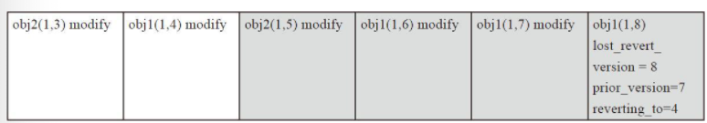

对于要修复的对象obj1，最后一次操作为`LOST_REVERT`类型的操作，该操作当前版本`version`为`8`，修改前的版本`prior_version`为`7`，回退版本`reverting_to`为`4`。在这种情况下，日志显示当前已经有版本`4`，检查对象`obj1`的实际版本，也就是`object_info`里保存的版本号：
* 如果该值是`8`，说明最后一次revert操作成功，不需要做任何修复动作。
* 如果该值是`4`，说明`LOST_REVERT`操作就没有执行。当然数据内容已经是版本`4`了，只需要修改`object_info`的版本为`8`即可。
* 如果回退的版本`reverting_to`不是版本`4`，而是要回退到版本`6`，那么最终还是需要把`obj1`的数据修复到版本`6`的数据。Ceph在这里的处理，仅仅是检查其他OSD缺失的对象中是否有版本`6`，如果有，就加入到`missing_loc`中，记录拥有该版本的OSD位置，待后续继续修复。

```cpp
int ReplicatedBackend::recover_object(const hobject_t &hoid,
                                      eversion_t v,
                                      ObjectContextRef head,
                                      ObjectContextRef obc,
                                      RecoveryHandle *_h) {
    dout(10) << __func__ << ": " << hoid << dendl;
    RPGHandle *h = static_cast<RPGHandle *>(_h);
    if (get_parent()->get_local_missing().is_missing(hoid)) {
        ceph_assert(!obc);
        // pull
        prepare_pull(v, hoid, head, h);
    } else {
        ceph_assert(obc);
        int started = start_pushes(hoid, obc, h);
        if (started < 0) {
            pushing[hoid].clear();
            return started;
        }
    }
    return 0;
}
```

* 对于primary missing的对象，调用`prepare_pull`，后续从其他replica上pull。
* 否则调用`start_pushes`，后续准备push给replica。

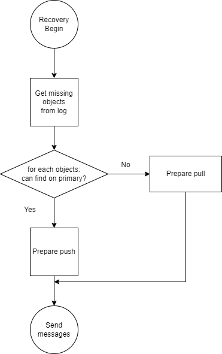

对于pushs和delete流程：
* 考虑push对象数量限制。
* 考虑push对象代价。

```cpp
void ReplicatedBackend::send_pushes(int prio, map<pg_shard_t, vector<PushOp>> &pushes) {
    for (map<pg_shard_t, vector<PushOp>>::iterator i = pushes.begin(); i != pushes.end(); ++i) {
        ConnectionRef con = get_parent()->get_con_osd_cluster(i->first.osd, get_osdmap_epoch());
        if (!con)
            continue;
        vector<PushOp>::iterator j = i->second.begin();
        while (j != i->second.end()) {
            uint64_t cost = 0;
            uint64_t pushes = 0;
            MOSDPGPush *msg = new MOSDPGPush();
            msg->from = get_parent()->whoami_shard();
            msg->pgid = get_parent()->primary_spg_t();
            msg->map_epoch = get_osdmap_epoch();
            msg->min_epoch = get_parent()->get_last_peering_reset_epoch();
            msg->set_priority(prio);
            msg->is_repair = get_parent()->pg_is_repair();
            for (; (j != i->second.end() && cost < cct->_conf->osd_max_push_cost &&
                    pushes < cct->_conf->osd_max_push_objects);
                 ++j) {
                dout(20) << __func__ << ": sending push " << *j << " to osd." << i->first << dendl;
                cost += j->cost(cct);
                pushes += 1;
                msg->pushes.push_back(*j);
            }
            msg->set_cost(cost);
            get_parent()->send_message_osd_cluster(msg, con);
        }
    }
}

void PGBackend::send_recovery_deletes(
    int prio, const map<pg_shard_t, vector<pair<hobject_t, eversion_t>>> &deletes) {
    epoch_t min_epoch = get_parent()->get_last_peering_reset_epoch();
    for (const auto &p : deletes) {
        const auto &shard = p.first;
        const auto &objects = p.second;
        ConnectionRef con = get_parent()->get_con_osd_cluster(shard.osd, get_osdmap_epoch());
        if (!con)
            continue;
        auto it = objects.begin();
        while (it != objects.end()) {
            uint64_t cost = 0;
            uint64_t deletes = 0;
            spg_t target_pg = spg_t(get_parent()->get_info().pgid.pgid, shard.shard);
            MOSDPGRecoveryDelete *msg = new MOSDPGRecoveryDelete(
                get_parent()->whoami_shard(), target_pg, get_osdmap_epoch(), min_epoch);
            msg->set_priority(prio);

            while (it != objects.end() && cost < cct->_conf->osd_max_push_cost &&
                   deletes < cct->_conf->osd_max_push_objects) {
                dout(20) << __func__ << ": sending recovery delete << " << it->first << " "
                         << it->second << " to osd." << shard << dendl;
                msg->objects.push_back(*it);
                cost += cct->_conf->osd_push_per_object_cost;
                ++deletes;
                ++it;
            }

            msg->set_cost(cost);
            get_parent()->send_message_osd_cluster(msg, con);
        }
    }
}
```

```cpp
void ReplicatedBackend::send_pulls(int prio, map<pg_shard_t, vector<PullOp>> &pulls) {
    for (map<pg_shard_t, vector<PullOp>>::iterator i = pulls.begin(); i != pulls.end(); ++i) {
        ConnectionRef con = get_parent()->get_con_osd_cluster(i->first.osd, get_osdmap_epoch());
        if (!con)
            continue;
        dout(20) << __func__ << ": sending pulls " << i->second << " to osd." << i->first << dendl;
        MOSDPGPull *msg = new MOSDPGPull();
        msg->from = parent->whoami_shard();
        msg->set_priority(prio);
        msg->pgid = get_parent()->primary_spg_t();
        msg->map_epoch = get_osdmap_epoch();
        msg->min_epoch = get_parent()->get_last_peering_reset_epoch();
        msg->set_pulls(std::move(i->second));
        msg->compute_cost(cct);
        get_parent()->send_message_osd_cluster(msg, con);
    }
}
```

当主OSD把对象推送给缺失该对象的从OSD后，从OSD需要调用函数`handle_push`来实现数据写入工作，从而来完成该对象的修复。同样，当主OSD给从OSD发起拉取对象的请求来修复自己缺失的对象时，需要调用函数`handle_pulls`来处理该请求。

```cpp
void ReplicatedBackend::handle_push(pg_shard_t from,
                                    const PushOp &pop,
                                    PushReplyOp *response,
                                    ObjectStore::Transaction *t,
                                    bool is_repair) {
    dout(10) << "handle_push " << pop.recovery_info << pop.after_progress << dendl;
    bufferlist data;
    data = pop.data;
    bool first = pop.before_progress.first;
    bool complete = pop.after_progress.data_complete && pop.after_progress.omap_complete;
    bool clear_omap = !pop.before_progress.omap_complete;
    interval_set<uint64_t> data_zeros;
    uint64_t z_offset = pop.before_progress.data_recovered_to;
    uint64_t z_length =
        pop.after_progress.data_recovered_to - pop.before_progress.data_recovered_to;
    if (z_length)
        data_zeros.insert(z_offset, z_length);
    response->soid = pop.recovery_info.soid;

    submit_push_data(pop.recovery_info,
                     first,
                     complete,
                     clear_omap,
                     true,   // must be replicate
                     data_zeros,
                     pop.data_included,
                     data,
                     pop.omap_header,
                     pop.attrset,
                     pop.omap_entries,
                     t);

    if (complete) {
        if (is_repair) {
            get_parent()->inc_osd_stat_repaired();
            dout(20) << __func__ << " repair complete" << dendl;
        }
        get_parent()->on_local_recover(pop.recovery_info.soid,
                                       pop.recovery_info,
                                       ObjectContextRef(),   // ok, is replica
                                       false,
                                       t);
    }
}

void ReplicatedBackend::handle_pull(pg_shard_t peer, PullOp &op, PushOp *reply) {
    const hobject_t &soid = op.soid;
    struct stat st;
    int r = store->stat(ch, ghobject_t(soid), &st);
    if (r != 0) {
        get_parent()->clog_error() << get_info().pgid << " " << peer << " tried to pull " << soid
                                   << " but got " << cpp_strerror(-r);
        prep_push_op_blank(soid, reply);
    } else {
        ObjectRecoveryInfo &recovery_info = op.recovery_info;
        ObjectRecoveryProgress &progress = op.recovery_progress;
        if (progress.first && recovery_info.size == ((uint64_t)-1)) {
            // Adjust size and copy_subset
            recovery_info.size = st.st_size;
            if (st.st_size) {
                interval_set<uint64_t> object_range;
                object_range.insert(0, st.st_size);
                recovery_info.copy_subset.intersection_of(object_range);
            } else {
                recovery_info.copy_subset.clear();
            }
            assert(recovery_info.clone_subset.empty());
        }

        r = build_push_op(recovery_info, progress, 0, reply);
        if (r < 0)
            prep_push_op_blank(soid, reply);
    }
}
```

```cpp
bool ReplicatedBackend::handle_pull_response(pg_shard_t from,
                                             const PushOp &pop,
                                             PullOp *response,
                                             list<pull_complete_info> *to_continue,
                                             ObjectStore::Transaction *t) {
    interval_set<uint64_t> data_included = pop.data_included;
    bufferlist data;
    data = pop.data;
    dout(10) << "handle_pull_response " << pop.recovery_info << pop.after_progress
             << " data.size() is " << data.length() << " data_included: " << data_included << dendl;
    if (pop.version == eversion_t()) {
        // replica doesn't have it!
        _failed_pull(from, pop.soid);
        return false;
    }

    const hobject_t &hoid = pop.soid;
    ceph_assert((data_included.empty() && data.length() == 0) ||
                (!data_included.empty() && data.length() > 0));

    auto piter = pulling.find(hoid);
    if (piter == pulling.end()) {
        return false;
    }

    PullInfo &pi = piter->second;
    if (pi.recovery_info.size == (uint64_t(-1))) {
        pi.recovery_info.size = pop.recovery_info.size;
        pi.recovery_info.copy_subset.intersection_of(pop.recovery_info.copy_subset);
    }
    // If primary doesn't have object info and didn't know version
    if (pi.recovery_info.version == eversion_t()) {
        pi.recovery_info.version = pop.version;
    }

    bool first = pi.recovery_progress.first;
    if (first) {
        // attrs only reference the origin bufferlist (decode from
        // MOSDPGPush message) whose size is much greater than attrs in
        // recovery. If obc cache it (get_obc maybe cache the attr), this
        // causes the whole origin bufferlist would not be free until obc
        // is evicted from obc cache. So rebuild the bufferlists before
        // cache it.
        auto attrset = pop.attrset;
        for (auto &a : attrset) {
            a.second.rebuild();
        }
        pi.obc = get_parent()->get_obc(pi.recovery_info.soid, attrset);
        if (attrset.find(SS_ATTR) != attrset.end()) {
            bufferlist ssbv = attrset.at(SS_ATTR);
            SnapSet ss(ssbv);
            assert(!pi.obc->ssc->exists || ss.seq == pi.obc->ssc->snapset.seq);
        }
        pi.recovery_info.oi = pi.obc->obs.oi;
        pi.recovery_info = recalc_subsets(pi.recovery_info, pi.obc->ssc, pi.lock_manager);
    }


    interval_set<uint64_t> usable_intervals;
    bufferlist usable_data;
    trim_pushed_data(
        pi.recovery_info.copy_subset, data_included, data, &usable_intervals, &usable_data);
    data_included = usable_intervals;
    data = std::move(usable_data);


    pi.recovery_progress = pop.after_progress;

    dout(10) << "new recovery_info " << pi.recovery_info << ", new progress "
             << pi.recovery_progress << dendl;
    interval_set<uint64_t> data_zeros;
    uint64_t z_offset = pop.before_progress.data_recovered_to;
    uint64_t z_length =
        pop.after_progress.data_recovered_to - pop.before_progress.data_recovered_to;
    if (z_length)
        data_zeros.insert(z_offset, z_length);
    bool complete = pi.is_complete();
    bool clear_omap = !pop.before_progress.omap_complete;

    submit_push_data(pi.recovery_info,
                     first,
                     complete,
                     clear_omap,
                     pi.cache_dont_need,
                     data_zeros,
                     data_included,
                     data,
                     pop.omap_header,
                     pop.attrset,
                     pop.omap_entries,
                     t);

    pi.stat.num_keys_recovered += pop.omap_entries.size();
    pi.stat.num_bytes_recovered += data.length();
    get_parent()->get_logger()->inc(l_osd_rbytes, pop.omap_entries.size() + data.length());

    if (complete) {
        pi.stat.num_objects_recovered++;
        // XXX: This could overcount if regular recovery is needed right after a repair
        if (get_parent()->pg_is_repair()) {
            pi.stat.num_objects_repaired++;
            get_parent()->inc_osd_stat_repaired();
        }
        clear_pull_from(piter);
        to_continue->push_back({hoid, pi.stat});
        get_parent()->on_local_recover(hoid, pi.recovery_info, pi.obc, false, t);
        return false;
    } else {
        response->soid = pop.soid;
        response->recovery_info = pi.recovery_info;
        response->recovery_progress = pi.recovery_progress;
        return true;
    }
}
```

一轮recovery操作可能无法完成数据恢复。

`osd_recovery_max_single_start`限制了单次recovery操作能恢复的对象数量。

```cpp
void OSDService::_maybe_queue_recovery() {
    ceph_assert(ceph_mutex_is_locked_by_me(recovery_lock));
    uint64_t available_pushes;
    while (!awaiting_throttle.empty() && _recover_now(&available_pushes)) {
        uint64_t to_start = std::min(available_pushes, cct->_conf->osd_recovery_max_single_start);
        _queue_for_recovery(awaiting_throttle.front(), to_start);
        awaiting_throttle.pop_front();
        dout(10) << __func__ << " starting " << to_start << ", recovery_ops_reserved "
                 << recovery_ops_reserved << " -> " << (recovery_ops_reserved + to_start) << dendl;
        recovery_ops_reserved += to_start;
    }
}
```

`_maybe_queue_recovery`会在许多地方被调用，以完成recovery操作。

## Backfill

当PG完成了Recovery过程之后，如果backfill_targets不为空，表明有需要Backfill过程的OSD，就需要启动Backfill的任务，来完成PG的全部修复。

```cpp
/**
 * recover_backfill
 *
 * Invariants:
 *
 * backfilled: fully pushed to replica or present in replica's missing set (both
 * our copy and theirs).
 *
 * All objects on a backfill_target in
 * [MIN,peer_backfill_info[backfill_target].begin) are valid; logically-removed
 * objects have been actually deleted and all logically-valid objects are replicated.
 * There may be PG objects in this interval yet to be backfilled.
 *
 * All objects in PG in [MIN,backfill_info.begin) have been backfilled to all
 * backfill_targets.  There may be objects on backfill_target(s) yet to be deleted.
 *
 * For a backfill target, all objects < std::min(peer_backfill_info[target].begin,
 *     backfill_info.begin) in PG are backfilled.  No deleted objects in this
 * interval remain on the backfill target.
 *
 * For a backfill target, all objects <= peer_info[target].last_backfill
 * have been backfilled to target
 *
 * There *MAY* be missing/outdated objects between last_backfill_started and
 * std::min(peer_backfill_info[*].begin, backfill_info.begin) in the event that client
 * io created objects since the last scan.  For this reason, we call
 * update_range() again before continuing backfill.
 */
uint64_t PrimaryLogPG::recover_backfill(uint64_t max,
                                        ThreadPool::TPHandle &handle,
                                        bool *work_started) {
    dout(10) << __func__ << " (" << max << ")"
             << " bft=" << get_backfill_targets() << " last_backfill_started "
             << last_backfill_started << (new_backfill ? " new_backfill" : "") << dendl;
    ceph_assert(!get_backfill_targets().empty());

    // Initialize from prior backfill state
    if (new_backfill) {
        // on_activate() was called prior to getting here
        ceph_assert(last_backfill_started == recovery_state.earliest_backfill());
        new_backfill = false;

        // initialize BackfillIntervals
        for (set<pg_shard_t>::const_iterator i = get_backfill_targets().begin();
             i != get_backfill_targets().end();
             ++i) {
            peer_backfill_info[*i].reset(recovery_state.get_peer_info(*i).last_backfill);
        }
        backfill_info.reset(last_backfill_started);

        backfills_in_flight.clear();
        pending_backfill_updates.clear();
    }

    for (set<pg_shard_t>::const_iterator i = get_backfill_targets().begin();
         i != get_backfill_targets().end();
         ++i) {
        dout(10) << "peer osd." << *i << " info " << recovery_state.get_peer_info(*i)
                 << " interval " << peer_backfill_info[*i].begin << "-"
                 << peer_backfill_info[*i].end << " " << peer_backfill_info[*i].objects.size()
                 << " objects" << dendl;
    }

    // update our local interval to cope with recent changes
    backfill_info.begin = last_backfill_started;
    update_range(&backfill_info, handle);

    unsigned ops = 0;
    vector<boost::tuple<hobject_t, eversion_t, pg_shard_t>> to_remove;
    set<hobject_t> add_to_stat;

    for (set<pg_shard_t>::const_iterator i = get_backfill_targets().begin();
         i != get_backfill_targets().end();
         ++i) {
        peer_backfill_info[*i].trim_to(
            std::max(recovery_state.get_peer_info(*i).last_backfill, last_backfill_started));
    }
    backfill_info.trim_to(last_backfill_started);

    PGBackend::RecoveryHandle *h = pgbackend->open_recovery_op();
    while (ops < max) {
        if (backfill_info.begin <= earliest_peer_backfill() && !backfill_info.extends_to_end() &&
            backfill_info.empty()) {
            hobject_t next = backfill_info.end;
            backfill_info.reset(next);
            backfill_info.end = hobject_t::get_max();
            update_range(&backfill_info, handle);
            backfill_info.trim();
        }

        dout(20) << "   my backfill interval " << backfill_info << dendl;

        bool sent_scan = false;
        for (set<pg_shard_t>::const_iterator i = get_backfill_targets().begin();
             i != get_backfill_targets().end();
             ++i) {
            pg_shard_t bt = *i;
            BackfillInterval &pbi = peer_backfill_info[bt];

            dout(20) << " peer shard " << bt << " backfill " << pbi << dendl;
            if (pbi.begin <= backfill_info.begin && !pbi.extends_to_end() && pbi.empty()) {
                dout(10) << " scanning peer osd." << bt << " from " << pbi.end << dendl;
                epoch_t e = get_osdmap_epoch();
                MOSDPGScan *m = new MOSDPGScan(MOSDPGScan::OP_SCAN_GET_DIGEST,
                                               pg_whoami,
                                               e,
                                               get_last_peering_reset(),
                                               spg_t(info.pgid.pgid, bt.shard),
                                               pbi.end,
                                               hobject_t());
                osd->send_message_osd_cluster(bt.osd, m, get_osdmap_epoch());
                ceph_assert(waiting_on_backfill.find(bt) == waiting_on_backfill.end());
                waiting_on_backfill.insert(bt);
                sent_scan = true;
            }
        }

        // Count simultaneous scans as a single op and let those complete
        if (sent_scan) {
            ops++;
            start_recovery_op(hobject_t::get_max());   // XXX: was pbi.end
            break;
        }

        if (backfill_info.empty() && all_peer_done()) {
            dout(10) << " reached end for both local and all peers" << dendl;
            break;
        }

        // Get object within set of peers to operate on and
        // the set of targets for which that object applies.
        hobject_t check = earliest_peer_backfill();

        if (check < backfill_info.begin) {

            set<pg_shard_t> check_targets;
            for (set<pg_shard_t>::const_iterator i = get_backfill_targets().begin();
                 i != get_backfill_targets().end();
                 ++i) {
                pg_shard_t bt = *i;
                BackfillInterval &pbi = peer_backfill_info[bt];
                if (pbi.begin == check)
                    check_targets.insert(bt);
            }
            ceph_assert(!check_targets.empty());

            dout(20) << " BACKFILL removing " << check << " from peers " << check_targets << dendl;
            for (set<pg_shard_t>::iterator i = check_targets.begin(); i != check_targets.end();
                 ++i) {
                pg_shard_t bt = *i;
                BackfillInterval &pbi = peer_backfill_info[bt];
                ceph_assert(pbi.begin == check);

                to_remove.push_back(boost::make_tuple(check, pbi.objects.begin()->second, bt));
                pbi.pop_front();
            }

            last_backfill_started = check;

            // Don't increment ops here because deletions
            // are cheap and not replied to unlike real recovery_ops,
            // and we can't increment ops without requeueing ourself
            // for recovery.
        } else {
            eversion_t &obj_v = backfill_info.objects.begin()->second;

            vector<pg_shard_t> need_ver_targs, missing_targs, keep_ver_targs, skip_targs;
            for (set<pg_shard_t>::const_iterator i = get_backfill_targets().begin();
                 i != get_backfill_targets().end();
                 ++i) {
                pg_shard_t bt = *i;
                BackfillInterval &pbi = peer_backfill_info[bt];
                // Find all check peers that have the wrong version
                if (check == backfill_info.begin && check == pbi.begin) {
                    if (pbi.objects.begin()->second != obj_v) {
                        need_ver_targs.push_back(bt);
                    } else {
                        keep_ver_targs.push_back(bt);
                    }
                } else {
                    const pg_info_t &pinfo = recovery_state.get_peer_info(bt);

                    // Only include peers that we've caught up to their backfill line
                    // otherwise, they only appear to be missing this object
                    // because their pbi.begin > backfill_info.begin.
                    if (backfill_info.begin > pinfo.last_backfill)
                        missing_targs.push_back(bt);
                    else
                        skip_targs.push_back(bt);
                }
            }

            if (!keep_ver_targs.empty()) {
                // These peers have version obj_v
                dout(20) << " BACKFILL keeping " << check << " with ver " << obj_v << " on peers "
                         << keep_ver_targs << dendl;
                // assert(!waiting_for_degraded_object.count(check));
            }
            if (!need_ver_targs.empty() || !missing_targs.empty()) {
                ObjectContextRef obc = get_object_context(backfill_info.begin, false);
                ceph_assert(obc);
                if (obc->get_recovery_read()) {
                    if (!need_ver_targs.empty()) {
                        dout(20) << " BACKFILL replacing " << check << " with ver " << obj_v
                                 << " to peers " << need_ver_targs << dendl;
                    }
                    if (!missing_targs.empty()) {
                        dout(20) << " BACKFILL pushing " << backfill_info.begin << " with ver "
                                 << obj_v << " to peers " << missing_targs << dendl;
                    }
                    vector<pg_shard_t> all_push = need_ver_targs;
                    all_push.insert(all_push.end(), missing_targs.begin(), missing_targs.end());

                    handle.reset_tp_timeout();
                    int r = prep_backfill_object_push(backfill_info.begin, obj_v, obc, all_push, h);
                    if (r < 0) {
                        *work_started = true;
                        dout(0) << __func__ << " Error " << r << " trying to backfill "
                                << backfill_info.begin << dendl;
                        break;
                    }
                    ops++;
                } else {
                    *work_started = true;
                    dout(20) << "backfill blocking on " << backfill_info.begin
                             << "; could not get rw_manager lock" << dendl;
                    break;
                }
            }
            dout(20) << "need_ver_targs=" << need_ver_targs << " keep_ver_targs=" << keep_ver_targs
                     << dendl;
            dout(20) << "backfill_targets=" << get_backfill_targets()
                     << " missing_targs=" << missing_targs << " skip_targs=" << skip_targs << dendl;

            last_backfill_started = backfill_info.begin;
            add_to_stat.insert(backfill_info.begin);   // XXX: Only one for all pushes?
            backfill_info.pop_front();
            vector<pg_shard_t> check_targets = need_ver_targs;
            check_targets.insert(check_targets.end(), keep_ver_targs.begin(), keep_ver_targs.end());
            for (vector<pg_shard_t>::iterator i = check_targets.begin(); i != check_targets.end();
                 ++i) {
                pg_shard_t bt = *i;
                BackfillInterval &pbi = peer_backfill_info[bt];
                pbi.pop_front();
            }
        }
    }

    for (set<hobject_t>::iterator i = add_to_stat.begin(); i != add_to_stat.end(); ++i) {
        ObjectContextRef obc = get_object_context(*i, false);
        ceph_assert(obc);
        pg_stat_t stat;
        add_object_context_to_pg_stat(obc, &stat);
        pending_backfill_updates[*i] = stat;
    }
    map<pg_shard_t, MOSDPGBackfillRemove *> reqs;
    for (unsigned i = 0; i < to_remove.size(); ++i) {
        handle.reset_tp_timeout();
        const hobject_t &oid = to_remove[i].get<0>();
        eversion_t v = to_remove[i].get<1>();
        pg_shard_t peer = to_remove[i].get<2>();
        MOSDPGBackfillRemove *m;
        auto it = reqs.find(peer);
        if (it != reqs.end()) {
            m = it->second;
        } else {
            m = reqs[peer] =
                new MOSDPGBackfillRemove(spg_t(info.pgid.pgid, peer.shard), get_osdmap_epoch());
        }
        m->ls.push_back(make_pair(oid, v));

        if (oid <= last_backfill_started)
            pending_backfill_updates[oid];   // add empty stat!
    }
    for (auto p : reqs) {
        osd->send_message_osd_cluster(p.first.osd, p.second, get_osdmap_epoch());
    }

    pgbackend->run_recovery_op(h, get_recovery_op_priority());

    hobject_t backfill_pos = std::min(backfill_info.begin, earliest_peer_backfill());
    dout(5) << "backfill_pos is " << backfill_pos << dendl;
    for (set<hobject_t>::iterator i = backfills_in_flight.begin(); i != backfills_in_flight.end();
         ++i) {
        dout(20) << *i << " is still in flight" << dendl;
    }

    hobject_t next_backfill_to_complete =
        backfills_in_flight.empty() ? backfill_pos : *(backfills_in_flight.begin());
    hobject_t new_last_backfill = recovery_state.earliest_backfill();
    dout(10) << "starting new_last_backfill at " << new_last_backfill << dendl;
    for (map<hobject_t, pg_stat_t>::iterator i = pending_backfill_updates.begin();
         i != pending_backfill_updates.end() && i->first < next_backfill_to_complete;
         pending_backfill_updates.erase(i++)) {
        dout(20) << " pending_backfill_update " << i->first << dendl;
        ceph_assert(i->first > new_last_backfill);
        // carried from a previous round – if we are here, then we had to
        // be requeued (by e.g. on_global_recover()) and those operations
        // are done.
        recovery_state.update_complete_backfill_object_stats(i->first, i->second);
        new_last_backfill = i->first;
    }
    dout(10) << "possible new_last_backfill at " << new_last_backfill << dendl;

    ceph_assert(!pending_backfill_updates.empty() || new_last_backfill == last_backfill_started);
    if (pending_backfill_updates.empty() && backfill_pos.is_max()) {
        ceph_assert(backfills_in_flight.empty());
        new_last_backfill = backfill_pos;
        last_backfill_started = backfill_pos;
    }
    dout(10) << "final new_last_backfill at " << new_last_backfill << dendl;

    // If new_last_backfill == MAX, then we will send OP_BACKFILL_FINISH to
    // all the backfill targets.  Otherwise, we will move last_backfill up on
    // those targets need it and send OP_BACKFILL_PROGRESS to them.
    for (set<pg_shard_t>::const_iterator i = get_backfill_targets().begin();
         i != get_backfill_targets().end();
         ++i) {
        pg_shard_t bt = *i;
        const pg_info_t &pinfo = recovery_state.get_peer_info(bt);

        if (new_last_backfill > pinfo.last_backfill) {
            recovery_state.update_peer_last_backfill(bt, new_last_backfill);
            epoch_t e = get_osdmap_epoch();
            MOSDPGBackfill *m = NULL;
            if (pinfo.last_backfill.is_max()) {
                m = new MOSDPGBackfill(MOSDPGBackfill::OP_BACKFILL_FINISH,
                                       e,
                                       get_last_peering_reset(),
                                       spg_t(info.pgid.pgid, bt.shard));
                // Use default priority here, must match sub_op priority
                start_recovery_op(hobject_t::get_max());
            } else {
                m = new MOSDPGBackfill(MOSDPGBackfill::OP_BACKFILL_PROGRESS,
                                       e,
                                       get_last_peering_reset(),
                                       spg_t(info.pgid.pgid, bt.shard));
                // Use default priority here, must match sub_op priority
            }
            m->last_backfill = pinfo.last_backfill;
            m->stats = pinfo.stats;
            osd->send_message_osd_cluster(bt.osd, m, get_osdmap_epoch());
            dout(10) << " peer " << bt << " num_objects now " << pinfo.stats.stats.sum.num_objects
                     << " / " << info.stats.stats.sum.num_objects << dendl;
        }
    }

    if (ops)
        *work_started = true;
    return ops;
}
```

函数`recovery_backfill`作为Backfill过程的核心函数，控制整个Backfill修复进程。其工作流程如下：
* 初始设置：
  * 在函数`on_activate_complete`中：
    * 设置PG的属性值`new_backfill`为`true`。
    * 设置`last_backfill_started`为`earliest_backfill()`的值。该函数计算需要backfill的PG中 `peer_info`信息里保存的`last_backfill`的最小值。
  * `peer_backfill_info`的map中保存各个需要Backfill的OSD所对应`backfillInterval`对象信息。
  * 首先初始化`begin`和`end`都为`peer_info.last_backfill`，由PG的Peering过程可知，在函数activate里，如果需要Backfill的OSD，设置该OSD的`peer_info`的`last_backfill`为`hobject_t()`，也就是MIN。
  * `backfills_in_flight`保存了正在进行Backfill操作的对象，`pending_backfill_updates`保存了需要删除的对象。
* 设置`backfill_info.begin`为`last_backfill_started`，调用函数`update_range`来更新需要进行Backfill操作的对象列表。
* 根据各个`peer_info`的`last_backfill`对相应的`backfillInterval`信息进行`trim`操作。根据`last_backfill_started`来更新`backfill_info`里相关字段。
* 如果`backfill_info.begin`小于等于`earliest_peer_backfill()`，说明需要继续扫描更多的对象，`backfill_info`重新设置，这里特别注意的是，`backfill_info`的`version`字段也重新设置为`(0，0)`，这会导致在随后调用的`update_scan`函数再调用`scan_range`函数来扫描对象。
* 进行比较，如果`pbi.begin`小于`backfill_info.begin`，需要向各个OSD发送`MOSDPGScan::OP_SCAN_GET_DIGEST`消息来获取该OSD目前拥有的对象列表。
* 当获取所有OSD的对象列表后，就对比当前主OSD的对象列表来进行修复。
* check对象指针，就是当前OSD中最小的需要进行Backfill操作的对象：
  * 检查check对象，如果小于`backfill_info.begin`，就在各个需要Backfill操作的OSD上删除该对象，加入到`to_remove`队列中。
  * 如果check对象大于或者等于`backfill_info.begin`，检查拥有check对象的OSD，如果版本不一致，加入`need_ver_targ`中。如果版本相同，就加入`keep_ver_targs`中。
  * 那些begin对象不是check对象的OSD，如果`pinfo.last_backfil`小于`backfill_info.begin`，那么，该对象缺失，加入`missing_targs`列表中。
  * 如果`pinfo.last_backfil`大于`backfill_info.begin`，说明该OSD修复的进度已经超越当前的主OSD指示的修复进度，加入`skip_targs`中。
* 对于`keep_ver_targs`列表中的OSD，不做任何操作。对于`need_ver_targs`和`missing_targs`中的OSD，该对象需要加入到`to_push`中去修复。
* 调用函数`send_remove_op`给OSD发送删除的消息来删除`to_remove`中的对象。
* 调用函数`prep_backfill_object_push`把操作打包成`PushOp`，调用函数`pgbackend->run_recovery_op`把请求发送出去。其流程和Recovery流程类似。
* 最后用`new_last_backfill`更新各个OSD的`pg_info`的`last_backfill`值。如果`pinfo.last_backfill`为MAX，说明backfill操作完成，给该OSD发送`MOSDPGBackfill::OP_BACKFILL_FINISH`消息；否则发送`MOSDPGBackfill::OP_BACKFILL_PROGRESS`来更新各个OSD上的pg_info的`last_backfill`字段。

如图所示，该PG分布在5个OSD上（也就是5个副本，这里为了方便列出各种处理情况），每一行上的对象列表都是相应OSD当前对应backfillInterval的扫描对象列表。osd5为主OSD，是权威的对象列表，其他OSD都对照主OSD上的对象列表来修复。

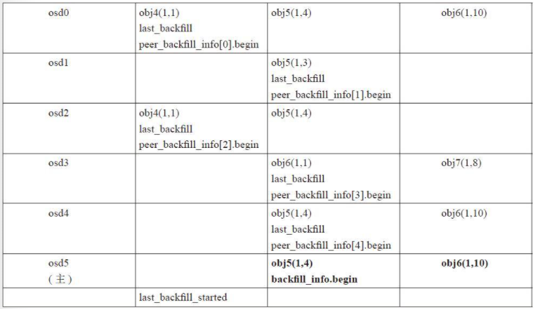

下面举例来说明步骤7中的不同的修复方法：
* 当前check对象指针为主OSD上保存的`peer_backfill_info`中`begin`的最小值。图中check对象应为`obj4`对象。
* 比较check对象和主osd5上的`backfill_info.begin`对象，由于check小于`obj5`，所以`obj4`为多余的对象，所有拥有该check对象的OSD都必须删除该对象。故osd0和osd2上的`obj4`对象被删除，同时对应的begin指针前移。
* 当前各个OSD的状态下图所示：此时check对象为`obj5`，比较check和`backfill_info.begin`的值：
  * 对于当前begin为check对象的osd0、osd1、osd4：对于osd0和osd4，check对象和`backfill_info.begin`对象都是`obj5`，且版本号都为`（1，4）`，加入到`keep_ver_targs`列表中，不需要修复。
  * 对于osd1，版本号不一致，加入`need_ver_targs`列表中，需要修复。
  * 对于当前begin不是check对象的osd2和osd3：
    * 对于osd2，其`last_backfill`小于`backfill_info.begin`，显然对象`obj5`缺失，加入`missing_targs`修复。
    * 对于osd3，其`last_backfill`大于`backfill_info.begin`，也就是说其已经修复到`obj6`了，`obj5`应该已经修复了，加入`skip_targs`跳过。
    * 步骤3处理完成后，设置`last_backfill_started`为当前的`backfill_info.begin`的值。`backfill_info.begin`指针前移，所有`begin`等于check对象的`begin`指针前移，重复以上步骤继续修复。

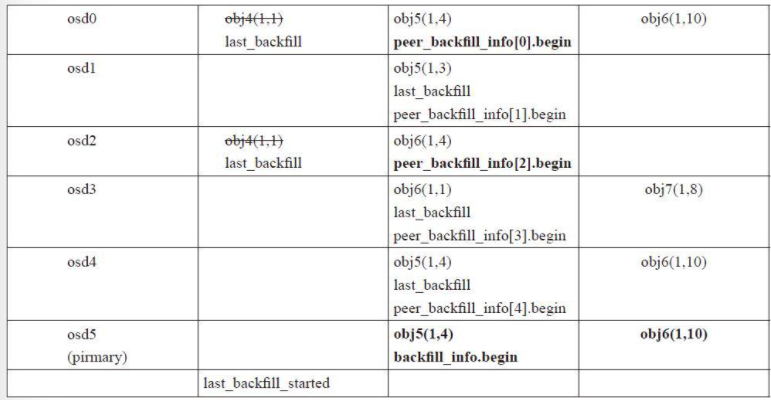

函数`update_range`调用函数`scan_range`更新BackfillInterval修复的对象列表，同时检查上次扫描对象列表中，如果有对象发生写操作，就更新该对象修复的版本。

```cpp
void PrimaryLogPG::update_range(BackfillInterval *bi, ThreadPool::TPHandle &handle) {
    int local_min = cct->_conf->osd_backfill_scan_min;
    int local_max = cct->_conf->osd_backfill_scan_max;

    if (bi->version < info.log_tail) {
        dout(10) << __func__ << ": bi is old, rescanning local backfill_info" << dendl;
        bi->version = info.last_update;
        scan_range(local_min, local_max, bi, handle);
    }

    if (bi->version >= projected_last_update) {
        dout(10) << __func__ << ": bi is current " << dendl;
        ceph_assert(bi->version == projected_last_update);
    } else if (bi->version >= info.log_tail) {
        if (recovery_state.get_pg_log().get_log().empty() && projected_log.empty()) {
            /* Because we don't move log_tail on split, the log might be
             * empty even if log_tail != last_update.  However, the only
             * way to get here with an empty log is if log_tail is actually
             * eversion_t(), because otherwise the entry which changed
             * last_update since the last scan would have to be present.
             */
            ceph_assert(bi->version == eversion_t());
            return;
        }

        dout(10) << __func__ << ": bi is old, (" << bi->version
                 << ") can be updated with log to projected_last_update " << projected_last_update
                 << dendl;

        auto func = [&](const pg_log_entry_t &e) {
            dout(10) << __func__ << ": updating from version " << e.version << dendl;
            const hobject_t &soid = e.soid;
            if (soid >= bi->begin && soid < bi->end) {
                if (e.is_update()) {
                    dout(10) << __func__ << ": " << e.soid << " updated to version " << e.version
                             << dendl;
                    bi->objects.erase(e.soid);
                    bi->objects.insert(make_pair(e.soid, e.version));
                } else if (e.is_delete()) {
                    dout(10) << __func__ << ": " << e.soid << " removed" << dendl;
                    bi->objects.erase(e.soid);
                }
            }
        };
        dout(10) << "scanning pg log first" << dendl;
        recovery_state.get_pg_log().get_log().scan_log_after(bi->version, func);
        dout(10) << "scanning projected log" << dendl;
        projected_log.scan_log_after(bi->version, func);
        bi->version = projected_last_update;
    } else {
        ceph_abort_msg("scan_range should have raised bi->version past log_tail");
    }
}
```

具体实现步骤如下：
* `bi->version`记录了扫描要修复的对象列表时PG最新更新的版本号，一般设置为`last_update_applied`或者`info.last_update`的值。初始化时，`bi->version`默认设置为`（0，0）`，所以小于`info.log_tail`，就更新`bi->version`的设置，调用函数`scan_range`扫描对象。
* 检查如果`bi->version`的值等于`info.last_update`，说明从上次扫描对象开始到当前时间，PG没有写操作，直接返回。
* 如果`bi->version`的值小于`info.last_update`，说明PG有写操作，需要检查从`bi->version`到`log_head`这段日志中的对象：如果该对象有更新操作，修复时就修复最新的版本；如果该对象已经删除，就不需要修复，在修复队列中删除。

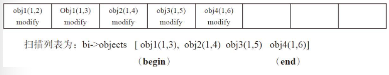

BackfillInterval的扫描的对象列表：`bi->begin`为对象`obj1（1，3）`，`bi->end`为对象`obj6（1，6）`，当前`info.last_update`为版本`（1，6）`，所以`bi->version`设置为`（1，6）`。由于本次扫描的对象列表不一定能修复完，只能等下次修复。

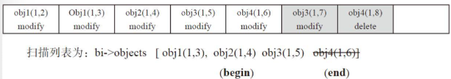

第二次进入函数`recover_backfill`，此时`begin`对象指向了`obj2`对象。说明上次只完成了对象`obj1`的修复。继续修复时，期间有对象发生更新操作：
* 对象`obj3`有写操作，版本更新为`（1，7）`。此时对象列表中要修复的对象obj3版本`（1，5）`，需要更新为版本`（1，7）`的值。
* 对象`obj4`发送删除操作，不需要修复了，所以需要从对象列表中删除。

Ceph的Backfill过程是扫描OSD上该PG的所有对象列表，和主OSD做对比，修复不存在的或者版本不一致的对象，同时删除多余的对象。

## Scrub

Scrub主要是为了检查磁盘数据的静默错误，在英文中被称为：Silent Data Corruption，大家都知道硬盘最核心的使命是正确的读取和写入数据，在读、写失败的情况下及时抛出异常，但是在某些场景下，写入成功，读取的时候才发现数据已经损坏，这就是静默错误，一般静默错误产生原因有这几种：
* 硬件错误。
* 传输过程信噪干扰。
* 软件bug。
* 固件bug。

Ceph的Scrub功能实现了在线检查，即不中断系统当前读写请求，客户端可以继续完成读写访问。整个系统并不会暂停，但是后台正在进行Scrub的对象要被锁定暂时阻止访问，直到该对象完成Scrub操作后才能解锁允许访问。

对于每个 pg，Ceph生成所有对象的列表，并比较每个对象多个副本，以确保没有对象丢失或数据不一致。Ceph的scrub主要分两种：
* Scrub - 对比对象各个副本的元数据来检查元数据的一致性。
* Deep scrub - 检查对象各个副本数据内容是否一致，耗时长，占用IO资源多。

scrub 对于数据一致性十分重要，但它会对集群的性能会带来一些负面的影响，主要是会和业务IO竞争资源。

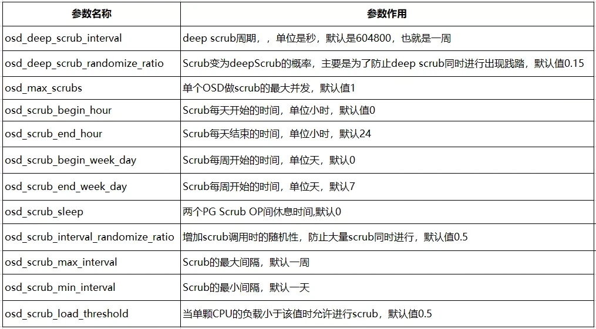

### Trigger

Scrub的调度决定了一个PG何时启动Scrub扫描机制。主要有以下方式：
* 手动立即启动执行扫描。
* 在后台设置一定的时间间隔，按照间隔的时间来启动（可以控制启动的时间段）。比如默认时间为一天执行一次。

```cpp
void OSD::tick_without_osd_lock() {
    ceph_assert(ceph_mutex_is_locked(tick_timer_lock));
    dout(10) << "tick_without_osd_lock" << dendl;

    logger->set(l_osd_cached_crc, ceph::buffer::get_cached_crc());
    logger->set(l_osd_cached_crc_adjusted, ceph::buffer::get_cached_crc_adjusted());
    logger->set(l_osd_missed_crc, ceph::buffer::get_missed_crc());

    // refresh osd stats
    struct store_statfs_t stbuf;
    osd_alert_list_t alerts;
    int r = store->statfs(&stbuf, &alerts);
    ceph_assert(r == 0);
    service.set_statfs(stbuf, alerts);

    // osd_lock is not being held, which means the OSD state
    // might change when doing the monitor report
    if (is_active() || is_waiting_for_healthy()) {
        {
            std::lock_guard l{heartbeat_lock};
            heartbeat_check();
        }
        map_lock.lock_shared();
        std::lock_guard l(mon_report_lock);

        // mon report?
        utime_t now = ceph_clock_now();
        if (service.need_fullness_update() ||
            now - last_mon_report > cct->_conf->osd_mon_report_interval) {
            last_mon_report = now;
            send_full_update();
            send_failures();
        }
        map_lock.unlock_shared();

        epoch_t max_waiting_epoch = 0;
        for (auto s : shards) {
            max_waiting_epoch = std::max(max_waiting_epoch, s->get_max_waiting_epoch());
        }
        if (max_waiting_epoch > get_osdmap()->get_epoch()) {
            dout(20) << __func__ << " max_waiting_epoch " << max_waiting_epoch
                     << ", requesting new map" << dendl;
            osdmap_subscribe(superblock.newest_map + 1, false);
        }
    }

    if (is_active()) {
        if (!scrub_random_backoff()) {
            // schedule scrub operation
            sched_scrub();
        }
        service.promote_throttle_recalibrate();
        resume_creating_pg();
        bool need_send_beacon = false;
        const auto now = ceph::coarse_mono_clock::now();
        {
            // borrow lec lock to pretect last_sent_beacon from changing
            std::lock_guard l{min_last_epoch_clean_lock};
            const auto elapsed = now - last_sent_beacon;
            if (std::chrono::duration_cast<std::chrono::seconds>(elapsed).count() >
                cct->_conf->osd_beacon_report_interval) {
                need_send_beacon = true;
            }
        }
        if (need_send_beacon) {
            send_beacon(now);
        }
    }

    mgrc.update_daemon_health(get_health_metrics());
    service.kick_recovery_queue();
    tick_timer_without_osd_lock.add_event_after(get_tick_interval(),
                                                new C_Tick_WithoutOSDLock(this));
}
```

`OSD::tick_without_osd_lock`会以一定概率（`!scrub_random_backoff`）定时调用`sched_scrub`。

```cpp
bool OSD::scrub_random_backoff() {
    bool coin_flip = (rand() / (double)RAND_MAX >= cct->_conf->osd_scrub_backoff_ratio);
    if (!coin_flip) {
        dout(20) << "scrub_random_backoff lost coin flip, randomly backing off" << dendl;
        return true;
    }
    return false;
}
```

```cpp
void OSD::sched_scrub() {
    dout(20) << __func__ << " sched_scrub starts" << dendl;

    // if not permitted, fail fast
    if (!service.can_inc_scrubs()) {
        dout(20) << __func__ << ": OSD cannot inc scrubs" << dendl;
        return;
    }
    bool allow_requested_repair_only = false;
    if (service.is_recovery_active() && !cct->_conf->osd_scrub_during_recovery) {
        if (!cct->_conf->osd_repair_during_recovery) {
            dout(15) << __func__ << ": not scheduling scrubs due to active recovery" << dendl;
            return;
        }
        dout(10) << __func__
                 << " will only schedule explicitly requested repair due to active recovery"
                 << dendl;
        allow_requested_repair_only = true;
    }

    utime_t now = ceph_clock_now();
    bool time_permit = scrub_time_permit(now);
    bool load_is_low = scrub_load_below_threshold();
    dout(20) << "sched_scrub load_is_low=" << (int)load_is_low << dendl;

    OSDService::ScrubJob scrub_job;
    if (service.first_scrub_stamp(&scrub_job)) {
        do {
            dout(30) << "sched_scrub examine " << scrub_job.pgid << " at " << scrub_job.sched_time
                     << dendl;

            if (scrub_job.sched_time > now) {
                // save ourselves some effort
                dout(20) << "sched_scrub " << scrub_job.pgid << " scheduled at "
                         << scrub_job.sched_time << " > " << now << dendl;
                break;
            }

            if ((scrub_job.deadline.is_zero() || scrub_job.deadline >= now) &&
                !(time_permit && load_is_low)) {
                dout(15) << __func__ << " not scheduling scrub for " << scrub_job.pgid << " due to "
                         << (!time_permit ? "time not permit" : "high load") << dendl;
                continue;
            }

            PGRef pg = _lookup_lock_pg(scrub_job.pgid);
            if (!pg) {
                dout(20) << __func__ << " pg  " << scrub_job.pgid << " not found" << dendl;
                continue;
            }

            // This has already started, so go on to the next scrub job
            if (pg->is_scrub_active()) {
                pg->unlock();
                dout(20) << __func__ << ": already in progress pgid " << scrub_job.pgid << dendl;
                continue;
            }
            // Skip other kinds of scrubbing if only explicitly requested repairing is allowed
            if (allow_requested_repair_only && !pg->m_planned_scrub.must_repair) {
                pg->unlock();
                dout(10) << __func__ << " skip " << scrub_job.pgid
                         << " because repairing is not explicitly requested on it" << dendl;
                continue;
            }

            // If it is reserving, let it resolve before going to the next scrub job
            if (pg->m_scrubber->is_reserving()) {
                pg->unlock();
                dout(10) << __func__ << ": reserve in progress pgid " << scrub_job.pgid << dendl;
                break;
            }
            dout(15) << "sched_scrub scrubbing " << scrub_job.pgid << " at " << scrub_job.sched_time
                     << (pg->get_must_scrub() ? ", explicitly requested"
                                              : (load_is_low ? ", load_is_low" : " deadline < now"))
                     << dendl;
            if (pg->sched_scrub()) {
                pg->unlock();
                dout(10) << __func__ << " scheduled a scrub!"
                         << " (~" << scrub_job.pgid << "~)" << dendl;
                break;
            }
            pg->unlock();
        } while (service.next_scrub_stamp(scrub_job, &scrub_job));
    }
    dout(20) << "sched_scrub done" << dendl;
}
```

`OSD::sched_scrub`流程：
* 先进行一些检查尝试提高`scrub`计数（`!service.can_inc_scrubs()`）。
* 如果在recovery中，检查`osd_scrub_during_recovery`配置：
  * 如果设置了，则继续：
    * 查看`osd_repair_during_recovery`：
      * 如果为`false`，返回，recovery中不允许启动`scrub`。
      * 如果为`true`，继续，设置`allow_requested_repair_only`为`true`。
* 查看当前时间段是否允许scrub（调用`scrub_time_permit`）。
* 查看当前CPU负载是否允许scrub（调用`scrub_load_below_threshold`）。
* 初始化`scrub_job`（调用`first_scrub_stamp`从`sched_scrub_pg`队列中提取一个PG进行scrub）。
* 查看当前是否可以启动scrub（`(scrub_job.deadline.is_zero() || scrub_job.deadline >= now) &&!(time_permit && load_is_low)`，满足负载和时间条件或者超出deadline）：
  * 时间或负载是否满足（`time_permit && load_is_low`）。
  * `scrub_job.deadline.is_zero()`非`0`且`scrub_job.deadline < now`。
* 查看是否已经有一个scrub job正在scrub PG，如果是，则寻找下一个PG重启流程。
* 查看是否需要修复（`pg->m_planned_scrub.must_repair`）：
  * 如果不需要修复且`allow_requested_repair_only`为`true`，则寻找下一个PG重启流程。
* 查看限流（`pg->m_scrubber->is_reserving()`）。
* 调用`pg->sched_scrub()`启动scrub。

```cpp
bool first_scrub_stamp(ScrubJob *out) {
    std::lock_guard l(sched_scrub_lock);
    if (sched_scrub_pg.empty())
        return false;
    std::set<ScrubJob>::iterator iter = sched_scrub_pg.begin();
    *out = *iter;
    return true;
}

bool OSD::scrub_time_permit(utime_t now) {
    struct tm bdt;
    time_t tt = now.sec();
    localtime_r(&tt, &bdt);

    bool day_permit = false;
    if (cct->_conf->osd_scrub_begin_week_day < cct->_conf->osd_scrub_end_week_day) {
        if (bdt.tm_wday >= cct->_conf->osd_scrub_begin_week_day &&
            bdt.tm_wday < cct->_conf->osd_scrub_end_week_day) {
            day_permit = true;
        }
    } else {
        if (bdt.tm_wday >= cct->_conf->osd_scrub_begin_week_day ||
            bdt.tm_wday < cct->_conf->osd_scrub_end_week_day) {
            day_permit = true;
        }
    }

    if (!day_permit) {
        dout(20) << __func__ << " should run between week day "
                 << cct->_conf->osd_scrub_begin_week_day << " - "
                 << cct->_conf->osd_scrub_end_week_day << " now " << bdt.tm_wday << " = no"
                 << dendl;
        return false;
    }

    bool time_permit = false;
    if (cct->_conf->osd_scrub_begin_hour < cct->_conf->osd_scrub_end_hour) {
        if (bdt.tm_hour >= cct->_conf->osd_scrub_begin_hour &&
            bdt.tm_hour < cct->_conf->osd_scrub_end_hour) {
            time_permit = true;
        }
    } else {
        if (bdt.tm_hour >= cct->_conf->osd_scrub_begin_hour ||
            bdt.tm_hour < cct->_conf->osd_scrub_end_hour) {
            time_permit = true;
        }
    }
    if (time_permit) {
        dout(20) << __func__ << " should run between " << cct->_conf->osd_scrub_begin_hour << " - "
                 << cct->_conf->osd_scrub_end_hour << " now " << bdt.tm_hour << " = yes" << dendl;
    } else {
        dout(20) << __func__ << " should run between " << cct->_conf->osd_scrub_begin_hour << " - "
                 << cct->_conf->osd_scrub_end_hour << " now " << bdt.tm_hour << " = no" << dendl;
    }
    return time_permit;
}

bool OSD::scrub_load_below_threshold() {
    double loadavgs[3];
    if (getloadavg(loadavgs, 3) != 3) {
        dout(10) << __func__ << " couldn't read loadavgs\n" << dendl;
        return false;
    }

    // allow scrub if below configured threshold
    long cpus = sysconf(_SC_NPROCESSORS_ONLN);
    double loadavg_per_cpu = cpus > 0 ? loadavgs[0] / cpus : loadavgs[0];
    if (loadavg_per_cpu < cct->_conf->osd_scrub_load_threshold) {
        dout(20) << __func__ << " loadavg per cpu " << loadavg_per_cpu << " < max "
                 << cct->_conf->osd_scrub_load_threshold << " = yes" << dendl;
        return true;
    }

    // allow scrub if below daily avg and currently decreasing
    if (loadavgs[0] < daily_loadavg && loadavgs[0] < loadavgs[2]) {
        dout(20) << __func__ << " loadavg " << loadavgs[0] << " < daily_loadavg " << daily_loadavg
                 << " and < 15m avg " << loadavgs[2] << " = yes" << dendl;
        return true;
    }

    dout(20) << __func__ << " loadavg " << loadavgs[0] << " >= max "
             << cct->_conf->osd_scrub_load_threshold << " and ( >= daily_loadavg " << daily_loadavg
             << " or >= 15m avg " << loadavgs[2] << ") = no" << dendl;
    return false;
}
```

`PG::sched_scrub`进行scrub调度。

```cpp
/*
 *  implementation note:
 *  PG::sched_scrub() is called only once per a specific scrub session.
 *  That call commits us to the whatever choices are made (deep/shallow, etc').
 *  Unless failing to start scrubbing, the 'planned scrub' flag-set is 'frozen' into
 *  PgScrubber's m_flags, then cleared.
 */
bool PG::sched_scrub() {
    dout(15) << __func__ << " pg(" << info.pgid << (is_active() ? ") <active>" : ") <not-active>")
             << (is_clean() ? " <clean>" : " <not-clean>") << dendl;
    ceph_assert(ceph_mutex_is_locked(_lock));

    if (m_scrubber && m_scrubber->is_scrub_active()) {
        return false;
    }

    if (!is_primary() || !is_active() || !is_clean()) {
        return false;
    }

    if (scrub_queued) {
        // only applicable to the very first time a scrub event is queued
        // (until handled and posted to the scrub FSM)
        dout(10) << __func__ << ": already queued" << dendl;
        return false;
    }

    // analyse the combination of the requested scrub flags, the osd/pool configuration
    // and the PG status to determine whether we should scrub now, and what type of scrub
    // should that be.
    auto updated_flags = verify_scrub_mode();
    if (!updated_flags) {
        // the stars do not align for starting a scrub for this PG at this time
        // (due to configuration or priority issues)
        // The reason was already reported by the callee.
        dout(10) << __func__ << ": failed to initiate a scrub" << dendl;
        return false;
    }

    // try to reserve the local OSD resources. If failing: no harm. We will
    // be retried by the OSD later on.
    if (!m_scrubber->reserve_local()) {
        dout(10) << __func__ << ": failed to reserve locally" << dendl;
        return false;
    }

    // can commit to the updated flags now, as nothing will stop the scrub
    m_planned_scrub = *updated_flags;

    // An interrupted recovery repair could leave this set.
    state_clear(PG_STATE_REPAIR);

    // Pass control to the scrubber. It is the scrubber that handles the replicas'
    // resources reservations.
    m_scrubber->set_op_parameters(m_planned_scrub);

    dout(10) << __func__ << ": queueing" << dendl;

    scrub_queued = true;
    osd->queue_for_scrub(this, Scrub::scrub_prio_t::low_priority);
    return true;
}
```

最后调用`queue_for_scrub`，使`PGScrub`入队。

#### Summary

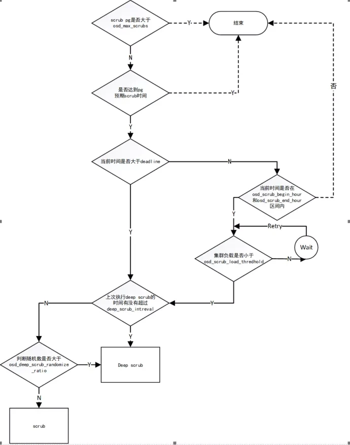

主要流程说明如下：
* 首先判断osd正在执行scrub的pg数是否大于`osd_max_scrubs`，如果大于则返回；
* 是否达到pg的预期scrub时间，如果没达到则返回，预期的scrub时间是由上次scrub的时间、`osd_scrub_min_interval`、`osd_scrub_interval_randomize_ratio`参数决定；
* 判断当前时间是否大于deadline，如果小于，则判断是否在`osd_scrub_begin_hour`和`osd_scrub_end_hour`，如果处于则判断集群负载是否在`osd_scrub_load_thredhold`之下，如果不满足则等待时间再重试。如果当前时间大于deadline，则不会判断时间和负载，强制执行scrub任务，到这一步仍然是`osd_scrub_min_interval`和`osd_scrub_max_interval`起作用；
* 一个scrub任务最后会经过判断，从而决定这个scrub任务到底是scrub还是deepscrub。
* 在主osd判断deep scrub的时间有没有超过`deep_scrub_interval`，如果超过，这个任务会是deep scrub(`scrubber.time_for_deep =ceph_clock_now() >= info.history.last_deep_scrub_stamp+ deep_scrub_interval`)；
* 如果没过期，这时`osd_deep_scrub_randomize_ratio`这个参数会起作用：
  * `deep_coin_flip = (rand()% 100) < cct->_conf->osd_deep_scrub_randomize_ratio* 100;`
  * `scrubber.time_for_deep= (scrubber.time_for_deep || deep_coin_flip);`
* 首先判断osd正在执行scrub的pg数是否大于`osd_max_scrubs`，如果大于则返回；
* 获取deep scrub和scrub的标志位，如果设置了`no_deep_scrub`或者`no_scrub`，则不执行相应任务。

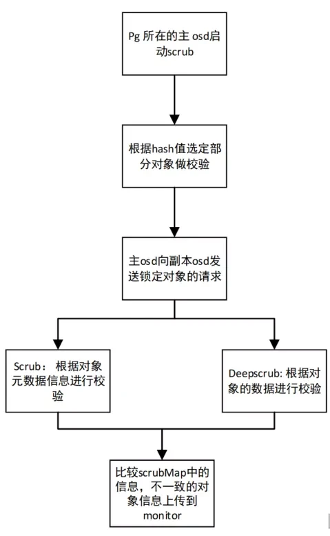

### Scrub Process

```cpp
void OSDService::queue_for_scrub(PG *pg, Scrub::scrub_prio_t with_priority) {
    queue_scrub_event_msg<PGScrub>(pg, with_priority);
}
```

`OSDService::queue_for_scrub`导致`PGScrub::run`调用`pg->scrub`。

```cpp
void PGScrub::run(OSD *osd, OSDShard *sdata, PGRef &pg, ThreadPool::TPHandle &handle) {
  pg->scrub(epoch_queued, handle);
  pg->unlock();
}
```

```cpp
void scrub(epoch_t queued, ThreadPool::TPHandle &handle) {
  // a new scrub
  scrub_queued = false;
  forward_scrub_event(&ScrubPgIF::initiate_regular_scrub, queued, "StartScrub"sv);
}

void PG::forward_scrub_event(ScrubAPI fn, epoch_t epoch_queued, std::string_view desc) {
    dout(20) << __func__ << ": " << desc << " queued at: " << epoch_queued << dendl;
    if (is_active() && m_scrubber) {
        ((*m_scrubber).*fn)(epoch_queued);
    } else {
        // pg might be in the process of being deleted
        dout(5) << __func__ << " refusing to forward. "
                << (is_clean() ? "(clean) " : "(not clean) ")
                << (is_active() ? "(active) " : "(not active) ") << dendl;
    }
}

void PgScrubber::initiate_regular_scrub(epoch_t epoch_queued) {
    dout(15) << __func__ << " epoch: " << epoch_queued << dendl;
    // we may have lost our Primary status while the message languished in the queue
    if (check_interval(epoch_queued)) {
        dout(10) << "scrubber event -->> StartScrub epoch: " << epoch_queued << dendl;
        reset_epoch(epoch_queued);
        m_fsm->process_event(StartScrub{});
        dout(10) << "scrubber event --<< StartScrub" << dendl;
    } else {
        // and just in case snap trimming was blocked by the aborted scrub
        m_pg->snap_trimmer_scrub_complete();
    }
}
```

投递`StartScrub`事件到`ScrubMachine`状态机。

进入`ReservingReplicas`状态，预留replica资源。

```cpp
ReservingReplicas::ReservingReplicas(my_context ctx)
  : my_base(ctx) {
  dout(10) << "-- state -->> ReservingReplicas" << dendl;
  DECLARE_LOCALS;   // 'scrbr' & 'pg_id' aliases
  scrbr->scrub_begin();
  scrbr->reserve_replicas();
}
```

```cpp
void PgScrubber::scrub_begin() {
    stringstream ss;
    ss << m_pg->info.pgid.pgid << " " << m_mode_desc << " starts";
    dout(2) << ss.str() << dendl;
    m_osds->clog->debug(ss);
}

void PgScrubber::reserve_replicas() {
    dout(10) << __func__ << dendl;
    m_reservations.emplace(m_pg, m_pg_whoami);
}
```

成功后调用`PgScrubber::handle_scrub_reserve_grant`。

```cpp
void PgScrubber::handle_scrub_reserve_grant(OpRequestRef op, pg_shard_t from) {
    dout(10) << __func__ << " " << *op->get_req() << dendl;
    op->mark_started();

    if (m_reservations.has_value()) {
        m_reservations->handle_reserve_grant(op, from);
    } else {
        derr << __func__ << ": received unsolicited reservation grant from osd " << from << " ("
             << op << ")" << dendl;
    }
}
```

如果所有replicas都成功预留,`PGScrubResourcesOK`入队。

```cpp

void ReplicaReservations::send_all_done() {
  m_osds->queue_for_scrub_granted(m_pg, scrub_prio_t::low_priority);
}
```

经过调度处理后，状态机进入`ActiveScrubbing`状态。

```cpp
void PGScrubResourcesOK::run(OSD *osd,
                                 OSDShard *sdata,
                                 PGRef &pg,
                                 ThreadPool::TPHandle &handle) {
  pg->scrub_send_resources_granted(epoch_queued, handle);
  pg->unlock();
}

void PG::scrub_send_resources_granted(epoch_t queued, ThreadPool::TPHandle &handle) {
    forward_scrub_event(&ScrubPgIF::send_remotes_reserved, queued, "RemotesReserved"sv);
}

void PgScrubber::send_remotes_reserved(epoch_t epoch_queued) {
    dout(10) << "scrubber event -->> " << __func__ << " epoch: " << epoch_queued << dendl;
    // note: scrub is not active yet
    if (check_interval(epoch_queued)) {
        m_fsm->process_event(RemotesReserved{});
    }
    dout(10) << "scrubber event --<< " << __func__ << dendl;
}

ActiveScrubbing::ActiveScrubbing(my_context ctx)
  : my_base(ctx) {
  dout(10) << "-- state -->> ActiveScrubbing" << dendl;
  DECLARE_LOCALS;   // 'scrbr' & 'pg_id' aliases
  scrbr->on_init();
}
```

然后事件回调`on_init`将被触发。

```cpp
void PgScrubber::on_init() {
    // going upwards from 'inactive'
    ceph_assert(!is_scrub_active());

    preemption_data.reset();
    m_pg->publish_stats_to_osd();
    m_interval_start = m_pg->get_history().same_interval_since;

    dout(10) << __func__ << " start same_interval:" << m_interval_start << dendl;

    //  create a new store
    {
        ObjectStore::Transaction t;
        cleanup_store(&t);
        m_store.reset(Scrub::Store::create(m_pg->osd->store, &t, m_pg->info.pgid, m_pg->coll));
        m_pg->osd->store->queue_transaction(m_pg->ch, std::move(t), nullptr);
    }

    m_start = m_pg->info.pgid.pgid.get_hobj_start();
    m_active = true;
}

void PgScrubber::cleanup_store(ObjectStore::Transaction *t) {
    if (!m_store)
        return;

    struct OnComplete : Context {
        std::unique_ptr<Scrub::Store> store;
        explicit OnComplete(std::unique_ptr<Scrub::Store> &&store)
            : store(std::move(store)) {
        }
        void finish(int) override {
        }
    };
    m_store->cleanup(t);
    t->register_on_complete(new OnComplete(std::move(m_store)));
    ceph_assert(!m_store);
}
```

然后进入`PendingTimer`子状态。

```cpp
/**
*  Sleeping till timer reactivation - or just requeuing
*/
PendingTimer::PendingTimer(my_context ctx)
  : my_base(ctx) {
  dout(10) << "-- state -->> Act/PendingTimer" << dendl;
  DECLARE_LOCALS;   // 'scrbr' & 'pg_id' aliases

  scrbr->add_delayed_scheduling();
}

/**
 *  if we are required to sleep:
 *	arrange a callback sometimes later.
 *	be sure to be able to identify a stale callback.
 *  Otherwise: perform a requeue (i.e. - rescheduling thru the OSD queue)
 *    anyway.
 */
void PgScrubber::add_delayed_scheduling() {
    m_end = m_start;   // not blocking any range now

    milliseconds sleep_time{0ms};
    if (m_needs_sleep) {
        double scrub_sleep = 1000.0 * m_osds->osd->scrub_sleep_time(m_flags.required);
        sleep_time = milliseconds{long(scrub_sleep)};
    }
    dout(15) << __func__ << " sleep: " << sleep_time.count() << "ms. needed? " << m_needs_sleep
             << dendl;

    if (sleep_time.count()) {
        // schedule a transition for some 'sleep_time' ms in the future

        m_needs_sleep = false;
        m_sleep_started_at = ceph_clock_now();

        // the following log line is used by osd-scrub-test.sh
        dout(20) << __func__ << " scrub state is PendingTimer, sleeping" << dendl;

        // the 'delayer' for crimson is different. Will be factored out.

        spg_t pgid = m_pg->get_pgid();
        auto callbk =
            new LambdaContext([osds = m_osds, pgid, scrbr = this]([[maybe_unused]] int r) mutable {
                PGRef pg = osds->osd->lookup_lock_pg(pgid);
                if (!pg) {
                    lgeneric_subdout(g_ceph_context, osd, 10)
                        << "scrub_requeue_callback: Could not find "
                        << "PG " << pgid << " can't complete scrub requeue after sleep" << dendl;
                    return;
                }
                scrbr->m_needs_sleep = true;
                lgeneric_dout(scrbr->get_pg_cct(), 7)
                    << "scrub_requeue_callback: slept for "
                    << ceph_clock_now() - scrbr->m_sleep_started_at << ", re-queuing scrub"
                    << dendl;

                scrbr->m_sleep_started_at = utime_t{};
                osds->queue_for_scrub_resched(&(*pg), Scrub::scrub_prio_t::low_priority);
                pg->unlock();
            });

        std::lock_guard l(m_osds->sleep_lock);
        m_osds->sleep_timer.add_event_after(sleep_time.count() / 1000.0f, callbk);

    } else {
        // just a requeue
        m_osds->queue_for_scrub_resched(m_pg, Scrub::scrub_prio_t::high_priority);
    }
}
```

调度`PGScrubResched`入队。

```cpp
void OSDService::queue_for_scrub_resched(PG *pg, Scrub::scrub_prio_t with_priority) {
    // Resulting scrub event: 'InternalSchedScrub'
    queue_scrub_event_msg<PGScrubResched>(pg, with_priority);
}

void PGScrubResched::run(OSD *osd, OSDShard *sdata, PGRef &pg, ThreadPool::TPHandle &handle) {
   pg->scrub_send_scrub_resched(epoch_queued, handle);
   pg->unlock();
}

void PG::scrub_send_scrub_resched(epoch_t queued, ThreadPool::TPHandle &handle) {
   scrub_queued = false;
   forward_scrub_event(&ScrubPgIF::send_scrub_resched, queued, "InternalSchedScrub"sv);
}

void PgScrubber::send_scrub_resched(epoch_t epoch_queued) {
    dout(10) << "scrubber event -->> " << __func__ << " epoch: " << epoch_queued << dendl;
    if (is_message_relevant(epoch_queued)) {
        m_fsm->process_event(InternalSchedScrub{});
    }
    dout(10) << "scrubber event --<< " << __func__ << dendl;
}
```

投递`InternalSchedScrub`事件，进入`NewChunk`状态。

```cpp
NewChunk::NewChunk(my_context ctx)
   : my_base(ctx) {
   dout(10) << "-- state -->> Act/NewChunk" << dendl;
   DECLARE_LOCALS;   // 'scrbr' & 'pg_id' aliases

   scrbr->get_preemptor().adjust_parameters();

   //  choose range to work on
   //  select_range_n_notify() will signal either SelectedChunkFree or
   //  ChunkIsBusy. If 'busy', we transition to Blocked, and wait for the
   //  range to become available.
   scrbr->select_range_n_notify();
}

void PgScrubber::select_range_n_notify() {
    if (select_range()) {
        // the next chunk to handle is not blocked
        dout(20) << __func__ << ": selection OK" << dendl;
        m_osds->queue_scrub_chunk_free(m_pg, Scrub::scrub_prio_t::low_priority);

    } else {
        // we will wait for the objects range to become available for scrubbing
        dout(10) << __func__ << ": selected chunk is busy" << dendl;
        m_osds->queue_scrub_chunk_busy(m_pg, Scrub::scrub_prio_t::low_priority);
    }
}
```

`select_range_n_notify`实际执行scrub过程：
* 通过`select_range`查看需要执行scrub的range的对象是否可用：
  * 如果不可用调用`queue_scrub_chunk_busy`。
  * 可用则调用`queue_scrub_chunk_free`。

`PgScrubber::select_range`决定要scrub的对象range，并返回它们是否可用。

range由`osd_scrub_chunk_min`和`osd_scrub_chunk_max`控制。

```cpp
/*
 * The selected range is set directly into 'm_start' and 'm_end'
 * setting:
 * - m_subset_last_update
 * - m_max_end
 * - end
 * - start
 */
bool PgScrubber::select_range() {
    m_primary_scrubmap = ScrubMap{};
    m_received_maps.clear();

    /* get the start and end of our scrub chunk
     *
     * Our scrub chunk has an important restriction we're going to need to
     * respect. We can't let head be start or end.
     * Using a half-open interval means that if end == head,
     * we'd scrub/lock head and the clone right next to head in different
     * chunks which would allow us to miss clones created between
     * scrubbing that chunk and scrubbing the chunk including head.
     * This isn't true for any of the other clones since clones can
     * only be created "just to the left of" head.  There is one exception
     * to this: promotion of clones which always happens to the left of the
     * left-most clone, but promote_object checks the scrubber in that
     * case, so it should be ok.  Also, it's ok to "miss" clones at the
     * left end of the range if we are a tier because they may legitimately
     * not exist (see _scrub).
     */
    int min_idx = std::max<int64_t>(
        3, m_pg->get_cct()->_conf->osd_scrub_chunk_min / preemption_data.chunk_divisor());

    int max_idx = std::max<int64_t>(
        min_idx, m_pg->get_cct()->_conf->osd_scrub_chunk_max / preemption_data.chunk_divisor());

    dout(10) << __func__ << " Min: " << min_idx << " Max: " << max_idx
             << " Div: " << preemption_data.chunk_divisor() << dendl;

    hobject_t start = m_start;
    hobject_t candidate_end;
    std::vector<hobject_t> objects;
    int ret = m_pg->get_pgbackend()->objects_list_partial(
        start, min_idx, max_idx, &objects, &candidate_end);
    ceph_assert(ret >= 0);

    if (!objects.empty()) {

        hobject_t back = objects.back();
        while (candidate_end.is_head() && candidate_end == back.get_head()) {
            candidate_end = back;
            objects.pop_back();
            if (objects.empty()) {
                ceph_assert(0 == "Somehow we got more than 2 objects which"
                                 "have the same head but are not clones");
            }
            back = objects.back();
        }

        if (candidate_end.is_head()) {
            ceph_assert(candidate_end != back.get_head());
            candidate_end = candidate_end.get_object_boundary();
        }

    } else {
        ceph_assert(candidate_end.is_max());
    }

    // is that range free for us? if not - we will be rescheduled later by whoever
    // triggered us this time

    if (!m_pg->_range_available_for_scrub(m_start, candidate_end)) {
        // we'll be requeued by whatever made us unavailable for scrub
        dout(10) << __func__ << ": scrub blocked somewhere in range "
                 << "[" << m_start << ", " << candidate_end << ")" << dendl;
        return false;
    }

    m_end = candidate_end;
    if (m_end > m_max_end)
        m_max_end = m_end;

    dout(15) << __func__ << " range selected: " << m_start << " //// " << m_end << " //// "
             << m_max_end << dendl;
    return true;
}
```

对象range是否可用是由`PrimaryLogPG::_range_available_for_scrub`控制的，要求每一个对象的`is_blocked()`都为`false`。

如果range被blocked，将会再解除blocked只会重新调度scrub。

```cpp
bool PrimaryLogPG::_range_available_for_scrub(const hobject_t &begin, const hobject_t &end) {
    pair<hobject_t, ObjectContextRef> next;
    next.second = object_contexts.lookup(begin);
    next.first = begin;
    bool more = true;
    while (more && next.first < end) {
        if (next.second && next.second->is_blocked()) {
            next.second->requeue_scrub_on_unblock = true;
            dout(10) << __func__ << ": scrub delayed, " << next.first << " is blocked" << dendl;
            return false;
        }
        more = object_contexts.get_next(next.first, &next);
    }
    return true;
}
```

`PgScrubber::send_chunk_busy`和`PgScrubber::send_chunk_free`将投递不同的事件转移到不同的状态。

```cpp
void PgScrubber::send_chunk_busy(epoch_t epoch_queued) {
    dout(10) << "scrubber event -->> " << __func__ << " epoch: " << epoch_queued << dendl;
    if (check_interval(epoch_queued)) {
        m_fsm->process_event(Scrub::ChunkIsBusy{});
    }
    dout(10) << "scrubber event --<< " << __func__ << dendl;
}

void PgScrubber::send_chunk_free(epoch_t epoch_queued) {
    dout(10) << "scrubber event -->> " << __func__ << " epoch: " << epoch_queued << dendl;
    if (check_interval(epoch_queued)) {
        m_fsm->process_event(Scrub::SelectedChunkFree{});
    }
    dout(10) << "scrubber event --<< " << __func__ << dendl;
}
```

投递`ChunkIsBusy`将会进入`RangeBlocked`状态，等待`Unblocked`事件。

```cpp
RangeBlocked::RangeBlocked(my_context ctx)
    : my_base(ctx) {
    dout(10) << "-- state -->> Act/RangeBlocked" << dendl;
}
```

而投递`SelectedChunkFree`将调用`scrbr->set_subset_last_update`进入`WaitPushes`状态。

```cpp
sc::result NewChunk::react(const SelectedChunkFree &) {
    DECLARE_LOCALS;   // 'scrbr' & 'pg_id' aliases
    dout(10) << "NewChunk::react(const SelectedChunkFree&)" << dendl;

    scrbr->set_subset_last_update(scrbr->search_log_for_updates());
    return transit<WaitPushes>();
}

void PgScrubber::set_subset_last_update(eversion_t e) {
    m_subset_last_update = e;
    dout(15) << __func__ << " last-update: " << e << dendl;
}
```

又会从`WaitPushes`切换到`WaitLastUpdate`状态。

```cpp
WaitPushes::WaitPushes(my_context ctx)
    : my_base(ctx) {
    dout(10) << " -- state -->> Act/WaitPushes" << dendl;
    post_event(ActivePushesUpd{});
}

/*
* Triggered externally, by the entity that had an update re pushes
*/
sc::result WaitPushes::react(const ActivePushesUpd &) {
    DECLARE_LOCALS;   // 'scrbr' & 'pg_id' aliases
    dout(10) << "WaitPushes::react(const ActivePushesUpd&) pending_active_pushes: "
             << scrbr->pending_active_pushes() << dendl;

    if (!scrbr->pending_active_pushes()) {
        // done waiting
        return transit<WaitLastUpdate>();
    }

    return discard_event();
}
```

进入`WaitLastUpdate`状态，投递`pdatesApplied`事件。

```cpp
WaitLastUpdate::WaitLastUpdate(my_context ctx)
    : my_base(ctx) {
    dout(10) << " -- state -->> Act/WaitLastUpdate" << dendl;
    post_event(UpdatesApplied{});
}

/**
 *  Note:
 *  Updates are locally readable immediately. Thus, on the replicas we do need
 *  to wait for the update notifications before scrubbing. For the Primary it's
 *  a bit different: on EC (and only there) rmw operations have an additional
 *  read roundtrip. That means that on the Primary we need to wait for
 *  last_update_applied (the replica side, even on EC, is still safe
 *  since the actual transaction will already be readable by commit time.
 */
void WaitLastUpdate::on_new_updates(const UpdatesApplied &) {
    DECLARE_LOCALS;   // 'scrbr' & 'pg_id' aliases
    dout(10) << "WaitLastUpdate::on_new_updates(const UpdatesApplied&)" << dendl;

    if (scrbr->has_pg_marked_new_updates()) {
        post_event(InternalAllUpdates{});
    } else {
        // will be requeued by op_applied
        dout(10) << "wait for EC read/modify/writes to queue" << dendl;
    }
}

/*
 *  request maps from the replicas in the acting set
 */
sc::result WaitLastUpdate::react(const InternalAllUpdates &) {
    DECLARE_LOCALS;   // 'scrbr' & 'pg_id' aliases
    dout(10) << "WaitLastUpdate::react(const InternalAllUpdates&)" << dendl;

    scrbr->get_replicas_maps(scrbr->get_preemptor().is_preemptable());
    return transit<BuildMap>();
}
```

调用`get_replicas_maps`获取副本的`maps`。

```cpp
void PgScrubber::get_replicas_maps(bool replica_can_preempt) {
    dout(10) << __func__ << " started in epoch/interval: " << m_epoch_start << "/"
             << m_interval_start
             << " pg same_interval_since: " << m_pg->info.history.same_interval_since << dendl;

    m_primary_scrubmap_pos.reset();

    // ask replicas to scan and send maps
    for (const auto &i : m_pg->get_actingset()) {

        if (i == m_pg_whoami)
            continue;

        m_maps_status.mark_replica_map_request(i);
        _request_scrub_map(i, m_subset_last_update, m_start, m_end, m_is_deep, replica_can_preempt);
    }

    dout(10) << __func__ << " awaiting" << m_maps_status << dendl;
}
```

主要流程：
* 遍历`m_pg->get_actingset()`：
  * 使用`_request_scrub_map`向replicas发送scrub map的获取请求。

```cpp
void PgScrubber::_request_scrub_map(pg_shard_t replica,
                                    eversion_t version,
                                    hobject_t start,
                                    hobject_t end,
                                    bool deep,
                                    bool allow_preemption) {
    ceph_assert(replica != m_pg_whoami);
    dout(10) << __func__ << " scrubmap from osd." << replica << (deep ? " deep" : " shallow")
             << dendl;

    auto repscrubop = new MOSDRepScrub(spg_t(m_pg->info.pgid.pgid, replica.shard),
                                       version,
                                       get_osdmap_epoch(),
                                       m_pg->get_last_peering_reset(),
                                       start,
                                       end,
                                       deep,
                                       allow_preemption,
                                       m_flags.priority,
                                       m_pg->ops_blocked_by_scrub());

    // default priority. We want the replica-scrub processed prior to any recovery
    // or client io messages (we are holding a lock!)
    m_osds->send_message_osd_cluster(replica.osd, repscrubop, get_osdmap_epoch());
}
```

接着进入`BuildMap`状态。

```cpp
BuildMap::BuildMap(my_context ctx)
    : my_base(ctx) {
    dout(10) << " -- state -->> Act/BuildMap" << dendl;
    DECLARE_LOCALS;   // 'scrbr' & 'pg_id' aliases

    // no need to check for an epoch change, as all possible flows that brought us here have
    // a check_interval() verification of their final event.

    if (scrbr->get_preemptor().was_preempted()) {

        // we were preempted, either directly or by a replica
        dout(10) << __func__ << " preempted!!!" << dendl;
        scrbr->mark_local_map_ready();
        post_event(IntBmPreempted{});

    } else {

        auto ret = scrbr->build_primary_map_chunk();

        if (ret == -EINPROGRESS) {
            // must wait for the backend to finish. No specific event provided.
            // build_primary_map_chunk() has already requeued us.
            dout(20) << "waiting for the backend..." << dendl;

        } else if (ret < 0) {

            dout(10) << "BuildMap::BuildMap() Error! Aborting. Ret: " << ret << dendl;
            post_event(InternalError{});

        } else {

            // the local map was created
            post_event(IntLocalMapDone{});
        }
    }
}
```

```cpp
int PgScrubber::build_primary_map_chunk() {
    epoch_t map_building_since = m_pg->get_osdmap_epoch();
    dout(20) << __func__ << ": initiated at epoch " << map_building_since << dendl;

    auto ret = build_scrub_map_chunk(
        m_primary_scrubmap, m_primary_scrubmap_pos, m_start, m_end, m_is_deep);

    if (ret == -EINPROGRESS) {
        // reschedule another round of asking the backend to collect the scrub data
        m_osds->queue_for_scrub_resched(m_pg, Scrub::scrub_prio_t::low_priority);
    }
    return ret;
}
```

```cpp
int PgScrubber::build_scrub_map_chunk(
    ScrubMap &map, ScrubMapBuilder &pos, hobject_t start, hobject_t end, bool deep) {
    dout(10) << __func__ << " [" << start << "," << end << ") "
             << " pos " << pos << " Deep: " << deep << dendl;

    // start
    while (pos.empty()) {

        pos.deep = deep;
        map.valid_through = m_pg->info.last_update;

        // objects
        vector<ghobject_t> rollback_obs;
        pos.ret = m_pg->get_pgbackend()->objects_list_range(start, end, &pos.ls, &rollback_obs);
        dout(10) << __func__ << " while pos empty " << pos.ret << dendl;
        if (pos.ret < 0) {
            dout(5) << "objects_list_range error: " << pos.ret << dendl;
            return pos.ret;
        }
        dout(10) << __func__ << " pos.ls.empty()? " << (pos.ls.empty() ? "+" : "-") << dendl;
        if (pos.ls.empty()) {
            break;
        }
        m_pg->_scan_rollback_obs(rollback_obs);
        pos.pos = 0;
        return -EINPROGRESS;
    }

    // scan objects
    while (!pos.done()) {

        int r = m_pg->get_pgbackend()->be_scan_list(map, pos);
        if (r == -EINPROGRESS) {
            dout(20) << __func__ << " in progress" << dendl;
            return r;
        }
    }

    // finish
    dout(20) << __func__ << " finishing" << dendl;
    ceph_assert(pos.done());
    m_pg->_repair_oinfo_oid(map);

    dout(20) << __func__ << " done, got " << map.objects.size() << " items" << dendl;
    return 0;
}
```

将对range内的每个对象调用`PGBackend::be_scan_list`。

```cpp
int PGBackend::be_scan_list(ScrubMap &map, ScrubMapBuilder &pos) {
    dout(10) << __func__ << " " << pos << dendl;
    ceph_assert(!pos.done());
    ceph_assert(pos.pos < pos.ls.size());
    hobject_t &poid = pos.ls[pos.pos];

    struct stat st;
    int r = store->stat(
        ch, ghobject_t(poid, ghobject_t::NO_GEN, get_parent()->whoami_shard().shard), &st, true);
    if (r == 0) {
        ScrubMap::object &o = map.objects[poid];
        o.size = st.st_size;
        ceph_assert(!o.negative);
        store->getattrs(
            ch, ghobject_t(poid, ghobject_t::NO_GEN, get_parent()->whoami_shard().shard), o.attrs);

        if (pos.deep) {
            r = be_deep_scrub(poid, map, pos, o);
        }
        dout(25) << __func__ << "  " << poid << dendl;
    } else if (r == -ENOENT) {
        dout(25) << __func__ << "  " << poid << " got " << r << ", skipping" << dendl;
    } else if (r == -EIO) {
        dout(25) << __func__ << "  " << poid << " got " << r << ", stat_error" << dendl;
        ScrubMap::object &o = map.objects[poid];
        o.stat_error = true;
    } else {
        derr << __func__ << " got: " << cpp_strerror(r) << dendl;
        ceph_abort();
    }
    if (r == -EINPROGRESS) {
        return -EINPROGRESS;
    }
    pos.next_object();
    return 0;
}
```

主要流程是：
* 调用`store->stat`并检查返回值。
* 调用`store->getattrs`保存对象attrs到map里面。
* 如果是deep scrub，还会调用`PGBackend::be_deep_scrub`：
  * 读取数据、omap header、omap计算校验和保存到map里面。

读取一次的长度以`osd_deep_scrub_stride`为单位。

```cpp
int ReplicatedBackend::be_deep_scrub(const hobject_t &poid,
                                     ScrubMap &map,
                                     ScrubMapBuilder &pos,
                                     ScrubMap::object &o) {
    dout(10) << __func__ << " " << poid << " pos " << pos << dendl;
    int r;
    uint32_t fadvise_flags = CEPH_OSD_OP_FLAG_FADVISE_SEQUENTIAL |
                             CEPH_OSD_OP_FLAG_FADVISE_DONTNEED |
                             CEPH_OSD_OP_FLAG_BYPASS_CLEAN_CACHE;

    utime_t sleeptime;
    sleeptime.set_from_double(cct->_conf->osd_debug_deep_scrub_sleep);
    if (sleeptime != utime_t()) {
        lgeneric_derr(cct) << __func__ << " sleeping for " << sleeptime << dendl;
        sleeptime.sleep();
    }

    ceph_assert(poid == pos.ls[pos.pos]);
    if (!pos.data_done()) {
        if (pos.data_pos == 0) {
            pos.data_hash = bufferhash(-1);
        }

        bufferlist bl;
        r = store->read(ch,
                        ghobject_t(poid, ghobject_t::NO_GEN, get_parent()->whoami_shard().shard),
                        pos.data_pos,
                        cct->_conf->osd_deep_scrub_stride,
                        bl,
                        fadvise_flags);
        if (r < 0) {
            dout(20) << __func__ << "  " << poid << " got " << r << " on read, read_error" << dendl;
            o.read_error = true;
            return 0;
        }
        if (r > 0) {
            pos.data_hash << bl;
        }
        pos.data_pos += r;
        if (r == cct->_conf->osd_deep_scrub_stride) {
            dout(20) << __func__ << "  " << poid << " more data, digest so far 0x" << std::hex
                     << pos.data_hash.digest() << std::dec << dendl;
            return -EINPROGRESS;
        }
        // done with bytes
        pos.data_pos = -1;
        o.digest = pos.data_hash.digest();
        o.digest_present = true;
        dout(20) << __func__ << "  " << poid << " done with data, digest 0x" << std::hex << o.digest
                 << std::dec << dendl;
    }

    // omap header
    if (pos.omap_pos.empty()) {
        pos.omap_hash = bufferhash(-1);

        bufferlist hdrbl;
        r = store->omap_get_header(
            ch,
            ghobject_t(poid, ghobject_t::NO_GEN, get_parent()->whoami_shard().shard),
            &hdrbl,
            true);
        if (r == -EIO) {
            dout(20) << __func__ << "  " << poid << " got " << r
                     << " on omap header read, read_error" << dendl;
            o.read_error = true;
            return 0;
        }
        if (r == 0 && hdrbl.length()) {
            bool encoded = false;
            dout(25) << "CRC header " << cleanbin(hdrbl, encoded, true) << dendl;
            pos.omap_hash << hdrbl;
        }
    }

    // omap
    ObjectMap::ObjectMapIterator iter = store->get_omap_iterator(
        ch, ghobject_t(poid, ghobject_t::NO_GEN, get_parent()->whoami_shard().shard));
    ceph_assert(iter);
    if (pos.omap_pos.length()) {
        iter->lower_bound(pos.omap_pos);
    } else {
        iter->seek_to_first();
    }
    int max = g_conf()->osd_deep_scrub_keys;
    while (iter->status() == 0 && iter->valid()) {
        pos.omap_bytes += iter->value().length();
        ++pos.omap_keys;
        --max;
        // fixme: we can do this more efficiently.
        bufferlist bl;
        encode(iter->key(), bl);
        encode(iter->value(), bl);
        pos.omap_hash << bl;

        iter->next();

        if (iter->valid() && max == 0) {
            pos.omap_pos = iter->key();
            return -EINPROGRESS;
        }
        if (iter->status() < 0) {
            dout(25) << __func__ << "  " << poid << " on omap scan, db status error" << dendl;
            o.read_error = true;
            return 0;
        }
    }

    if (pos.omap_keys > cct->_conf->osd_deep_scrub_large_omap_object_key_threshold ||
        pos.omap_bytes > cct->_conf->osd_deep_scrub_large_omap_object_value_sum_threshold) {
        dout(25) << __func__ << " " << poid << " large omap object detected. Object has "
                 << pos.omap_keys << " keys and size " << pos.omap_bytes << " bytes" << dendl;
        o.large_omap_object_found = true;
        o.large_omap_object_key_count = pos.omap_keys;
        o.large_omap_object_value_size = pos.omap_bytes;
        map.has_large_omap_object_errors = true;
    }

    o.omap_digest = pos.omap_hash.digest();
    o.omap_digest_present = true;
    dout(20) << __func__ << " done with " << poid << " omap_digest " << std::hex << o.omap_digest
             << std::dec << dendl;

    // Sum up omap usage
    if (pos.omap_keys > 0 || pos.omap_bytes > 0) {
        dout(25) << __func__ << " adding " << pos.omap_keys << " keys and " << pos.omap_bytes
                 << " bytes to pg_stats sums" << dendl;
        map.has_omap_keys = true;
        o.object_omap_bytes = pos.omap_bytes;
        o.object_omap_keys = pos.omap_keys;
    }

    // done!
    return 0;
}

int ECBackend::be_deep_scrub(const hobject_t &poid,
                             ScrubMap &map,
                             ScrubMapBuilder &pos,
                             ScrubMap::object &o) {
    dout(10) << __func__ << " " << poid << " pos " << pos << dendl;
    int r;

    uint32_t fadvise_flags =
        CEPH_OSD_OP_FLAG_FADVISE_SEQUENTIAL | CEPH_OSD_OP_FLAG_FADVISE_DONTNEED;

    utime_t sleeptime;
    sleeptime.set_from_double(cct->_conf->osd_debug_deep_scrub_sleep);
    if (sleeptime != utime_t()) {
        lgeneric_derr(cct) << __func__ << " sleeping for " << sleeptime << dendl;
        sleeptime.sleep();
    }

    if (pos.data_pos == 0) {
        pos.data_hash = bufferhash(-1);
    }

    uint64_t stride = cct->_conf->osd_deep_scrub_stride;
    if (stride % sinfo.get_chunk_size())
        stride += sinfo.get_chunk_size() - (stride % sinfo.get_chunk_size());

    bufferlist bl;
    r = store->read(ch,
                    ghobject_t(poid, ghobject_t::NO_GEN, get_parent()->whoami_shard().shard),
                    pos.data_pos,
                    stride,
                    bl,
                    fadvise_flags);
    if (r < 0) {
        dout(20) << __func__ << "  " << poid << " got " << r << " on read, read_error" << dendl;
        o.read_error = true;
        return 0;
    }
    if (bl.length() % sinfo.get_chunk_size()) {
        dout(20) << __func__ << "  " << poid << " got " << r << " on read, not chunk size "
                 << sinfo.get_chunk_size() << " aligned" << dendl;
        o.read_error = true;
        return 0;
    }
    if (r > 0) {
        pos.data_hash << bl;
    }
    pos.data_pos += r;
    if (r == (int)stride) {
        return -EINPROGRESS;
    }

    ECUtil::HashInfoRef hinfo = get_hash_info(poid, false, &o.attrs);
    if (!hinfo) {
        dout(0) << "_scan_list  " << poid << " could not retrieve hash info" << dendl;
        o.read_error = true;
        o.digest_present = false;
        return 0;
    } else {
        if (!get_parent()->get_pool().allows_ecoverwrites()) {
            if (!hinfo->has_chunk_hash()) {
                dout(0) << "_scan_list  " << poid << " got invalid hash info" << dendl;
                o.ec_size_mismatch = true;
                return 0;
            }
            if (hinfo->get_total_chunk_size() != (unsigned)pos.data_pos) {
                dout(0) << "_scan_list  " << poid << " got incorrect size on read 0x" << std::hex
                        << pos << " expected 0x" << hinfo->get_total_chunk_size() << std::dec
                        << dendl;
                o.ec_size_mismatch = true;
                return 0;
            }

            if (hinfo->get_chunk_hash(get_parent()->whoami_shard().shard) !=
                pos.data_hash.digest()) {
                dout(0) << "_scan_list  " << poid << " got incorrect hash on read 0x" << std::hex
                        << pos.data_hash.digest() << " !=  expected 0x"
                        << hinfo->get_chunk_hash(get_parent()->whoami_shard().shard) << std::dec
                        << dendl;
                o.ec_hash_mismatch = true;
                return 0;
            }

            /* We checked above that we match our own stored hash.  We cannot
             * send a hash of the actual object, so instead we simply send
             * our locally stored hash of shard 0 on the assumption that if
             * we match our chunk hash and our recollection of the hash for
             * chunk 0 matches that of our peers, there is likely no corruption.
             */
            o.digest = hinfo->get_chunk_hash(0);
            o.digest_present = true;
        } else {
            /* Hack! We must be using partial overwrites, and partial overwrites
             * don't support deep-scrub yet
             */
            o.digest = 0;
            o.digest_present = true;
        }
    }

    o.omap_digest = -1;
    o.omap_digest_present = true;
    return 0;
}
```

完成`PgScrubber::build_primary_map_chunk`后投递`IntLocalMapDone`进入`WaitReplicas`状态。

```cpp
sc::result BuildMap::react(const IntLocalMapDone &) {
    DECLARE_LOCALS;   // 'scrbr' & 'pg_id' aliases
    dout(10) << "BuildMap::react(const IntLocalMapDone&)" << dendl;

    scrbr->mark_local_map_ready();
    return transit<WaitReplicas>();
}
```

```cpp
WaitReplicas::WaitReplicas(my_context ctx)
    : my_base(ctx) {
    dout(10) << "-- state -->> Act/WaitReplicas" << dendl;
    post_event(GotReplicas{});
}

/**
 * note: now that maps_compare_n_cleanup() is "futurized"(*), and we remain in this state
 *  for a while even after we got all our maps, we must prevent are_all_maps_available()
 *  (actually - the code after the if()) from being called more than once.
 * This is basically a separate state, but it's too transitory and artificial to justify
 *  the cost of a separate state.

 * (*) "futurized" - in Crimson, the call to maps_compare_n_cleanup() returns immediately
 *  after initiating the process. The actual termination of the maps comparing etc' is
 *  signalled via an event. As we share the code with "classic" OSD, here too
 *  maps_compare_n_cleanup() is responsible for signalling the completion of the
 *  processing.
 */
sc::result WaitReplicas::react(const GotReplicas &) {
    DECLARE_LOCALS;   // 'scrbr' & 'pg_id' aliases
    dout(10) << "WaitReplicas::react(const GotReplicas&)" << dendl;

    if (!all_maps_already_called && scrbr->are_all_maps_available()) {
        dout(10) << "WaitReplicas::react(const GotReplicas&) got all" << dendl;

        all_maps_already_called = true;

        // were we preempted?
        if (scrbr->get_preemptor().disable_and_test()) {   // a test&set


            dout(10) << "WaitReplicas::react(const GotReplicas&) PREEMPTED!" << dendl;
            return transit<PendingTimer>();

        } else {

            // maps_compare_n_cleanup() will arrange for MapsCompared event to be sent:
            scrbr->maps_compare_n_cleanup();
            return discard_event();
        }
    } else {
        return discard_event();
    }
}

void PgScrubber::maps_compare_n_cleanup() {
    scrub_compare_maps();
    m_start = m_end;
    run_callbacks();
    requeue_waiting();
    m_osds->queue_scrub_maps_compared(m_pg, Scrub::scrub_prio_t::low_priority);
}
```

收集所有replicas的scrub map，调用`maps_compare_n_cleanup`：
* 调用`scrub_compare_maps`对比scrub maps。
* 投递`MapsCompared`事件，进入`WaitDigestUpdate`状态。

```cpp
void PgScrubber::scrub_compare_maps() {
    dout(10) << __func__ << " has maps, analyzing" << dendl;

    // construct authoritative scrub map for type-specific scrubbing
    m_cleaned_meta_map.insert(m_primary_scrubmap);
    map<hobject_t, pair<std::optional<uint32_t>, std::optional<uint32_t>>> missing_digest;

    map<pg_shard_t, ScrubMap *> maps;
    maps[m_pg_whoami] = &m_primary_scrubmap;

    for (const auto &i : m_pg->get_actingset()) {
        if (i == m_pg_whoami)
            continue;
        dout(2) << __func__ << " replica " << i << " has " << m_received_maps[i].objects.size()
                << " items" << dendl;
        maps[i] = &m_received_maps[i];
    }

    set<hobject_t> master_set;

    // Construct master set
    for (const auto &map : maps) {
        for (const auto &i : map.second->objects) {
            master_set.insert(i.first);
        }
    }

    stringstream ss;
    m_pg->get_pgbackend()->be_omap_checks(maps, master_set, m_omap_stats, ss);

    if (!ss.str().empty()) {
        m_osds->clog->warn(ss);
    }

    if (m_pg->recovery_state.get_actingset().size() > 1) {

        dout(10) << __func__ << "  comparing replica scrub maps" << dendl;

        // Map from object with errors to good peer
        map<hobject_t, list<pg_shard_t>> authoritative;

        dout(2) << __func__ << ": primary (" << m_pg->get_primary() << ") has "
                << m_primary_scrubmap.objects.size() << " items" << dendl;

        ss.str("");
        ss.clear();

        m_pg->get_pgbackend()->be_compare_scrubmaps(maps,
                                                    master_set,
                                                    m_is_repair,
                                                    m_missing,
                                                    m_inconsistent,
                                                    authoritative,
                                                    missing_digest,
                                                    m_shallow_errors,
                                                    m_deep_errors,
                                                    m_store.get(),
                                                    m_pg->info.pgid,
                                                    m_pg->recovery_state.get_acting(),
                                                    ss);

        if (!ss.str().empty()) {
            m_osds->clog->error(ss);
        }

        for (auto &i : authoritative) {
            list<pair<ScrubMap::object, pg_shard_t>> good_peers;
            for (list<pg_shard_t>::const_iterator j = i.second.begin(); j != i.second.end(); ++j) {
                good_peers.emplace_back(maps[*j]->objects[i.first], *j);
            }
            m_authoritative.emplace(i.first, good_peers);
        }

        for (auto i = authoritative.begin(); i != authoritative.end(); ++i) {
            m_cleaned_meta_map.objects.erase(i->first);
            m_cleaned_meta_map.objects.insert(*(maps[i->second.back()]->objects.find(i->first)));
        }
    }

    auto for_meta_scrub = clean_meta_map();

    // ok, do the pg-type specific scrubbing

    // (Validates consistency of the object info and snap sets)
    scrub_snapshot_metadata(for_meta_scrub, missing_digest);

    // Called here on the primary can use an authoritative map if it isn't the primary
    _scan_snaps(for_meta_scrub);

    if (!m_store->empty()) {

        if (m_is_repair) {
            dout(10) << __func__ << ": discarding scrub results" << dendl;
            m_store->flush(nullptr);
        } else {
            dout(10) << __func__ << ": updating scrub object" << dendl;
            ObjectStore::Transaction t;
            m_store->flush(&t);
            m_pg->osd->store->queue_transaction(m_pg->ch, std::move(t), nullptr);
        }
    }
}
```

对比scrub maps分为两个部分：
* 首先使用`be_omap_checks`，检查`omap`（寻找large omap objects）。
* 接着使用`be_compare_scrubmaps`，对比scrub maps。

```cpp
void PGBackend::be_omap_checks(const map<pg_shard_t, ScrubMap *> &maps,
                               const set<hobject_t> &master_set,
                               omap_stat_t &omap_stats,
                               ostream &warnstream) const {
    bool needs_omap_check = false;
    for (const auto &map : maps) {
        if (map.second->has_large_omap_object_errors || map.second->has_omap_keys) {
            needs_omap_check = true;
            break;
        }
    }

    if (!needs_omap_check) {
        return;   // Nothing to do
    }

    // Iterate through objects and update omap stats
    for (const auto &k : master_set) {
        for (const auto &map : maps) {
            if (map.first != get_parent()->primary_shard()) {
                // Only set omap stats for the primary
                continue;
            }
            auto it = map.second->objects.find(k);
            if (it == map.second->objects.end())
                continue;
            ScrubMap::object &obj = it->second;
            omap_stats.omap_bytes += obj.object_omap_bytes;
            omap_stats.omap_keys += obj.object_omap_keys;
            if (obj.large_omap_object_found) {
                pg_t pg;
                auto osdmap = get_osdmap();
                osdmap->map_to_pg(k.pool, k.oid.name, k.get_key(), k.nspace, &pg);
                pg_t mpg = osdmap->raw_pg_to_pg(pg);
                omap_stats.large_omap_objects++;
                warnstream << "Large omap object found. Object: " << k << " PG: " << pg << " ("
                           << mpg << ")"
                           << " Key count: " << obj.large_omap_object_key_count
                           << " Size (bytes): " << obj.large_omap_object_value_size << '\n';
                break;
            }
        }
    }
}

void PGBackend::be_compare_scrubmaps(
    const map<pg_shard_t, ScrubMap *> &maps,
    const set<hobject_t> &master_set,
    bool repair,
    map<hobject_t, set<pg_shard_t>> &missing,
    map<hobject_t, set<pg_shard_t>> &inconsistent,
    map<hobject_t, list<pg_shard_t>> &authoritative,
    map<hobject_t, pair<std::optional<uint32_t>, std::optional<uint32_t>>> &missing_digest,
    int &shallow_errors,
    int &deep_errors,
    Scrub::Store *store,
    const spg_t &pgid,
    const vector<int> &acting,
    ostream &errorstream) {
    utime_t now = ceph_clock_now();

    // Check maps against master set and each other
    for (set<hobject_t>::const_iterator k = master_set.begin(); k != master_set.end(); ++k) {
        object_info_t auth_oi;
        map<pg_shard_t, shard_info_wrapper> shard_map;

        inconsistent_obj_wrapper object_error{*k};

        bool digest_match;
        map<pg_shard_t, ScrubMap *>::const_iterator auth =
            be_select_auth_object(*k, maps, &auth_oi, shard_map, digest_match, pgid, errorstream);

        list<pg_shard_t> auth_list;
        set<pg_shard_t> object_errors;
        if (auth == maps.end()) {
            object_error.set_version(0);
            object_error.set_auth_missing(
                *k, maps, shard_map, shallow_errors, deep_errors, get_parent()->whoami_shard());
            if (object_error.has_deep_errors())
                ++deep_errors;
            else if (object_error.has_shallow_errors())
                ++shallow_errors;
            store->add_object_error(k->pool, object_error);
            errorstream << pgid.pgid << " soid " << *k
                        << " : failed to pick suitable object info\n";
            continue;
        }
        object_error.set_version(auth_oi.user_version);
        ScrubMap::object &auth_object = auth->second->objects[*k];
        set<pg_shard_t> cur_missing;
        set<pg_shard_t> cur_inconsistent;
        bool fix_digest = false;

        for (auto j = maps.cbegin(); j != maps.cend(); ++j) {
            if (j == auth)
                shard_map[auth->first].selected_oi = true;
            if (j->second->objects.count(*k)) {
                shard_map[j->first].set_object(j->second->objects[*k]);
                // Compare
                stringstream ss;
                bool found = be_compare_scrub_objects(auth->first,
                                                      auth_object,
                                                      auth_oi,
                                                      j->second->objects[*k],
                                                      shard_map[j->first],
                                                      object_error,
                                                      ss,
                                                      k->has_snapset());

                dout(20) << __func__ << (repair ? " repair " : " ")
                         << (parent->get_pool().is_replicated() ? "replicated " : "")
                         << (j == auth ? "auth" : "") << "shards " << shard_map.size()
                         << (digest_match ? " digest_match " : " ")
                         << (shard_map[j->first].only_data_digest_mismatch_info()
                                 ? "'info mismatch info'"
                                 : "")
                         << dendl;
                // If all replicas match, but they don't match object_info we can
                // repair it by using missing_digest mechanism
                if (repair && parent->get_pool().is_replicated() && j == auth &&
                    shard_map.size() > 1 && digest_match &&
                    shard_map[j->first].only_data_digest_mismatch_info() &&
                    auth_object.digest_present) {
                    // Set in missing_digests
                    fix_digest = true;
                    // Clear the error
                    shard_map[j->first].clear_data_digest_mismatch_info();
                    errorstream << pgid << " soid " << *k << " : repairing object info data_digest"
                                << "\n";
                }
                // Some errors might have already been set in be_select_auth_object()
                if (shard_map[j->first].errors != 0) {
                    cur_inconsistent.insert(j->first);
                    if (shard_map[j->first].has_deep_errors())
                        ++deep_errors;
                    else
                        ++shallow_errors;
                    // Only true if be_compare_scrub_objects() found errors and put something
                    // in ss.
                    if (found)
                        errorstream << pgid << " shard " << j->first << " soid " << *k << " : "
                                    << ss.str() << "\n";
                } else if (found) {
                    // Track possible shard to use as authoritative, if needed
                    // There are errors, without identifying the shard
                    object_errors.insert(j->first);
                    errorstream << pgid << " soid " << *k << " : " << ss.str() << "\n";
                } else {
                    // XXX: The auth shard might get here that we don't know
                    // that it has the "correct" data.
                    auth_list.push_back(j->first);
                }
            } else {
                cur_missing.insert(j->first);
                shard_map[j->first].set_missing();
                shard_map[j->first].primary = (j->first == get_parent()->whoami_shard());
                // Can't have any other errors if there is no information available
                ++shallow_errors;
                errorstream << pgid << " shard " << j->first << " " << *k << " : missing\n";
            }
            object_error.add_shard(j->first, shard_map[j->first]);
        }

        if (auth_list.empty()) {
            if (object_errors.empty()) {
                errorstream << pgid.pgid << " soid " << *k
                            << " : failed to pick suitable auth object\n";
                goto out;
            }
            // Object errors exist and nothing in auth_list
            // Prefer the auth shard otherwise take first from list.
            pg_shard_t shard;
            if (object_errors.count(auth->first)) {
                shard = auth->first;
            } else {
                shard = *(object_errors.begin());
            }
            auth_list.push_back(shard);
            object_errors.erase(shard);
        }
        // At this point auth_list is populated, so we add the object errors shards
        // as inconsistent.
        cur_inconsistent.insert(object_errors.begin(), object_errors.end());
        if (!cur_missing.empty()) {
            missing[*k] = cur_missing;
        }
        if (!cur_inconsistent.empty()) {
            inconsistent[*k] = cur_inconsistent;
        }

        if (fix_digest) {
            std::optional<uint32_t> data_digest, omap_digest;
            ceph_assert(auth_object.digest_present);
            data_digest = auth_object.digest;
            if (auth_object.omap_digest_present) {
                omap_digest = auth_object.omap_digest;
            }
            missing_digest[*k] = make_pair(data_digest, omap_digest);
        }
        if (!cur_inconsistent.empty() || !cur_missing.empty()) {
            authoritative[*k] = auth_list;
        } else if (!fix_digest && parent->get_pool().is_replicated()) {
            enum {
                NO = 0,
                MAYBE = 1,
                FORCE = 2,
            } update = NO;

            if (auth_object.digest_present && !auth_oi.is_data_digest()) {
                dout(20) << __func__ << " missing data digest on " << *k << dendl;
                update = MAYBE;
            }
            if (auth_object.omap_digest_present && !auth_oi.is_omap_digest()) {
                dout(20) << __func__ << " missing omap digest on " << *k << dendl;
                update = MAYBE;
            }

            // recorded digest != actual digest?
            if (auth_oi.is_data_digest() && auth_object.digest_present &&
                auth_oi.data_digest != auth_object.digest) {
                ceph_assert(shard_map[auth->first].has_data_digest_mismatch_info());
                errorstream << pgid << " recorded data digest 0x" << std::hex << auth_oi.data_digest
                            << " != on disk 0x" << auth_object.digest << std::dec << " on "
                            << auth_oi.soid << "\n";
                if (repair)
                    update = FORCE;
            }
            if (auth_oi.is_omap_digest() && auth_object.omap_digest_present &&
                auth_oi.omap_digest != auth_object.omap_digest) {
                ceph_assert(shard_map[auth->first].has_omap_digest_mismatch_info());
                errorstream << pgid << " recorded omap digest 0x" << std::hex << auth_oi.omap_digest
                            << " != on disk 0x" << auth_object.omap_digest << std::dec << " on "
                            << auth_oi.soid << "\n";
                if (repair)
                    update = FORCE;
            }

            if (update != NO) {
                utime_t age = now - auth_oi.local_mtime;
                if (update == FORCE || age > cct->_conf->osd_deep_scrub_update_digest_min_age) {
                    std::optional<uint32_t> data_digest, omap_digest;
                    if (auth_object.digest_present) {
                        data_digest = auth_object.digest;
                        dout(20) << __func__ << " will update data digest on " << *k << dendl;
                    }
                    if (auth_object.omap_digest_present) {
                        omap_digest = auth_object.omap_digest;
                        dout(20) << __func__ << " will update omap digest on " << *k << dendl;
                    }
                    missing_digest[*k] = make_pair(data_digest, omap_digest);
                } else {
                    dout(20) << __func__ << " missing digest but age " << age << " < "
                             << cct->_conf->osd_deep_scrub_update_digest_min_age << " on " << *k
                             << dendl;
                }
            }
        }
    out:
        if (object_error.has_deep_errors())
            ++deep_errors;
        else if (object_error.has_shallow_errors())
            ++shallow_errors;
        if (object_error.errors || object_error.union_shards.errors) {
            store->add_object_error(k->pool, object_error);
        }
    }
}
```

```cpp
bool PGBackend::be_compare_scrub_objects(pg_shard_t auth_shard,
                                         const ScrubMap::object &auth,
                                         const object_info_t &auth_oi,
                                         const ScrubMap::object &candidate,
                                         shard_info_wrapper &shard_result,
                                         inconsistent_obj_wrapper &obj_result,
                                         ostream &errorstream,
                                         bool has_snapset) {
    enum {
        CLEAN,
        FOUND_ERROR
    } error = CLEAN;
    if (auth.digest_present && candidate.digest_present) {
        if (auth.digest != candidate.digest) {
            if (error != CLEAN)
                errorstream << ", ";
            error = FOUND_ERROR;
            errorstream << "data_digest 0x" << std::hex << candidate.digest << " != data_digest 0x"
                        << auth.digest << std::dec << " from shard " << auth_shard;
            obj_result.set_data_digest_mismatch();
        }
    }
    if (auth.omap_digest_present && candidate.omap_digest_present) {
        if (auth.omap_digest != candidate.omap_digest) {
            if (error != CLEAN)
                errorstream << ", ";
            error = FOUND_ERROR;
            errorstream << "omap_digest 0x" << std::hex << candidate.omap_digest
                        << " != omap_digest 0x" << auth.omap_digest << std::dec << " from shard "
                        << auth_shard;
            obj_result.set_omap_digest_mismatch();
        }
    }
    if (parent->get_pool().is_replicated()) {
        if (auth_oi.is_data_digest() && candidate.digest_present) {
            if (auth_oi.data_digest != candidate.digest) {
                if (error != CLEAN)
                    errorstream << ", ";
                error = FOUND_ERROR;
                errorstream << "data_digest 0x" << std::hex << candidate.digest
                            << " != data_digest 0x" << auth_oi.data_digest << std::dec
                            << " from auth oi " << auth_oi;
                shard_result.set_data_digest_mismatch_info();
            }
        }
        if (auth_oi.is_omap_digest() && candidate.omap_digest_present) {
            if (auth_oi.omap_digest != candidate.omap_digest) {
                if (error != CLEAN)
                    errorstream << ", ";
                error = FOUND_ERROR;
                errorstream << "omap_digest 0x" << std::hex << candidate.omap_digest
                            << " != omap_digest 0x" << auth_oi.omap_digest << std::dec
                            << " from auth oi " << auth_oi;
                shard_result.set_omap_digest_mismatch_info();
            }
        }
    }
    if (candidate.stat_error)
        return error == FOUND_ERROR;
    if (!shard_result.has_info_missing() && !shard_result.has_info_corrupted()) {
        bufferlist can_bl, auth_bl;
        auto can_attr = candidate.attrs.find(OI_ATTR);
        auto auth_attr = auth.attrs.find(OI_ATTR);

        ceph_assert(auth_attr != auth.attrs.end());
        ceph_assert(can_attr != candidate.attrs.end());

        can_bl.push_back(can_attr->second);
        auth_bl.push_back(auth_attr->second);
        if (!can_bl.contents_equal(auth_bl)) {
            if (error != CLEAN)
                errorstream << ", ";
            error = FOUND_ERROR;
            obj_result.set_object_info_inconsistency();
            errorstream << "object info inconsistent ";
        }
    }
    if (has_snapset) {
        if (!shard_result.has_snapset_missing() && !shard_result.has_snapset_corrupted()) {
            bufferlist can_bl, auth_bl;
            auto can_attr = candidate.attrs.find(SS_ATTR);
            auto auth_attr = auth.attrs.find(SS_ATTR);

            ceph_assert(auth_attr != auth.attrs.end());
            ceph_assert(can_attr != candidate.attrs.end());

            can_bl.push_back(can_attr->second);
            auth_bl.push_back(auth_attr->second);
            if (!can_bl.contents_equal(auth_bl)) {
                if (error != CLEAN)
                    errorstream << ", ";
                error = FOUND_ERROR;
                obj_result.set_snapset_inconsistency();
                errorstream << "snapset inconsistent ";
            }
        }
    }
    if (parent->get_pool().is_erasure()) {
        if (!shard_result.has_hinfo_missing() && !shard_result.has_hinfo_corrupted()) {
            bufferlist can_bl, auth_bl;
            auto can_hi = candidate.attrs.find(ECUtil::get_hinfo_key());
            auto auth_hi = auth.attrs.find(ECUtil::get_hinfo_key());

            ceph_assert(auth_hi != auth.attrs.end());
            ceph_assert(can_hi != candidate.attrs.end());

            can_bl.push_back(can_hi->second);
            auth_bl.push_back(auth_hi->second);
            if (!can_bl.contents_equal(auth_bl)) {
                if (error != CLEAN)
                    errorstream << ", ";
                error = FOUND_ERROR;
                obj_result.set_hinfo_inconsistency();
                errorstream << "hinfo inconsistent ";
            }
        }
    }
    uint64_t oi_size = be_get_ondisk_size(auth_oi.size);
    if (oi_size != candidate.size) {
        if (error != CLEAN)
            errorstream << ", ";
        error = FOUND_ERROR;
        errorstream << "size " << candidate.size << " != size " << oi_size << " from auth oi "
                    << auth_oi;
        shard_result.set_size_mismatch_info();
    }
    if (auth.size != candidate.size) {
        if (error != CLEAN)
            errorstream << ", ";
        error = FOUND_ERROR;
        errorstream << "size " << candidate.size << " != size " << auth.size << " from shard "
                    << auth_shard;
        obj_result.set_size_mismatch();
    }
    // If the replica is too large and we didn't already count it for this object
    //
    if (candidate.size > cct->_conf->osd_max_object_size && !obj_result.has_size_too_large()) {
        if (error != CLEAN)
            errorstream << ", ";
        error = FOUND_ERROR;
        errorstream << "size " << candidate.size << " > " << cct->_conf->osd_max_object_size
                    << " is too large";
        obj_result.set_size_too_large();
    }
    for (map<string, bufferptr>::const_iterator i = auth.attrs.begin(); i != auth.attrs.end();
         ++i) {
        // We check system keys seperately
        if (i->first == OI_ATTR || i->first[0] != '_')
            continue;
        if (!candidate.attrs.count(i->first)) {
            if (error != CLEAN)
                errorstream << ", ";
            error = FOUND_ERROR;
            errorstream << "attr name mismatch '" << i->first << "'";
            obj_result.set_attr_name_mismatch();
        } else if (candidate.attrs.find(i->first)->second.cmp(i->second)) {
            if (error != CLEAN)
                errorstream << ", ";
            error = FOUND_ERROR;
            errorstream << "attr value mismatch '" << i->first << "'";
            obj_result.set_attr_value_mismatch();
        }
    }
    for (map<string, bufferptr>::const_iterator i = candidate.attrs.begin();
         i != candidate.attrs.end();
         ++i) {
        // We check system keys seperately
        if (i->first == OI_ATTR || i->first[0] != '_')
            continue;
        if (!auth.attrs.count(i->first)) {
            if (error != CLEAN)
                errorstream << ", ";
            error = FOUND_ERROR;
            errorstream << "attr name mismatch '" << i->first << "'";
            obj_result.set_attr_name_mismatch();
        }
    }
    return error == FOUND_ERROR;
}
```

进入`WaitDigestUpdate`状态。

```cpp
WaitDigestUpdate::WaitDigestUpdate(my_context ctx)
  : my_base(ctx) {
  dout(10) << "-- state -->> Act/WaitDigestUpdate" << dendl;
  // perform an initial check: maybe we already
  // have all the updates we need:
  // (note that DigestUpdate is usually an external event)
  post_event(DigestUpdate{});
}

sc::result WaitDigestUpdate::react(const DigestUpdate &) {
  DECLARE_LOCALS;   // 'scrbr' & 'pg_id' aliases
  dout(10) << "WaitDigestUpdate::react(const DigestUpdate&)" << dendl;

  // on_digest_updates() will either:
  // - do nothing - if we are still waiting for updates, or
  // - finish the scrubbing of the current chunk, and:
  //  - send NextChunk, or
  //  - send ScrubFinished

  scrbr->on_digest_updates();
  return discard_event();
}
```

```cpp
void PgScrubber::on_digest_updates() {
    dout(10) << __func__ << " #pending: " << num_digest_updates_pending << " pending? "
             << num_digest_updates_pending << (m_end.is_max() ? " <last chunk> " : " <mid chunk> ")
             << dendl;

    if (num_digest_updates_pending > 0) {
        // do nothing for now. We will be called again when new updates arrive
        return;
    }

    // got all updates, and finished with this chunk. Any more?
    if (m_end.is_max()) {

        scrub_finish();
        m_osds->queue_scrub_is_finished(m_pg);

    } else {
        // go get a new chunk (via "requeue")
        preemption_data.reset();
        m_osds->queue_scrub_next_chunk(m_pg, m_pg->is_scrub_blocking_ops());
    }
}
```

根据当前状况：
* 如果目前是最后一个块调用`m_osds->queue_scrub_is_finished(m_pg)`，状态转移到`ScrubFinished`。
* 不是最后一个块调用`m_osds->queue_scrub_next_chunk(m_pg, m_pg->is_scrub_blocking_ops())`，状态变化为`NewChunk`启动新一轮scrub。

`PgScrubber::scrub_finish`结束Scrub过程，其处理过程如下：
* 设置了相关PG的状态和统计信息。
* 调用函数`scrub_process_inconsistent`用于修复scrubber里标记的missing和inconsistent对象，其最终调用`repair_object`函数。它只是在peer_missing中标记对象缺失。
* 最后投递`DoRecovery`事件发送给PG的状态机，发起实际的对象修复操作。

```cpp
/*
 * note: only called for the Primary.
 */
void PgScrubber::scrub_finish() {
    dout(10) << __func__ << " before flags: " << m_flags
             << ". repair state: " << (state_test(PG_STATE_REPAIR) ? "repair" : "no-repair")
             << ". deep_scrub_on_error: " << m_flags.deep_scrub_on_error << dendl;

    ceph_assert(m_pg->is_locked());

    m_pg->m_planned_scrub = requested_scrub_t{};

    // if the repair request comes from auto-repair and large number of errors,
    // we would like to cancel auto-repair
    if (m_is_repair && m_flags.auto_repair &&
        m_authoritative.size() > m_pg->cct->_conf->osd_scrub_auto_repair_num_errors) {

        dout(10) << __func__ << " undoing the repair" << dendl;
        state_clear(PG_STATE_REPAIR);   // not expected to be set, anyway
        m_is_repair = false;
        update_op_mode_text();
    }

    bool do_auto_scrub = false;

    // if a regular scrub had errors within the limit, do a deep scrub to auto repair
    if (m_flags.deep_scrub_on_error && !m_authoritative.empty() &&
        m_authoritative.size() <= m_pg->cct->_conf->osd_scrub_auto_repair_num_errors) {
        ceph_assert(!m_is_deep);
        do_auto_scrub = true;
        dout(15) << __func__ << " Try to auto repair after scrub errors" << dendl;
    }

    m_flags.deep_scrub_on_error = false;

    // type-specific finish (can tally more errors)
    _scrub_finish();

    bool has_error = scrub_process_inconsistent();

    {
        stringstream oss;
        oss << m_pg->info.pgid.pgid << " " << m_mode_desc << " ";
        int total_errors = m_shallow_errors + m_deep_errors;
        if (total_errors)
            oss << total_errors << " errors";
        else
            oss << "ok";
        if (!m_is_deep && m_pg->info.stats.stats.sum.num_deep_scrub_errors)
            oss << " ( " << m_pg->info.stats.stats.sum.num_deep_scrub_errors
                << " remaining deep scrub error details lost)";
        if (m_is_repair)
            oss << ", " << m_fixed_count << " fixed";
        if (total_errors)
            m_osds->clog->error(oss);
        else
            m_osds->clog->debug(oss);
    }

    // Since we don't know which errors were fixed, we can only clear them
    // when every one has been fixed.
    if (m_is_repair) {
        if (m_fixed_count == m_shallow_errors + m_deep_errors) {

            ceph_assert(m_is_deep);
            m_shallow_errors = 0;
            m_deep_errors = 0;
            dout(20) << __func__ << " All may be fixed" << dendl;

        } else if (has_error) {

            // Deep scrub in order to get corrected error counts
            m_pg->scrub_after_recovery = true;
            m_pg->m_planned_scrub.req_scrub = m_pg->m_planned_scrub.req_scrub || m_flags.required;

            dout(20) << __func__ << " Current 'required': " << m_flags.required
                     << " Planned 'req_scrub': " << m_pg->m_planned_scrub.req_scrub << dendl;

        } else if (m_shallow_errors || m_deep_errors) {

            // We have errors but nothing can be fixed, so there is no repair
            // possible.
            state_set(PG_STATE_FAILED_REPAIR);
            dout(10) << __func__ << " " << (m_shallow_errors + m_deep_errors)
                     << " error(s) present with no repair possible" << dendl;
        }
    }

    {
        // finish up
        ObjectStore::Transaction t;
        m_pg->recovery_state.update_stats(
            [this](auto &history, auto &stats) {
                dout(10) << "m_pg->recovery_state.update_stats()" << dendl;
                utime_t now = ceph_clock_now();
                history.last_scrub = m_pg->recovery_state.get_info().last_update;
                history.last_scrub_stamp = now;
                if (m_is_deep) {
                    history.last_deep_scrub = m_pg->recovery_state.get_info().last_update;
                    history.last_deep_scrub_stamp = now;
                }

                if (m_is_deep) {
                    if ((m_shallow_errors == 0) && (m_deep_errors == 0))
                        history.last_clean_scrub_stamp = now;
                    stats.stats.sum.num_shallow_scrub_errors = m_shallow_errors;
                    stats.stats.sum.num_deep_scrub_errors = m_deep_errors;
                    stats.stats.sum.num_large_omap_objects = m_omap_stats.large_omap_objects;
                    stats.stats.sum.num_omap_bytes = m_omap_stats.omap_bytes;
                    stats.stats.sum.num_omap_keys = m_omap_stats.omap_keys;
                    dout(25) << "scrub_finish shard " << m_pg_whoami
                             << " num_omap_bytes = " << stats.stats.sum.num_omap_bytes
                             << " num_omap_keys = " << stats.stats.sum.num_omap_keys << dendl;
                } else {
                    stats.stats.sum.num_shallow_scrub_errors = m_shallow_errors;
                    // XXX: last_clean_scrub_stamp doesn't mean the pg is not inconsistent
                    // because of deep-scrub errors
                    if (m_shallow_errors == 0)
                        history.last_clean_scrub_stamp = now;
                }
                stats.stats.sum.num_scrub_errors = stats.stats.sum.num_shallow_scrub_errors +
                                                   stats.stats.sum.num_deep_scrub_errors;
                if (m_flags.check_repair) {
                    m_flags.check_repair = false;
                    if (m_pg->info.stats.stats.sum.num_scrub_errors) {
                        state_set(PG_STATE_FAILED_REPAIR);
                        dout(10) << "scrub_finish " << m_pg->info.stats.stats.sum.num_scrub_errors
                                 << " error(s) still present after re-scrub" << dendl;
                    }
                }
                return true;
            },
            &t);
        int tr = m_osds->store->queue_transaction(m_pg->ch, std::move(t), nullptr);
        ceph_assert(tr == 0);
    }

    if (has_error) {
        m_pg->queue_peering_event(PGPeeringEventRef(std::make_shared<PGPeeringEvent>(
            get_osdmap_epoch(), get_osdmap_epoch(), PeeringState::DoRecovery())));
    } else {
        m_is_repair = false;
        state_clear(PG_STATE_REPAIR);
        update_op_mode_text();
    }

    cleanup_on_finish();
    if (do_auto_scrub) {
        request_rescrubbing(m_pg->m_planned_scrub);
    }

    if (m_pg->is_active() && m_pg->is_primary()) {
        m_pg->recovery_state.share_pg_info();
    }

    // we may have blocked the snap trimmer
    m_pg->snap_trimmer_scrub_complete();
}
```