# RADOS Getway

## Introduction

RGW基于RADOS提供支持S3和Swift协议的对象存储。RGW作为对象存储网关系统，一方面扮演 RADOS 集群客户端角色，为对象存储应用提供数据存储的通道:另一方面扮演 HTTP 服务端角色，接收并解析互联网传送的数据。

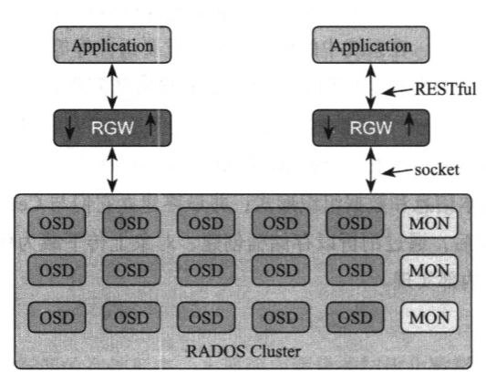

RGW前端与WEB 服务器紧密结合，通过 HTTP 协议与 Swift 和S3 应用通信，后端与librados 结合，通过 socket 与 RADOS 集群通信。RGW 支持目前主流的 WEB 服务器包括 Civetweb、Apache、Nginx 等，其中 Civetweb 是一个 C++库，可以内嵌到 RGW框架中，是RGW默认的WEB 服务器;Apache与 Nginx需要以独立进程存在，收到应用请求后，通过 RGW注册的监听端口号将请求转发到 RGW上处理。

## Data Organization

对象存储的基础数据实体包括：
* 用户 - 对象存储的使用者，拥有一个或多个存储桶。
* 存储桶 - 存储桶是对象的容器，管理和操作具有同一类属性对象的间接层。
* 对象 - 数据存储和组织的基本单位包含元数据和数据。

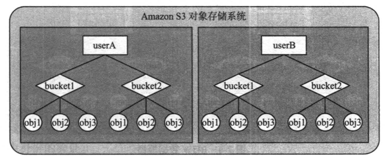

### User

S3 用户身份认证兼容 Amazon S3 的AWS2和AWS4 两种认证机制，这两种认证机制都是基于密钥认证。认证过程如下:
* 应用在发送请求前，使用用户私有密钥(secret key)请求内容等，采用与 RGW网关约定好的算法计算出数字签名后，将数字签名以及用户访问密钥 (access key)封装在请求中发送给 RGW网关。
* RGW网关收到请求后，使用用户访密作为索引从RADOS 集群中读取用户信息，并从用户信息中获取到用户私有密钥。
* 使用用户私有密钥、请求内容等，采用与应用约定好的算法计算数字签名。
* 判断 RGW 生成的数字签名与请求的签名是否匹配，如果匹配，则认为请求是真实的，用户认证通过。
从 S3 用户的认证过程可以看出，用户信息中必须包含访问密钥和私有密信息用于访问过程中身份的验证。

### Bucket

一个存储桶对应一个RADOS对象，包含两类信息：
* 用户自定义的元数据 - RGW不关心这些信息的内容，直接将这些信息保存在对象的扩展属性中，一个键值对对应一个扩展属性条目。
* 桶信息 - 这类信息包括存储桶中对象的存储策略、存储桶中索引对象的数目以及应用对象与索引对象的映射关系、存储桶的配额等，存储在桶对象中（对应的结构为`RGWBucketInfo`）。

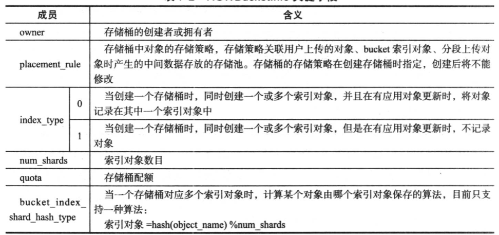

在创建存储桶时，RGW 网关会同步创建一个或多个索引(index)对象，用于保存该存储桶下的对象列表，以支持查询存储桶对象列表(Lit Bucket)功能，因此在存储桶中有新的对象上传或删除时必须更新索引对象。

在 Hammer 版本之前，对于单个存储桶只创建一个索引对象，因此索引对象的更新成为了对象上传或删除的性能瓶颈点。为了解决这个问题，RGW采用了 Ceph 通常采用的解决方案，将索引对象分片(shard)，把一个索引对象切分成多个对象(通过配置项 `rgw_override_bucket_index_max_shards` 指定)。

该解决方案极大地改观了对象写性能，根据我们的测试经验，一个标准的三节点 Ceph 集群，将索引对象的分片从默认不分片改为 32个分片后，16k 大小的对象写性能提高了 3 倍。但是分片机制带来一个负面影响，分片会影响查询存储桶对象列表操作的性能 (分片后，原先只需读取一个索引对象就可以获取存储桶下对象列表变成针对多个索引对象的读，这时，RGW 网关与 RADOS集群间的网络时延、多个索引对象查询结果的合并对查询存储桶对象列表性能产生很大的影响)。

为了降低该负面影响，RGW 网关试图将对多个索引对象的串行读改为并发读(通过 `rgw_bucket_index_max_aio` 配置项可调整并发数)以降低查询存储桶对象列表操作的处理时间。与此同时归并排序所消耗的计算量和缓存也会增加，从而制约了查询效率。索引对象分片机制虽然极大地改观了写性能，但是对性能的改观仍然有限，索引对象依然是对象写性能的瓶颈点。

因此，在不需要查询对象列表功能的场景(比如应用有自己的本地数据库保存和跟踪对象列表)，可以通过配置选项不跟踪存储桶下对象列表的更新，在一定程度上提高了对象上传的性能。需要注意的是，去掉对象列表的跟踪意味着存储桶的状态不能被准确地监控，并且存储桶下的对象不能被很好地跟踪，从而导致一些特性将不可用，比如多站点环境下数据的复制功能S3 API中的对象多版本功能针对存储桶下对象数目的限制等。

### Object

应用上传的对象包括数据和元数据两部分，数据部分保存在一个或多个 RADOS 对象的数据部分，元数据保存在其中一个RADOS 对象的扩展属性中。RGW 对单个对象提供了两种上传接口:整体上传和分段上传。不同的上传接口应用对象与 RADOS 对象对应关系不同。

RGW 限制了整体上传一个对象其大小不能大于5GB(与Amazon S3 标准相同，也可通过配置项 `rgw_max_put_size` 调整)，当用户上传的对象大于该限制时，必须分段上传对象，否则对象上传失败。

整体上传一个对象时，当对象小于分块（`rgw_max_chunk_size`）时，用户上传的一个对象只对应一个 RADOS对象，该 RADOS 对象以应用对象名称命名，应用对象元数据也保存在该 RADOS 对象的扩展属性中;当用户上传的对象大于分块（`rgw_max_chunk_size`）时，被分解成一个大小等于分块大小（`rgw_max_chunk_size`）的首对象，多个大小等于条带大小（`rgw_obj_stripe_size`）的中间对象，和一个小于等于条带大小的尾对象。

首对象以应用对象名称命名，在 RGW 网关中将该对象称为 `head_obj`，该对象的数据部分保存了应用对象前`rgw_max_chunk_size` 字节的数据，扩展属性部分保存了应用对象的元数据信息和 manifest 信息:中间对象和尾对象保存应用对象剩余的数据对象名称为“shadow_” + “.” + “32bit随机字符串” + “.” + “条带编号”，其中条带编号从1开始编号。

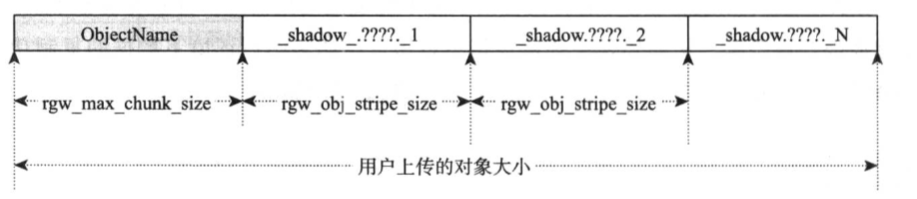

分段上传一个对象时，RGW 网关按照条带大小将每个分段分成多个 RADOS 对象每个分段的第一个RADOS 对象名称为“\_multipart\_” + “用户上传对象名称” + “分段上传ID“ + “分段编号”，其余对象的名称为“\_shadow\_” + “用户上传的对象名称” + “分段上传ID” + “分段编号” + “_” + “条带编号”。当所有的分段上传结束后，RGW 会另外生成一个RADOS 对象，用于保存应用对象元数据和所有分段的manifest。

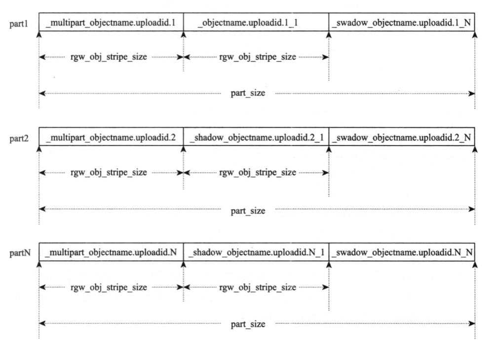

值得注意的是，用户上传每个分段的大小最好能被条带大小整除，如果不能整除，可能会导致整个对象上传后，RADOS 对象数目比每个分段被条带大小整除的对象数多且对象大小分布不均，例如用户要上传一个20M 的对象，以s3cmd 工具默认分段大小15M 为例，那么该对象需分两个分段上传，第一个分段的大小为 15M，第二个分段大小为5M，那么整个对象最后被分成4M、4M、4M、3M、4M、1M 大小的6个 RADOS 对象。如果分段大小设置为 16M，同样 20M 的对象也是分两个分段上传，第一个分段的大小为16M，第二个分段大小为4M，整个文件分成4M、4M、4M、4M、4M 大小的5个对象少了一个对象。对于RADOS 集群来说，对象数越多，对象管理数据越多，管理复杂度越大，对象大小分布不均，对性能可能也会有些影响。

### Data Location

不同的用户数据最终以RADOS 对象为单位保存到 RADOS 集群中。为了实现不同的应用数据存储位置的隔离RGW使用zone来管理用户数据的存储位置zone 由一组存储池(pool)组成，不同的存储池用来保存不同的数据RGW使用数据结构`RGWZoneParams`来管理不同的存储池。

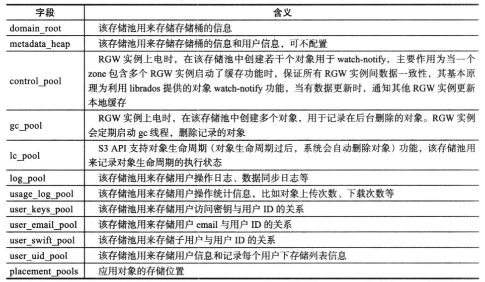

`placement_pools` 字段由 `map<string,RGWZonePlacementInfo>` 组成，map 的第一个字段是一个自定义字符串，可以认为是一个对象存储策略，用来唯一定位第二个字段`RGWZonePlacementInfo`，第二个字段主要定义了应用对象的存储位置、用户分段上传对象时中间数据的存储位置和存储索引对象的存储位置等。

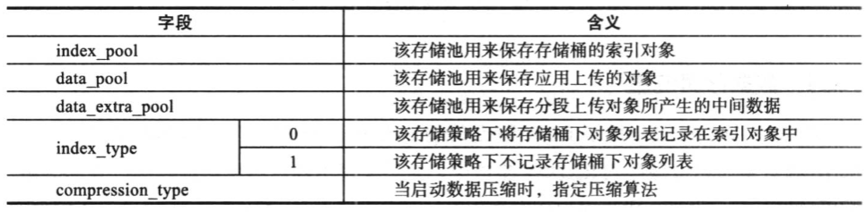

当创建一个存储桶时，用户可以显式指定 zone 中已存在的存储策略，后续往存储桶中上传对象时，将按照该存储策略存储对象。

## Feature Implementations

### Features

对象存储最基本的功能包括用户、存储桶、对象的增删改查，在此基础上，结合对象存储应用的特征，引申出更多的功能，比如在对象存储应用中，如果对一个存储桶或对象没有任何访问上的限制，该存储桶或对象就会变成公开的资源，任何人都可以访问因此对存储桶和对象的访问控制变得尤为重要，存储桶和对象的访问控制功能成为了对象存储的基本功能之一。

RGW支持以下功能：

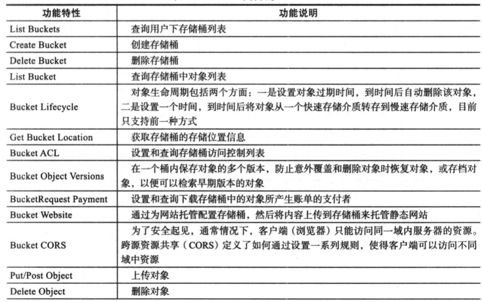
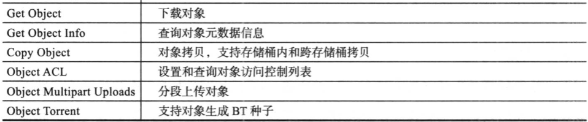

### I/O Path

RGW网关使用OP线程处理应用的 I/O请求(OP程在上电时创建，当前端WEB服务器为 Civetweb 时，通过修改配置项`rgw_thread_pool_size` 指定OP线程数目)。OP线程内部处理逻辑可分为HTTP 前端、REST API通用处理层、API操作执行层、RADOS 接口适配层与 librados 接口层等几个关键流程。

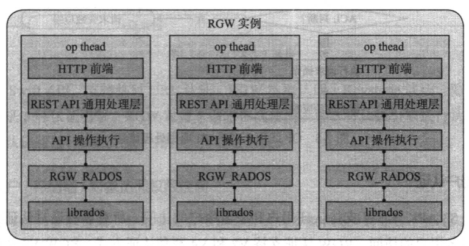

OP 线程从HTTP前端收到I/0请求后，首先在 REST API通用处理层，从HTTP语义中解析出S3 或Swift 数据并进行-系列的检查，检查通过后，根据不同API操作请求执行不同的处理流程，如需从RADOS集群获取数据或者往RADOS集群中写人数据，则通过RGW与RADOS 接口适配层调用librados 接口将请求发送到RADOS 集群中获取或写人相应数据，完成整个IO过程。

REST API通用处理层的流程如下：

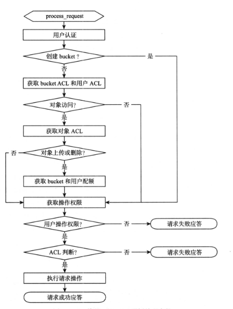

分为几个关键部分：
* 用户认证。
* 访问控制。
* 配额检查。

#### User Authentication

对于S3API，RGW 支持认证用户和匿名用户的访问，所有没有通过认证的访问则认为是匿名用户的访问。RGW认证支持 V2和 V4 两种认证方式，RGW V2认证支持本地认证、LDAP和 keystone 三种认证方式。RGW V4认证兼容Aws V4(Jewel版本支持)认证机制。

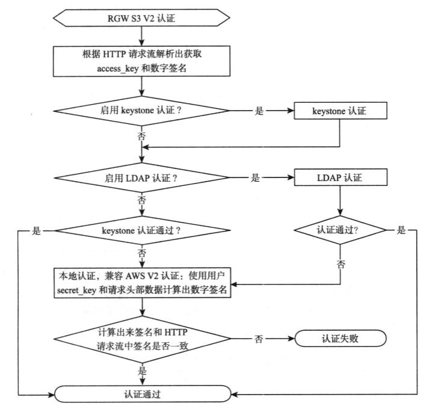

#### Access Control

针对不同的资源用户必须具有相应的权限才能访问资源。

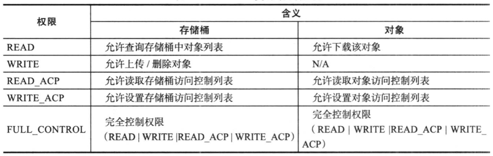

S3 访问控制分为桶级别和对象级别，访问权限可以在创建对象/桶的时候指定，也可以在之后设置，无论哪种方式都是授予存储桶或对象拥有者之外的用户权限。

#### Quota

在一个存储系统中，最重要的资源是存储空间。为了避免某类应用或某个用户占用太多的存储空间导致其他应用或用户无空间可用，我们通常限制单个应用或用户可使用的最大存储空间，称为配额管理。

在 RGW 中，配额管理是指对最大可存放的对象数目和对象总大小进行限制，它支持针对单个用户以及单个用户下单个存储桶两种模式的配额限制，分别使用`user_quota` 和 `bucket_quota`表示。当两种配额模式同时启用时任何一种先达到了配额限制都会生效。

RGW实例的配额可通过如下方式进行设置：
* 全局配置，适用于所有的用户和存储桶。
* 创建用户或更新用户配置时配置，适用于配置用户。

配置配额后，每次上传/删除对象时，需要对配额进行检查并更新已使用量。我们知道 RGW 网关所有的数据和元数据保存在 RADOS 对象中，因此在上传对象操作中首先需要从 RADOS 对象中读取存储空间使用量，然后判断当前对象是否可以上传，如果可以，上传对象后再更新存储空间使用量到 RADOS 对象中，这样多了一次读 I/O 和次写I/0，对于写性能造成不利影响。

因此，RGW 设计了一个 lru 缓存，将用户和存储桶配额以一个 map 的形式保存在缓存中，读写已有使用量都是优先从缓存中读写，然后再定时将缓存的数据刷到对象中。

但这样的设计带来一个问题，因为缓存在本地，没有在 RGW 实例间做同步，如果一个集群部署了多个 RGW 实例做负荷分担，每个RGW 实例看到的使用量可能不一样。由此可能造成两个影响:
* 一是用户使用量还没达到配额的限制，但是用户不能写人，这种情况通常在通过一个 RGW实例删除对象然后通过另外一个RGW 实例上传对象时出现。
* 另外一个影响是用户使用量已经达到配额的限制，但是实际上还可以写人，这种情况通常在通过多个 RGW 实例同时上传对象时出现。

可以通过三个参数配置Quota缓存：
* `rgw_bucket_quota_ttl` - 存储桶配额缓存可信任时间段。在检查配额是否达到限制时，如果缓存中记录的使用量达到配额的一个百分比时(默认配置是95%，通过配置项`rgw_bucket_quota_soft_threshold` 可调整)或者距离上次从 RADOS 集群中更新配额到缓存中的时间超过该时间时，则认为缓存记录的使用量不可靠，需要重新从RADOS 集群中获取最新的使用量并更新到缓存中，同时重置缓存超时时间。
* `rgw_user_quota_bucket_sync_interval` - 控制存储桶已用空间从缓存刷到RADOS集群的间隔时间。
* `rgw_user_quota sync_interval` - 控制用户已用空间从缓存刷到RADOS集群的间隔时间。

以上三个配置项的值越大，缓存跟 RADOS 对象中配额差别越大，当三者等于0时相当于没有缓存。

#### Authorize

用户操作权限判断指的是判断该用户是否具有读、写、删除权限，比如只有具有删除权限的用户才能进行删除对象的操作，对应于用户信息中的 `op_mask` 字段。

### Bucket Creation

存储桶的创建流程如下：

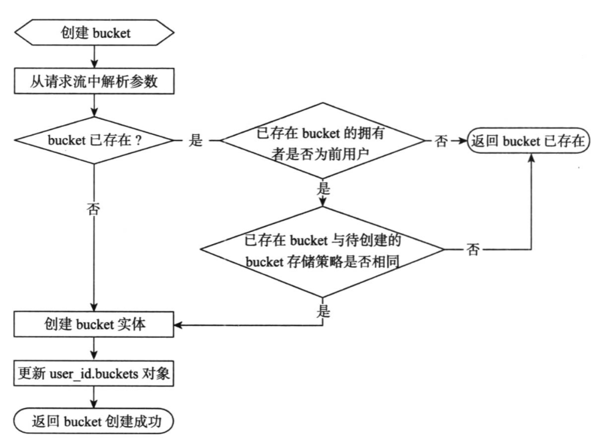

**从HTTP请求流解析出相关参数**： 对于S3 API，创建存储桶可携带的信息包括存储桶访问控制列表和存储桶中对象的存储策略。

**判断存储桶是否存在**： 由于同一租户下的不同用户不能创建同名的存储桶，因此如果该存储桶名称已存在且其拥有者不是当前的用户，返回存储桶已存在。

**创建存储桶**： 所有的检查通过后开始创建存储桶，首先根据应用指定的对象存储策略，并将存储策略保存在存储桶的管理结构 `RGWBucketInfo` 中，然后将存储桶的访问控制列表、跨源资源访问信息、自定义元数据封装对应的 KV条目，在索引存储池创建单个或多个索引对象成功后，在 `domain_root`存储池创建一个对象，同时将管理结构`RGWBucketInfo` 保存在该对象的内容中，将KV条目保存在该对象的扩展属性中。

**更新 `user_id.buckets` 对象** :创建一个用户的同时，创建一个名为 `user_id.buckets`的对象，用于记录该用户下所有的存储桶列表，保存在该对象的 OMAP 中。OMAP由一个头部和多个KV条目组成，针对`user_id.buckets` 对象，OMAP头部保存用户使用空间统计信息(使用结构 `cls_user_header`表示，用户使用空间统计信息主要包括该用户下的对象数目和数目总字节数统计): MAP的KV条保存一个存储桶使用空间统计信息(使用结构`cls_user_bucket_entry` 表示)。

|`cls_user_header`|`cls_user_bucket_entry`|
|-|-|
|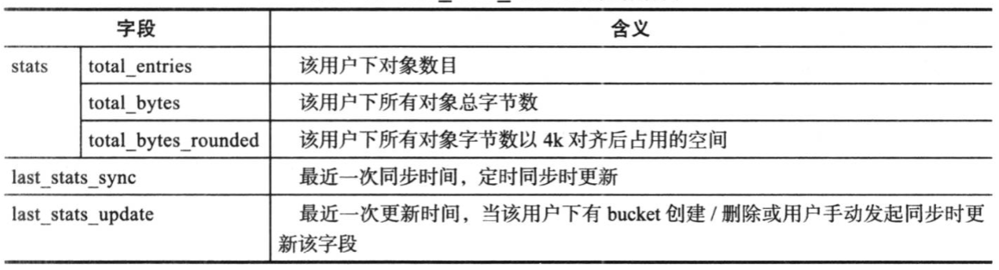|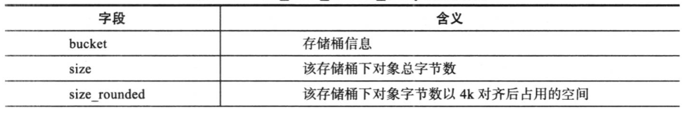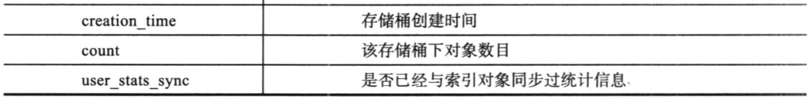|

### Object Upload

RGW针对对象上传操作设计了两个接口:整体上传对象接口和分段上传对象接口当单个对象大于 5GB 时，必须调用分段上传接口才能成功上传对象，当单个对象小于条带大小时，不能采用分段上传方式上传对象。

#### Entirety Upload

* `prepare` - 在 `prepare` 阶段的主要工作是初始化 `manifest` 数据结构。
* `handle_data` - `handle_data` 阶段，RGW每次从HTTP Server 缓冲区中取出 `rgw_max_chunk_size` 字节的数据，存放在一个bufferlist 中，然后分成一个或多个I/0异步下发到RADOS层，每个I/0的大小等于`min(rgw_max_chunk_size,next_part_ofs-data_ofs)`，其中 `next_part_ofs` 表示下一个RADOS 对象保存的用户数据偏移位置，`data_ofs` 表示当前数据的偏移位置。
* `complete` - 等所有数据上传成功后，对象上传进 `complete` 阶段，该阶段的主要工作是将对象元数据更新到 `head_obi` 中，同时将对象条目更新到索引对象中，以便后续列举对象。

在块大小为2MB、条带大小为5MB 情况下，用户上传一个9MB 的对象为例，`handle_data` 阶段的处理流程。

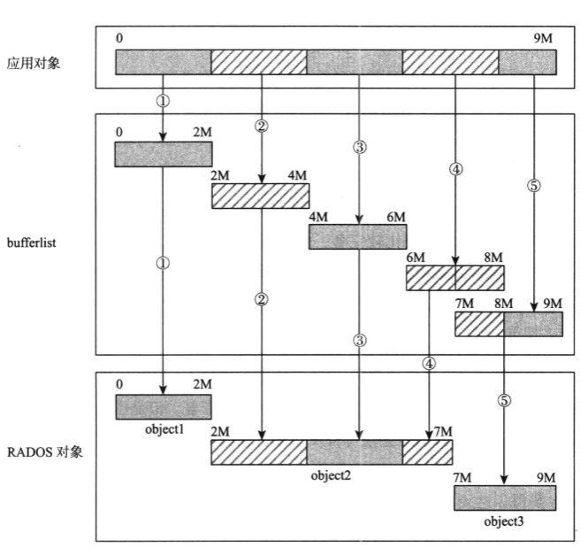

#### Sharded Upload

* 初始化 - 在分段上传数据之前，应用首先调用INITIATE MULTI-PART UPLOAD接口进行初始化，应用在调用该接口的请求中携带对象的访问控制列表、用户对上传对象自定义的元数据等信息。RGW 在此操作中生成一个 Uploadld 返回给应用，同时在`data_extra_pool` 中生成一个临时对象，用于保存每个分段的信息，并将对象的访问控制列表信息、元数据信息等保存到该对象的 xattr 中。
* 分段上传 - 分段上传对象流程跟单个操作上传流程基本一致，不同之处在 `complete` 阶段，分段上传对象除了需要将每个分段对象更新到索引对象之外，还需要将每个分段信息更新到初始化时在`data_extra_pool`中生成的临时对象中。
* 分段上传完成 - 所有的段上传完成后，应用需要调用COMPLETE MULTIPARTUPLOAD 表示对象上传完成。在此操作中 RGW会从初始化阶段生成的临时对象中读出各个分段信息，最主要是分段的 `manifest`，组成一个`manifest`，然后生成一个 `head_obj`将这些信息保存到 `head_obi` 后，将临时对象删除。

### Object Download

用户还可以指定对象的某一段(采用`(off,length)`的形式)下载对象的部分内容，RGW首先从`head_obj`中读出 `manifest` 管理结构，然后根据 `manifest` 中定义的规则计算出用户请求的数据段保存在哪些对象中，最后从这些对象中读出数据合并后发送给客户端。