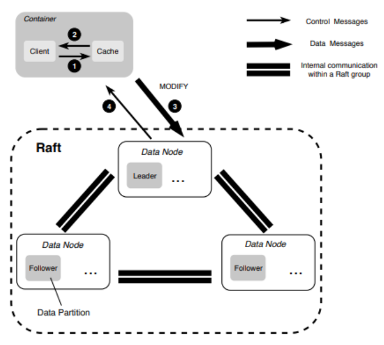

# Datanode Source Code Analysis

每一个数据节点（data node）可以搭载多个数据分区（data partition），每一个数据分区都运行一个Raft组（raft group）和一个主从复制组（primary-backup group），数据节点只对 extent 进行管理而与实际的文件无关。

卷中（volume）的每一个文件（file）都由一个或多个 extents 存储：
* 对于大文件（large file），单个文件被切分成多个 extents 存储在数据分区中。
* 对于小文件（small file），多个文件聚合成一个 extent 存储在数据分区中。

## Storage Engine

### Large File Storage

大文件将自身的内容切分成多个 extents ，这些 extents 由数据分区进行存储，这意味着大文件的不同 extents 可以存储在不同数据分区中，从而为随机读/写提高更好的并行性。

### Small File Storage

多个小文件聚合存储在一个 extent 中，并由元数据节点（meta node）记录该文件在 extent 的offset，当文件删除时，通过 `fallocate()` 进行文件系统打洞来删除文件。

### Sequential Write

顺序写入通过主从复制进行：
1. Client将要写入的数据传输给主从复制的Leader。
2. Leader将数据复制到多个 replicas 中。
3. 主从集群完成写入，并向Client回复新的 extent 大小（一个整数）。
4. Client用新的 extent 大小更新在元数据分区（meta partition）中的文件大小。

*NOTE：步骤 4 是整个写入过程的提交点（commit point）。*

在故障恢复时：主从复制进行 extent 大小的对齐（取最小值）。

### Random Write

随机写入通过Raft组进行：
1. Client将写入的数据传输给Raft组的Leader。
2. Leader将其放入Raft Log中，并传输给其他replicas。
3. Raft组应用log entry，并向Client返回。

### Disk Data Structure

每一个数据分区在本地文件系统上都会有自己的目录。

对于：
* 正常数据分区 - 标准卷的分区，目录名为 `datapartition_<partitionId>_<partitionSize>`。
* 缓存数据分区 - 低频卷的分区，目录名为 `cachepartition_<partitionId>_<partitionSize>`。
* 预热数据分区 - 存储预热数据的卷的分区，目录名为 `preloadpartition_<partitionId>_<partitionSize>`。
* 过期数据分区 - 已经从该节点移走的卷的数据分区，目录名为 `expired_datapartition_<partitionId>_<partitionSize>`。

每间隔一段固定的时间（2分钟），数据节点会对`.diskStatus`隐藏文件进行一次读写来判断当前磁盘是否可用。

具体的数据分区目录结构如下：

其中：
* `1` - `100` 为该数据分区存储的 extents 文件，文件名就是 extent 的 id。
* APPLY - 记录数据分区当前的Raft `AppiledIndex`的值。
* EXTENT_CRC - 记录每一个 extent 的 checksum。
* EXTENT_META - 前`8`个字节记录正在使用的最大的 extent id，后`8`个字节记录已经分配的 extent id的最大值。
* META - 记录数据分区的元数据信息。
* NORMALEXTENT_DELETE - 记录被删除的 extent id。
* TINYEXTENT_DELETE - 记录被删除的extent 信息（`|ExtentId|offset|size|`，每条24字节）。
* wal_2181 - Raft的log目录。

extent 文件具有两种类型：
* **NormalExtent** - 由`128KB`的块组成，每一个 extent 不能拥有超过`1024`个块，所以此种 extent 最大的大小为 `128MB`，此种 extent 的id从`1024`开始分配。
* **TinyExtent** - 此种 extent 的最大大小为`4TB`，负责存储小文件，每个小文件的数据都对齐到`4096`，此种 extent 的id从`1`开始分配到`64`。

### DataNode Data Structure

每一个数据节点都使用一个空间管理器（space manager）进行空间管理。

|数据节点|空间管理器|磁盘|
|-|-|-|
||||

数据节点的配置文件中会要求设置每一个磁盘（disk）的预留空间、磁盘的挂载目录（用于存储数据分区）以及一个只读阈值。

*NOTE：此处的磁盘指的是节点上的物理磁盘。*

在数据节点启动时：
1. 解析配置文件。
2. 向资源管理器节点（master）获取自己的节点id。
3. 进行数据节点修复。
4. 启动空间管理器并加载数据分区。
5. 检查节点的数据分区与资源管理器记录的数据分区是否一致。
6. 启动TCP/SMUX服务，同时启动后台服务（包括检查资源管理器与数据节点中数据分区的一致性、写入磁盘空间限制和周期性磁盘可用性检查）。

### Disk Load

同时在启动时，空间管理器读取磁盘文件初始化磁盘数据结构：
1. 加载磁盘中已存在的数据分区，创建相应的数据结构。
2. 当某个磁盘的所有数据分区加载完成后，将磁盘结构添加到空间管理器的缓存中。
3. 并为每一个磁盘建立后台任务（为磁盘中的每一个数据分区计算CRC checksum和清理过期缓存）。

磁盘加载完挂载目录下所有的数据分区后，启动后台任务（间隔1分钟）：
* 对Normal数据分区中的ExtentInfo按照ExtentId进行排序，对满足要求的Extent进行CRC checksum计算，同时清除在ExtentInfo缓存中被标记为过期的数据。
* 清理ExtentStore中已删除数据分区的过期缓存。

### Data Partition Load

进行数据分区加载时：
1. 先从磁盘中加载所有数据分区。
2. 然后通过资源管理器进行比对。
3. 不在资源管理器中的数据分区则为一个过期的数据分区。
4. 过期的数据分区会在后台进行删除。

|数据分区|数据分区元数据|
|-|-|
|||
||-|

加载数据分区本质上是加载数据分区的元数据。

|加载数据分区|创建数据分区|
|-|-|
|||

在加载数据分区的过程中会创建几个后台任务：
* statusUpdateScheduler。
* startEvict - 只处理`PartitionTypeCache`类型的数据分区，对数据分区中过期的 extent 进行删除。
* startRaftLoggingSchedule - 在数据分区的Raft启动后定期将appiled index落盘（间隔10秒）并进行Raft日志截断（间隔1分钟）。

其中 statusUpdateScheduler 执行三个任务：
* LaunchRepair - 间隔一分钟执行 extent 修复（仅leader节点），非Normal数据分区只进行TinyExtent的修复，而Normal数据分区执行TinyExtent和NormalExtent的修复。
* statusUpdate - 间隔一分钟更新数据分区的空间使用量和状态，若数据分区使用的空间超过了阈值（或NormalExtent的数量超过了20000个），则将数据分区设置为只读。
* ReloadSnapshot - 间隔5分钟保存数据分区上的所有 extents 的快照。

在数据分区加载（或创建）完成后，会启动Raft：
* 对于正常创建的数据分区，直接启动Raft。
* 对于修复任务创建的数据分区，等待修复任务完成后启动Raft（除非本节点为leader节点，直接启动Raft）。

### Computing CRC Checksum

对 extent 计算CRC Checksum需要满足一定条件：
* 该 extent 为 NormalExtent。
* 它的修改时间超过了CRC更新间隔（10分钟）。
* 文件大小大于0。
* 没有被标记为删除。
* 已经没有计算过CRC值。

