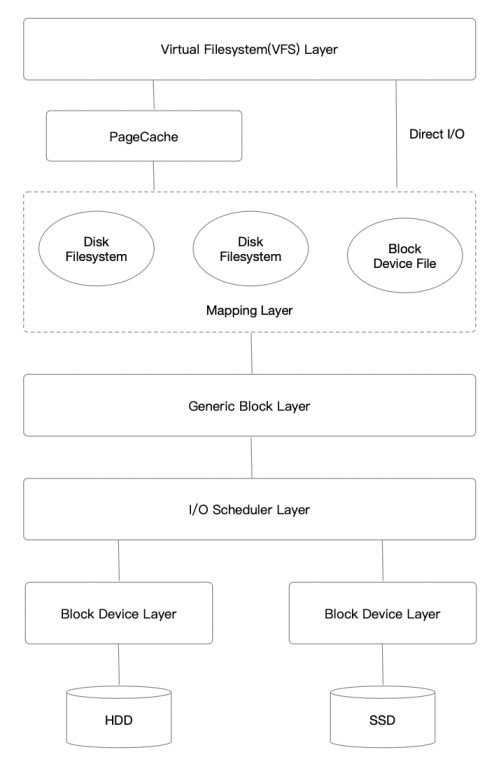

# Basic

Linux IO存储栈主要有以下7层:



## VFS

VFS层的作用是屏蔽了底层不同的文件系统的差异性，为用户程序提供一个统一的、抽象的、虚拟的文件系统，提供统一的对外API，使用户程序调用时无需感知底层的文件系统，只有在真正执行读写操作的时候才调用之前注册的文件系统的相应函数。

VFS支持的文件系统主要有三种类型：
* 基于磁盘的文件系统：ext*、XFS等。
* 网络文件系统：NFS、CIFS等。
* 特殊文件系统：/proc、裸设备等。

VFS主要有四个对象类型(不同的文件系统都要实现)：
* `superblock` - 整个文件系统的元信息。对应的操作结构体：`struct super_operations`。
* `inode` - 单个文件的元信息。对应的操作结构体：`struct inode_operations`。
* `dentry` - 目录项，一个文件目录项（父目录下的文件/目录）对应一个`dentry`。对应的操作结构体：`struct dentry_operations`。
* `file` - 进程打开的一个文件。对应的操作结构体：`struct file_operations`。

所有结构的定义都可以在<a href="https://github.com/torvalds/linux/blob/master/include/linux/fs.h"><code>fs.h</code></a>找到。

### Superblock

`superblock`结构体定义了整个文件系统的元信息，以及相应的操作。

例如ext4的定义如下。

```c
static const struct fs_context_operations ext4_context_ops = {
	.parse_param	= ext4_parse_param,
	.get_tree	= ext4_get_tree,
	.reconfigure	= ext4_reconfigure,
	.free		= ext4_fc_free,
};

static struct file_system_type ext4_fs_type = {
	.owner			= THIS_MODULE,
	.name			= "ext4",
	.init_fs_context	= ext4_init_fs_context,
	.parameters		= ext4_param_specs,
	.kill_sb		= ext4_kill_sb,
	.fs_flags		= FS_REQUIRES_DEV | FS_ALLOW_IDMAP,
};
```

### Inode

`inode`结构体定义了文件的元数据，比如大小、最后修改时间、权限等，除此之外还有一系列的函数指针，指向具体文件系统对文件操作的函数，包括常见的`open`、`read`、`write`等，由`i_fop`函数指针提供。

文件系统最核心的功能全部由`inode`的函数指针提供。主要是`inode`的`i_op`、`i_fop`字段。

```c
struct inode {
	......
	const struct inode_operations	*i_op;

	const struct file_operations	*i_fop;
	......
}
```

在打开inode的时候会设置不同的`i_op`和`i_fop`。

```cpp
struct inode *__ext4_iget(struct super_block *sb, unsigned long ino,
			  ext4_iget_flags flags, const char *function,
			  unsigned int line)
{
    .......
    if (S_ISREG(inode->i_mode)) {
		inode->i_op = &ext4_file_inode_operations;
		inode->i_fop = &ext4_file_operations;
		ext4_set_aops(inode);
	} else if (S_ISDIR(inode->i_mode)) {
		inode->i_op = &ext4_dir_inode_operations;
		inode->i_fop = &ext4_dir_operations;
    }
    .......
}
```

### Dentry

`dentry`是目录项，由于每一个文件必定存在于某个目录内，我们通过路径查找一个文件时，最终肯定找到某个目录项。在Linux中，目录和普通文件一样，都是存放在磁盘的数据块中，在查找目录的时候就读出该目录所在的数据块，然后去寻找其中的某个目录项。

```c
struct dentry {
	......
	const struct dentry_operations *d_op;
	......
};
```

在我们使用Linux的过程中，根据目录查找文件的例子无处不在，而目录项的数据又都是存储在磁盘上的，如果每一级路径都要读取磁盘，那么性能会十分低下。所以需要目录项缓存，把`dentry`放在缓存中加速。

VFS把所有的`dentry`放在`dentry_hashtable`哈希表里面，使用LRU淘汰算法。

### File

用户程序能接触的VFS对象只有`file`，由进程管理。我们常用的打开一个文件就是创建一个`file`对象，并返回一个文件描述符。出于隔离性的考虑，内核不会把`file`的地址返回，而是返回一个整形的`fd`。

```cpp
struct file {
	// 操作文件的函数指针，和inode里面的i_fop一样，在open的时候赋值为i_fop。
	const struct file_operations *f_op;

	// 指向对应inode对象
	struct inode *f_inode;

	// 每个文件都有自己的一个偏移量
	loff_t f_pos;
	......
}
```

`file`对象是由内核进程直接管理的。每个进程都有当前打开的文件列表，放在`files_struct`结构体中。

```c
struct files_struct {
  /*
   * read mostly part
   */
	atomic_t count;
	bool resize_in_progress;
	wait_queue_head_t resize_wait;

	struct fdtable __rcu *fdt;
	struct fdtable fdtab;
  /*
   * written part on a separate cache line in SMP
   */
	spinlock_t file_lock ____cacheline_aligned_in_smp;
	unsigned int next_fd;
	unsigned long close_on_exec_init[1];
	unsigned long open_fds_init[1];
	unsigned long full_fds_bits_init[1];
	struct file __rcu * fd_array[NR_OPEN_DEFAULT]; // 打开的文件列表
};
```

`fd_array`数组存储了所有打开的`file`对象，用户程序拿到的文件描述符(`fd`)实际上是这个数组的索引。


### IO Stack

`read`、`write`系统调用实际上是对VFS的封装。

```cpp
SYSCALL_DEFINE3(read, unsigned int, fd, char __user *, buf, size_t, count)
{
	return ksys_read(fd, buf, count);
}

ssize_t ksys_read(unsigned int fd, char __user *buf, size_t count)
{
	struct fd f = fdget_pos(fd);
	ssize_t ret = -EBADF;

	if (f.file) {
		loff_t pos, *ppos = file_ppos(f.file);
		if (ppos) {
			pos = *ppos;
			ppos = &pos;
		}
		ret = vfs_read(f.file, buf, count, ppos);
		if (ret >= 0 && ppos)
			f.file->f_pos = pos;
		fdput_pos(f);
	}
	return ret;
}
```

```c
SYSCALL_DEFINE3(write, unsigned int, fd, const char __user *, buf,
		size_t, count)
{
	return ksys_write(fd, buf, count);
}

ssize_t ksys_write(unsigned int fd, const char __user *buf, size_t count)
{
	struct fd f = fdget_pos(fd);
	ssize_t ret = -EBADF;

	if (f.file) {
		loff_t pos, *ppos = file_ppos(f.file);
		if (ppos) {
			pos = *ppos;
			ppos = &pos;
		}
		ret = vfs_write(f.file, buf, count, ppos);
		if (ret >= 0 && ppos)
			f.file->f_pos = pos;
		fdput_pos(f);
	}

	return ret;
}
```

而VFS又将调用对应的`f_op`。

```c
ssize_t vfs_read(struct file *file, char __user *buf, size_t count, loff_t *pos)
{
	ssize_t ret;

	if (!(file->f_mode & FMODE_READ))
		return -EBADF;
	if (!(file->f_mode & FMODE_CAN_READ))
		return -EINVAL;
	if (unlikely(!access_ok(buf, count)))
		return -EFAULT;

	ret = rw_verify_area(READ, file, pos, count);
	if (ret)
		return ret;
	if (count > MAX_RW_COUNT)
		count =  MAX_RW_COUNT;

	if (file->f_op->read)
		ret = file->f_op->read(file, buf, count, pos);
	else if (file->f_op->read_iter)
		ret = new_sync_read(file, buf, count, pos);
	else
		ret = -EINVAL;
	if (ret > 0) {
		fsnotify_access(file);
		add_rchar(current, ret);
	}
	inc_syscr(current);
	return ret;
}

ssize_t vfs_write(struct file *file, const char __user *buf, size_t count, loff_t *pos)
{
	ssize_t ret;

	if (!(file->f_mode & FMODE_WRITE))
		return -EBADF;
	if (!(file->f_mode & FMODE_CAN_WRITE))
		return -EINVAL;
	if (unlikely(!access_ok(buf, count)))
		return -EFAULT;

	ret = rw_verify_area(WRITE, file, pos, count);
	if (ret)
		return ret;
	if (count > MAX_RW_COUNT)
		count =  MAX_RW_COUNT;
	file_start_write(file);
	if (file->f_op->write)
		ret = file->f_op->write(file, buf, count, pos);
	else if (file->f_op->write_iter)
		ret = new_sync_write(file, buf, count, pos);
	else
		ret = -EINVAL;
	if (ret > 0) {
		fsnotify_modify(file);
		add_wchar(current, ret);
	}
	inc_syscw(current);
	file_end_write(file);
	return ret;
}
```

如果`file->f_op->read`或者`file->f_op->write`指针不为`NULL`会调用相应的函数。

但如果为`NULL`同时`file->f_op->write_iter != NULL`，就会走`new_sync_write`。

```cpp
const struct file_operations ext4_file_operations = {
	.llseek		= ext4_llseek,
	.read_iter	= ext4_file_read_iter,
	.write_iter	= ext4_file_write_iter,
	.iopoll		= iocb_bio_iopoll,
	.unlocked_ioctl = ext4_ioctl,
#ifdef CONFIG_COMPAT
	.compat_ioctl	= ext4_compat_ioctl,
#endif
	.mmap		= ext4_file_mmap,
	.mmap_supported_flags = MAP_SYNC,
	.open		= ext4_file_open,
	.release	= ext4_release_file,
	.fsync		= ext4_sync_file,
	.get_unmapped_area = thp_get_unmapped_area,
	.splice_read	= ext4_file_splice_read,
	.splice_write	= iter_file_splice_write,
	.fallocate	= ext4_fallocate,
};
```

可以看到对于ext4，则是走了`new_sync_write`的流程。

```c
static ssize_t new_sync_write(struct file *filp, const char __user *buf, size_t len, loff_t *ppos)
{
	struct kiocb kiocb;
	struct iov_iter iter;
	ssize_t ret;

	init_sync_kiocb(&kiocb, filp);
	kiocb.ki_pos = (ppos ? *ppos : 0);
	iov_iter_ubuf(&iter, ITER_SOURCE, (void __user *)buf, len);

	ret = call_write_iter(filp, &kiocb, &iter);
	BUG_ON(ret == -EIOCBQUEUED);
	if (ret > 0 && ppos)
		*ppos = kiocb.ki_pos;
	return ret;
}

static ssize_t
ext4_file_write_iter(struct kiocb *iocb, struct iov_iter *from)
{
	struct inode *inode = file_inode(iocb->ki_filp);

	if (unlikely(ext4_forced_shutdown(inode->i_sb)))
		return -EIO;

#ifdef CONFIG_FS_DAX
	if (IS_DAX(inode))
		return ext4_dax_write_iter(iocb, from);
#endif
	if (iocb->ki_flags & IOCB_DIRECT)
		return ext4_dio_write_iter(iocb, from);
	else
		return ext4_buffered_write_iter(iocb, from);
}

static ssize_t ext4_buffered_write_iter(struct kiocb *iocb,
					struct iov_iter *from)
{
	ssize_t ret;
	struct inode *inode = file_inode(iocb->ki_filp);

	if (iocb->ki_flags & IOCB_NOWAIT)
		return -EOPNOTSUPP;

	inode_lock(inode);
	ret = ext4_write_checks(iocb, from);
	if (ret <= 0)
		goto out;

	ret = generic_perform_write(iocb, from);

out:
	inode_unlock(inode);
	if (unlikely(ret <= 0))
		return ret;
	return generic_write_sync(iocb, ret);
}
```

## Page Cache

