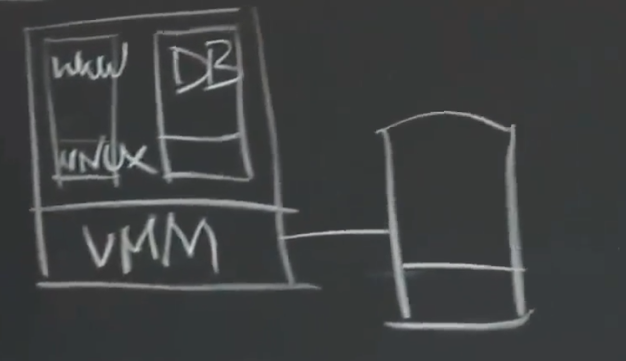
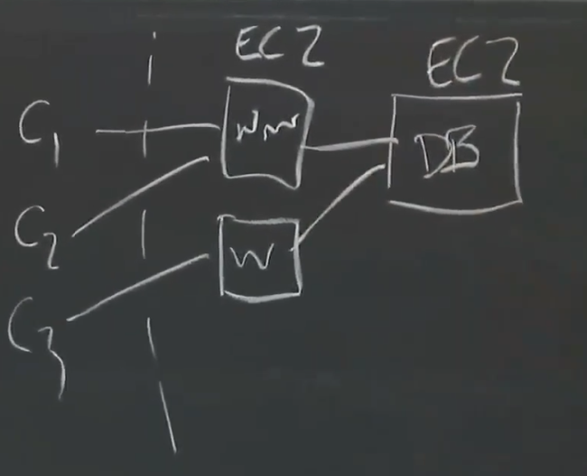
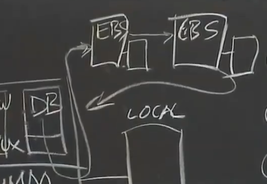
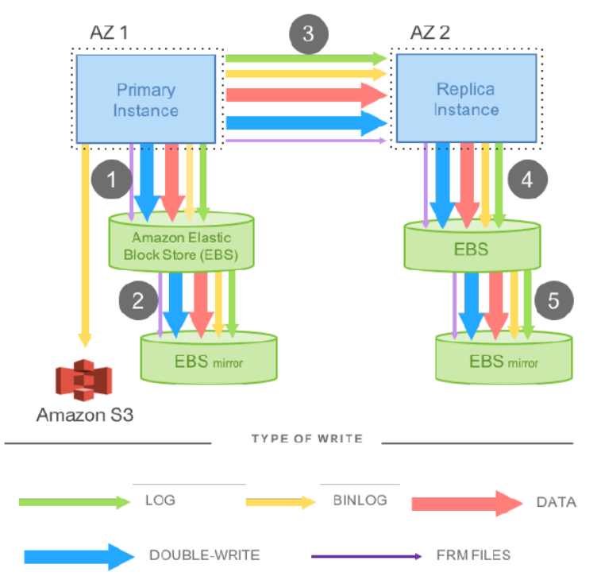

# Aurora

Aurora是Amazon构建的云数据库。

## History Of Cloud

Amazon在2006年发布了第一个云计算基础设施（IaaS）EC2，EC2在Amzon的机房中运行VMM，并将虚拟机作为一种产品提供给租户。

租户在其虚拟机上运行Web服务器和数据库管理系统以搭建自己的网站并向外部提供服务。

Web服务器之类的无状态服务很容易就可以使用EC2进行容错（当崩溃时启动一个新的EC2实例即可），而有状态的存储系统就没这么容易了（当运行虚拟机的物理机磁盘崩溃时租户将失去所有数据）。

因此Amazon提供了S3来解决数据的存储问题（通过将租户的DB快照备份在S3上），但这会失去制作快照之后的所有更新（因为那些更新没有被备份）。

同时Amazon提供了EBS，作为一种高可用的存储实现，租户可以将EBS的卷挂载到虚拟机的文件系统上，然后就像在本地文件系统上执行操作一样操作EBS。

这使得DBMS之类的存储系统，可以进行容错（通过将数据存储在EBS的方式），当运行DBMS的虚拟机崩溃时，只需要重新启动一个EC2实例运行DBMS软件即可（先前的数据都存储在EBS上，DBMS成了一个无状态服务）。

*NOTE：在一段时间内一个EBS卷只能被挂载到一个EC2实例上。*

通过EBS进行容错的DBMS称为RDS。

RDS是一种Primary-backup Replication，同时它的replicas分别在不同的AZ（可用区域，available zone）中，并且两个AZ在不同的数据中心（以提供数据中心级容错）。

