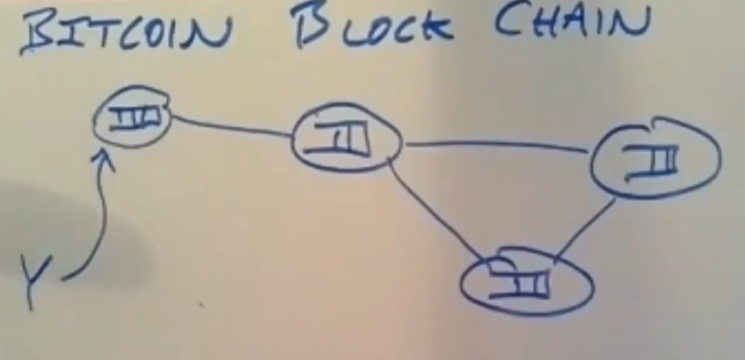
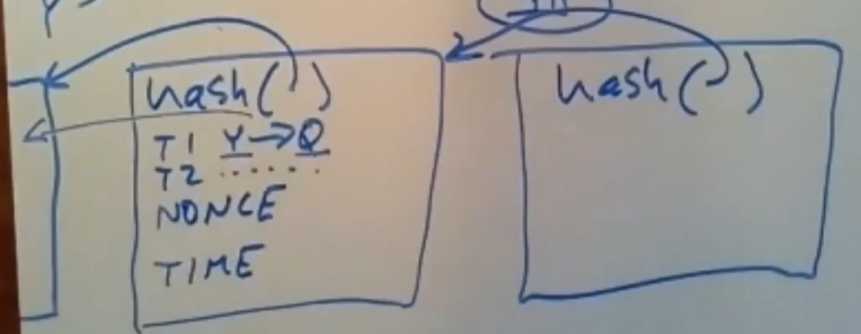
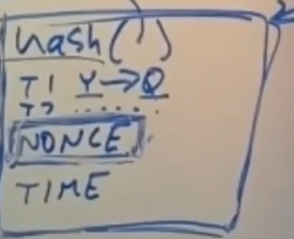
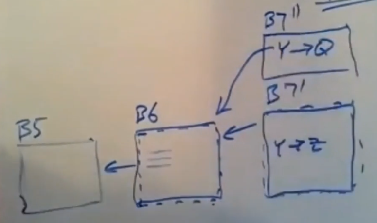
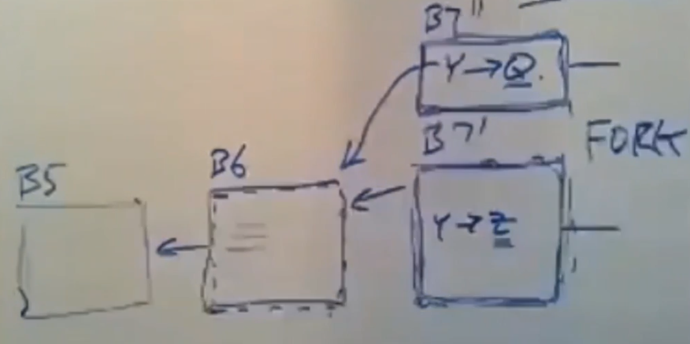
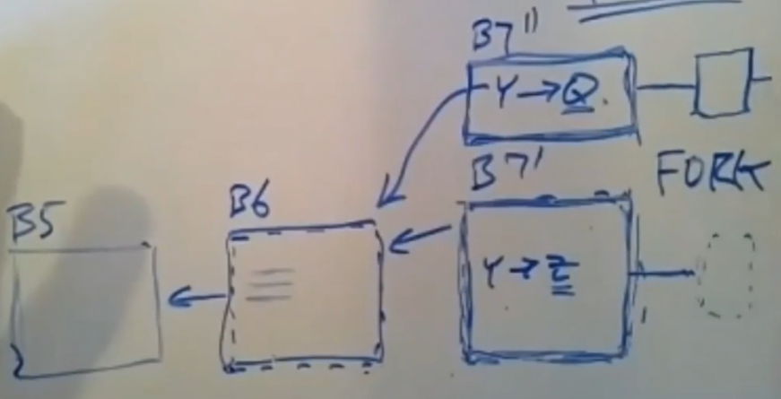
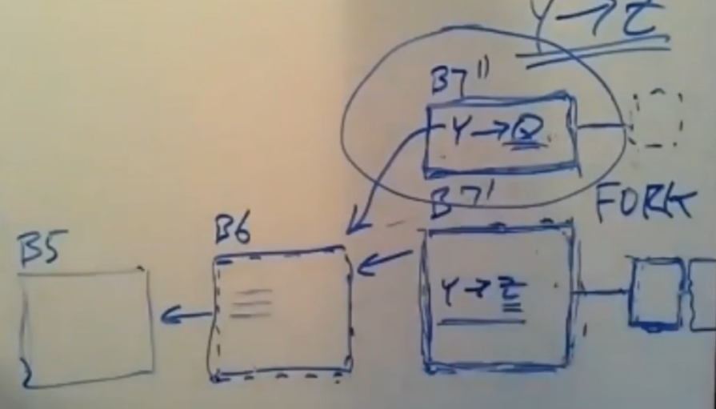
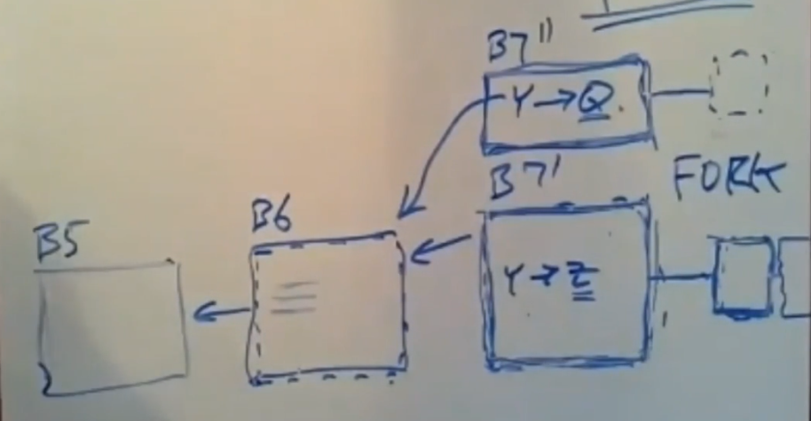
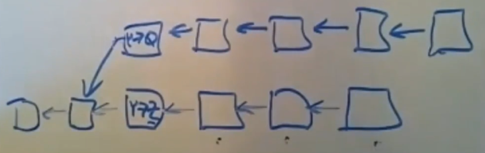

# Bitcoin

Bitcoin是一种public ledger，允许任何人参与和发布交易同时具有一致性。

所以bitcoin必须能够容忍恶意的参与者。

## Block Chain

bitcoin peer将用户的交易打包成区块，大约10分钟，peer将产生一个区块，然后追加到账本中。

每一个区块都包含上一个区块的hash，区块由hash串联在一起，称为block chain。

每个区块包含：
* 交易。
* NONCE。
* 当前时间。
* 交易的Merkle Tree Root。
* 上一个区块的hash。

产生区块的动作称为挖矿（mining）。

*NOTE：只有使用POW产生的区块才称为挖矿。*

## Proof Of Work

矿工（参与bitcoin的peer）使用`NONCE`进行挖矿：
* 随机猜测一个`NONCE`。
* 填入区块然后计算hash。
* 如果hash前`N`位是`0`则挖矿成功，否则重新进行挖矿。

*NOTE: `N`是由挖矿难度决定的，bitcoin动态调整挖矿难度确保大约10分钟能挖出区块。*

这个挖矿的过程称为工作量证明（Proof Of Work，POW）。

*NOTE：本质上是限制在一段时间内只有一个block出现，并且间隔足够block进行充分传播（这不是一个确定性的过程，而共识是一个确定性的过程，但共识不支持open system）。*

这个过程的缺点是有可能出现分叉（即同时有多个节点广播某个区块的不同后继区块）。

同时POW保证链的不可篡改（因为区块由hash链接在一切篡改一个区块需要重做这个区块以及它的后继区块的POW）。

## Longest Fork Principle

不同的矿工可能在不同的fork上进行挖矿。

但是一旦矿工发现有最长的链出现，那么它们就会切换到最长链上重新进行挖矿。

并且这导致最长链的增长速度增加（因为矿工切换），其他短的fork追上最长链的可能性减少。

同时短的fork中的交易将失效。

*NOTE： bitcoin不会合并forks，如果client的交易在短fork中，需要重新提交交易。*

因此只有交易所在的区块后面有足够的区块才能认为交易被提交。

但是如果攻击者掌握了系统大多数的算力，他就能快速伪造一个新fork使其变成最长链来覆盖之前的交易达到篡改区块的效果。

*NOTE： 这种攻击称为双花攻击。*