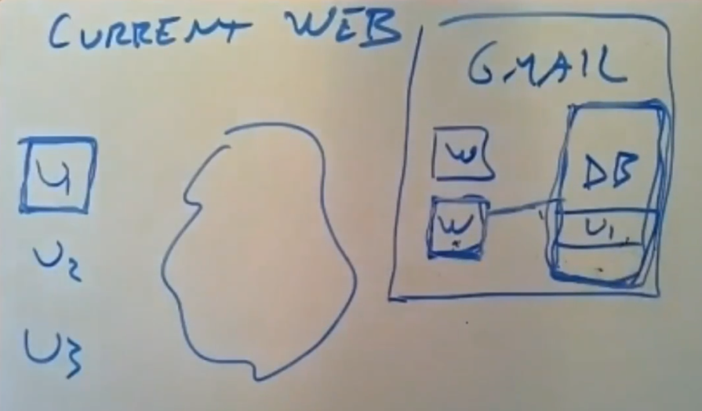
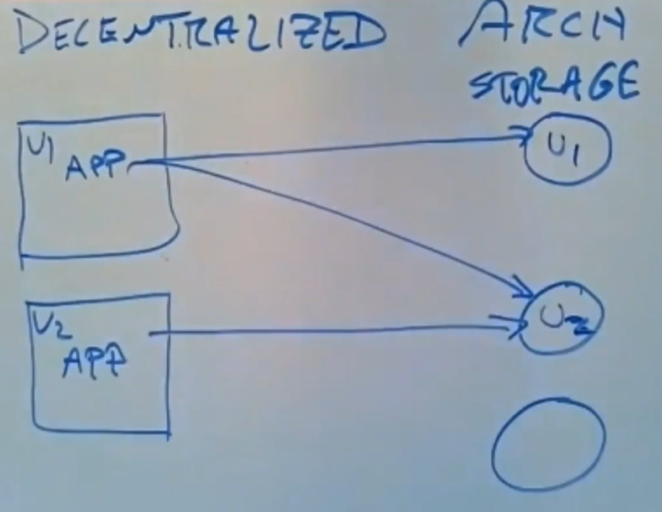
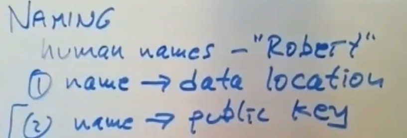
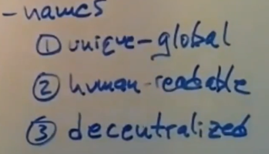
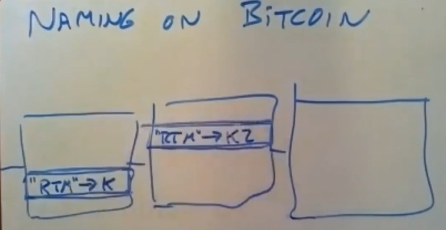
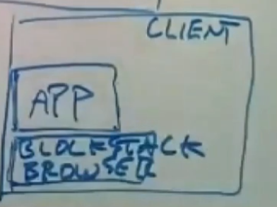

# Blockstack

blockstack是基于bitcoin的开发平台，允许开发人员部署去中心化应用（Dapp）。

去中心化指用户的数据不由应用管理，而是由用户自己管理。

当前的Web应用保存所有的用户数据，而去中心化架构则是由用户在云端保存自己的加密后数据，应用运行在用户的设备上。

当应用访问用户数据时需要用户提供访问控制。

|Current Web|Decentralized Architecture|
|-|-|
|||

缺点是在改变数据访问权限时需要使用新的private key进行重新加密。

## Naming System

Naming System负责将name映射为用户元数据：
* 用户数据所在的位置（通常是云服务器的URL）。
* 用户公钥（即作为PKI）。

对于一个Name来说，它不可能同时具有以下特性（Name的不可能三角）：
* 唯一。
* 人类可读。
* 去中心化分配。

*NOTE：如果Name唯一且人类可读就需要中心化机构分配。*

*NOTE：如果Name唯一且去中心化，那么它无法做到人类可读（通常只能分配一些密码学的元素来作为name）。*

*NOTE：如果Name人类可读且去中心化，那么它无法唯一分配。*

blockstack选择人类可读且去中心化，同时使用区块链去解决重复问题，规则十分简单只承认先在链上遇到的名字。

同时必须建立name的快照，否则将产生性能问题。

*NOTE：快照服务器的宕机也需要较长的时间。*

实际上blockstack不直接使用block chain存储这些元数据（只存储public key），而是使用称为ATLAS的中间层。

## Client

Client运行blockstack broswer，只有该应用需要用户的private key。

broswer负责向其他Dapp提供服务，其他app要获得数据必须先向broswer申请。

*NOTE：实际上更复杂，blockstack broswer使用多个private keys而不是直接使用user private key。*