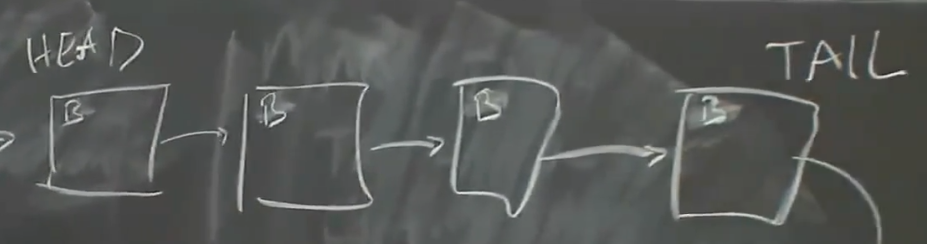
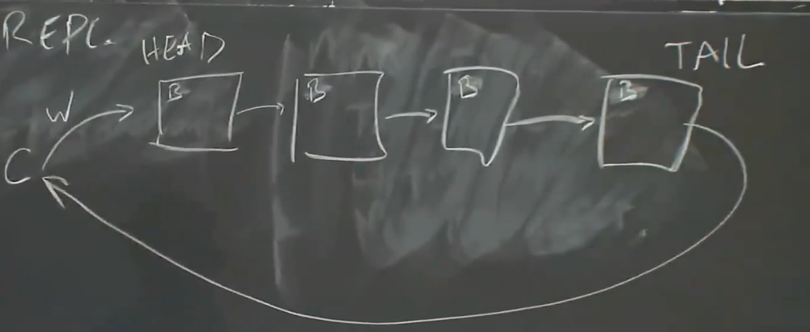

# CRAQ

CRAQ是对链式复制（chain replication）的优化。

## Chain Replication

Chain Replication的设计能使Client从任意一个replica读取的同时保留强一致性，它使用不同与Raft与zookeeper的链式拓扑。

在这种拓扑中，每个机器像链一样彼此连接。

头部的机器称为`HEAD`，尾部称为`TAIL`。

当进行写入时，Client将请求发送给HEAD，HEAD执行后将请求传递给后继，然后由TAIL响应Client。

当进行读取时，Client只需要从TAIL中读取。

这种设计的HEAD负担小，但需要所有节点完成写入操作，如果某个节点出现了暂时的减速就会拖累整条链。

而Raft只需要大多数节点响应。

## Fail Tolerance

当HEAD崩溃时，它的后继将接手工作，当TAIL崩溃时，它的前驱将接手工作。

当介于HEAD和TAIL的节点崩溃时，只是简单地将它从链中移除，并且被移除节点的前驱需要将请求重发给它的新的后继。

然而这种拓扑没有分区容忍的能力，因此依赖于外部服务（外部配置管理器）决定链上的哪些节点是有效的。

同时配置管理器判断一个节点是否在链中的条件应该基于：
* 节点能与配置管理器通讯。
* 节点能与它的前驱和后继通讯。