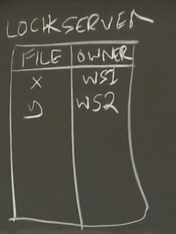

# Cache Consistency

## Frangipani Style Cache

Frangipani是一个早期的分布式文件系统。它将多台机器上的磁盘集合管理为一个共享存储池。假定这些机器处于共同的管理之下，并且能够安全地通信，它是为小团体共享文件设计的。

Frangipani分为两层：
* 一层是在kernel中的Frangipani模块（类似fuse），扮演了Client。
* 一层是Petal，这是一个分布式块存储系统（称为虚拟磁盘）。

Client会将block的副本存储在本地作为缓存，以减低文件操作的时延。

同时Frangipani使用Write-Back Caching（写回缓存），block在被修改后不会立即被写入到Petal，只有当必要时才被写入Petal，这使得文件操作能够非常快速地完成。

然而Frangipani被期望具有强一致性（多个Client之间缓存一致性的需要），Frangipani使用了一种复制的锁机制实现了这点，同时系统被期望能够进行单个原子性的文件操作。

### Cache Coherence Protocol

Frangipani的缓存一致性是通过锁实现的，在Frangipani中有一种lock server。

每一个lock server都存储了一张表，表的每一项记录了文件的`inode number`，锁的owner。

*NOTE： 实际上Frangipani支持更复杂的锁方案（例如读写锁），所有这里的表项并不全面。*

同时每个Client必须跟踪它拥有的锁，所以它也有一张类似的表。

当Client要去读取文件或目录时：
* 先向lock server请求对应的锁。
* 询问petal获得文件对应的block。
* 将锁记录在自己的表中。

Client表中的锁有两种状态：
* BUSY - 某个系统调用正在使用锁。
* IDLE - 锁空闲（这并不意味着锁已经归还）。

*NOTE：只有Client拥有锁，才允许被缓存对应的数据（操作数据之前必须先获得锁）。*

对于一个获取锁的请求，lock server将进行以下处理：
* 如果锁没有被持有直接返回。
* 如果锁被其他人持有，lock server向其发生一个`REVOKE`消息，要求他释放锁。

当一个Client收到`REVOKE`时：
* 如果锁的状态是BUSY，先等待操作完成。
* 如果数据是脏的，先将数据写入到petal。
* 释放锁。

*NOTE：除了通过`REVOKE`释放锁会导致写入之外，Client每30秒将数据写入一层petal，防止因Client崩溃导致数据丢失（只损失30秒的数据是可以接受的）。*

### Transaction

为了保证多步操作（petal是个模拟磁盘的块存储）的原子性，Frangipani使用锁构建了事务系统。

在操作开始前，Frangipani会获得操作所需要的所有的锁，然后再进行操作（类似SS2PL）。

### Crash With Locks

Client可能在进行复杂操作时崩溃，而部分数据可能已经被写入到了petal。

Frangipani使用WAL（write ahead logging）实现崩溃恢复。

*NOTE： Frangipani的logging没有commit，需要原子性的操作必须聚合成一个entry。*

Client在开始操作之前，先往petal写入log entries，只有当所有log entries顺利持久化之后才会将数据写入到petal。

在Frangipani中，不同Client之间的log是分开的，并且这些logs存放在petal上。

每个log entry包含：
* 一个序列号（LSN）。
* 写入的block的id。
* 版本号。
* 要写入的数据。

log entries一开始存储在Client上，只有Client需要释放锁时（包含收到`REVOKE`和经过30秒），才会将log entries写入到petal。

当lock server向Client发生`REVOKE`，而Client超过一段时间没有任何回复（没有释放也没有heartbeat），lock server判定Client崩溃，当Client持有锁时崩溃：
* lock server寻找一个存活的Client。
* 该Client读取崩溃Client的日志并进行replay。
* 完成后向lock server报告。
* lock server释放锁。

每一个log entry都带有一个版本号标记block的新版本，只有当block的版本小于这个值时，才会执行redo。

*NOTE：这在释放多个锁时崩溃的情况下十分常见。*

进行恢复Client并不需要获得锁：
* 当只持有一个或多个锁的Client崩溃时，恢复Client总是进行独占访问。
* 当持有多个锁的Client崩溃并且崩溃的Client已经释放了一部分锁时，Client只需要redo它未释放锁的log entries（因为已经释放的锁的block的version会大于log entry中的值所以不会redo）。

## Facebook Memcached Style Cache

