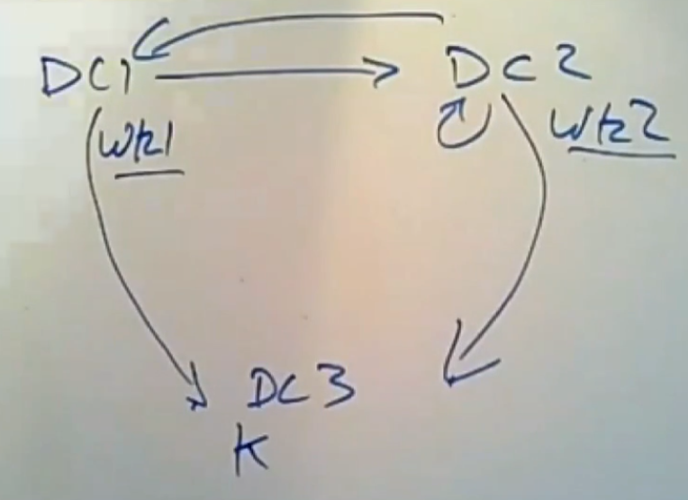
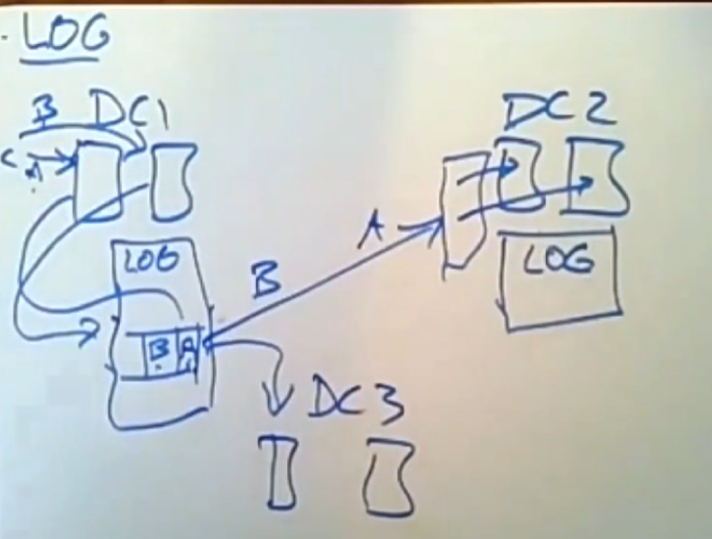
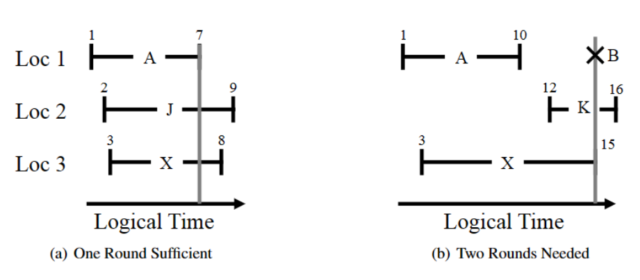
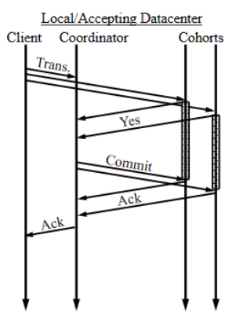
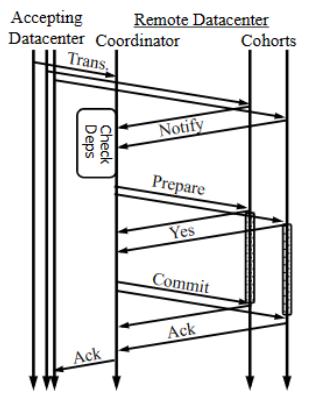

# Causal Consistency

理想的数据存储将提供线性化——有时非正式地称为强一致性——操作似乎在调用和完成操作之间的一个时间
点上对整个系统生效。

几种形式的强一致性，如线性化、可串行化和顺序一致性已被证明与低延迟不兼容——低延迟定义为所有操作的延迟都小于副本之间最大光速延迟的一半。

线性化（lineariazability）很容易证明是不兼容的：它要求对亚洲数据中心的写入立即反映在对美国数据中心的读取中。要实现此属性，写入必须在返回之前传播到美国站点，或者读取必须在返回之前查询亚洲（以获取最新值）。这两种方法都不符合低延迟的目标。

## The Problem Of Eventual Consistency

最终一致性（eventual consistency）的普遍认可定义是，对一个副本的写入最终会出现在其他副本上，并且如果所有副本都收到了相同的一组写入，那么它们将对所有数据具有相同的值。这种弱形式的一致性不会以任何方式限制不同键上的操作顺序，这意味着最终一致性系统会以任何顺序异步复制（asynchronous replicate）到异地数据中心，迫使程序员推理所有可能的顺序并向用户暴露许多不一致之处。

例如，在最终一致性下，Alice 更新她的个人资料后，她可能在刷新后看不到该更新。或者，如果 Alice 和 Bob 在博客文章上来回评论，Carol 可能会看到该对话的随机非连续子集。


考虑另一个示例，其中用户将照片上传到 Internet 服务，然后将该照片添加到相册。在在每键顺序和最终一致性下，添加到相册的操作有可能出现在照片之前。

## ALPS System

提供了可用性、低延迟、分区容错度和高可扩展性的系统称为 ALPS System。

理想ALPS系统应具有的属性包括：

*  **可用性。** 发给数据存储的所有操作都成功完成。任何操作都不能无限期地阻塞或返回一个表示数据不可用的错误。
*  **低延迟。** 客户端操作“快速”完成。商业服务级别目标建议平均性能为几毫秒，最坏情况性能（即第 99.9个百分位数）为 10 或 100 毫秒。
* **分区容错。** 数据存储继续在网络分区下运行，例如，将亚洲的数据中心与美国分开。数据中心的故障相当于它与系统的其余部分分区，因此分区容错系统在数据中心故障期间也继续运行。
* **高可扩展性。** 数据存储的扩展是线性的。在系统中增加N个资源，总的吞吐量和存储容量就会增加N倍。
* **更强的一致性。** 数据存储提供比最终一致性更强的一致性。

## Causal Consistency & Causal+ Consistency

因果一致性（Causal Consistency）要求在副本上的读取操作返回的值与因果顺序一致。

写一个值的操作必须出现在所有在它之前的因果操作之后。

同时因果一致性不会对并发操作进行排序，如果两个写入之间没有因果顺序，那么两个值的写入是并发的，如果两个写入都写入同一个键，那么它们就会发生冲突。

冲突是不可取的，因为冲突允许replicas永远分歧。

因果+一致性（Causal+ Consistency）介于顺序一致性和因果一致性之间，它比顺序一致性弱，但顺序一致性在 ALPS 系统中无法实现，比因果一致性和每个键的顺序一致性更强，并且对于 ALPS 系统是可以实现的。

因果+一致是两个属性的组合：
* 因果一致性。
* 收敛冲突处理。

收敛冲突处理要求使用处理函数 `h` 以相同方式在所有副本上处理所有冲突写入。这个处理函数 `h` 必须是可交换的，以便副本可以按照它们接收的顺序处理冲突的写入，并且这些处理的结果将收敛（例如，一个副本的`h(a, h(b, c))`和另一个副本的`h(c, h(b, a))`一致）。



*NOTE：收敛方式处理冲突写入的一种常见方法是最后写入获胜（Last Write Win，LWW）规则（也称为 Thomas 写入规则）。*

在使用LWW时，通常使用Lamport Clocks（`max(wall clock,max version + 1)`），获取唯一的时钟。

## COPS

COPS 的设计假设每个数据中心内都有一个底层的、可靠的、线性化的数据存储。

在 COPS 中，系统存储每个键的最新时间戳和值，每个版本由 `<timestamp, value, deps> `组成，`deps` 字段是版本的零个或多个依赖项的列表；每个依赖
项都是一个 `<key, timestamp>` 对。

COPS 中存储的每一个键都存储在一个逻辑服务器（server）中。我们将跨所有集群的一个键的服务器的集合称为该键的等效服务器。

在本地完成写入后，服务器将其放入复制队列中，并从该队列异步发送到远程等效服务器。这些节点反过来等待，直到该值的依赖关系在其本地集群中得到满足，然后才在本地提交该值。这种依赖性检查机制确保了写入的顺序是因果一致的，而读取也不会阻塞。

## COPS-RT

COPS-RT是对COPS的改进，它提供了只读事务来增强COPS。

COPS-RT 中的读取事务确保返回值集是因果+一致的（满足所有依赖关系），提出一种`read_trans`算法来执行只读事务，该算法最多进行两轮本地`read_by_time`操作。

在第一轮中，库向本地集群发出 `n` 个并发的`read_by_time` 操作，客户端在读取事务中列出的每个键都有一个。

每个`read_by_time`操作都会返回一个 `〈value, timestamp, deps〉` 元组，其中 `deps` 是一个键和时间戳的列表。

然后，客户端库检查每个依赖项`<key, timestamp>`。如果客户端没有请求依赖的键，或者如果请求了，但它检索到的时间戳 ≥ 依赖项中的时间戳，那么该结果的因果依赖关系得到满足。

*NOTE：如果不满足，说明在一个事务中，前面读取的key是过期的（因为依赖它更新的版本的写入被应用），因此需要重新读一次。*

对于所有不满足的键，库会发出第二轮并发的`read_by_time`操作。请求的时间戳将是第一轮的任何依赖列表中看到的最新时间戳。这些时间戳满足第一轮的所有因果依赖，因为它们≥所需的时间戳。

```python
# @param keys list of keys
# @param ctx_id context id
# @return values list of values
function get_trans(keys, ctx_id):
    # Get keys in parallel (first round)
    for k in keys
        results[k] = get_by_version(k, LATEST)
    # Calculate causally correct versions (ccv)
    for k in keys
        ccv[k] = max(ccv[k], results[k].vers)
        for dep in results[k].deps
            if dep.key in keys
                ccv[dep.key] = max(ccv[dep.key], dep.vers)
    # Get needed ccvs in parallel (second round)
    for k in keys
        if ccv[k] > results[k].vers
            results[k] = get_by_version(k, ccv[k])
    # Update the metadata stored in the context
    update_context(results, ctx_id)
    # Return only the values to the client
    return extract_values(results)
```

## Eiger

Eiger使用列簇模型，并且提供只读事务和只写事务。

### Read Only Transaction

客户端可以使用 `multiget_slice`操作读取多个键的多个列。客户端提供一个元组列表，每个元组都涉及一个键、一个列族名称和一个可选的超级列名称，以及一个切片谓词（ slice predicate）。切片谓词可以是`(start,stop,count)` 三元组，它匹配名称在 `start` 和 `stop` 之间的第一个 `count` 列。名称可以是任何可比较的类型，例如字符串或整数。或者，谓词也可以是列名的列表。在任何一种情况下，切片（slice）都是给定键的存储列的子集。

Eiger 的只读事务算法保证低延迟，因为它在本地数据中心最多需要两轮并行非阻塞读取，并且只在并发写入事务期间最多需要额外一轮本地非阻塞检查。与 COPS-RT 中的只读事务相比，Eiger 算法基于逻辑时间，不使用依赖图。

该算法的关键是每个逻辑时间的每个查询都存在一致的结果。

每个数据位置都标有最早的有效时间 (`EVT`)。 `EVT` 被设置为服务器在本地应用（applies）写入值的操作时的逻辑时间。因此，在操作的接受数据中心（操作起源的数据中心）中，`EVT` 与其时间戳相同。在其他数据中心，`EVT`比其时间戳晚。在这两种情况下，`EVT`都是该值在本地数据中心变得可见的确切逻辑时间。



服务器以其当前可见值、相应的 `EVT` 及其当前逻辑时间（称之为最新有效时间 (`LVT`)）响应读取请求。因为这个值仍然可见，所以它至少在`EVT`和`LVT`之间的时间间隔内是有效的。一旦所有的第一轮读取返回，客户端库会比较它们的时间，以检查一致性。特别是，如果最大的 `EVT` ≤ 最小的 `LVT`，它就知道所有的值都在同一逻辑时间有效（即对应于一个一致的快照）。换句话说，如果至少有一个逻辑时间在每个返回值的`EVT`和`LVT`之间，那么结果就是一致的。如果是这种情况，客户端库将返回这些结果；否则，进入第二轮。



如果不存在第一轮中读取的所有值都有效的单个逻辑时间，则读取事务需要第二轮。只有在本地将并发更新应用到请求的位置时，才会发生这种情况。客户端库发出 `multiget_slice_by_time` 请求，指定在事务有效时间读取。这些读取仅发送到没有有效结果的那些位置，即它们的 `LVT` 早于有效时间。

服务器用在请求的逻辑时间有效的值来响应`multiget_slice_by_time`读取操作。由于该结果可能与当前可见的结果不同，服务器有时必须为每个位置存储旧值。幸运的是，这种额外存储的范围可以被大大限制。

```python
function read_only_trans(requests):
    # Send first round requests in parallel
    for r in requests
        val[r] = multiget_slice(r)
    # Calculate the maximum EVT
    maxEVT = 0
    for r in requests
        maxEVT = max(maxEVT, val[r].EVT)
    # Calculate effective time
    EffT = ∞
    for r in requests
        if val[r].LVT ≥ maxEVT  
            EffT = min(EffT, val[r].LVT)
    # Send second round requests in parallel
    for r in requests
        if val[r].LVT < EffT
            val[r] = multiget_slice_by_time(r, EffT)
    # Return only the requested data
    return extract_keys_to_columns(res)
```

Eiger通过两种方式限制旧值的存储：
* 首先，读事务有一个超时，规定了其最大的实时持续时间。如果这个超时发生（仅当服务器队列由于长时间过载而病态地增长时才会发生），客户端库将重新启动一个新的读取事务。因此，服务器只需要存储在此超时持续时间内被覆盖的旧值。
* 第二，Eiger只保留在第二轮中可能被请求的旧值。因此，服务器只存储在超时时间内比第一轮返回的值更新的值。对于这种优化，Eiger存储每个值的最后访问时间。

### Write Only Transaction

Eiger 的只写事务允许客户端以原子方式写入分布在本地数据中心许多键上的许多列。这些值也会在复制时自动出现在远程数据中心。

为了执行一个`atomic_mutate`请求——它具有与`batch_mutate`相同的参数——客户端库将操作拆分为每个本地服务器的一个子请求，事务分布在该本地服务器上。库在事务中随机选择一个键作为协调者键。然后它将每个子请求传输到其相应的服务器，并用协调器键进行协调。

Eiger的写入事务是两阶段提交的变体，称为具有正Cohort和间接的两阶段提交 (2PC-PCI)。2PC-
PCI 的运行方式不同，具体取决于它是在原始（或“接受”）数据中心中执行，还是在复制后应用于远程数据中
心。




传统的2PC和2PC-PCI有3个区别：
* 首先，2PC-PCI 只有正Cohort；一旦收到所有Cohort的投票，协调器总是提交事务。
* 其次，2PC-PCI 有一个不同的预投票阶段，该阶段根据写入事务的来源而变化。在接受数据中心，客户端库直接向每个参与者发送其子请求，并且此传输充当每个Cohort的隐式 `PREPARE` 消息。
* 第三，无法回答查询的 2PC-PCI Cohort（因为它们已经投票但尚未收到提交消息）询问协调器事务是否已提交，通过协调器有效地间接响应请求。

对于只写事务：
* 当参与者服务器（协调器或Cohort）从客户端接收到其事务子请求时，它通过为每个包含的位置写入一个特殊
的“待定”值（保留旧版本以进行第二轮读取）来准备事务。然后它向协调器发送 `YESVOTE`。
* 当协调器收到 `YESVOTE` 时，它会更新准备好的键的数量。准备好所有键后，协调器将提交事务。协调器的当前
逻辑时间作为事务的（全局）时间戳和（本地）`EVT`，包含在 `COMMIT` 消息中。
* 当Cohort收到 `COMMIT` 时，它会用更新的实际值替换“待定”列，并确认已提交的键。收到所有 `ACK` 后，协调器
安全地清理其事务状态。



每个事务子请求都被复制到远程数据中心中的“等效”参与者。当远程数据中心中的队列接收到子请求时，它会向其数据中心中的事务协调器发送带有键计数的通知。该协调器在收到自己的子请求（包含协调器键）后发起任何必要的 `dep_check`。协调器的检查覆盖整个事务，所以Cohort不必发起检查。一旦协调器收到所有`NOTIFY`消息和 `dep_check`响应，它就会向每个Cohort发送一个 `PREPARE`，然后正常进行。

