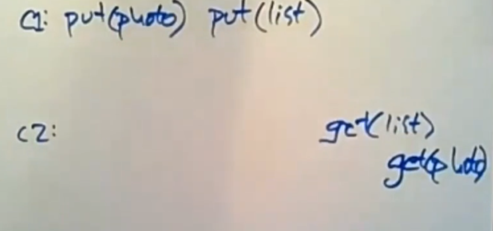

# Causal Consistency

理想的数据存储将提供线性化——有时非正式地称为强一致性——操作似乎在调用和完成操作之间的一个时间
点上对整个系统生效。

几种形式的强一致性，如线性化、可串行化和顺序一致性已被证明与低延迟不兼容——低延迟定义为所有操作的延迟都小于副本之间最大光速延迟的一半。

线性化（lineariazability）很容易证明是不兼容的：它要求对亚洲数据中心的写入立即反映在对美国数据中心的读取中。要实现此属性，写入必须在返回之前传播到美国站点，或者读取必须在返回之前查询亚洲（以获取最新值）。这两种方法都不符合低延迟的目标。

## The Problem Of Eventual Consistency

最终一致性（eventual consistency）的普遍认可定义是，对一个副本的写入最终会出现在其他副本上，并且如果所有副本都收到了相同的一组写入，那么它们将对所有数据具有相同的值。这种弱形式的一致性不会以任何方式限制不同键上的操作顺序，这意味着最终一致性系统会以任何顺序异步复制（asynchronous replicate）到异地数据中心，迫使程序员推理所有可能的顺序并向用户暴露许多不一致之处。

例如，在最终一致性下，Alice 更新她的个人资料后，她可能在刷新后看不到该更新。或者，如果 Alice 和 Bob 在博客文章上来回评论，Carol 可能会看到该对话的随机非连续子集。

考虑另一个示例，其中用户将照片上传到 Internet 服务，然后将该照片添加到相册。在在每键顺序和最终一致性下，添加到相册的操作有可能出现在照片之前。

## ALPS System

提供了可用性、低延迟、分区容错度和高可扩展性的系统称为 ALPS System。

理想ALPS系统应具有的属性包括：

*  **可用性。** 发给数据存储的所有操作都成功完成。任何操作都不能无限期地阻塞或返回一个表示数据不可用的错误。
*  **低延迟。** 客户端操作“快速”完成。商业服务级别目标建议平均性能为几毫秒，最坏情况性能（即第 99.9个百分位数）为 10 或 100 毫秒。
* **分区容错。** 数据存储继续在网络分区下运行，例如，将亚洲的数据中心与美国分开。数据中心的故障相当于它与系统的其余部分分区，因此分区容错系统在数据中心故障期间也继续运行。
* **高可扩展性。** 数据存储的扩展是线性的。在系统中增加N个资源，总的吞吐量和存储容量就会增加N倍。
* **更强的一致性。** 数据存储提供比最终一致性更强的一致性。

## Causal Consistency & Causal+ Consistency

因果一致性（Causal Consistency）要求在副本上的读取操作返回的值与因果顺序一致。

写一个值的操作必须出现在所有在它之前的因果操作之后。

同时因果一致性不会对并发操作进行排序，如果两个写入之间没有因果顺序，那么两个值的写入是并发的，如果两个写入都写入同一个键，那么它们就会发生冲突。

冲突是不可取的，因为冲突允许replicas永远分歧。

因果+一致性（Causal+ Consistency）介于顺序一致性和因果一致性之间，它比顺序一致性弱，但顺序一致性在 ALPS 系统中无法实现，比因果一致性和每个键的顺序一致性更强，并且对于 ALPS 系统是可以实现的。

因果+一致是两个属性的组合：
* 因果一致性。
* 收敛冲突处理。

收敛冲突处理要求使用处理函数 `h` 以相同方式在所有副本上处理所有冲突写入。这个处理函数 `h` 必须是可交换的，以便副本可以按照它们接收的顺序处理冲突的写入，并且这些处理的结果将收敛（例如，一个副本的`h(a, h(b, c))`和另一个副本的`h(c, h(b, a))`一致）。

*NOTE：收敛方式处理冲突写入的一种常见方法是最后写入获胜（Last Write Win，LWW）规则（也称为 Thomas 写入规则）。*

## COPS

## COPS-RT

## Eiger
