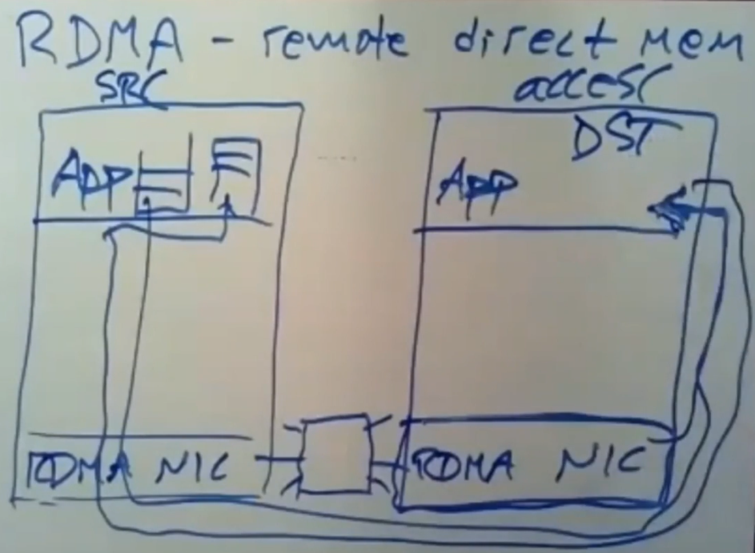

# Distributed Transactions

将数据分片到多个不同的机器是非常常见的行为，这样就能减低每个机器处理和存储容量上的压力，提高可扩展性。

分布式事务能够很好地隐藏分片存储的复杂度，使得系统对外表现如同没有进行分片。

*NOTE：只在一个机器（进程）上进行的事务不是分布式事务，是“单机事务”。*

### Concurrency Control

对于并发控制来说，总共有两种方案：
* 悲观并发控制。
* 乐观并发控制。

## Two-Phase Commit

原子提交协议（atomic commit protocol）判断每一个分片是否都能提交事务，保证事务提交的原子性。

二阶段提交（Two-Phase Commit，2PC）分为两个阶段：
* Prepare
* Commit

有一个节点对事务进行协调，称为事务协调者（coordinator）或者master，其他节点称为参与者（participants）、cohort或者 worker。


*NOTE：协调者也可以作为参与者。*

每一个事务都有一个事务id（transaction id，TID），协调者在开启事务之前，将分配一个唯一的事务id给事务。

### Prepare Phase

协调者在Prepare阶段将属于每一个分片的请求发送给每一个分片：
* 对于读请求，分片立即执行，并返回结果。
* 对于写请求，分片将持久化该请求。

然后向每一个分片发送`PREPARE`消息：
* 如果参与者能够执行先前协调者发送来的全部请求，回复`YES`。
* 否则，回复`NO`。

*NOTE：这是为了确保参与者确实有执行写操作的能力。*


协调者等待每一个参与者的回复，然后进入Commit阶段。

### Commit Phase

如果每一个参与者都回复`YES`，那么协调者将提交事务：
* 向每一个参与者发送`COMMIT`消息。
* 参与者收到之后将提交事务，并释放事务占用的资源（例如锁）。
* 然后向协调者回复`ACK`。


否则，协调者终止事务：
* 向每一个参与者发送`ABORT`消息。
* 参与者收到之后将终止事务，并释放事务占用的资源（例如锁）。
* 然后向协调者回复`ACK`。

最后协调者将向客户端返回事务执行的结果。


### Fault Tolerance

当参与者故障并重启：
* 如果未对`PREPARE`回复`YES`，则放弃事务。
* 如果已经对`PREPARE`回复`YES`，则不能放弃事务（所以必须先持久化请求和`PREPARE`消息的响应再发送响应），并等待来自协调者的响应（可能需要主动发起请求询问，因为可能已经收到过协调者对事务的`COMMIT`消息但丢失了）。


当协调者故障并重启：
* 如果事务未达到`COMMIT`阶段，则中止事务。
* 如果已经发送`COMMIT`但没有收到所有`ACK`的事务不能被丢弃，协调者必须重新发送`COMMIT`响应直到收到所有`ACK`。
* 如果已经发送`ABORT`但没有收到所有`ACK`的事务不能被丢弃，协调者必须重新发送`ABORT`响应直到收到所有`ACK`。

*NOTE：`COMMIT`和`ABORT`都存在多轮的重发。*

*NOTE：在决定事务`COMMIT`还是`ABORT`之前，协调者必须持久化事务。*


当协调者遇到参与者崩溃时或消息丢失时：
* 如果`PREPARE`无响应，则重发`PREPARE`，直到获得响应（或者简单地中止事务）。
* 如果`COMMIT`或`ABORT`无响应，**协调者必须等待直到获得所有响应**。

*NOTE：当协调者得到他不知道的事务的`PREPARE`响应时，发送`ABORT`给发送该响应的参与者。*

当参与者遇到协调者崩溃或消息丢失时：
* 如果未对`PREPARE`回复`YES`，则放弃事务。
* 如果已经对`PREPARE`回复`YES`，**则必须等待直到遇到`COMMIT`或者`ABORT`**。


*NOTE：当参与者得到他不知道的事务的`PREPARE`消息时，回复`NO`。*

对事务的协调者和参与者进行复制可以减少故障的产生，增强性能。


## Percolator Style Transaction

BigTable是Google构造的分片多版本（multi-version）列族数据库，但只支持单行事务。

Google后续开发了Percolator，增加通用事务的处理能力。

Bigtable 为用户呈现一个多维排序的映射：`键` -> `（行，列，时间戳）`元组称为 cell。 Bigtable 在每一行上提供查找和 更新操作，而 Bigtable 行事务可以对单个行进行原子读 - 修改 - 写操作。

一个运行中的 Bigtable 包含一批 tablet 服务器，每个负责服务多个 tablet（key 空间内连续的域）。一个master 负责协调控制各 tablet 服务器的操作，比如指示它们装载或卸载 tablet。

Percolator 充分利用了 Bigtable 的接口：数据被组织到 Bigtable 行和列中， Percolator 会将元数据存储在旁边特殊的列中。

### Transaction Timestamp

Google Oracle 是一个用严格的单调增序给外界分配时间戳的服务器。

*NOTE：因为每个事务都需 要调用 oracle 两次，这个服务必须有很好的可伸缩性。*

oracle 会定期分配出一个时间戳范围，通过将范围中的最大值写入稳定的存储；范围确定后，oracle 能在内存中原子递增来快速分配时间戳，查询时也不涉及磁盘 I/O。

如果 oracle 重启， 将以稳定存储中的上次范围的最大值作为开始值（此值之前可能有已经分配的和未分配的，但是之后的值肯定是未分配的，所以即使故障或重启也不会导致分配重复的时间戳，保证单调递增）。

事务开始时分配一个时间戳（`start_ts`），同时在事务提交时，还会创建一个提交时间戳。

### Concurrency Control & Transaction Commit

Percolator使用2PL和快照隔离，锁是一个特殊的列。

Percolator 中的任何节点都可以发出请求，直接修改 Bigtable 中的状 态：没有太好的办法来拦截并分配锁。所以，Percolator 一定要明确的维护锁。 锁必须持久化以防机器故障；如果一个锁在两阶段提交之间消失，系统可能错误 的提交两个会冲突的事务。

在 Commit 的第一阶段(“预写”，prewrite)，尝试锁住所有被写的 cell。（为了处理客户端失败的情况，指派一个任意锁为“primary”)。事务在每个被写的 cell 上读取元数据来检查冲突。

*NOTE：实际使用中需要对锁定进行排序以避免deadlock，因此primary应当是某个顺序的第一个或者最后一个写入。*

有两种冲突场景：
* 如果事务在它的开始时间戳之后看见另一个写记录，它会取消，这是“写-写”冲突。
*  如果事务在任意时间戳看见另一个锁，它也取消：如果看到的锁在开始时间戳之前，可能提交的事务已经提交了却因为某种原因推迟了锁的释放，但是这种情况可能性不大，保险起见所以取消。

如果没有冲突，则将锁和数据写到各自 cell 的开始时间戳下，事务可以提交并执行到第二阶段。

在第二阶段的开始， 客户端从 oracle 获取提交时间戳。然后，在每个 cell（从“primary”开始），客户端释放它的锁，替换锁为一个写记录以让其他读事务知晓。读过程中看到写记录就可以确定它所在时间戳下的新数据已经完成了提交，并可以用它的时间戳作为“指针”找到提交的真实数据。一旦“primary”的写记录可见了， 其他读事务就会知晓新数据已写入，所以事务必须提交。

一个 `Get()`操作第一步是在时间戳范围 `[0,开始时间戳]`（是右开区间）内检查有没有锁，这个范围是在此次事务快照所有可见的时间戳。如果看到一个锁，表示另一个事务在并发的写这个 cell，所以读事务必须等待直到此锁释放。如果没有锁出现，`Get()`操作在时间戳范围内读取最近的写记录然后返回它的时间戳对应的数据项。

事务协议使用严格增长的时间戳来保证 `Get()`能够返回所有在“开始时间戳”之前已提交的写操作。

举个例子，考虑一个事务 `R` 在时间戳 `T(R)`执行读取操作，一个写事务 `W` 在**提交时间戳** `T(W) < T(R)`执行了提交：
* 由于 `T(W) < T(R)`，可知 oracle 肯定是在 `T(R)`之前或相同的批处理中给出 `T(W)`。
* 因此，`W` 是在 `R` 收到 `T(R)`之前请求 了 `T(W)`作为提交时间戳。
* `R` 在收到 `T(R)`之前不能执行读取操作，而 `W` 在它的提交时间戳 `T(W)`之前必定完成了锁的写入。
* 上面的推理保证了 `W` 在 `R` 做任何读之前就写入了它所有的锁。
* `R` 的 `Get()`要么看到已经完全提交的写记录，要么看到锁，在看到锁时 `R` 将阻塞直到锁被释放（锁被替换为写记录）。

`Get()`要么看到已经完全提交的写记录，要么看到锁，在看到锁时 R 将阻塞直到锁被释放（锁被替换为写记录）。

*NOTE：`Get()` 表面上是无锁的，实际上存在读写锁。*

### Fail Tolerance

由于客户端随时可能故障，导致了事务处理的复杂度（Bigtable 可保证 tablet 服 务器故障不影响系统，因为Bigtable 确保写锁持久存在）。如果一个客户端在一个事务被提交时发生故障，锁将被遗弃。Percolator 必须清理这些锁，否则他们将导致将来的事务被非预期的挂起。

Percolator 用一个懒惰的途径来实现清理：当一个事务 `A` 遭遇一个被事务 `B` 遗弃的锁，`A` 可以确定 `B` 遭遇故障，并清除它的锁。

Percolator 在每个 事务中会对任意的提交或者清理操作指定一个 cell 作为同步点。这个 cell 的锁被称之为“primary 锁”。`A` 和 `B` 在哪个锁是 primary 上达成一致（primary 锁的位置 被写入所有 cell 的锁中）。

清理或提交操作都需要修改 primary 锁；这 个修改操作会在一个 Bigtable 行事务之下执行，所以只有一个操作可以成功。

特别的，在 `B` 提交之前，它必须检查它依然拥有 primary 锁，提交时会将它替换为 一个写记录。在 `A` 删除 `B` 的锁之前，`A` 也必须检查 primary 锁来保证 `B` 没有提 交；如果 primary 锁依然存在它就能安全的删除 `B` 的锁。

如果一个客户端在第二阶段提交时崩溃，必须对这种事务执行前滚（roll-forward），因为某些lock已经成为了写记录。

可以通过检查 primary 锁来 区分这两种情况：
* 如果 primary 锁已被替换为一个写记录，写入此锁的事务则必须提交。
* 否则它应该被回滚（因为总是先提交 primary，所以如果 primary 没有提交，能肯定回滚是安全的）。

*NOTE：执行 roll forward 时，执行清理的事务也是将搁浅的锁替换为一个写记录。*

### Code

```cpp
class Transaction
{
    struct Write { Row row; Column: col; string value; };

    vector<Write> writes_;

    int start_ts_;

    Transaction() :start_ts_(orcle.GetTimestamp()) {}

    void Set(Write w) { writes_.push_back(w); }

    bool Get(Row row,Column c,string *value)
    {
        while(true)
        {
            bigtable::Txn = bigtable::StartRowTransaction(row);
            // Check for locks that signal concurrent writes.
            if(T.Read(row,c+"locks",[0,start_ts_]))
            {
                // There is a pending lock; try to clean it and wait
                BackoffAndMaybeCleanupLock(row,c);
                continue;
            }
        }
        // Find the latest write below our start_timestamp.
        latest_write = T.Read(row,c+"write",[0,start_ts_]);
        if(!latest_write.found()) return false; // no data
        int data_ts = latest_write.start_timestamp();
        *value = T.Read(row,c+"data",[data_ts,data_ts]);
        return true;
    }

    // prewrite tries to lock cell w, returning false in case of conflict.
    bool Prewrite(Write w,Write primary)
    {
        Column c = w.col;
        bigtable::Txn T = bigtable::StartRowTransaction(w.row);
        // abort on writes after our start stimestamp ...
        if(T.Read(w.row,c+"write",[start_ts_,max])) return false;
        // ... or locks at any timestamp.
        if(T.Read(w.row,c+"lock",[0,max])) return false;
        T.Write(w.row,c+"data",start_ts_,w.value);
        T.Write(w.row,c+"lock",start_ts_,
            {primary.row,primary.col}); // The primary's location.
        return T.Commit();
    }

    bool Commit()
    {
        Write primary = write_[0];
        vector<Write> secondaries(write_.begin() + 1,write_.end());
        if(!Prewrite(primary,primary)) return false;
        for(Write w : secondaries)
            if(!Prewrite(w,primary)) return false;
        int commit_ts = orcle.GetTimestamp();
        // Commit primary first.
        Write p = primary;
        bigtable::Txn T = bigtable::StartRowTransaction(p.row);
        if(!T.Read(p.row,p.col+"lock",[start_ts_,start_ts_]))
            return false; // aborted while working
        T.Write(p.row,p.col+"write",commit_ts,
            start_ts_); // Pointer to data written at start_ts_
        T.Erase(p.row,p.col+"lock",commit_ts);
        if(!T.Commit()) return false; // commit point
        // Second phase: write our write records for secondary cells.
        for(Write w : secondaries)
        {
            bigtable::write(w.row,w.col+"write",commit_ts,start_ts_);
            bigtable::Erase(w.row,w.col+"lock",commit_ts);
        }
        return true;
    }
}; // class Transaction
```

## Spanner Style Transaction

Google Spanner是Google的、可扩展的、多版本、全球分布式、同步复制数据库。

该系统提供了一个针对分布范围很广的分片数据的分布式事务。


Spanner在多个数据中心之间使用Paxos进行复制。

每一个分片都由一个Paxos管理，称为一个Paxos Group（Paxos组）。


每一个Paxos Group都可以并行地处理数据。

*NOTE：这种复制策略适合读多写少的环境。*

### Transaction Timestamp

Spanner为每一个事务分配一个时间戳：
* 只读事务的id是事务的开始时间戳。
* 读写事务和写事务的id是事务的提交时间戳。


不同于Percolator使用Oracle进行授时，Spanner假设时间是同步的，必须使用复杂的方式满足这一点。


Spanner在每一个数据中心安装GPS接收器，用于接收时间。

每一个安装GPS接收器的机器称为time master，spanner会同时向多个time master请求当前时间。

误差来源：
* GPS信号传播的误差，约为几纳秒。
* 与time master通讯的误差。

Spanner采用了一种TrueTime方案，当请求时间时返回的不是一个时间点而是一个区间`[earliest time,latest time]`。


spanner使用`latest time`，作为事务的时间戳。


对于一个读写事务，它必须等待`now()`的`earliest time`大于它所选择的时间戳才能提交。


即不会有新的事务在事务选择的`[earliest time,latest time]`区间之中，读写事务才可以提交。

*NOTE：保证外部一致性（external consistency），重排读写事务到区间的最后，使得系统内部的提交顺序与外部的提交顺序一致。*


### Read-Write Transaction

Spanner使用2PL和快照隔离。


读写事务的表现如同一个标准的2PC，但它是在复制系统上进行的。

Spanner将在事务设计到的分片中挑选一个协调者。

首先客户端需要读取数据，同时节点给数据上锁。


当进入Prepare阶段时，参与者的Prepare消息需要复制给其他副本。

|Prepare|
|-|
||
||
||

同样，协调者对事务的决定（COMMIT或者ABORT），也需要发送给其他副本。

|Commit|
|-|
||
||
||

### Read Only Transaction

在Spanner中，只读事务是无锁的，并且它非常快：
* 它在本地数据中心读取数据。
* 不需要锁和2PC。

Spanner同时存储数据的多个版本，每一个版本都存储写入它的事务的提交时间戳。

当只读事务发送读请求时，会同时发送事务的开始时间戳，只有小于等于该时间戳的版本能被返回。


PaxosGroup的Leader会向其Follower发送时间戳，只有当Follower收到的时间戳大于等于读请求的时间戳时，该replica才能响应读请求，否则请求将被推迟。

## FaRm Style Transaction

FaRm是一个研究型系统，针对所有replicas都在一个数据中心的workload，探索新的RDMA硬件的潜力。

在FaRm的数据中心中，存在一个配置管理器，每个分片使用Primary-backup Replication，配置管理器负责决定哪个节点是primary。


*NOTE：在FaRm中客户端是事务的发起者和协调者。*

为了提高性能：
* FaRm使用分片。
* FaRm将所有数据保存在RAM中。
* FaRm利用UPX作为NVRAM方案。
* FaRm使用RDMA，在不引发远程主机中断的情况访问远程主机的内存。
* FaRm利用kernel bypass直接访问NIC。

### NVRAM Scheme Of FaRm

FaRm在每一个机架上放置一个备用电池，当主电源故障（断电），就启用备用电源，这个电源大致能够支撑10分钟。

当电源系统发现主电源出现故障，就会向所有机器发出消息。

接收到消息的节点立刻停止所有的工作，将数据写入持久存储设备（例如磁盘），然后关闭机器。

### Kernel Bypass & RDMA

在传统架构中，使用RPC需要经过多个内核调用。


Kernel Bypass（内核旁路）允许kernel定义一套配置，然后允许应用绕过内核直接访问NIC，缺点是应用必须自己处理网络栈。


*NOTE：只有现代NIC硬件支持。*

RDMA(Remote Direct Memory Access，远程直接内存访问)，允许应用使用特殊的包直接读写对端内存空间中的内存（RDMA能够识别page table），而不会引起对端CPU的中断（不消耗CPU时间）。



*NOTE：只对外提供读写的RDMA称为one-sided RDMA。*

实际上FaRm不但使用RDMA读内存（FaRm不会直接进行写，除非是RPC操作），还使用它来发送RPC（直接写入对端的RPC缓冲区）。

*NOTE:不直接进行写的原因是需要支持事务。*

### Concurrency Control & Atomic Commit


FaRm使用乐观并发控制和可串行化。

FaRm事务API：
* `txCreate()` - 创建事务。
* `txRead(oid)` - 读取指定object id的对象。
* `txWrite(oid,data)` - 写入数据到指定object id的对象（写入只缓存在本地）。
* `txCommit()` - 提交事务（将缓存的写入发送给服务器）。


OCC分为执行阶段（execute phase）和提交阶段（commit phase）。

在执行阶段，Client使用RDMA从其他机器上读取数据。

*NOTE：在FaRm中，Client是事务的协调器。*


当事务的所有操作完成则进入提交阶段，提交阶段由几个子阶段组成：
* Lock。
* Validate。
* Commit Backup。
* Commit Primary。

Lock阶段：
1. Client向事务的参与者发送object id，版本号和object的新值。
2. 参与者将使用log记录这些值。
3. 如果当前的object已经被锁定，返回`NO`。
4. 如果当前的object的版本号与请求中的不一致，返回`NO`。
5. 对object加锁，返回`YES`。


*NOTE：在FaRm中，`3`和`4`实际上是同时执行的，RDMA使用原子指令同时检查版本号和lock（lock和version number保存在同一个整型字段`header`内），并且设置lock。*

*NOTE：只有被写入的object参与lock阶段。*

当所有参与者的响应都是`YES`时，进入Validate阶段：
1. 查看之前的查看之前读取的其他object是否被锁定，如果未被锁定则继续。
2. 查看之前读取的其他object的版本号与事务开始时是否一致，如果一致则继续。

*NOTE：同样，在FaRm中`1`和`2`同时进行。*

然后进入Commit Backup阶段，Client将写入发送给参与者的backup（确保在参与者故障后事务还能继续）。

最后进入Commit Primary阶段：
* Client向所有的参与者发送`COMMIT`，提交事务。
* 然后向所有参与者发送`TRUNCATE`消息，参与者收到之后就可以丢弃之前记录的log。

### Combine Percolator & FaRm Transaction

对Perocolator事务进行修改可以使其获得可串行化隔离（在`Prewrite`和`Commit`之前插入`Validate`阶段）：
* Prewrite。
* Validate。
* Commit。

在`Validate`中，只需要检查readset的cell是否被锁定，并且版本是否与之前读取的一致。

### Decentralized Scalar Timestamp

一种新的时间戳策略，即去中心化可扩展时间戳（decentralized scalar timestamp，DST），它使MVCC无需集中式排序器或矢量时间戳。DST的提出源于一个重要的观察：现有的 CC 协议所提供的事务排序已经暗示了事务之间的可串行化顺序，可以重用它以轻量级和可扩展的方式维护时间戳排序。

这是一种去中心化的标量时间戳，促进了多版本并发控制（MVCC）的实现，为广泛的CC原型提供高效的快照读取支持和最小的开销。

DST采用物理时钟和逻辑计数器的混合时间戳。64位时间戳由48位物理部分（高位）和16位逻辑部分（低位）组成。DST使用一个松散同步的时钟作为物理部分，并使用一个单调递增的计数器作为逻辑部分。在事务开始时，它会获取一个本地的混合时间戳，由当前物理时钟和逻辑计数器的零初始化值组成。

混合时间戳的逻辑部分用于避免物理部分可能出现的溢出，因为在计算最大时间戳时会对时间戳进行递增。另一方面，混合时间戳的物理部分用于确保只读事务可以读取新鲜的快照。

|Read Write Transaction|Read Only Transaction|
|-|-|
|||