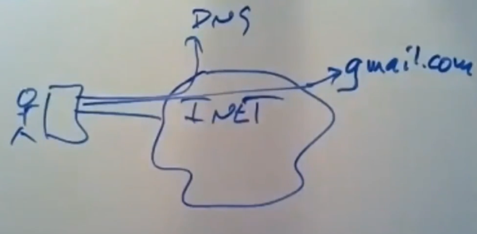
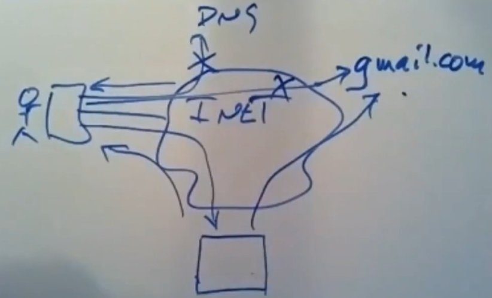
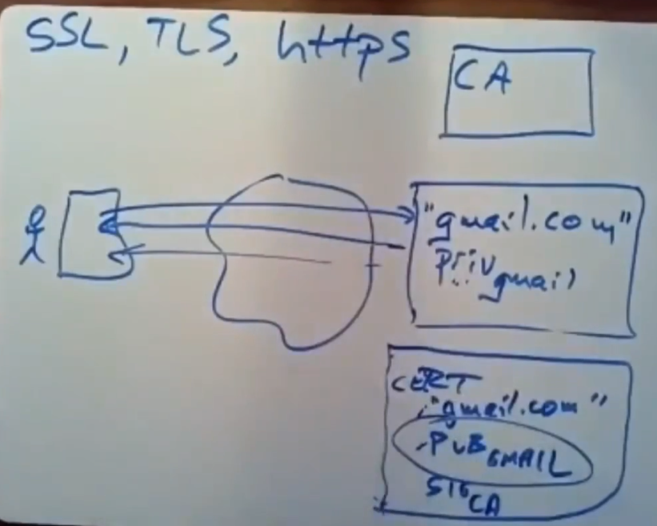
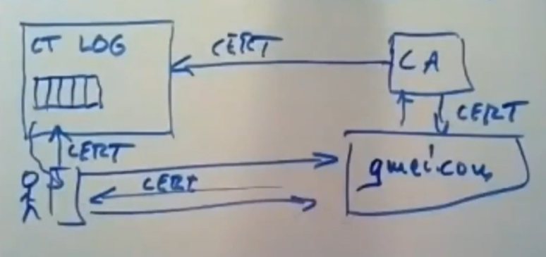
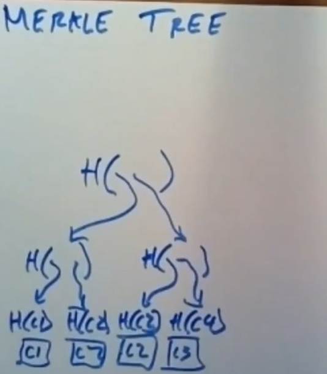
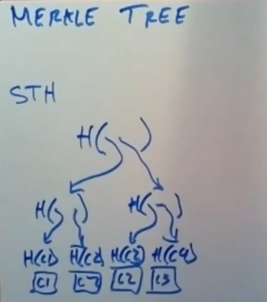
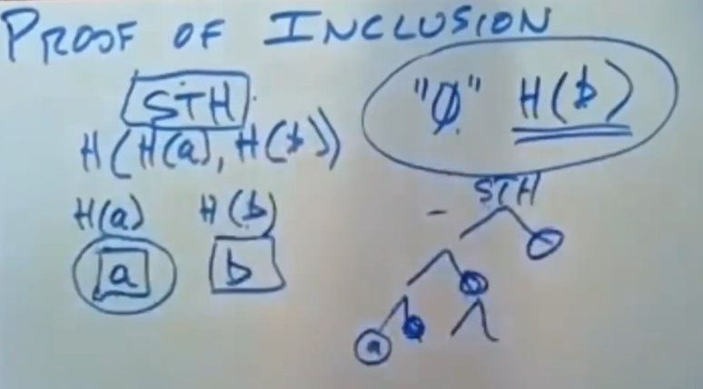
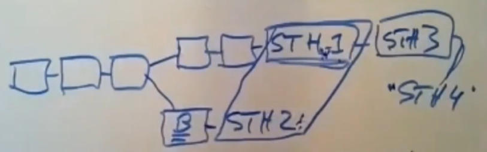
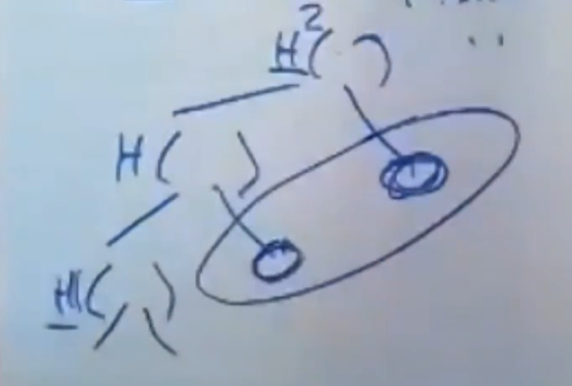
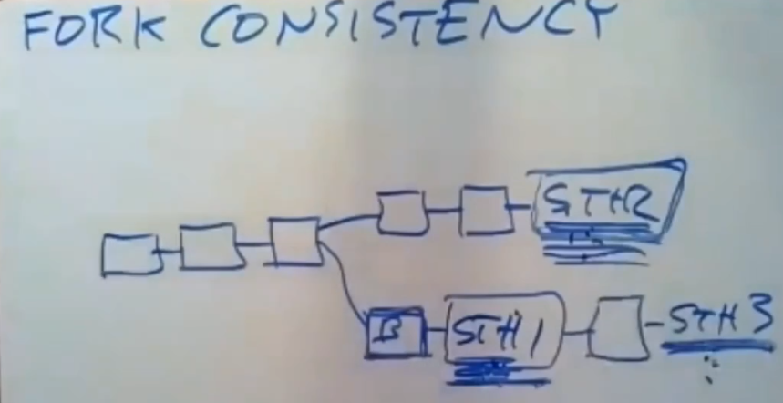

# Fork Consistency

如果系统是对外开放的（即所有人都可以作为系统的一部分），通常不存在那种所有人都普遍信任的机构来运行和保护这个系统，并且系统的参与者通常不信任其他的参与者。

因此当系统的参与者想要与某个特定的参与者通信时就出现了问题，如何确保参与者确实在与它想要与之通信的参与者而不是中间人进行通信。

Certificate Transparency提出了一种解决方案。

## Web Before Certificate Transparency

|Http|MitM|
|-|-|
|||

需要使用Https阻止中间人攻击，而Https依赖证书去证明该站点的公钥确实与站点匹配。

|Https|
|-|
||

这就需要证书颁发机构（CA）去确定证书确实是它颁发的，然而CA可能会说谎（即伪造证书）。

## Certificate Transparency Scheme

### Basic Scheme

Certificate Transparency并不能阻止CA伪造证书的事情发生，但是能及时发现伪造证书。

Certificate Transparency维护一份唯一的证书Log，CA颁发证书时需要将证书（证书包含CA的签名）添加到Log中。

浏览器获得证书时会检查这个Log，确保证书在Log中。

并且每个网站都设置一个对应的监视器，定时获取CT的Log副本。

因为监视器知道正确的证书，所以它能够发现网站的证书是否被伪造。

为了使这个方案都够工作，必须确保以下特性：
* Append Only Log（Log只允许添加不允许删除）。
* No Forks（监视器跟浏览器看到的Log是相同的）。
* Untrusted（无法确信证书服务器是完全正确的）。

### Merkle Tree

Merkle Tree是一种特殊的二叉树。

通常Log服务器需要对`root hash`签名，称为Signed Tree Head（STH）。

当tree需要追加时（将Tree中$0 ~ 2^n - 1$的部分称为`archive`，其他部分称为`active`）：
* 如果追加后，`archive`的长度与`active`相同，`new root hash = hash(root hash,hash(active))`。
* 如果追加后，`archive`的长度与`active`不同，递归进行插入过程，将`active`中$0 ~ 2^n - 1$的部分作为新的`archive`其他部分作为`active`计算hash，`new root hash = hash(root hash,hash(active))`。
* 如果追加后，`archive`的长度与`active`相差`1`，`new root hash = hash(root hash,active)`。

### Proof Of Inclusion

当浏览器询问Log服务器是否包含某个证书时，Log服务器返回：
* 该证书是否存在。
* 该证书在Log中的位置
* Merkle Tree中同一最底层分支另一个叶节点的hash。
* 同一Merkle Tree中其他分支的hash。

这个过程称为包含证明（Proof Of Inclusion，POI）。

这样就能确保证书确实在Log中。

### Fork Attack

Log Server可能说谎（即展示不同的Log给特定的Client），使Log产生了一个分叉（fork）。

Certificate Transparency通过Gossip实现使系统的其他参与者互相核对STH。

### Merkle Log Consistency Proof

然而现实中可能存在STH过期的情况（即在只后Log又添加了更多的证书）。

这时候需要确认某个STH是否包含另一个STH。

如果`H1`是`H2`的前缀，那么`H2`的Log Server必须提供`H1`到`H2`之间所有必须的hash。

如果一个Client在一个fork上，那么它不能切换到另一个fork，这个特性称为Fork Consistency。

这个特性保证产生fork的证据被保留并通过Gossip提交。

