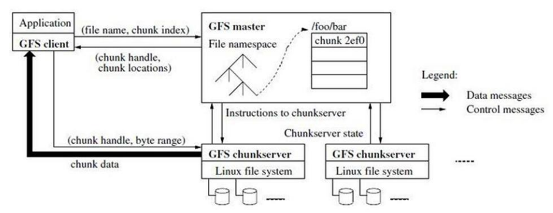
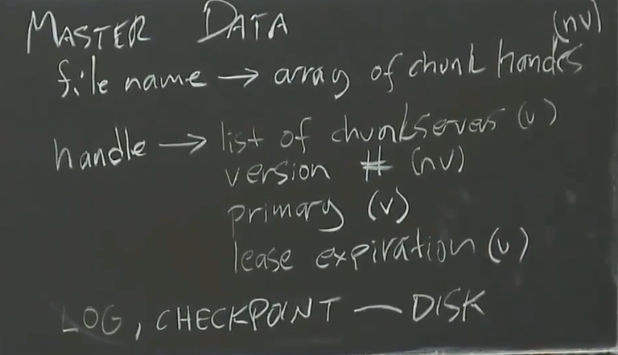
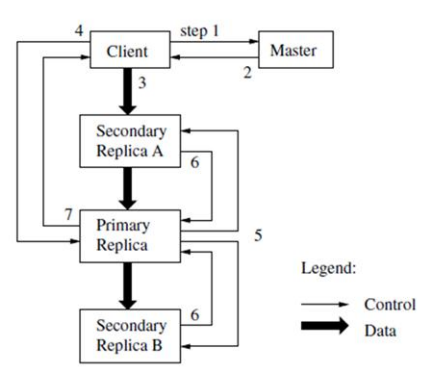
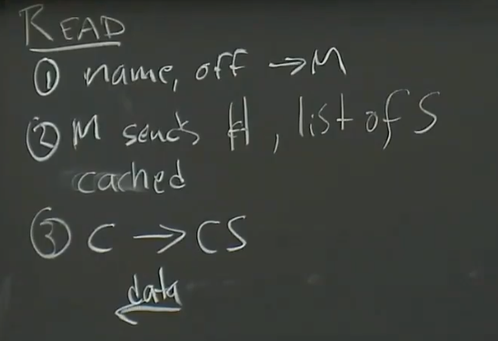
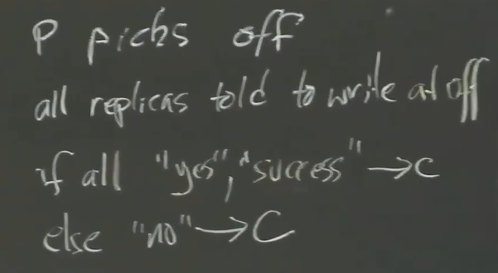
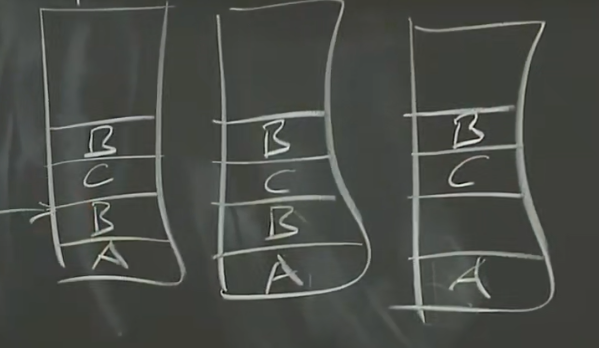

# Google File System

GFS 作为存储平台已经被广泛的部署在 Google 内部（在2003年推出）。目前为止，最大的一个集群利用数千台机器的数千个硬盘，提供了数百 TB 的存储空间，同时为数百个客户机服务。

## Architiecture

整个系统由master server和chunk servers组成。

文件被分割成多个chunk（每一个chunk的大小为64MB），每三个chunk server保存一个chunk（一个是primary chunk server，其他是热备份）。

master server保存了`filename -> chunk list`的映射（in memory），同时该映射需要使用log（Write Ahead Log）进行持久化。

为了防止恢复时间过长，log积累到一定长度会写入一个checkpoint，master将从最新的checkpoint开始恢复。

*NOTE：通常会有“影子”master节点，该节点是master的冷备份（需要手动启用）。*

master server在内存中维护了`chunk -> chunk server list`的映射，但是并持久化它，在master启动时，会轮询每个chunk server获得完整的映射并保存在内存中。

同时对于每一个chunk，master询问每一个chunk server保存的版本号。

*NOTE：每一个chunk server必须在磁盘中保存它持有的chunk的version number，以回答master的询问。*

*NOTE：master必须运行在较为可靠的机器上，而chunk server运行在廉价的商品主机上。*

## Replica

master为每一个chunk的chunk servers分发租约（lease），对于一个chunk来说（3个副本），拥有租约的chunk server称为primary chunk server，其他servers则为primary的热备份，当primary无法续租后，master将从备份中挑选一个server作为新的primary。

每一个lease，都有一个version number（必须持久化），每发放一次lease就要更新一次version number（递增）。

只有持有最新已写入数据的chunk server，才能成为primary chunk server。

*NOTE：这是通过version number实现的，如果一个chunk server知道的version number与master上保存的相同，那么它就能作为primary chunk server。*

可能出现chunk server的version number大于master的情况，这时采用version最大的chunk server作为primary chunk server。

master周期性地对每一个primary chunk server发起ping，当master收到primary chunk server的响应，则称primary chunk server续租成功。

如果master没有收到响应，**则在当前primary的租约过期之后**，递增version并选择新的primary。

*NOTE：不等待lease过期，有产生脑裂的风险。*

当primary发现自己的副本没有对操作进行回应或错误回应，primary通知master修改chunk list重新选择一个chunk server，递增chunk的version number并重新发放lease。

## Apis

对于一个`Read`操作：
1. Client将`(filename,offset)`发送给master。
2. master返回相应的chunk server list。
3. Client从chunk server list中挑选一个最适合的server。
4. 发送对应的offset给chunk server，chunk server返回文件的数据。

*NOTE：Client会缓存master返回的chunk server list，减少询问master的次数。*

对于一个`Write（APPEND）`操作：
1. Client将`filename`发送给master。
2. 如果master发现末尾chunk没有primary，则进行一次lease发放。
3. master返回相应的chunk server list，并标记primary chunk server。
4. Client将数据发送给离自己最近的chunk server。
5. chunk server沿着一条线将data发送给所有的replicas。
6. primary等待数据发送完成，然后发出操作指令，收集所有replicas的回应。
7. 当所有replicas都回应操作成功，primary向client返回success，否则向master报告故障并返回failed。
8. 如果client收到failed，将重试操作。

|Read|Write(Append)|
|-|-|
|||
|-||

可能出现部分写入成功的情况，此时认为写入失败，应用必须能够容忍冗余数据和空白数据。

