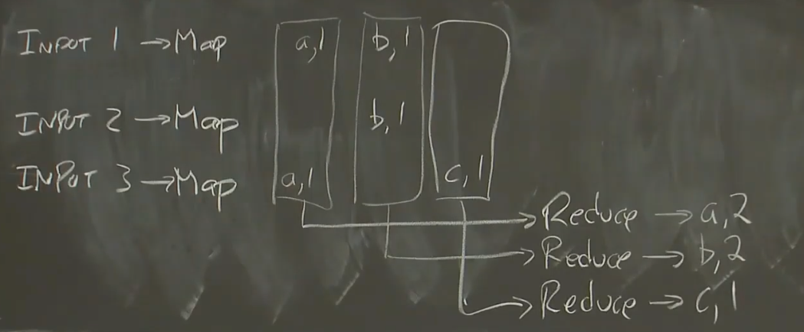
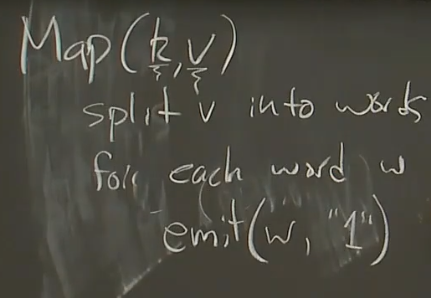
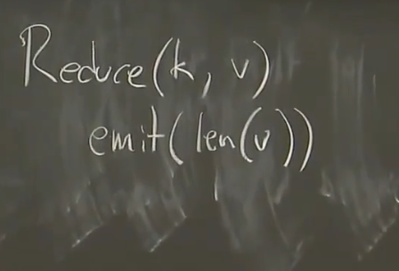
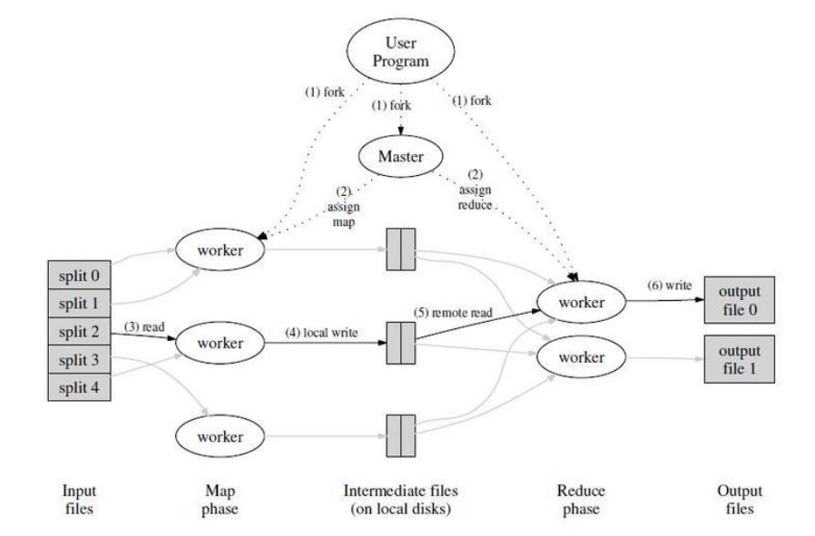
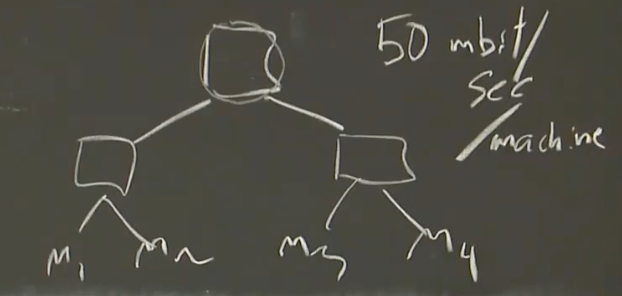

# MapReduce

MapReduce是2004年Google推出的分布式计算编程模型。

非分布式系统工程师编写`Map()`函数和`Reduce()`函数，MapReduce框架负责进行调度和容错。

`Map()`函数的原型为`Map(k,v)`，其中`k`为文件名，`v`为文件内容，其中文件存储在Google File System上（GFS），`Map()`函数通过`emit`将key value pair发送给`Reduce()`。

*NOTE：执行Map的过程称为Shuffling data（数据清洗）。*

`Reduce()`函数的原型为`Reduce(Key,Values)`，其中每一个`KeyValuePair`都是由`Map()`函数`emit`的。

*NOTE：`Reduce()`是个聚合操作，必须等待所有的`Map()`执行完成才能开始。*

|Map|Reduce|
|-|-|
|||

MapReduce通常串联成执行流，`Reduce`的输出会成为下一个MapReduce过程（`Map()`函数）的输入。

## System Model

一个master server组织整个计算过程，master负责将任务调度到worker上。

运行MapReduce的集群同时运行着GFS，master将Input对应的`Map()`调度到同一个机器上以减少网络通信的开销。

每一个worker都必须有全部的`Map()`和`Reduce()`代码，而master不必知道这些代码。

`Map()`产生的结果（称为中间文件）保存在worker的本地磁盘上，同时将其位置传回给master使得其可被执行`Reduce()`的worker寻址。

`Reduce()`必须对产生的中间文件进行排序（如果文件太大，则执行外部排序），以便执行聚合操作。

## Fault Tolerance

master 周期性的 ping 每个 worker。如果在一个约定的时间范围内没有收到 worker 返回的信息，master 将把这个 worker 标记为失效。所有由这个失效的 worker 完成的`Map`任务被重设为初始的空闲状态，之后这些任务就可以被安排给其他的 worker。worker 失效时正在运行的 Map 或`Reduce`任务也将被重新置为空闲状态，等待重新调度。

如果 master 失效，就中止 MapReduce 运算。客户可以检查到这个状态，并且可以根据需要重新执行 MapReduce操作。

影响一个 MapReduce 的总执行时间最通常的因素是“落伍者”：在运算过程中，如果有一台机器花了很长的时间才完成最后几个`Map`或`Reduce`任务，导致 MapReduce 操作总的执行时间超过预期。当一个 MapReduce 操作接近完成的时候，master调度备用（backup）任务进程来执行剩下的、处于处理中状态（in-progress）的任务。无论是最初的执行进程、还是备用（backup）任务进程完成了任务，我们都把这个任务标记成为已经完成。

## Bottleneck

在2004年，该系统的瓶颈为网络。

总交换机的数量会被数据中心中所有的机器均摊，每个机器平均只有`6.25 MB/s`的网络吞吐量，这个速率相对于CPU和硬件较慢。

