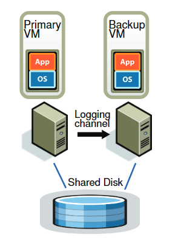
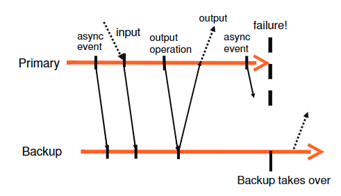
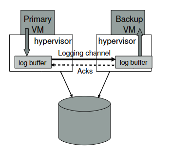

# Primary-Backup Replication

Replication能解决以下故障：
* fail-stop - 单个机器的崩溃。

不能解决以下故障：
* bugs。
* 有关联性的故障。

replication是否值得取决于：
* 需要多少个replica。
* 遭受故障后会产生多少影响。
* 经费是多少。

使用两种不同的方式进行replication：
* State Transfer - 让primary发送他的整个状态副本给replica。
* Replicated State Machine（SMR） - 复制状态机（状态机复制），primary将外部的输入发送给backup（相同的外部输入和相同的顺序将产生相同的输出）。

*NOTE：人们更倾向使用SMR，因为外部输入很可能比状态小。*

某些指令可能会打破SMR（例如获取当前时间），对于这个问题有个通用的解决方案：在primary执行完成后，将primary的输出发送给backup。

*NOTE：SMR只适用于单核，不适用于交错执行的多核。*

当创建一个新的replica时，只能使用State Transfer。

大部分应用都在应用层使用SMR，而不是在机器层面，在应用层使用SMR的后果是必须将SMR设置在应用内部。

在机器层使用SMR则应用可以对SMR一无所知。

## VMware FT

VMware FT使用两个物理机进行replication，它们都使用一个相同的shared disk，并在VMM上运行同一个OS和App。

每个外部输入会由primary发送给backup（VMware FT将这种事件流称为Logging Channel，发送过去的事件称为Log Event）。

同时VMware FT还需要发送中断等操作（因为他是机器级别的SMR）。

但在进行输出时，只有primary能够输出，backup产生的输出将比VMM消除。

VMware FT使用lease机制进行错误检测（通过发送时钟中断的产生的log entry），当primary崩溃时，backup将无法从logging channel上收到任何log entry，此时backup将判断primary故障，自己成为新的primary。

## Replay Method And Output Rule

非确定性事件(如虚拟中断)和非确定性操作(如读取处理器的时钟周期计数器)也会影响 VM 的状态。 对于不确定的操作，将记录足够的信息，以允许使用相同的状态更改和输出复制操作。 对于不确定的事件，如定时器或 IO 完成中断，事件发生的确切指令也会被记录下来。 在重放期间，事件在指令流中的同一点被交付。

为了保证重放机制，有效必须确保backup的执行不会快于primary，VMware FT采用了一个简单的解决方案，维护一个buffer存放外部输入，只要buffer中存在条目才允许backup上的虚拟机执行。

同时在backup成为primary之前，必须确保先执行完buffer中所有的条目，这意味着client可能会看到两次输出（primary一次，上线的backup一次）。

幸运的时使用TCP的client，可以除去这种重复的数据包。

将 VM 的执行划分为 epoch，在其中，诸如中断之类的非确定性事件只在 epoch 结束时交付。 epoch 的概念似乎被用作一种批处理机制，因为它太昂贵了，不能在每个中断发生的确切位置上分别交付它们。 但是，我们的事件交付机制非常有效，VMware 的确定性重放不需要使用 epoch。 每次中断发生时都会被记录下来，并在回放时有效地按适当的指令进行传送。

bounce buffer 是一个临时缓冲区，它的大小与磁盘操作访问的内存大小相同。 将磁盘读取操作修改为将指定的数据读取到 bounce 缓冲区，并且仅在发送 IO 完成时将数据复制Guest上。对于磁盘写操作，首先将发送的数据复制到 bounce 缓冲区，然后将磁盘写修改为从 bounce 缓冲区写入数据。

通过挂起Guest来获取准确的中断产生时间点（引发中断时指令流的位置）。

只有当backup确认了输入，primary才能发送输出（违反可能导致client遇到错误，primary在将输入发送到backup之前崩溃，而已经将响应发送给了client）。

## Split Brains

VMware FT存在脑裂的问题，如果primary和backup之间存在网络分区错误，那么将产生两个primary。

解决这个问题的方式是由外界来决定谁是primary。

部署一个test-and-set服务，只有成功set的replica才能成为primary。