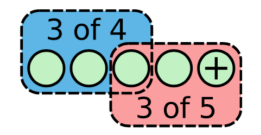
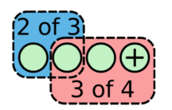
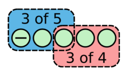
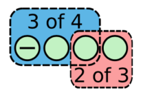
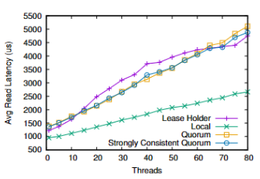
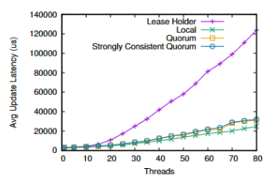
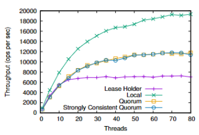
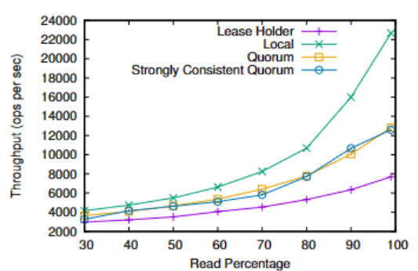

# Raft

## Vote

raft通过majority vote来选择一个leader，同时这个leader必须足够新。

majority vote解决了脑裂的问题（因为整个集群只能有一个majority）。

*NOTE：这意味着集群通常是奇数，偶数集群将浪费一个服务器。*

<code>majority = $\frac{n + 1}{2}$</code>

其中`n`是集群的机器数量，对于raft如果有`2f + 1`个机器，可以承受`f`个机器故障而不失去可用性。

赢得选举的要求：
* 节点在可用的majority中具有最长的log。
* 节点的最后一个log最新或和可用的majority中的其他节点一样新（即term最大）。

对于每一个term：
* 要么存在一个leader。
* 要么不存在leader（选票被平分）。

每一个节点将在区别`[a,b]`中随机选取一个时间点作为自己的选举计时器超时时间点。

当计时器超时时：
1. 递增当前任期。
2. 发起选举。
3. 重置选举计时器（重新在`[a,b]`之间选择一个时间点）。

## Heartbeat & Half Synchronized Replication

Leader周期性的向所有跟随者发送心跳包（即不包含日志项内容的附加日志项 RPCs）来维持自己的权威。如果一个跟随者在一段时间里没有接收到任何消息，也就是选举超时，那么他就会认为系统中没有可用的Leader,并且发起选举以选出新的Leader。

Raft 维护着以下的特性：
* 如果在不同的日志中的两个条目拥有相同的索引和任期号，那么他们存储了相同的指令。
* 如果在不同的日志中的两个条目拥有相同的索引和任期号，那么他们之前的所有日志条目也全部相同。

当一个log被复制到majority时就认为它被commit（与leader是否设置commit index无关）。

当log被commit，Raft保证只要集群中的majority可用，该log就不会丢失。

Leader处理不一致是通过强制跟随者直接复制自己的日志来解决了。这意味着在跟随者中的冲
的日志条目会被Leader的日志覆盖。要使得跟随者的日志进入和自己一致的状态，Leader必须找到最后两者达成一致的地方，然后删除从那个点之后的所有日志条目，发送自己的日志给跟随者。所有的这些操作都在进行附加日志 RPCs 的一致性检查时完成。

对于每一个节点，leader维护了：
* `matchIndex` - 该节点与leader同步的log的index。
* `nextIndex` - 下一个应该向该节点发生的log的index。

如果一个跟随者的日志和Leader不一致，那么在下一次的附加日志 RPC 时的一致性检查就会失败。在被跟随者拒绝之后，Leader就会减小 `nextIndex` 值并进行重试。最终 `nextIndex` 会在某个位置使得Leader和跟随者的日志达成一致。

一旦log被复制到majority（即commit），leader就可以回复client向client做出持久化承诺，而不需要等到其余慢速的replicas（称为“半同步复制”）。

随着越来越多的客户请求，Raft 的日志在正常运行期间会不断增长。随着它变得越来越大，它会占用更多的空间，同时也需要更多的时间来回放。如果没有压缩日志的方法，最终将导致可用性问题：即服务器存储空间不足，或者启动时间太长。因此，任何实际系统都需要某种形式的日志压缩，一旦状态机完成了快照的写入，就可以将日志截断。

当Follower过于落后时，快照取代Log被发送到Follower上。

然而快照的断点续传是不可能的：
* 当Leader失败后，新的Leader不一定具有与原Leader相同的快照。
* 当Follower失败后，Leader没有手段判断出Follower接收快照的进度（无法区分是chunk被接收，回复丢失；还是chunk丢失）。

*NOTE：在实践中实现这种trick的难度也非常大。*

## Linearizability

Linearizability（线性化）指分布式系统表现得如同单机，即强一致性。

要实现Linearizability，对于Write操作：
* 为每一个Client的请求进行独立的编号，以过滤重复的请求。
* 编码必须同步到Replicas上。

对于Read操作：
* Leader只在Append Entries发送到Majority成功时，提供读取操作。
* 或者每一次读取都进行Logging。

## Change Membership

Raft 限制了允许的更改类型：一次只能从集群中添加或删除一个服务器。成员更改中更复杂的更改是通过一系列单服务器更改实现的。

当向集群中添加或删除单个服务器单个服务器时，旧集群的任何多数与新集群的任何多数重叠。这种重叠阻止了集群分裂成两个独立的Majority。

|Add（1 -> 4）|Add（1 -> 3）|Remove（1 <- 5）|Remove（1 <- 4）|
|-|-|-|-|
|||||

集群配置使用复制日志中的特殊条目进行存储和通信。这利用了 Raft 的现有机制来复制和持久化配置信息。通过对配置更改和Client请求进行排序（允许两者在管道或批处理被同时复制），它还允许集群在进行配置更改时继续为Client请求提供服务。

当Leader收到从当前配置（Cold）中添加或删除服务器的请求时，它将新配置（Cnew）作为一个条目添加到其日志中，并使用常规的 Raft 机制复制该条目。新配置一旦添加到服务器的日志中，就会在这个服务器上生效：Cnew 条目被复制到 Cnew 指定的服务器上，而大部分服务器的新配置生效被用于确定 Cnew 条目的提交。这意味着服务器不会等待配置条目被提交，并且每个服务器总是使用在其日志中找到的最新配置。一旦提交了 Cnew 条目，配置更改就完成了。此时，Leader知道大多数的 Cnew 指定的服务器已经采用了Cnew。它还知道，没有收到 Cnew 条目的任意服务器都不能再构成集群的大多数，没有收到 Cnew 的服务器也不能再当选为Leader。

当服务器被添加到集群中时，它通常不会存储任何日志条目。如果以这种状态将它添加到集群中，那么它的日志可能需要相当长的时间才能赶上Leader的日志，在此期间，集群更容易出现不可用的情况。例如，一个包含三个服务器的集群通常可以容忍一个故障而不损失可用性。但是，如果向同一集群添加了第四个服务器，其中有一个日志为空，并且原来的三个服务器之一出现故障，则集群将暂时无法提交新条目。

Raft 在配置更改之前引入了一个附加阶段，其中一个新服务器作为无投票权成员加入集群。Leader复制日志条目到它，但出于投票或提交目的，尚未计入多数。一旦新服务器赶上了集群的其余部分，就可以按照上面的描述进行重新配置。

Leader需要确定什么时候一个新的服务器已经赶上进度从而可以继续进行配置更改。这需要注意保持可用性：如果服务器添加得太快，集群的可用性可能面临风险。

如果新服务器不可用或速度太慢以至于永远无法赶上，则Leader还应中止更改。

## Tricks

### Prevote

如果一个服务器要开始选举，它首先要检查它是否浪费了每个人的时间——它有机会赢得选举。这为选举引入了一个新阶段，称为预投票阶段。候选人首先会询问其他服务器其日志是否足够新以获得他们的投票。只有当候选人相信自己能从集群中的大多数人那里获得选票时，他才会增长任期编号并开始正常的选举。

### Batch

Append Entires的接口天然支持batch commit。

leader可以收集一段时间的entries，再一次性地复制给follower以减少消息数量。

### Pipeline

当 Raft 算法响应读写请求时，基本的 Raft 过程在 Leader 与其 Follower 之间执行：
1. Leader 从 Client 接收请求。
2. Leader 将请求附加到其日志中。
3. Leader 向 Follower 发送新的日志条目，而 Follower 则将这些条目附加到自己的日志中。
4. Leader 等待其 Follower 的响应。如果法定数量节点成功响应，那么 Leader 就会提交请求并在本地应用
它。
5. Leader 将结果发送给客户端，并继续处理传入的请求。

第二步和第三步可以并行进行，因为二者之间没有依赖关系。因此，Leader 可以在本地附加日志的同时向Follower发送日志。即便附加日志在Leader上失败，只要Majority的Follower能够成功附加日志，就仍然可以提交日志。在第三步中，当向Follower发送日志时，Leader缓冲日志条目并批量发送给其Follower。

发送日志后，Leader不必等待Follower响应。相反，可以假设发送成功，并使用预测的日志索引发送进一步的日志。如果出现错误，Leader将调整日志索引并重新发送复制请求。

基于上述优化，Raft 流程更新如下：
1. Leader 接收来自 Client 的请求。
2. Leader 向 Follower 发送相应的日志，并在本地并行追加日志。
3. Leader 继续接收客户端的请求并重复步骤（2）。
4. Leader 提交日志并将其发送到要应用的另一个线程。
5. 应用日志后，Leader 将结果返回给客户端。

### Commit Index In Append Entires Response

当附加日志 RPC 的请求被拒绝的时候，跟随者可以包含自己的Commit Index（以last appiled进行初始化）在response中返回给leader。

*NOTE：这种trick只能在磁盘状态机中使用。*

### Conflict Index In Append Entires Response

当附加日志 RPC 的请求被拒绝的时候，跟随者可以包含冲突的条目的任期号和自己存储的那个任期的最早的索引地址。借助这些信息，Leader可以减小 nextIndex 越过所有那个任期冲突的所有日志条目；这样就变成每个任期需要一次附加条目 RPC而不是每个条目一次。

*NOTE：论文作者十分怀疑这种优化在实践中是否是必要的，因为失败是很少发生的并且也不大可能会有这么多不一致的日志。*

### Quorum-Based Read

Quorum-Based Read可以不通过leader进行线性化读。

Client向大多数服务器发送读取请求用于读取key，每个节点在回复时都有一个时间戳和数据，对应于该节点上最新的稳定值。由于已提交的值必须存在于任何大多数服务器中的一个，对应于最高时间戳的值是最新已提交的值。

读取请求要么以仲裁读取（Quorum-Based）的方式执行，要么以租约持有人（Leader）读取的方式执行，这样，读取请求就会在所有节点上统一分配。

使用租约持有者读取和仲裁读取的组合，我们可以保证一致的读取，同时不会使租约持有者超载。此外，所有集群成员都将用于服务读取请求，租约持有者不会成为瓶颈。可以根据所需的读取和写入延迟权衡配置使用仲裁读取服务的读取部分。由非租约持有者节点提供更高比例的读取可以帮助减少租约持有者的负载并减少写入延迟，但代价是读取延迟和增加非领导节点的负载。

|读延迟|写延迟|吞吐量|吞吐量（随读负载百分比变化）|
|-|-|-|-|
|||||