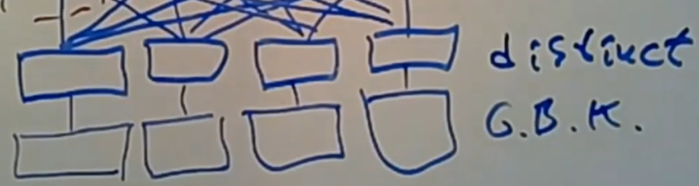

# Spark

Spark是MapReduce的后继产物，在大数据计算中被广泛使用。

## Lineage Graph Schedule

spark将操作分成transformations和actions。

只有当actions被调用Spark才会实际计算Lineage Graph。

transformations分为两种：
* 窄依赖（narrow dependencies）。
* 宽依赖（wide dependencies）。

*NOTE：每一个方框表示一个 RDD , 带有颜色的矩形表示分区。*

一个transformation需要执行，必须等待它的依赖准备完成：
* 对于窄依赖来说，这个条件很容易达到。
* 对于宽依赖来说，必须等待他的上一步被完全执行完成。

同时对于窄依赖transformation，它完全可以在拥有数据的机器上执行（减少网络通讯）。

*NOTE：MapReduce的map是窄依赖，reduce是宽依赖。*

一旦一个transformation能被执行，driver就会让worker执行这个transformation。

*NOTE：driver和worker类似于MapReduce的master和worker。*

宽依赖需要worker之间的网络通讯才能完成，因此spark将尽可能减少宽依赖。

实际上spark能够对生成的lineage graph进行优化，例如`distinct`之后进行`groupByKey`的两个宽依赖操作可以被优化为一个。

## Resilient Distributed Datasets

在调用actions时，spark会重新计算对应的schedule。

为了让spark将结果缓存在worker的内存中需要显式调用`cache()`，类似地将结果缓存在分布式文件系统上需要调用`persist()`。

当某个worker故障时，必须重新计算worker负责的任务。

对于一个只有窄依赖的schedule中这个过程很容易，只需要：
* driver启动一个新的worker。
* 读取负责分区的输入
* 重新计算。

然而对于含有宽依赖的schedule来说，重新计算的成本较大（因为其他worker不会保存之前的输出而宽依赖需要其他worker的输出）。

|Wide Dependencies Failure|
|-|
||
||
||

为了减少恢复的成本，spark允许我们为特定的transformation创建checkpoint。

通过对宽依赖的输出调用`persist()`，spark将这些输出保存到分布式文件系统中。

当worker故障时，spark就可以知道宽依赖的输出已经被持久化，可以跳过一部分的计算。