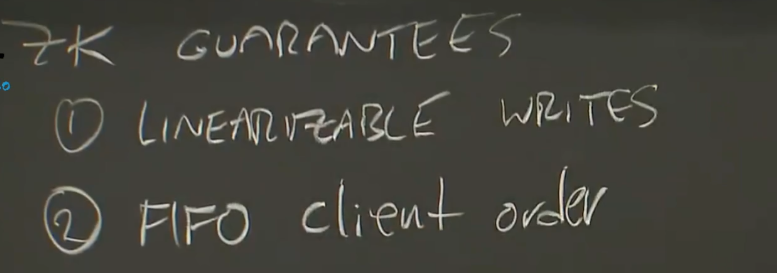
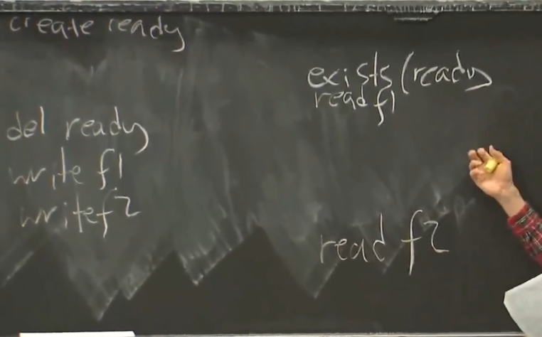
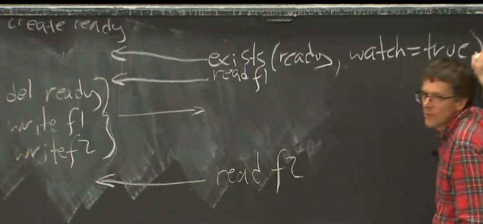

# Zookeeper

线性化（Lineariazability）：操作在调用和完成操作之间的一个时间点上对整个系统生效，一旦客户端完成对一个数据中心中的对象的写入操作，所有其他数据中心中对同一对象的读取操作将反映其新写入的状态（不允许读到旧数据）。

*NOTE：对于一个线性化的系统，在丢包时返回陈旧的数据是合法的（例如在丢失RPC结果时重传响应，这个响应可能是陈旧的）。*

## Scalability Of Replicated System

在复制系统中，增加`n`倍的服务器可能不会带来`n`倍的性能提升：
1. 在强一致的系统中，只有一个Leader能够处理请求。
2. 由于星型拓扑，性能反而与`n`成反比。

一种提升性能的方法是允许replicas处理读请求，但可能会损失一致性。

Zookeeper的解决方案：不提供线性化的读，只提供线性化的写。

Zookeeper提供两个保证：
* 线性化写入 - 并发的写入以某种确定的顺序原子地执行。
* FIFO Client顺序保证 - Client能够定义操作的执行顺序。

对于读操作，zookeeper只提供类似“读自己的写”级别的保证：
1. 后续的读操作，不会读到比前面的读操作更早的数据。
2. 在客户端写入时，一定能够在后续的读取中读到自己的写。

对于每一个写操作，zookeeper都使用`zxid`进行编号，在写入时这个编号随着响应返回Client。

Client在读取时，将`zxid`发送给replica，只有该`zxid`的log已被应用的replica才能为Client服务。

同时，在读取操作完成时，replica目前最大的`zxid`也会随着响应返回，Client用这个`zxid`更新自己的`zxid`保证不会读取到更旧的数据。

## Watch Mechanism

在一个典型的配置更新操作中：

对于配置的更新者（Writer）：

1. 首先删除ready文件。
2. 修改多个配置文件。
3. 然后重新创建ready文件。

然而，此种顺序在zookeeper中，并不够确保配置更新的原子性。

其他Client可能在读到旧的ready的同时读取到不完全更新的配置文件。

Watch机制被设计出来避免这点。

在读取时，Client可以同时为某个键设置一个Watch，这样当该键的状态改变，或者replica崩溃时（以便Client重建Watch）都将收到通知。